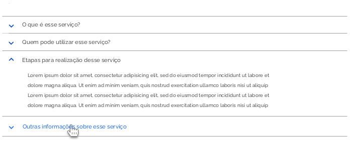
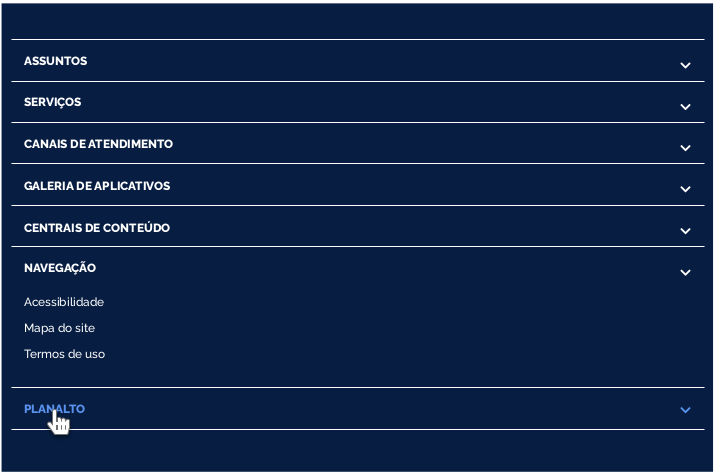
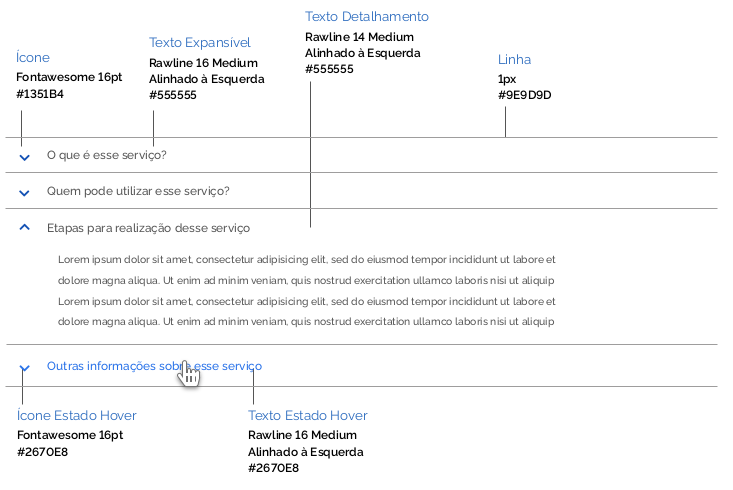

# Acordeão

  

O arcodeão serve para que o usuário visualize mais informações sobre um conteúdo, já que permite que o item inicialmente exibido na tela em forma de sentença, seja expandindo mostrando o detalhento daquele item. 

Seu uso é indicado em conteúdos extensos, especialmente em interfaces de dispositivos móveis, a fim de diminuir a densidade de informações para o usuário. 

Recomenda-se evitar o uso de acordeões dentro de outros, pois esse tipo vai contra as melhores práticas de UX. O acordeão do Design System permite que várias seções sejam expandidas simultaneamente. Um ícone de sinal de "∨” é utilizado para indicar a ação “expandir e de "∧”para recolher, embora toda a área de um item da lista seja clicável.

  

---
## Tipos de Acordeão
  

#### 1 | Acordeão Positivo

O acordeão positivo pode ser aplicado em sistemas e também no Portal Único. Ele deve vir sobre background claro e segue a seguinte formatação: 

#### 2 | Acordeão Negativo 
O acordeão negativo é aplicado sobre o rodapé do Portal Único. Ele deve vir sobre background azul escuro e a tipografia deve se apresentar de forma maíuscula destacando os itens sobre o background escuro. Os ícones para expandir o item, aparecerem à direita do componente.

### Estados do Acordeão
Estados do Acordeão Os estados dos acordeão servem para dar feedback ao usuário sobre a intereção do usuário ao expandir, recolher, ou passar o mouse por cima de um item da lista.

#### A | Normal 
O estado padrão do Acordeão, como ele é exibido naturalmente na interface. 
#### B | Click 
Acontece quando se clica num item da lista e o mesmo se expande exibindo o conteúdo. Nessa situação o ícone de “+” é substituído pelo de “-“ indicando ao usuário, que o clique nos elementos do item expandido tem a ação de esconder o conteúdo 
#### C | Hover 
O estado quando o cursor do mouse está sobre o item a ser expandido ou recolhido. Nesse caso, tanto o ícone quanto o texto assumem outro tom de azul, sinalizando ao usuário a interação. 

## Anatomia

### Tom de Voz do Acordeão 
O tom de voz do acordeão é, essencialmente, como ele vai comunicar qual assunto se trata, deixando claro para o usuário que assunto ele vai encontrar em cada detalhamento dos itens. 
Recomenda-se, sempre que possível, a utilização de uma sentença, clara e sucinta, um resumo que determine de forma objetiva qual conteúdo será exibido. Evitar uso de siglas ou expressões que não são reconhecidas ao público em geral. Não exceder uma linha de texto. O detalhe de cada item deve aparecer quando o item for expandido. 

### Formatação do Texto 

#### 1 | Acordeão Positivo 

Os textos dos itens foram formatados em letras minúsculas com **a primeira letra maiúscula.** 

#### 2 | Acordeão Negativo 

Os textos dos itens expansíveis serão exibidos em maiúsculas, para facilitar a leitura sobre fundo escuro e garantir a hierarquia visual dos itens do menu no caso do rodapé de portais e sistemas. 

### Alinhamento 

#### 1 | Acordeão Positivo 

Os itens aparecem separados por uma linha de contorno cinza e os ícones aparecem alinhados entre si, antes do texto. 

#### 2 | Acordeão Negativo 

No acordeão negativo os itens também aparecem separados entre si por uma linha de contorno branca e os itens de texto vêm antes que os ícones. Esses aparecem do lado direito do componente.

### Espaçamentos 

Seguem as métricas definidas para os espaçamentos dos acordeões. Todas as medidas foram definidas com valores múltiplos de 4px. 

### Tipografia e Cor 

#### 1 | Acordeão Positivo 

#### 2 | Acordeão Negativo

