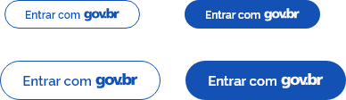
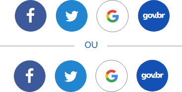
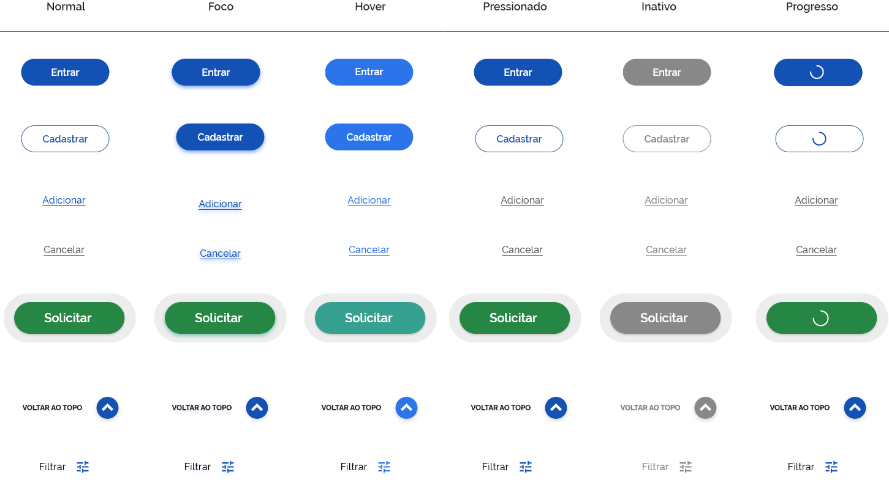
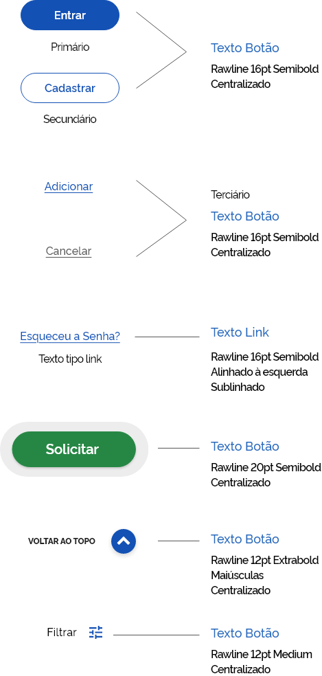
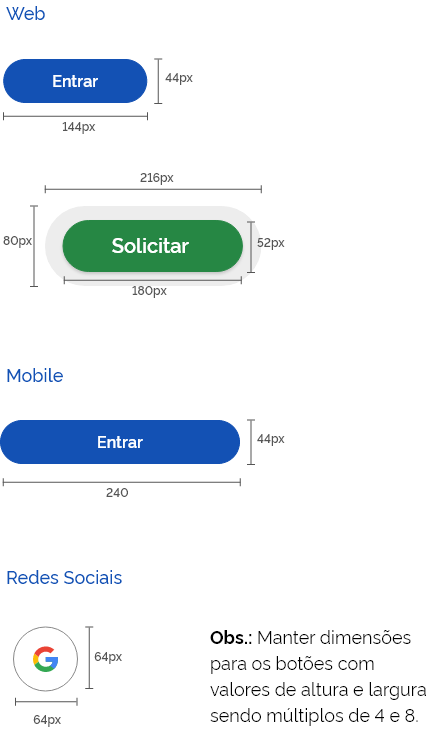
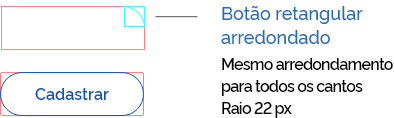

# Botões

Existem, por padrão, 02 grupos de botões:

**Botões Finalísticos** (Botões Principais, Secundários e Terciários) 

**Botões Internos** (Botões contextuais e Botões de Ação)

## Botões Finalísticos

**Botão Principal ou Primário** (alta ênfase)

São botões que possuem maior ênfase pela sua importância. São representados com preenchimento de cor e(ou) sombra.

**Botão Secundário ou Delineado** (média ênfase)

São usados para dar uma ênfase intermediária, menor que os botões principais, além de serem representados visualmente pelo seu contorno delimitado por uma linha fina, sem cor, e sem preenchimento (vazado). Também chamados de "botões fantasmas".

**Botão Terciário** (baixa ênfase)

São botões que possuem características de hiperlinks. 

**Botão Acesso Gov.Br**

São botões que facilitam o acesso aos sistemas através de um login prévio através do **gov.br**.

## Botões Internos

**Botão de ação (call to action)**

São botões usados para incitar um visitante a realizar determinada ação dentro do seu site.

Possue características de construção (cor, forma, dimensão) diferenciada. São representados com preenchimento de cor e uma borda que ajuda a ancorá-lo em qualquer lugar da tela. 

**Botões Contextuais** (baixa ênfase)

São botões que assistem a navegação do usuário.

**Botão de ação de flutuação**

**Botões com ícones**

## Estados

Os estados dos botões servem para dar feedback ao usuário sobre as ações que estão acontecendo quando há uma interação com o botão.

**Normal**

O estado padrão do botão, como ele é exibido naturalmente na interface. 

**Foco**

Não costuma ser muito utilizado, mas ele mostra o botão com uma luz clara ao redor. Você verá esse estado mais presente em campos de formulários.

**Hover**

O estado quando o cursor do mouse está sobre o botão.

**Pressionado**

Acontece quando clicamos e mantemos o clique ou também pode ser visto em situações onde temos mais de uma opção para escolher.

**Inativo**

Botões inativos são indicados com a cor cinza e sua ação está nativa.

**Progresso**

O estado que indica que uma ação ainda está acontecendo.

**ORIENTAÇÕES**

Cor nos botões sinaliza uma chamada à ação. Por esse motivo, o botão terciário "Cancelar" não deve ter grande destaque em comparação com os demais botões, porque não haverá nenhuma alteração no sistema após este ser pressionado. Como o botão "Cancelar" nunca deve ser enfatizado com cores em seu estado "Normal".
Sugerimos então, a utilização da cor neutra #888888.

## Anatomia

**Tom de voz do botão**

O tom de voz de um botão é, essencialmente, como ele vai comunicar qual é a sua ação, além de estar alinhado
com o tom de voz da sua marca, além de orientar de forma clara qual ação esperada.

Quando houver a necessidade da criação de um botão, é esperado que este informe qual a sua ação, reduzindo ao máximo falsas expectativas e dúvidas aos usuários.

Recomendamos, sempre que possível, a utilização de verbos de ação no infinitivo.
Ex.: “Baixar”, "Continuar", "Anexar”, etc

**Formatação do Texto**

Os textos dos botões precisam ser formatados em letras minúsculas com a primeira letra maiúscula. Ex.: **E**ntrar

**Alinhamento**

### BOTÕES FINALÍSTICOS

**Botões primários**:

devem ser alinhados à direita da macha da tela.

**Botões secundários**:

normalmente se situam ao lado do botão primário na página observando o devido espaçamento entre ele o primário.

**Botões terciários**:

No caso do "Cancelar" deve estar alinhado ao lado esquerdo da ação principal. Nos demais casos podem ser posicionados próximos às ações.

### BOTÕES INTERNOS

Podem ser posicionados de acordo com a necessidade das ações.

**Tipografia**

**Sombra Iluminação**

**Dimensão**

**Arredondamento**

**Espaçamento mínimo sugerido entre botões**

