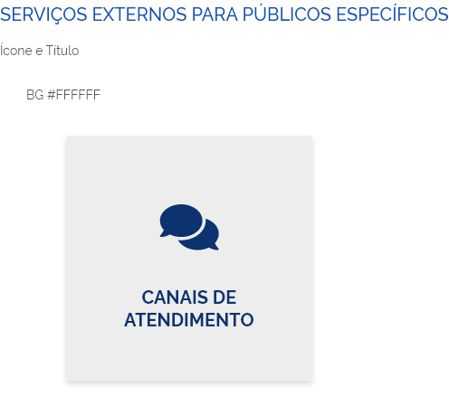
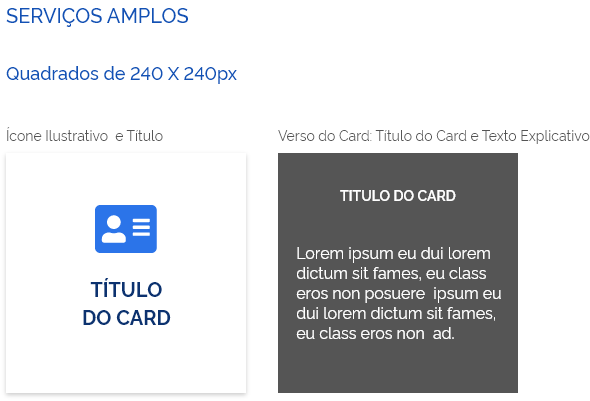
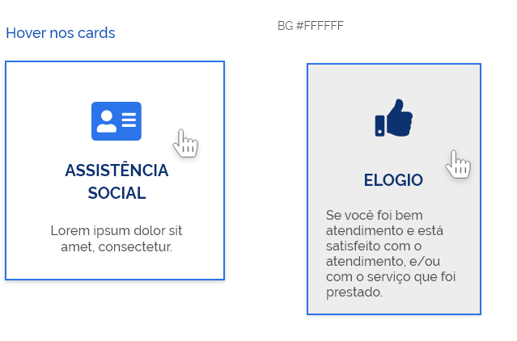
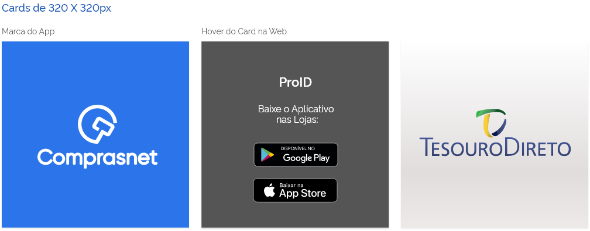
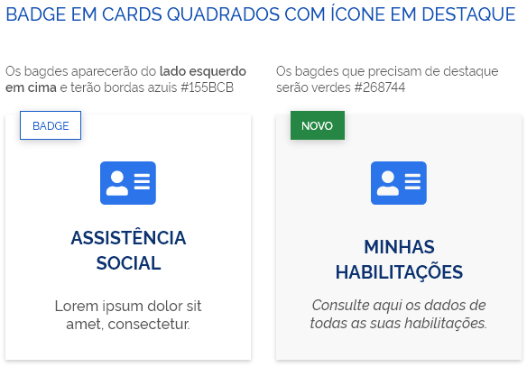
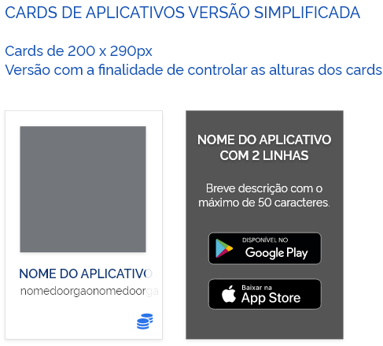
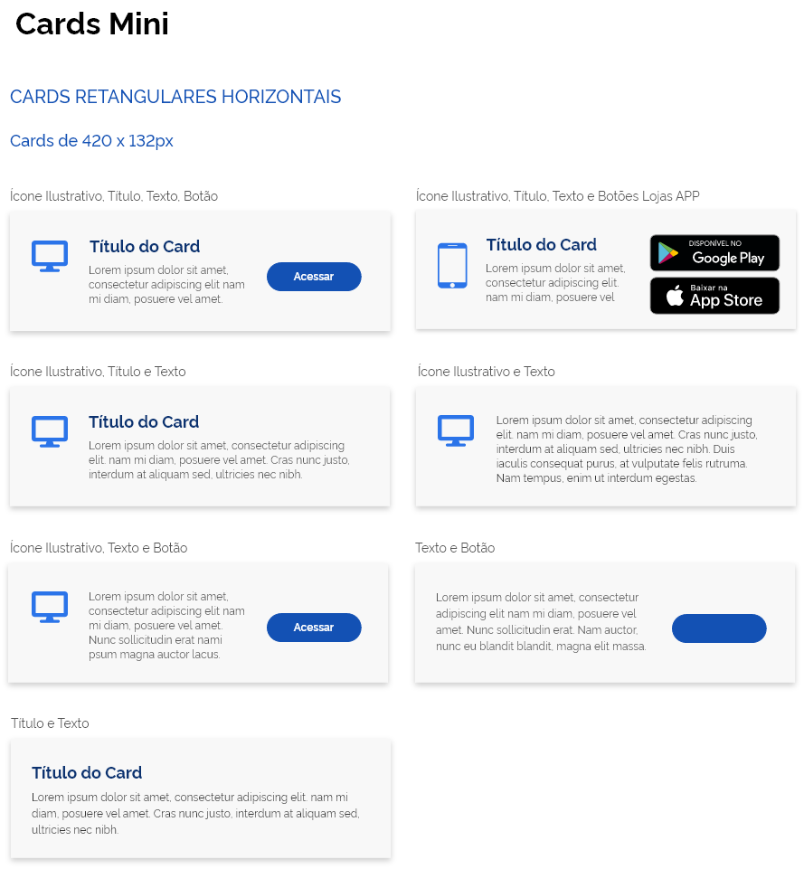

## ANATOMIA

Cards podem ter formatos e conjuntos de informações distintos de acordo com a necessidade de informações que ele deva conter.

### CORES

No caso do portal, os cards que levam para serviços internos que aglutinam um conjunto de ações são brancos #FFFFFF em fundo #F8F8F8

Mas caso o background da tela for outro cinza ou colorido o card será branco.

Os ícones ilustrativos variam de cor devido a função do card.
De modo geral #2B7439, e nos casos específicados #OC326F

## ORIENTAÇÕES DE USO

### CARDS DE 272 X 272PX

No portal devem ser usados em páginas temáticas, como:

- cards de serviços contextuais;
- cards de serviços externos para público específico;
- cards de links simples.

---

# Card

## ANATOMIA

Cards podem ter formatos e conjuntos de informações distintos de acordo com a necessidade de informações que ele deva conter.

### CORES

No caso do portal, os cards que levam para serviços internos que aglutinam um conjunto de ações são brancos #FFFFFF em fundo #F8F8F8

Mas caso o background da tela for outro cinza o colorido o card será branco.

Os ícones ilustrativos variam de cor devido a função do card.

De modo geral #2B74E9, e nos casos especificados #OC326F.

## ORIENTAÇÕES DE USO

### CARDS DE 240 X 240PX

No portal devem ser usados na home como cards de serviços que nos levam para páginas de opções do serviço.

### COMPORTAMENTO

Ao passsar o mouse em cima do card haverá uma interação de fade. Quando assumirá a cor #555555 e os texto ficarão na cor branca #FFFFFF;

**Essa versão de "hover" ocorrerá apenas na versão web.**

### CARDS DE 216PX

#### COMPORTAMENTO

Eles podem aumentar a altura em função do texto explicativo que venha publicado nele.

## ESTADOS

Os cards podem apresentar o hover no caso da web.

---

# Card

## ANATOMIA

Cards de aplicativos podem ter formatos e conjuntos de informações distintos de acordo com a necessidade de informações que ele deva conter.

## ORIENTAÇÕES DE USO

### CARDS DE 272 X 344PX E 320 X 320PX

No portal devem ser usados para encaminhar os usuários para a loja de aplicativos

### COMPORTAMENTO

Ao passar o mouse em cima do card haverá uma interação de fade. Quando assumirá a cor #555555 e os textos ficarão na cor branca #FFFFFF.

**Essa versão de "hover" ocorrerá apenas na versão web**

---

# Cards com Badge

## ORIENTAÇÕES DE USO

Os cards podem receber marcações para identificar algum comportamento ou criar alguma distinção e/ou gerar agrupamentos.

Normalmente se aplicará nos cards quadrados em função do aspaçamento que é tomado pelo Badge.

### COMPORTAMENTO

O badge funciona apenas como uma etiqueta.

Os mais usuais deve ser aplicados apenas com o contorno e texto azul #155BCB.

Os outros podem trazer alguma distinção que o destaque dos demais, normalmente temporária. Neste caso se aplica a cor #268744 na forma e texto em negativo #FFFFFF.

---

# Cards Retangulares

## ORIENTAÇÕES DE USO

### CARDS DE 200PX E ALTURA VARIÁVEL

Trata-se de um card que prevê todos os elementos: imagem, título em 2 linhas, texto descritivo com extensão livre e ícone.

E o hover trás o Título em 2 linhas, texto descritivo com área restrita, tags das lojas.

### COMPORTAMENTO

Ao passar o mouse em cima do card haverá uma interação de fade. Quando assumirá a cor #555555 e os textos ficarão na cor branca #FFFFFF.

**Essa versão de "hover" ocorrerá apenas na versão web.**

## ORIENTAÇÕES DE USO

### CARDS DE 200 X 290PX

Trata-se de um card que prevê todos os elementos: imagens, título em 2 linhas, texto descritivo e ícone.

A proposta é estabelecer as **dimensões fixas** do card de modo que ele possa ser utilizado em uma grid fixa.

E o hover trás o Título em 2 linhas, texto descritivo com área restrita, tags das lojas.

### COMPORTAMENTO

Ao passar o mouse em cima do card haverá uma iteração de fade. Quando assumirá a cor #555555 e os textos ficarão na cor branca #FFFFFF;

## ORIENTAÇÃO DE USO

### CARDS DE 272 X 460PX

Trata-se de variações do card retangular de altura fixa.

Com maior possibilidade de aplicação de ícones funcionais, botões primários e secundários.

---

# Cards Retangulares

## ORIENTAÇÕES DE USO

### CARDS DE 272 X 460PX

Trata-se de variações do card retangular de altura fixa.

Com possibilidade de aplicação de ícones ilustrativos e funcionais, títulos, subtítulos, textos mais longos, cerca de 432 caracters e botão primário.

## ORIENTAÇÕES DE USO

### CARDS DE 272 X 504PX

Trata-se de variações do card retangular de altura fixa.

Com possibilidade de aplicação de carrossel e suas variações de diagramação prevendo imagem, título, subtítulo e ícone ilustrativo.

## ESTADOS

Os cards podem apresentar o hover no caso da web.

---

# Cards Mini

## ORIENTAÇÕES DE USO

### CARDS DE 420 X 132PX

Trata-se de variações horizontais do card de altura fixa.

Com possibilidades de aplicações de diversas diagramações utilizando ícones ilustrativos, títulos, textos de alturas fixas e botão primário e tags de acesso às lojas de aplicativos.

## ESTADOS

Os cards podem apresentar o hover no caso da web.

---

# Card Quadrado

## ORIENTAÇÕES DE USO

### CARDS DE 562 X 562PX

Trata-se de uma aplicação do card quadrado.

Com possibilidade de aplicação de imagem, título, texto curto e botão secundário.

---

# Cards Horizontais

## ORIENTAÇÕES DE USO

### CARDS DE 368 X 168PX

Trata-se de variações horizontal do card de altura fixa.

Com função de link para outras páginas.

Com possibilidade de aplicações de diversas diagramações utilizando ícones ilustrativo, chapéus, títulos e textos curtos de alturas fixas.

## ORIENTAÇÕES DE USO

### CARDS DE 368 X 224PX

Trata-se de variações horizontal do card de altura fixa.

Com função de link para outras páginas.

Com possibilidade de aplicações de diversas diagramações utilizando ícones ilustrativos, chapéus, títulos e textos curtos de alturas fixas.
