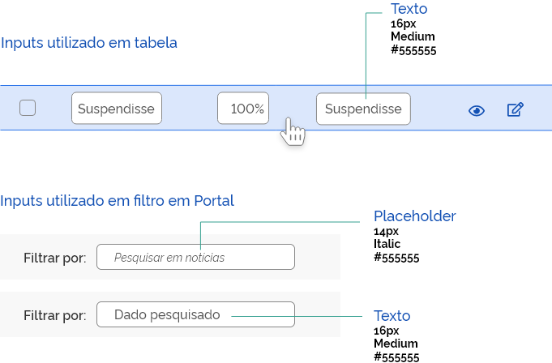
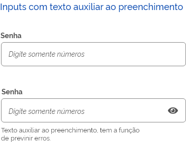

# Campos de texto

## ANATOMIA

São elementos usados pelos usuários para digitar textos. Devem ser acompanhados de rótulos que descrevam a informação que o usuário deve digitar.

## ESTADOS

Os campos de texto podem estar nos estados: habilitado; ativo com foco e desabilitado.

## ORIENTAÇÕES DE USO

### RÓTULOS

Devem ser acompanhados de rótulos que descrevam a informação que o usuário deve digitar.

### PLACEHOLDER

O placeholder tem a função de auxiliar o usuário em como preencher os dados solicitados. Ele desaparece ao se começar a digitar no campo. E retorna no caso de exclusão da informação.

### ÍCONES

Alguns também podem ter um ícone no canto direito. Por exemplo: o input de senha com o ícone de mostrar/ocultar a senha.

### DISTINTAS ALTURAS DOS CAMPOS

As alturas dos campos de input devem variar em função de seus usos:

## RÓTULO E INFORMAÇÕES ADICIONAIS

Sempre que possível o rótulo do campo de texto deve ser o mais sucinto e claro possível.

Entretanto, quando necessário, ele também pode exibir um texto com informações adicionais para auxiliar o preenchimento.

## MENSAGEM DE FEEDBACK CONTEXTUAL

### MENSAGEM DE ERRO

A mensagem de erro (feedback contextual) deve ser o mais sucinto possível, de preferência não ultrapassando uma linha da mesma largura do campo de texto.

### MENSAGEM CRÍTICA

A validação dos campos de texto deve exibir a mensagem de suporte abaixo do campo, juntamente com o ícone correspondente.

