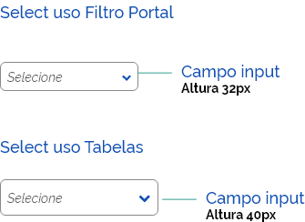
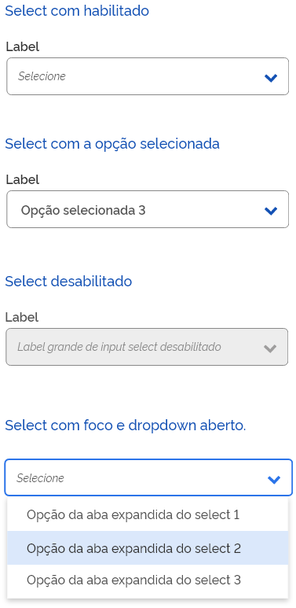

# Campo de texto

## ANATOMIA

São elementos usados pelos usuários para escolher uma opção em um grupo de dados. Devem ser acompanhados de rótulos que descrevam a informação que o usuário deve digitar.

## ESTADOS

Os Select podem estar nos estados: habilitado; desabilitado; opção selecionada; campo com foco e dropdown aberto.

## ORIENTAÇÕES DE USO

### RÓTULOS

Em contextos comuns de uso devem ser acompanhados de rótulos que descrevam a informação que o usuário deve selecionar.

### PLACEHOLDER

O placeholder tem a função de auxiliar o usuário a selecionar as opções disponíveis. Para limpar o campo basta selecionar o campo em branco que encabeça a listagem.

### DISTINTAS ALTURAS DOS CAMPOS

De acordo com o contexto de uso, as alturas dos campos devem variar para: select em Filtro em portal; select em tabelas e select geral.

### COMPORTAMENTO

O label, o placeholder e os demais comportamentos permanecem iguais.

No caso de uso em Tabelas e Filtro em portal, o label pode ser suprimido, mas nesse caso o uso do placeholder é imprescindível.

## COMPOSIÇÃO E DISTRIBUIÇÃO DO COMPONENTE NA TELA

A distribuição dos componentes deve seguir o grid e as orientações de espaçamento múltiplos de 4/8px

De forma a compor vários componentes um ao lado do outro ao longo das linhas, observando suas definições de espaçamentos mínimos.

