## Uso

As tabelas exibem informações em uma grid básica de linhas e colunas. Elas devem organizar as informações de uma maneira intuitiva, com uma estrutura lógica que facilite a compreensão do conteúdo, como o uso de hierarquia ou alfabetização.

As tabelas podem conter:

- Componentes interativos (como chips, botões, links);
- Elementos não interativos (como textos, badges);
- Ferramentas para consultar e manipular dados (como busca, filtros);

Nunca utilize foto/imagem dentro de uma tabela. Sempre prefira usar outro componente (como uma [Listas](#)) ou utilize outros recursos (como [botão](#) ou [hiperlinks](#)) para representar/acessar o conteúdo em questão.

---

## Anatomia

### Desktop e Tablets

As tabelas são estruturadas em:

1. **Barra Superior** (_opcional_)
2. **Cabeçalho da coluna**
3. **Colunas**
4. **Linhas**
5. **Barra de Paginação** (_opcional_)

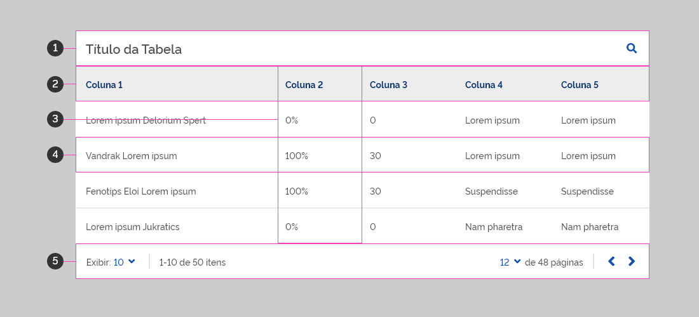

### Celulares

As tabelas são estruturadas em:

1. **Barra Superior** (_opcional_)
2. **Cards**
3. **Barra de Paginação** (_opcional_)

---

## Barra Superior

A Barra Superior fornece conteúdo e ações relacionadas à tabela atual. Ela pode se transformar em uma Barra de ação contextual.

### Barra Padrão

1. **Titulo da tabela** (_opcional_): Texto usado para descrever o assunto à tabela.
2. **Itens de ação e menu flutuante** (_opcional_): Ações relacionadas a tabela.
3. **Tag de Filtros** (_opcional_): usados somente nos celulares.

### Barra Contextual

1. **Texto contextual** (_opcional_)
2. **Elemento contextual** (_opcional_)
3. **Itens de ação e menu flutuante contextual** (_opcional_)

Uma Barra Superior pode se transformar em uma barra de ação contextual para fornecer ações contextuais aos itens selecionados. Por exemplo, acessar um ícone de lupa nos itens de ação, a barra transforma-se em uma barra contextual com elementos relacionados a busca.

A barra contextual para Desktop deve ser utilizada com cautela, já que nem sempre o usuário pode perceber este estado. Prefira utilizá-la em interações diretas com elementos da barra superior ou ao selecionar linhas da tabela.

Quando a Barra Superior se transforma em uma barra contextual, ocorrem as seguintes alterações:

- A cor da barra muda indicando a mudança de estado
- O título da tabela desaparece
- Os itens de ação da Barra Superior são substituídas por ações contextuais
- Alguns elementos, baseados no contexto, podem ser exibidos.

O Título da tabela pode ser substituido por um texto contextual, neste caso, esse texto não precisa herdar as mesmas característias de formatação.

---

## Cabeçalho e Coluna

O cabeçalho da coluna descreve o tipo de conteúdo exibidos em cada coluna. Cada linha contém dados relacionadas a uma única entidade.

1. **Checkbox** (_opcional_)
2. **Nome da coluna**
3. **Ordenação** (_opcional_)
4. **Filtro** (_opcional_)

### Nome da coluna

Texto que descreve o tipo de conteúdo exibido na coluna.

O texto deve ser conciso de modo a comunicar a sua mensagem de forma mais eficiente possível. Estes textos não devem ser extensos (preferencialmente com quantidade de caracteres menor do que os dados referentes).

> **Dica**: faça uma lista de palavras-chave e depois escolha as mais relevantes para sua necessidade.
> **Exemplo**: nomes como "Data Inicial" e "Data Final" podem ser utilizados como "Inicial" e "final" respectivamente.

---

## Linhas

As linhas apresentam os dados organizados por colunas e podem ter elementos de manipulação destes dados.

1. **Ação Expandir/Retrair** (_opcional_)
2. **Checkbox** (_opcional_)
3. **Dados**
4. **Itens de Ação** (_opcional_)

### Dados

Os dados de uma linha podem conter:

- Ícones
- Links
- Textos
- Componentes de formulários ([checkbox](#), [text](#), [radio](#), [select](#)...)
- Chips

---

## Cards

Para celulares as colunas e linhas não são as melhores formas de apresentar os dados devido as retrições de espaço. Desde modo, as linhas da tabela devem ser convertidas em Cards, enquanto que o cabeçalho são rótulos para os dados que serão exibidos em uma lista dentro do card.

1. **Ação Expandir/Retrair** (_opcional_)
2. **Checkbox** (_opcional_)
3. **Lista**
4. **Itens de Ação** (_opcional_)

### Lista

Os dados no card são organizados por um componente lista. E são constituidos da seguinte forma:

1. **Label:** representando o cabeçalho daquele dado no card;
2. **Dado:** o dado propriamente dito, conforme é apresentado na linha da tabela

---

## Barra de Paginação

A paginação é exibida na parte inferior de uma tabela.

Os controles de paginação fornecem acesso rápido a todas as páginas, enquanto indicam e permitem a configuração da quantidade de linhas de uma tabela.

1. **Número de linhas por página**;
2. **Número total de linhas, incluindo o intervalo atualmente em exibição**;
3. **Página atual e a quantidade total de páginas**;
4. **Ícones para navegação (setas esquerda e direita) para navegar nas páginas**;

Para celular, a paginação deve mostrar somente a quantidade atual, a quantidade total de páginas e os controles de navegação.

---

## Comportamento

### Rolagem

Evite rolagem em tabelas. Quando necessário, a Barra Superior e o Cabeçalho permanecem visiveis até o término das Linhas da Tabela. Enquanto os elementos ficam fixos, a elevação destes itens acima de outros elementos se torna aparente.

No caso de celular, tanto a Barra Superior como a Barra de Paginação ficam fixas.

Os itens fixos garantem que os dados da tabela podem ser comparados em qualquer contexto de visualização.

### Responsividade

Quando uma tela é redimensionada, a exibição dos itens de ações na Barra Superior deve ser revista, podendo ser consolidada em um menu flutuante.

As ações são movidas para o menu flutuante da direita para a esquerda, tornando a ação mais usada a última a ser movida para o menu flutuante.

As Linhas da tabela são transformadas em Cards e as Colunas (relacionadas a Linha) em Listas dentro do card.

Textos (tanto do cabeçalho como das linhas) não podem acupar mais de uma linha. Os textos devem ser contraídos com reticências, e ao passar o mouse sobre o texto contraído é revelado o texto completo pelo uso de [tooltip](#). Para celular, não existe esta restrição.

### Coluna Hover

Quando o usuário passa o mouse sobre o cabeçalho de uma coluna:

- Um [tooltip](#) pode exibir o nome completo da coluna (caso esteja contraido) ou uma descrição detalhada;
- Se a ordenação estiver ativada, um ícone de seta dupla aparecerá ao lado do cabeçalho da coluna;

### Linha Hover (Desktop)

As linhas da tabela pode possuir o estado hover, podendo ou não ter uma ação após o clique:

- Caso tenha alguma ação, o cursor do mouse deve ser alterado para o estado comum de itens interativos (mão com dedo indicador);
- Se não tiver ação, o cursor do mouse não deve ser alterado;
- Se o cursor do mouse estiver em algum elemento interativo dentro da linha (link ou botão), a linha não deve receber hover enquanto o mouse estiver sobre estes itens;

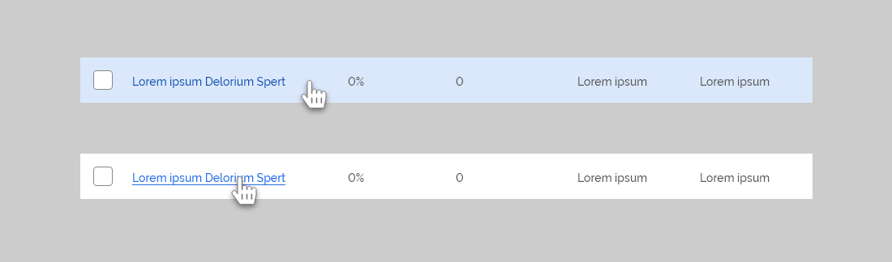

> **Não Faça**: Cards nunca devem ter efeito hover.

### Checkbox

Usado para selecionar ou deselecionar as linhas ou cards da tabela.

É o primeiro elemento a ser exibido em uma Linha (após a ação de expandir) ou no Card. Nos cards, todo o conteúdo deve ser indentado após a posicionamento do checkbox.

#### Nos Cabeçalhos

Possui 2 estados básicos (Desmarcado e Selecionado) e outro adicional (Indeterminado). Quando acionado pelo usuário cada um executa uma ação específica:

- **Desmarcado**: significa nenhuma checkbox das linhas está selecionado. Se acionado pelo usuário, todos os checkboxes passam para o estado de selecionado, inclusive do cabeçalho;
- **Indeterminado**: significa que alguns checkboxes estão selecionados. Se acionado, todos os checkboxes passam para o estado desmarcado, inclusive do cabeçalho.
- **Selecionado**: significa que todos os checkboxes da página atual está selecionado. Se acionado, todos os checkboxes passam para o estado desmarcado, inclusive do cabeçalho.

#### Nas Linhas e Cards

Quando um checkbox é selecionado:

- Além de mudar seu estado para Selecionado, a linha da tabela ou o card (para celulares) é apresentada por outra cor. O conteúdo exibido por uma ação expandir não precisam herdar essa caracteristica.
- A barra de contexto (Barra Superior) geralmente será exibida com ações referente a linha selecionada, chamadas de ações em lote.
- O checkbox da cabeçalho é alterado para estado Indeterminado caso esteja no estado Desmarcado. Se todas as linhas da página atual for selecionada, o estado será Selecionado.

As Linhas podem servir de alvo para selecionar o checkbox, mas os [cards](#) nunca podem ter este comportamento.

#### Na Barra de Contexto

No celular, não existe cabeçalho. Neste caso, quando um dos cards for selecionado, um checkbox aparece na Barra de Contexto para possibilitar a ação de deselecionar todos os cards selecionados.

Ao selecionar um linha ou card, pode ser útil exibir uma informação de quantos itens estão selecionados na tabela. Esse informação pode ser apresentado como um botão cuja ação pode ser refletida como uma busca, a qual:

- Exibe somente as linhas ou cards selecionados;
- Após a busca, deve ser possível "cancelar" a busca, voltando a exibir o conteúdo da tabela de acordo com a página atual;

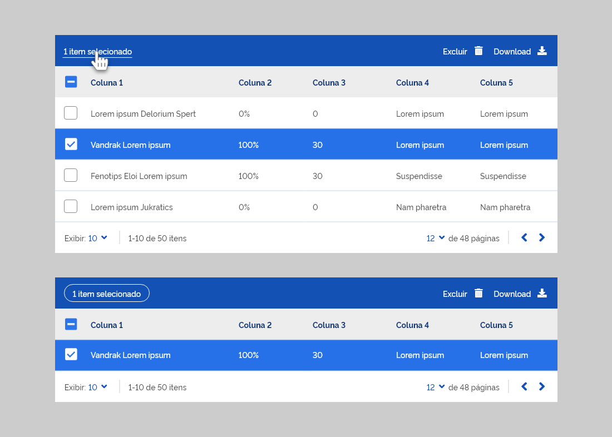

### Itens de Ação

Os itens de ações são posicionados à direita da tabela, e exibidos como botão terciário. Podem ser utilizados em uma Linha, em uma Barra Superior ou na Barra de Contexto.

Estes botões terciários devem ser, preferencialmente, a versão com ícones para que a tabela não fique com excesso de poluição visual (principalmente nas linhas ou cards da tabela).

Quando a quantidade de ações não for extensa, a versão label+ícone pode ser utilizado no Desktop (geralmente usados na Barra de contexto).

Os itens são exibidos lado a lado, desde que não ultrapassem o limite máximo de exibição (recomenda-se em em uma Linha da tabela até 4 ícones). Este número pode ser diferente para a Barra Superior ou de Contexto. Acima do valor máximo, é recomendado o uso do menu flutuante para acomodar as demais ações. O menu flutuante é uma ação, desta forma ele é somado na contagem de valor máximo da exibição de itens.

Menu flutuante é usado quando uma quantidade de ações são extensas ou quando a lista de ações precisa de um outro tratamento a fim de beneficiar hierarquicamente outro tipo de informação (como os dados da tabela). Só pode existir 1 menu flutuante por itens de ação

O menu flutuante pode ser usado para exibir algumas ações ou todas elas. A escolha de ve ser feita baseada na quantidade de informação da tabela (como caracteres e colunas) e do conhecimento hierárquico entre dados e ações.

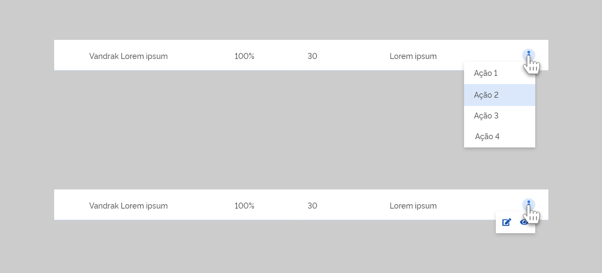
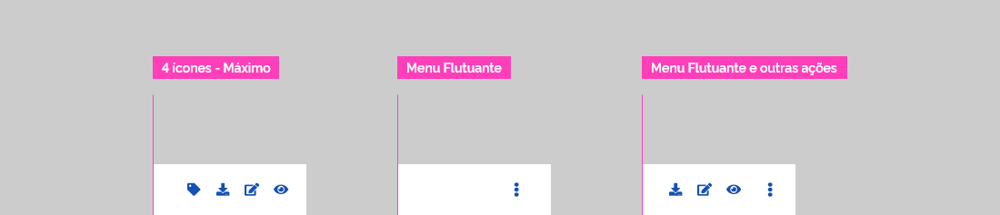

No Desktop, os itens podem aparecer ao passar o mouse sobre a linha referente. Este modo é utilizado quando a tabela possui um número grande de colunas e quando nenhuma ação (mesmo menu flutuante) deve competir com o conteúdo da tabela.

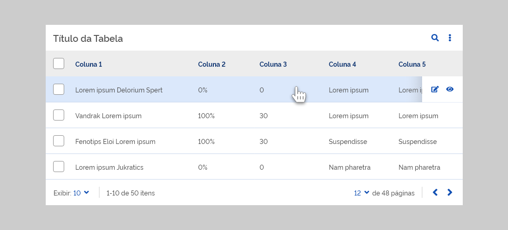

#### Ordenando as ações

Ordene as ações mais usadas à esquerda, progredindo para as ações menos usadas na extrema direita. Quaisquer ações restantes que não couberem na Barra Superior podem entrar em um menu flutuante. Em desktop, as ações podem ser categorizadas (com uso de Separadores), porém, só pode existir um menu flutuante.

As ações entram e saem do menu flutuante à medida que a largura da Barra Superior é alterada, como, por exemplo, se um dispositivo for girado da orientação paisagem para retrato.

#### Tooltip nas ações

Tooltips devem ser usadas em todas as ações que são apresentadas somente por ícone.

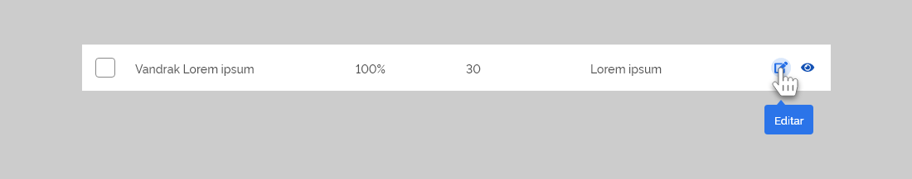

#### Ícones padrão das ações

Utilize icones padrões para ações relacionadas:

- Adicionar
- Remover
- Editar
- Visualizar
- Filtro
- Busca

### Simplificando Elementos

Por questões de legibilidade e densidade informacional, os elementos que possuem borda perdem essa característica no Estado Normal. Este comportamento é aplicado somente no estado Normal, em outros tipos de Estados o visual padrão pode ser mantido.

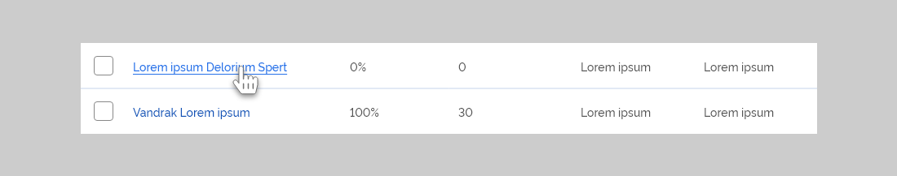

Elementos das quais as bordas enfluenciam diretamente na sua função, como no caso de Separadores, não sofrem qualquer alteração, independente do Estado.

### Ação Expandir

Essa ação exibe informações adicionais relacionadas a linha (ou card, no caso de celular). Representada por um botão terciário com uso de ícone de seta para baixo ou para cima (representando a ação de expandir ou retrair respectivamente), além do ícone, pode ser representada com label+ícone.

Quando aplicado nas linhas da tabela, deve ser a primeira informação a ser exibida e funciona como um componente [accordion](#): as linhas da tabela se afastam para exibir o conteúdo adicional. Este conteúdo é apresentado limitado por elementos que ajudem a destacar sua hierarquia dentro da tabela, tais como uma sombra.

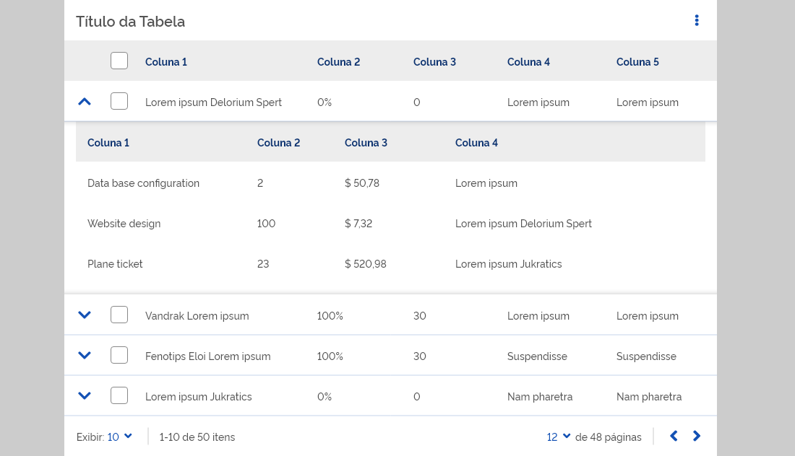

Em Cards a ação possui duas opções (que podem ser usadas simultaneamente):

- **Expandir as informações do card**: localizada à direita, na parte superior do card. Quando retraído, esconde as informações do card, exibindo somente o primeiro item da lista (podendo ser alterado caso o card sofra alguma ordenação). Quando expandido, todas as listas do card são exibidas, podendo ou não exibir as informações adicionais do card.
- **Visualizar informações adicionais**: localizada no final do card, após um separador. Ela é exibida com o rótulo "Mais informações" e ícone. Exibe as informações adicionais encontradas no card. É a mesma informação que é contraída na tabela por linhas.

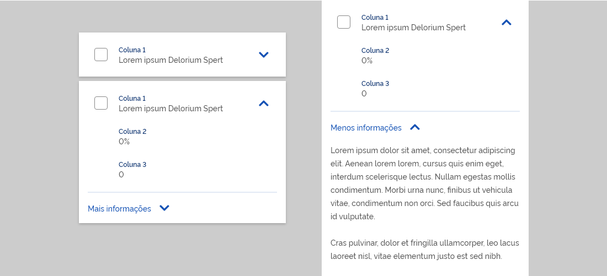

As informações exibidas após a ação expandir (informações adicionais) devem ser diagramadas com cautela. O Excesso de informação e elementos interativos pode confundir o usuário, atrapalhando a leitura e o entendimento dos dados encontrados na tabela. Evite componentes como: tabela, card, arccordion ou qualquer outro componente complexo responsável por organizar, ordenar grande quantidade de informação.

O uso mais comum de apresentar estes dados adicionais, seria por uso de listas.

### Densidade (Desktop)

As configuração de densidade das linhas das tabelas podem ser alterados pelo usuário. Quando for necessário, utilize um item de ação (na barra superior) para realizar a troca de densidade.

Neste caso:

- A altura das as Linhas e de todas as Barras da Tabela serão alteradas na mesma dimensão;
- O tamanho da fonte dos textos e dos ícones não são alterados;

### Ordenação

As linhas e cards podem ser ordenados conforme as desejo dos usuários.

#### Desktop

Para indicar qual coluna está ordenada, exiba um ícone com seta para baixo (decrescente) ou para cima (crescente) ao lado do Nome da Coluna.

A ausência de setas ou uso de seta dupla (com estado Hover) significa que a coluna está com ordenação padrão.

Toda a área da célula deve responder a entrada do usuário (touch ou clique).

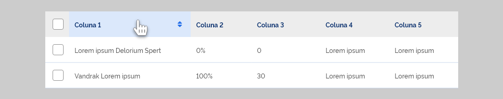

#### Celular

Os Cards podem ser ordenados com uso de item de ação localizado na Barra Superior. Neste caso:

- O primeiro item da lista dos cards passa a ser o referente ao rótulo escolhido na ordenação;
- Todas os cards se ordenam conforme a nova ordenação;

### Filtro

Filtros permitem que o usuário pesquise valores específicos em cada coluna ou nas listas, no caso de celular. O comportamento é diferente dependendo do dispositivo:

#### Desktop

Através do item de ação na barra superior, o usuário podem acessar aos filtros que ficam localizado no cabeçalho de cada coluna. Os componentes de entrada vão depender do tipo de dado que será pesquisado na coluna. A pesquisa é feita sem necessidade de uma ação adicional de confirmação, e o cancelamento pode ser feito ao deixar o componente de entrada sem informação ao interagir novamente com o item de ação respecitivo na barra superior, caso exista.

#### Celular

Os componentes de entrada são acessados somente pelo botão ação. Após isso, uma nova tela onde o usuário pode preencher os campos e ações relacionadas. Após a busca, os termos pesquisados aparecem na barra superior na forma de componentes Chips. Os termos pesquisados podem ser cancelados pela ação fechar do chip ou na tela de filtro.

### Foco

O estado de foco, utilizando teclas tab do teclado, são realizados em todos os itens interativos dentro da tabela (como links, botões, checkboxes...)

### Coluna Fixa

A rolagem (scrolling) horizontal é útil para apresentar grandes conjuntos de dados. Para identificar os dados e/ou compará-los, as colunas podem ser fixas durante a rolagem. Esse recurso é comum em tablets.

É corriqueiro que a primeira coluna fique fixa (geralmente ela possui informações que ajudam uma melhor identificação dos dados), mas como recurso avançado, um item de ação pode ser adicionado para bloqueio individual de coluna afim do usuário personalizar e comparar dados com vários indentificadores de ancoragem.

Por causa da limitação de espaço é recomendado que apenas 1 coluna de dados seja fixa. Mas, caso seja viável, mais de uma coluna pode ser fixa. Como exceção, a coluna contendo o ícone de expandir e os componentes de checkbox, caso exista, sempre devem ser fixas. Esse entendimento pode ser expandido para qualquer elemento interativo que seja muito importante dentro da tabela.

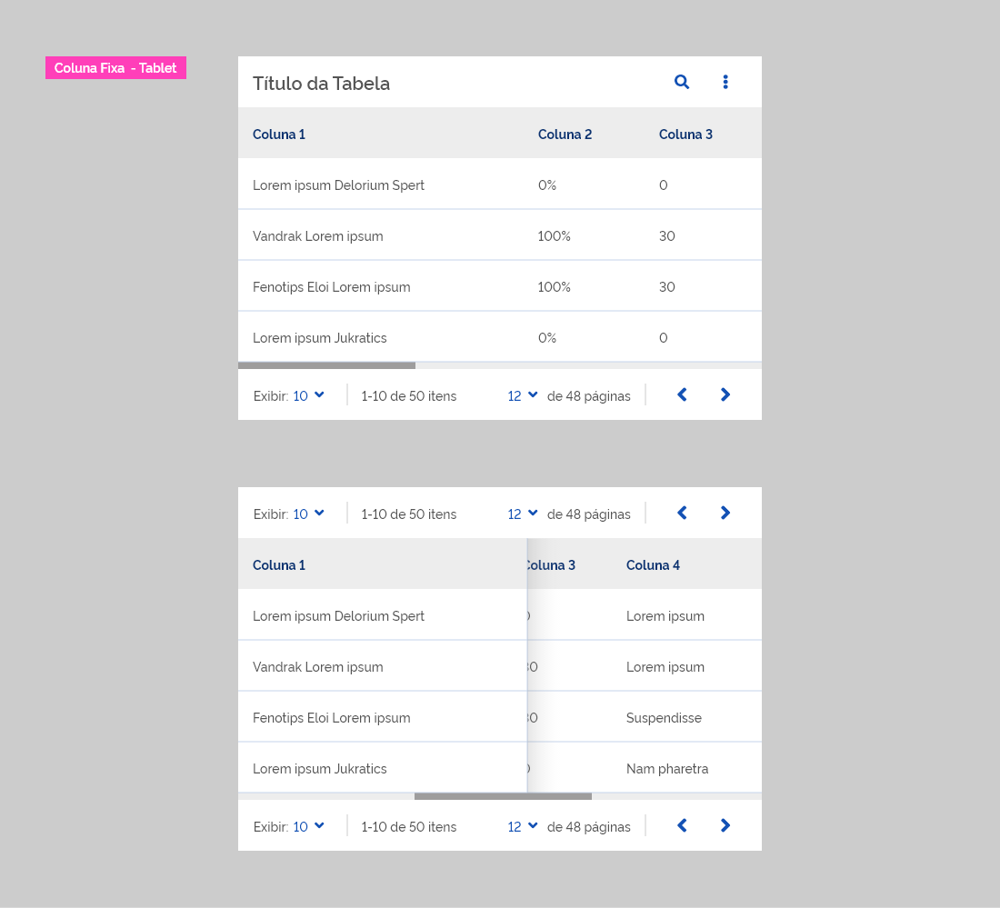

### Buscar

Para realizar busca de dados dentro da tabela:

- Utilize uma ação, na Barra Superior, para apresentar o campo de busca;
- O campo de busca deve está inserido em uma Barra de Contexto;
- Destaque, no conteúdo, os termos procurados;
- Uma ação de "fechar" deve está disponível para o usuário, caso ele queira desistir da busca;

### Redimensionar Coluna

Redimensionar colunas permitem que usuários vejam dados contraídos de forma completa.

Quando o usuário coloca o mouse próximo a lateral do cabeçalho, seguintes mudanças acontece:

- O cursor do mouse é alterado para setas
- Uma linha vertical da coluna é exibida
- O usuário pode arrastar a linha vertical para esquerda e direita
- Dados contraídos podem ficar visíveis e dados muito extensos podem ser contraídos e adicionado reticências. Veja [Responsividade](#) para maiores detalhes.
- Elementos visual de sombra é adicionado como resposta durante a ação de arrastar a linha vertical.

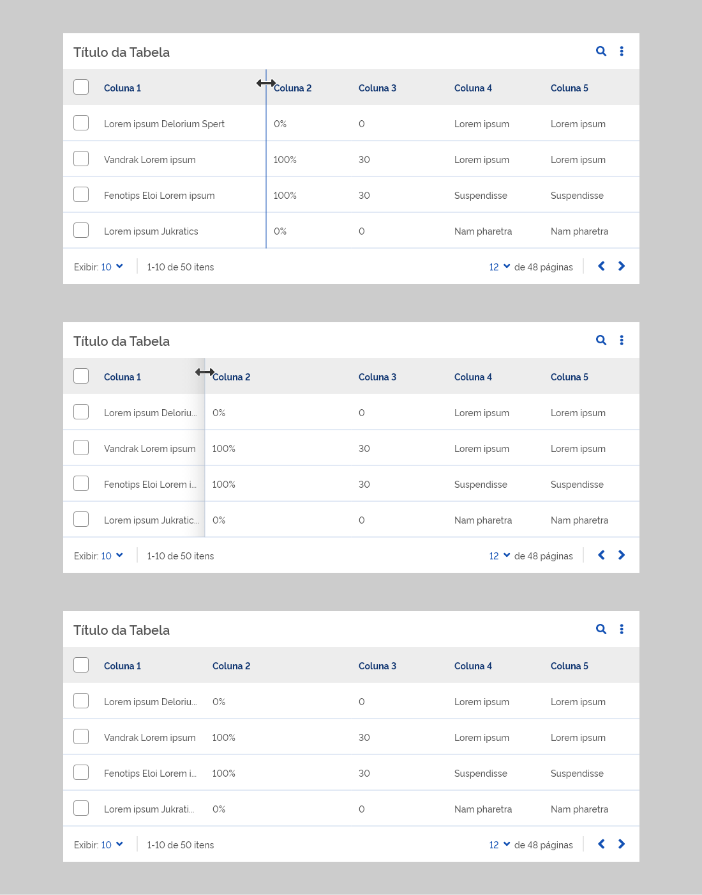

### Carregando dados

Quando os dados da coluna são atualizados uma mensagem de carregamento deve ser exibida sobre a tabela.

O usuário não pode interagir com os elementos da tabela enquanto o carregamento não estiver concluído. Nentes caso, coloque uma opção para cancelar o processamento.

---

## Especificação

### Desktop

### Tablet

[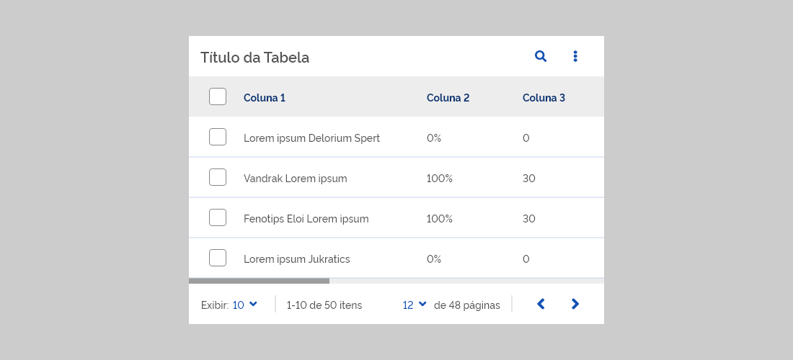](https://xd.adobe.com/spec/a0154d97-6875-455b-559b-2eee2a832c9b-d624/screen/d751b4f2-4e8f-462a-9653-f4995b1dee16/Tabela-Tablet/)

### Celular

[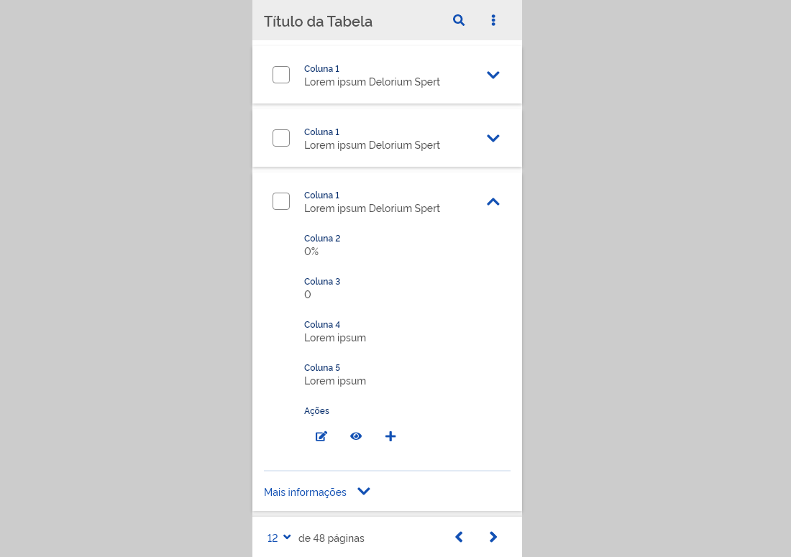](https://xd.adobe.com/spec/a0154d97-6875-455b-559b-2eee2a832c9b-d624/screen/bebd0936-f99b-4ced-8ca9-4c332228861e/Tabela-Celular/)

### Tamanho mínimo (Desktop)

- Deixe **12px** de espaçamento interno **entre as colunas** de uma tabela;
- Caso tenha algum ícone, como de ordenação, acrescente **24px** do ícone (área mínimo de interação com mouse);
- Espaçamento Interno entre as **extreminadas** da coluna são de **16px**;

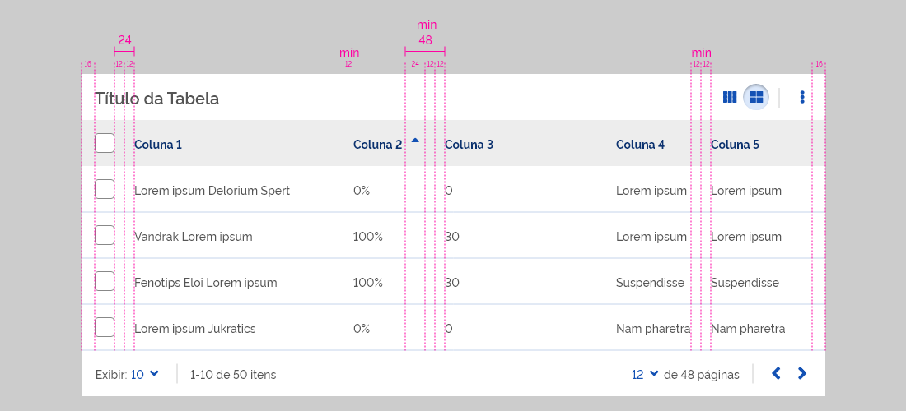
