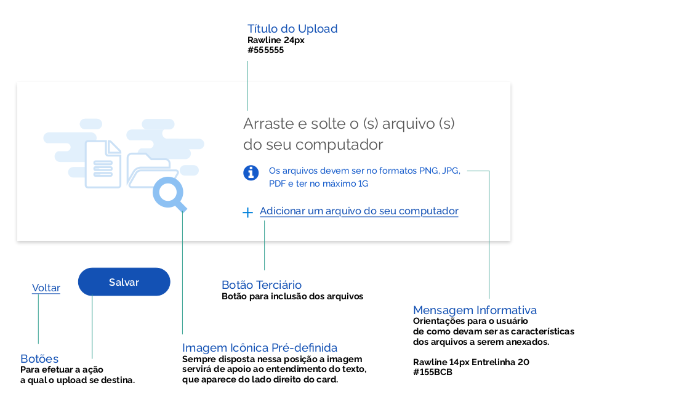
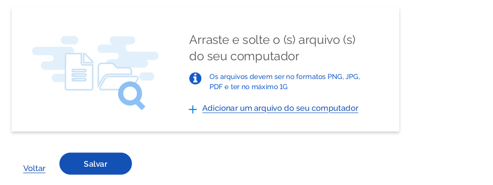
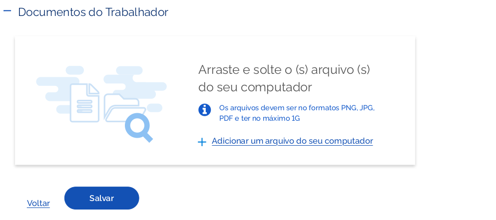
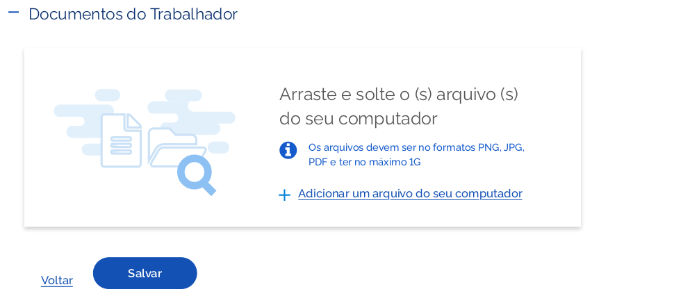
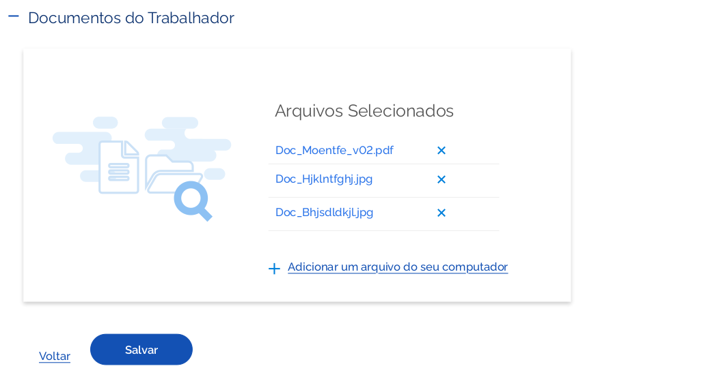

### Anatomia do componente

O componente "Upload" aparece em forma de Cards e podem ter formatos distintos de acordo com a resolução da tela, mas devem sempre ficar alinhados com os elementos do formulário, seguindo a grid. O tamanho ideal deve ser 760 x 248 px.
Do lado esquerdo do card aparecerá uma imagem ilustrativa, que foi criada a partir dos ícones do fontawesome. Essa imagem servirá de apoio ao entendimento do texto que aparece do lado direito do card.
Abaixo do título do card, aparecerá sempre uma mensagem informativa de como devem ser as características dos arquivos a serem anexados.
Abaixo da mensagem informativa deve haver um botão terciário para inclusão dos arquivos.

### Cores

No Upload o card deve ser branco #FFFFFF e o “hover, desse card deve seguir o mesmo comportamento dos demais: assumir o contorno de cor azul #2B74E9.

### Orientações de Uso

#### Upload com Cards de 770 x 248px

Os cards tem altura sempre adaptada a quantidade de texto. A LARGURA mínima DEVE SER 770PX E Altura mínima 248px (antes dos arquivos serem selecionados).
O upload pode ou não vir acompanhado de um título.

#### 1 | Upload com Título

#### 2 | Upload sem Título

#### 3 | Upload com Cards contidos dentro de colapse

O card do Upload pode aparecer contido num elemento de colapse. O mesmo servirá de título para o upload.

<!-- #### 3 | Upload Contido no Colapse

 -->

### Comportamentos

#### Comportamento em mouse hover

Ao passar o mouse em cima do card aparecerá um contorno azul cor #2B74E9.
**Essa versão ocorrerá apenas na versão web.**

#### 4 | Cards com altura e Largura Variáveis

Os cards do upload podem aumentar a altura em função da quantidade dos arquivos incluídos e podem variar a largura CONFORME DISPOSIÇÃO DOS ELEMENTOS DO FORMULÁRIO.

Após inclusão dos arquivos aparecerá um ícone ‘X” para excluir o Arquivo, caso o usuário tenha selecionado errado. O botão terciário para inclusão de arquivos permanecerá visível no card mesmo após a seleção de vários arquivos.

#### 5 | Upload após seleção de arquivos

