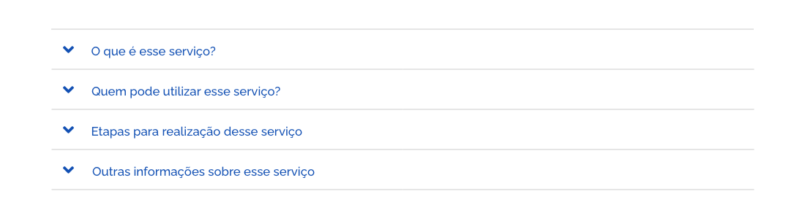
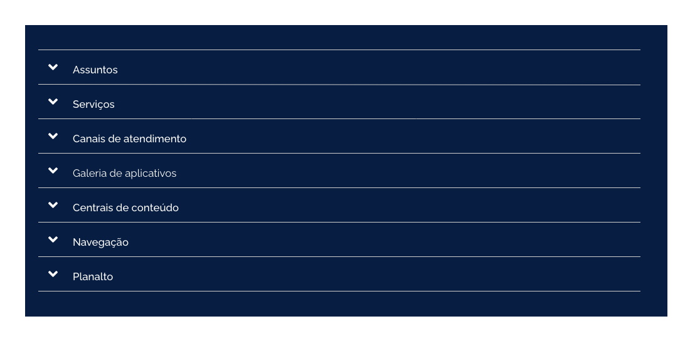
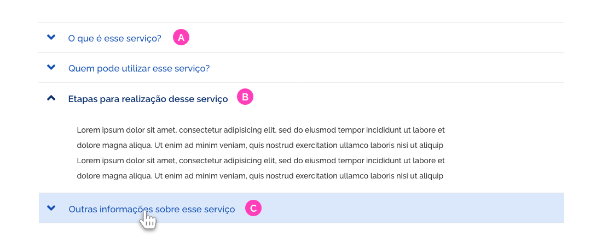
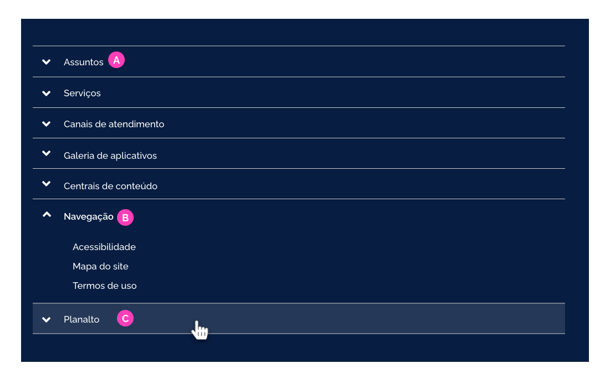
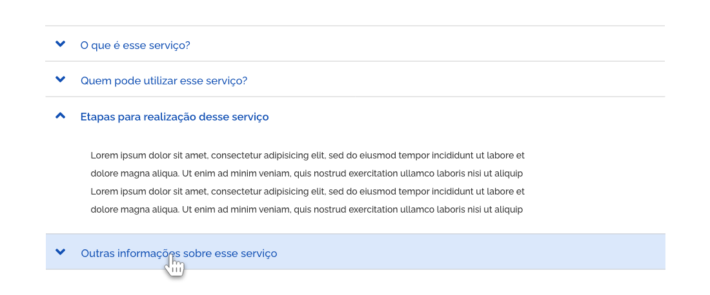
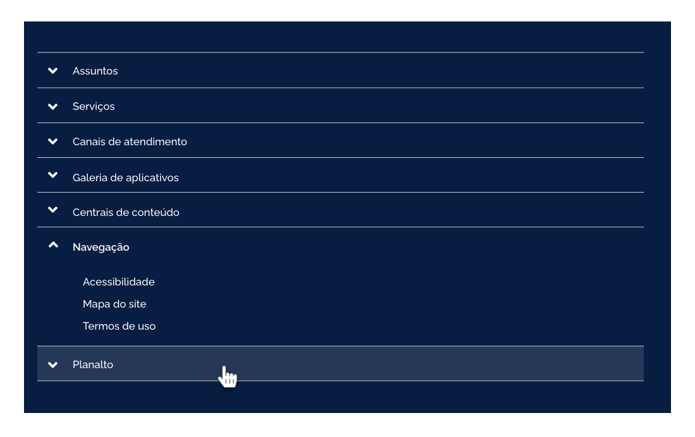
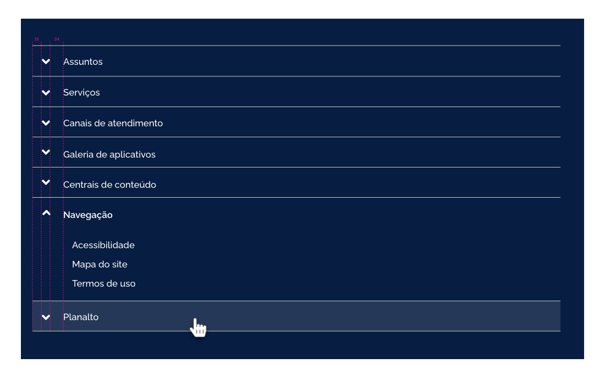

[version]: # '12.0.0'

## Tipos de Acordeão

**Acordeão Positivo**
Este tipo é recomendado em seções ou temas claros.

**Acordeão Negativo**
Este tipo é recomendado em seções ou temas escuros.

## Estados do Acordeão

Os estados servem para dar feedback ao usuário sobre a interação do usuário ao expandir, recolher, ou passar o mouse por cima de um item da lista.

**A | Interativo**
É o estado inicial do item de Acordeão. Acompanhado do ícone de expandir (angle-down) que indica ao usuário que há itens a ser exibidos.

**B | Ativo**
Acontece quando o item está ativo/aberto/expandido. Nessa situação o texto fica semibold e assume cor Primary Darken 01. O ícone "angle-down” é substituído pelo de “angle-up“ indicando ao usuário, que o clique nos elementos do item expandido terá a ação de esconder o conteúdo.

**C | Hover**
Quando o cursor do mouse está sobre o item a ser expandido ou recolhido. Nesse caso, o item recebe tratamento gráfico de hover, (um background azul claro aparece embaixo do item) sinalizando ao usuário a interação.

#### Positivo

#### Negativo

Sobre background negativo o hover deve seguir o padrão gráfico sobre fundo escuro.

---

## Anatomia

### Tom de Voz do Acordeão

O tom de voz do item de Acordeão deve deixar claro que o conteúdo expandido será um detalhamento.

Recomenda-se, sempre que possível, a utilização de uma sentença, clara e sucinta, um resumo que determine de forma objetiva qual conteúdo será exibido. Evitar uso de siglas ou expressões que não são reconhecidas ao público em geral. **Não exceder uma linha de texto.** O detalhe de cada item deve aparecer quando o item for expandido.

### Formatação do Texto

Os textos dos itens foram formatados em letras minúsculas com a primeira letra maiúscula no estilo medium. Ao ser clicado o item passa a se apresentar no estilo semibold para informar ao usuário que aquele item está ativo.

### Alinhamento

Os itens aparecem separados por uma linha de contorno cinza e os ícones de retrair e expandir aparecem alinhados entre si à esquerda, antes do texto.

#### Acordeão Positivo

#### Acordeão Negativo

### Espaçamentos

Seguem as métricas definidas para os espaçamentos dos acordeões. Todas as medidas foram definidas com valores múltiplos de 4px.

### Tipografia e Cor

#### Acordeão Positivo

A cor da fonte deve seguir a cor do estado ativo, pois é importante criar essa uniformidade com os outros componentes ativos da interface.

#### Acordeão Negativo

Por questões de acessibilidae, no acordeão negativo a cor da fonte passa a ser Secondary 01 (branca), mas os estilos seguem o mesmo padrão adotado no positivo.

