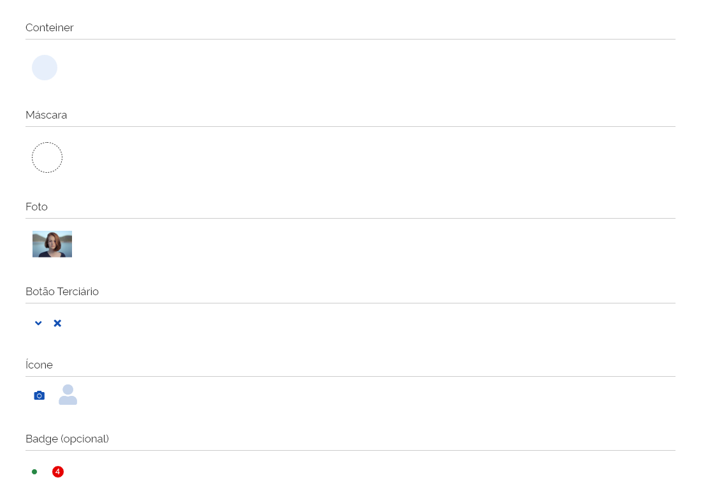
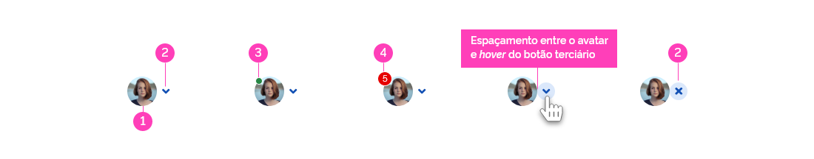
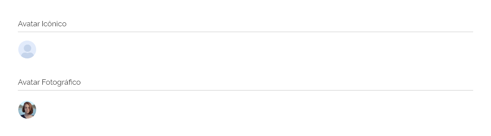
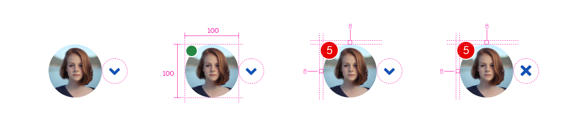
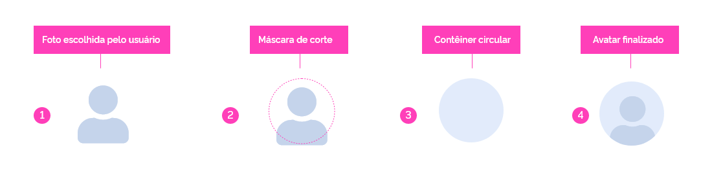
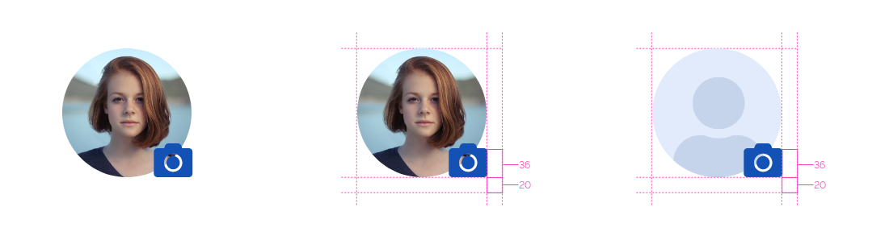
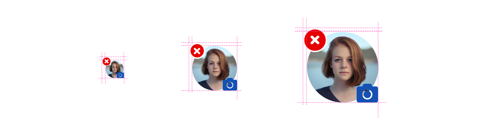
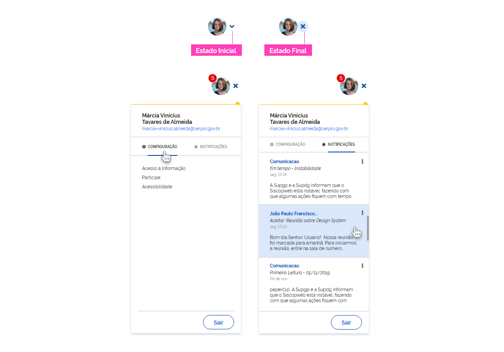
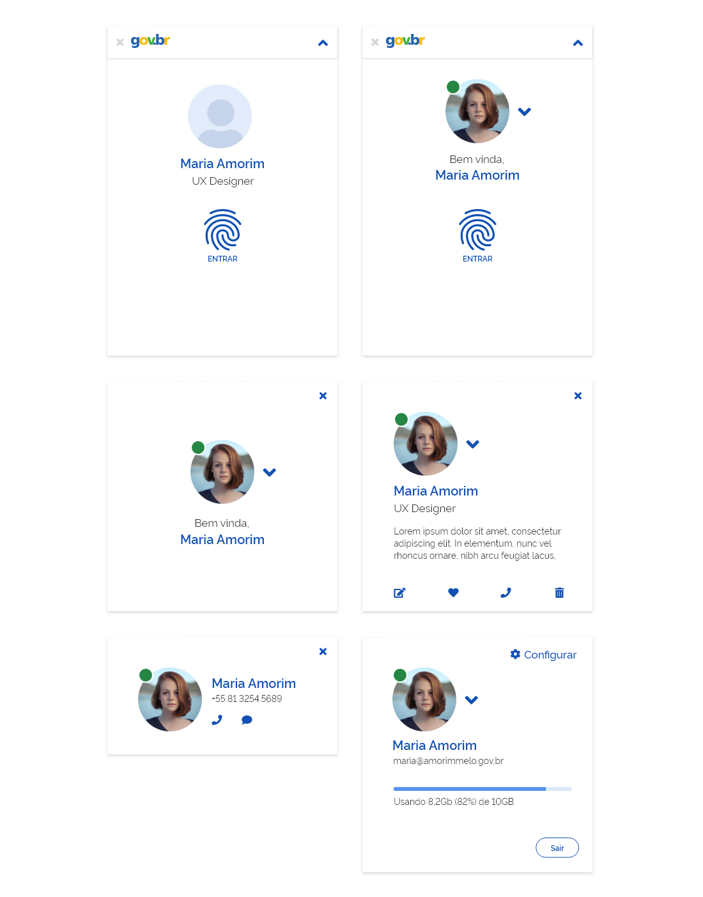
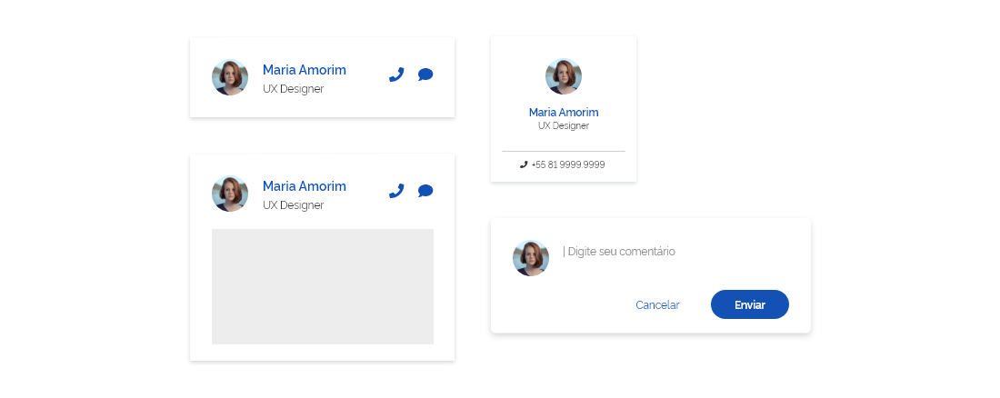

[artefato fonte de design]: #'avatar_0.0.0.xd'

---

## Uso

O avatar é utilizado quando há necessidade de reprensentar visualmente um usuário no ambiente virtual, como acontece após o indivíduo efetuar o _login_ em um sistema ou site.
Pode ser utilizado também em _chats_ ou mensagens em que haja necessidade de identificar os agentes da conversa.
É representado inicialmente em formato pictórico por meio de um ícone de usuário padrão, e permite ao usuário, de forma opcional, a inclusão de uma imagem de sua preferência. Resumidamente, é sempre uma forma de representar graficamente um usuário dentro de um ambiente virtual.

---

## Anatomia

O componente Avatar conta com: _container_ de formato circular, máscara de corte, botões terciários, ícone e badges, como ilustra a imagem a seguir:

---

### Detalhamento dos Elementos

Um Avatar pode vir opcionalmente acompanhados pelos _badges_ e botões terciários.

Os _badges_ podem ser do tipo _Status_, que informa o _status_ do usuário no site ou sistema (online, por exemplo) ou do tipo numérico, que informa a quantidade de notificações ou mensagens associadas a determinado usuário. Os _Badges_ são componentes e devem seguir estritamente as orientações definidas em documento específico.

Já os botões terciários podem ocorrer para a ação de expandir ou fechar um menu associado ao avatar e utilizam os ícones Expandir (fa-angle-down) e Fechar (fa-times).

A imagem a seguir ilustra os casos descritos acima:

1- Avatar (icônico ou fotográfico);
2- Botões terciários com ações de Expandir e Fechar o menu contextual;
3- _Badge_ sinalizador de _status_ (Ex: _status_ online);
4- _Badge_ indicador de quantidade de notificações.

######Atenção: note que a distância entre o botão terciário e o avatar é zero.

Ao utilizar um Avatar, tantos o ícone quanto a foto devem estar contidos em uma máscara circular. As dimensões dessa máscara variam de acordo com o uso do avatar (descrita mais adiante nesse manual) e obedecem a uma escala de três dimensões.

## Tipos

Basicamente, existem duas variações de avatar: o fotográfico e o icônico. Este último é o padrão do sistema e deverá ser utilizado até o momento que o usuário deseje alterar a imagem por outra de sua preferência.

1- Avatar icônico (imagem icônica padrão do site/sistema);
2- Avatar fotográfico (após o usuário alterar a imagem do perfil).

---

### Detalhamento do tipo

Com finalidade de auxiliar o desenvolvedor, especificamos as dimensões das três variações na escala de avatares:

### Construção do Avatar

#### a) Avatar fotográfico:

Na etapa (1), o usuário escolhe a imagem no seu computador para representá-lo. (2) Ao fazer o _upload_ da imagem uma máscara de corte limita a parte da foto que será utilizada no avatar. O usuário poderá mover a foto livremente dentro da máscara até ficar satisfeito com a parte da foto que será utilizada. A etapa (3) ilustra o resultado final da foto escolhida pelo usuário cortada pela máscara circular e como ela será mostrada pelo sistema.

#### b) Avatar icônico:

Quando o usuário não fez _upload_ de nenhuma imagem o avatar icônico será utilizado por padrão. O processo de construção é semelhante ao do avatar fotográfico. Na etapa (1), temos o ícone User(fa-user) utilizado como padrão de avatar. Etapa (2) ilustra que a mesma máscara descrita acima deve fazer o corte do ícone na posição centralizada como indicada na imagem. Na etapa (3) devemos adicionar o _conteiner_ circular de fundo. A etapa (4) demonstra como deverá ser o avatar icônico finalizado.

#### Comportamento:

Nunca é demais lembrar que sempre que um avatar aparecer pela primeira vez, em qualquer circunstância, será do tipo icônico. O usuário poderá fazer o _upload_ de sua própria foto (ou qualquer outra de sua escolha) para representá-lo no momento que desejar. Ao passar o mouse sobre o avatar (_hover_), o ícone Camera (fa-camera) é apresentado indicando ao usuário que ao clicar em qualquer parte da imagem poderá realizar o _upload_ de outra imagem de sua escolha. A partir de então, o sistema sempre exibirá o novo avatar com a nova imagem escolhida pelo usuário. O mesmo poderá a qualquer momento alterar a imagem, ou mesmo excluí-la. Neste caso, o avatar icônico voltará a ser utilizado como padrão.

Ao passar o mouse sobre a foto (_Hover_), o ícone Camera fica disponível indicando que a foto poderá ser editada, isto é, ser trocada ou mesmo deletada. Neste momento, o usuário pode clicar em qualquer local da foto e será então levado para outra tela para realizar a ação desejada.

No caso de dispositivos móveis, o mesmo comporamento será conseguindo tocando com o dedo na foto e mantendo o toque por dois segundos. A partir de então as mesmas opções de deletar ou alterar a foto são apresentadas.

Os _badges_ de notificação (numérico), os de _status online_ (verde) e os de deletar imagem se sobrepõe, isto é, eles nunca aparecem ao mesmo tempo.

---

## Uso

O Avatar deve se adaptar responsivamente de acordo com a resolução do dispositivo (número de colunas). Porém, para facilitar a adequação do uso foram definidas três dimensões padrão que deverão ser respeitadas:

O designer ou desenvolvedor deve contar com bom senso ao optar pela escala que melhor se adapta ao layout planejado porém, algumas sugestões são recomendadas:

Pequeno (_Small_): Geralmente utilizados em espaços reduzidos como _headers_, listas de contatos, mensagens e notificações;

Médio (_Medium_): Apropriado para representar o usuário em telas de boas-vindas e _cards_ de perfil do usuário;

Grande (_Large_): Adequado para formatos digitais maiores, como no uso de tablets e Tvs. Utilizado também em formulários onde haja necessidade de inclusão da foto do usuário ou de depoimentos e também em telas do perfil do usuário.

---

## Tipos

Basicamente, existem duas variações de avatar: o fotográfico e o icônico. Este último é o padrão do sistema e deverá ser utilizado até o momento que o usuário deseje alterar a imagem por outra de sua preferência.

1- Avatar icônico (imagem icônica padrão do site/sistema);
2- Avatar fotográfico (após o usuário alterar a imagem do perfil).

---

### Detalhamento do tipo

Com finalidade de auxiliar, especificamos as dimensões das três variações na escala de avatares:

---

## Aplicações

Um avatar pode ser utilizado em diversos locais e contextos no ambiente digital. Ilustramos a seguir algumas possibilidades, mas não limitantes, de utilização do componente avatar:

1- No Header: indicando o perfil do usuário e permitindo acesso à configuração de conta e notificações por meio de um menu contextual:

A imagem acima sugere que a usuária Márcia possui cinco notificações não lidas. Ao clicar no botão terciário Expandir um menu contextual (ver componente menu) é apresentado e nele duas abas organizam a informação (Configuração e Notificações). O botão terciário Expandir é alterado para o botão terciário Fechar e ao ser clicado, o menu é recolhido. O mesmo efeito de fechamento do menu é alcançado clicando em qualquer local da tela fora do menu.

2- Em _Cards_, com finalidade de identificação do usuário:

O avatar pode ser utilizado em diversos formatos de _cards_ (ver componente _Card_), de acordo com sua aplicação. Geralmente a finalidade é de identificação do usuário com um texto mais detalhado. Pode ser utilizado também para permitir a alteração da imagem do avatar. Neste caso, o processo pode ser por meio de clique na foto já descrito anteriormente.

3- Em Telas de Boas vindas:

Sugerimos também a utilização de avatares para identificação de usuários em telas de boas vindas.

4- Em Telas de _Chat_:

Ainda é possível e sugerido a utilização de avatares em contextos de _chat_ ou qualquer tipo de comunicação que possa ser interessante a identificação do usuário. Abaixo seguem alguns exemplos possíveis:

######Atenção: Lembramos que todos os exemplos mencionados acima servem meramente para ilustrar algumas aplicações possíveis do componente Avatar. As especificações detalhadas para a construção devem ser observadas e seguidas com base em cada um dos documentos correspondentes de cada componente utilizado ou fluxo de telas.

---

## Design Tokens

### Tipografia

| Name                 | Size Token                  | Weight Token            |
| -------------------- | --------------------------- | ----------------------- |
| Número (notificação) | `--font-size-scale-down-01` | `--font-weight-regular` |

### Iconografia (Small)

| Name                  | Ícone                         | Size                | Class (Font Awesome) |
| --------------------- | ----------------------------- | ------------------- | -------------------- |
| User (avatar icônico) | <i class="fas fa-user"></i>   | `--icon-size-2x`    | fa-user              |
| Camera                | <i class="fas fa-camera"></i> | `--icone-size-base` | fa-camera            |

### Iconografia (Medium)

| Name                  | Ícone                         | Size             | Class (Font Awesome) |
| --------------------- | ----------------------------- | ---------------- | -------------------- |
| User (avatar icônico) | <i class="fas fa-user"></i>   | `--icon-size-5x` | fa-user              |
| Camera                | <i class="fas fa-camera"></i> | `--icon-size-2x` | fa-camera            |

### Iconografia (Large)

| Name                  | Ícone                         | Size             | Class (Font Awesome) |
| --------------------- | ----------------------------- | ---------------- | -------------------- |
| User (avatar icônico) | <i class="fas fa-user"></i>   | `--icon-size-8x` | fa-user              |
| Camera                | <i class="fas fa-camera"></i> | `--icon-size-3x` | fa-camera            |

### Botão Terciário (Small)

| Name     | Ícone                             | Size                | Class (Font Awesome) |
| -------- | --------------------------------- | ------------------- | -------------------- |
| Expandir | <i class="fas fa-angle-down"></i> | `--icone-size-base` | fa-angle-down        |
| Fechar   | <i class="fas fa-times"></i>      | `--icone-size-base` | fa-times             |

### Botão Terciário (Medium)

| Name     | Ícone                             | Size             | Class (Font Awesome) |
| -------- | --------------------------------- | ---------------- | -------------------- |
| Expandir | <i class="fas fa-angle-down"></i> | `--icon-size-2x` | fa-angle-down        |
| Fechar   | <i class="fas fa-times"></i>      | `--icon-size-2x` | fa-times             |

### Botão Terciário (Large)

| Name     | Ícone                             | Size             | Class (Font Awesome) |
| -------- | --------------------------------- | ---------------- | -------------------- |
| Expandir | <i class="fas fa-angle-down"></i> | `--icon-size-2x` | fa-angle-down        |
| Fechar   | <i class="fas fa-times"></i>      | `--icon-size-2x` | fa-times             |

### Cor

| Name                       | Property | Color Token                 | Opacity |
| -------------------------- | -------- | --------------------------- | ------- |
| Número (notificação)       | color    | `--color-secondary-01`      | 100%    |
| Icon Expandir              | color    | `--color-primary-default`   | 100%    |
| Icon Fechar                | color    | `--color-primary-default`   | 100%    |
| Icon User (avatar icônico) | color    | `--color-primary-pastel-01` | 100%    |
| Icon Camera                | color    | `--color-primary-default`   | 100%    |
| Conteiner                  | color    | `--color-primary-pastel-02` | 100%    |

### Estado

| Name          | Estado | Property         | Status Token                | Opacity |
| ------------- | ------ | ---------------- | --------------------------- | ------- |
| Icon Expandir | Hover  | background color | `--color-primary-pastel-02` | 100%    |
| Icon Fechar   | Hover  | background color | `--color-primary-pastel-02` | 100%    |

### Dimensão

| Name          | Property     | Value |
| ------------- | ------------ | ----- |
| Avatar small  | width/height | 40px  |
| Avatar medium | width/height | 100px |
| Avatar Large  | width/height | 160px |

### Espaçamento

| Name                  | Property       | Value |
| --------------------- | -------------- | ----- |
| Icon Expandir (hover) | padding-width  | 0px   |
| Icon Fechar (hover)   | padding-width  | 0px   |
| Badge (notificação)   | padding-width  | 8px   |
| Badge (notificação)   | padding-height | 8px   |
| Badge (status)        | padding-width  | -1px  |
| Badge (status)        | padding-height | -1px  |
