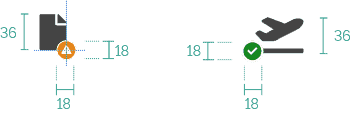
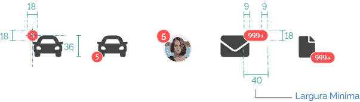
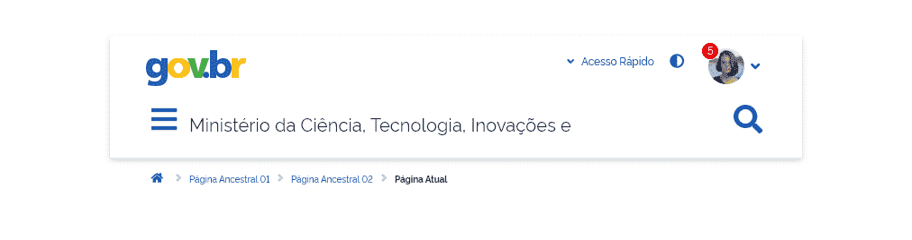

## Exemplos de utilização

Podem servir como sinalização dinâmica de alteração de estado ou conter informações como números de pendências ou notificações.  

## Tipos

### 1 | Badge de sinalização de status

### 2 | Badge de sinalização de status com símbolo

### 3 | Badge de contagem

## Anatomia

### Tamanho

#### 1 | Badge de sinalização de status

Os badges de sinalização de status deverão ser exibidos com um tamanho de 8px e posicionados no canto inferior ou superior esquerdo do elemento com o qual está associado.

#### 2 | Badge de sinalização de status com símbolo

Os badges de sinalização de status com símbolo deverão possuir metade da altura do elemento associado. Eles deverão ser posicionados com a metade da sua altura e largura no canto inferior ou superior à esquerda ou à direita do elemento associado.

#### 3 | Badge de contagem

Os badges de contagem deverão possuir metade da altura do elemento associado e posicionados com a metade da sua altura e largura no canto inferior ou superior à esquerda ou à direita do elemento associado.

### Alinhamento

Todos do textos e números deverão ser centralizados.

### Tipografia

### Exemplo de uso

