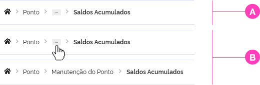

## Estrutura

Este componente deve conter uma sequência de links marcando a ordem de acesso nas páginas navegadas. A sequência de links deve ser intercalada com setas do tipo Angle-Right da família de ícones do Font Awesome O primeiro link é representado pelo ícone Home da bibliioteca de ícones do Font Awesome. Este dá acesso à página inicial do sistema ou portal. O último texto da sequência não deve ter ação de link, pois representa a página atual. O Breadcrumbs deve ser posicionado logo abaixo do cabeçalho do portal ou sistema, alinhado ao título principal.

---

## Estados

Tanto na versão do breadcrumb para o portal quanto para sistemas, no estado hover, cada link deve assumir o formato sublinhado, mantendo a mesma cor do estado normal (#333333). O link que representa a página atual (último link), apresenta uma diferenciação de peso tipográfico em bold.

**Estado Normal e Estado Hover**  

**Estado Normal e Estado Hover**

---

## Tipos de Breadcrumbs

**Normal**

**Normal**

**A -** Em situações onde a trilha do breadcrumb for muito extensa com espaço limitado de apresentação, é recomendado fazer uso do recurso de colapse para encurta-lo dando destaque ao ícone de home e a tela atual. Este recurso, utiliza o símbolo de "reticências (...)" para agrupar links intermediários e ocultando-los.

**B -** Os links ocultos, poderão ser novamente acessados, clicando-se no ícone agrupador, caso necessário.
Exemplo pode ser visto na página: (https://material-ui.com/components/breadcrumbs/); no tópico **Customized breadcrumbs**.

---

### Anatomia

Cada link deverá descrever claramente o principal assunto ou tema tratado na página em questão. De preferência, é recomendado utilizar os mesmos textos usados nos títulos principais de cada página, ou quando estes forem muito grandes, inicialmente deverá ser utilizado um resumo mais claro possível deste título. Persistindo a limitação de espaço, o recurso de colapsar o breadcrumbs deve ser utilizado. Desta forma, evita-se ter um breadcrumbs muito extenso e com problemas de localização.

**Espaçamento**
Seguem as métricas definidas para os espaçamentos do Breadcrumbs. Todas as medidas foram definidas com valores mostrados à baixo.

---

### Alinhamento

Todo texto deverá ser alinhado à esquerda.

---

### Tipografia e Cores

---
