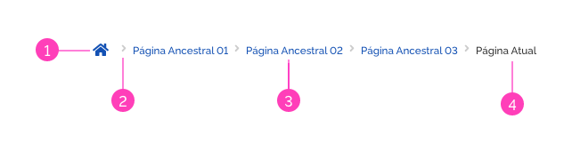
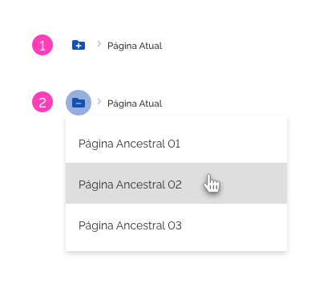
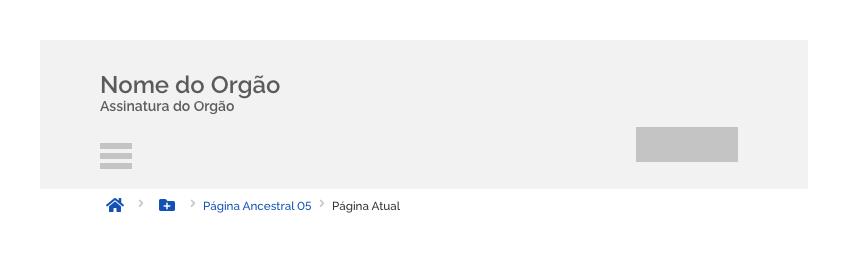
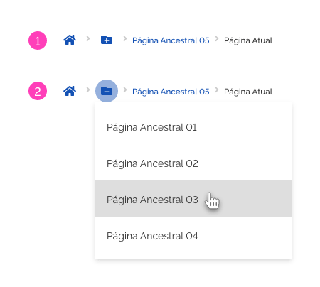
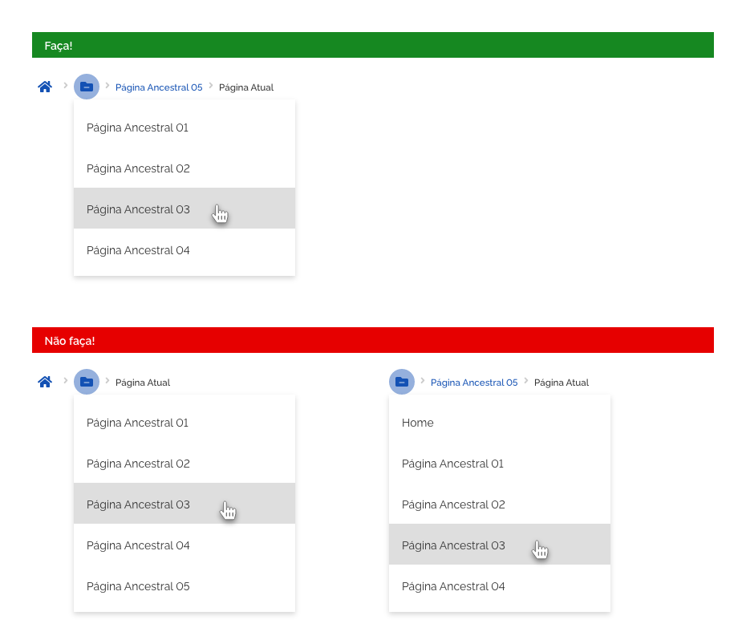
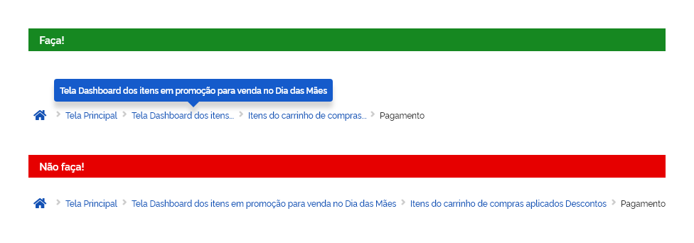

*Exemplo do componente breadcrumb.*

Use *breadcrumb* para melhorar o SEO e para facilitar a identificação de onde o usuário se encontra na estrutura de navegação de um *website*. Esta funcionalidade não é recomendada para *websites* que não possuem um agrupamento ou hierarquia de usabilidade.

---

## Anatomia

| ID  | Nome                   |                     Referência                     | Uso         |
| --- | ---------------------- | :------------------------------------------------: | ----------- |
| 1   | Botão                  |    [Button](/ds/components/button?tab=designer)    | Obrigatório |
| 2   | Separador              | [Iconografia](/ds/fundamentos-visuais/iconografia) | Obrigatório |
| 3   | Link                   |     [Estados](/ds/fundamentos-visuais/estados)     | Obrigatório |
| 4   | Título da página atual |  [Tipografia](/ds/fundamentos-visuais/tipografia)  | Obrigatório |

*Anatomia do componente breadcrumb.*

---

## Tipos

### 1. Padrão

O componente *breadcrumb* na forma padrão funciona de maneira única, listando a hierarquia de *links* da tela inicial à tela atual. Cada item do *breadcrumb* é um *link*, exceto o último, que define a tela atual em que o usuário se encontra. Ao clicar-se em qualquer *link* do *breadcrumb*, o usuário é direcionado à página correspondente. O botão terciário Home direciona sempre para a tela inicial.

*Exemplo do componente breadcrumb na sua forma padrão.*

### 2. Especial

Nos casos das resoluções de 4 colunas (dispositivos móveis), deve-se necessariamente optar pela forma **especial** de *breadcrumb*. Nesse formato o *breadcrumb* é apresentado sempre com todos os *links* deslocados para o menu, exceto a Página Atual.

*Exemplo do componente breadcrumb especial para resoluções de quatro colunas.*

Também é permitido utilizar o *breadcrumb* especial no lugar do padrão. Esta decisão deve ser tomada de acordo com o planejamento de arquitetura do produto mas, uma vez tomada a decisão, jamais poderá revertê-la em um mesmo produto.

---

## Comportamentos

### 1. Responsividade

A seguir, as recomendações de uso em cada tipo de *grid* que podem ser utilizados na maioria dos casos:

1. **Grid de 12 colunas:** prefira o **tipo padrão**;

2. **Grid de 8 colunas:** prefira o **tipo padrão** em conjunto com o comportamento de **truncamento** ou o tipo especial;

3. **Grid de 4 colunas:** prefira o **tipo especial**;

*Exemplos de comportamento do breadcrumb de acordo com tipo de grid.*

**Atenção:** com a diminuição da resolução da tela o espaço disponível para o *breadcrumb*, em certos casos, pode ser insuficiente. A seguir é detalhado como proceder com a falta de espaço utilizando o recurso de truncamento nos textos.

### 2. Truncamento

O *breadcrumb* pode ser truncado quando não há espaço suficiente para exibir todos os níveis da lista de localização atual ou como uma forma de gerenciar a relevância dos itens visíveis da localização atual em uma hierarquia profundamente aninhada. O truncamento de itens de *breadcrumb* começa quando não há espaço suficiente para exibir todos os itens ou se houver mais de cinco itens do *breadcrumb* a serem exibidos. Considere o botão terciário Home e o título como itens.

*Exemplo do componente breadcrumb com recurso de truncamento.*

Nestes casos, os *links* intermediários são organizados em forma de **list dropdown** e são acionáveis pelo botão correspondente. Os itens são listados com a hierarquia ordenada de cima para baixo.

*Comportamento do componente breadcrumb com recurso de truncamento.*

**Atenção:** **Não** faça truncamento dos seguintes itens: botão Home, última página ancestral e o Título da página atual.

*Utilize o recurso de truncamento dos itens do breadcrumb conforme especificado.*

Evite nomes de *links* muito grandes. Procure sempre que possível resumi-lo de modo que fique claro para o usuário o nome da tela a qual se refere.

Se ainda assim o nome continuar grande, utilize o recurso de truncar parte do nome, conforme o exemplo abaixo:

*Não deixe os nomes dos links do breadcrumb demasiadamente grandes.*

**Atenção:** utilize o componente *tooltip* para fornecer ao usuário o nome completo do *link* truncado.

Sinta-se livre para truncar os nomes da forma que melhor fizer sentido para o usuário.

Este recurso pode ser usado também nos nomes dos *links* que estiverem dentro da *list dropdown*.

---

## Melhores Práticas

*   O Botão terciário Home deve estar sempre presente no *breadcrumb* (exceto no tipo especial) e direcionado para a tela inicial do *website* ou sistema.

*   O título do *breadcrumb* deve ser sempre a tela atual em que o usuário se encontra e deve estar em destaque (*semi bold*). Todos os demais elementos são interativos exceto os ícones separadores que possuem a função de separar os itens.

*   Posicione os *breadcrumb* no topo da página imediatamente abaixo do *header* e use de forma consistente em todas as telas do *website*.

*   *Breadcrumbs* geralmente são encontrados em *websites* que possuem uma grande quantidade de conteúdos organizados de forma hierárquica. Também é possível vê-los em aplicações *web* que têm mais de uma etapa, com uma função semelhante a de uma barra de progresso. No entanto, é um recurso opcional.

*   Não é aconselhável usar *breadcrumb* em *websites* que não têm agrupamento ou hierarquia lógica. Uma ótima maneira de determinar se um site se beneficiará com a navegação por *breadcrumb* é construir um mapa do *site* ou um diagrama representando sua arquitetura de navegação e analisar se o recurso melhora a capacidade do usuário de navegar dentro e entre as categorias.

*   *Breadcrumbs* devem ser considerados como um recurso extra e não deve substituir o menu principal do *website* ou aplicativo. É uma característica de conveniência, um regime secundário de navegação que permite aos usuários determinar onde se encontram e deve ser usado como uma forma alternativa ou um auxiliar de navegação.

*   *Breadcrumbs* podem trazer uma série de benefícios para os usuários, como:
    *   Dar a usuário um meio secundário de navegação em um *website*;

    *   Ao invés de usar o botão “Voltar” do navegador ou a navegação principal do site para voltar à página de nível superior, os usuários podem usar o *breadcrumb* para realizar a mesma ação com um menor número de cliques;

    *   Geralmente os *breadcrumbs* são em sentido horizontal e de estilo “*clean*” ocupando pouquíssimo espaço na página. A vantagem é que eles têm pouco ou nenhum impacto negativo em termos de sobrecarga de conteúdo;

    *   *Breadcrumbs* podem ser uma ótima maneira de atrair visitantes pela primeira vez para examinar um *website* depois de ter visto a página de destino. Por exemplo, digamos que um usuário chega a uma página através de uma pesquisa no *Google*, vendo um *breadcrumb*, este pode “seduzir” o visitante para as páginas de nível superior para visualizar os tópicos relacionados ao seu interesse. Isso reduz a Taxa de rejeição (*bounce rate*) do *website*.

---

## Especificações

### Tipografia

| Name    | Size                        | Weight                 | Text-transform |
| ------- | --------------------------- | ---------------------- | -------------- |
| *Links* | `--font-size-scale-down-01` | `--font-weight-medium` | `uppercase`    |
| Título  | `--font-size-scale-down-01` | `--font-weight-medium` | `uppercase`    |

### Iconografia

| Name      | ícone                                | Size             | Class (Font Awesome) |
| --------- | ------------------------------------ | ---------------- | :------------------: |
| Separador | <i class="fas fa-chevron-right"></i> | `--icon-size-sm` |   fa-chevron-right   |

### Botão Terciário

| Name         | ícone                               | Class (Font Awesome) |
| ------------ | ----------------------------------- | :------------------: |
| Home         | <i class="fas fa-home"></i>         |   `--icon-size-sm`   | fa-home      |
| Folder-plus  | <i class="fas fa-folder-plus"></i>  |   `--icon-size-sm`   | folder-plus  |
| Folder-minus | <i class="fas fa-folder-minus"></i> |   `--icon-size-sm`   | folder-minus |

### Cor

| Name                     | Property   |      Color Token       |
| ------------------------ | ---------- | :--------------------: |
| *Links*                  | text color | `--blue-warm-vivid-70` |
| Título                   | text color |      `--gray-80`       |
| Botão Terciário Home     | icon       | `--blue-warm-vivid-70` |
| Separador                | icon       |      `--gray-20`       |
| Botão Terciário Expandir | icon       | `--blue-warm-vivid-70` |

### Espaçamento

| Name         | Property      | Type      |    Spacing Scale Token    |
| ------------ | ------------- | --------- | :-----------------------: |
| *breadcrumb* | `padding-top` | `Externo` | `--spacing-scale-default` |

### Alinhamento

| Name  | Property           |  Spacing Horizontal Token   |
| ----- | ------------------ | :-------------------------: |
| right | spacing-horizontal | `--spacing-horizontal-left` |
