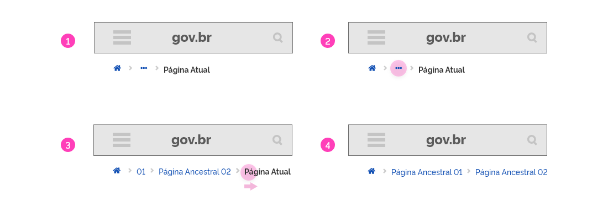

[version]: # '7.1.1'

---

## Uso

O Breadcrumbs é um componente auxiliar de navegação, portanto deve funcionar harmonicamente com o menu de navegação. Todos os sites e sistemas devem conter obrigatoriamente breadcrumbs, exceto quando a nevageção for linear ou conter apenas 1 nível de hierarquia. Nesses casos, o breadcrumbs é dispensável, pois além de não acrescentar utilidade à navegação, pode até mesmo confundir o usuário. Em grids de 4 colunas (por exemplo, aplicativos móveis), a utilização do recurso de breadcrumbs é **opcional**, porém, no caso de sua utilização, há uma versão específica disponível para esses casos, como ilustrado na figura abaixo:

---

## Anatomia

Este componente contém uma sequência de _links_ descrevendo a ordem de acesso nas páginas navegadas. A sequência de _links_ deve ser intercalada com setas (ícone Angle-Right) da família de ícones do Font Awesome O primeiro _link_ é representado pelo botão terciário Home (fa-home) que dá acesso à página inicial do sistema ou portal. O último texto da sequência não deve ser interativo, pois representa a página atual onde o usuário se encontra no momento.

1. Botão Terciário Home: fa-home;
2. Ícone Hierarquia (Setas): fa-angle-right;
3. _Link_;
4. Botão terciário Expandir;
5. Texto Página Atual.

---

### Detalhamento dos elementos

O Botão terciário Home deve estar sempre presente e direcionado para a Tela Inicial do _site_ ou sistema. O último elemento do breadcrumbs deverá ser sempre a tela atual em que o usuário se encontra e estar em destaque (_bold_) em relação aos demais elementos. Todos os outros elementos são interativos exceto os ícones Hierarquia que separam os ítens.

---

## Comportamento

O componente breadcrumbs pode ocorrer basicamente de três formas diferentes de acordo com a ilustração abaixo:

1. Em resoluções até 12 colunas;
2. Em resoluções até 12 colunas (colapsado);
3. Exclusivamente em resoluções com 4 colunas.

Sempre que possível opte pelo comportamento **padrão** que funcionará adequadamente na maioria dos casos.

1. O componente breadcrumbs na forma padrão funciona de maneira única, listando a hierarquia de _links_ que define a tela em que se encontra. Cada item do _breadcrumb_ é um _link_, exceto o último ítem, que define a tela atual em que o usuário se encontra. Ao clicar-se em qualquer _link_ do breadcrumbs, o usuário é direcionado à página correspondente. O botão terciário Home direciona sempre para a tela inicial.

2. Em situações em que o Breadcrumbs for tão extenso que o espaço destinado a ele não seja suficiente, deve-se utilizar a forma **colapsada**. Nesta modalidade, o breadcrumbs reduz o último _link_ para o botão terciário Expandir. Se for necessário, poderá reduzir também o penúltimo _link_ e assim em diante até que o espaço para comportar o breadcrumbs seja suficiente. Ao se clicar nos três pontos, todo os ítens do breadcrumbs é mostrado ao usuário mesmo que seja necessário quebrar a linha. Em resoluções de 8 colunas ou menos, pode ser necessário a utilização desse recurso.

3. Nos casos das resoluções com 4 colunas (dispositivos móveis), deve-se necessariamente optar pela forma **colapsada**. Nesse formato o breadcrumbs é apresentado sempre com todos os _links_ colapsados.

**Atenção:** o botão terciário Home e o texto "Tela Atual" jamais deverão ser colapsados, isto é, deverão estar sempre visíveis para o usuário.

Em casos de resoluções reduzidas a 4 colunas, como nos dispositivos móveis, a utilização de breadcrumbs é **opcional**, mas caso seja utilizada a opção **campactada** deverá ser obrigatoriamente adotada. Neste caso, o _breacrumbs_ já é apresentado de forma definitiva em sua compactação máxima e o botão terciário fa-ellipsis é utilizado para representar todo o caminho percorrido pelo usuário. Ao se tocar neste botão, todo caminho é apresentado ao em uma única linha.

### Breadcrumbs em resolução de 4 colunas

A seguir é detalhado o comportamento do Breadcrumbs em resoluções de 4 colunas:

1. O Breadcrumbs é apresentado em sua forma totalmente reduzida;

2. O usuário pode tocar no botão terciário Expandir;

3. O Breadcrumbs se extende completamente e disponibiliza todos os _links_ da hierarquia navegada pelo usuário até a tela onde se encontra;

4. Como o espaço é reduzido para apresentar todos os _links_ o usuário pode deslizar para a direita ou esquerda a fim de visualizar toda a informação.

### Estados dos _links_

A imagem abaixo ilustra os estados dos elementos do breadcrumbs.
Para mais informações sobre Estados, consultar o documentos de Fundamentos.

---

## Design Tokens

### Tipografia

| Name                 | Size                        | Weight                 | Text-transform |
| -------------------- | --------------------------- | ---------------------- | -------------- |
| Texto interativo     | `--font-size-scale-down-02` | `--font-weight-medium` | uppercase      |
| Página Atual (Texto) | `--font-size-scale-down-02` | `--font-weight-bold`   | uppercase      |

### Iconografia

| Name              | ícone                                | Size             | Class (Font Awesome) |
| ----------------- | ------------------------------------ | ---------------- | -------------------- |
| Hierarquia (Seta) | <i class="fas fa-chevron-right"></i> | `--icon-size-sm` | fa-chevron-right     |

### Botão Terciário

| Name                   | ícone                                 | Size             | Class (Font Awesome) |
| ---------------------- | ------------------------------------- | ---------------- | -------------------- |
| Home (Página Inicial)  | <i class="fas fa-home"></i>           | `--icon-size-sm` | fa-home              |
| Expandir (Reticências) | <i class="fas fas fa-ellipsis-h"></i> | `--icon-size-sm` | fa-ellipsis-h        |

### Cor

| Name                     | Property   | Color Token               |
| ------------------------ | ---------- | ------------------------- |
| Texto Interativo         | text color | `--color-primary-default` |
| Página Atual             | text color | `--color-secondary-08`    |
| Botão Terciário Home     | icon       | `--color-primary-default` |
| Ícone Hierarquia         | icon       | `--color-secondary-04`    |
| Botão Terciário Expandir | icon       | `--color-primary-default` |

### Espaçamento

| Name          | Property    | Token |
| ------------- | ----------- | ----- |
| Breadcrumbs | padding-top | 16px  |

Confira as imagens abaixo para a melhor compreensão dos espaçamentos utilizados:

