[version]: # '15.0.0'

## Princípios

### Experiência Única

Para criar uma experiência única nos produtos do governo federal, faz-se necessário a padronização dos elementos na interface gráfica. No caso de todos os componentes essa padronização é imprescindível, sendo assim o conjunto de botões devem ter a mesma linha gráfica, para que sejam facilmente reconhecidos e memorizados pelos usuários. Essa padronização torna mais rápida e agradável a experiência dos cidadãos ao acessar os serviços digitais do governo.

### Eficiência e Clareza

É fundamental que a palavra que acompanha o botão (label) seja de fácil compreensão, comunique e auxilie o usuário na navegação, ou seja a ação que o botão se destina a executar deve estar clara. O local onde os botões são aplicados devem seguir um padrão e auxiliam para deixar claro para o cidadão qual função cumprem na tela. Por isso num formulário por exemplo, os botões salvar devem sempre seguir um padrão de alinhamento e localização, isso auxilia e muito a compreensão das ações. Além disso, os estados e interações cumprem um papel importante: dar um feedback ao usuário sobre o que está acontecendo na interface. Eles cumprem a função de comunicar se o botão será ou foi acionado, se o botão está clicável, ou se está inacessível (desabilitado)… auxiliam o usuário no momento da navegação e são fundamentais para garantir uma boa usabilidade do sistema. Sendo assim, foram determinadas nessa documentação todos os estados e interações afim de facilitar o trabalho do desenvolvedor e do designer,

### Acessibilidade

Tamanho da fonte cor de background do botão, contraste entre a cor da letra e ícones e cor do background foram levados em consideração no momento de definir as características dos botões, e garantir com isso uma boa acessibilidade. Foi utilizada como cor dos botões primários a cor principal # 1351B4 já que com texto na cor branca possui contraste suficiente e dentro do padrão AA definido pela W3c. Os textos dos botões receberam tratamento semibold para tornar a leitura mais fácil.
Para melhorar a acessibilidade é recomendado que no código seja fornecida uma descrição textual para o botão através do atributo alt.

### Reutilização e Colaboração

Interfaces digitais do governo devem ser reutilizáveis sendo assim é necessário consultar as orientações de uso, contidas nessa documentação, para que sejam seguidas cores, tipografia, tamanho de texto e estados dos botões. Caso haja necessidade de alterar algum estado ou incluir alguma interação faz-se necessário que haja um trabalho em conjunto de criação e validação entre a equipe que vai propor e a equipe de Design do Design System para que sejam preservadas as características do padrão gráfico definido.

---

## Tipos

Existem, por padrão, 02 grupos de botões:

#### Botões Finalísticos

São botões cujas ações geralemente impactam na tela de uma forma mais geral, finalistica. Possuem uma ênfase maior.

#### Botões Contextuais

São os botões terciários que se destinam às ações mais pontuais de ênfase menor, que as representadas pelos botões primários e secundários. Sua estrutura é composta pelo label e ou ícone representativos da ação que ele irá realizar. Nesse caso, os ícones serão utilizados apenas em ações de fácil reconhecimento dos usuários, como por exemplo, editar, imprimir, pesquisar….

#### Botões Finalísticos

É composto de uma base (background ou contorno) e o label, que é um rótulo representativo da ação que ele irá realizar.  
Não foram utilizados ícones nos botões principais e secundários, para evitar que funções mais complexas não sejam bem representadas e sejam retratadas de forma a causar dúvida ao usuário. Essa regra foi adotada também para restringir que
cada equipe de desenvolvimento adote um padrão diferenciado do que está sendo definido no Design System. Porém, serão mostradas aqui aplicações dos botões com ícones, apenas para que se houver necessidade, sejam aplicadas em sistemas antigos do governo federal, os quais costumavam fazer uso de um ícone em suas estruturas,

##### 1 | Botão Principal ou Primário (Ênfase Alta)

São botões que possuem maior ênfase pela sua importância. Utilizados com maior frequência, são representados com preenchimento na cor principal e devem ser aplicados à/às ações cruciais da tela, informando ao usuário sua importância.
Por exemplo, quando num formulário aparece a ação salvar e a a ação cancelar. Espera-se que após preencher os campos,
o usuário deseje salvar, sendo assim, a cor botão salvar deve se destacar da cor do botão cancelar (que é a ação menos esperada).

A | Botões Web

B | Botões Mobile

C | Botões Mini

[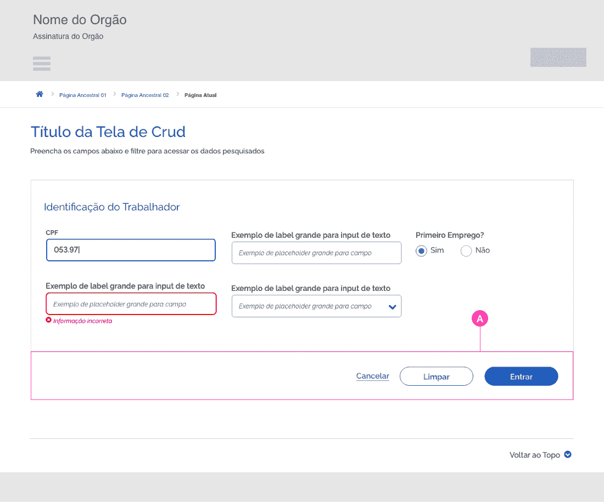](https://xd.adobe.com/spec/b10e5556-5012-4a45-67fc-677df7f6cb2a-c73f/screen/c2719157-5ffa-421f-9958-d32960e1a353/BotoesPrimarios-Exemplos)

Em sistemas antigos, que já utilizam os ícones em suas estruturas, o padrão a ser seguido deve ser: background do botão + ícone + Label. De forma geral é indicado que o ícone apareça antes do label. Porém, há situações onde a localização do ícone pode interferir no entendimento da ação. Nesse caso, é indicado que o ícone apareça à direita, exemplo Botão Avançar. É imprescindível que a seta apareça do lado direito, para que fique coerente com a ação de avançar.

[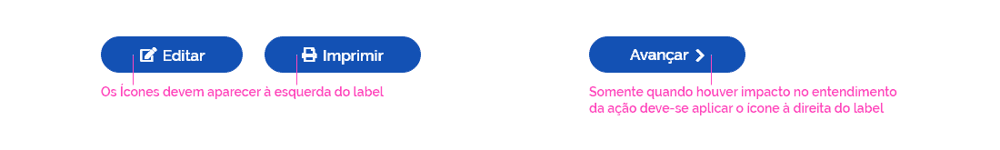](https://xd.adobe.com/spec/b10e5556-5012-4a45-67fc-677df7f6cb2a-c73f/screen/802b49c2-1789-4016-868e-b44d4ba08a43/BotoesPrimariosMobile-Exemplos)

É importante que os Botões Mobile apareçam ocupando toda a largura da tela, para ficar mais rápido o acesso através do toque. Exceto quando houver necessidade de colocar um botão primário e um secundário como ocorre nos filtros. Quando houver necessidade de incluir botões nos Card Mini é recomendado que os botões apareçam num formato menor: altura 32px.

[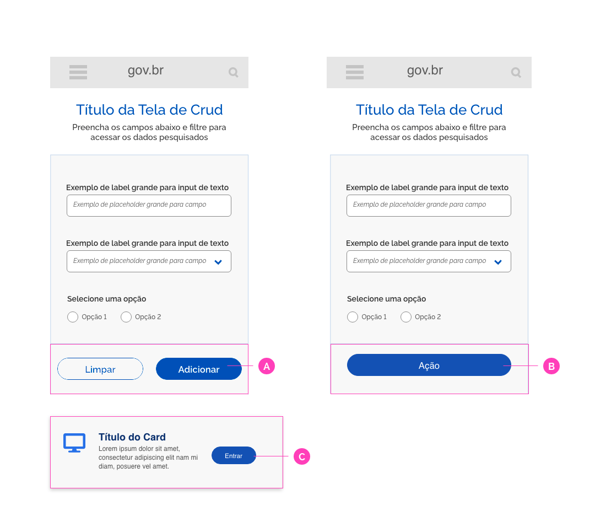](https://xd.adobe.com/spec/b10e5556-5012-4a45-67fc-677df7f6cb2a-c73f/screen/3dcde40d-405b-42f1-8ffb-1a73de8efa4b/BotoesPrimarioscomIcones)

##### 2 | Botão Call to Action (Ênfase Muito Alta )

São botões utilizados somente quando houver uma necessidade maior de chamar atenção do usuário, para execução de uma ação importante na tela. Diferem dos botões primários por aparecerem em menor frequência e apenas em uma ação específica da tela. São representados com preenchimento na cor secundária verde #268744 para diferenciar dos tons de azuis que prevalecem no padrão gráfico do Design System. Recebem uma borda cinza, que auxilia a ancorá-lo em qualquer lugar da tela. Além disso, o botão Call to Action, possui uma dimensão diferenciada que o distingue dos demais botões da tela, tornado-se o foco de atenção para realização de determinada ação,

D | Botão Call to Action Web
E | Botão Call to Action Mobile

[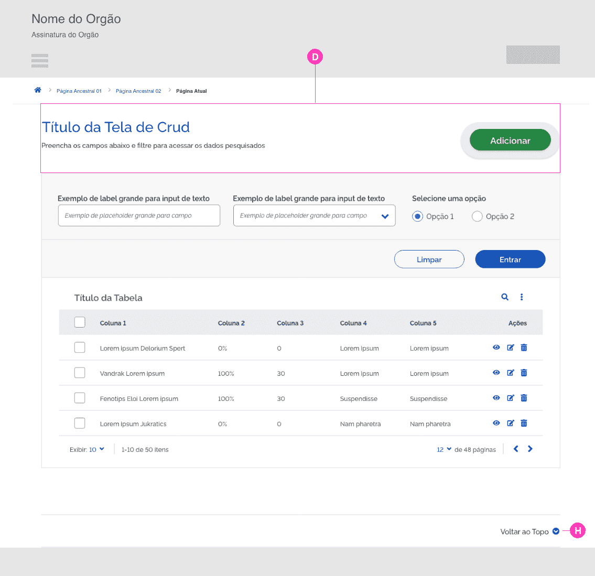](https://xd.adobe.com/spec/b10e5556-5012-4a45-67fc-677df7f6cb2a-c73f/screen/ebc4f43b-8b2c-4500-b324-0f424633d506/BotoesSecundarios)

[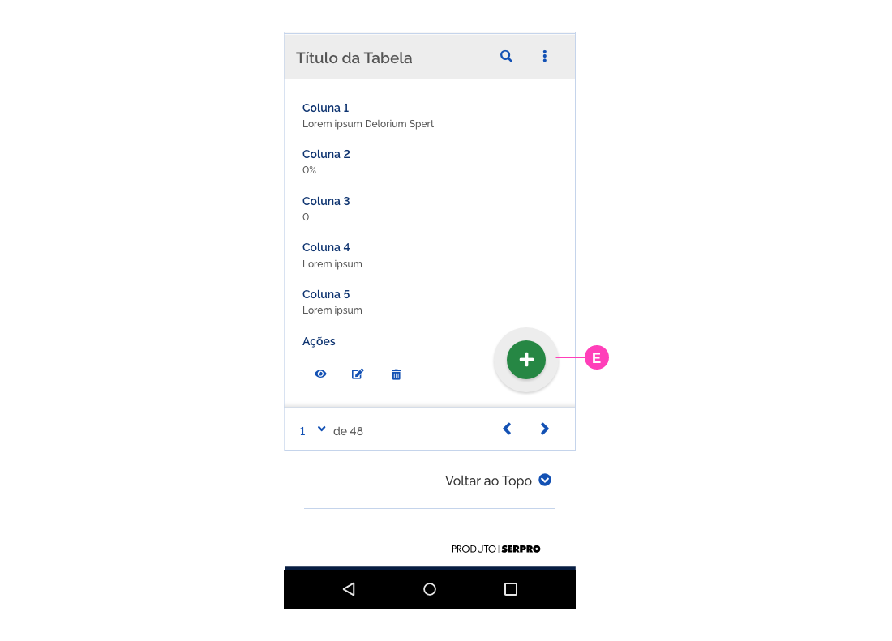](https://xd.adobe.com/spec/b10e5556-5012-4a45-67fc-677df7f6cb2a-c73f/screen/ebc4f43b-8b2c-4500-b324-0f424633d506/BotoesSecundarios)

##### 3 | Botão Secundário ou Delineado (Ênfase Média)

São usados ​​para dar uma ênfase intermediária, menor que os botões principais, além de serem representados visualmente pelo seu contorno delimitado por uma linha fina, sem cor, e sem preenchimento (vazado). Também chamados de “botões fantasmas”. Aparecem muitas vezes ao lado dos botões primários, porém as ações a que se destinam realizar são menos esperadas de serem acessadas pelo usuário do que as ações representadas pelos botões primários.

No exemplo a ação de filtrar é mais esperada do que a ação limpar, sendo assim o botão secundário representará a ação limpar, já que o mesmo possui relevância menor que o botão filtrar.

[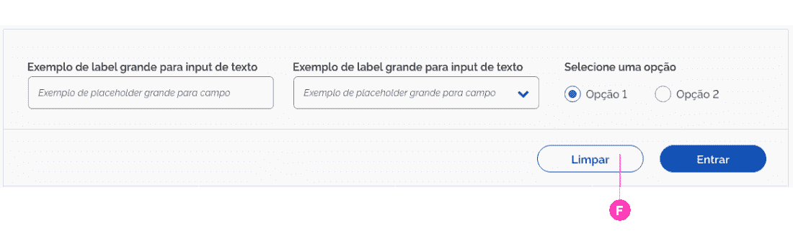](https://xd.adobe.com/spec/b10e5556-5012-4a45-67fc-677df7f6cb2a-c73f/screen/06d68c48-8a58-40e8-9cfd-9122621c3239/BotoesSecundarios-Exemplos)

Segue a mesma regra dos botões primários, no que se refere aos ícones: em sistemas antigos, que já utilizam os ícones em suas estruturas, o padrão a ser seguido deve ser: background do botão + ícone + Label. Somente nas situações onde a localização do ícone pode interferir no entendimento da ação é ndicado que o ícone apareça à direita.

#### Botões Contextuais

São botões que aparecem dentro do conteúdo textual da tela, podem executar ações mais pontuais ou com menos relevância que os botões primários e secundários.

##### 1 | Botão Terciário (Ênfase Baixa)

Se assemelham graficamente aos links, porém podem ou não vir acompanhados por ícones. Para manter a mesma linha gráfica adotada no Design System, foi aplicada a cor principal no botão terciário. Quando não vierem acompanhados por ícones o label deve vir sublinhado para que fique claro ao usuário que se trata de um elemento clicável.

##### 1.1 | Botão Terciário: Label sem Ícone

São botões que possuem características de hiperlinks.

##### 1.2 | Botão Terciário: Label com Ícone

São botões que possuem ações específicas dentro da navegação em um formulário ou tabela. Geralmente são representados por um rótulo (label) e um ícone. O rótulo aparece antes do ícone e com a primeira letra em caixa alta.

Em situações onde a localização do ícone pode interferir no entendimento da ação é indicado que o ícone apareça à direita do label.

[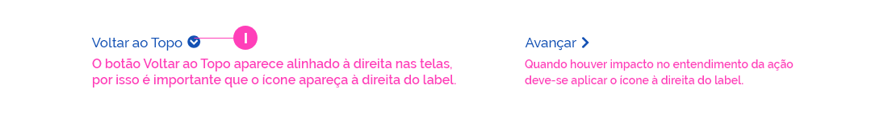](https://xd.adobe.com/spec/b10e5556-5012-4a45-67fc-677df7f6cb2a-c73f/screen/e5c569e8-f2aa-49ad-bd8e-0665817e2c3c/BotoesTerciarios-IconeDireita)

##### 1.3 | Botão Terciário: Ícone

São ícones que funcionam como botões. Possuem ações específicas, aparecem geralmente em tabelas ou formulários e as ações geralmente já são bem reconhecidas dos usuários.. Na versão web quando o usuário passa o mouse em cima aparece a ação em forma de hint. No caso dos dispositivos móveis, o ícone aparece sozinho, porém as ações são bem fáceis de ser reconhecidas (como editar, excluir, adicionar….) E nas situações onde as ações que não são facilmente reconhecidas pelos usuários (ou quando for possível) deve-se incluir o label ao lado ou embaixo dos ícones.

##### 2 | Botões de Redes Sociais (Média Ênfase)

São botões de acesso rápido aos sistemas através das redes sociais. Aparecem como opção para o usuário entrar sem precisar fazer um cadastro prévio. São representados por um background redondo + o ícone da rede social a qual representam.

---

## Estados dos Botões

Os estados dos botões servem para dar feedback ao usuário sobre as ações que estão acontecendo
quando há uma interação com o botão.

[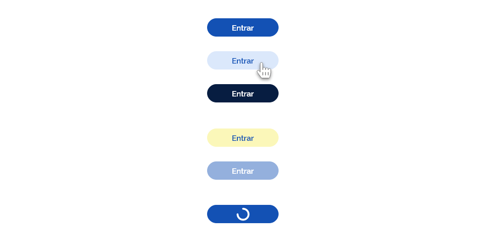](https://xd.adobe.com/spec/b10e5556-5012-4a45-67fc-677df7f6cb2a-c73f/screen/fe078498-a4ca-4c3d-908b-56861d889071/Botoes-Estados)

**Interativo (_Normal_)**
O estado padrão do botão, como ele é exibido naturalmente na interface.

**Hover**
O estado quando o cursor do mouse está sobre o botão, indica ao usuário que há uma ação a acontecer.

**Pressionado (_Click_)**
Acontece quando se clica num botão ou se mantem o clique. Pode ser visto em situações onde
temos mais de uma opção para escolher.

**Foco (_Focus_)**
Indica ao usuário onde se encontra o curso. Estado mais presente em campos de formulários.

**Desabilitado (_Disable_)**
Botões desabilitados são indicados com a diminuição da sua opacidade para 45%, indicando ao usuário que o botão está inacessível no momento.

**Progresso (_Progress_)**
O estado que indica que uma ação ainda está acontecendo. Muito utilizado quando a tela demora um pouco para exibir os dados. Importante para dar feedback ao usuário sobre o que está acontecendo.

[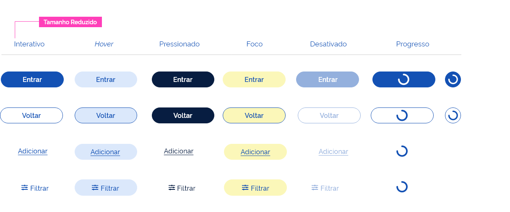](https://xd.adobe.com/spec/b10e5556-5012-4a45-67fc-677df7f6cb2a-c73f/screen/de71e30e-445a-4bb8-bd88-97634aad8067/TodosBotoes-Estados)

[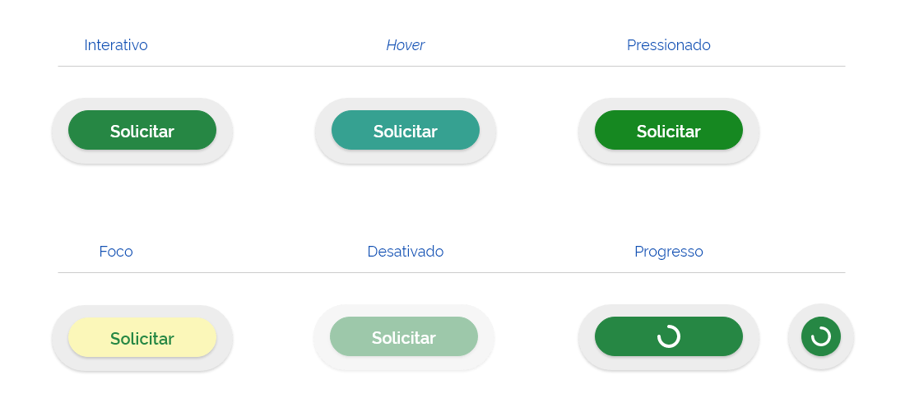](https://xd.adobe.com/spec/b10e5556-5012-4a45-67fc-677df7f6cb2a-c73f/screen/f89adfd7-bf6c-4c83-8e9c-66fdc6a3127e/BotoesCalltoAction-Estados)

## Anatomia

### Tom de Voz do Botão

O tom de voz de um botão é, essencialmente, como ele vai comunicar qual é a sua ação, além de estar alinhado com o tom de voz da sua marca, além de orientar de forma clara qual ação esperada.

Quando houver a necessidade da criação de um botão, é esperado que este informe qual a sua ação, reduzindo ao máximo falsas expectativas e dúvidas aos usuários.

Recomenda-se, sempre que possível, a utilização de verbos de ação no infinitivo.
Ex.: “Entrar” , Baixar”, “Cadastrar”, “Anexar”, etc.

### Formatação do Texto

Os textos dos botões precisam ser formatados em letras minúsculas com a primeira letra maiúscula. Ex.: Entrar

### Alinhamento

#### 1 | Botões Finalísticos

A | Botões Primários
Devem ser alinhados à direita da mancha da tela.

B | Botões Secundários
Normalmente se situam ao lado do botão primário na tela
observando o devido espaçamento mínimo entre ele o primário.

C | Botões Terciários
Pode vir alinhado à direita ou à esquerda dependendo
do conteúdo da tela,

#### 2 | Botões Contextuais

Podem ser posicionados de acordo com a necessidade das ações. Às vezes aparecem alinhados à esquerda com a massa de texto, outras vezes pode vir alinhado à direita com o conteúdo. Quando houver dúvida no posicionamento é fundamental, realizar um teste AB com pelo menos 05 usuários para testar a localização mais adequada.

D | Botões Internos
Devem ser alinhados de acordo com a necessidade,

### Dimensões

#### 1 | Botões Web

Os botões Call to Action na web assumem a altura de 80px largura mínima de 220px, sendo a altura do elemento verde 48px e a largura mínima de 180px. Podem serão reduzidos de acordo com a responsividade da tela. Já os botões primários e secundários assumem a altura de 40px e largura mínima de 156px.

Quando a palavra exceder 9 caracteres o botão adotará margem mínima de 40px entre o final do label e a extremidade do botão para botão finalístico e 44px para botão Call to Action.

#### 2 | Botões Web Mini

Os botões Mini são utilizados em locais com espaço reduzido, como acontece nos minicards e no botão sair presente no cabeçalho dos sistemas. Por necessidade para ocupar menos espaço na tela, os botões mini possuem uma dimensão diferenciada (altura 32px), porém as margens de 40px foram conservadas.

#### 3 | Botões Redes Sociais

Os botões de Redes Sociais são utilizados para o usuário logar ou se cadastrar de forma mais rápida nos sistemas. Foi aplicada a altura de 48px, a fim de destacá-los dos demais botões e do conteúdo da tela. Dessa forma, fica mais fácil o reconhecimento dos usuários e o acesso aos sistemas torna-se mais rápido.

#### 4 | Botões Mobile

A largura dos botões mobile será determinada pelo tamanho da tela (área útil de conteúdo). Os botões mobile nas resoluções maiores também assumem altura de 44px e diminuem de acordo com a responsividade. A altura mínima sugerido para os botões mobile deve ser 32px.

### Arredondamento

Os botões possuem os quatro cantos arredondados com raio de 20 px.

---

### Espaçamento

O espaçamento mínimo entre os botões deve ser de 24px.

A distância ideal entre os botões terciários é de 40px, ou seja se houver espaço preservar essa distância, já a distância mínima é a mesma aplicada entre os demais botões: 24px

##### Posicionamento

Os botões devem vir sempre alinhados à direita com o conteúdo da tela, inclusive nos formulários.

Os botões primários por merecerem mais destaque sempre se posicionarão à direita dos demais botões. O secundário também deve vir à direita dos terciários.

###### 1| Os botões primários devem vir à direita dos secundários

###### 2| Os botões primários devem vir à direita dos terciários

###### 3| Os botões secundários devem vir à direita dos terciários

###### 4| Os botões Call to Action

geralmente ocupam uma posição de destaque em relação aos demais botões, no exemplo esse botão foi utilizado para representar a funcionalidade de Adicionar, pois destaca-se das demais funcionalidades da tela. Nesse caso, o botão também vem alinhado a direita com o conteúdo, e geralmente ocupa sozinho o local onde foiu aplicado (não são aplicados botões primários e secundários lado a lado com o botão Call to Action).

[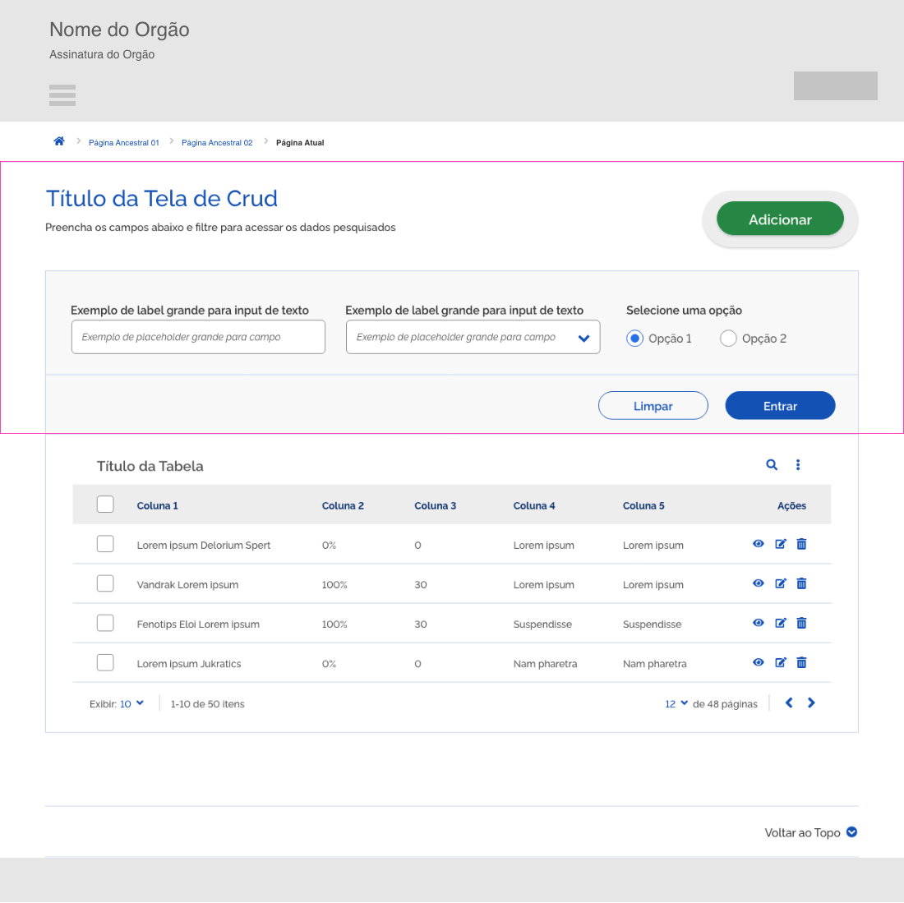](https://xd.adobe.com/spec/b10e5556-5012-4a45-67fc-677df7f6cb2a-c73f/screen/696837a4-3828-4e11-ae40-d7ce5b6d2238/BotoesCalltoAction-Posicionamento)

#### Sombra

O botão Call to Action recebeu uma sombra tanto no elemento verde como no elemento cinza, com intuito de ressaltá-lo dos demais botões.

