*Exemplo de botões disponíveis no Design System*

Utilize botões quando for necessário realizar ações contendo as seguintes características:

-   Reconhecimento imediato de uma ação interativa.

-   Ações que precisam de ênfases diversificadas.

-   Promover maior destaque das ações.

-   Possibilidade de utilizar tanto elementos visuais como textuais de forma consistentes.

-   Uso de *feedbacks* visuais variados e objetivos.

-   Gerar uma ou mais opções de escolha.

**Importante:** Os botões devem ser usados conforme a necessidade de interação do usuário com a interface. Sendo assim, ao se projetar uma interface deve-se planejar o posicionamento dos botões de forma estratégica, prevendo a eficiência na comunicação e levando o olhar do usuário ao local desejado. Também é necessário definir o grau de importância e hierarquia das ações através do uso correto dos tipos de botões.

---

## Anatomia

| ID  | Nome       |                          Referência                           | Uso         |
| --- | ---------- | :-----------------------------------------------------------: | ----------- |
| 1   | Ícone      | [Fundamento Iconografia](/ds/fundamentos-visuais/iconografia) | Opcional    |
| 2   | Rótulo     |  [Fundamento Tipografia](/ds/fundamentos-visuais/tipografia)  | Obrigatório |
| 3   | Superfície |  [Fundamento Superfície](/ds/fundamentos-visuais/superficie)  | Obrigatório |

*Anatomia completa do componente button*

---

### Detalhamento dos Itens

#### 1. Ícone (Opcional)

O ícone no botão do tipo padrão é um elemento opcional e deve ser usado quando houver uma necessidade de enfatizar visualmente a ideia da ação.

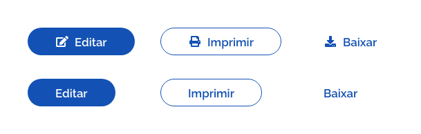
*Uso do ícone no botão padrão*

Nos botões do tipo circular a utilização é obrigatória, visto que a mensagem da ação é transmitida apenas pelo ícone.

*Uso do ícone no botão circular*

#### 2. Rótulo (Obrigatório)

O rótulo é um elemento obrigatório. A exceção ocorre na versão tipo circular uma vez que não existe rótulo.

*Diferente do botão padrão. O tipo circular não possui rótulo*

#### Tamanho dos Rótulos

Naturalmente as palavras usadas nos rótulos variam bastante de tamanho. O ideal é que seja utilizado apenas uma ou duas palavras no máximo. Deve-se evitar usar três ou mais palavras no rótulo. Nunca utilize quebra de linhas no rótulo_do botão.

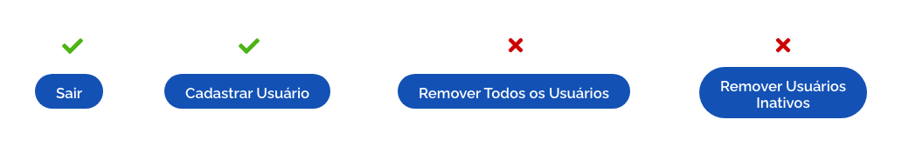
*Boas práticas no uso de rótulos*

**Importante:** o crescimento do botão deve acompanhar o tamanho do rótulo, porém as margens internas devem ser respeitadas.

##### Tom e Voz nos Rótulos

O tom e voz utilizado no rótulo é, essencialmente, como ele vai comunicar a sua ação. Deve estar alinhado com o tom de voz da sua marca, além de orientar de forma clara qual ação esperada.

Quando houver a necessidade da criação de um botão, é esperado que este informe qual a sua ação, reduzindo ao máximo falsas expectativas e dúvidas aos usuários.

Recomenda-se, sempre que possível, a utilização de verbos de **ação no infinitivo**.
Ex.: "Entrar" , "Cancelar", "Cadastrar", "Anexar", etc.

#### 3. Superfície (Obrigatório)

A Superfície é um elemento obrigatório e tem aparência distinta dependendo do tipo utilizado.

Em algumas situações, a superfície pode ter a opacidade de 0%, desta forma permite-se preservar a área de proteção do botão, assim como a área de *touch*.

*Diferentes possibilidades de superfícies nos botões*

---

## Tipos

Existem 2 tipos de botões no Design System: **Botão Padrão** e o **Botão Circular**.

### 1. Botão Padrão

É o tipo mais comum de botão, onde a ação é comunicada ao usuário através do **rótulo do botão**. Neste tipo pode-se utilizar os ícones para dar maior clareza à ação transmitida ao usuário.

*Exemplo de botão padrão*

### 2. Botão Circular

Podem servir para pequenas ações auxiliares dentro da interface até ações de maior importância. O objetivo pode ser bem diverso. Geralmente este tipo de botão é muito usado dentro de outros componentes ou em situações onde a representação do ícone é suficiente para transmitir a mensagem ao usuário.

*Exemplo de botão circular*

---

## Ênfases

Tendo em vista que existem níveis de importância e destaque que devem ser atribuídos aos elementos de interface e ações na tela, as ênfases utilizadas nos botões existem com a finalidade de proporcionar hierarquia visual a esses elementos e ações. Desta forma, os botões mudam de aparência conforme a ênfase utilizada.

Para cada tipo de botão, existem 3 opções de ênfase. Por ser uma característica visual, a hierarquia da ênfase pode alterar de acordo com aplicação do componente sobre um fundo claro ou escuro.

*Exemplo de ênfases nos tipos padrão e circular*

### 1. Ênfase Primária

É utilizada em botões que possuem maior importância ou prioridade. Utilizados com maior frequência, devem ser aplicados em ações cruciais da tela, informando ao usuário sua importância.

Por exemplo, em um formulário quando houver a ação "salvar" e "cancelar", espera-se que após preencher os campos, o usuário deseje salvar suas alterações, sendo assim, a cor do botão salvar deve se destacar da cor do botão cancelar (que é a ação menos esperada).

Utilize de forma limitada. Somente em ações estratégicas, voltadas para o objetivo principal de uma tela.

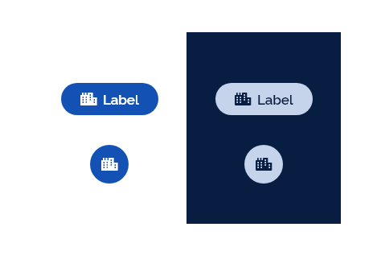
*Exemplo de Ênfase Primária aplicada no fundo claro e escuro*

### 2. Ênfase Secundária

É utilizada nos botões com importância intermediária. É usada ​​para dar uma importância menor que os botões de ênfase primária. Aparecem muitas vezes ao lado dos botões de ênfase primária, porém as ações a que se destinam realizar são menos esperadas de serem acessadas pelo usuário do que as ações representadas pelos botões de ênfase primária.

Utilize para ações que não sejam voltadas para o objetivo principal de uma página.

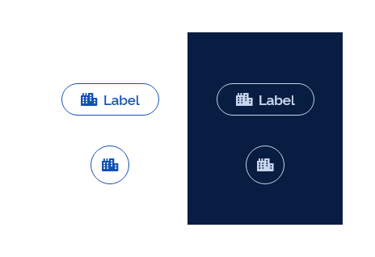
*Exemplo de ênfase secundária aplicada no fundo claro e escuro*

### 3. Ênfase Terciária

É usada em botões de baixa importância.

Utilize para ações de múltiplas escolha, opcionais e de suporte.

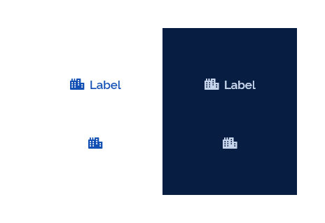
*Exemplo de ênfase terciária aplicada no fundo claro e escuro*

---

## Comportamentos

### 1. Bloco

Os botões padrões podem utilizar o comportamento bloco para alterar sua largura, ocupando todo o espaço disponível na superfície (seja dentro de um outro componente ou de um determinado lugar da *grid*).

Neste comportamento, o botão "empurra" qualquer outro elemento existente para outro espaço disponível.

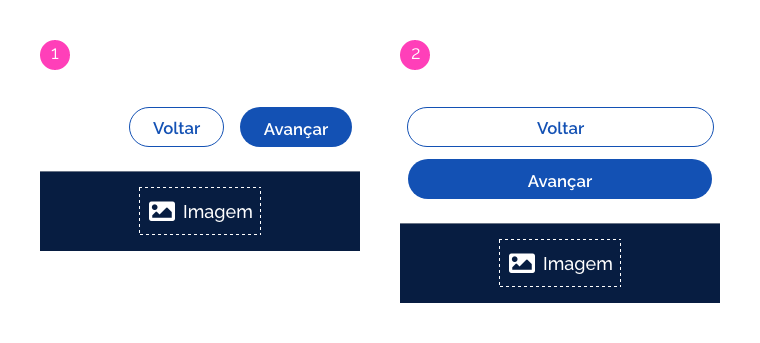
*Exemplo 1: Sem o comportamento bloco;*
*Exemplo 2: Com o comportamento Bloco*

Em dispositivos por toque, seu uso é altamente recomendado por facilitar o acesso aos botões importantes da interface.

**Atenção:**

-   Somente os botões tipo padrão possuem esse comportamento,

-   Pode ser utilizado em outros tipos de *grid*, porém, de forma cautelosa.

-   Pode ser utilizado em conjunto com qualquer tipo de densidade ou ênfase.

-   Pode existir, na mesma tela, botões sem ou com o comportamento bloco.

Abaixo, exemplos de possibilidades de uso desse comportamento (mas não necessariamente boas práticas de uso).

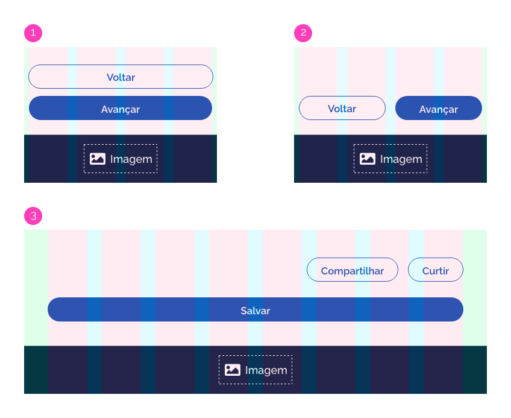
*Exemplo 1: botões usando toda a extensão da grid (uso recomendado para dispositivos por toque);*
*Exemplo 2: botões organizados por colunas;*
*Exemplo 3: comportamentos variados em uma mesma tela.*

### 2. Densidade

Para dar maior flexibilidade à composição de tela ou até mesmo refinar o "peso" visual dos botões na tela, é utilizado o recurso da densidade nos botões. O ajuste da densidade consiste em aumentar ou reduzir os espaçamentos internos do botão de forma a deixá-los mais compactos ou mais expandidos em seu formato.

Para isto, o Design System utiliza três níveis de densidade:

-   **Densidade baixa:** O botão tem sua altura aumentada.

-   **Densidade padrão:**  É a forma padrão do componente button.

-   **Densidade alta:** O botão tem sua altura reduzida.

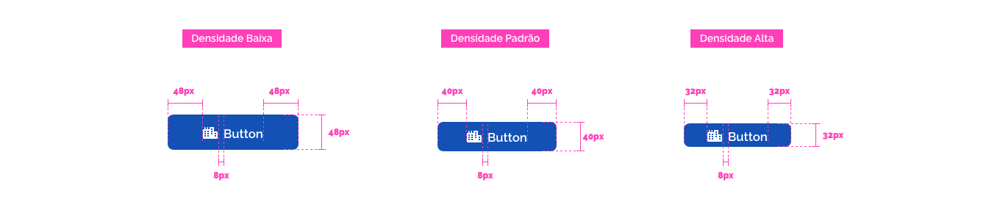
*Exemplo de densidades aplicada ao botão*

**Importante:** é importante observar que o rótulo do botão e o ícone permanecem sempre centralizados tanto na largura quanto na altura, e seus tamanhos inalterados. Também permanece inalterado o espaçamento entre o rótulo e o ícone.

Nos botões de tipo circular ocorre o incremento na altura e largura do botão de densidade baixa e redução na altura e largura do botão de densidade alta.

*Exemplo de densidades aplicada ao botão circular*

Consulte as informações dos valores dos espaçamentos e alturas na seção *Design Tokens*.

### 3. Posicionamento

Tendo em vista a utilização das diferentes ênfases nos botões com o intuito de manter uma hierarquia visual na interface, é necessário posicioná-los de forma coerente em relação ao grau de importância de cada uma dessas ênfases.

Deve-se seguir o seguinte princípio: a **ênfase de maior relevância** deverá vir sempre à **direita**.

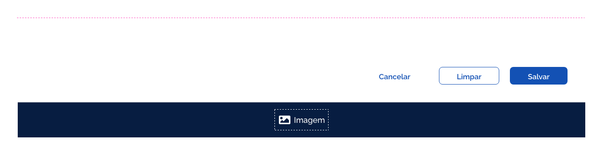
*Por exemplo, quando três botões com ênfases diferentes forem utilizados juntos, o botão com ênfase primária será posicionado à direita e em sequência o de ênfase secundária e terciária*

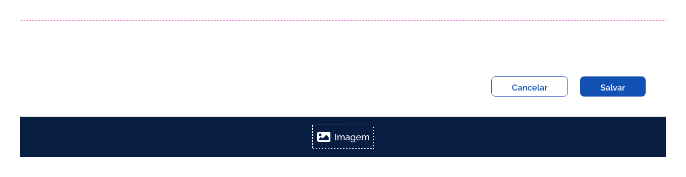
*O mesmo ocorre quando houver apenas o botão de ênfase primária e o de ênfase secundária juntos*

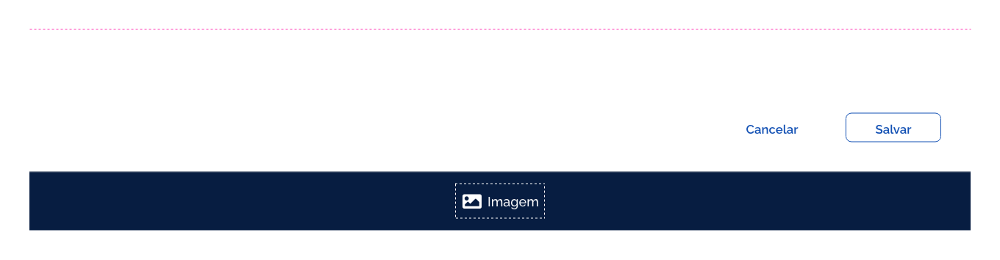
*Quando estiverem juntos apenas o botão de ênfase secundária e o de ênfase terciária, o de ênfase secundária será posicionado à direita*

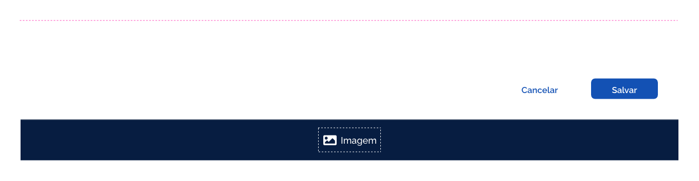
*Com os botões de ênfase primária e terciária segue-se o mesmo princípio*

Quando a disposição da tela permitir que os botões apareçam posicionados verticalmente, o botão mais relevante virá posicionado mais abaixo.

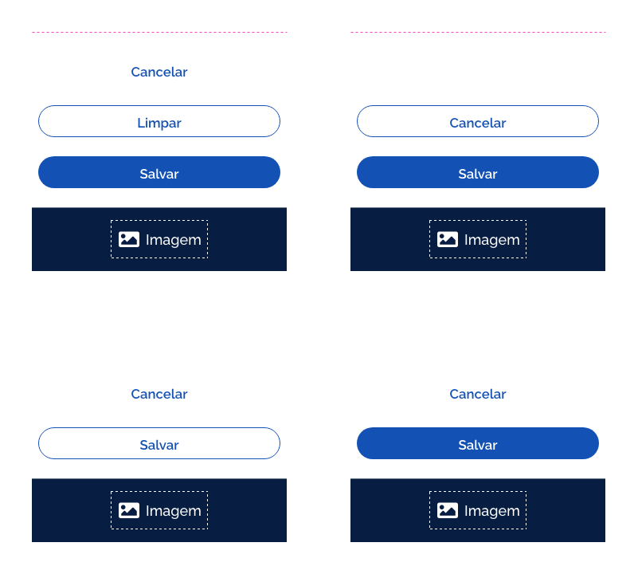
*Exemplo de posicionamento em resoluções menores*

### 4. Comportamento Toggle

O comportamento *toggle* permite a alternância dos rótulos e/ou ícones internos ao botão, de forma a transmitir ações opostas ou vinculadas entre si.

Neste comportamento, após o clique do usuário no botão, o rótulo ou ícone alterna para a ação oposta. Ao ser efetuado um novo clique no mesmo botão, o rótulo ou ícone alterna para ação inicial, e assim por diante.

*Exemplos de uso do toggle*

### 5. *Loading*

É um comportamento opcional. O componente *loading* aparece apenas quando o botão se encontra no estado *progress*. Esta situação ocorre quando existe a necessidade de mostrar ao usuário o progresso da requisição dentro do próprio botão após a interação.

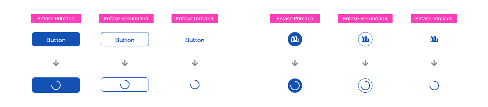
*Uso do loading nos botões*

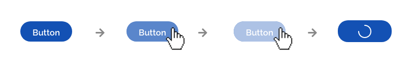
*Neste estado todo o conteúdo do botão é substituído pelo componente loading*

### 6. Área de Proteção

Quando o botão estiver próximo a algum outro componente, mantenha um espaçamento mínimo para que ele seja notado na tela e que sua área de interação não se confunda com as de outros componentes.

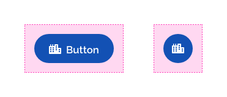
*Exemplos área de proteção no botão*

Utilize algum espaçamento da escala de **layout**, listado no Fundamento Espaçamento, de forma consistente ao longo de sua interface.

### 7. Estados

Os estados dos botões são úteis para dar *feedback* ao usuário sobre as ações que ocorrem quando houver uma interação com o botão. Abaixo listamos os estados do componente *button* e suas características em fundo claro e escuro:

#### Interativo

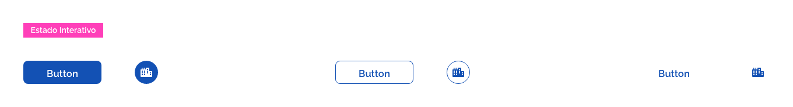
*O estado padrão do botão, como ele é exibido naturalmente na interface*

#### Hover

*O estado quando o cursor do mouse está sobre o botão, indica ao usuário que se trata de um elemento interativo*

#### Pressionado

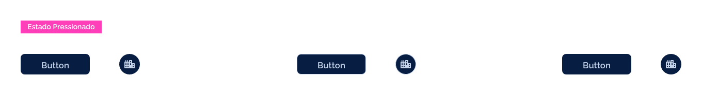
*Acontece quando se clica num botão ou se mantém o clique*

#### Desabilitado

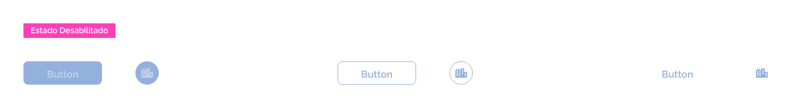
*Botões desabilitados indicam ao usuário que o botão está inacessível no momento*

#### Ativado

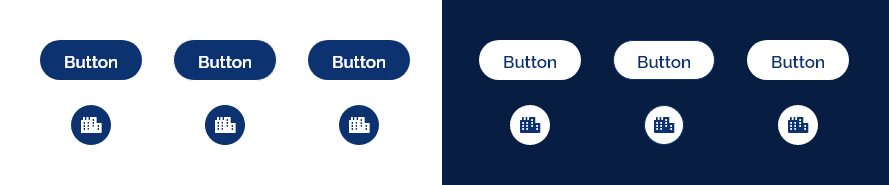
*Este estado ocorre quando um botão, de um conjunto de opções, é ativado. Assim, o botão se mantém "marcado"*

#### Progresso

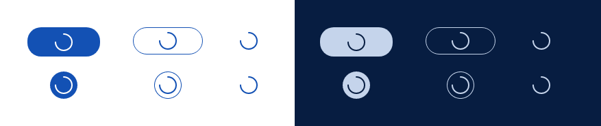
*O estado que indica que uma ação ainda está acontecendo. Muito utilizado quando a tela demora um pouco para exibir os dados. Importante para dar feedback ao usuário sobre o que está acontecendo*

---

## Especificações

### Tipografia

| Name            | Size                      | Weight                    | Text-transform |
| --------------- | ------------------------- | ------------------------- | :------------: |
| Rótulo (Padrão) | `--font-size-scale-up-01` | `--font-weight-semi-bold` |     `none`     |

### Iconografia

| Name             | Size               |
| ---------------- | ------------------ |
| Ícone (Padrão)   | `--icon-size-base` |
| Ícone (Circular) | `--icon-size-base` |

### Cor

| Name                                       |     Property     | Color Token            | Opacidade |
| ------------------------------------------ | :--------------: | ---------------------- | :-------: |
| Ícone, Rótulo (Primária)                   |    text color    | `--pure-0`             |     -     |
| Ícone, Rótulo (Primária - Fundo Escuro)    |    text color    | `--blue-warm-vivid-90` |     -     |
| Ícone, Rótulo (Secundária)                 |    text color    | `--blue-warm-vivid-70` |     -     |
| Ícone, Rótulo (Secundária -  Fundo Escuro) |    text color    | `--blue-warm-vivid-20` |     -     |
| Ícone, Rótulo (Terciária)                  |    text color    | `--blue-warm-vivid-70` |     -     |
| Ícone, Rótulo (Terciária - Fundo Escuro)   |    text color    | `--blue-warm-vivid-20` |     -     |
| Superfície (Primária)                      | background color | `--blue-warm-vivid-70` |     -     |
| Superfície (Primária - Fundo Escuro)       | background color | `--blue-warm-vivid-20` |     -     |
| Superfície (Secundária)                    | background color | `--pure-0`             |     -     |
| Superfície (Secundária - Fundo Escuro)     | background color | `--blue-warm-vivid-90` |     -     |
| Superfície (Terciária)                     |        -         | -                      |   `0%`    |
| Superfície (Secundária)                    |   border color   | `--blue-warm-vivid-70` |     -     |
| Superfície (Secundária-  Fundo Escuro)     |   border color   | `--blue-warm-vivid-20` |     -     |

### Dimensões

| Name                                     | Height |   Width    |
| ---------------------------------------- | :----: | :--------: |
| Superfície (Padrão - Densidade Baixa)    | `48px` | `variável` |
| Superfície (Padrão - Densidade Padrão)   | `40px` | `variável` |
| Superfície (Padrão - Densidade Alta)     | `32px` | `variável` |
| Superfície (Circular - Densidade Baixa)  | `48px` |   `48px`   |
| Superfície (Circular - Densidade Padrão) | `40px` |   `40px`   |
| Superfície (Circular - Densidade Alta)   | `32px` |   `32px`   |

### Espaçamentos

| Name       |          Property           |     Spacing Token      |
| ---------- | :-------------------------: | :--------------------: |
| Ícone      |        margin-right         | `--spacing-scale-base` |
| Superfície | padding-right, padding-left |  `--spacing-scale-3x`  |

### Arredondamento

| Name                | Property      | Value                    |
| ------------------- | ------------- | ------------------------ |
| Superfície (Padrão) | border-radius | `--surface-rounder-pill` |
