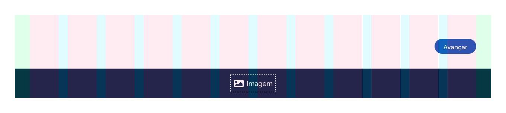
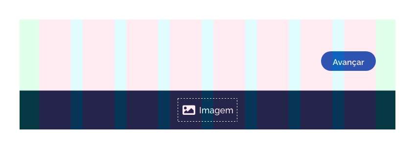
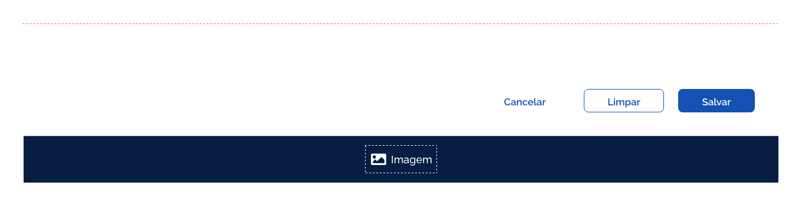
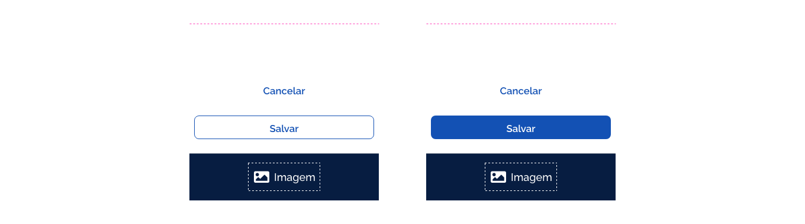
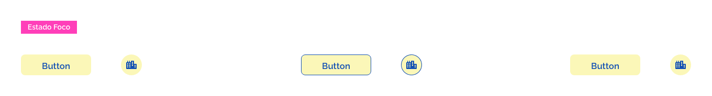
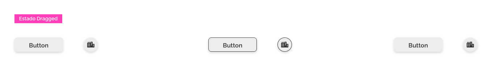

[version]: # '16.0.0'

---

## Uso

Os botões devem ser usados conforme a necessidade de interação do usuário com a interface. Sendo assim, ao se projetar uma interface deve-se planejar o posicionamento dos botões de forma estratégica, prevendo a eficiência na comunicação e levando o olhar do usuário ao local desejado. Também é necessário definir o grau de importância e hierarquia das ações através do uso correto dos tipos de botões.

---

## Anatomia

Abaixo estão listados os elementos que compõem o _Componente Botão_:

1. Ícone (Opcional no tipo Retangular / Obrigatório no tipo Circular);
2. Rótulo (Obrigatório no tipo Retangular / Inexistente no tipo Circular);
3. Container do Botão;
4. Componente Loading (Opcional);

### Detalhamento dos elementos

#### 1. Ícone

##### A. Opcional no tipo Retangular

O ícone no Botão do tipo Retangular é um elemento opcional e deve ser usado quando houver uma necessidade de enfatizar visualmente a ideia da ação. Veja os exemplos abaixo:

##### B. Obrigatório no tipo Circular

Nos Botões do tipo Circular a utilização é obrigatória, visto que a mensagem da ação é transmitida apenas pelo ícone.

#### 2. Rótulo

O _Rótulo_ é um elemento obrigatório do _Componente Botão_, a excessão ocorre na versão do _Botão_ do Tipo _Circular_, onde não existe rótulo. As cores dos rótulos variam de acordo com a ênfase do _Botão_. No _Botão_ com ênfase _Primária_ o _Rótulo_ é branco, com ênfase _Secundária_ e _Terciária_ o _Rótulo_ é azul. Consulte detalhes na seção _Tipos e Ênfases_.

As cores dos rótulos ainda variam bastante quando em decorrência da mudança de estados. Consulte mais detalhes na seção _Comportamento > Estados_.

##### Tamanho dos Rótulos

Naturalmente as palavras usadas nos rótulos variam bastante de tamanho. O ideal é que seja utilizado apenas uma ou duas palavras no máximo. Deve-se evitar usar três ou mais palavras no _Rótulo_. Nunca utilize quebra de linhas no _Rótulo_ do _Botão_.

IMPORTANTE - O crescimento do botão deve acompanhar o tamanho do Rótulo, porém as margens internas deverão ser respeitadas. Consulte detalhes em _Comportamento > Densidade_.

##### Tom de Voz nos Rótulos

O tom de voz utilizado no rótulo é, essencialmente, como ele vai comunicar qual é a sua ação, além de estar alinhado com o tom de voz da sua marca, além de orientar de forma clara qual ação esperada.

Quando houver a necessidade da criação de um botão, é esperado que este informe qual a sua ação, reduzindo ao máximo falsas expectativas e dúvidas aos usuários.

Recomenda-se, sempre que possível, a utilização de verbos de ação no infinitivo.
Ex.: “Entrar” , Baixar”, “Cadastrar”, “Anexar”, etc.

#### 3. Container do Botão

O _Container_ do _Botão_ é um elemento obrigatório e tem aparência distinta dependendo do _Tipo_ e _Ênfase_ utilizada no Botão.

Nos _Botões_ com _Ênfase_ _Teciária_ o container tem opacidade de 0%, desta forma permite-se preservar a área de proteção do _Botão_, assim como a área de _Touch_.

O _Container_ do _Botão_ ainda pode mudar de aparência dependendo do estado em que o _Botão_ se encontra. Abaixo temos os exemplos do _Botão com Ênfase Primária_ e _Terciário_ no estado _Hover_, quando há mudança de cor no _Container_.

Consulte mais detalhes a respeito dos _Estados_ dos _Botões_ em _Comportamento > Estados_.

#### 4. Componente Loading (Opcional)

É um elemento opcional. O _Componente Loading_ aparece apenas quando o _Botão_ se encontra no _Estado Progress_. Esta situação ocorre quando existe a necessidade de mostrar ao usuário o progresso da requisição dentro do _Componente Botão_, após a interação do usuário com o mesmo.

Neste estado o _Rótulo_ do _Botão_ é substituído pelo _Componente Loading_, como demonstra o exemplo abaixo:

---

## Tipos e Ênfases

Existem 2 tipos de botões no DSGOV: _Botão Retangular_ e o _Botão Circular_.

### 1. Botão do Tipo Retangular

É o tipo mais comum de _Botão_, onde a ação é comunicada ao usuário através do _Rótulo_ do _Botão_. Neste tipo pode-se utilizar os ícones para dar maior clareza à ação transmitida ao usuário.

### 2. Botão do Tipo Circular

Este tipo de _Botão_ é utilizado em vários tipos de situações. Usados em interfaces _Mobile_ ou _Desktop_, podem servir para pequenas ações auxiliares dentro da interface até ações de maior importância. Aqui o objetivo pode ser bem diverso. Geralmente este tipo de _Botão_ é muito usado dentro de outros _Componentes_ ou em situações onde a representação do ícone é suficiente para transmitir a mensagem ao usuário.

### Ênfases

Tendo em vista que existem níveis de importância e destaque que devem ser atribuídos aos elementos de interface e ações na tela, as ênfases utilizadas nos botões existem com a finalidade de proporcinar hierarquia visual a esses elementos e ações. Desta forma, os Botões mudam de aparência conforme a ênfase utilizada. Veja o exemplo abaixo:

### Ênfase Primária

É utilizada em botões que possuem maior importância ou prioridade. Utilizados com maior frequência, são representados com preenchimento na cor principal e devem ser aplicados às ações cruciais da tela, informando ao usuário sua importância. Por exemplo, quando num formulário aparece a ação salvar e a ação cancelar. Espera-se que após preencher os campos, o usuário deseje salvar, sendo assim, a cor botão salvar deve se destacar da cor do botão cancelar (que é a ação menos esperada).

### Ênfase Secundária

É utilizada nos botões com importância intermediária. É usada ​​para dar uma importância menor que os botões de ênfase primária, além de serem representados visualmente pelo seu contorno delimitado por uma linha. Aparecem muitas vezes ao lado dos botões de ênfase primária, porém as ações a que se destinam realizar são menos esperadas de serem acessadas pelo usuário do que as ações representadas pelos botões de ênfase primária.

### Ênfase Terciária

É usada em botões de baixa importância. Possuem uma característica onde o _Container_ tem a opacidade de 0%. Para os _Rótulos_ e _Ícones_ em _Botões_ com _Ênfase_ _Teciária_, foi aplicada a cor principal.

---

## Comportamento

### 1. Responsividade

Os Botões se adequam em tamanho e posição aos diferentes tipos de Grids. Observe os exemplos abaixo:

#### Grid de 12 colunas

Nas resoluções com Grid de 12 colunas, a largura dos Botões deve seguir seu tamanho natural, de acordo com o tamanho do _Rótulo_ e respeitando as margens internas dos _Botões_.

#### Grid de 8 colunas

Da mesma forma, nas _Grids_ de 8 colunas os _Botões_ possuem o mesmo comportamento que possuem nas Grids de 12 colunas.

#### Grid de 4 colunas

Na _Grid_ de 4 colunas, os _Botões_ deverão ocupar toda largura da tela, respeitando as margens de proteção da _Grid_.

### 2. Densidade

Para dar maior flexibilidade em composição de tela ou até mesmo refinar o "peso" visual dos _Botões_ na tela, é utilizado o recurso da _Densidade_ nos _Botões_. O ajuste da _Densidade_ consiste em aumentar ou reduzir a altura e os espaçamentos internos do _Botão_ de forma a deixá-los mais compactos ou mais expandidos em seu formato.

Para isto, no Design System GOV.BR foi utilizado três níveis de _Densidade_: _Densidade Baixa_, _Densidade Alta_ e _Densidade Padrão_.

#### A. Densidade Padrão

O _Botão_ possui uma altura de 40px e espaçamentos internos (_padding_) de 40px. É a forma comum do _Componente Botão_.

#### B. Densidade Baixa

Aqui o _Botão_ tem sua altura aumentada em 8px, e os espaçamentos internos (_padding_) laterais aumentados em 8px de cada lado.

#### C. Densidade Alta

Aqui o _Botão_ tem sua altura reduzida em 8px, e seus espaçamentos internos (_padding_) reduzidos em 8px de cada lado.

IMPORTANTE: É importante observar que o _Rótulo_ do _Botão_ e o _Ícone_ permanecem sempre centralizados tanto na largura quanto na altura, e seus tamanhos inalterados. Também permanece inalterado o espaço de 8px entre o _Rótulo_ e o _Ícone_.

Nos _Botões_ de tipo _Circular_ ocorre o incremento de 8px na altura e largura do _Botão_ de _Densidade Baixa_ e redução de 8px na altura e largura do _Botão_ de _Densidade Alta_. Observe o modelo abaixo:

Consulte as informações dos valores dos espaçamentos e alturas na seção _Design Tokens_.

### 3. Posicionamento

Tendo em vista a utilização das diferentes _Ênfases_ nos _Botões_ com o intuito de manter uma hierarquia visual na interface, é necessário posicioná-los de forma coerente em relação ao grau de importância de cada um dessas _Ênfases_.

Deve-se seguir o seguinte princípio: a ênfase de maior relevância deverá vir sempre à direita.

Por exemplo, quando três botões com ênfases diferentes forem utilizados juntos, lado a lado, o _Botão_ com _Ênfase Primária_ será posicionado à direita e em sequência o de _Ênfase_ _Secundária_ e _Terciária_.

O mesmo ocorre quando houver apenas o _Botão_ de _Ênfase Primária_ e o de _Ênfase Secundária_ juntos.

Quando estiverem juntos apenas o _Botão_ de _Ênfase Secundária_ e o de _Ênfase Terciária_, o de _Ênfase Secundária_ será posicionado à direita.

Com os _Botões_ de _Ênfase Primária_ e _Terciária_ segue-se o mesmo princípio.

Quando a disposição da tela permitir que os botões apareçam posicionados verticalmente, o _Botão_ mais relevante virá posicionado mais abaixo.

### 4. Comportamento Toggle

O comportamento _Toggle_ permite a alternância dos _Rótulos_ e/ou _Ícones_ internos ao _Botão_, de forma a transmitir ações opostas ou vinculadas entre si.

Por exemplo:

Neste comportamento, após o clique do usuário no _Botão_, o _Rótulo_ ou _Ícone_ alternam para a ação oposta. Ao ser efetuado um novo clique no mesmo _Botão_, o _Rótulo_ ou _Ícone_ alternam para ação inicial, e assim por diante.

### 5. Estados

Os estados dos botões servem para dar feedback ao usuário sobre as ações que estão acontecendo quando há uma interação com o botão. Abaixo listamos os estados do _Componente Botão_ e suas características:

#### Interativo (_Default_)

O estado padrão do botão, como ele é exibido naturalmente na interface.

#### Hover (_Hover_)

O estado quando o cursor do mouse está sobre o botão, indica ao usuário que há uma ação a acontecer.

#### Pressionado (_Pressed_)

Acontece quando se clica num botão ou se mantem o clique. Pode ser visto em situações onde temos mais de uma opção para escolher.

#### Foco (_Focus_)

Indica ao usuário onde se encontra o curso. Estado mais presente em campos de formulários.

#### Desabilitado (_Disabled_)

Botões desabilitados são indicados com a diminuição da sua opacidade para 45%, indicando ao usuário que o botão está inacessível no momento.

#### Progresso (_Progress_)

O estado que indica que uma ação ainda está acontecendo. Muito utilizado quando a tela demora um pouco para exibir os dados. Importante para dar feedback ao usuário sobre o que está acontecendo.

#### Arrastado (_Dragged_)

Ocorre quando o usuário clica e arrasta o elemento _Botão_ sobre a tela.

#### Ativado (_Activated_)

Este estado ocorre quando o elemento _Botão_ é selecionado pelo usuário. Assim, o _Botão_ se mantém 'marcado' ou 'ativado' e servir de base para uma ação de interação futura.

Consulte as informações de cores e opacidade dos estados na seção _Design Token_.

---

## Design Tokens

### Tipografia

| Name                    | Size                      | Weight                    | Text-transform |
| ----------------------- | ------------------------- | ------------------------- | :------------: |
| Rótulo Botão Retangular | `--font-size-scale-up-01` | `--font-weight-semi-bold` |     `none`     |

### Iconografia

| Name                   | Size               |
| ---------------------- | ------------------ |
| Ícone Botão Retangular | `--icon-size-base` |
| Ícone Botão Circular   | `--icon-size-base` |

### Cor

| Name                              |     Property     | Color Token               | Opacidade |
| --------------------------------- | :--------------: | ------------------------- | :-------: |
| Rótulo Ênfase Primária            |    text color    | `--color-secondary-01`    |     -     |
| Rótulo Ênfase Secundária          |    text color    | `--color-primary-default` |     -     |
| Rótulo Ênfase Terciária           |    text color    | `--color-primary-default` |     -     |
| Container Botão Ênfase Primária   | background color | `--color-primary-default` |     -     |
| Container Botão Ênfase Secundária | background color | `--color-secondary-01`    |     -     |
| Container Botão Ênfase Terciária  |        -         | -                         |   `0%`    |
| Borda Botão Ênfase Secundária     |   border color   | `--color-primary-default` |     -     |
| Ícone Botão Ênfase Primária       |      color       | `--color-secondary-01`    |     -     |
| Ícone Botão Ênfase Secundária     |      color       | `--color-primary-default` |     -     |
| Ícone Botão Ênfase Terciária      |      color       | `--color-primary-default` |     -     |

### Estados

#### Estado Hover

| Name            | Property         |        Token Status         | Color Token                 | Opacidade |
| --------------- | ---------------- | :-------------------------: | --------------------------- | :-------: |
| Container Botão | background color | `--status-hover-background` | `--color-primary-pastel-02` |     -     |

#### Estado Pressionado

| Name            | Property         |         Token Status          | Color Token                 | Opacidade |
| --------------- | ---------------- | :---------------------------: | --------------------------- | :-------: |
| Container Botão | background color | `--status-pressed-background` | `--color-primary-darken-02` |     -     |
| Rótulo/Ícone    | text-color/color |    `--status-pressed-text`    | `--color-primary-pastel-01` |     -     |

#### Estado Foco

| Name            | Property         |        Token Status        | Color Token          | Opacidade |
| --------------- | ---------------- | :------------------------: | -------------------- | :-------: |
| Container Botão | background color | `--status-focused-overlay` | `--color-support-02` |   `30%`   |

#### Estado Desabilitado

| Name            | Property         |          Token Status          | Color Token            | Opacidade |
| --------------- | ---------------- | :----------------------------: | ---------------------- | :-------: |
| Container Botão | background color | `--status-disabled-background` | `--color-secondary-03` |   `45%`   |
| Rótulo/Ícone    | text-color/color |    `--status-disabled-text`    | `--color-secondary-04` |   `45%`   |

#### Estado Progress

| Name                              |     Property     | Color Token               | Opacidade |
| --------------------------------- | :--------------: | ------------------------- | :-------: |
| Container Botão Ênfase Primária   | background color | `--color-primary-default` |     -     |
| Container Botão Ênfase Secundária | background color | `--color-secondary-01`    |     -     |
| Container Botão Ênfase Terciária  |        -         | -                         |   `0%`    |
| Borda Botão Ênfase Secundária     |   border color   | `--color-primary-default` |     -     |
| Loading Botão Ênfase Primária     |      color       | `--color-secondary-01`    |     -     |
| Loading Botão Ênfase Secundária   |      color       | `--color-primary-default` |     -     |
| Loading Botão Ênfase Terciária    |      color       | `--color-primary-default` |     -     |

#### Estado Arrastado

| Name            | Property         |         Token Status          | Color Token            |                       Sombra                       |
| --------------- | ---------------- | :---------------------------: | ---------------------- | :------------------------------------------------: |
| Container Botão | background color | `--status-dragged-background` | `--color-secondary-03` | `--color-secondary-09 (16% opacidade),x:0,y:3,b:6` |
| Rótulo/Ícone    | text-color/color |    `--status-dragged-text`    | `--color-secondary-08` |                         -                          |

#### Estado Ativo

| Name            | Property         |          Token Status           | Color Token                  | Opacidade |
| --------------- | ---------------- | :-----------------------------: | ---------------------------- | :-------: |
| Container Botão | background color | `--status-activated-background` | `--color-primary-darknen-01` |     -     |
| Rótulo/Ícone    | text-color/color |    `--status-activated-text`    | `--color-secondary-01`       |     -     |

### Dimensões

| Name                                        | Height |   Width    |
| ------------------------------------------- | :----: | :--------: |
| Container Botão Retangular Densidade Baixa  | `48px` | `variável` |
| Container Botão Retangular Densidade Padrão | `40px` | `variável` |
| Container Botão Retangular Densidade Alta   | `32px` | `variável` |
| Container Botão Circular Densidade Baixa    | `48px` |   `48px`   |
| Container Botão Circular Densidade Padrão   | `40px` |   `40px`   |
| Container Botão Circular Densidade Alta     | `32px` |   `32px`   |

### Espaçamentos

| Name                       | padding-left         | padding-right        | margin-left          | margin-right           |
| -------------------------- | -------------------- | -------------------- | -------------------- | ---------------------- |
| Botão Densidade Baixa      | `--spacing-scale-6x` | `--spacing-scale-6x` | `--spacing-scale-3x` | `--spacing-scale-3x`   |
| Botão Densidade Padrão     | `--spacing-scale-5x` | `--spacing-scale-5x` | `--spacing-scale-3x` | `--spacing-scale-3x`   |
| Botão Densidade Alta       | `--spacing-scale-4x` | `--spacing-scale-4x` | `--spacing-scale-3x` | `--spacing-scale-3x`   |
| Espaçamento Ícone - Rótulo | -                    | -                    | -                    | `--spacing-scale-base` |

### Arredondamento

| Name                       | Property      | Value |
| -------------------------- | ------------- | ----- |
| Container Botão Retangular | border-radius | `8px` |
