[version]: # (5.1.7)

*Exemplo do componente card.*

Os *cards* devem ser fáceis de verificar informações relevantes e acionáveis. Elementos, como texto e mídias, devem ser colocados sobre eles de maneira a indicar claramente a hierarquia. Podem ser bastante simples (contendo apenas um componente) ou complexos (contendo vários componentes).

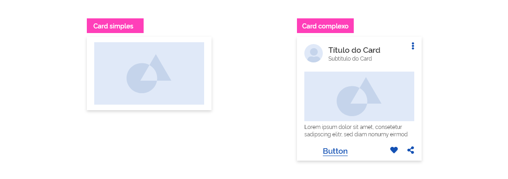
*Exemplo de card simples e card complexo.*

---

## Anatomia

Para construir um *card* é necessária uma superfície branca com sombra e uma área com no mínimo um conteúdo contido.

| ID  | Nome       |                             Referência                             | Uso         |
| --- | ---------- | :----------------------------------------------------------------: | ----------- |
| 1   | Superfície | [Superfície](https://www.gov.br/ds/fundamentos-visuais/superficie) | Obrigatório |
| 2   | Área       |                                ---                                 | Obrigatório |

*Anatomia do componente card.*

---

## Detalhamento dos Itens

### 1. Superfície (Obrigatório)

São formas indivisíveis que podem conter um ou mais elementos definidos que apresentam informações em detalhes sobre algo. Nele, você pode dispor suas informações como desejar, com links, imagens e outros elementos.

### 2. Área (Obrigatório)

Podemos dividir a área da superfície do *card* em três áreas distintas (ou blocos) que podem conter determinados componentes:

**1. Área de títulos:** exclusivo para títulos, subtítulos, ícones, avatares e *tags*.

**2. Área de conteúdo:** qualquer componente é aceitável, exceto componentes relacionados à navegação, como: carrossel, paginação, abas e menu.

**3. Área de ações:** exclusivo para botões e *links*.

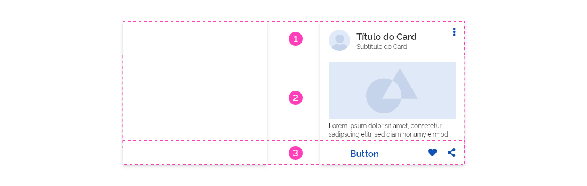
*Exemplo de áreas do componente card.*

**Atenção:** embora as áreas mencionadas sejam apresentadas em uma ordem lógica, é permitida a criação de *cards* em que as áreas sejam utilizadas em qualquer ordem ou até mesmo a não utilização das três áreas. Isso permite que os *cards* sejam componentes totalmente customizáveis e adaptáveis a diversos *layouts*.

---

## Layout e Estrutura

Como explicado anteriormente, o componente *card* pode ser simples ou complexo, de acordo com o número de componentes utilizados na sua composição. Por isso, é bastante flexível, no entanto alguns cuidados devem ser observados.
A seguir, são apresentadas algumas regras para orientação na criação dos *cards*:

### 1. Blocos formatados

A fim de facilitar a criação dos *cards*, o *Design System* já disponibiliza blocos pré-formatados das três áreas que compõem um *card* (título, conteúdo e ação). Fica muito fácil juntar as partes e montar um *card* do zero sem se preocupar com regras de diagramação.

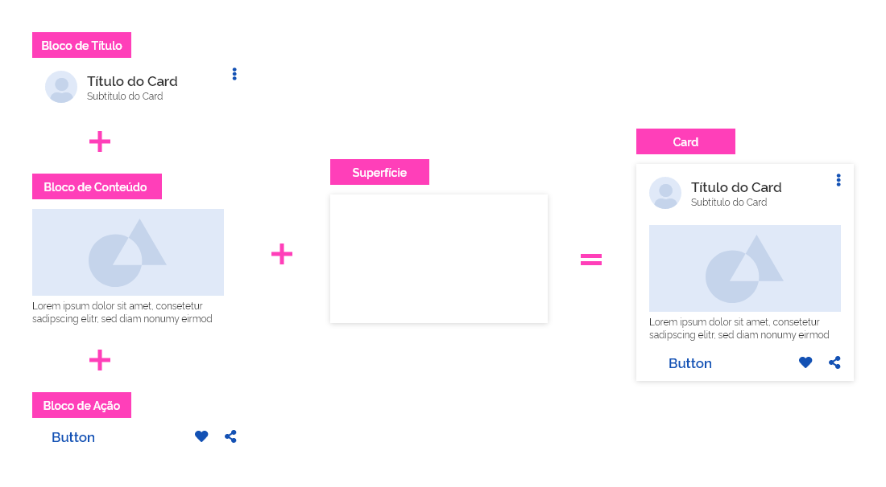
*Exemplo de construção de um card a partir de blocos isolados.*

**Atenção 1:** o *Design System* oferece inicialmente um *kit* de cinco blocos formatados para cada uma das áreas do *card*. Conforme a necessidade, este kit poderá ser atualizado e expandido.

**Atenção 2:** recomendamos a utilização dos blocos formatados pois é garantida que todas as regras de composição descritas neste guia estão sendo respeitadas. Caso os blocos formatados não atendam uma necessidade específica, um *card* pode ser construído do zero respeitando as regras e orientações deste *Design System*. Também é possível utilizar os blocos como base e alterar os elementos neles contidos.

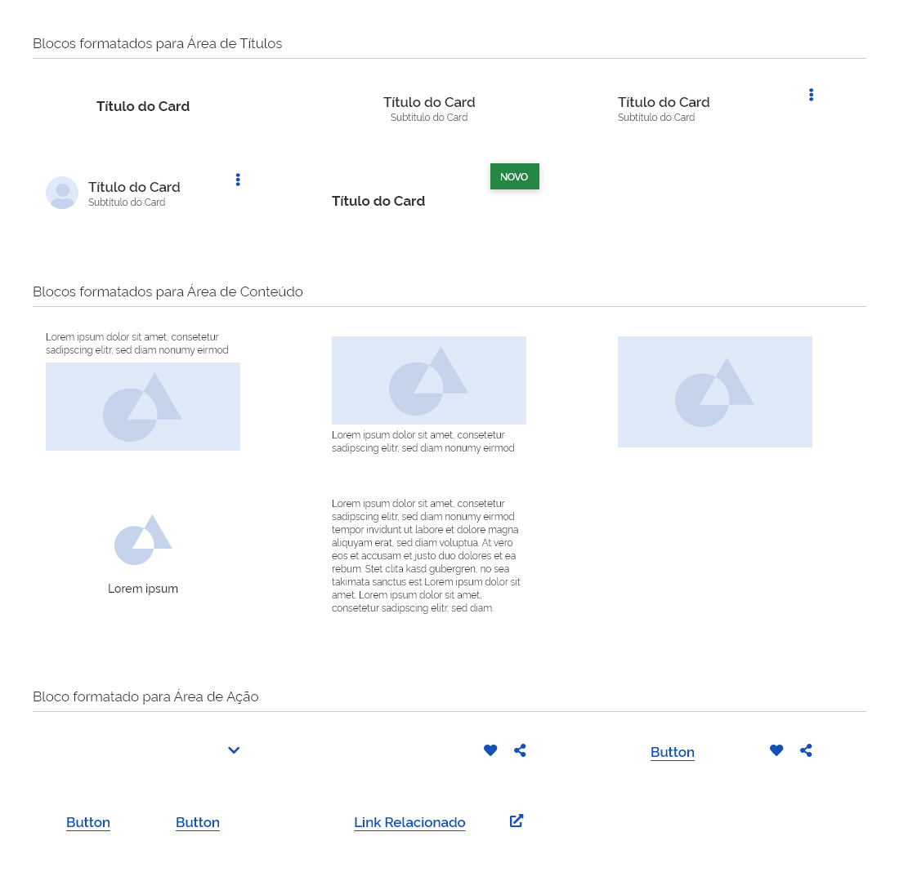
*Exemplos de possibilidades de formatação de blocos.*

**Atenção:** os blocos formatados são transparentes. Eles foram acrescentados com fundo branco na ilustração acima meramente para facilitar a visualização.

### 2. Margens

Os componentes dentro dos *cards* devem respeitar as margens definidas nos *tokens* entre cada um dos lados da superfície. Na imagem abaixo podemos perceber que a área branca é a área em que os componentes estão contidos.

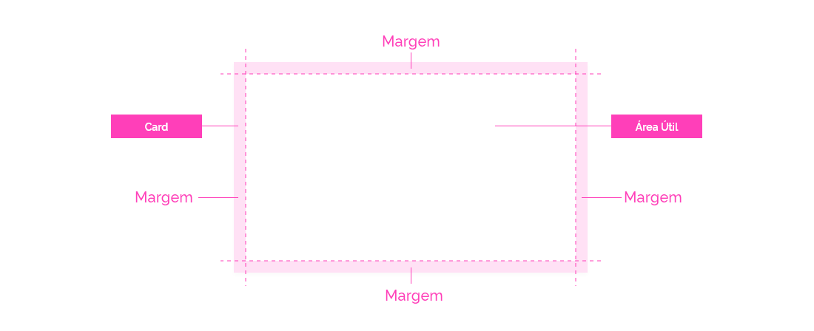
*Exemplo de margens em um card.*

**Exceção 1:** alguns componentes podem "sangrar" (extrapolar) os limites do *card*, como por exemplo: mídias (fotografias, ilustrações, vídeos) e *tags*.

**Exceção 2:** em *cards* com dimensões mais reduzidas os ícones ou botões terciários podem estar mais próximos das margens de acordo com a definição nos *tokens*.

Neste exemplo, pode-se ver um ícone (vermelho) respeitando uma margem menor. Um componente genérico (azul), respeitando a margem padrão. E uma imagem (verde) "sangrando".

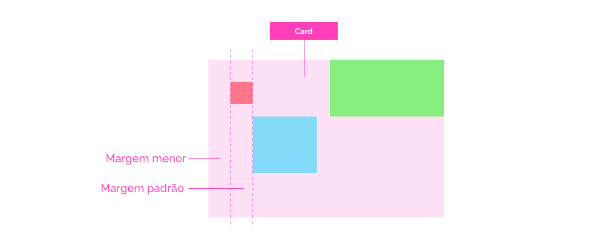
*Exemplo do uso de tipos de margens em um card.*

Os *cards* devem possuir ainda uma **área de respiro**, isto é, o espaço mínimo entre dois *cards* ou qualquer outro componente próximo.

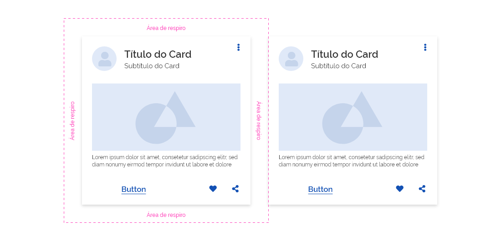
*Exemplo da aplicação da área de respiro.*

### 3. Dimensões

As dimensões da **área de conteúdo** do *card* podem ter dois comportamentos distintos, conforme a necessidade do *layout*:

-   Flexível;

-   Fixa.

#### Fixa

É definida pelo *design* e não importando a quantidade de conteúdo que a área possua. Se as dimensões forem maiores que a quantidade de conteúdo, haverá espaços vazios no *card*. Se as dimensões forem maiores que a quantidade de conteúdo, haverá *content overflow*.

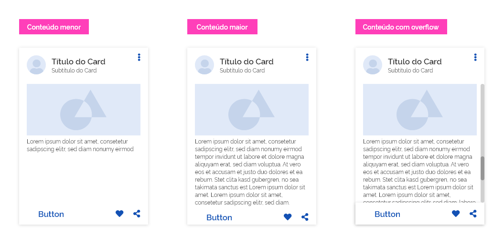
*Exemplos de cards com variadas quantidades de conteúdo e alturas das áreas de conteúdo fixas.*

**Atenção:** esse caso é mais recomendado quando se quer padronizar o tamanho de vários *cards* que se relacionam entre si no *layout* evitando desnivelamento das dimensões.

#### Flexível

É determinada pelo conteúdo contido no *card*. Quanto maior o conteúdo, maiores as dimensões da área de conteúdo do *card*.

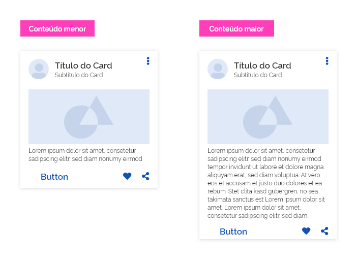
*Exemplos de cards variando a área de conteúdo resultando em cards com diferentes alturas.*

**Atenção:** esse caso é mais recomendado quando não se tem o controle do conteúdo do *card* e a suas dimensões não influem no *layout*.

Já a largura do *card* deve estar preferencialmente contida na *grid*.

*Exemplos de larguras possíveis para cards.*

**Atenção 1:** a largura mínima permitida são três colunas. Não há largura máxima, porém, deve-se avaliar a real necessidade de um *card* excessivamente grande.

**Atenção 2:** devida a largura de tela reduzida dos dispositivos móveis, um *card* deve estar localizado sempre abaixo de outro (nunca ao lado) respeitando a distância da área de respiro.

---

## Comportamentos

*Cards* podem possuir diversos comportamentos próprios. A seguir, listamos os mais usuais:

### 1. Conteúdos Ocultos

#### Expandindo

Uma maneira de adicionar informações no *card* sem necessitar alterar suas dimensões é por meio do recurso de expansão. Ao clicar no botão terciário "expandir", uma superfície complementar do *card* é apresentada com mais informações relacionadas. É bastante útil quando for necessário apresentar informações complementares que não necessitem estar visíveis e podem ser acionadas com um simples clique.

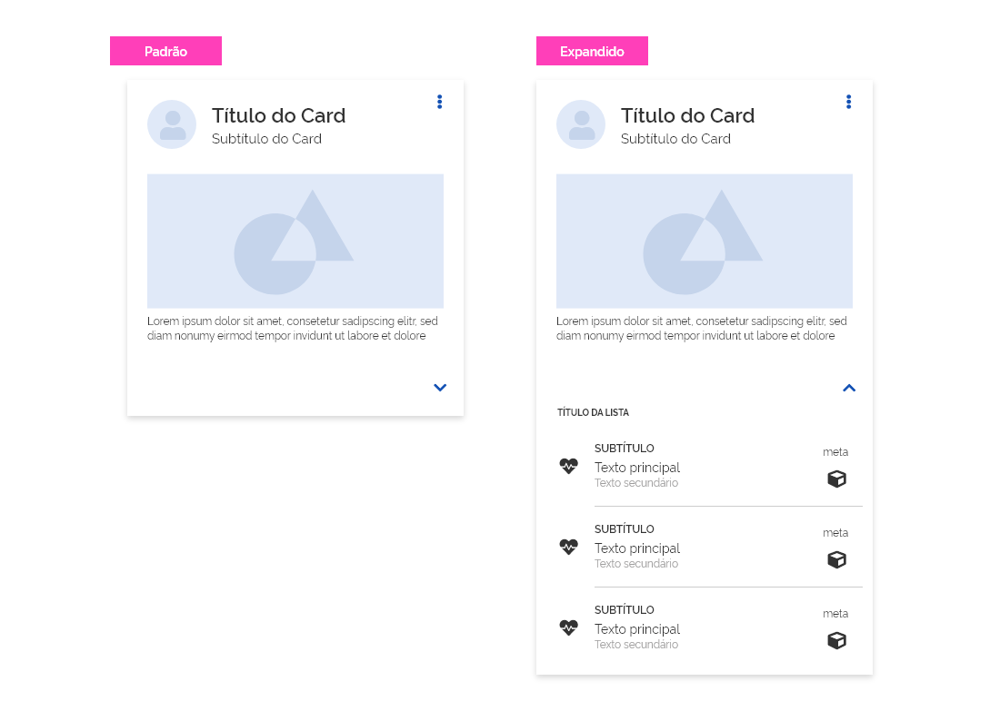
*Exemplo de uso do comportamento de expansão nos cards.*

Um *card* em hipótese alguma deve possuir rolagens. O *card* é flexível o suficiente para se adequar à quantidade de conteúdo necessário.

**Atenção:** use este recurso com moderação. Avalie se realmente é necessário. lembre-se sempre do **Princípio da Simplicidade** ao se projetar um *card*.

#### Alternando

Os *cards* podem comportar algum tipo de conteúdo adicional no seu verso, geralmente um texto complementar.
Esse recurso é útil quando é necessário destacar uma informação mais relevante e vincular informações complementares menos relevantes.

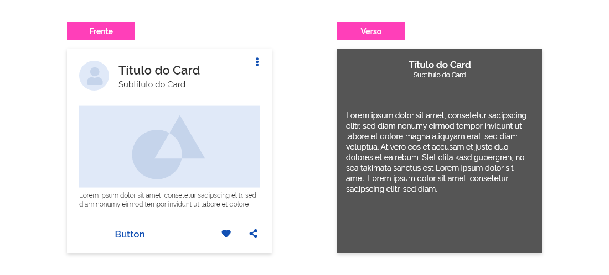
*Exemplo de conteúdo oculto acionado por um clique no card.*

É interessante utilizar recursos de movimento para alterar o conteúdo do *card* como um efeito de giro (*flip*) ou efeito de *fade in/fade out*. Considere utilizar um elemento identificador (ícone ou *button*, por exemplo) para reforçar a existência de conteúdos ocultos, caso contrário o mesmo poderá passar despercebido pelo usuário. Esta ação pode ser provocada pelo clique no elemento identificador ou no próprio *card*, dependendo do projeto e respeitando as regras de usabilidade e acessibilidade.

**Atenção:** pode ser interessante utilizar uma cor de fundo diferente para o conteúdo oculto do *card* para facilitar o entendimento de que se trata de outra área de conteúdo acionada. Neste caso, esteja atento para o contraste entre fundo e conteúdo.

Para mais detalhes dos tipos de movimento que podem ser utilizados, consulte o documento Fundamentos > Movimento.

### 2. Estados

Os *cards* podem apresentar apenas os estados: **desabilitado**, **arrastando** e **hover**. Todos os componentes contidos devem herdar o mesmo comportamento do *card*.

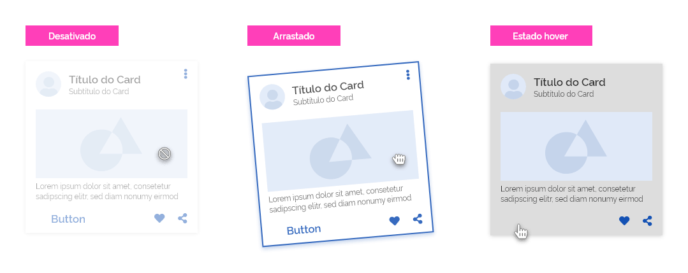
*Exemplo do uso dos estados nos cards.*

---

## Melhores Práticas

Quando se usa *cards* tudo parece limpo e arrumado, pois ele possui a finalidade de melhorar o engajamento, organizar bem o conteúdo e ajudar os usuários a entender rapidamente uma página.

A seguir são enumerados alguns princípios que devem ser considerados na criação dos *cards*:

1. **Simplicidade:**
Como o *card* pode conter vários elementos distintos, é necessário ter cuidado para que sejam sobre um único assunto. Isso permite que os usuários selecionem a parte do conteúdo que desejam consumir, compartilhar ou interagir.

2. **Independente**
Um *card* pode ficar sozinho, sem depender dos elementos circundantes para o contexto. Não use *cards* dentro de *cards*.

3. **Individual**
Um *card* não pode ser mesclado com outro *card* ou dividido em vários *cards*.

4. **White Space:**
*Cards* são representados por conteúdo individual altamente coerente, divididos em pequenos blocos. Por isso é essencial dar um espaço para cada bloco do *card*, assim pode ser lido e entendido com maior facilidade. Acrescente também *white space* ao redor de cada bloco (área de respiro).

5. **Limite de conteúdo:**
 O *card* deve conter apenas informações essenciais e oferecer um caminho para mais detalhes, em vez de detalhes completos logo de cara. Evite ao máximo colocar muito conteúdo em um único *card*, ele pode ficar muito grande ou muito longo e, por sua vez, perdendo sua conexão original com a metáfora do “cartão”.

6. **Crie hierarquia de conteúdo:**
A hierarquia dentro dos *cards* ajuda a direcionar a atenção dos usuários para as informações mais importantes. Coloque o título na parte superior do *card* e o conteúdo principal no centro. Elementos interativos como botões e ícones funcionam melhor na parte inferior do *card*.

---

## Especificações

### Cor

| Name               | Property     | Token      |
| ------------------ | ------------ | ---------- |
| Superfície         | `background` | `--pure-0` |
| Superfície (verso) | `background` | `--gray-2` |

### Sombra

|    Name    | Token Shadow  |
| :--------: | :-----------: |
| Superfície | `--shadow-sm` |

### Estado

| Property                 | Status       | Token                          |
| ------------------------ | ------------ | ------------------------------ |
| *container* (superfície) | `desativado` | `--status-disabled-background` |
| *container* (superfície) | `arrastado`  | `--status-dragged-background`  |

### Espaçamento

| Name             | Property  | Value  |
| ---------------- | --------- | ------ |
| Conteúdo (geral) | `padding` | `16px` |
| Ícones           | `padding` | `8px`  |
