## Estrutura Básica

Os layouts de cartão podem variar para suportar os tipos de conteúdo que eles contêm. Os seguintes elementos são comumente encontrados entre essa variedade.

[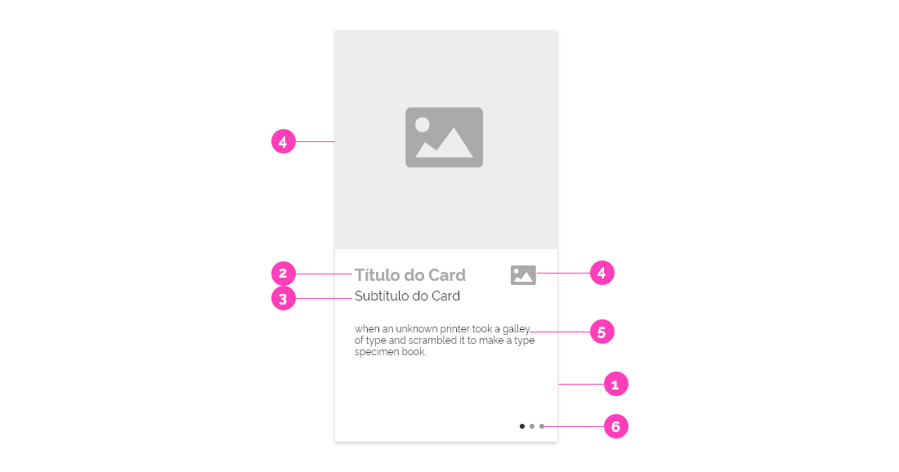](https://xd.adobe.com/spec/07b6329a-776e-46a5-5e78-b9f19fbdb1a6-7187/)

1. **Recipiente** (_opcional_): Os contêineres de cartão contêm todos os elementos do cartão e seu tamanho é determinado pelo espaço que esses elementos ocupam. A elevação do cartão é expressa pelo contêiner.

2. **Título** (_opcional_): O título do card pode incluir itens como o nome de um sistema ou funcionalidade e deve ter maior destaque pela sua funcionalidade.
3. **Subtítulo** (_opcional_): O texto do subtítulo pode, entre outras coisas, incluir a descrição ou assinatura de um sistema ou elementos de um determinado texto.

4. **Mídia** (_opcional_): Os cards podem incluir uma variedade de mídias, incluindo ícones, logos, fotos e gráficos.

5. **Textdo de Suporte** (_opcional_): O texto de suporte inclui texto como um resumo de artigo ou uma descrição concisa da funcionalidade do card.

6. **Elementos Interativos** (_opcional_): Os cartões podem incluir elementos interativos como ícones e botões para ações.

---

## Anatomia

Cards podem ter formatos e conjuntos de informações distintos de acordo com a necessidade de informações que ele deva conter.

### Cores

No caso do portal, os cards que levam para serviços internos que aglutinam um conjunto de ações são brancos #FFFFFF em fundo #F8F8F8

Mas caso o background da tela for outro cinza ou colorido o card será branco.

Os ícones ilustrativos variam de cor devido a função do card.
De modo geral #2670E8, e nos casos especificados #0C326F

O recipiente do card tem definido no background a cor #FFFFFF; sombra #000000 com 20% de opacidade; posição X0; posição Y2 e desfoque 4.

### Dimensões, Formatos e Variações de Uso

Os cards do design system Gov.Br possue 4 formatos principais:

- Card Retangular
- Card Quadrado
- Card Mini
- Card Horizontal

#### Card Retangular

**Cards de 272 x 460px**:
Trata-se de variações do card retangular de altura fixa.
Com possibilidade de aplicação de ícones ilustrativos e funcionais, ´títulos, subtítulos, textos mais longos, cerca de 432 caracteres e botão primário.

**Versão Integral**:

**Versão Responsiva**:
Na versão responsiva a diagramação do itens apresenta outra diagramação.

[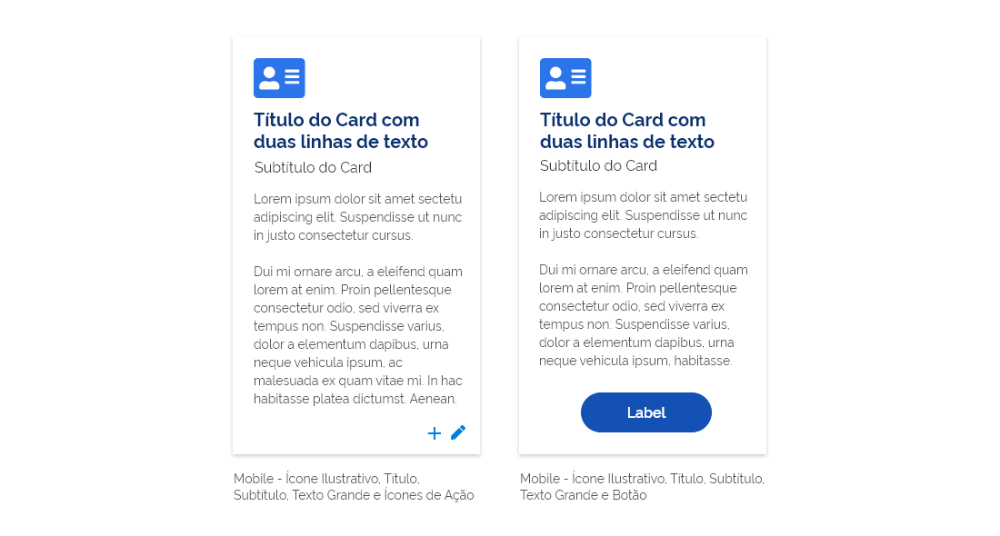](https://xd.adobe.com/spec/07b6329a-776e-46a5-5e78-b9f19fbdb1a6-7187/screen/83cd6a6f-7d23-4516-949a-2e3163b3ea45/03-Card-Retangular-Responsiva)

**Versão Retangular com Carrossel**:
Na versão responsiva a diagramação do itens apresenta outra diagramação.

[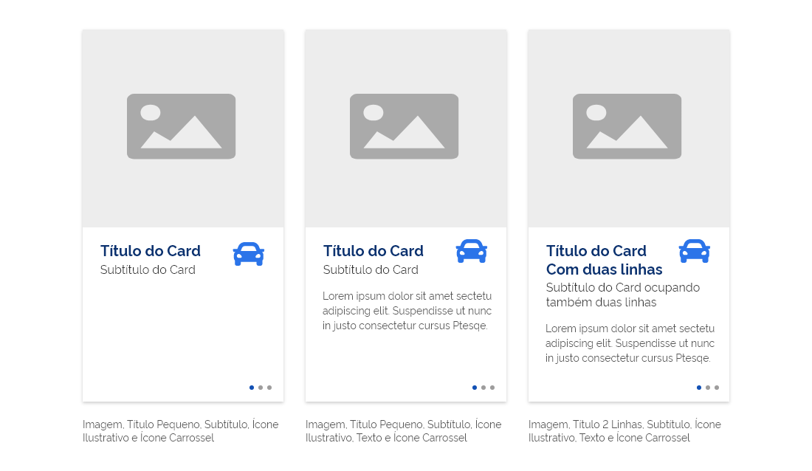](https://xd.adobe.com/spec/07b6329a-776e-46a5-5e78-b9f19fbdb1a6-7187/screen/03f5fc36-ea61-463f-b8aa-1c4a26dfc114/04-Card-Retangular-Carrossel)

**Estados**:
Os cards podem apresentar o hover para a versão web.

[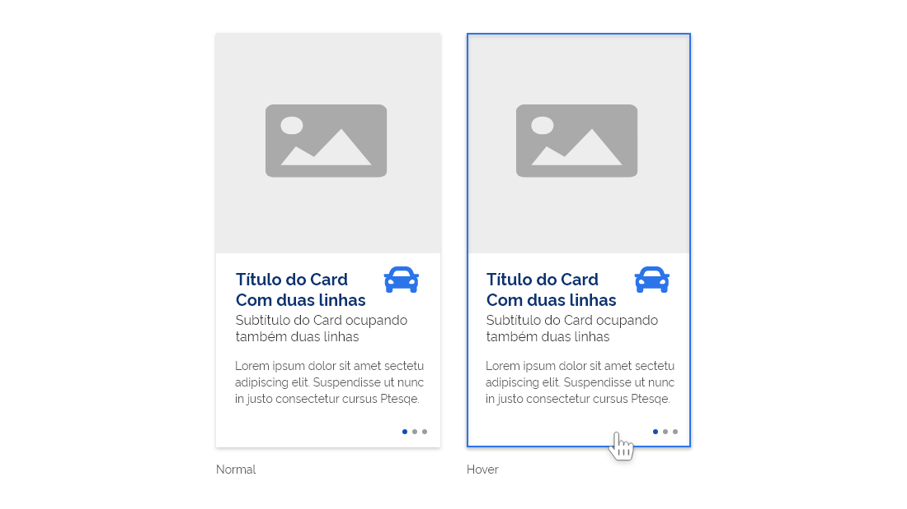](https://xd.adobe.com/spec/07b6329a-776e-46a5-5e78-b9f19fbdb1a6-7187/screen/09c7f873-3f97-46d5-9049-d16de8c69ae3/05-Card-Retangular-Estados)

---

#### Card Quadrado

**Cards de 562 x 562px**:
Trata-se de uma aplicação do card quadrado.
Com possibilidade de aplicação de imagem, ´título, texto curto e botão secundário.

[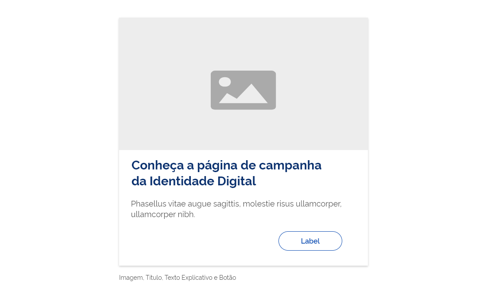](https://xd.adobe.com/spec/07b6329a-776e-46a5-5e78-b9f19fbdb1a6-7187/screen/7c12e032-eb79-4066-b08b-4224d5ff4457/06-Card-Quadrado)

---

#### Card Mini

**Cards de 420 x 132px**:
Trata-se de variações horizontal do card de altura fixa.
Com possibilidades de aplicações de diversas diagramações utilizando ícones ilustrativos, ´títulos, textos de alturas fixas, e botão primário e tags de acesso às lojas de aplicativos.

[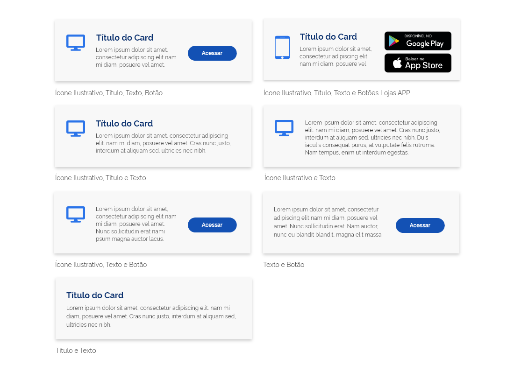](https://xd.adobe.com/spec/07b6329a-776e-46a5-5e78-b9f19fbdb1a6-7187/screen/300d4b53-6ebe-4296-bdc5-2ae2034bbef7/07-Card-Mini)

**Estados**:
Os cards podem apresentar o hoover no caso da web.

[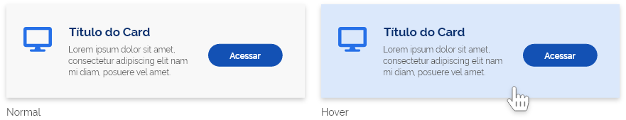](https://xd.adobe.com/spec/07b6329a-776e-46a5-5e78-b9f19fbdb1a6-7187/screen/1e0c015b-86f6-4b2e-b167-d3f53fb946a9/08-Card-Mini-Estados)

---

#### Card Horizontal

**Cards de 368 x 168px**:
Trata-se de variações horizontal do card de altura fixa.
Com função de link para outras páginas.
Com possibilidades de aplicações de diversas diagramações utilizando ícones ilustrativos, ´chapéus, títulos e textos curtos de alturas fixas.

[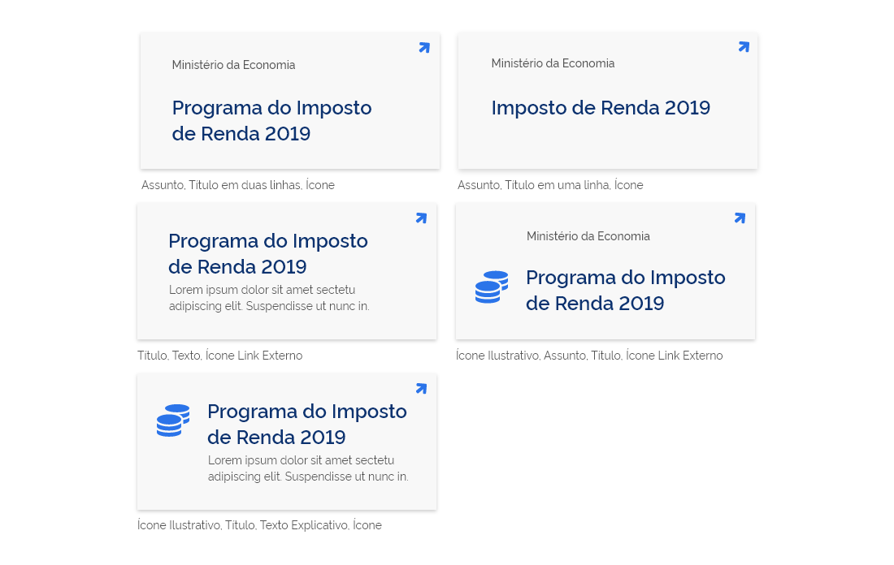](https://xd.adobe.com/spec/07b6329a-776e-46a5-5e78-b9f19fbdb1a6-7187/screen/bdaa86f9-d70c-406e-80f5-bc786e8e0c69/09-Card-Horizontal-01)

**Cards de 368 x 224 px**:
Trata-se de variações horizontal do card de altura fixa.
Com função de link para outras páginas.
Com possibilidades de aplicações de diversas diagramações utilizando ícones ilustrativos, chapéus, títulos e textos curtos de alturas fixas.

---

## Exemplos com Orientações de Uso (Web)

Segue as orientações pertinentes a cada tipo de card.

**Cards de 272 x 272px**:
No portal devem ser usados em páginas temáticas, como:

- cards de serviços contextuais;
- cards de serviços externos para público específicos;
- cards de links simples.

**Serviços Contextuais**:
[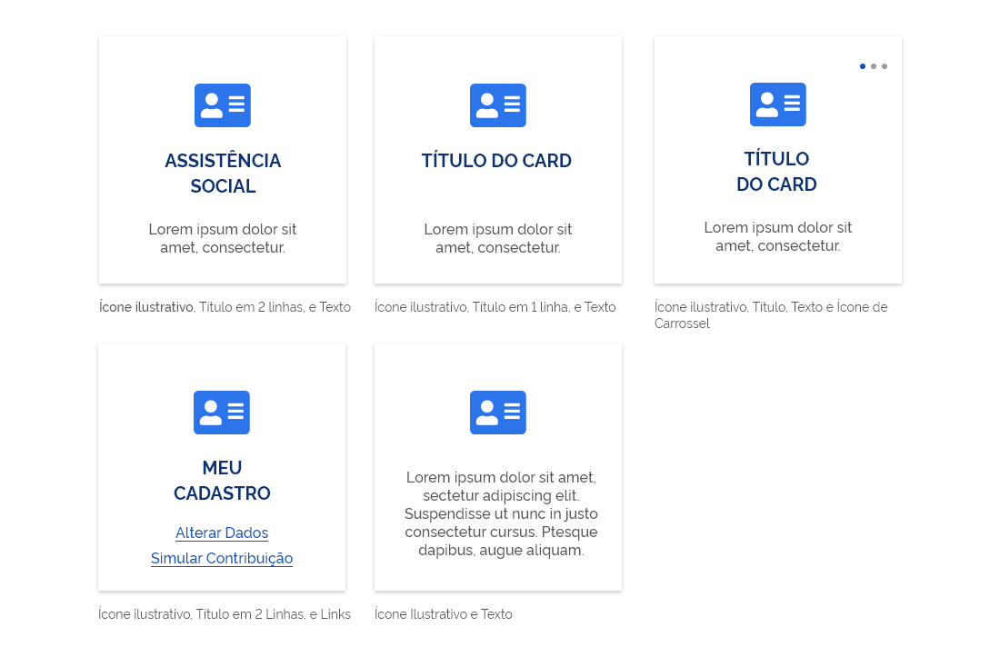](https://xd.adobe.com/spec/07b6329a-776e-46a5-5e78-b9f19fbdb1a6-7187/screen/916f4ce5-05a4-4028-96e9-97517af877dc/11-Card-272-Servicos-Contextuais)

**Serviços Externos para Públicos Específicos**:
[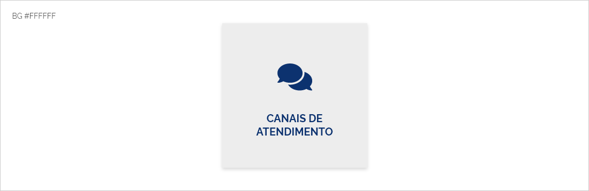](https://xd.adobe.com/spec/07b6329a-776e-46a5-5e78-b9f19fbdb1a6-7187/screen/7bc742ca-f43d-4b4b-9609-eadd17089f01/12-Card-272-Servicos-Externos)

**Cards com Função de Link**:
[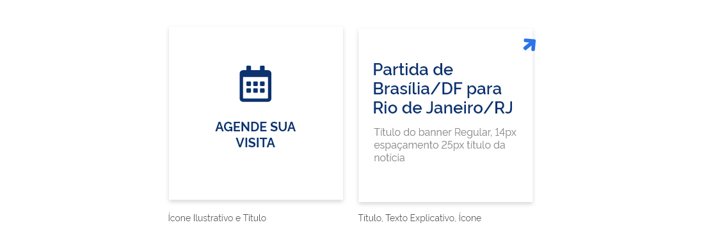](https://xd.adobe.com/spec/07b6329a-776e-46a5-5e78-b9f19fbdb1a6-7187/screen/5bb37302-bbc1-449d-a58a-2926046ec319/13-Card-272-Funcao-Link)

---

**Cards de 240 X 240px**:
No portal devem ser usados na home como cards de serviços que nos levam para páginas de opções do serviço.

**Comportamento**:
Ao passar o mouse em cima do card haverá uma interação de fade. Quando assumirá a cor #555555 e os textos ficarão na cor branca #FFFFFF.
Essa versão de ‘hover’ ocorrerá apenas na versão web.

[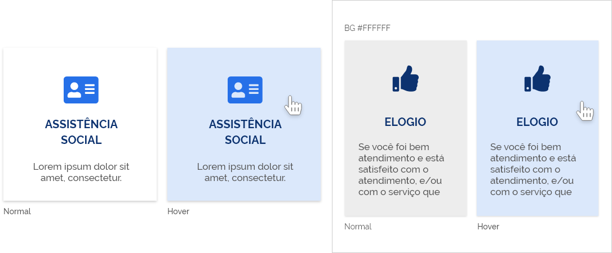](https://xd.adobe.com/spec/07b6329a-776e-46a5-5e78-b9f19fbdb1a6-7187/screen/b1fa7ade-ac5c-4a2a-9db7-8546188bd15e/14-Card-240-01)

**Serviços Amplos**:
[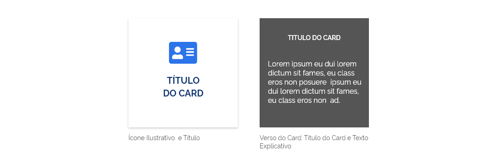](https://xd.adobe.com/spec/07b6329a-776e-46a5-5e78-b9f19fbdb1a6-7187/screen/6e0b806b-33b2-440a-a91c-ccd8d9c41c11/15-Card-240-02)

---

**Cards de 216 com altura variável**:
A altura será relativa e obedecerá ao volume de texto explicativo nele publicado.

**Serviços Externos para Públicos Específicos**:

---

**Cards de 272 X 344px**:
No portal devem ser usados para encaminhar os usuários para a loja de aplicativos.

**Serviços Externos para Públicos Específicos**:
Ao passar o mouse em cima do card haverá uma interação de fade. Quando assumirá a cor #555555
e os textos ficarão na cor branca #FFFFFF.
Essa versão de ‘hover’ ocorrerá apenas na versão web.

[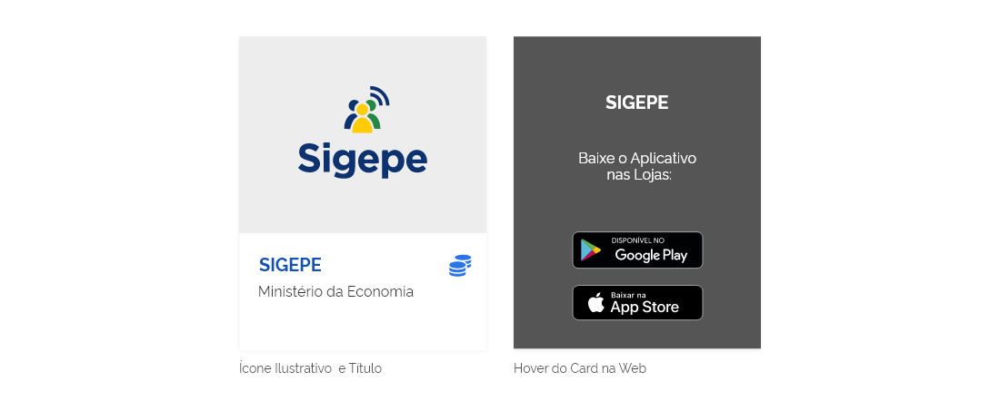](https://xd.adobe.com/spec/07b6329a-776e-46a5-5e78-b9f19fbdb1a6-7187/screen/d82ce3ef-7780-48b0-979e-356e30f14723/17-Card-272x344)

---

**Cards de 320 x 320px**:
No portal devem ser usados para encaminhar os usuários para a loja de aplicativos.

**Comportamento**:
Ao passar o mouse em cima do card haverá uma interação de fade. Quando assumirá a cor #555555 e os textos ficarão na cor branca #FFFFFF.
Essa versão de ‘hover’ ocorrerá apenas na versão web.

[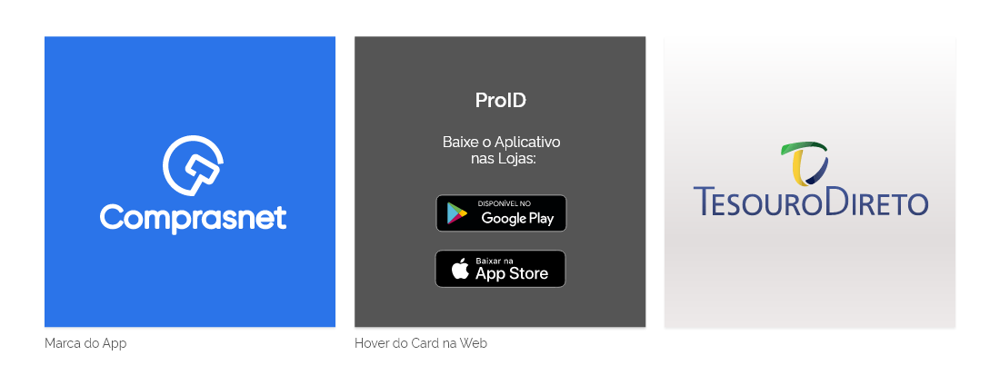](https://xd.adobe.com/spec/07b6329a-776e-46a5-5e78-b9f19fbdb1a6-7187/screen/8e1efbba-0bec-4af2-bf0b-a139dee5afd4/18-Card-320)

---

**Cards com badge**:
Os cards podem receber marcações para identificar algum comportamento ou criar alguma distinção e/ou gerar agrupamentos.
Normalmente se aplicará nos cards quadrados em função do espaçamento que é tomado pelo Badge.

**Comportamento**:
O badge funciona apenas como uma etiqueta.
Os mais usuais deve ser aplicadas apenas com o contorno e texto em azul #1351B4 .
Os outros podem trazer alguma distinção que o destaque de os demais, normalmente temporária. Neste caso se aplica a cor #268744 na forma e texto em negativo #FFFFFF.

[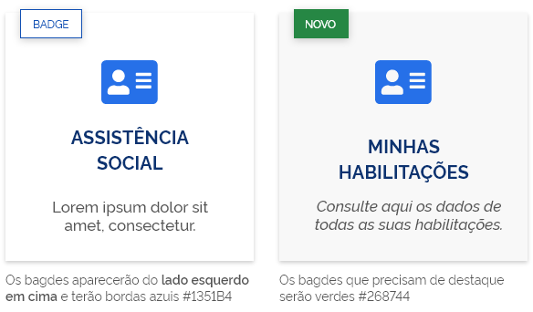](https://xd.adobe.com/spec/07b6329a-776e-46a5-5e78-b9f19fbdb1a6-7187/screen/ef995b65-ec07-460c-9d23-223d00736141/19-Card-Badge-01)

**Badge em Cards Textuais**:

[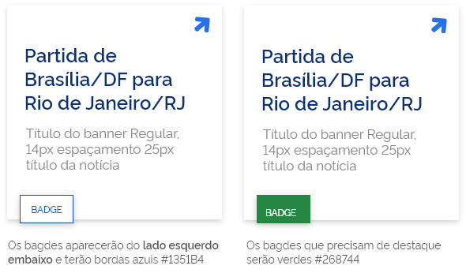](https://xd.adobe.com/spec/07b6329a-776e-46a5-5e78-b9f19fbdb1a6-7187/screen/1ea16adf-3750-4cce-81c2-7a9708f5cca5/20-Card-Badge-02)

---

### Exemplos com Orientações de Uso (Mobile)

Segue as orientações pertinentes a cada tipo de card.

#### Versão Integral

**Cards de 200px com altura variável**:
Trata-se de um card que prevê todas os elementos: imagem, título em 2 linhas, texto descritivo com extensão livre e ícone.
E o hover trás o título em 2 linhas, texto descritivo com área restrita, tags das lojas.

**Comportamento**:
Ao passar o mouse em cima do card haverá uma interação de fade. Quando assumirá a cor #555555 e os textos ficarão na cor branca #FFFFFF.
**Essa versão de ‘hover’ ocorrerá apenas na versão web.**

[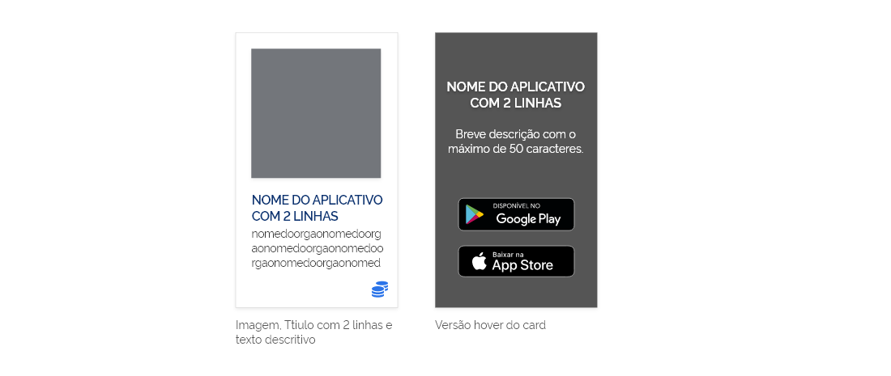](https://xd.adobe.com/spec/07b6329a-776e-46a5-5e78-b9f19fbdb1a6-7187/screen/43605f04-28da-4bed-afcb-31c301275a51/21-Card-200)

#### Versão Simplificada

**Cards de 200 x 290px**:
Trata-se de um card que prevê todas os elementos: imagem, título em 2 linhas, texto descritivo e ícone.
A proposta é estabelecer as dimensões fixas do card de modo que ele possa ser utilizado em uma grid fixa.
E o hover trás o título em 2 linhas, texto descritivo com área restrita, tags das lojas.

**Comportamento**:
Ao passar o mouse em cima do card haverá uma interação de fade. Quando assumirá a cor #555555 e os textos ficarão na cor branca #FFFFFF.
**Essa versão de ‘hover’ ocorrerá apenas na versão web.**

[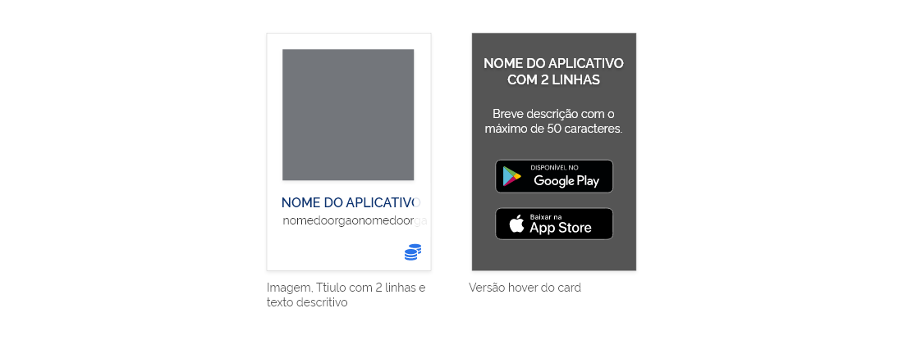](https://xd.adobe.com/spec/07b6329a-776e-46a5-5e78-b9f19fbdb1a6-7187/screen/bbf4b40c-c09a-4ecf-996e-dfc5146ba203/22-Card-200x290)

#### Versão Responsiva

**Comportamento**:
Na versão responsiva, o ícone de fechar (X) surge como mais um elemento no hover do card.

