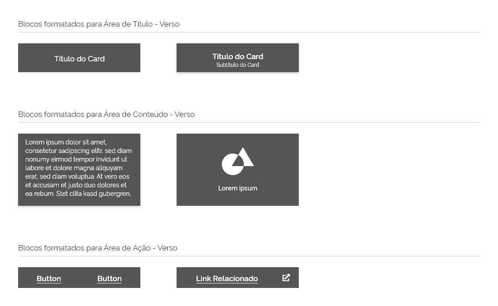

[version]: # '5.0.0'

---

## Uso

Os _Cards_ devem ser fáceis de verificar informações relevantes e acionáveis. Elementos, como texto e mídias, devem ser colocados sobre eles de maneira a indicar claramente a hierarquia. Podem ser bastante simples (contendo apenas um componente) ou complexos (contendo vários componentes em frente e verso).

### Princípios

Quando usamos cards tudo parece limpo e arrumado, pois ele possui uma finalidade de melhorar o engajamento, organizar bem o conteúdo e ajudar os usuários a entender rapidamente uma página.

A seguir são enumerados alguns princípios que devem ser considerados na criação dos _cards_:

1. **Simplicidade:**
   Como o _card_ pode conter vários elementos distintos, é necessário ter cuidado para que sejam sobre um único assunto. Isso permite que os usuários selecionem a parte do conteúdo que desejam consumir, compartilhar ou interagir.

2. **Independente**
   Um _card_ pode ficar sozinho, sem depender dos elementos circundantes para o contexto. Não use _cards_ dentro de _cards_.

3. **Individual**
   Um _card_ não pode ser mesclado com outro _card_ ou dividido em vários _cards_.

4. **White Space:**
   _Cards_ são representados por conteúdo individual altamente coerente, divididos em pequenos blocos. Por isso é essencial dar um espaço para cada bloco do cartão, assim pode ser lido e entendido com maior facilidade. Acrescente também _white space_ ao redor de cada bloco (área de respiro).

5. **Limite de conteúdo:**
   O _card_ deve conter apenas informações essenciais e oferecer um caminho para mais detalhes, em vez de detalhes completos logo de cara. Evite ao máximo colocar muito conteúdo em um único _card_, ele pode ficar muito grande ou muito longo e, por sua vez, perdendo sua conexão original com a metáfora do “cartão”.

6. **Crie hierarquia de conteúdo:**
   A hierarquia dentro dos _cards_ ajuda a direcionar a atenção dos usuários para as informações mais importantes. Coloque o título na parte superior do _card_ e o conteúdo principal no centro. Elementos interativos como botões e ícones funcionam melhor na parte inferior do _card_.

---

## Anatomia

Para construir um _Card_ é necessário: uma superfície branca com sombra e uma área com no mínimo um conteúdo contido.

1. Superfície;
2. Área.

---

## Área

Podemos dividir a área do _container_ do _card_ em três áreas distintas (ou blocos) que podem conter determinados componentes:

**1. Área de títulos:** Exclusivo para títulos, subtítulos, ícones, avatares e badges.

**2. Área de conteúdo:** qualquer componente é aceitável, exceto componentes relacionados à navegação, como: carrossel, paginação, aba e menu.

**3. Área de ações:** exclusivo para botões e _links_.

**Atenção:** embora as áreas mencionadas sejam apresentadas em uma ordem lógica, é permitida a criação de _cards_ em que as áreas sejam utilizadas em qualquer ordem ou até mesmo a não utilização das três áreas. Isso permite que os _cards_ sejam componentes totalmente customizáveis e adaptáveis a diversos _layouts_.

---

## Regras para criação de _Cards_

Como explicado anteriormente, o componente Card pode ser simples ou complexo, de acordo com o número de componentes utilizados na sua composição. Por isso, é bastante flexível, no entanto alguns cuidados devem ser observados.
A seguir, são apresentadas algumas regras para orientação na criação dos _cards_:

#### 1. **Blocos Formatados:**

A fim de facilitar a criação dos _cards_, o _Design System_ já disponibiliza blocos pré-formatados das três áreas que compõe um _card_ (título, conteúdo e ações). Fica muito fácil juntar as partes e montar um _card_ do zero sem se preocupar com regras de diagramação.

**Atenção 1:** O _Design System_ oferece inicialmente um kit de cinco blocos formatados para cada uma das áreas do _card_. Para o verso, está disponível atualmente duas opções. Conforme a necessidade, este kit poderá ser atualizado e expandido.

**Atenção 2:** Recomendamos a utilização dos blocos formatados pois é garantida que todas as regras de composição descritas neste guia estão sendo respeitadas. Caso os blocos formatados não atendam uma necessidade específica, um _card_ pode ser construído do zero respeitando as regras e orientações deste _Design System_. Também é possível utilizar os blocos como base e alterar os elementos neles contidos.

**Atenção:** os blocos formatados são transparentes. Elas foram acrescentadas com fundo branco na ilustração acima meramente para facilitar a visualização.

#### 2. **Dimensões:**

Os _cards_ são flexíveis e por isso não possuem dimensões fixas. No entanto, a largura deve estar contida na _grid_.

**Atenção 1:** A largura mínima permitida são 3 colunas. Não há largura máxima porém, deve-se avaliar a real necessidade de um _card_ excessivamente grande.

**Atenção 2:** Devido a largura de tela reduzida dos dispositivos móveis, um _card_ deve estar localizado sempre abaixo de outro (nunca ao lado) respeitando a distância da área de respiro.

---

## Comportamento

_Cards_ podem possuir diversos comportamentos próprios. A seguir, listamos os mais usuais:

### Flip

_Cards_ podem apresentar conteúdo na sua superfície frontal assim como no seu verso. O verso do _card_ é apresentado em cor cinza escuro e trabalha com os elementos em versão negativa. O verso do _card_ é útil quando for necessário apresentar informações complementares que não necessitem estar visíveis e podem ser acionadas com um simples clique em qualquer área do _card_ (desde que não seja em um elemento interativo). Chamamos essa ação de **_flip_**. Para retornar à superfície frontal deve-se proceder da mesma forma.
Por se tratar de um recurso de complemento de informação, o verso deve ser mais conciso e objetivo que a superfície frontal, evitando-se elementos complexos e interativos (normalmente utiliza-se textos e/ou imagens).

**Atenção:** em alguns casos, um botão terciário para um _link_ relacionado pode ser interessante estar no verso do _card_.

### Expansão

Outra maneira de adicionar informações no _card_ sem necessitar alterar suas dimensões é por meio do recurso de expansão. Ao clicar no botão terciário Expandir, uma superfície complementar do _card_ é apresentada com mais informações relacionadas.

**Atenção 1:** use este recurso com moderação. Avalie se realmente é necessário. lembre-se sempre do **Princípio da Simplicidade** ao se projetar um _card_.

**Atenção 2:** um _card_ em hipótese alguma deve possuir rolagens. O _card_ é flexível o suficiente para se adequar à quantidade de conteúdo necessário.

### Estados:

Os _cards_ apresentam apenas dois estados: **estado desabilitado** e **estado arrastado**. Todos os componentes contidos devem herdar o mesmo comportamento do _card_.

### Margens

Os componentes dentro dos _cards_ devem respeitar as margens definida nos _tokens_ entre cada um dos lados da superfície. Na imagem abaixo podemos perceber que a área branca é a área em que os componentes estão contidos.

**Exceção 1:** Alguns componentes podem "sangrar" (extrapolar) os limites do _card_, como por exemplo: mídias (fotografias, ilustrações, vídeos) e _badges_.

**Exceção 2:** Em _cards_ com dimensões mais reduzidas os ícones ou botões terciários podem estar mais próximos das margens de acordo com a definição nos _tokens_.

Neste exemplo, pode-se ver um ícone (vermelho) respeitando uma margem menor. Um componente genérico (azul), respeitando a margem padrão. E uma imagem (verde) "sangrando".

Os _cards_ devem possuir ainda uma **área de respiro**, isto é, o espaço mínimo entre dois _cards_ ou qualquer outro componente próximo.

---

## Exemplo de Uso

Para efeito de ilustração são apresentadas algumas aplicações do componente _card_:

---

## Design Tokens

### Cor

| Name               | Property  | Token                  |
| ------------------ | --------- | ---------------------- |
| Superfície         | conteiner | `--color-secondary-01` |
| Superfície (verso) | conteiner | `--color-secondary-07` |
| Sombra             | conteiner | `X=3, Y=5, Z=5`        |

### Estado

| Property                 | Status     | Token                          |
| ------------------------ | ---------- | ------------------------------ |
| _Conteiner_ (superfície) | desativado | `--status-disabled-background` |
| _Conteiner_ (superfície) | arrastado  | `--status-dragged-background`  |

### Espaçamento

| Name             | Property | Value |
| ---------------- | -------- | ----- |
| Conteúdo (geral) | padding  | 16px  |
| Ícones           | padding  | 8px   |
