[version]: # (1.0.1)

*Exemplo do componente carousel*

Use o *carousel* quando houver uma sequência de itens para exibir e um espaço de tela reduzido, permitindo que o usuário se concentre em um ou alguns itens por vez.

---

## Anatomia

O *carousel* é composto por:

| ID  | Nome                     |                                Referência                                 | Uso         |
| --- | ------------------------ | :-----------------------------------------------------------------------: | ----------- |
| 1   | Palco (área de conteúdo) |                                    ---                                    | Obrigatório |
| 2   | Botões de navegação      | [Componente Button](https://www.gov.br/ds/components/button?tab=designer) | Obrigatório |
| 3   | Botões de reprodução     | [Componente Button](https://www.gov.br/ds/components/button?tab=designer) | Opcional    |
| 4   | Indicador de páginas     |   [Componente Step](https://www.gov.br/ds/components/step?tab=designer)   | Obrigatório |

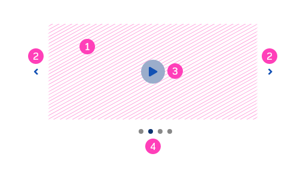
*Anatomia do componente carousel*

---

## Detalhamento dos Itens

### 1. Palco (Obrigatório)

Chamamos de **palco** toda a área que compreende o conteúdo apresentado pelo *carousel*. Os elementos do *carousel* podem estar externos à área do palco ou internos. Veja as imagens abaixo:

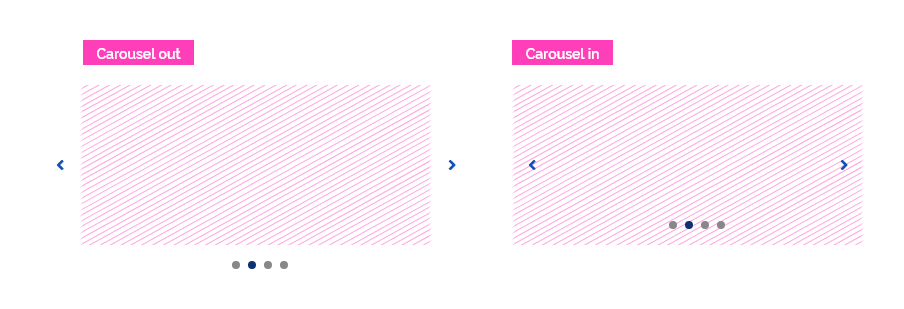
*Exemplo de elementos externos e internos ao palco do carousel*

É possível ainda a formatação de *carousels* híbridos, isto é, com elementos internos e externos ao palco. Confira a imagem a seguir:

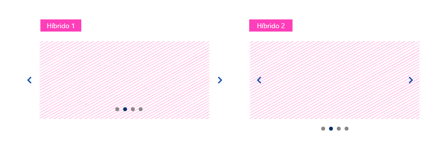
*Carousel* híbrido 1: botões de navegação externos e indicador de páginas interno ao palco. *Carousel* híbrido 2: botões de navegação internos e indicador de páginas externo ao palco.*

#### Tipos de Conteúdo

O palco permite a exibição de qualquer tipo de conteúdo (imagens, textos, vídeos, componentes, etc.). Chamamos cada conteúdo exibido pelo *carousel* de *página*.

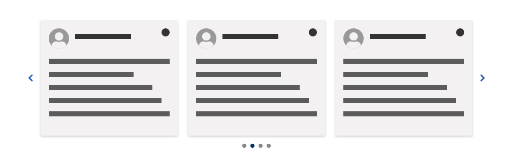
*Exemplo de carousel com conteúdo de cards. Cada card representa um página*

**Atenção:** mantenha a consistência visual e semântica entre as páginas apresentadas. Evite variações de dimensão e de tipo de conteúdo em uma mesmo *carousel*.

O componente *carousel* é extremamente flexível ao conteúdo que apresenta e desta forma não existe um tamanho padrão. O *carousel* pode se adaptar totalmente a qualquer *layout*, porém, esteja atento ao comportamento do palco com os conteúdos apresentados em diferentes dispositivos e resoluções de telas para que não haja perda de informações relevantes, principalmente no caso de exibição de imagens e vídeos.

**Atenção:** crie variações da mesma imagem adaptadas para cada resolução de tela. Desta forma, há maior controle da informação apresentada quando o *site* for visualizado em diferentes resoluções.

Para exibição de imagens com textos é importante estar atento ao contraste e à legibilidade. Verifique questões como cor, tamanho do corpo do texto e contraste com a cor ou imagem de fundo.

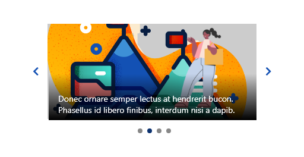
*Considere utilizar uma superfície overlay entre a imagem de fundo e o texto para reforçar o contraste. Consulte o documento [Fundamentos > Movimento](/fundamentos-visuais/movimento) para mais detalhes*

### 2. Botões de Navegação (Obrigatório)

Os botões de navegação (componentes *button* circular com ênfase terciária) permitem que o usuário possa navegar de forma sequencial pelo conteúdo do *carousel*.

**Atenção:** caso seja necessário a ênfase dos botões de navegação pode ser alterada para obter um maior destaque.

Os botões de navegação podem estar localizados fora ou dentro do palco. Para cada um dos casos há um comportamento específico.

#### Botões de Navegação Localizados Fora da Área do Palco

Por padrão, os botões de navegação devem estar localizados fora da área do palco de conteúdo. Isso faz com que os botões sejam mais facilmente visíveis para o usuário.

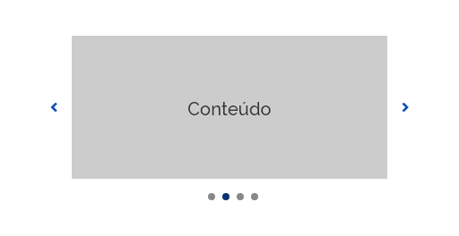
*Exemplo de carousel com os botões de navegação fora da área do palco*

#### Botões de Navegação Localizados Dentro da Área do Palco

Muitas vezes pode ser necessário economizar espaço na tela e nesses casos, uma alternativa é localizar os botões de navegação dentro da área do palco de conteúdo.

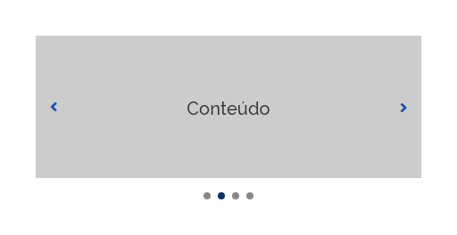
*Exemplo de carousel com os botões de navegação dentro da área do palco*

Como nesses casos os botões de navegação podem ficar menos evidentes para o usuário um comportamento extra foi adicionado: *áreas de interação diferenciadas.*

O botão de navegação ocupa toda a altura do palco e o estado *hover* é acionado ao se passar o ponteiro do *mouse* em qualquer área do palco. Veja a imagem abaixo:

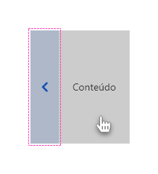
*Exemplo do estado hover em botões de navegação localizados dentro do palco do carousel*

*Atenção:* em ambos os casos, disponha os botões sempre centralizados verticalmente com o palco e use botões com ícones de setas para indicar a direção da navegação.

### 3. Botões de Reprodução (Opcional)

Em alguns casos o *carousel* pode ser automático, isto é, executa a navegação do conteúdo de forma automática. Nestes casos, é importante oferecer ao usuário uma forma de interagir com o conteúdo, pausando-o e reproduzindo-o quando desejar. Disponibilize os botões de reprodução (componentes *button* circular com ênfase terciária) para esta finalidade.

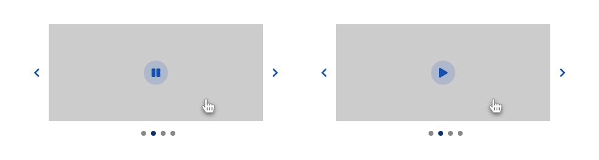
*Exemplos de botões de reprodução no carousel*

No estado normal do *carousel* os botões de reprodução devem ficar "invisíveis" para o usuário. Porém, ao passar o ponteiro do *mouse* sobre o conteúdo (*hover*) o botão de reprodução fica disponível para interação. Se o conteúdo estiver passando automaticamente, o botão *pause* fica disponível. Caso o *carousel* esteja pausado, o botão *play* fica disponível.

*Atenção:* o comportamento automático do *carousel* será tratado com detalhes mais adiante neste documento.

### 4. Indicador de Páginas (Obrigatório)

O *carousel* é definido por uma lista de conteúdo (páginas) em sequência. Cada passo na navegação possui uma correspondência no indicador de páginas (componente *step*).

O indicador de páginas serve basicamente para:

1. informar ao usuário quantas páginas há no *carousel*;
2. qual a página está sendo mostrada pelo *carousel*.

Opte pelos dois tipos possíveis de indicadores de páginas, conforme a necessidade:

1. Simples;
2. Textual.

#### Indicador de Páginas Simples

Formados pelo componente *step* simples. Cada indicador do *step*  corresponde a um passo da navegação pelo conteúdo do *carousel*. Deve haver tantos indicadores de *step* quanto páginas de conteúdo. A página que está sendo apresentada no momento deve ser indicada pelo indicador do *step* ativo.

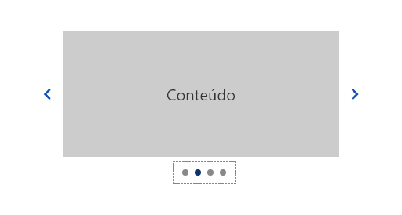
*Exemplo de utilização do indicador de páginas simples.*

Quando optar pela utilização do indicador de páginas dentro do palco, considere o recurso da superfície *overlay* já mencionado na seção *Tipos de Conteúdo*. Esta técnica ajudará a garantir o contraste entre o indicador de páginas e o conteúdo quando a imagem de fundo obtiver muitos elementos visuais.

**Atenção:** para oferecer uma melhor experiência ao usuário, utilize  a dimensão do componente *step* que melhor se harmoniza com a resolução da tela e com as dimensões do *carousel*.

#### Indicador de Páginas Textual

O indicador de páginas textual é formado por dois números. O primeiro indica a página que está sendo apresentada e o segundo, a quantidade total de páginas que o *carousel* possui.

Ao contrário do indicador de páginas simples, o indicador de páginas textual não pode ser aplicado dentro do palco de conteúdo. Mantenha-o sempre centralizado abaixo do palco de conteúdo, conforme a imagem abaixo:

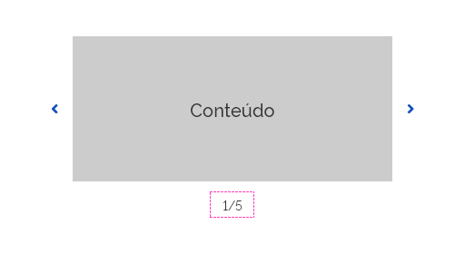
*Exemplo de utilização do indicador de páginas textual.*

**Atenção:** tenha em mente que a utilização do indicador de páginas no *carousel* é uma boa prática de usabilidade e sempre que possível deve ser utilizado.

Para mais informações consulte o documento [Componentes > Step](https://www.gov.br/ds/components/step?tab=designer).

---

## Comportamentos

### 1. Navegação

*Carousels* são componentes de navegação sequencial ou linear, pois cada página do conteúdo é mostrada na ordem em que foi criada no *carousel*.

É possível também propor uma navegação em "*looping*". Neste caso, ao se atingir a última página do conteúdo o usuário voltará para a primeira página de forma linear.

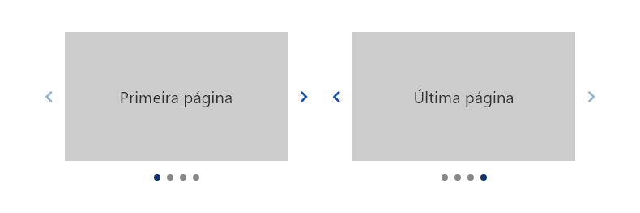
*Botão de navegação desabilitado na primeira e na última página do conteúdo.*

**Atenção:** lembre-se de deixar os controles de navegação desabilitados quando for a primeira ou a última página do conteúdo. Exceto quando a navegação for em *looping*.

### 2. Navegação por Gestos

Em dispositivos *touch screen* a navegação deve ser acionada por gestos (*swipe*) sobretudo quando utilizada em dispositivos móveis. Nestes casos, o usuário deve deslizar o dedo e arrastar o conteúdo para a direita ou esquerda.

*Navegação por gestos em dispositivos touch screen*

**Atenção:** ao implementar a navegação por gestos não é necessário utilizar os botões de navegação, porém é importante verificar o seu funcionamento com tecnologias assistivas como leitor de telas entre outras oferecendo sempre uma alternativa acessível para o usuário.

### 3. Reprodução Automática

O componente *carousel* também pode exibir os conteúdos de forma automática, alternando-os por um tempo determinado. Nesse caso, deve-se fornecer ao usuário botões que permitam o controle para pausar e reproduzir o movimento.

*Controles de reprodução automática do carousel*

Considere sempre o conteúdo exibido. Para conteúdos com muitos textos ou elementos interativos, considere uma duração compatível com o tempo que o usuário necessitará para assimilar o conteúdo. Estime quanto tempo um usuário médio pode levar para ler o texto e processar as imagens do conteúdo. Use três palavras por segundo como orientação.

Não pare na última página. Use navegação em *looping* para reproduções automáticas.

**Atenção:** não utilize reprodução automática em dispositivos móveis porque torna a página mais lenta e, além disso, porque as páginas são curtas e os usuários geralmente rolam rapidamente para baixo. Portanto, quando o *carousel* mudar a página de conteúdo o usuário provavelmente estará olhando abaixo da dobra e não verá a mudança.

**Não utilize reprodução automática se:**

-   Você não tem certeza se pode acertar a duração de tempo correta para que a maioria das pessoas leia e absorva o conteúdo. Às vezes, os carrosséis se movem muito rapidamente e os usuários não conseguem ler as informações, o que pode ser frustrante.

-   o conteúdo se assemelha a anúncios. Os usuários são mais propensos a ignorar um item animado que se parece com um anúncio (se eles não estiverem com uma mentalidade de compras).

### 4. Movimento

Ao navegar pelo conteúdo do *carousel* é necessário especificar a maneira como as páginas serão exibidas, isto é, o tipo de movimento que fará com que uma página entre e saia do palco.

<video controls width="320" height="240" controls type="video/mp4">
<source src="videos/carousel.mp4" type="video/mp4">
</video>
*Exemplo de movimentos na navegação no carousel*

Entendemos que as características do movimento, para se tornar harmônico e natural para o usuário, podem variar com o tamanho do *carousel* e com o tipo de conteúdo apresentado. Portanto, não deixe de testar os atributos de movimento que melhor se adaptem ao *carousel* projetado.

Deixamos algumas dicas de *boas práticas* para auxiliar na escolha do movimento:

-   Opte pela **transição slide**, pois trata-se de uma transição de movimento pensada especificamente para o uso no *carousel*;

-   Prefira movimentos de **duração rápida** (consulte a tabela de duração dos movimentos no *link* abaixo);

-   Geralmente *easing* do tipo *easing-in-out* funciona bem, pois deixa os movimentos de transição das páginas mais naturais e orgânicas;

Para entender melhor os tipos de movimento, consulte o documento  [Fundamentos > Movimento](/fundamentos-visuais/movimento).

### 5. Múltiplas Páginas

É possível exibir múltiplas páginas na área de conteúdo do *carousel*, ou seja, o palco pode exibir simultaneamente blocos de páginas de conteúdo.

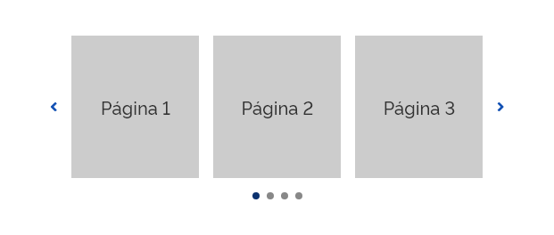
*Neste exemplo, o carousel exibe um bloco com três páginas de conteúdo por vez*

Tenha o cuidado de manter a consistência no espaçamento entre as páginas de conteúdo de cada bloco. Se possível, evite blocos com mais de três páginas.

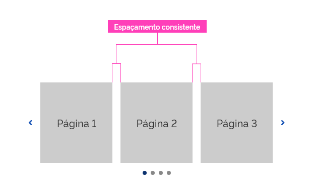
*Espaçamento entre as páginas de conteúdo em um bloco deve ser consistente.*

Nos *carousels* de múltiplas páginas, a navegação pelo conteúdo pode se dar por blocos de páginas ou por páginas individuais. Acompanhe as imagens abaixo:

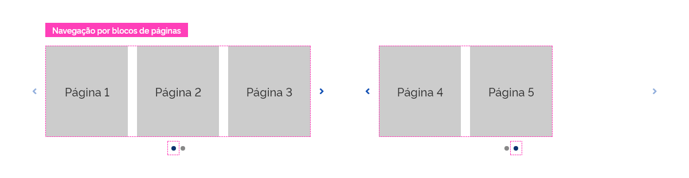
*Exemplo de navegação por blocos de páginas. Cada indicador de páginas corresponde ao bloco de páginas de conteúdo apresentado. Ao clicar no botão de navegação, todo o bloco de páginas é alterado.*

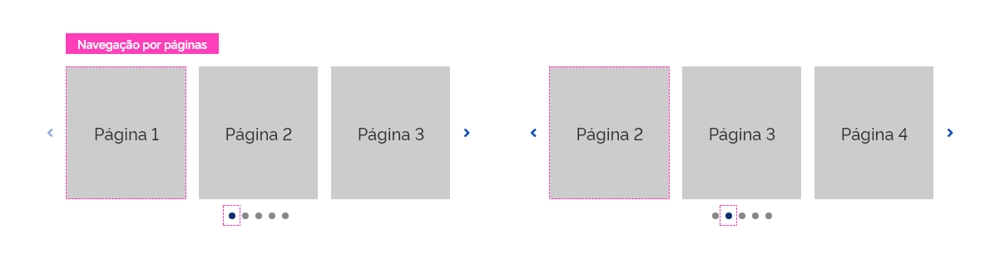
*Exemplo de navegação por páginas. Cada indicador de páginas corresponde à página de conteúdo apresentada. Ao clicar no botão de navegação, uma página entra no palco e outra sai.*

Em ambos os casos o indicador do *step* deve corresponder a cada passo na navegação, isto é, a cada clique nos botões de navegação.

**Atenção:** para um melhor aproveitamento da área na tela, em resoluções menores um *carousel* de múltiplas páginas pode se converter em um *carousel* simples e vice-versa.

---

## Melhores Práticas

-   Evite *carousel* para exibir apenas um conteúdo. Neste caso, prefira uma imagem estática.

-   Evite exibir excesso  de conteúdo em um mesmo *carousel*. É improvável que o usuário se envolva com mais do que cinco páginas. Mais do que isso pode se tornar cansativo.

-   Indique sempre que possível quantas páginas estão presentes no *carousel* e onde o usuário está na progressão. Esta prática ajuda os usuários se sentirem no controle.

-   Garanta que o conteúdo do *carousel* se adequará em qualquer resolução de tela. Escolha conteúdos que possam ser ajustados.

-   Para *carousel* de exibição automática, observe se o tempo de exibição do conteúdo é suficiente para que o usuário consiga interagir (ler, compreender, preencher, etc.) com o conteúdo.

-   Não utilize o *carousel* automático se não tem certeza se o usuário conseguirá compreender o conteúdo dentro do tempo especificado. Tenha em mente que se mal projetado, um *carousel* automático pode atrapalhar mais do que ajudar.
  
-   Evite a reprodução automática em dispositivos móveis, pois nestes casos, o *carousel* deve ocupar uma grande espaço na tela e a reprodução automática pode se tornar estressante para certos usuários.

-   É sempre uma boa ideia colocar qualquer informação importante que apareça em um *carousel* também em outro local na arquitetura da informação do *site*, para que as pessoas que não interajam com o *carousel* tenham uma chance de visualizá-la.

-   Se houver uma hierarquia de importância entre os conteúdos do *carousel* posicione sempre o mais importante na primeira página, pois muitas pessoas não chegam a ver as últimas páginas do *carousel*.

-   É bastante comum a aplicação de *carousels* no início da tela com imagens de grande impacto. Porém, tenha em mente que o uso do *carousel* é polêmico e gera grande discussão na *web*. *Nilsen/Norman Group*, os gurus da usabilidade, confirma em testes de uso que pessoas tem "cegueira" para conteúdos rotativos. A conversão é mínima e os *carousels* são frequentemente ignorados pelos usuários.

---

## Especificações

### Espaçamentos

| Name                 | Property            |    Spacing Scale Token    |
| -------------------- | ------------------- | :-----------------------: |
| Botões de navegação  | `margin-right/left` | `--spacing-scale-default` |
| Indicador de páginas | `margin-top`        |   `--spacing-scale-2x`    |

### Alinhamento

| Name                 | Property             |         Spacing Token         |
| -------------------- | -------------------- | :---------------------------: |
| Botões de navegação  | `spacing-vertical`   |  `--spacing-vertical-center`  |
| Indicador de páginas | `spacing-horizontal` | `--spacing-horizontal-center` |
| Botões de reprodução | `spacing-vertical`   |  `--spacing-vertical-center`  |
| Botões de reprodução | `spacing-horizontal` | `--spacing-horizontal-center` |

### Iconografia

| Name                                 | Ícone                              | Size              | Class (Font Awesome) |
| ------------------------------------ | ---------------------------------- | ----------------- | -------------------- |
| Botão de navegação (página anterior) | <i class="fas fa-angle-left"></i>  | `–icon-size-base` | `fa-angle-left`      |
| Botão de navegação (página seguinte) | <i class="fas fa-angle-right"></i> | `–icon-size-base` | `fa-angle-righ`      |
| Botão de reprodução (Pause)          | <i class="fas fa-pause"></i>       | `–icon-size-base` | `fa-pause`           |
| Botão de reprodução (Play)           | <i class="fas fa-play"></i>        | `–icon-size-base` | `fa-play`            |

### Movimento

| Name   | Property  | Movimento Token           |
| ------ | --------- | ------------------------- |
| Página | Transição | `slide`                   |
| Página | Easing    | `--animation-ease-in-out` |
| Página | Duração   | `--duration-fast`         |
