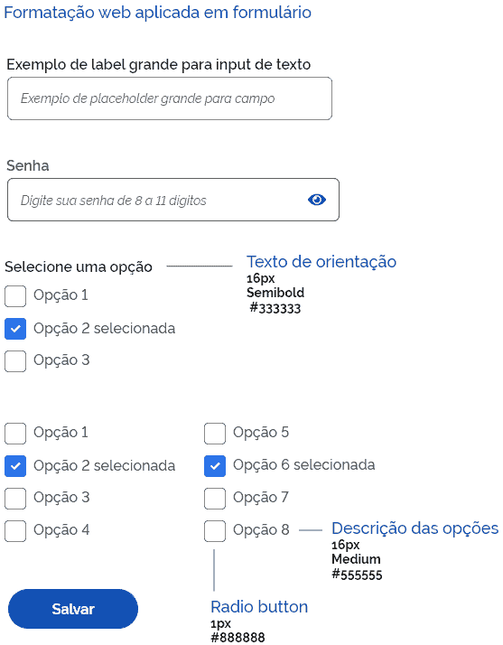
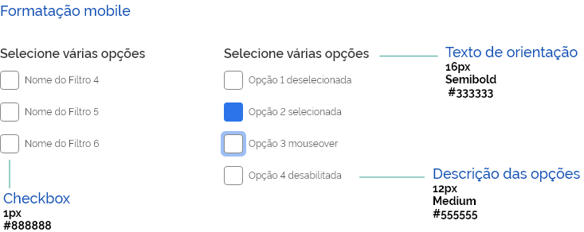

## ANATOMIA

Cada opção deve ser acompanhada de um texto que a descreva.

## ESTADOS

Os checkboxes podem estar nos estados: habilitados/desselecionado; hover; selecionado e desabilitado.

## USO

Os checkboxes deve ser usados para **selecionar um ou mais itens** de um conjunto de opções.

## ORIENTAÇÕES

**Distância entre colunas de Checkbox**

Dar preferência ao uso do texto em uma coluna, porém se houver necessidade de mais de uma coluna utilizar a distância mínima entre duas colunas de checkboxes, que deve ser de 100px na web.

Como, por exemplo, pode ocorrer nos filtros da busca avançada.

