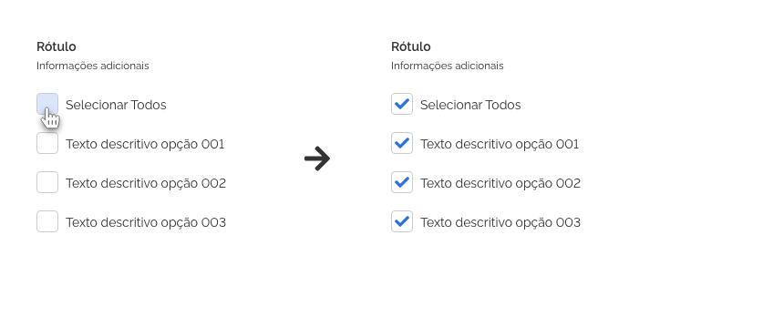
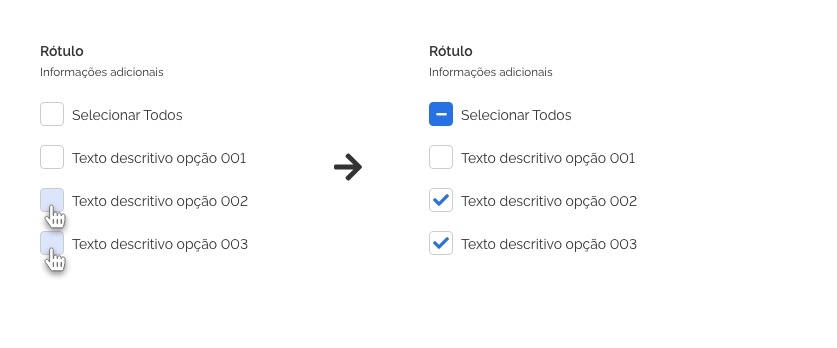
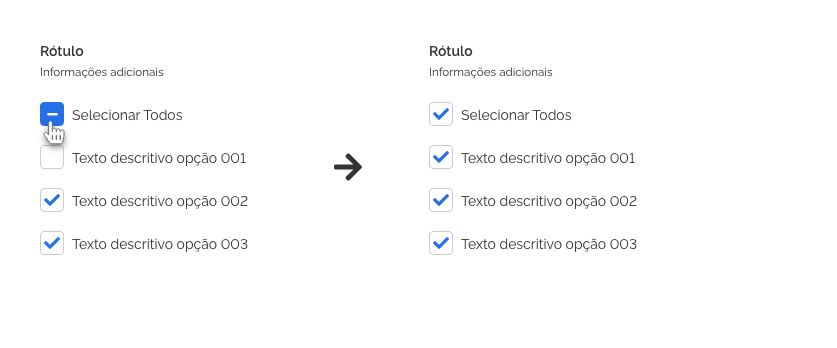
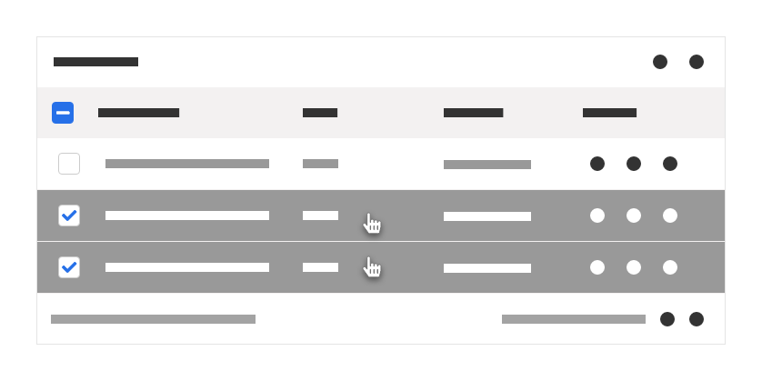

[version]: # (2.2.3)

*Exemplo do componente checkbox.*

Deve ser utilizado para permitir que o usuário selecione uma ou mais opções em uma lista de opções. Quando a lista de opções permitir a seleção de apenas um único item utilize o componente *radiobutton*.

Quando a lista de opções for muito extensa, deve ser avaliada a possibilidade de uso do componente *select*.

Cada opção pode ou não ser acompanhada por um texto descritivo que identifica o item a ser selecionado.

O componente pode ser utilizado sem o texto descritivo para identificar a seleção de um conjunto de itens como em uma linha de tabela, por exemplo; e deverá continuar mantendo suas diretrizes de alinhamento e espaçamento.

É fundamental que antes de uma lista de opções múltiplas apareça um rótulo e uma breve descrição, orientando ao usuário sobre o que se trata as opções e que podem ser selecionadas mais de uma opção.

---

## Tom e voz

-   Deve-se utilizar o componente para opções em que a resposta seja sim ou não. Ex.: Lembrar senha?

-   Quando a resposta for ligado ou desligado (Ex.: Componente habilitado.) pode-se utilizar o componente *switch* como alternativa.

-   Recomenda-se que o texto do rótulo e o texto descritivo sejam breves, claros e diretos. Utilizar os verbos sempre na terceira pessoa do imperativo afirmativo. Ex.: Selecione os estados contidos no projeto.

-   Dar preferência ao uso do componente em uma coluna, porém pode-se dispor de mais de uma coluna se houver extrema necessidade. Nesse caso, é recomendado manter a mesma largura em todos os itens da mesma coluna e a mesma altura dos itens da mesma linha da lista.

-   Deve-se manter uma coerência entre as larguras dos itens evitando uma largura de linha com mais de 10 palavras ou 56 caracteres em média.

---

## Anatomia

| ID  | Nome                              |                             Referência                             | Uso         |
| --- | --------------------------------- | :----------------------------------------------------------------: | ----------- |
| 1   | Caixa de opção                    |                                ---                                 | Obrigatório |
| 2   | Item de opção                     |     [Item](https://www.gov.br/ds/components/item?tab=designer)     | Obrigatório |
| 3   | Cabeçalho de opções               | [Tipografia](https://www.gov.br/ds/fundamentos-visuais/tipografia) | Opcional    |
| 4   | Lista de opções                   |     [List](https://www.gov.br/ds/components/list?tab=designer)     | Obrigatório |
| 5   | Mensagem de *feedback* contextual |  [Message](https://www.gov.br/ds/components/message?tab=designer)  | Opcional    |

*Anatomia do componente checkbox*

---

## Detalhamento dos itens

### 1. Caixa de opção (Obrigatório)

A caixa de opção é composta pelo *container* e pelo ícone de suporte visual interativo que indicará o estado do componente como selecionado ou válido. Pode ser utilizado de forma independente como em células de tabelas, por exemplo.

1. *Container*;

2. Ícone de suporte visual.

*Exemplo de caixa de opção.*

#### *Container*

O *container* do *checkbox* parte de um quadrado com os cantos levemente arredondados.

#### Ícone de suporte visual interativo

O Ícone de suporte visual é um elemento que se encontra dentro da área do *container* e deve ser utilizado para identificar o estado do item *checkbox* como selecionado ou válido a depender do seu estado.

### 2. Item de opção (Obrigatório)

É composto pela caixa de opção à esquerda e o texto descritivo sempre à direita. Este item deve ter uma largura mínima e máxima (ver design tokens).

1. Caixa de opção;

2. Texto descritivo (opcional).

*Exemplo de item de opção.*

-   Para proporcionar um maior conforto visual ao usuário, o texto descritivo deve se posicionar sempre à direita do *container* respeitando o espaçamento lateral da caixa de opção.

-   O texto que descreve a opção a ser selecionada pode ser suprimido dependendo da aplicação, como por exemplo em tabelas.

-   Deve-se manter uma coerência entre as larguras dos itens evitando um texto descritivo com mais de sete palavras.

-   Os textos descritivos deverão ser escritos com sua primeira letra em maiúsculo e o restante em minúsculo. Ex.: Selecione a opção 01.

-   Evitar escrever com todas as letras em maiúsculo (*ALL CAPS*) ou com todas as primeiras letras das palavras em maiúsculo (*Camel Case*).

### 3. Cabeçalho de opções (Opcional)

O cabeçalho de opções é composto pelo rótulo e caso necessário, texto auxiliar. Deve ser o item mais ao topo da lista de opções. Não há restrição de largura ou altura para este item.

1. Rótulo;

2. Texto auxiliar.

*Exemplo de cabeçalho.*

#### Rótulo (opcional)

-   Quando o componente é apresentado em uma lista e opções devem ser precedidos de um rótulo que descreva a informação que o usuário deve selecionar.

-   O rótulo deve estar posicionado no topo do componente alinhado à esquerda.

-   O rótulo deve ser escrito com sua primeira letra em maiúsculo e o restante em minúsculo. Ex.: Selecione a opção 01.

-   Evitar escrever com todas as letras em maiúsculo (*ALL CAPS*) ou com todas as primeiras letras das palavras em maiúsculo (*Camel Case*).

#### Informações Adicionais (opcional)

-   É possível adicionar um texto auxiliar ao rótulo para facilitar o seu entendimento.

-   Este texto deve estar posicionado logo abaixo do componente rótulo, sem espaçamentos e alinhado à esquerda.

-   Deve ser escrito com sua primeira letra em maiúsculo e o restante em minúsculo. Ex.: Selecione a opção 01.

-   Evitar escrever com todas as letras em maiúsculo (*ALL CAPS*) ou com todas as primeiras letras das palavras em maiúsculo (*Camel Case*).

### 4. Lista de Opções (Obrigatório)

A lista de opções é o conjunto formado pelos itens de opção.
Quando esta lista possuir mais de um item é recomendado que seja precedida de um cabeçalho de opções.

1. Lista de opções.

*Exemplo de lista de opções.*

### 5. Mensagens de feedback contextual (Opcional)

O componente mensagem pode ser utilizado para enviar mensagens informativas de alerta, de erro ou validação (*feedback* contextual). Estas mensagens devem ser o mais sucintas possível e de preferência não ultrapassando uma linha de mesma largura do campo de texto, além de seguir suas diretrizes de componente.
Deve estar posicionada logo abaixo do último item da lista de opções, alinhado à esquerda e respeitando uma margem superior de acordo com suas diretrizes.

1. Mensagem de *feedback* contextual.

*Exemplo de mensagem de feedback contextual.*

---

## Comportamentos

### 1. Estados

Os itens do componente *checkbox* se apresentam nos seguintes estados:

#### Estado Não selecionado (estado padrão)

Estado padrão do componente. Indica que o usuário não interagiu com o componente.

*Exemplo do checkbox no estado padrão não selecionado.*

#### Estado *Hover*

Estado que indica que o usuário posicionou o ponteiro do *mouse* sobre a área do componente. Pode não fazer sentido em dispositivos em que não se utiliza o *mouse* como recurso.

*Exemplo do estado hover no componente checkbox.*

#### Estado Selecionado

Este estado indica que o usuário selecionou um item. Pode ser acionado:

1. Pressionando a tecla espaço quando o foco estiver no componente;

2. Pelo clique do *mouse* ou toque na tela na região do componente (incluindo seu texto descritivo, quando houver);

3. Ou por meio de outra ação que corresponda ao item desejado pelo usuário, como por exemplo recursos de voz.

*Exemplo do checkbox no estado selecionado.*

#### Estado Foco

Este estado indica que o item da lista de opções está destacado, só será usado o método de entrada por teclado (tecla "Tab", por exemplo). Este estado é de extrema importância para garantir a acessibilidade do componente na interface.

*Exemplo do checkbox no estado foco.*

#### Estado Inválido

Este é o estado indicativo de que uma opção não é válida. Pode ser aplicado quando a opção selecionada em um questionário está incorreta ou quando o preenchimento de pelo menos uma opção é obrigatório.

*Exemplo do checkbox no estado inválido.*

#### Estado Válido

Estado indicativo de que a opção é válida. Pode ser aplicado quando a opção selecionada em um questionário está correta, por exemplo.

*Exemplo do checkbox no estado válido.*

#### Estado Desabilitado

Estado que indica que uma ou mais opções não estão disponíveis para serem selecionadas.

*Exemplo do checkbox no estado desabilitado.*

#### Estado Intermediário

Este estado é utilizado quando ocorre a "seleção em lote", ou seja, quando alguns itens vinculados ao *Checkbox Principal* estiverem selecionados, porém não todos, este assumirá o *Estado Intermediário*.

*Estado Intermediário*

Funciona da seguinte forma:

1. Caso o usuário clique no *Checkbox Principal* no *Estado Não Selecionado*, o *Checkbox Principal* assumirá o *Estado Selecionado* e realizará a seleção de todos os itens que estão vinculados a ele.

*Selecionando o CheckBox Principal*

2. Caso o usuário clique no *Checkbox Principal* no *Estado Selecionado*, o *Checkbox Principal* assumirá o *Estado Não Selecionado* e removerá a seleção de todos os itens que estão vinculados a ele.

*Desselecionando o CheckBox Principal*

3. Caso o usuário selecione alguns itens que estejam vinculados ao *CheckBox Principal*, porém não selecione todos eles, o *CheckBox Principal* assumirá o *Estado Intermediário*.

*Estado Intermediário*

4. Caso o usuário clique no *Checkbox Principal* no *Estado Intermediário*, o *Checkbox Principal* assumirá o *Estado Selecionado* e realizará a seleção de todos os itens vinculados a ele.

*Clicando no CheckBox com Estado Intermediário*

**OBS:** Os itens vinculados ao *CheckBox Principal* não precisam ser necessariamente outros *CheckBoxes*, poderão ser utilizados outros componentes ou estado que representem a seleção de elementos. Abaixo pode-se observar alguns exemplos de seleção em lote com outros componentes e elementos.

*Estado Intermediário com Listas e Swiches*

*Estado Intermediário com Seleção de Linhas em Tabelas*

### 2. Espaçamento e Alinhamento

#### Espaçamento

*Espaçamento dos elementos do item de checkbox.*

##### Caixa de opção

A caixa de opção do item do *checkbox* deve manter uma distância superior e inferior (1) e um espaçamento lateral direito (2) de qualquer outro elemento.

##### Texto descritivo

O texto descritivo deve se posicionar sempre à direita a (2) da caixa de opção como indicado acima. Deve manter um espaçamento inferior dos elementos abaixo (3).

##### Item de opção

Cada item do *checkbox*, composto pela caixa de opção à esquerda e seu texto descritivo à direita, deve manter uma distância à direita (4), abaixo (3) e acima (1) entre este e o próximo componente.

*Espaçamento entre os itens do checkbox.*

##### Cabeçalho de opções

O rótulo e o texto auxiliar devem estar localizados no topo do agrupamento. Não há espaçamento além do já previsto em suas diretrizes e um espaçamento inferior a partir do último dos dois elementos (rótulo ou texto auxiliar).

##### Mensagens de *feedback* contextual

Deve ser o elemento mais abaixo de todos na lista de opções do componente. Deve manter o espaçamento superior do último item da lista de opções (2).

**Atenção:** deve haver apenas uma mensagem para todo o conjunto da lista de opções.

##### Disposição vertical

*Exemplo de checkbox com disposição vertical com texto descritivo.*

No caso de *checkbox* com disposição vertical com texto descritivo de alturas diferentes ou que ultrapassem uma linha de conteúdo deve-se manter o espaçamento inferior (3) para garantir a distinção dos itens pelo usuário.

Não há limite de altura ou linhas de texto para item de opção.

Para itens de opção com larguras diferentes a lista de opções deve seguir as dimensões do maior item.

##### Disposição horizontal

*Exemplo de espaçamentos em checkbox com disposição horizontal.*

Para *checkboxes* com disposição horizontal com mais de um item deve-se manter a largura máxima (1) e mínima (2) (ver *design tokens*).

No caso de listas horizontais com itens de opção com larguras diferentes, deve-se manter o espaçamento lateral direito de segurança entre os itens (2).

No caso do item de opção ultrapassar o limite de largura (1), o texto descritivo deverá continuar em uma outra linha mantendo o alinhamento ao texto.

Não há limite de linhas de texto ou altura de linha para os itens do componente.

Para itens de opção com alturas diferentes a lista de opções deve seguir as dimensões do maior item.

---

## Especificações

### Dimensões

| Nome           | Property      | Value |
| -------------- | ------------- | ----- |
| Caixa de opção | width         | 24px  |
| Caixa de opção | height        | 24px  |
| Caixa de opção | border-radius | 4px   |
| Caixa de opção | border-width  | 1px   |

### Espaçamentos

| Name                | Property       | Value                         |
| ------------------- | -------------- | ----------------------------- |
| Caixa de opção      | padding-right  | `--spacing-scale-base`        |
| Caixa de opção      | padding-left   | `--spacing-scale-default`     |
| Caixa de opção      | padding-top    | `--spacing-scale-half`        |
| Caixa de opção      | padding-bottom | `--spacing-scale-half`        |
| Texto descritivo    | padding-right  | `--spacing-scale-4x`          |
| Texto descritivo    | padding-left   | `--spacing-scale-default`     |
| Texto descritivo    | padding-bottom | ``--spacing-scale-2x``        |
| Texto descritivo    | padding-top    | `--spacing-scale-half`        |
| Ícone Intermediário | vertical-align | `--spacing-vertical-center`   |
| Ícone Intermediário | text-align     | `--spacing-horizontal-center` |

| Nome                | Property       | Value                     |
| ------------------- | -------------- | ------------------------- |
| Rótulo              | padding        | `--spacing-scale-default` |
| Texto auxiliar      | padding        | `--spacing-scale-default` |
| Cabeçalho de opções | padding        | `--spacing-scale-default` |
| Cabeçalho de opções | padding-bottom | `--spacing-scale-2x`      |
| Lista de opções     | padding-top    | `--spacing-scale-default` |
| Lista de opções     | margin-bottom  | `--spacing-scale-2x`      |
| Lista de opções     | padding-left   | `--spacing-scale-default` |
| Lista de opções     | padding-right  | `--spacing-scale-5x`      |

### Tipografia

| Name             | family-type          | font-size                   | font-weight               |
| ---------------- | -------------------- | --------------------------- | ------------------------- |
| Rótulo           | `–-font-family-base` | `--font-size-scale-base`    | `--font-weight-semi-bold` |
| Texto auxiliar   | `-–font-family-base` | `--font-size-scale-down-01` | `--font-weight-medium`    |
| Texto descritivo | `-–font-family-base` | `--font-size-scale-base`    | `--font-weight-medium`    |

### Cores

| Name                                  | Property   | Color Token            |
| ------------------------------------- | ---------- | ---------------------- |
| Caixa de opção                        | background | `--pure-0`             |
| Caixa de opção                        | border     | `--gray-20`            |
| Caixa de opção (Estado Intermediário) | background | `--blue-warm-vivid-50` |
| Caixa de opção (Estado Intermediário) | border     | `--blue-warm-vivid-50` |
| Caixa de opção (Estado Intermediário) | color      | `--pure-0`             |
| Texto descritivo                      | color      | `--gray-80`            |
| Rótulo                                | color      | `--gray-80`            |
| Informações adicionais                | color      | `--gray-80`            |

### Iconografia

| Name                | Estado | Ícone                        | Size              | Class (Font Awesome) |
| ------------------- | ------ | ---------------------------- | ----------------- | -------------------- |
| Ícone interativo    | --     | <i class="fas fa-check"></i> | `.icone.size--sm` | `.fa-check`          |
| Ícone intermediário | --     | <i class="fas fa-minus"></i> | `.icone.size--sm` | `.fa-minus`          |
