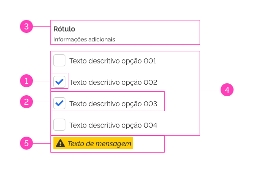
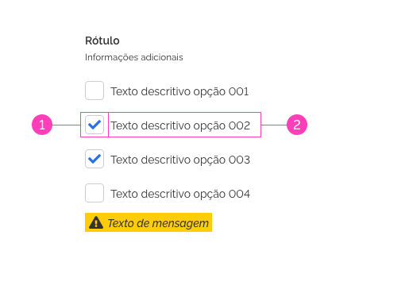
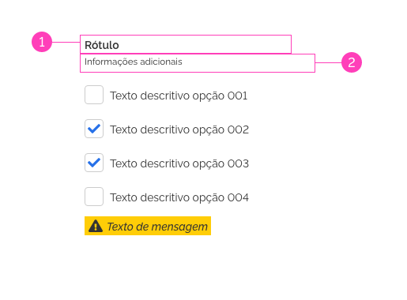
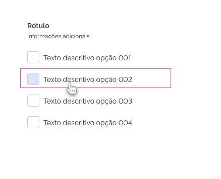
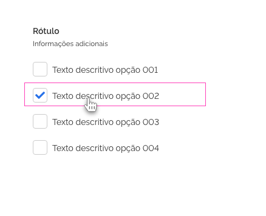
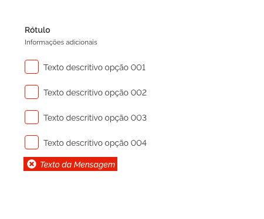
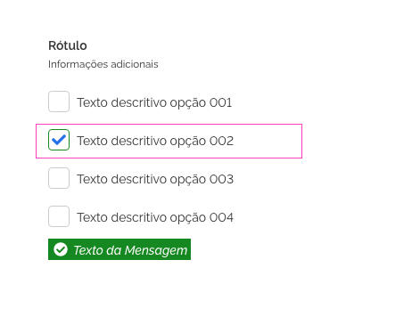
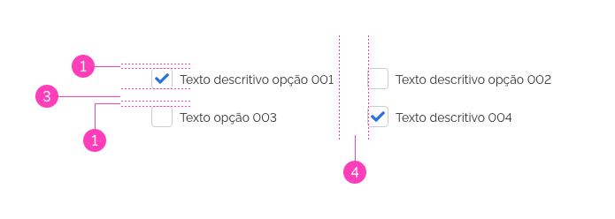
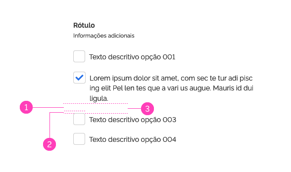

[version]: # '2.0.0'

---

## Uso

O componente Checkbox deve ser utilizado para permitir que o usuário selecione uma ou mais opções em uma lista de opções.

Quando a lista de opções exigir a seleção de apenas um item deve-se utlizar o componente radiobutton.

Quando a lista de opções for muito extensa, deve ser avaliada a possibilidade de uso do componente select.

Cada opção pode ou não ser acompanhada por um texto descritivo que identifica o item a ser selecionado.

O componente pode ser utilizado sem o texto descritivo para identificar a seleção de um conjunto de itens como em uma linha de tabela, por exemplo; e deverá continuar mantendo suas diretrizes de alinhamento e espaçamento.

É fundamental que antes de uma lista de opções múltiplas apareça um rótulo e uma breve descrição, orientando ao usuário sobre o que se trata as opções e que podem ser selecionadas mais de uma opção.

## Tom de voz

Deve-se utilizar o componente para opções em que a resposta seja sim ou não (Ex.: Lembrar senha?), quando a resposta for ligado ou desligado (Ex.: Componente habilitado.) pode-se utilizar o componente switch como alternativa.

Recomenda-se, que o texto do rótulo e o texto descritivo sejam breves, claros e diretos. Utilizar os verbos sempre na terceira pessoa do imperativo afirmativo. Ex.: Selecione os estados contidos no projeto.

Dar preferência ao uso do componente em uma coluna, porém pode-se dispor de mais de uma coluna se houver extrema necessidade. Nesse caso, é recomendado manter a mesma largura em todas os itens da mesma coluna e a mesma altura dos itens da mesma linha da lista.

Deve-se manter uma coerência entre as larguras dos itens evitando uma largura de linha com mais de 10 palavras ou 56 caracteres em média.

---

## Anatomia

1. Caixa de opção
2. Ítem de opção
3. Cabeçalho de opções
4. Lista de opções
5. Mensagem

### 1. Caixa de opção

A caixa de opção é composta pelo container (1) e pelo ícone de suporte visual interativo (2) que indicará o estado do componente como selecionado ou válido. Pode ser utilizado de forma independente como em células de tabelas, por exemplo.

1. Container

    - O container do checkbox parte de um quadrado com os cantos levemente arredondados.

2. Ícone de suporte visual interativo
    - O Ícone de suporte visual é um elemento que ficará dentro da área do container e deve ser utilizado para identificar o estado do item checkbox como selecionado ou válido a depender do seu estado.
    - Deve estar dentro da área do container

### 2. O ítem de opção

É composto pela caixa de opção (1) à esquerda e o texto descritivo (2) sempre à sua direita. Este ítem deve ter uma largura mínima e máxima (ver design tokens).

1. Caixa de opção
2. Texto descritivo (opcional)
    - Para proporcionar um maior conforto visual ao usuário o texto descritivo deve se posicionar sempre à direita do container respeitando o espaçamento lateral da caixa de opção.
    - Texto que descreve a opção a ser selecionada. Pode ser suprimido dependendo da aplicação, como por exemplo em tabelas.
    - Deve-se manter uma coerência entre as larguras dos itens evitando um texto descritivo com mais de sete palavras.
    - Os textos descritivos deverão ser escritos com sua primeira letra em maiúsculo e o restante em minúsculo. Ex.: Selecione a opção 01.
    - Evitar escrever com todas as letras em maiúsculo (ALL CAPS) ou com todas as primeiras letras das palavras em maiúsculo (Camel Case).

### 3. Cabeçalho de opções (opcional)

O cabeçalho de opções é composto pelo rótulo (1) e caso necessário, texto auxiliar (2). Deve ser o item mais ao topo da lista de opções. Não há restrição de largura ou altura para este item.

1. Rótulo (opcional)

    - Quando o componente é apresentado em uma lista e opções devem ser precedidos de um rótulo que descreva a informação que o usuário deve selecionar.
    - O rótulo deve se posicionar no topo do componente alinhado à esquerda.
    - Deverá ser escrito com sua primeira letra em maiúsculo e o restante em minúsculo. Ex.: Selecione a opção 01.
    - Evitar escrever com todas as letras em maiúsculo (ALL CAPS) ou com todas as primeiras letras das palavras em maiúsculo (Camel Case).

2) Informações Adicionais (opcional)
    - É possível adicionar um texto auxiliar ao rótulo para facilitar o seu entendimento.
    - Este texto deve se posicionar logo abaixo do componente rótulo, sem espaçamentos e alinhado à esquerda.
    - Deverá ser escrito com sua primeira letra em maiúsculo e o restante em minúsculo. Ex.: Selecione a opção 01.
    - Evitar escrever com todas as letras em maiúsculo (ALL CAPS) ou com todas as primeiras letras das palavras em maiúsculo (Camel Case).

### 4. lista de opções

A lista de opções é o conjunto formados itens de opções (1).
Quando esta lista possuir mais de um item é recomendado que seja precedida de um cabeçalho de opções.

### 3. Mensagens de feedback contextual (opcional)

O componente mensagem pode ser utilizado para enviar mensagens informativas, de alerta, de erro ou validação (feedback contextual) devem ser o mais sucintas possível, de preferência não ultrapassando uma linha da mesma largura do campo de texto além de seguir suas diretrizes de componente.
Deve se posicionar abaixo do último item da lista de opções, alinhado à esquerda e respeitando uma margem superior de acordo com suas diretrizes.

---

### Comportamento

#### Estados

Os itens do componente checkbox se apresentam nos estados abaixo:

1. Unselected (Padrão)
2. Hover
3. Selected
4. Focused
5. Invalid
6. Valid
7. Disabled

1. Unselected (Estado padrão)

    - Estado padrão do componente. Indica que o usuário não respondeu ou não optou pela opção da lista.

2. Hover

    - Estado que indica que o usuário posicionou o ponteiro do mouse sobre a área do componente (1). Pode não fazer sentido em dispositivos em que não se utiliza o mouse como recurso.

    

3. Selected

    - Estado que indica que o usuário selecionou um item. Pode ser acionado pressionando a tecla espaço quando o foco está no componente, pelo clique do mouse ou toque na tela na região do componente (incluindo seu texto descritivo, quando houver), ou outra ação que corresponda ao item desejado pelo usuário com a fala, por exemplo.

    

4. Focused

    - Estado que indica que o item da lista de opções está destacado, usando um método de entrada como a tecla "Tab" do teclado, por exemplo. Este estado é de extrema importância para garantir a acessibilidade do componente na interface.

    

5. Invalid

    - Estado indicativo de que a opção não é válida. Pode ser aplicado quando a opção selecionada em um questionário está incorreta, ou o preenchimento de ao menos uma opção é obrigatório.

    

6. Valid

    - Estado indicativo de que a opção é válida. Pode ser aplicado quando a opção selecionada em um questionário está correta, por exemplo.

    

7. Disabled

    - Estado que indica que a opção não está disponível para ser selecionada.

    

### Espaçamento e Alinhamento

-   Caixa de opção

    -   A caixa de opção do item do checkbox deve manter uma distância superior e inferior (1) e um espaçamento lateral direito (2) de qualquer outro elemento.

-   Texto descritivo
    -   O texto descritivo deve se posicionar sempre à direita a (2) da caixa de opção como indicado acima. Deve manter um espaçamento inferior dos elementos abaixo (3).

-   Ítem de opção

    -   Cada item do checkbox, composto pela caixa de opção à esquerda e seu texto descritivo à direita, deve manter uma distância à direita (4), abaixo (3) e acima (1) entre este e o próximo componente.

-   Cabeçalho de opções

    -   O Rótulo e o texto auxiliar devem estar ao topo do agrupamento, devem se posicionar um logo abaixo do outro não havendo espaçamento além do já previsto em suas diretrizes e um espaçamento inferior a partir do último dos dois elementos (Rótulo ou texto auxiliar).

-   Mensagens de feedback contextual

    -   Deve ser o elemento mais abaixo na lista de opções do componente.
    -   Deve manter o espaçamento superior do último item da lista de opções (2).
    -   Deverá haver apenas uma mensagem para todo o conjunto da lista de opções.

    

*   Disposição vertical

    -   No caso de listas verticais com textos descritivos de alturas diferentes ou que ultrapassem uma linha de conteúdo deve-se manter o espaçamento inferior (3) para garantir a distinção dos itens pelo usuário.

    -   Não há limite de altura ou linhas de texto para os ítem de opção.

    -   Para itens de opção com larguras diferentes a lista de opções deve seguir as dimensões do maior item.

    

*   Disposição horizontal

    -   Para listas horizontais com mais de um ítem, deve-se manter a largura máxima (1) e mínima (2) (ver design tokens).

    -   No caso de listas horizontais com itens de opção com larguras diferentes, deve-se manter o espaçamento lateral direito de segurança entre os itens (2).

    -   No caso do item de opção ultrapassar o limite de largura (1), o texto descritivo deverá continuar em uma outra linha mantendo o alinhamento ao texto.

    

    -   Não há limite de linhas de texto ou altura de linha para os itens do componente.

    -   Para itens de opção com alturas diferentes a lista de opções deve seguir as dimensões do maior item.

---

## Design Tokens

### Dimensões

| Nome           | Property      | Value |
| -------------- | ------------- | ----- |
| Caixa de opção | width         | 24px  |
| Caixa de opção | height        | 24px  |
| Caixa de opção | border-radius | 4px   |
| Caixa de opção | border-width  | 1px   |
| --             | --            | --    | -- |

### Espaçamento

| Name             | Property       | Value |
| ---------------- | -------------- | ----- |
| Caixa de opção   | padding-right  | 8px   |
| Caixa de opção   | padding-left   | 0px   |
| Caixa de opção   | padding-top    | 4px   |
| Caixa de opção   | padding-bottom | 4px   |
| Texto descritivo | padding-right  | 32px  |
| Texto descritivo | padding-left   | 0px   |
| Texto descritivo | padding-bottom | 16px  |
| Texto descritivo | padding-top    | 4px   |
| --               | --             | --    |

| Nome                | Property       | Value |
| ------------------- | -------------- | ----- |
| Rótulo              | padding        | 0px   |
| Texto auxiliar      | padding        | 0px   |
| Cabeçalho de opções | padding        | 0px   |
| Cabeçalho de opções | padding-bottom | 16px  |
| Lista de opções     | padding-top    | 0px   |
| Lista de opções     | padding-bottom | 40px  |
| Lista de opções     | padding-left   | 0px   |
| Lista de opções     | padding-right  | 40px  |
| --                  | --             | --    | -- |

### Tipografia

| Name             | family-type          | font-size                   | font-weight               |
| ---------------- | -------------------- | --------------------------- | ------------------------- |
| Rótulo           | `–-font-family-base` | `--font-size-scale-base`    | `--font-weight-semi-bold` |
| Texto auxiliar   | `-–font-family-base` | `--font-size-scale-down-01` | `--font-weight-medium`    |
| Texto descritivo | `-–font-family-base` | `--font-size-scale-base`    | `--font-weight-medium`    |
| --               | --                   | --                          | --                        |

### Cores

| Name                   | Property   | Color Token             |
| ---------------------- | ---------- | ----------------------- |
| Caixa de opção         | background | `--color-secondary--01` |
| Caixa de opção         | border     | `--color-secondary--04` |
| Texto descritivo       | color      | `--color-secondary--08` |
| Rótulo                 | color      | `--color-secondary--08` |
| Informações adicionais | color      | `--color-secondary--08` |
| --                     | --         | --                      | -- |

### Estados

| Name             | state    | Property   | Token                         |
| ---------------- | -------- | ---------- | ----------------------------- |
| Caixa de opção   | hover    | background | `-–status-hover-background`   |
| Caixa de opção   | hover    | border     | `-–color-secondary-04`        |
| --               | --       | --         | --                            |
| Caixa de opção   | focused  | background | `-–status-focused-overlay`    |
| Caixa de opção   | focused  | background | `-–status-focused-background` |
| Caixa de opção   | focused  | border     | `-–color-secondary-04`        |
| --               | --       | --         | --                            |
| Caixa de opção   | invalid  | background | `-–color-secondary-01`        |
| Caixa de opção   | invalid  | border     | `-–color-alarm-danger`        |
| --               | --       | --         | --                            |
| Caixa de opção   | disable  | background | `–status-disabled-background` |
| Caixa de opção   | disable  | text       | `–status-disabled-text`       |
| Caixa de opção   | disable  | border     | `––color-secondary-03`        |
| Caixa de opção   | disable  | opacity    | 45%                           |
| --               | --       | --         | --                            |
| Caixa de opção   | selected | background | `-–color-secondary-01`        |
| Caixa de opção   | selected | border     | `–-color-primary-lighten-01`  |
| ícone interativo | selected | color      | `-–color-primary-lighten-01`  |
| --               | --       | --         | --                            |
| Caixa de opção   | valid    | background | `-–color-secondary-01`        |
| Caixa de opção   | valid    | border     | `––color-alarm-success`       |
| ícone interativo | valid    | color      | `-–color-alarm-success`       |
| --               | --       | --         | --                            |

---

### Iconografia

| Name             | Estado | Ícone                        | Size              | Class (Font Awesome) |
| ---------------- | ------ | ---------------------------- | ----------------- | -------------------- |
| Ícone interativo | --     | <i class="fas fa-check"></i> | `.icone.size--sm` | `.fa-check`          |

---
