[version]: # (2.1.7)

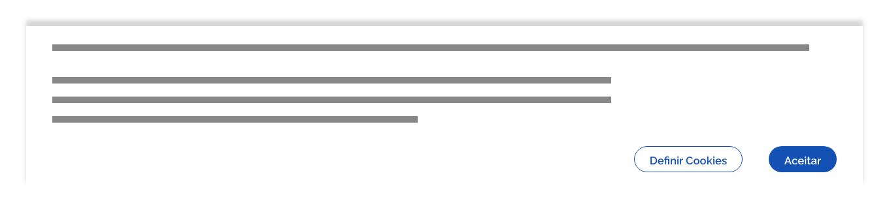
*Exemplo do componente cookieBar*

Trata-se de um componente obrigatório  em *sites* e aplicativos que fazem a coleta de qualquer dado do usuário e deve ser utilizado na tela inicial ficando sempre visível, até que o usuário dê o consentimento ou revogue o tratamento dos dados.

[Confira o texto oficial da lei nº 13.709/18](http://www.planalto.gov.br/ccivil_03/_ato2015-2018/2018/lei/L13709.htm)

*Infográfico com resumo dos pontos mais importantes da lei nº 13.709/18, extraído do Portal do Serpro*

---

## Tom e voz

Apesar de tratar de um tema bastante técnico, procure ser o mais claro e objetivo possível. Utilize vocabulário e termos simples e de fácil entendimento por leigos. Lembre-se que seu usuário não é obrigado a compreender expressões específicas restritas a áreas técnicas.

---

## Anatomia

Tenha em mente que o *cookieBar* é um componente único, no entanto, para facilitar a explicação este guia o divide em duas etapas:

-   **CookieBar default**: etapa em que o usuário se encontra na tela inicial;

-   **CookieBar aberto**: etapa em que o usuário interage com o botão "Definir Cookies" ou "Ver Política de Cookies".

| ID  | Nome                                                           |                                  Referência                                   | Uso         |
| --- | -------------------------------------------------------------- | :---------------------------------------------------------------------------: | ----------- |
| A   | Área de conteúdo global                                        |                                      ---                                      | Obrigatório |
| B   | Área de conteúdo introdutório                                  |                                      ---                                      | Obrigatório |
| C   | Área de conteúdo principal                                     |                                      ---                                      | Obrigatório |
| D   | Área de conteúdo complementar                                  |                                      ---                                      | Opcional    |
| E   | Área de ação                                                   |                                      ---                                      | Opcional    |
| 1   | Superfície                                                     | [Fundamento Superfície](https://www.gov.br/ds/fundamentos-visuais/superficie) | Obrigatório |
| 2   | Botão primário                                                 |   [Componente Button](https://www.gov.br/ds/components/button?tab=designer)   | Obrigatório |
| 3   | Botão secundário                                               |   [Componente Button](https://www.gov.br/ds/components/button?tab=designer)   | Obrigatório |
| 4   | Superfície *scrim*                                             | [Fundamento Superfície](https://www.gov.br/ds/fundamentos-visuais/superficie) | Opcional    |
| 5   | Título principal                                               | [Fundamento Tipografia](https://www.gov.br/ds/fundamentos-visuais/tipografia) | Obrigatório |
| 6   | Informação sobre atualização                                   |                                      ---                                      | Obrigatório |
| 7   | Texto introdutório                                             |                                      ---                                      | Obrigatório |
| 8   | Botão terciário fechar                                         |   [Componente Button](https://www.gov.br/ds/components/button?tab=designer)   | Obrigatório |
| 9   | Título da lista de classes de *cookies*                        | [Fundamento Tipografia](https://www.gov.br/ds/fundamentos-visuais/tipografia) | Obrigatório |
| 10  | Nome da classe do *cookie*                                     |                                      ---                                      | Obrigatório |
| 11  | Descrição da classe do *cookie*                                |                                      ---                                      | Obrigatório |
| 12  | *Checkbox* para ativação/desativação de todos os *cookies*     | [Componente Checkbox](https://www.gov.br/ds/components/checkbox?tab=designer) | Obrigatório |
| 13  | Botão terciário para abertura/fechamento da classe do *cookie* |   [Componente Button](https://www.gov.br/ds/components/button?tab=designer)   | Obrigatório |
| 14  | Aviso *opt in*                                                 |                                      ---                                      | Obrigatório |
| 15  | *Checkboxes* para ativação/desativação de classes de *cookies* | [Componente Checkbox](https://www.gov.br/ds/components/checkbox?tab=designer) | Obrigatório |
| 16  | *Card*                                                         |     [Componente Card](https://www.gov.br/ds/components/card?tab=designer)     | Obrigatório |
| 17  | *Switch* para ativação/desativação de *cookie* específico      |   [Componente Switch](https://www.gov.br/ds/components/switch?tab=designer)   | Obrigatório |
| 18  | Mensagem do sistema                                            |  [Componente Message](https://www.gov.br/ds/components/message?tab=designer)  | Obrigatório |
| 19  | *Link* para mais informações                                   |    [Fundamento Estados](https://www.gov.br/ds/fundamentos-visuais/estados)    | Obrigatório |

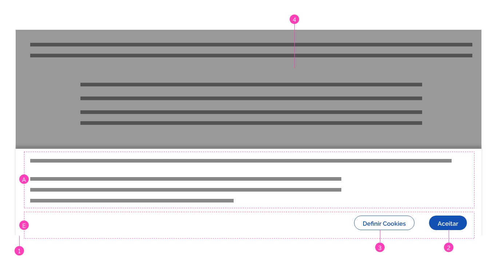
*Anatomia da etapa cookieBar default*

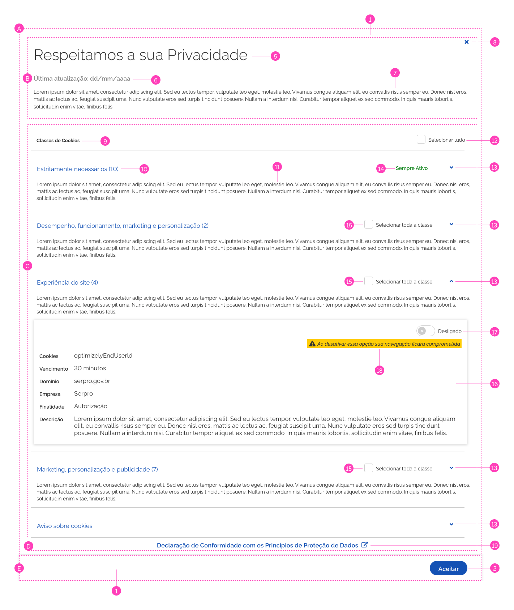
*Exemplo da etapa cookieBar aberto*

---

## Detalhamento dos Itens

### A. Área de Conteúdo Global (Obrigatório)

Na etapa *cookieBar default* a área de conteúdo global se limita a um texto descritivo informando que os dados do usuário serão gravados por meio de *cookies*, assim como os respectivos benefícios para uma melhor experiência de navegação. É fundamental que este texto seja claro e direto e informe que os dados do usuário poderão ser gravados mesmo que não seja aceito a política de *cookies*. Além disso, algumas funcionalidades poderão não funcionar corretamente prejudicando a experiência de navegação como um todo.

Na etapa *cookieBar* aberto, o conteúdo deve ser mais amplo e detalhado e é dividido em três subáreas:

### B. Conteúdo Introdutório (Obrigatório)

Trata de informações a respeito do título da tela, última atualização do conteúdo e um breve texto introdutório.

### C. Conteúdo Principal (Obrigatório)

Trata do conteúdo principal com informações sobre os *cookies* utilizados e possibilidades de configurá-los, quando se tratar de *opt out*.

### D. Conteúdo complementar (Opcional)

Conteúdo opcional que, quando existir, deve oferecer *links* para conteúdos externos que complementam o entendimento do usuário.

### E. Área de ação (Opcional)

Esta área disponibiliza botões de ação.

-   **Quando opt in**: deve conter os botões **"Ver Política de Cookies"** e **"Aceitar"**;

-   **Quando opt out**: deve conter os botões **"Definir Cookies"** e **"Aceitar"**.

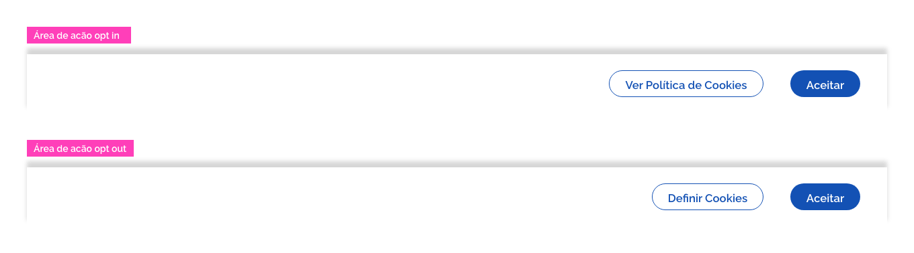
*Anatomia da área de ação para os casos opt in e opt out com seus respectivos botões*

### 16. *Cards* (Obrigatório)

Os *cards* devem apresentar as informações detalhadas de cada um dos *cookies*.

-   **Quando opt in**: O *card* deve apresentar apenas informações não interativas.

-   **Quando opt out**: O *card* deve apresentar, além das informações não interativas, *switches* para que os usuários possam configurar os *cookies*.

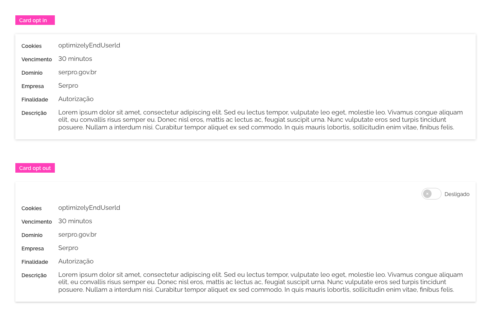
*Anatomia de cards para os casos opt in e opt out*

---

## Comportamentos

### 1. *Opt In* e *Opt Out*

Pensando em toda complexidade e cenários existentes, o componente foi desenvolvido de forma ser o mais flexível possível para tratar desde serviços que estão *opt in* como *opt out*.

1- É recomendável sempre que possível a utilização do padrão *opt out*. Nesse caso o *cookieBar* deve apresentar os botões: **Definir Cookies** e **Aceitar**.

-   Ao acionar o botão *Aceitar*, o usuário informa ao sistema que aceita a configuração padrão de *cookies* predefinida pelo sistema. O *cookieBar* é então recolhido com um movimento para baixo (micro interação) e o usuário está pronto para navegar pelo *site*.

-   Ao acionar o botão *"Definir Cookies"* o usuário é levado à etapa *cookieBar* aberto e tem a possibilidade de configurar os *cookies* conforme o seu desejo, além de ter acesso às informações técnicas a respeito dos *cookies* utilizados pelo sistema.

2- Já na configuração *opt  in* o usuário não tem permissão para definir *cookies* e por isso o botão **Definir Cookies** é alterado para **Ver Política de Cookies**. Ao acionar este botão o usuário tem acesso às mesmas informações do padrão *opt out*, porém sem a possibilidade de alterar *cookies*.

### 2. Navegação no *CookieBar default*

O  **cookieBar na etapa default** deve ser disponibilizado sempre no primeiro acesso do usuário na tela inicial do *site*/aplicativo e pode apresentar duas versões distintas: **opt in** e **opt out**:

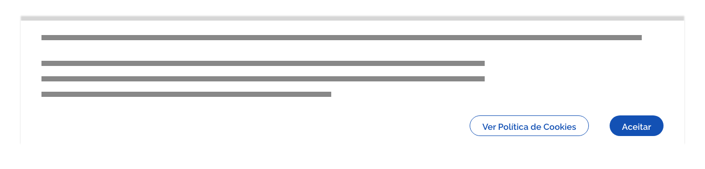
*Exemplo de cookieBar default na versão opt in*

*Exemplo de cookieBar default na versão opt out*

O *cookieBar default* só é apresentado no primeiro acesso do usuário e só pode ser fechado se o usuário aceitar os termos definidos pelo texto apresentado. A partir de então os dados são armazenados pelo sistema e o *cookieBar* não estará mais disponível ao usuário. Caso o usuário deseje redefinir os *cookies* poderá fazê-lo por meio de um item de menu localizado no *header* do *site*/aplicativo (ou outro local de destaque).

**Atenção:** quando o componente *cookieBar default* é apresentado, o conteúdo da tela pode estar bloqueado. Esse comportamento é opcional e varia de acordo com cada regra de negócio. Quando estiver bloqueado, utilize uma camada de superfície transparente (*scrim*) para demonstrar que não é possível navegar enquanto não houver a concordância com a política de *cookies* apresentada pelo *cookieBar default*.

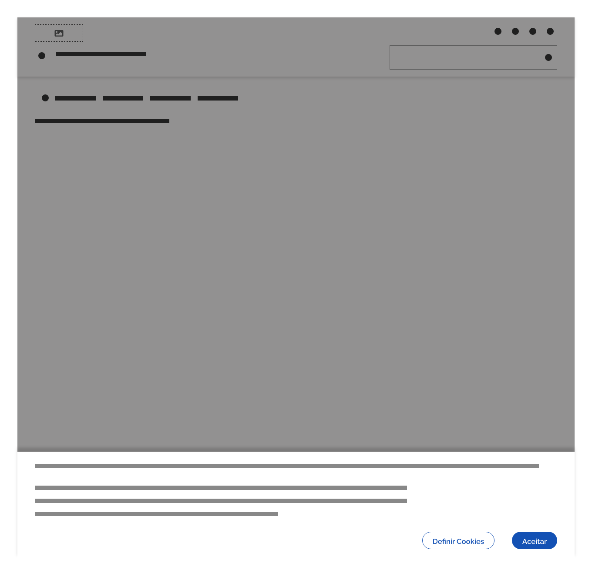
*Exemplo da tela inicial com conteúdo bloqueado (scrim) pelo cookieBar default*

Se o usuário clicar em **"Definir Cookies"** o **cookieBar default** se expande para cima cobrindo inteiramente a tela (micro interação) passando então para a etapa *cookieBar* aberto.

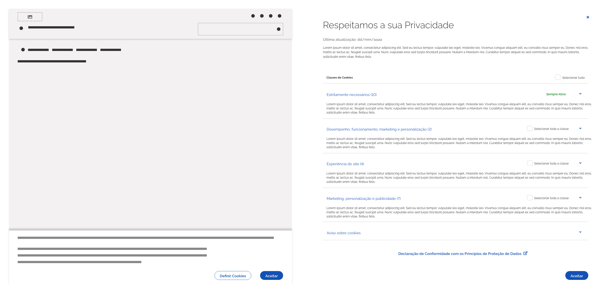
*A imagem da esquerda ilustra o cookieBar default na tela inicial e a imagem da direita, o cookieBar aberto, após o usuário acionar no botão "Definir Cookies"*

### 3. Navegação no *cookieBar* aberto

Esta etapa deve apresentar tudo o que o usuário necessita para entender como cada *cookie* funciona além de permitir, nos casos *opt out*, que o usuário possa configurar as preferências de *cookies* da maneira que preferir.

#### Classes

Quando houver grupos de *cookies* que apresentem algum tipo de relação entre si eles poderão ser agrupados em *classes*. Cada classe exibe entre parênteses a quantidade de *cookies* que contém. Para expandir uma classe e ter acesso a cada um dos *cookies* basta clicar na seta correspondente à classe desejada.

**Atenção:** agrupar os *cookies* por afinidades é uma boa maneira de organizar o conteúdo mas cada produto pode estruturar a informação da forma que achar mais apropriada.

A figura 1 ilustra o caso em que só é permitida ao usuário a seleção de *checkbox* para toda as classes. Já na figura 2 é possível selecionar cada *cookie* individualmente por meio de *switches*.

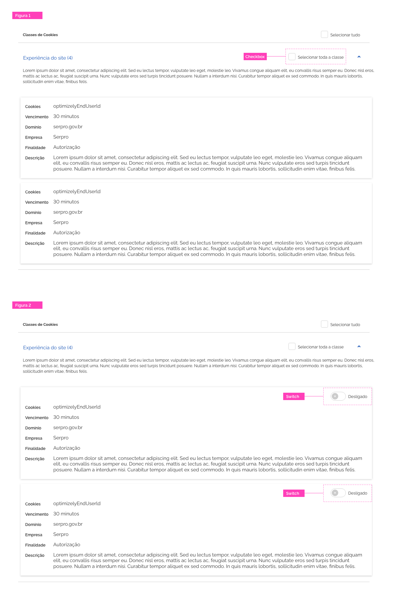
*Exemplos das possibilidades de uso dos switches*

**Atenção:** geralmente o usuário ativa/desativa a classe de *cookies*, mas também é possível definir *cookies* individualmente, conforme a necessidade de cada caso. Há também a possibilidade de o usuário selecionar/desselecionar todas as classes por meio de um *checkbox* localizado no *header* da lista de *cookies*. Entre parênteses é possível informar ao usuário quantos *cookies* foram selecionados em relação ao total.

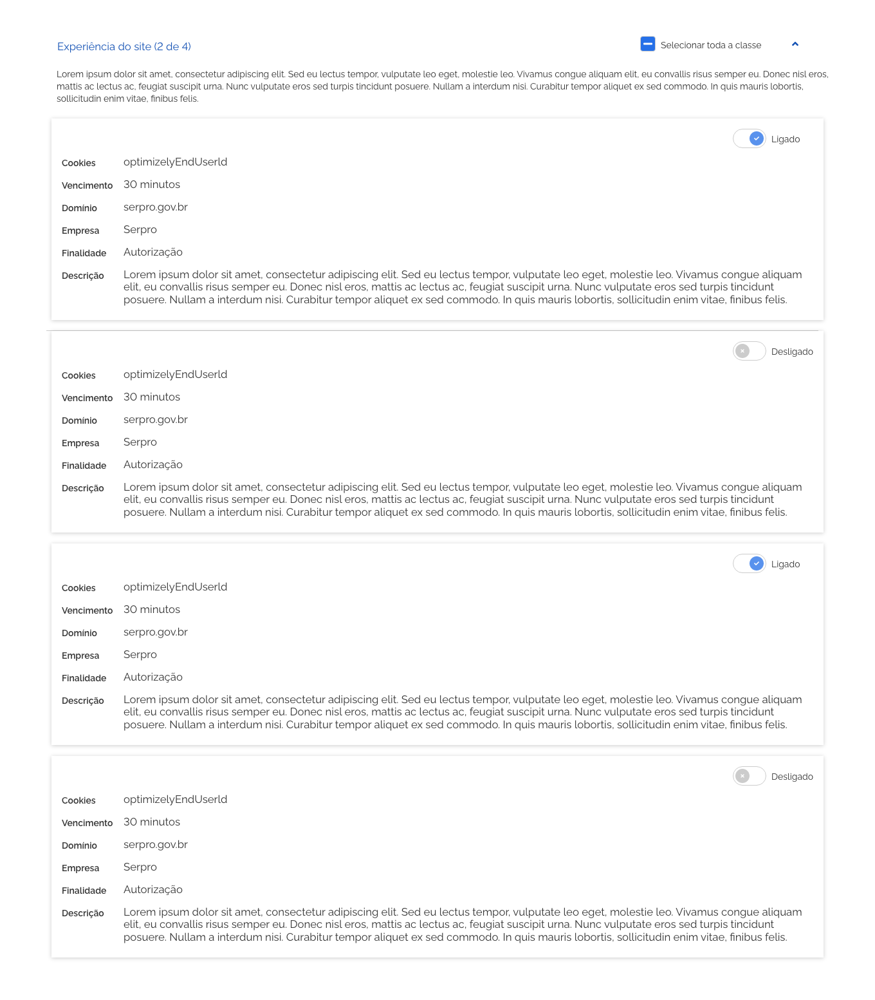
*Exemplos das possibilidades de uso dos checkboxes apresentando a possibilidade do checkbox em um modo intermediário e a informação da quantidade de cookies selecionados*

Desta forma, cada classe pode ser ativada ou desativada conforme a preferência do usuário. Podem ainda existir classes marcadas com o texto *"Sempre ativos"* na cor verde. Isso significa que essas classes não podem ser desativadas por motivos de performance do sistema e neste caso, não haverá *checkbox* para o usuário interagir.

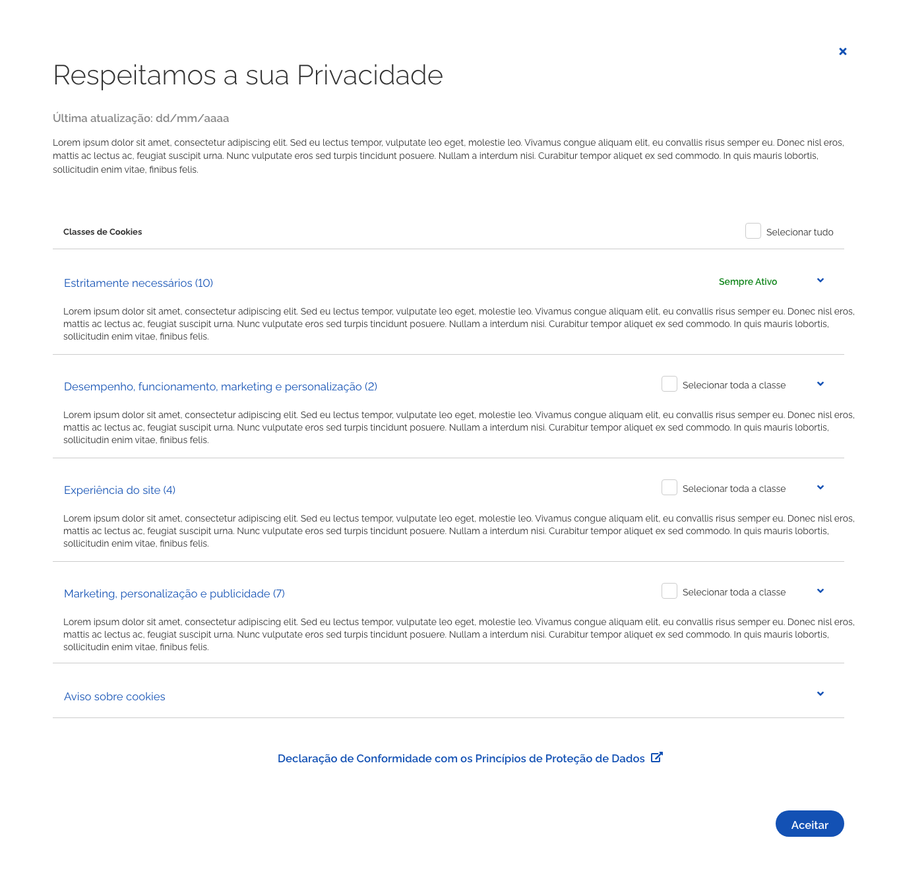
*Exemplo de tela com o cookieBar aberto apresentando a lista de classes de cookies*

#### *Card*

Ao clicar no ícone seta de qualquer uma das classes de *cookies* a mesma é aberta e detalhes sobre cada *cookie* são apresentados ao usuário em *cards*. Cada *cookie* pode apresentar um *switch* para habilitá-lo ou não, conforme a natureza do *cookie*.

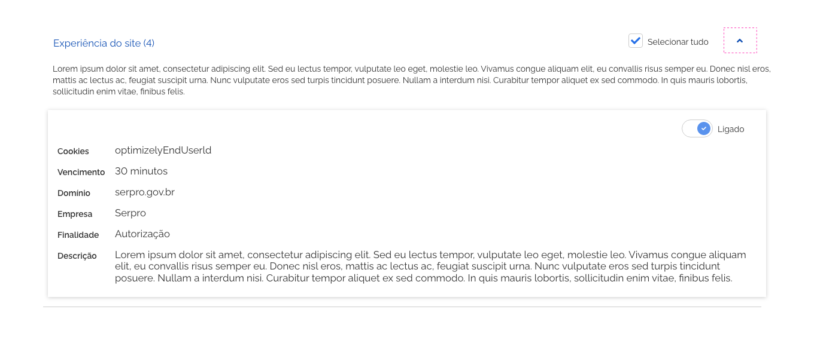
*Exemplo de uma classe de cookies aberta mostrando os detalhes do cookie em um card*

**Atenção:** cada *cookie* deve ser mostrado individualmente em um *card*. As informações descritivas sobre cada *cookie* são de responsabilidade do Órgão responsável pelo *site/aplicativo*.

#### Aviso sobre *cookies*

O último item da lista é o **Aviso sobre cookies**. Nesse item o usuário encontra apenas informações textuais em forma de pergunta-respostas, de acordo com a imagem abaixo:

*Exemplo de informações rápida sobre assuntos gerais*

**Atenção:** o padrão de perguntas-respostas é amplamente aceito na internet por ser uma forma rápida e objetiva de transmitir informação e por isso é bastante recomendável. Porém, o conteudista é sempre livre para criar o conteúdo da maneira que for mais interessante para seu negócio.

#### Botão fechar

A qualquer momento, independentemente de haver definido os *cookies* ou não, é possível fechar a tela de conteúdo. Para tanto, basta clicar no ícone fechar no topo à direita da tela. Após confirmar a ação de fechamento, o usuário retornará à tela inicial do *site*/aplicativo com o *cookieBar default* sendo apresentado ao usuário.

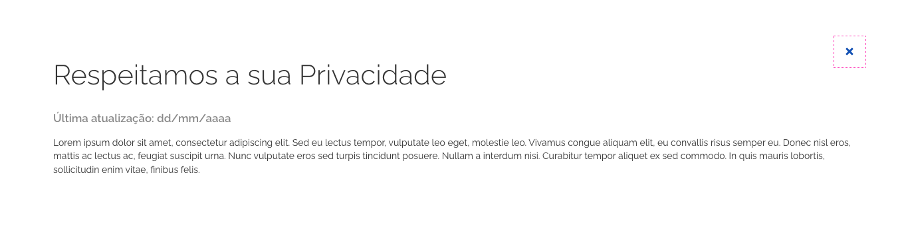
*Para fechar a tela de conteúdo do cookieBar basta clicar no ícone fechar no canto superior direito*

**Atenção:** lembre-se que ao fechar o *cookieBar* sem aceitar a política de *cookie* o usuário poderá ter uma navegação comprometida (ou mesmo bloqueada, dependendo do caso) e ainda assim seus dados poderão ser gravados. **Deixe essa informação de forma explícita no texto da área de conteúdo do cookieBar default.**

É interessante que o sistema apresente uma mensagem ao usuário informando que os *cookies* não foram efetivamente salvos e que caso tenham sido feitas algumas seleções, elas serão perdidas. Além disso, é de bom tom informar ao usuário como é possível retornar ao *cookieBar* para configurar ou reconfigurar os *cookies*.

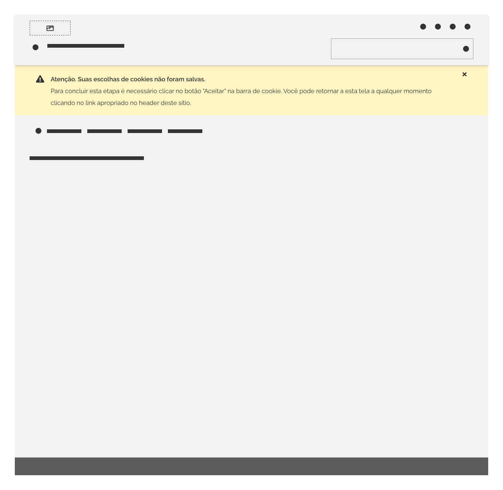
*Exemplo de mensagem global do sistema alertando ao usuário que um os cookies selecionados não foram salvos*

### 4. Mensagens

Caso o usuário desabilite um *cookie* essencial que comprometa a experiência de navegação, um aviso deve ser apresentado e desta forma o usuário poderá decidir se manterá a sua escolha.
Esta mensagem deve ser exibida logo abaixo do *checkbox* ou *switch* correspondente ao clique do usuário, de acordo com as imagens a seguir:

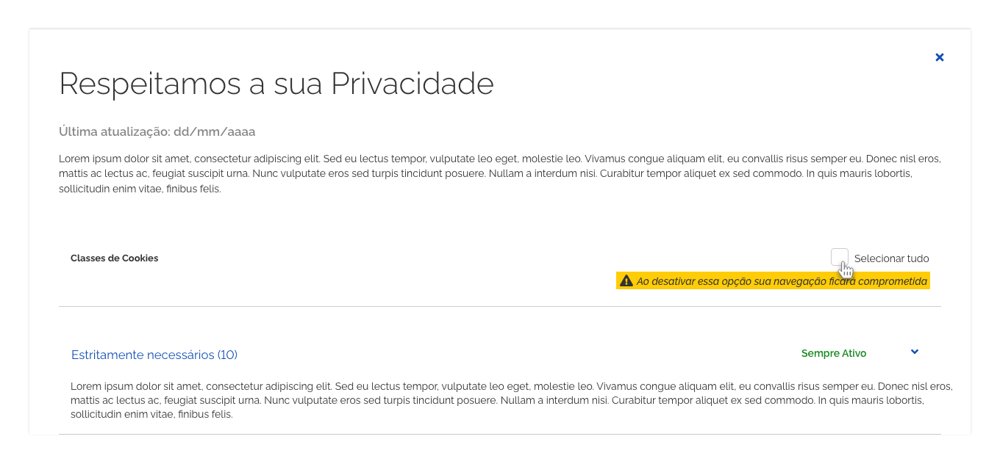
*Exemplo de mensagem alertando ao usuário que um cookie desabilitado é essencial para um bom funcionamento do serviço em nível global*

*Exemplo de mensagem alertando ao usuário que um cookie desabilitado é essencial para um bom funcionamento do serviço em nível da classe*

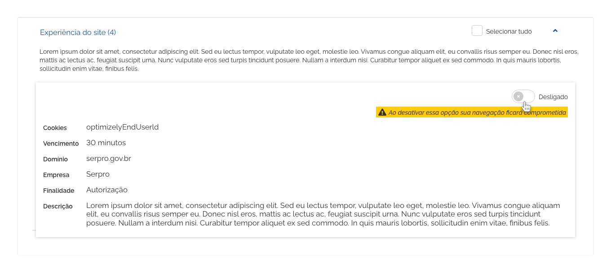
*Exemplo de mensagem do sistema alertando ao usuário que um cookie desabilitado é essencial para um bom funcionamento do serviço em nível do cookie*

**Atenção:** se o padrão adotado for o *opt in* o usuário apenas poderá visualizar as informações disponíveis mas não haverá componentes *checkboxes* e *switches* para que os *cookies* possam ser alterados. Lembre-se de deixar essa informação clara no texto da área de conteúdo introdutório.

### 5. Responsividade

Tudo o que é mencionado sobre o uso do *cookieBar* neste documento deve ser considerado para todas as resoluções. O componente *cookieBar* e todo o conteúdo devem se adaptar a qualquer resolução. A seguir, é ilustrado como exemplo os *layouts* deste componente na resolução de quatro colunas:

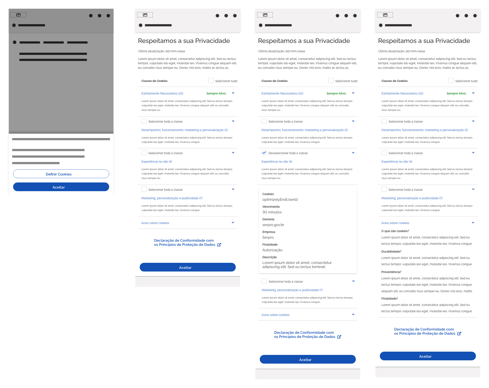
*Exemplo de aplicação do componente cookieBar em resolução de quatro colunas*

---

## Melhores Práticas

-   O *cookieBar* é **obrigatório** em todos os produtos do Governo que necessitem coletar/tratar dados dos usuários e garante o consentimento do usuário para o uso de *cookies* na sua experiência de navegação.

-   Prefira sempre que possível utilizar o padrão *opt out* que dá autonomia para o usuário decidir sobre a coleta/tratamento de seus dados. Somente utilize o padrão *opt in* em casos restritos.

-   O conteúdo do *cookieBar* é de responsabilidade de cada serviço. Esteja atento para abordar todos os aspectos legais e técnicos.

-   **Lembre-se:** o usuário poderá ter a navegação bloqueada ou autorizada mesmo que não aceite a política de *cookies* do *site*. Neste último caso, ele pode ter seus dados gravados mesmo assim além de ter um prejuízo na experiência de navegação. É muito importante que essa informação esteja escrita de forma muito clara no texto do *cookieBar default*.

-   É uma ótima ideia oferecer *links* para detalhamentos legais.

-   É interessante pensar na possibilidade de oferecer suporte para o usuário entrar em contato caso necessite tirar algum tipo de dúvida.

-   Caso haja uma alteração na política de *cookies* após o usuário já houver definido as suas escolhas, o *cookieBar* deverá ser apresentado novamente com o texto explicando o motivo da solicitação de nova ação por parte do usuário. Todo o procedimento é idêntico ao já explicado neste documento.

---

## Especificações

### Cores

| Name               | Property |          Token          |
| ------------------ | -------- | :---------------------: |
| Texto Sempre Ativo | color    | `--green-cool-vivid-50` |

### Alinhamento

| Name                                            |         Spacing Token         |
| ----------------------------------------------- | :---------------------------: |
| Botão primário e secundário (cookieBar default) | `--spacing-horizontal-right`  |
| Botão primário (cookieBar aberto)               | `--spacing-horizontal-right`  |
| Text (cookieBar default)                        |  `--spacing-horizontal-left`  |
| Conteúdo                                        | `--spacing-horizontal-center` |
| Botão terciário (Declaração de Conformidade)    | `--spacing-horizontal-center` |
| Switch (Header)                                 | `--spacing-horizontal-right`  |
| Mensagem                                        |  `--spacing-vertical-right`   |

### Espaçamento

| Name                                         | Property                   |      Token/Value       |
| -------------------------------------------- | -------------------------- | :--------------------: |
| Botão primário (cookie default)              | margin-right               |  `--spacing-scale-5x`  |
| Botão primário (cookie default)              | margin-down                |  `--spacing-scale-3x`  |
| Botão primário (cookie aberta)               | margin-right               |  `--spacing-scale-5x`  |
| Botão primário (cookie aberto)               | margin-top/down            | `--spacing-scale-2xh`  |
| Text (cookieBar default)                     | margin-top                 | `--spacing-scale-3xh`  |
| Conteúdo                                     | margin-left/right/top/down |  `--spacing-scale-5x`  |
| Botão terciário (Declaração de Conformidade) | margin-top/down            |  `--spacing-scale-5x`  |
| Switch (Header)                              | margin-top/down            |  `--spacing-scale-6x`  |
| Mensagem                                     | margin-top/down            | `--spacing-scale-base` |

### Tipografia

| Name                                        | Property    |        Token/Value         |
| ------------------------------------------- | ----------- | :------------------------: |
| Text (cookieBar default)                    | size        |  `––font-size-scale-base`  |
| Text (cookieBar default)                    | font-weight |  `--font-weight-regular`   |
| Text (cookieBar default)                    | line-height | `-–font-lineheight-medium` |
| Text título (cookBar aberto)                | size        | `--font-size-scale-up-06`  |
| Text título (cookieBar default)             | font-weight |  `--font-weight-regular`   |
| Text última atualização (cookBar aberto)    | size        | `--font-size-scale-up-01`  |
| Text última atualização (cookieBar default) | font-weight | `--font-weight-semi-bold`  |
| Text conteúdo (cookBar aberto)              | size        |  `--font-size-scale-base`  |
| Text conteúdo (cookieBar default)           | font-weight |  `--font-weight-regular`   |
| Text (Sempre ativo)                         | size        |  `––font-size-scale-base`  |
| Text (Sempre ativo)                         | font-weight | `--font-weight-semi-bold`  |
| Text (Sempre ativo)                         | color       |    `--color-highlight`     |
| Text col. esquerda (card)                   | size        |  `--font-size-scale-base`  |
| Text col. esquerda (card)                   | font-weight | `--font-weight-semi-bold`  |
| Text col. direita (card)                    | size        | `--font-size-scale-up-01`  |
| Text col. direita (card)                    | font-weight |  `--font-weight-regular`   |

### Sombra

|    Name    |          Shadow          |
| :--------: | :----------------------: |
| Superfície | `--surface-shadow-xl-up` |
