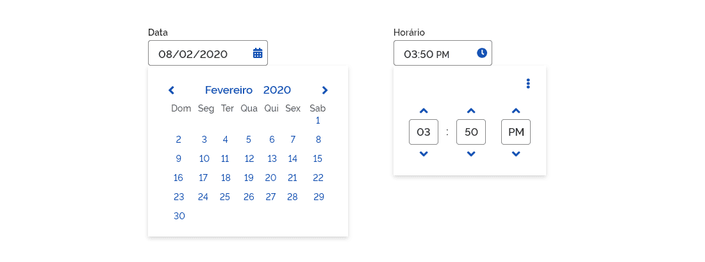
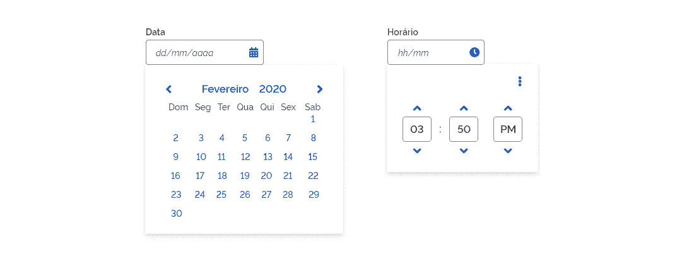
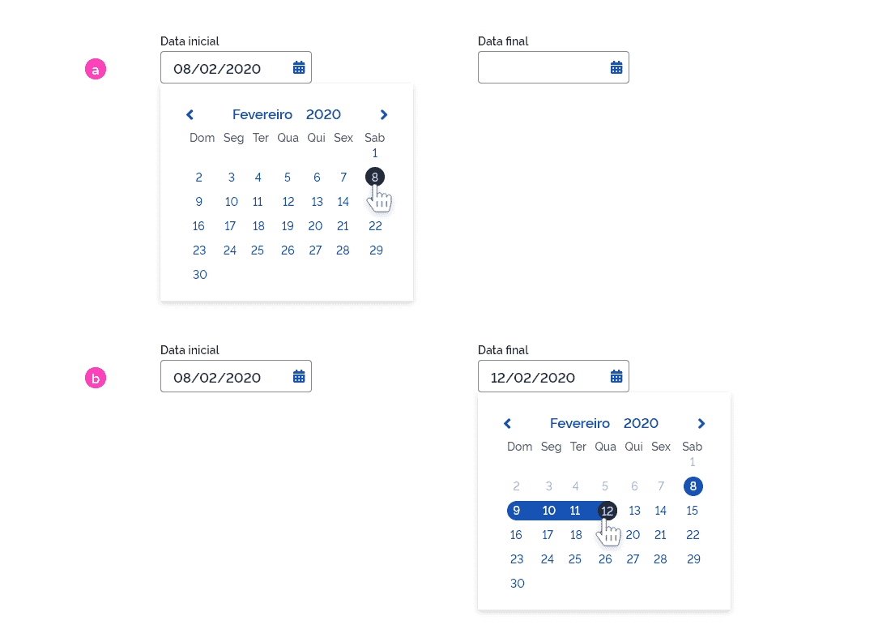
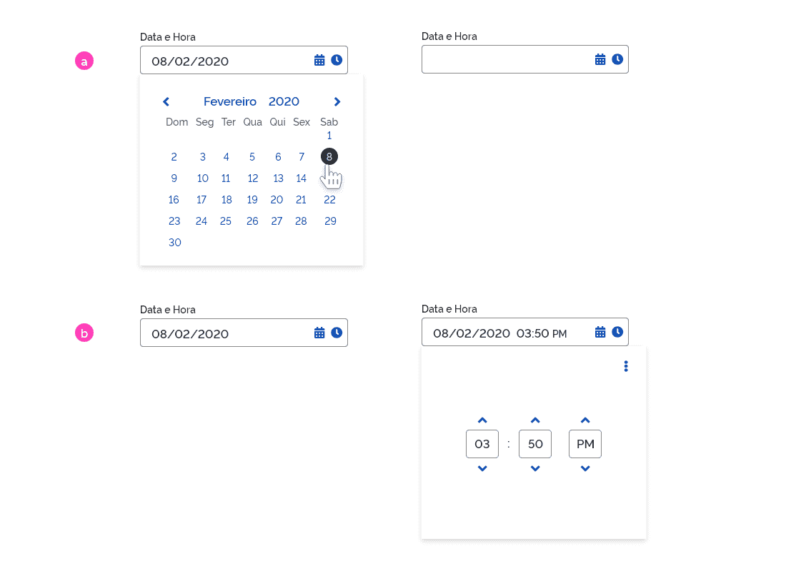
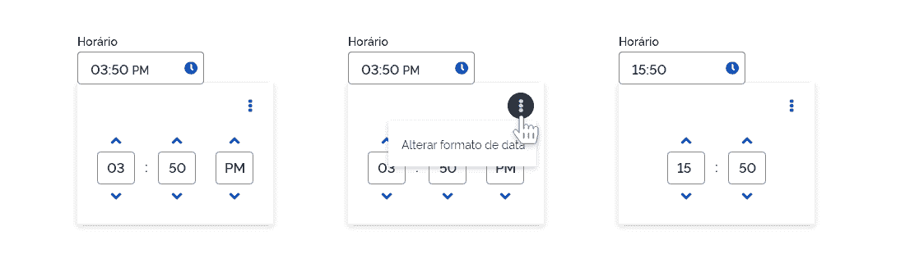

[version]: # '5.1.0'

Há também a variação do _Datepicker_ e _Timepicker_ para dispositivos com resoluções de quatro colunas (dispositivos móveis):

---

## Uso

O componente _Picker (Datepicker e Timepicker)_ funciona basicamente como seletores de datas e horas. De uma forma geral, o usuário pode selecionar datas e horas por meio do calendário e seletores disponibilizados ou simplesmente digitando diretamente no campo de entrada (_Input_). O calendário/seletor é disponibilizado para o usuário ao se clicar no campo de entrada e uma máscara no formato dd/mm/aaaa é mostrada dentro do campo input (ou hh/mm, em se tratando do _Timepicker_). Ao se clicar em qualquer área da tela fora do componente, o calendário é recolhido.

---

## Anatomia

Segue o detalhamento dos elementos encontrados nos componentes do tipo _Picker_:

1. Campo de entrada (_Input_);
2. Mês e ano atuais e ícones de navegação entre os meses;
3. Dias da semana do mês selecionado;
4. Dia atual em destaque;
5. Dia pressionado;
6. _Hover_
7. _Card_ que contém o componente;
8. Botão terciário que dá acesso a um menu contextual;
9. Seletor de horas;
10. Seletor de datas (na versão responsiva).

Nos casos em que o componente for utilizado em conjunto (Data inicial e Data final), as datas anteriores à data inicial escolhida ficam desabilitadas para o usuário e o intervalo de dias entre a data inicial e final ficam destacados, conforme a imagem abaixo:

1. Dias desabilitados;
2. Intervalo de dias em destaque.

---

## Tipos

Basicamente, existem quatro variações de _Pickers_: _Datepicker_ e _Timepicker_ e suas versões para resoluções de 4 colunas (dispositivos _mobile_):

### 1- _Datepicker_

**O _Datepicker_ é o tipo de _Picker_ sugerido para preencher valores de datas em um formulário.**

Ao clicar no campo _Input_, um calendário é apresentado. O usuário poderá digitar a data diretamente no campo ou selecionar no calendário. O usuário poderá ainda navegar entre os meses (o calendário _default_ será sempre o do mês atual). Uma vez selecionada a data, o campo é preenchido e o _card_ ocultado. Para acessar novamente o calendário, basta clicar no campo _Input_. A qualquer momento em que o usuário clicar em qualquer área da tela fora do calendário, o mesmo será ocultado.
O _Datepicker_ sempre exibirá a data atual em detaque (laranja) para facilitar o usuário a se localizar no calendário.

### 2- _Datepicker_ (Responsive)

Para versões mobile ou resoluções de 4 colunas, recomendamos a utilização desta versão do componente _Datepicker_. Nela o usuário poderá selecionar a data desejada deslizando para cima ou para baixo cada uma das três colunas (dia, mês e ano). A data selecionada fica destacada em azul no centro do componente. Caso deseje, o usuário também poderá preencher a data digitando pelo teclado do dispositivo. Ao se clicar fora da área de seleção, o componente é fechado e o foco segue para o item seguinte do formulário.

### 3- _Timepicker_

O _Timepicker_ segue a mesma lógica do _Datepicker_, porém apresenta um seletor de horas no lugar de um calendário.
É possível optar por apresentar os dois formatos internacionais de horário: formato 24h e formato AM/PM. Caso a escolha seja pelos dois formatos, é necessário incluir um menu suspenso (componente lista) com as opções de troca de formato. Este comportamento será melhor detalhado mais adiante. É necessário a indicação do formato de hora que virá como _default_. O horário _default_ indicado nos campos deve ser: 00:00.
Como nos componentes descritos anteriormente, ao se clicar fora da área de seleção a janela será automaticamente fechada.

### 4- _Timepicker_ (Resposive)

O _Timepicker_ responsivo é a variação do _Timepicker_ descrito anteriormente para versões mobile ou em resoluções de quatro colunas. A lógica é a mesma do _Datepicker_ responsivo e o usuário poderá selecionar a hora desejada deslizando cada uma das três colunas (hora, minuto e AM/PM) para cima ou para baixo. O horário desejado fica destacado em azul. Nesta versão, não há a possibilidade de o usuário trocar o formato de hora. Novamente, ao se clicar fora do componente, o _card_ é fechado e o foco segue para o item seguinte.

---

### Comportamento dos Tipos

Para facilitar o entendimento, é exemplificado alguns comportamentos mais usuais:

1. Com a utilização do _Datepicker_, pode-se criar um formulário de entrada conjunta de data inicial e data final. Uma vez selecionadas as datas inicial e final, o intervalo de dias entre as datas selecionadas fica destacado em azul (no exemplo abaixo, o intervalo entre os dias 8 e 12 de fevereiro).

a. Data inicial escolhida no primeiro campo de _input_.
b. Após a escolha da data inicial, o calendário é recolhido e automaticamente aberto o calendário para escolha da data final.

**Atenção:** Note que no calendário de data final os dias anteriores à data inicial escolhida estarão desabilitados, não permitindo que o usuário selecione uma data inválida por descuido.

**Atenção:** Sempre que desejar o usuário pode clicar nos ícones para alterar as datas escolhidas.

2. É possível utilizar os componentes _Datepicker_ e _Timepicker_ em conjunto, em uma espécie de _combo_. Quando isto for necessário, o componente poderá ser apresentado conforme a figura abaixo e sempre na ordem data-horário. Observe que o comportamento de cada um dos _Pickers_ é exatamente o mesmo de quando utilizado individualmente.

a. Primeiramente é escolhida a data no primeiro _input_.

b. Uma veze escolhida a data, o calendário é recolhido e o seletor de horas é automaticamente apresentado ao usuário.

**Atenção:** Sempre que desejar o usuário pode clicar nos ícones para alterar a data ou horário escolhidos.

3- Neste exemplo, é ilustrado o comportamento da troca de formato de horas no componente _Timepicker_. Ao clicar no botão terciário Expandir (recurso opcional), a opção de troca de formato é apresentada por meio de um menu contextual com o componente lista. Não há uma recomendação para o formato _default_ ficando a decisão a critério do desenvolvedor.

---

## Design Tokens

### Tipografia

| Name                         | Token Size                | Token Weight              |
| ---------------------------- | ------------------------- | ------------------------- |
| Mês/Ano                      | `--font-size-scale-up-01` | `--font-weight-semi-bold` |
| Dias da Semana               | `--font-size-scale-base`  | `--font-weight-medium`    |
| Dias                         | `--font-size-scale-base`  | `--font-weight-medium`    |
| Dia Atual                    | `--font-size-scale-base`  | `--font-weight-medium`    |
| Intervalo Dias (Selected)    | `--font-size-scale-base`  | `--font-weight-medium`    |
| Seletor (Data/Hora)          | `--font-size-scale-up-01` | `--font-weight-semi-bold` |
| Seletor (Data/Hora Selected) | `--font-size-scale-up-01` | `--font-weight-semi-bold` |

### Cor

| Name                             | Property | Token Color               |
| -------------------------------- | -------- | ------------------------- |
| Texto Mês/Ano                    | color    | `--color-primary-default` |
| Texto Dias da Semana             | color    | `--color-secondary-07`    |
| Texto Dias                       | color    | `--font-size-scale-base`  |
| Intervalo Dias Selected          | color    | `--color-secondary-09`    |
| Seletor (Data/Hora)              | color    | `--color-secondary-08`    |
| Seletor (Data/Hora Selected)     | color    | `--color-primary-default` |
| Ícone "Selecionar Data"          | color    | `--color-primary-default` |
| Ícone "Marcar Hora"              | color    | `--color-primary-default` |
| Botão terciário "Acessar Opções" | color    | `--color-primary-default` |
| Botão terciário "Voltar"         | color    | `--color-primary-default` |
| Botão terciário "Avançar"        | color    | `--color-primary-default` |
| Botão terciário "Retrair"        | color    | `--color-primary-default` |
| Botão terciário "Expandir"       | color    | `--color-primary-default` |

### Iconografia

| Name            | Ícone                           | Token Size          | Class (Font Awesome) |
| --------------- | ------------------------------- | ------------------- | -------------------- |
| Selecionar Data | <i class="fas fa-calendar"></i> | `--icone-size-base` | fa-calendar-alt      |
| Marcar Hora     | <i class="fas fa-clock"></i>    | `--icone-size-base` | fa-clock             |

### Botões Terciários

| Name           | Ícone                              | Token Size          | Class (Font Awesome) |
| -------------- | ---------------------------------- | ------------------- | -------------------- |
| Acessar Opções | <i class="fas fa-ellipsis-v"></i>  | `--icone-size-base` | fa-ellipsis-v        |
| Voltar         | <i class="fas fa-angle-left"></i>  | `--icon-size-lg`    | fa-angle-left        |
| Avançar        | <i class="fas fa-angle-right"></i> | `---icon-size-lg`   | fa-angle-right       |
| Retrair        | <i class="fas fa-angle-up"></i>    | `---icon-size-lg`   | fa-angle-up          |
| Expandir       | <i class="fas fa-angle-down"></i>  | `---icon-size-lg`   | fa-angle-down        |

### Estado

| Name                  | Estado      | Token Status                  |
| --------------------- | ----------- | ----------------------------- |
| Dias (Conteiner)      | Hover       | `--status-hover-background`   | - |
| Dia atual (Text)      | Destacado   | `--status-highlight-text`     | - |
| Dia atual (Conteiner) | Destacado   | `--status-highlight-overlay`  |
| Dia atual (Text)      | Pressionado | `--status-pressed-text`       | - |
| Dia atual (Conteiner) | Pressionado | `--status-pressed-background` |
| Dias intervalo (Text) | \*\*\*      | `---color-secondary-01`       | - |
| Dias intervalo (Text) | \*\*\*      | `--color-primary-default`     | - |

\*\*\* Ainda não temos este estado!

### Dimensão

| Name                  | Property | Dimension |
| --------------------- | -------- | --------- |
| _Card_ (_Datepicker_) | width    | 288px     |
| _Card_ (_Datepicker_) | height   | auto      |
| _Card_ (_Timepicker_) | width    | 256px     |
| _Card_ (_Timepicker_) | height   | 180px     |
| _Card_ (Responsive)   | width    | 256px     |
| _Card_ (Responsive)   | height   | 196px     |

### Espaçamento

| Name                             | Property       | Spacing |
| -------------------------------- | -------------- | ------- |
| Dias (Text)                      | padding-width  | 24px    |
| Dias (Text)                      | padding-height | 24px    |
| Dias (Text)                      | padding-top    | 12px    |
| Dias (Text)                      | padding-bottom | 20px    |
| Seletor (Responsive)             | padding-width  | 24px    |
| Seletor (Responsive)             | padding-height | 12px    |
| Seletor (Responsive)             | padding-top    | 12px    |
| Seletor (Responsive)             | padding-bottom | 20px    |
| Botão terciário "Acessar Opções" | padding-top    | 16px    |
| Botão terciário "Acessar Opções" | padding-right  | 16px    |
