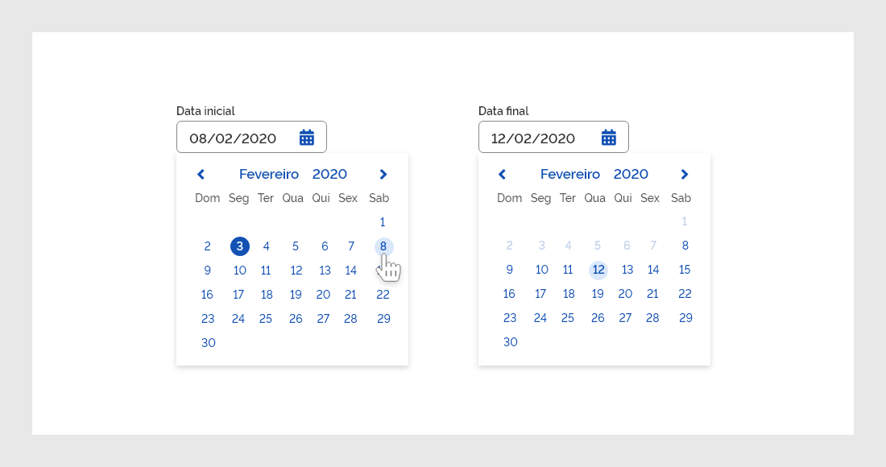
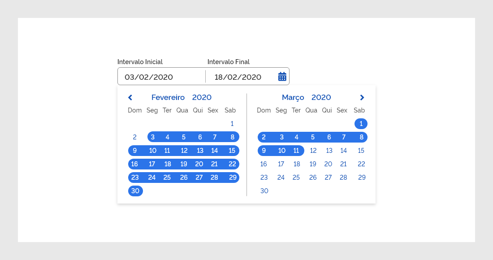
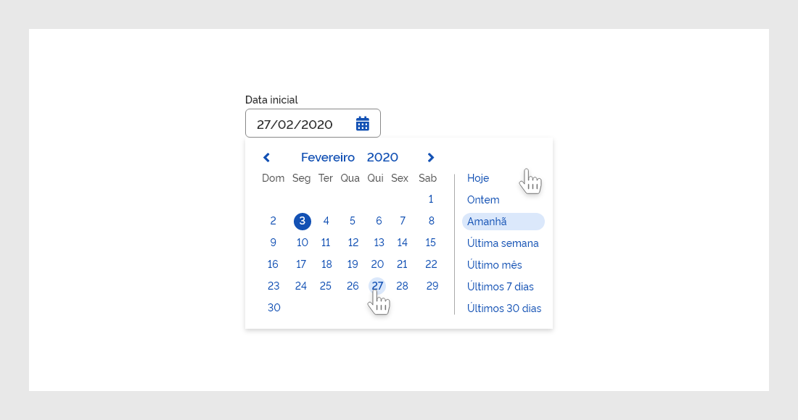
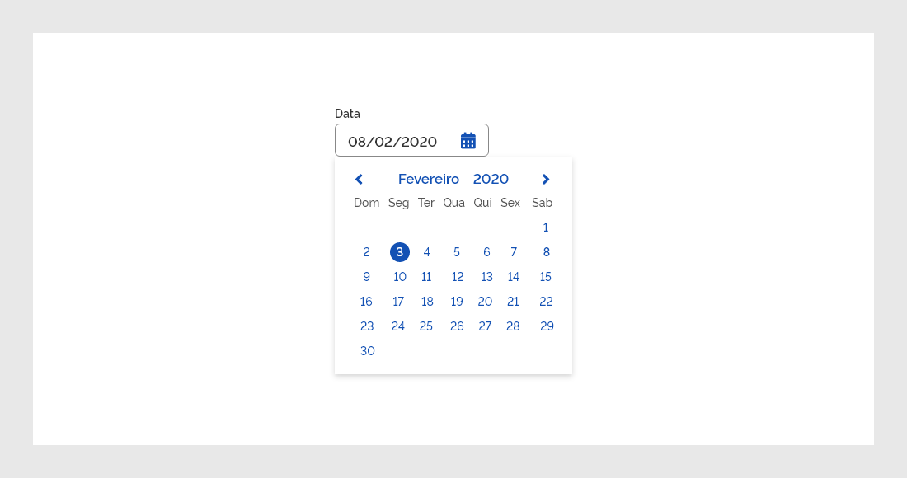
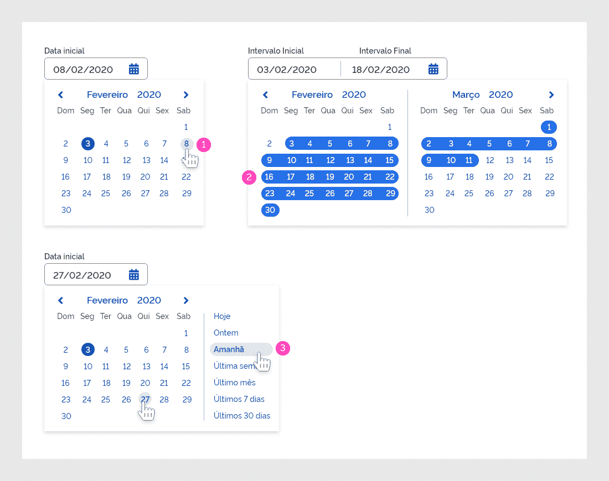
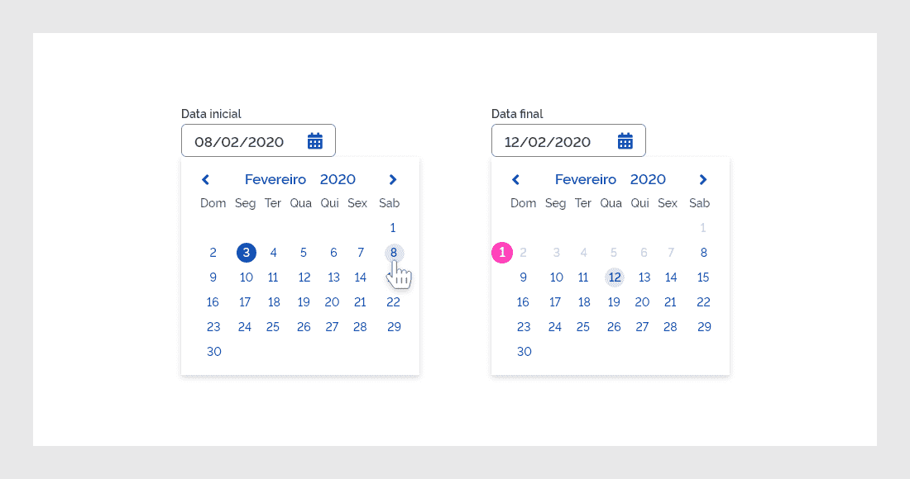
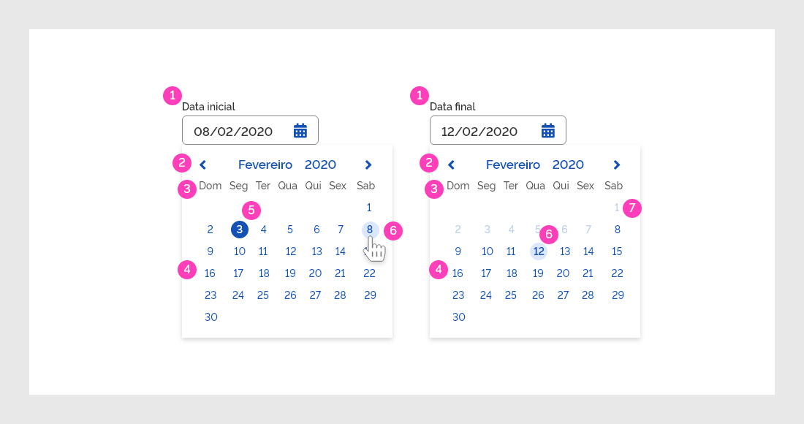
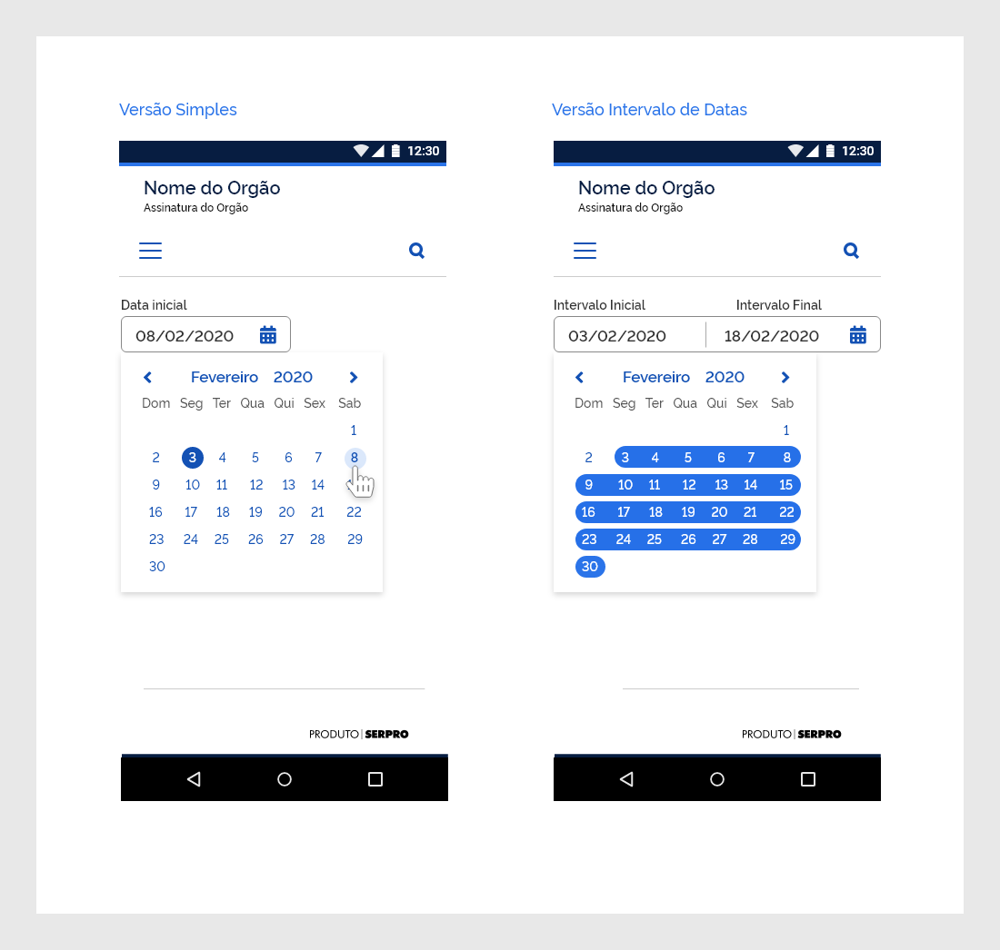
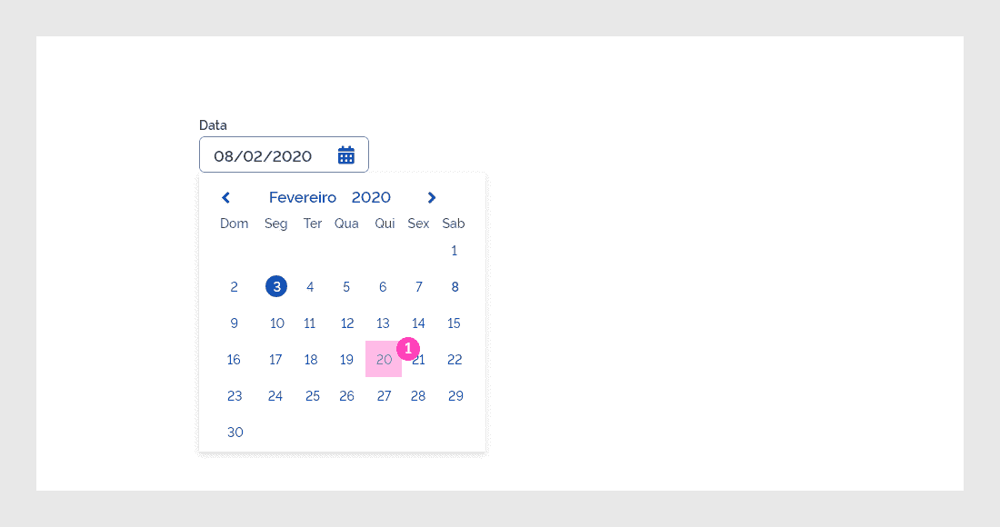
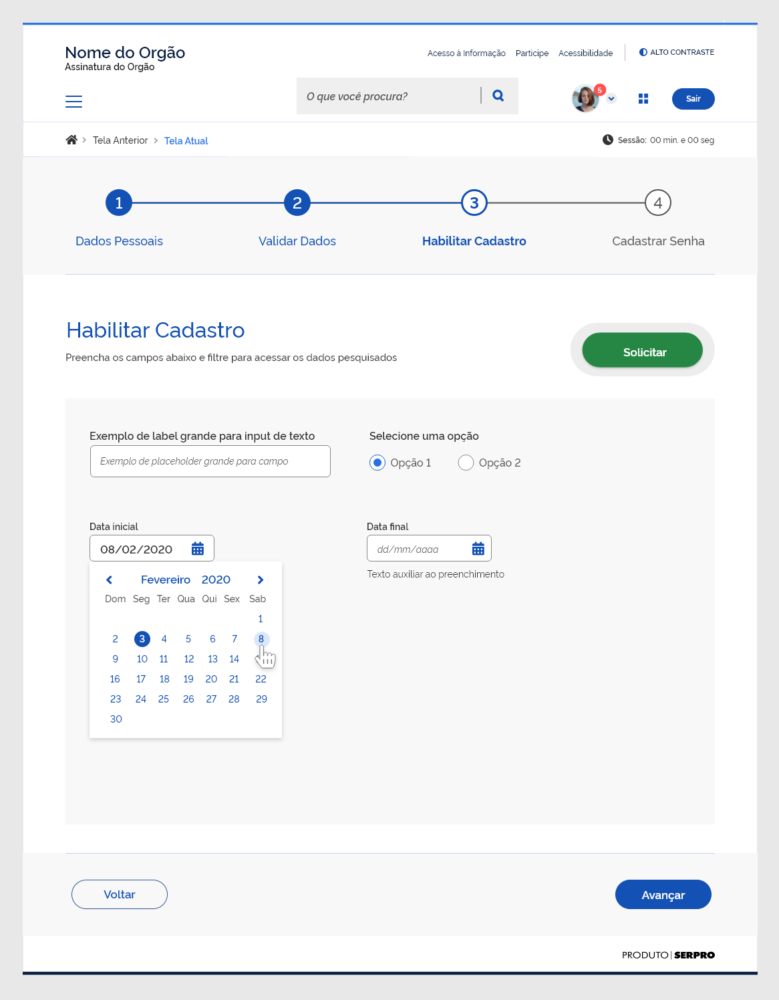

## Versão Simples

A versão simples consiste basicamente em um campo input para inserção da data de forma manual ou por meio de um calendário que será disponibilizado ao usuário por meio de clique no ícone calendário.

## Versão com Data Inicial e Data Final

Na versão Data Inicial / Data Final o usuário deve preencher os dois campos concomitantemente. No calendário de data final, os dias anteriores à data inicial selecionada ficam desabilitados. Este é um recurso de prevenção de erro e consta nas heurísticas de Nielsen.

## Versão com Intervalo de Data

Na versão Intervalo de Data o usuário seleciona a data inicial e ao movimentar o ponteiro do mouse o calendário vai selecionando os dias subsequentes até que o usuário clique na data final. Desta forma, uma sequência de datas É selecionada.

## Versão Sugestão de Data Usuais

Na versão Sugestão de Datas Usuais o usuário recebe alguns atalhos para as datas mais comuns. Ao clicar em alguns desses atalhos o input já é preenchido automaticamente. Estas datas mais comuns podem ser sugeridas pelo uso do usuário ou fixas no componente

# Estados

## Estado Normal

No estado Normal os elementos seguem as especificações padrão.

## Estado Hover

No estado Hover os elementos seguem as seguintes especificações:

1 |
Background: #DBE8FB
Texto: #1351B4
Peso da Fonte: Semibold

2 |
Background: #2670E8
Texto: #FFFFFF
Peso da Fonte: Medium

3 |
Background: #DBE8FB
Texto: #1351B4
Peso da Fonte: Semibold

## Estado Focus

O estado Focus dos campos input do Datepicker seguem as mesmas especificações do campo input.

## Estado Disable

No estado Disable as datas do campo Data final não podem ser anteriores à data selecionada no campo Data inicial e por isso são apresentadas desabilitadas a fim de evitar erro do usuário. Os dias desabilitados seguem as seguintes especificações:

1 |
Texto: #C5D4EB
Peso da Fonte: Medium

---

# Estrutura

#### 1 | Campo de Inserção de Datas

Campo de input para inserção da data de forma manual ou por meio da funcionalidade de calendário, acionada por meio de click no ícone calendário.

#### 2 | Mês e Ano Atuais

O calendário apresenta o mês e ano atuais e setas para navegação entre os meses de forma linear.

#### 3 | Dias da Semana

O Calendário deve apresentar os dias da semana referentes ao mês selecionado.

#### 4 | Dia do Mês

O Calendário deve apresentar os dias do mês selecionado.

#### 5 | Dia Atual

O dia atual destacado.

#### 6 | Hover

O efeito hover é apresentado ao passar o ponteiro do mouse sobre as datas do calendário.

#### 7 | Dias Desabilitados

Os dias desabilitado é apresentados em tonalidade mais clara.

---

## Versão Mobile e Responsividade

Nos dispositivos móveis, o Datepicker segue uma formatação mais resumida, visando otimizar a adequação nos espaços reduzidos. Assim como na versão web, o Wizard mobile também possui duas formas de diagramação: a horizontal e a vertical, como demonstrado no modelo abaixo:

Na versão mobile, não será permitido utilizar a versão Sugestão de Datas Usuais.

## Comportamento

O comportamento do Datepicker em dispositivos mobile segue as mesmas definições do desktop. A exceção é a versão Sugestão de Datas Usuais, que não tem previsão de uso para esta resolução.

### Área de Click em Touch

1 |
Área de toque (40x40)px

## Exemplos de Telas

Abaixo pode-se observar alguns exemplos do Datepicker nas versões web e mobile.

### Exemplo de Template Web:

### Exemplo de Template Mobile:

