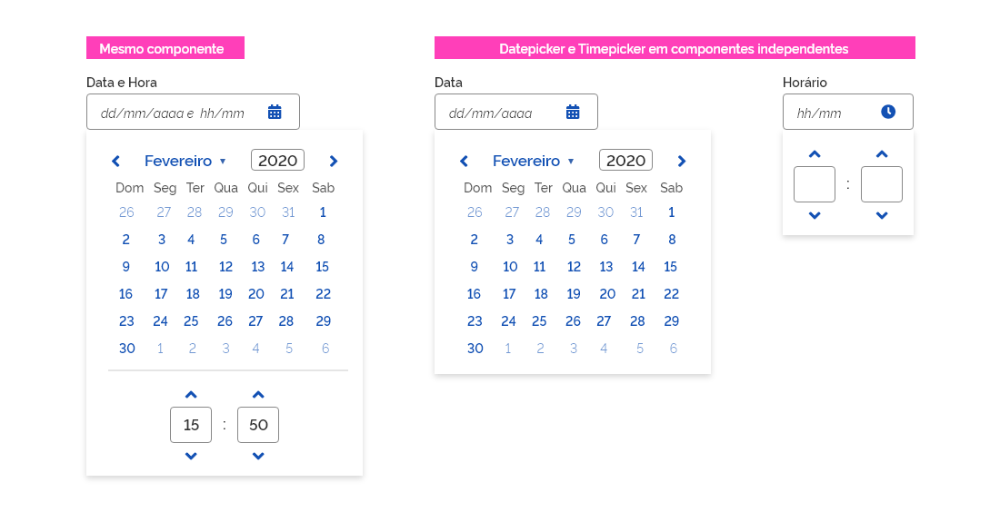
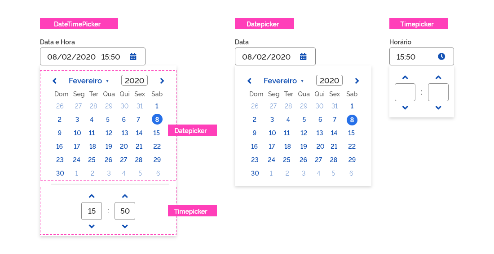
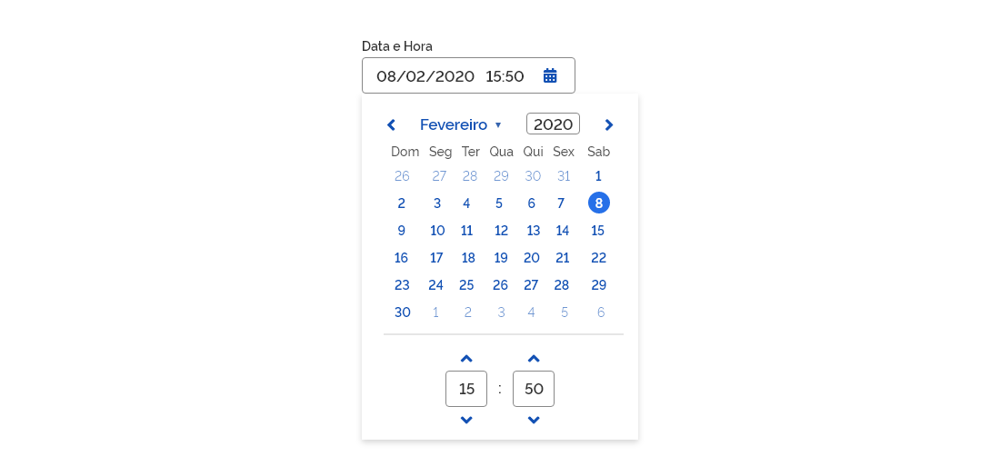
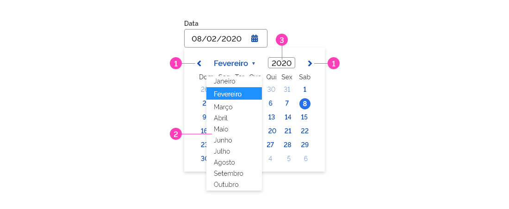
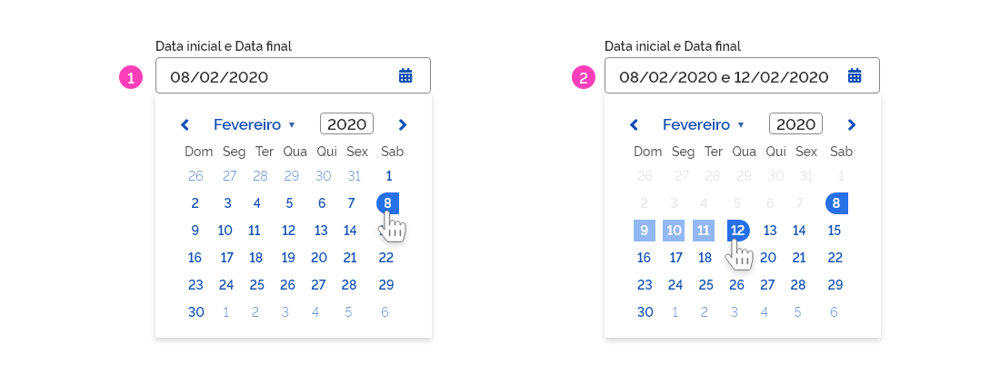
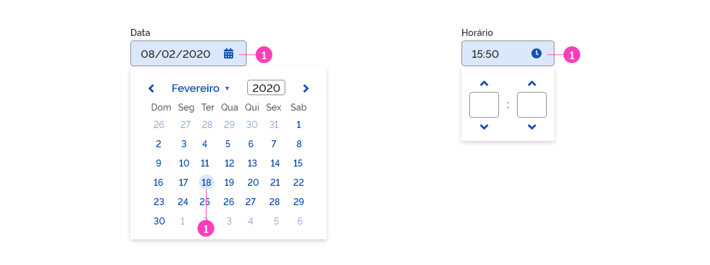
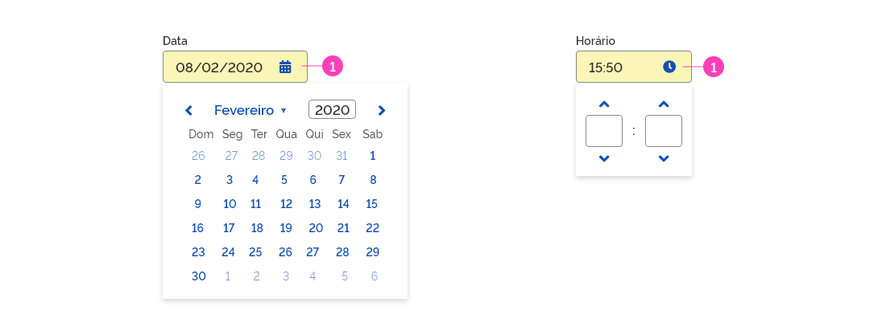
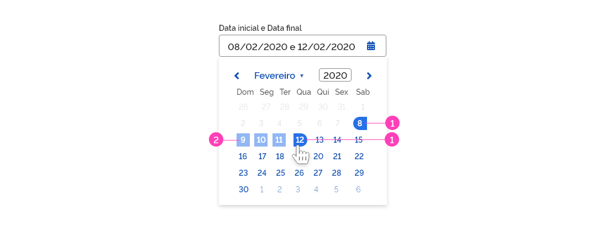
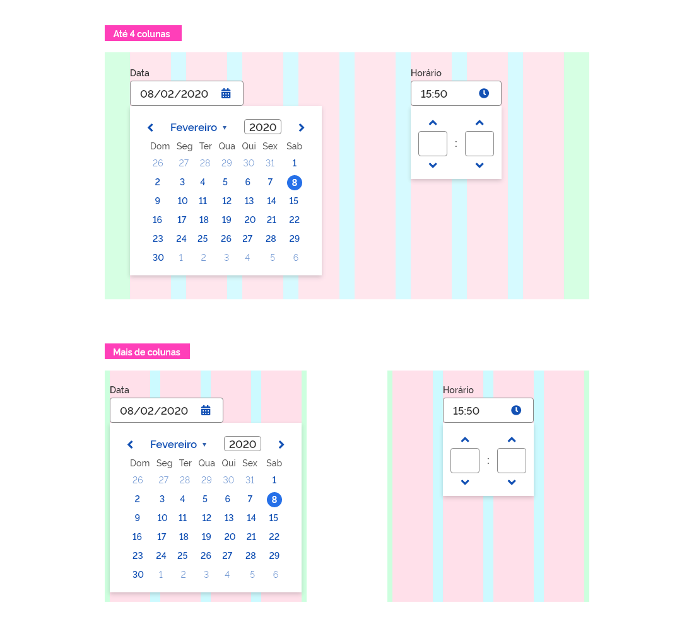

[version]: # '6.0.0'

---

## Uso

O componente _DateTimePicker_ funciona basicamente como seletores de datas e horas. De uma forma geral, o usuário pode selecionar datas e horas por meio do calendário e seletores disponibilizados ou simplesmente digitando diretamente no campo de entrada (_Input_) conforme a máscara sugere. O calendário e o seletor de horas podem ocorrer juntos, ou seja, em um mesmo componente ou em componentes independentes.

### Tom de Voz

Prefira sempre utlizar os nomes dos meses e dias emno idioma português.
O nome do mês deve ser escrito por inteiro e os dias da semana abreviados (com três dígitos).
Por padrão defina domingo como primeiro dia da semana.

---

## Anatomia

O componente _DateTimePicker_ é dividido em duas partes: _datepicker_ e _timepicker_ e podem ser utilizados em conjunto ou de forma independente:

1. Campo de entrada (_Input_);
2. Mês e ano atuais e ícones de navegação entre os meses;
3. Dias da semana;
4. Dia atual em destaque (opcional);
5. Dia selecionado;
6. _Hover_
7. _Card_ que contém o componente;
8. Seletor de horas;
9. Dias (mês anterior/posterior).

10. Datas inicial e final selecionadas;
11. Intervalo de dias em destaque;
12. Dias desabilitados.

---

## Tipos

Basicamente existem três variações do componente: _DateTimePicker_ (padrão), _Datepicker_ e _Timepicker_:

### 1- _DateTimePicker_

O _DateTimePicker_ é o componente padrão para escolha conjunta de data e horário.

### 2- _Datepicker_

O componente _datepicker_ está disponível de maneira independente, isto é, um componente apenas para o calendário. O funcionamento é o mesmo já descrito anteriormente porém, ao usuário é permitido selecionar somente datas.

### 3- _Timepicker_

O componente _timepicker_ também está disponível de maneira independente, isto é, um componente apenas para o seletor de horas. O funcionamento é o mesmo já descrito anteriormente porém, ao usuário é permitido selecionar somente horários.

**Atenção:** O horário _default_ indicado nos campos deve ser: 00:00. Por enquanto, o componente oferece apenas o formato 24 horas como opção de uso.

---

### Comportamento dos Tipos

O componente _DateTimePicker_ (e suas variações independentes) funcionam sempre da mesma maneira.

Ao clicar no campo _Input_, um calendário e/ou seletor de horas são apresentados. Uma vez selecionadas data e/ou a hora, o campo _input_ é preenchido e o _card_ ocultado. Para acessar novamente o calendário, basta clicar no campo _Input_.
A qualquer momento em que o usuário clicar em qualquer área da tela fora do _card_, o mesmo será ocultado.
O _DateTimePicker_ sempre exibirá a data atual em destaque (laranja) para facilitar o usuário se localizar no calendário.

#### Navegação entre as datas

O usuário pode navegar linearmente pelo calendário por meio das setas de navegação. Também é possível selecionar o mês desejado por meio de um combo _select_ (nativo do componente) e o ano por meio de digitação no campo _input_ apropriado.

1. Setas de navegação linear;
2. Combo _select_ para escolha do mês;
3. Combo _input_ para escolha do ano.

#### Intervalo de datas

É possível utilizar _datepicker_, para criar uma entrada conjunta de data inicial e data final. Uma vez selecionadas as datas inicial e final, o intervalo de dias entre as datas selecionadas fica destacado em azul (no exemplo abaixo, o intervalo entre os dias 8 e 12 de fevereiro) está destacado.

1. Data inicial selecionada;
2. Data final selecionada e destacado todos os dias compreendidos neste intervalo.

**Atenção:** note que os dias anteriores à data inicial escolhida ficam desabilitados, não permitindo que o usuário selecione por descuido uma data inválida.

#### Estados

Alguns estados podem ser encontrados nos elementos do datepicker e do _timepicker_. A seguir, é ilustrado cada um deles.

**Atenção:** A fim de facilitar o entendimento, os componentes estão ilustrados de forma independente porém todos os estados apresentados ocorrem também no componente padrão _DateTimePicker_.

##### 1. _Hover_

O estado _hover_ ocorre nos campos _input_ e nos dias do calendário.

1. Estado _hover_.

##### 2. Selecionado

O estado selecionado ocorre basicamente nos dias selecionados pelo usuário, tanto em um calendário simples quanto em um calendário de intervalo de datas.

1. Estado selecionado.

##### 3. Foco

O estado foco ocorre somente nos campos _input_.

1. Estado foco.

##### 4. Destacado

O estado destacado ocorre unicamente para marcar o dia atual e independe de qualquer ação do usuário.

1. Estado destacado.

##### 5. Desabilitado

O estado desabilitado ocorre nas datas que por qualquer motivo não podem ser selecionadas. Geralmente é utilizado para desabilitar as datas anteriores à data inicialmente escolhida.

1. Estado desabilitado.

##### 6. Intervalo

O estado intervalo ocorre apenas nos calendário em que é permitida a seleção de duas datas (data inicial e final) e tem por finalidade destacar os dias compreendidos nesse intervalo.

1. Data inicial e final selecionada;
2. Intervalo de dias entre a data inicial e final.

#### Responsividade

O componente _DateTimePicker_ for projetado para ser utilizado em qualquer resolução de tela até 4 colunas de acordo com a imagem a seguir:

---

## Design Tokens

### Tipografia

| Name                         | Token Size                | Token Weight              |
| ---------------------------- | ------------------------- | ------------------------- |
| Mês/Ano                      | `--font-size-scale-up-01` | `--font-weight-semi-bold` |
| Dias da Semana               | `--font-size-scale-base`  | `--font-weight-medium`    |
| Dias                         | `--font-size-scale-base`  | `--font-weight-semi-bold` |
| Dia Atual                    | `--font-size-scale-base`  | `--font-weight-semi-bold` |
| Dia Mês anterior/posterior   | `--font-size-scale-base`  | `--font-weight-regular`   |
| Dia Desabilitados            | `--font-size-scale-base`  | `--font-weight-regular`   |
| Intervalo Dias (Selected)    | `--font-size-scale-base`  | `--font-weight-semi-bold` |
| Seletor (Data/Hora)          | `--font-size-scale-up-01` | `--font-weight-semi-bold` |
| Seletor (Data/Hora Selected) | `--font-size-scale-up-01` | `--font-weight-semi-bold` |

### Cor

| Name                              | Property | Token Color               | Opacity |
| --------------------------------- | -------- | ------------------------- | ------- |
| Texto Mês/Ano                     | color    | `--color-primary-default` | -       |
| Texto Dias da Semana              | color    | `--color-secondary-07`    | -       |
| Texto Dias                        | color    | `--color-primary-default` | -       |
| Texto Dias Mês anterior/posterior | color    | `--color-primary-default` | 60%     |
| Texto Dias Desabilitados          | color    | `--color-secondary-04`    | 45%     |
| Intervalo (dias selecionados)     | color    | `--color-secondary-09`    | -       |
| Seletor (Data/Hora)               | color    | `--color-secondary-08`    | -       |
| Seletor (Data/Hora Selected)      | color    | `--color-primary-default` | -       |
| Ícone "Selecionar Data"           | color    | `--color-primary-default` | -       |
| Ícone "Marcar Hora"               | color    | `--color-primary-default` | -       |
| Botão terciário "Voltar"          | color    | `--color-primary-default` | -       |
| Botão terciário "Avançar"         | color    | `--color-primary-default` | -       |
| Botão terciário "Retrair"         | color    | `--color-primary-default` | -       |
| Botão terciário "Expandir"        | color    | `--color-primary-default` | -       |

### Iconografia

| Name            | Ícone                           | Token Size          | Class (Font Awesome) |
| --------------- | ------------------------------- | ------------------- | -------------------- |
| Selecionar Data | <i class="fas fa-calendar"></i> | `--icone-size-base` | fa-calendar-alt      |
| Marcar Hora     | <i class="fas fa-clock"></i>    | `--icone-size-base` | fa-clock             |

### Botões Terciários

| Name    | Ícone                              | Token Size        | Class (Font Awesome) |
| ------- | ---------------------------------- | ----------------- | -------------------- |
| Voltar  | <i class="fas fa-angle-left"></i>  | `--icon-size-lg`  | fa-angle-left        |
| Avançar | <i class="fas fa-angle-right"></i> | `---icon-size-lg` | fa-angle-right       |
| Retrair | <i class="fas fa-angle-up"></i>    | `---icon-size-lg` | fa-angle-up          |

### Estado

| Name                  | Estado      | Token Status                   | Transparência |
| --------------------- | ----------- | ------------------------------ | ------------- |
| Dias (Conteiner)      | Hover       | `--status-hover-background`    | -             |
| Dia atual (Text)      | Destacado   | `--status-highlight-text`      | -             |
| Dia atual (Conteiner) | Destacado   | `--status-highlight-overlay`   | -             |
| Dia atual (Text)      | Selecionado | `--status-selected-text`       | -             |
| Dia atual (Conteiner) | Selecionado | `--status-selected-background` | -             |
| Dias intervalo (Text) | \*\*\*      | `--status-selected-text`       | 50%           |

### Dimensão

| Name                      | Property | Dimension |
| ------------------------- | -------- | --------- |
| _Card_ (_DateTimePicker_) | width    | 304px     |
| _Card_ (_DateTimePicker_) | height   | auto      |
| _Card_ (_Datepicker_)     | width    | 304px     |
| _Card_ (_Datepicker_)     | height   | auto      |
| _Card_ (_Timepicker_)     | width    | 144px     |
| _Card_ (_Timepicker_)     | height   | 116px     |

### Espaçamento

| Name                          | Property | Token Spacing                 |
| ----------------------------- | -------- | ----------------------------- |
| Calendário (_DateTimePicker_) | width    | `--spacing-scale-2xh`         |
| Calendário (_DateTimePicker_) | height   | `--spacing-scale-2xh`         |
| Seletor (_DateTimePicker_)    | width    | `--spacing-horizontal-center` |
| Seletor (_DateTimePicker_)    | height   | `--spacing-scale-baseh`       |
| Calendário (_Datepicker_)     | width    | `--spacing-scale-2xh`         |
| Calendário (_Datepicker_)     | height   | `--spacing-scale-2xh`         |
| Seletor (_TimePicker_)        | width    | `--spacing-scale-baseh`       |
| Seletor (_TimePicker_)        | height   | `--spacing-scale-baseh`       |
