[version]: # (6.0.9)

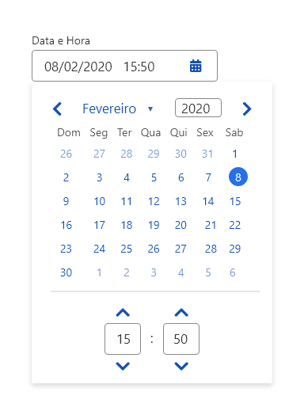
*Exemplo do componente DateTimePicker*

---

## Tom e Voz

Prefira sempre utilizar os nomes dos meses e dias no idioma português (pt-br).
O nome do mês deve ser escrito por inteiro e os dias da semana abreviados (com três dígitos).
Por padrão defina domingo como primeiro dia da semana.

---

## Anatomia

O componente *DateTimePicker* é dividido em duas partes: *datepicker* e *timepicker* e podem ser utilizados em conjunto ou de forma independente.

| ID  | Nome                                                  |                               Referência                                | Uso         |
| --- | ----------------------------------------------------- | :---------------------------------------------------------------------: | ----------- |
| 1   | Campo de entrada (*Input*)                            | [Componente Input](https://www.gov.br/ds/components/input?tab=designer) | Obrigatório |
| 2   | Mês e ano atuais e ícones de navegação entre os meses |                                   ---                                   | Obrigatório |
| 3   | Dias da semana                                        |                                   ---                                   | Obrigatório |
| 4   | Dia atual em destaque                                 |                                   ---                                   | Opcional    |
| 5   | Dia selecionado                                       | [Fundamento Estados](https://www.gov.br/ds/fundamentos-visuais/estados) | Obrigatório |
| 6   | *Hover*                                               | [Fundamento Estados](https://www.gov.br/ds/fundamentos-visuais/estados) | Obrigatório |
| 7   | *Card* que contém o componente                        |  [Componente Card](https://www.gov.br/ds/components/card?tab=designer)  | Obrigatório |
| 8   | Seletor de horas                                      |                                   ---                                   | Obrigatório |
| 9   | Dias (mês anterior/posterior)                         |                                   ---                                   | Obrigatório |
| 10  | Datas inicial e final selecionadas                    |                                   ---                                   | Obrigatório |
| 11  | Intervalo de dias em destaque                         |                                   ---                                   | Obrigatório |
| 12  | Dias desabilitados                                    |                                   ---                                   | Obrigatório |

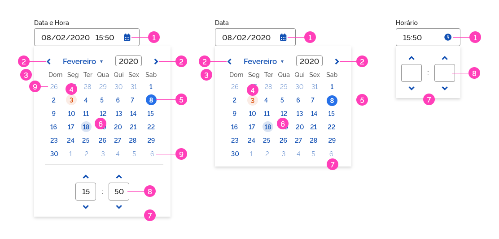
*Anatomia do componente DateTimePicker*

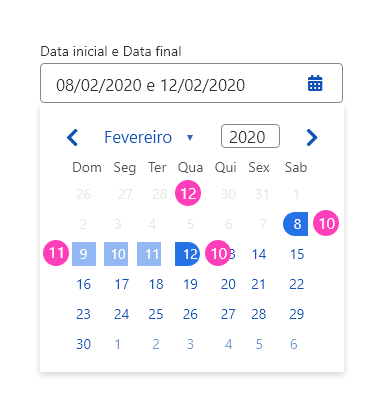
*Anatomia do calendário*

---

## Tipos

Basicamente existem três variações do componente: *DateTimePicker* (padrão), *Datepicker* e *Timepicker*:

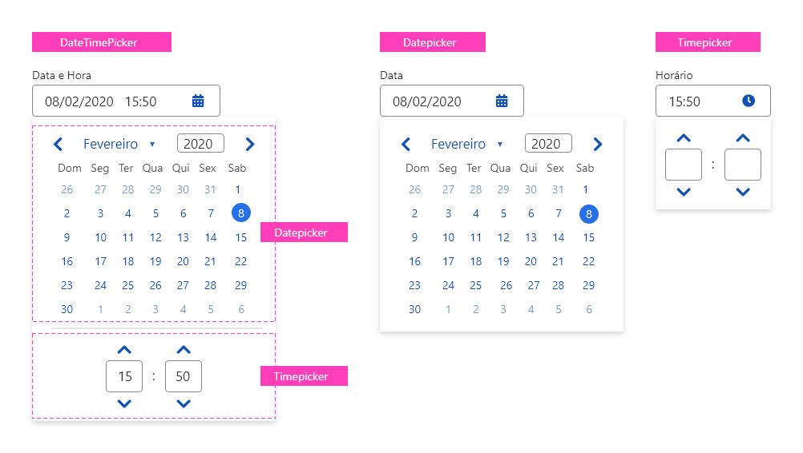
*Variações do componente DateTimePicker*

### 1. *DateTimePicker*

O *DateTimePicker* é o componente padrão para escolha conjunta de data e horário.

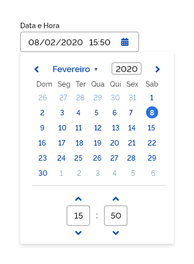
*Exemplo do componente do tipo DateTimePicker*

### 2. *Datepicker*

O componente *datepicker* está disponível de maneira independente, isto é, um componente apenas para o calendário. O funcionamento é o mesmo já descrito anteriormente, porém, ao usuário é permitido selecionar somente datas.

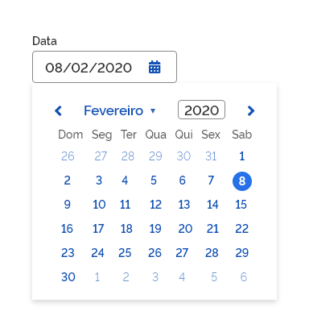
*Exemplo do componente do tipo Datepicker*

### 3. *Timepicker*

O componente *timepicker* também está disponível de maneira independente, isto é, um componente apenas para o seletor de horas e minutos. O funcionamento é o mesmo já descrito anteriormente, porém, ao usuário é permitido selecionar somente horários.

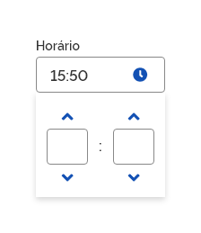
*Exemplo do componente do tipo Timepicker*

**Atenção:** O horário *default* indicado nos campos deve ser: 00:00. Por enquanto, o componente oferece apenas o formato 24 horas como opção de uso.

---

## Comportamentos

### 1. Como funciona

O componente *DateTimePicker* funciona basicamente como seletores de datas e horas. De uma forma geral, o usuário pode selecionar datas e horas por meio do calendário e seletores disponibilizados ou simplesmente digitando diretamente no campo de entrada (*Input*) conforme a máscara sugere. O calendário e o seletor de horas podem ocorrer juntos, ou seja, em um mesmo componente ou em componentes independentes.

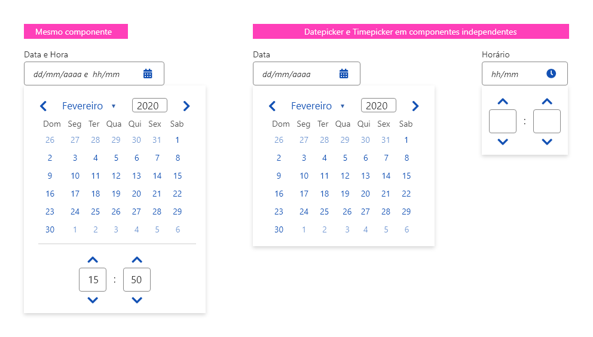
*Exemplos de uso*

O componente *DateTimePicker* (e suas variações independentes) funcionam sempre da mesma maneira.

Ao clicar no campo *Input*, um calendário e/ou seletor de horas são apresentados. Uma vez selecionadas data e/ou a hora, o campo *input* é preenchido e o *card* ocultado. Para acessar novamente o calendário, basta clicar no campo *Input*.
A qualquer momento em que o usuário clicar em qualquer área da tela fora do *card*, o mesmo será ocultado.
O *DateTimePicker* poderá exibir a data atual em destaque para facilitar a identificação das datas no calendário.

### 2. Navegação entre as datas

O usuário pode navegar linearmente pelo calendário por meio das setas de navegação. Também é possível selecionar o mês desejado por meio de um seletor nativo do componente ( *select* ) e o ano por meio de digitação no campo *input* apropriado.

1. Setas de navegação linear;

2. Combo *select* para escolha do mês;

3. Combo *input* para escolha do ano.

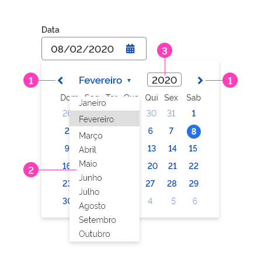
*Possibilidades de navegação pelo calendário*

### 3. Intervalo de datas

É possível utilizar o *datepicker*, para criar uma entrada conjunta de data inicial e data final. Uma vez selecionadas as datas inicial e final, o intervalo de dias entre as datas selecionadas ficará em destaque. No exemplo abaixo, o intervalo entre os dias 8 e 12 de fevereiro está destacado.

1. Data inicial selecionada;

2. Data final selecionada e destacado todos os dias compreendidos neste intervalo.

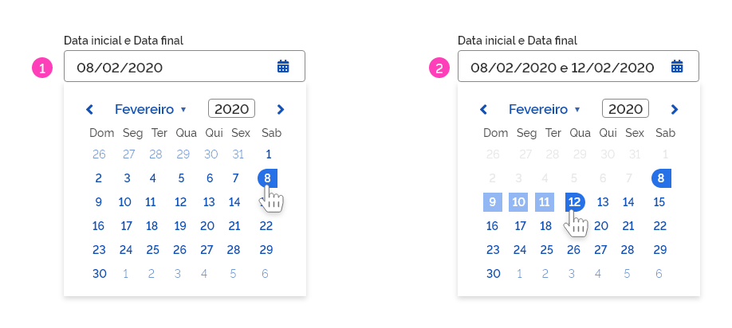
*Exemplo de comportamento de intervalo de datas selecionadas*

**Atenção:** Os dias anteriores à data inicial escolhida devem ficar desabilitados, não permitindo que o usuário selecione por descuido uma data inválida.

### 4. Estados

Alguns estados podem ser encontrados nos elementos do datepicker e do *timepicker*. A seguir, é ilustrado cada um deles.

**Atenção:** A fim de facilitar o entendimento, os componentes estão ilustrados de forma independente porém todos os estados apresentados ocorrem também no componente padrão *DateTimePicker*.

#### 1. *Hover*

O estado *hover* ocorre nos campos *input* e nos dias do calendário.

1. Estado *hover*.

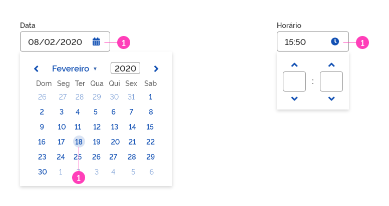
*Exemplo de estado hover*

#### 2. Selecionado

O estado selecionado ocorre basicamente nos dias selecionados pelo usuário, tanto em um calendário simples quanto em um calendário de intervalo de datas.

1. Estado selecionado.

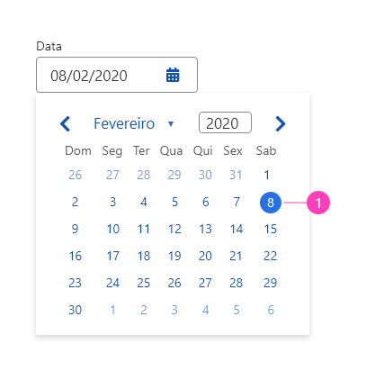
*Exemplo de estado selecionado*

#### 3. Foco

O estado foco ocorre somente nos campos *input*.

1. Estado foco.

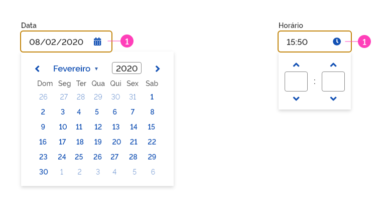
*Exemplo de estado de foco*

#### 4. Destacado

O estado destacado ocorre unicamente para marcar o dia atual e independe de qualquer ação do usuário.

1. Estado destacado.

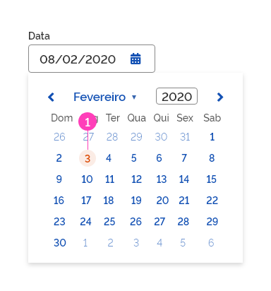
*Exemplo de uma data com destaque*

#### 5. Desabilitado

O estado desabilitado ocorre nas datas que por qualquer motivo não podem ser selecionadas. Geralmente é utilizado para desabilitar as datas anteriores à data inicialmente escolhida.

1. Estado desabilitado.

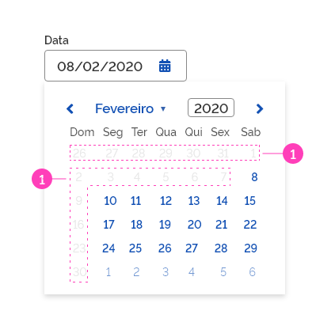
*Exemplo de comportamento de datas desabilitadas*

### 5. Intervalo

O estado intervalo ocorre apenas nos calendários em que a seleção de duas datas (data inicial e final) é permitida e tem por finalidade destacar os dias compreendidos neste intervalo.

1. Data inicial e final selecionada;

2. Intervalo de dias entre a data inicial e final.

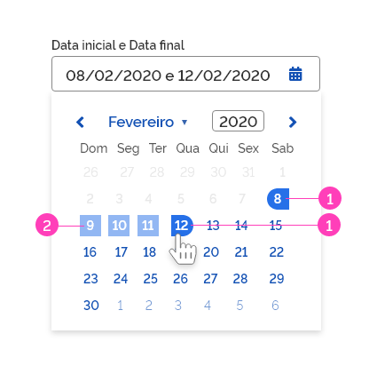
*Exemplo de comportamento de intervalo de datas*

### 6. Responsividade

O componente *DateTimePicker* for projetado para ser utilizado em qualquer resolução de tela até 4 colunas de acordo com a imagem a seguir:

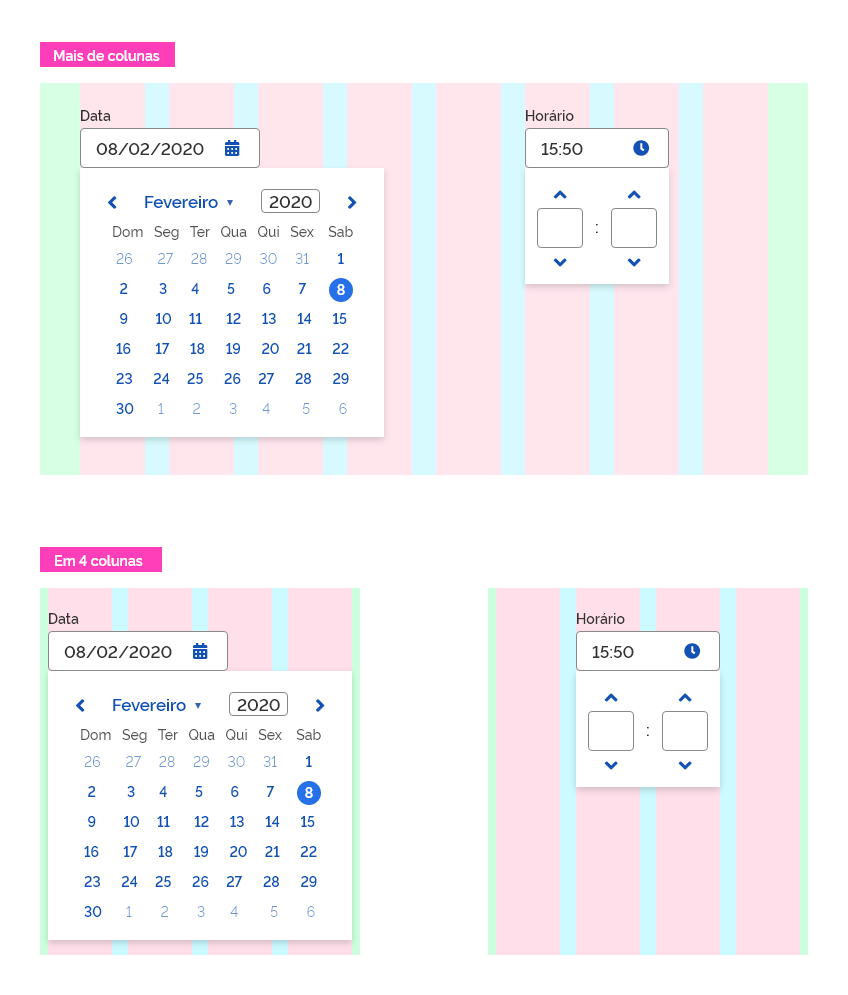
*Exemplo de comportamento nas grids*

### 7. Utilização em fundo escuro

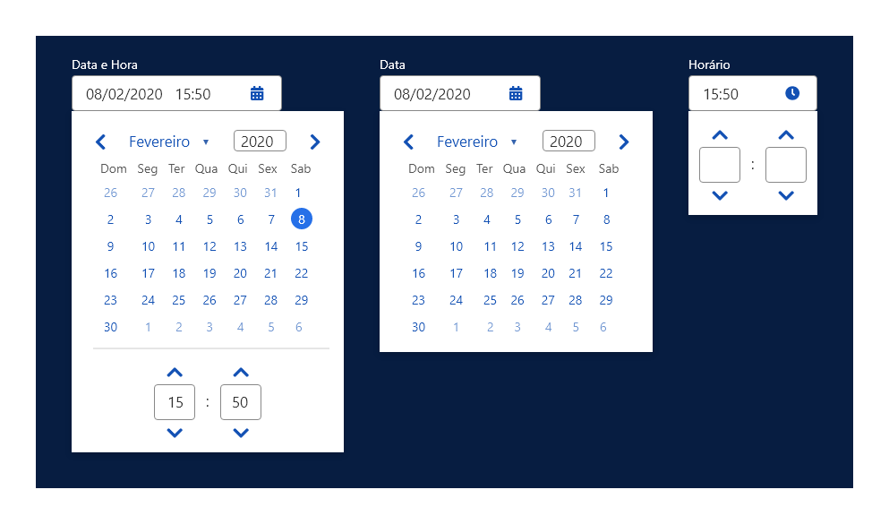
*Exemplo de utilização em fundo escuro*

---

## Especificações

### Tipografia

| Name                         | Token Size                | Token Weight              |
| ---------------------------- | ------------------------- | ------------------------- |
| Mês/Ano                      | `--font-size-scale-up-01` | `--font-weight-semi-bold` |
| Dias da Semana               | `--font-size-scale-base`  | `--font-weight-medium`    |
| Dias                         | `--font-size-scale-base`  | `--font-weight-semi-bold` |
| Dia Atual                    | `--font-size-scale-base`  | `--font-weight-semi-bold` |
| Dia Mês anterior/posterior   | `--font-size-scale-base`  | `--font-weight-regular`   |
| Dia Desabilitados            | `--font-size-scale-base`  | `--font-weight-regular`   |
| Intervalo Dias (Selected)    | `--font-size-scale-base`  | `--font-weight-semi-bold` |
| Seletor (Data/Hora)          | `--font-size-scale-up-01` | `--font-weight-semi-bold` |
| Seletor (Data/Hora Selected) | `--font-size-scale-up-01` | `--font-weight-semi-bold` |

### Cor

| Name                              | Property | Token Color            | Opacity |
| --------------------------------- | -------- | ---------------------- | ------- |
| Texto Mês/Ano                     | color    | `--blue-warm-vivid-70` | -       |
| Texto Dias da Semana              | color    | `--gray-70`            | -       |
| Texto Dias                        | color    | `--blue-warm-vivid-70` | -       |
| Texto Dias Mês anterior/posterior | color    | `--blue-warm-vivid-70` | 60%     |
| Texto Dias Desabilitados          | color    | `--gray-20`            | 45%     |
| Intervalo (dias selecionados)     | color    | `--pure-100`           | -       |
| Seletor (Data/Hora)               | color    | `--gray-80`            | -       |
| Seletor (Data/Hora Selected)      | color    | `--blue-warm-vivid-70` | -       |
| Ícone "Selecionar Data"           | color    | `--blue-warm-vivid-70` | -       |
| Ícone "Marcar Hora"               | color    | `--blue-warm-vivid-70` | -       |
| Botão terciário "Voltar"          | color    | `--blue-warm-vivid-70` | -       |
| Botão terciário "Avançar"         | color    | `--blue-warm-vivid-70` | -       |
| Botão terciário "Retrair"         | color    | `--blue-warm-vivid-70` | -       |
| Botão terciário "Expandir"        | color    | `--blue-warm-vivid-70` | -       |

### Iconografia

| Name            | Ícone                           | Token Size         | Class (Font Awesome) |
| --------------- | ------------------------------- | ------------------ | -------------------- |
| Selecionar Data | <i class="fas fa-calendar"></i> | `--icon-size-base` | fa-calendar-alt      |
| Marcar Hora     | <i class="fas fa-clock"></i>    | `--icon-size-base` | fa-clock             |

### Botões Terciários

| Name    | Ícone                              | Token Size        | Class (Font Awesome) |
| ------- | ---------------------------------- | ----------------- | -------------------- |
| Voltar  | <i class="fas fa-angle-left"></i>  | `--icon-size-lg`  | fa-angle-left        |
| Avançar | <i class="fas fa-angle-right"></i> | `---icon-size-lg` | fa-angle-right       |
| Retrair | <i class="fas fa-angle-up"></i>    | `---icon-size-lg` | fa-angle-up          |

### Dimensão

| Name                      | Property | Dimension |
| ------------------------- | -------- | --------- |
| *Card* (*DateTimePicker*) | width    | `304px`   |
| *Card* (*DateTimePicker*) | height   | `auto`    |
| *Card* (*Datepicker*)     | width    | `304px`   |
| *Card* (*Datepicker*)     | height   | `auto`    |
| *Card* (*Timepicker*)     | width    | `144px`   |
| *Card* (*Timepicker*)     | height   | `116px`   |

### Espaçamento

| Name                          | Property      | Token Spacing                 |
| ----------------------------- | ------------- | ----------------------------- |
| Calendário (*DateTimePicker*) | width         | `--spacing-scale-2xh`         |
| Calendário (*DateTimePicker*) | height        | `--spacing-scale-2xh`         |
| Seletor (*DateTimePicker*)    | width         | `--spacing-horizontal-center` |
| Seletor (*DateTimePicker*)    | height        | `--spacing-scale-base`        |
| Calendário (*Datepicker*)     | width         | `--spacing-scale-2xh`         |
| Calendário (*Datepicker*)     | height        | `--spacing-scale-2xh`         |
| Seletor (*TimePicker*)        | width         | `--spacing-scale-base`        |
| Seletor (*TimePicker*)        | height        | `--spacing-scale-base`        |
| Campo de Entrada (*Input*)    | margin-bottom | `--spacing-scale-base`        |

### Sombra

|    Name    |        Shadow         |
| :--------: | :-------------------: |
| Superfície | `--surface-shadow-md` |
