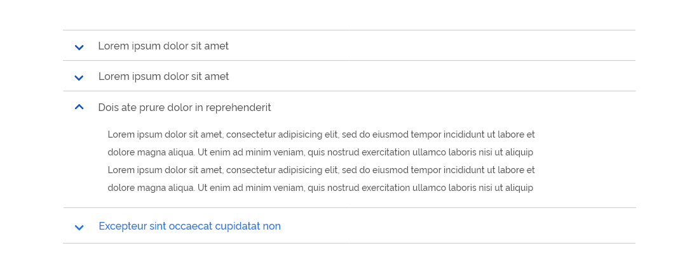
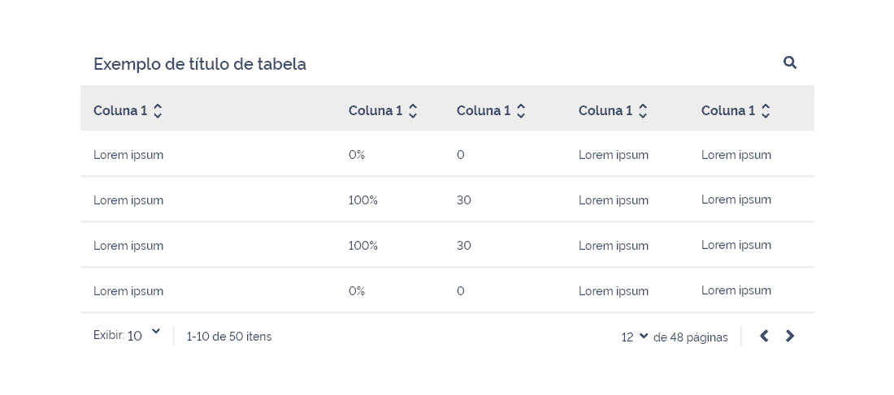
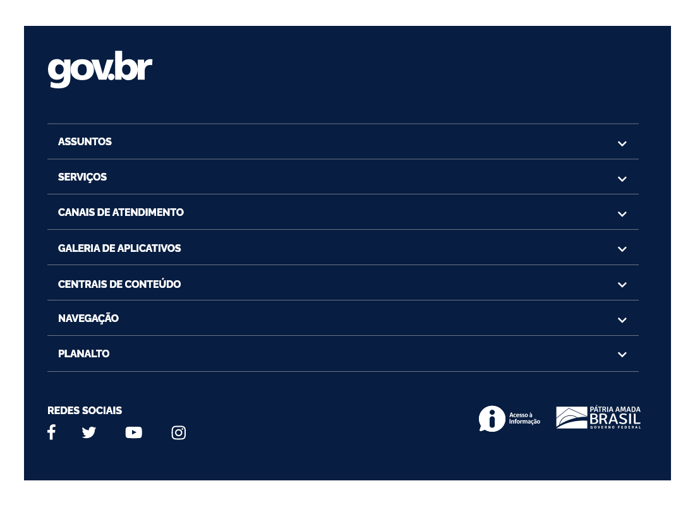
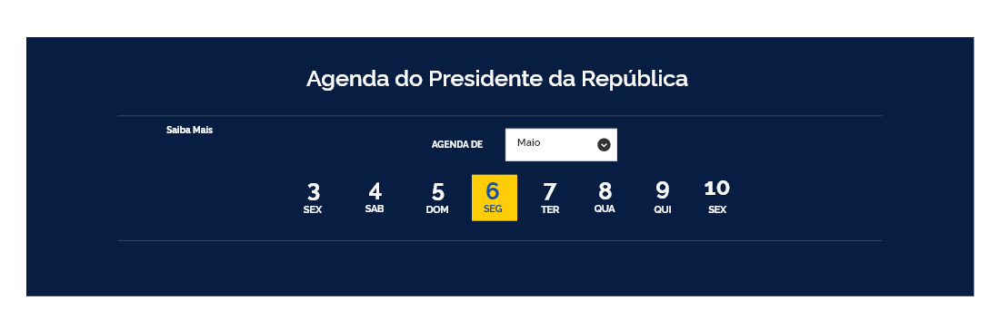
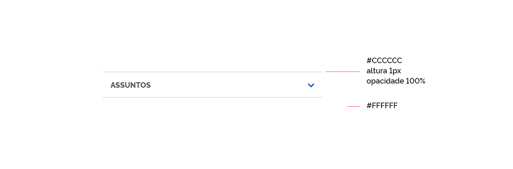
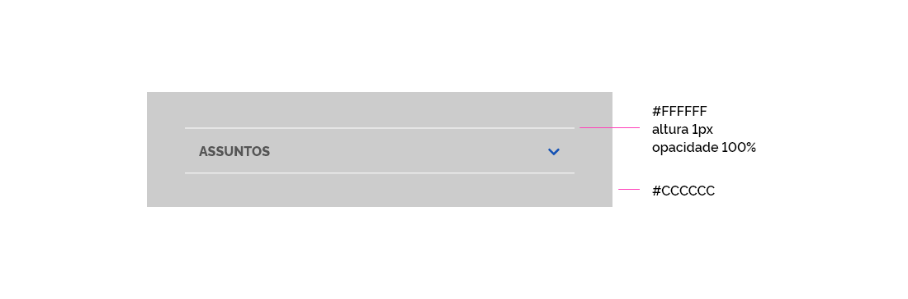

[version]: # '1.0.0'

## Uso

Os separadores deve ser utilizado para organizar determinados conteúdos em grupos claros, forma consistente e sutil.

Os separadores deverão ser utilizados em tamanhos e componentes diferentes, respeitando as suas características de uso e necessidade.. O tamanho escolhidos devem sempre respeitar o padrão de grid e layout já definidos na documentação do design system para o gov.br.

---

## Princípios

**Sutil**
Os separadores devem ser visíveis em um layout, porém não devem "destoar" chamando atenção indevida.

**Secundário**
Os divisores devem ser usados, ​​apenas, se os elementos não puderem ser separados por espaço em branco.

**Pouco Frequente**
Os separadores devem ser utilizados com moderação. Deve-se optar por utiliza-los para criar agrupamentos ao invés de separar itens.

---

### Exemplos de Aplicação

Os separadores poderão ser utilizados de várias formas diferentes. Segue exemplos de aplicações dos separadores em diversos tipos de componentes e em usos distintos:

**Separador para Abas**

Separadores utilizado para alinhar os ítens das abas.

**Separador para Colapse / Accordeon**

Separadores utilizados como elemento estético e como organizador dos tópicos do componente colapse.

**Separador para Tabela**

Separadores sendo utilizado como elemento estético e organizador das linhas da tabela.

**Separador de Chamadas e Matérias**

Separadores sendo utilizado como elemento estético e organizador das chamadas para matérias.

**Separador para Acesso Rápido ao Topo**

Separadores sendo utilizado como elemento estético.

**Separador para Footer Mobile**

Separadores sendo utilizado como elemento estético e organizador dos tópicos do footer (tablet).

Separadores sendo utilizado como elemento estético e organizador dos tópicos do footer (mobile).

**Separador para Agenda**

Separadores sendo utilizado como elemento estético e organizador da agenda.

**Separadores para layout de tela (Resultados da Busca)**

Separadores sendo utilizado de maneiras variadas e em componentes variádos.

---

## Especificações Técnicas

Segue especificações técnicas referentes a cor, espessura e opacidade dos separadores.

**Separador em Fundo Positivo**

**Separador em Fundo Neutro**

**Separador em Fundo Negativo**

