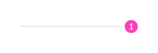
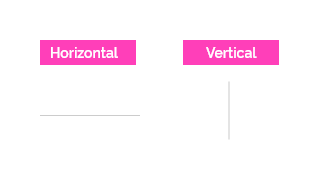
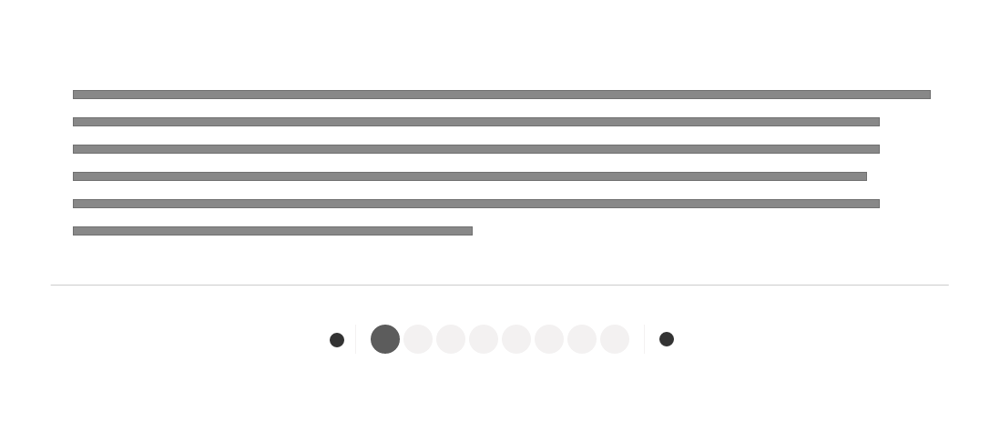
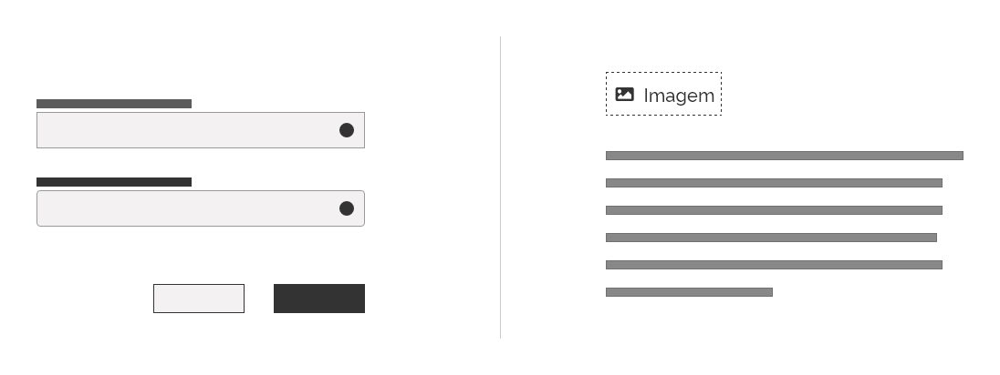
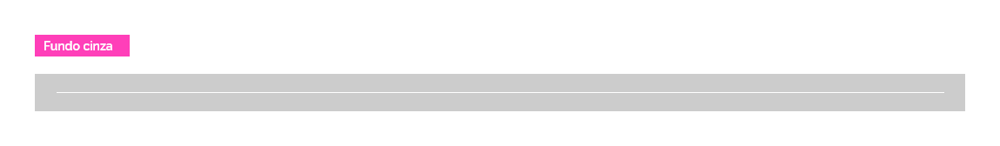
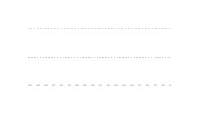
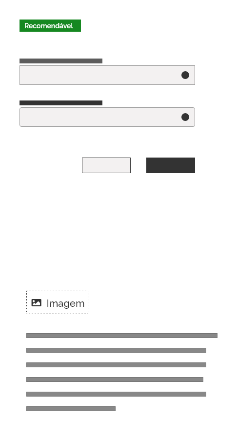
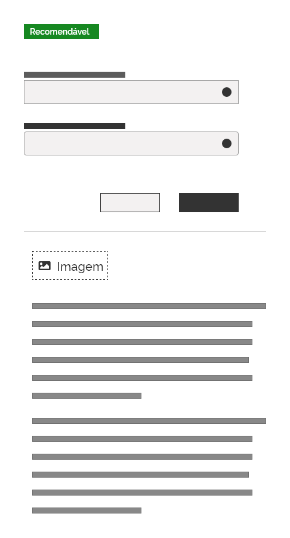
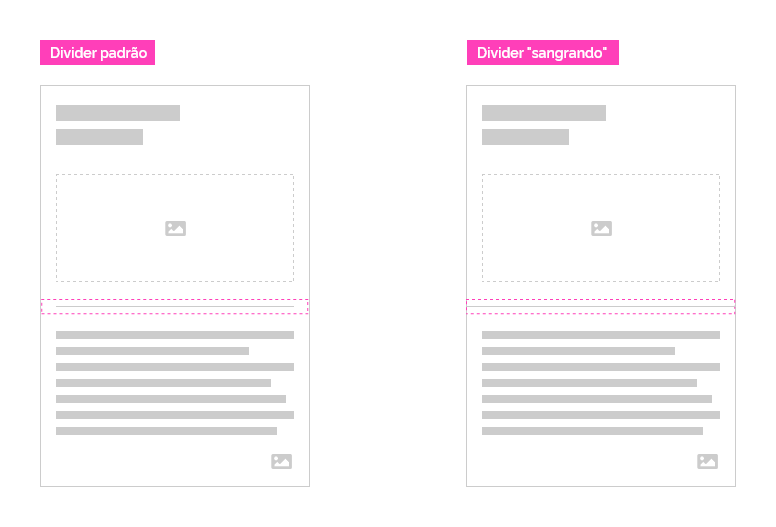

*Exemplo do componente divider*

Utilize Divider quando precisar separar na tela seções de conteúdo ou quando os espaços em branco não forem suficientes para indicar a separação dos elementos ou sessões.

---

## Anatomia

O *divider* é composto pela borda de uma superfície formando uma linha reta.

| ID  | Nome  |                         Referência                          | Uso         |
| --- | ----- | :---------------------------------------------------------: | ----------- |
| 1   | Borda | [Fundamento Superfície](/ds/fundamentos-visuais/superficie) | Obrigatório |

*Exemplo do componente divider*

---

## Comportamentos

### 1. Posição

O *divider* pode ser utilizado tanto na posição horizontal quanto na vertical, conforme a necessidade:

*Exemplos de posições do componente divider*

*Exemplo do componente divider horizontal*

*Exemplo do componente divider vertical*

### 2. Fundo

O *divider* pode ser utilizado em fundos de qualquer cor. A seguir é ilustrado a aplicação do *divider* em um fundo claro e um fundo escuro:

*Exemplo de aplicação do componente divider em fundo claro e escuro*

Alterne as cores do componente nos casos em que o fundo tenha a cor igual ou parecida com a do *divider* tornando-o imperceptível.

*Exemplo de aplicação do componente divider em fundo cinza*

**Atenção:** evite o uso de cores aleatórias nos *dividers*. Eles foram pensados para funcionar com as cores indicadas neste manual.

### 3. Estados

*Dividers* são elementos neutros e não interativos. Em hipótese alguma devem se comportar com estados.

### 4. Acessibilidade

O *divider* deve ser usado como elemento estético representando uma quebra visual entre seções e grupos de conteúdo. Não deve ser interpretado por leitores de tela.

### 5. Responsividade

*Dividers* são estruturas flexíveis e se adaptam perfeitamente à largura da tela. Por isso, ele pode ser usado sem prejuízo em qualquer resolução.

### 6. Estilos e Espessuras

*Dividers* podem apresentar estilos e espessuras diferentes seguindo sempre as diretrizes de superfície do Design System.

*Exemplo de espessuras diferentes*

*Exemplo de estilo tracejado com espessuras diferentes*

---

## Melhores Práticas

-   Os *divider* devem ser usados com moderação.

-   Os *dividers* devem ser usados quando os elementos não puderem ser separados por distanciamento (espaços vazios).

    
    *Uso correto! O espaçamento já caracteriza a separação dos elementos*

    
    *Uso não recomendado! Como o espaçamento já caracteriza a separação dos elementos não há necessidade de um divider*

    
    *Uso correto! Como o espaçamento é insuficiente, o espaçamento indica a separação entre os elementos*

-   Utilize o *divider* apenas para separar na tela seções de conteúdo.

-   Os *dividers* devem ser visíveis em um *layout*, porém não devem "destoar" chamando mais atenção que o próprio conteúdo.

    
    *Uso errado do componente divider vertical*

-   Não utilize *dividers* para circundar um item. Prefira bordas.

-   Opte por utilizá-los para criar agrupamentos em vez de itens separados.

    
    *Na imagem da esquerda o divider é utilizado para separar grupos de conteúdo, isso torna o layout mais limpo e simplificado. Na imagem da direita ele é usado de forma errada, separando cada um dos subitens, tornando o layout confuso e poluído*

-   O componente *divider* pode "sangrar" (ausência de margens) quando utilizado dentro de outro componente.

    
    *O componente divider pode "sangrar" no componente em que está contido. Essa é uma opção de estilo do designer na criação do layout e não possui necessariamente uma regra*

---

## Especificações

### Cor

| Name                     | Property   | Color Token |
| ------------------------ | ---------- | :---------: |
| *Divider* (fundo claro)  | background | `--gray-20` |
| *Divider* (fundo escuro) | background | `--pure-0`  |

### Espaçamento

| Name                 | Property   |     Token/Value      |
| -------------------- | ---------- | :------------------: |
| *Divider* horizontal | top/bottom | `--spacing-scale-2x` |
| *Divider* vertical   | left/right | `--spacing-scale-2x` |
