[version]: # '1.0.0'

---

## Uso

O _footer_ (Rodapé), deve ser utilizado como um elemento de "fechamento" de conteúdo de página, ajudando o usuário em sua localização e, em muitos casos, auxiliando-o com serviços úteis e informações complementares.

Seu layout pode variar em seu conteúdo, cor e forma a depender da necessidade do projeto ou ao padrão da grid ao qual o _footer_ (Rodapé) precisará se adequar.

### Tom de voz

O _footer_ (Rodapé) precisa apresentar um padrão organizacional com layout consistente, previsível e facilmente detectável em todas as páginas do projeto.

---

## Anatomia

O _Footer_ é composto por vários elementos visuais e componentes organizados em espaços determinados. É importante notar que **os elementos se repetem nas versões e variações do rodapé**, podendo assumir outras formas dependendo do tipo escolhido ou da resolução da tela.

A seguir, apresentamos os elementos e componentes mais utilizados no _footer_ (Rodapé):

1. Logo Principal;
2. Texto Componentes Lista; (opcional)
3. Container Componentes Lista; (opcional)
4. Ícone Expandir
5. Ícone Retrair
6. Título Redes Sociais; (opcional)
7. Botão Rede Social; (opcional)
8. Logo Assinatura; (opcional)
9. Container Informações Legais; (opcional)
10. Texto Informações Legais; (opcional)
11. Texto Informações Legais - Destaque; (opcional)
12. Container _Footer_;
13. Componente Separator;

##### _Footer_ Grid 12 colunas

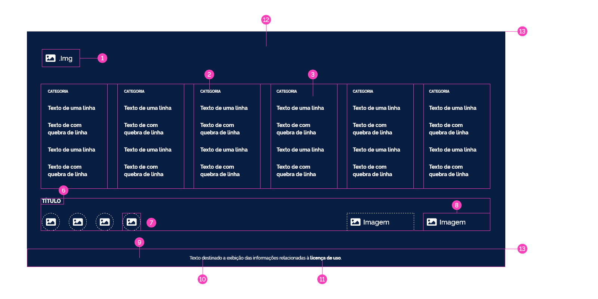

##### _Footer_ Grid 8 colunas

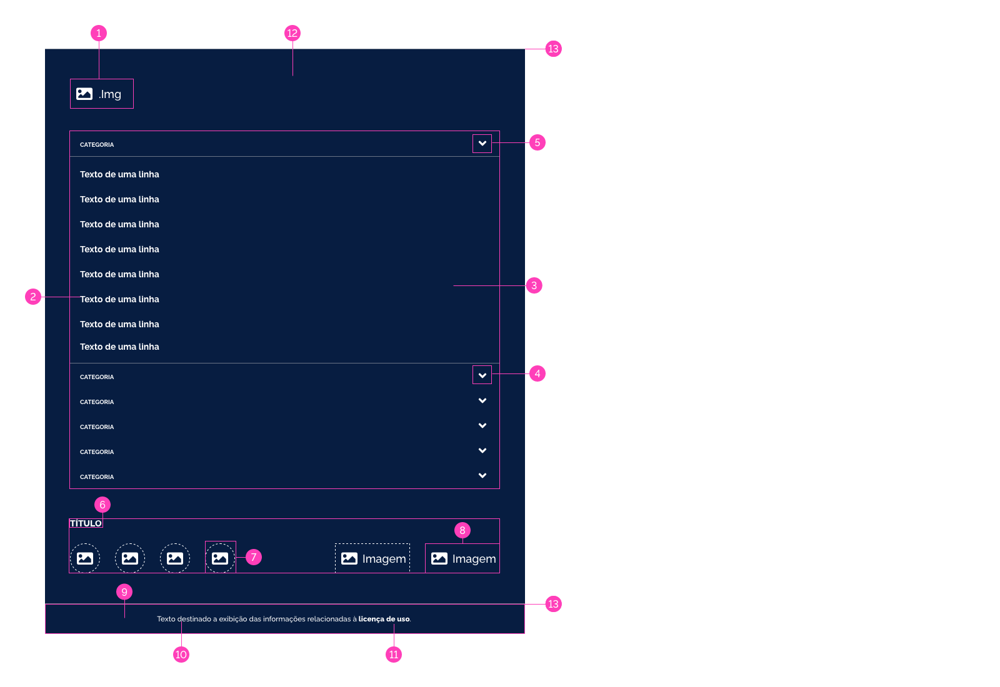

##### _Footer_ Grid 4 colunas

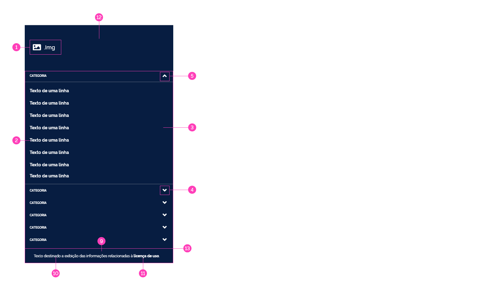

**Atenção:** Caso de necessidade de inserção de novos componentes, a equipe de design responsável pelo _Design System_ deverá ser contactada para a realização de um estudo preliminar.

---

### Detalhamento das Áreas

O _Footer_ (Rodapé) é organizado em 4 grandes áreas compostas por vários elementos. Neste tópico, exploraremos cada uma dessas áreas e seus respectivos elementos com mais detalhes:
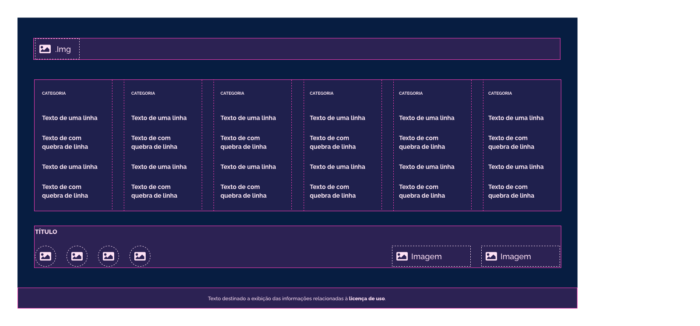

#### 1- Área Logo Principal

Esta área é destinada à utilização a logo do sistema ou portal, respeitando as alturas e larguras mínimas e máximas definidas na área de tokens.

#### 2- Área Mapa do Site

O Mapa do Site é formado pela junção de vários componentes list (lista). Cada lista deverá ser organizado de duas em duas colunas, respeitando as definições de espaçamento e alinhamento propostos, mantendo uma melhor organização quanto à responsividade.

**IMPORTANTE:** Caso o mapa do site apresentado esteja muito extenso, correndo o risco de se tornar pesado e difícil de usar, será necessária a criação de um mapa completo do site em uma página separada e vinculá-lo ao _footer_ (Rodapé), que é geralmente onde os usuários esperam encontrar esse link.

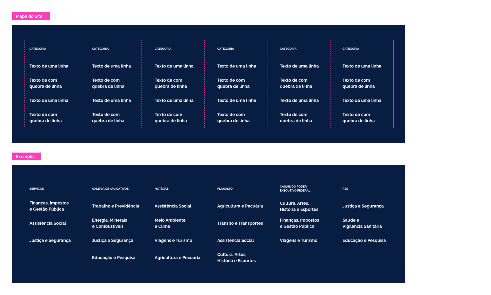

**IMPORTANTE:** O componente List, em todos os ítens que o compõe, possui a altura definida como comportamento de densidade.

##### Mapa do Site - Adição de Novas Listas

Sempre que houver a necessidade de adicionar novas listas, estes deverão ser organizados à baixo mantendo as especificações de espaçamento já definidas nos tokens.

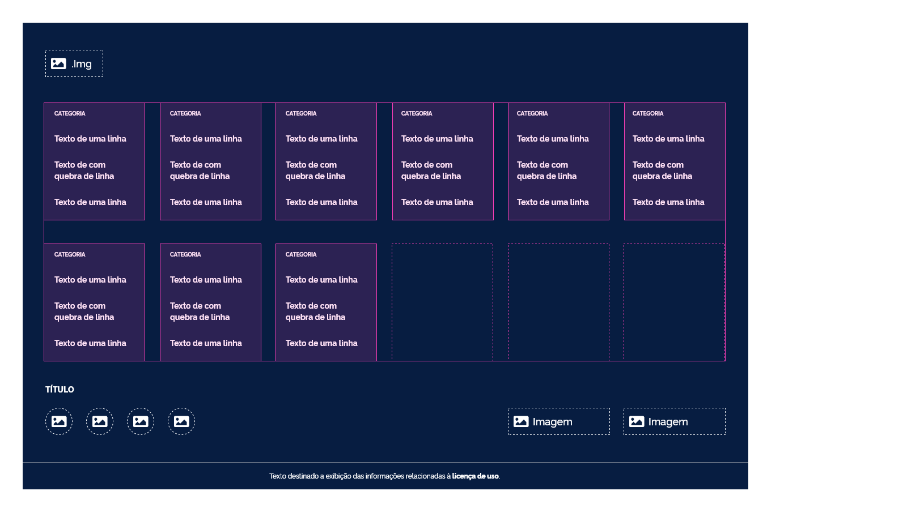

#### Comportamento Lista Expandir

O mapa do site quando utilizados em layouts com 4 e 8 colunas deverão ser apresentadas como listas no **"comportamento lista expandir"**, devido a limitação de espaço.

Para o _footer_ (Rodapé) o **"comportamento lista expandir"** transforma as categorias das listas em listas do layout 12 colunas em listas expansíveis com ação collapse. Cada categoria da lista, quando acionados, apresentará em seu interior os ítens da lista que o compõe.

Por definição, só pode ser apresentada uma lista por vez, ou seja, quando uma categoria e seus ítens estiver aberta, automaticamente as outras deverão permanecer fechadas.

---

#### 3- Área Informações Secundárias

É formada pela junção das informações referentes às redes sociais e as marcas utilizadas como assinaturas.

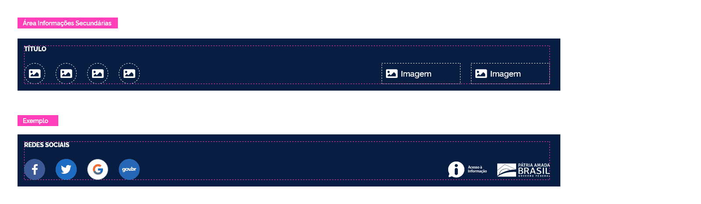

##### Redes Sociais

Esta área fornece botões secundários de acesso rápido às redes sociais.

##### Logo Assinatura

Área destinada à apresentação de logos ou siglas que integrem uma empresa ou marcas parceiras que patrocinam ou endossam um evento ou projeto específico.

#### 4. Área Informacão Legal

Esta área apresenta informações indispensáveis ao sistema ou portal e deve ser utilizado sempre que for necessário.

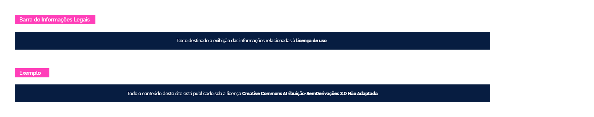

**IMPORTANTE:** O componente list possui documentação com suas próprias especificações, no entanto, houve a necessidade de ajustes de cor para se adequar ao layout do componente _footer_ (Rodapé). Ver mais detalhes na área de token.

---

## Comportamento

#### Responsividade

O componente _Footer_ deve se comportar de forma fluida em relação à resolução de tela utilizada. A tabela a seguir resume as dimensões de _Footer_ utilizadas referentes à quantidade de _grids_:

Segue exemplos dos _Footers_ para cada _Grid_ disponível:

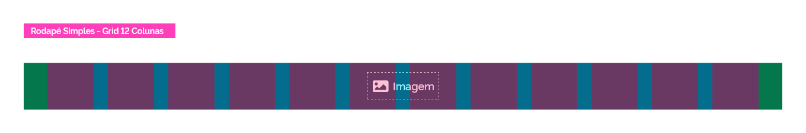
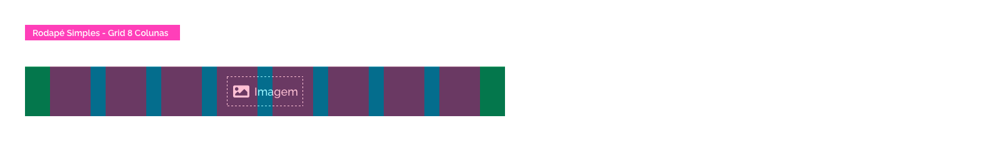

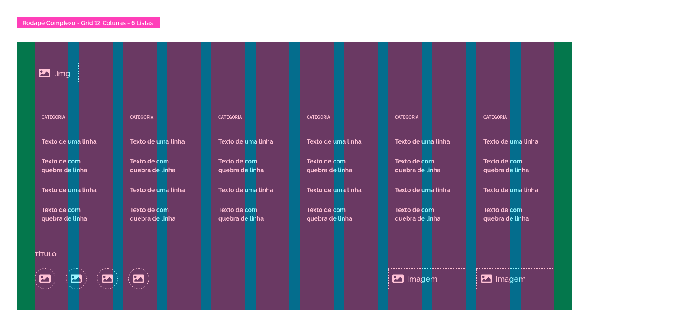
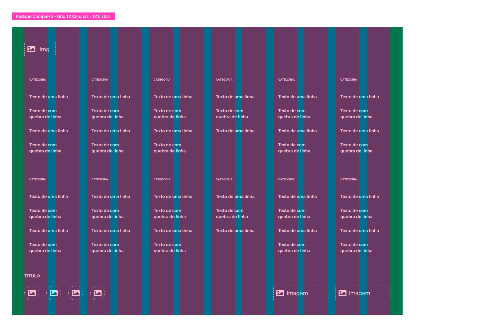
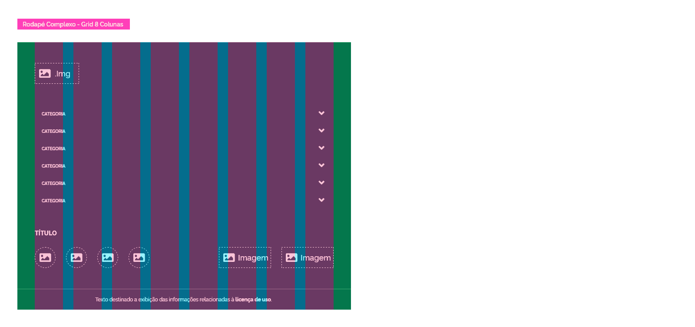
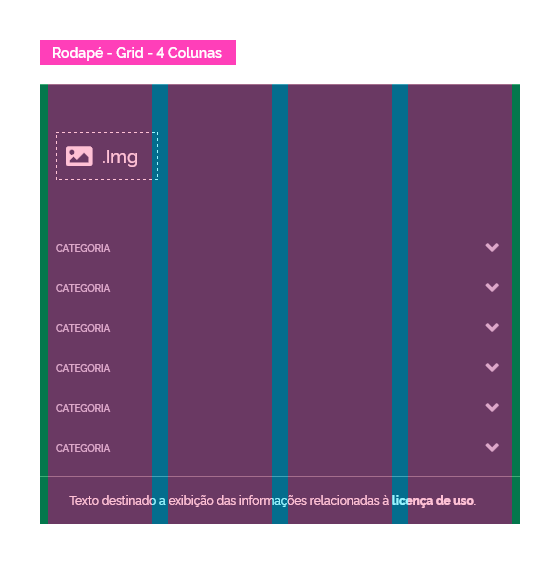
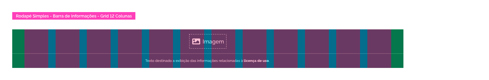
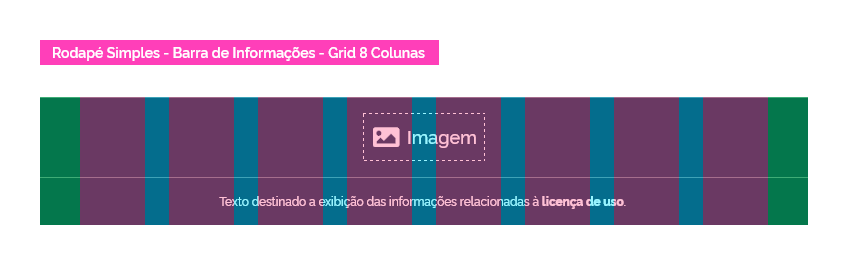

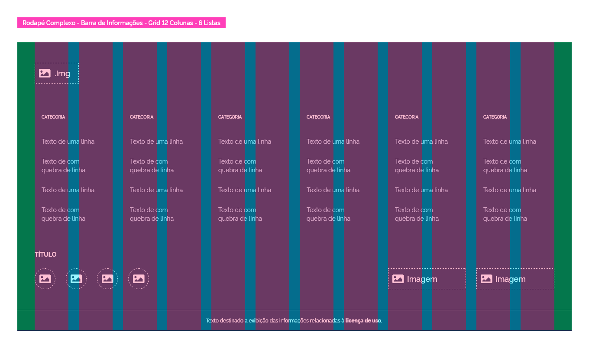
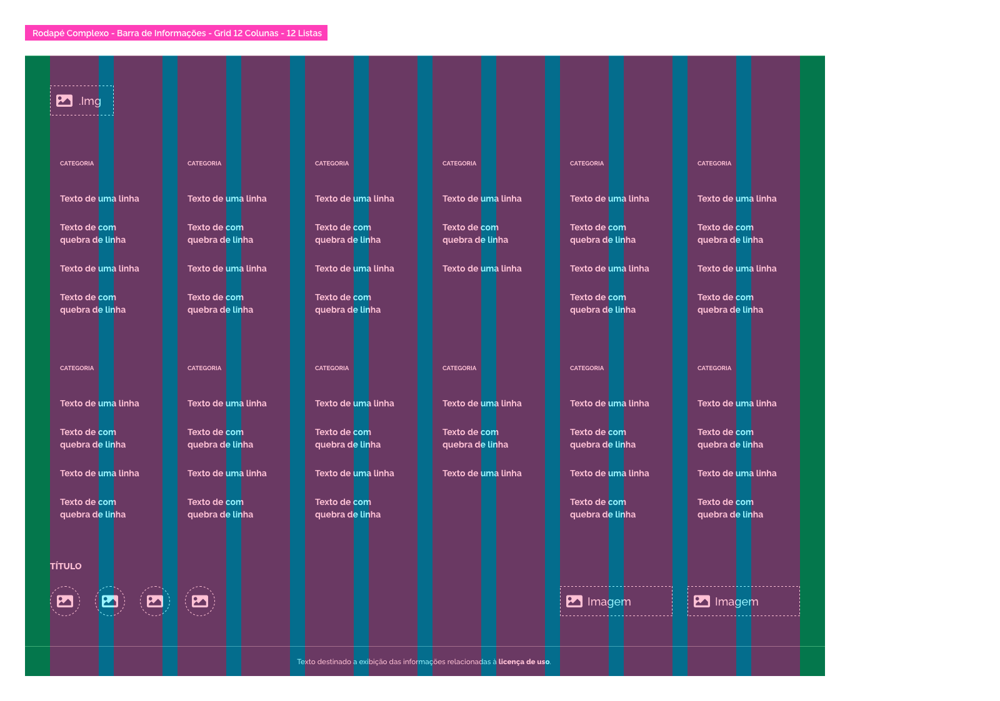
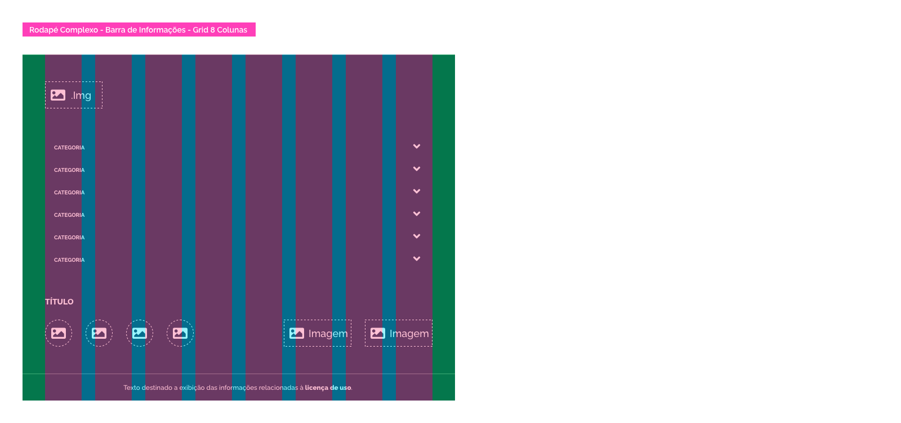
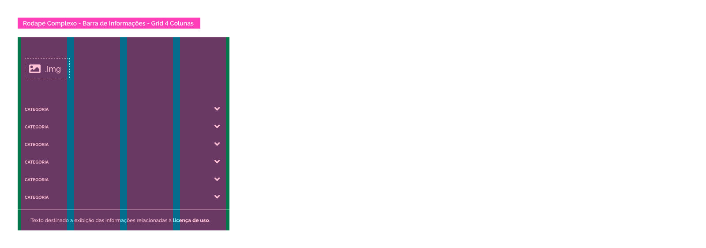

**IMPORTANTE:** Mesmo existindo variação na quantidade de listas apresentadas para o _footer_ (Rodapé), estes deverão se ajustar à disposição de sua respectiva grid.

---

### Temas

Foi desenvolvido para o _footer_ (rodapés) dois temas que se diferenciam na inversão das cores empregadas. **Tema 1**, na versão negativa e **Tema 2**, na versão positiva.

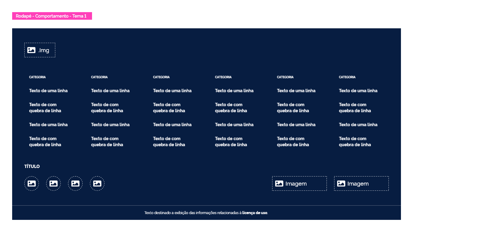

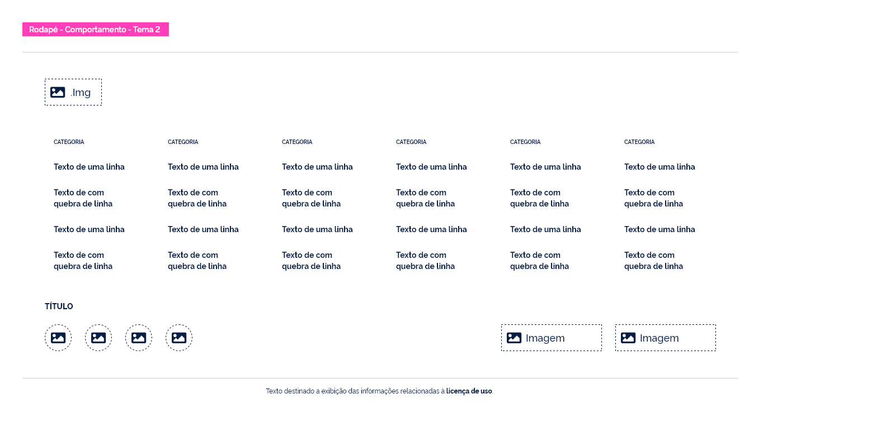

**IMPORTANTE:** No "tema 2" será necessário o uso do componente separador no topo do _footer_ (Rodapé), fazendo uma delimitação do footer com a área de conteúdo. Caso haja a necessidade da utilização da barra de informações legais no tema 2, este também deverá apresentar o componente separador no topo. Como visto abaixo:

#### Layout Flúido

Em alguns casos, conforme necessidade do projeto ou das regras de negócio, os elementos do _footer_ (Rodapé) pode apresentar mudanças de alinhamento, afetando desta forma seu layout.
Esta organização e composição final deverá sempre respeitar o alinhamento na sua respectiva grid.

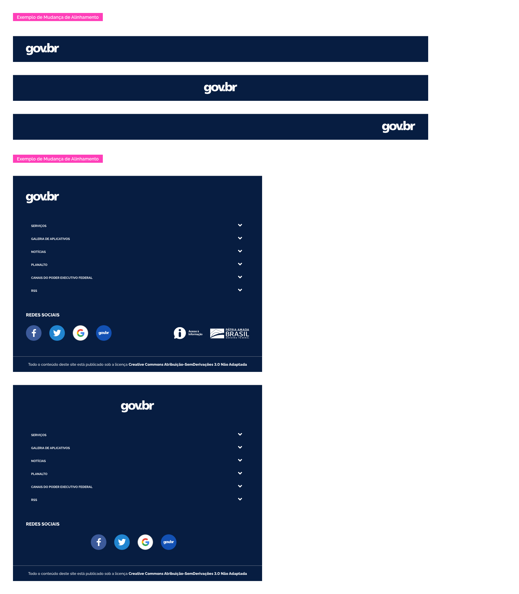

---

### Design Tokens

### Tipografia

###### Footer Temas 1 e 2

| Name                                | Size                        | Weight                     |
| ----------------------------------- | --------------------------- | -------------------------- |
| Título Redes Sociais                | `-–font-size-scale-up-01`   | `-–font-weight-extra-bold` |
| Texto Informações Legais            | `-–font-size-scale-down-01` | `-–font-weight-medium`     |
| Texto Informações Legais - Destaque | `-–font-size-scale-down-01` | `-–font-weight-extra-bold` |

---

### Cores

###### _Footer_ Tema 1

| Name                                | Property         | Color Token                 |
| ----------------------------------- | ---------------- | --------------------------- |
| Logo Principal                      | color            | `–-color-secondary-01`      |
| Texto Componente Lista              | color            | `–-color-secondary-01`      |
| Container Componente Lista          | background color | `--color-primary-darken-02` |
| Ícone Expandir                      | color            | `--color-secondary-01`      |
| Ícone Retrair                       | color            | `--color-secondary-01`      |
| Título Redes Sociais                | color            | `–-color-secondary-01`      |
| Container Informações Legais        | background color | `--color-primary-darken-02` |
| Logo Assinatura                     | color            | `–-color-secondary-01`      |
| Texto Informações Legais            | color            | `–color-secondary-01`       |
| Texto Informações Legais - Destaque | color            | `–color-secondary-01`       |
| Container _Footer_                  | background color | `--color-primary-darken-02` |

###### _Footer_ Tema 2

| Name                                | Property         | Color Token                 |
| ----------------------------------- | ---------------- | --------------------------- |
| Logo Principal                      | color            | `--color-primary-darken-02` |
| Texto Componente Lista              | color            | `--color-primary-darken-02` |
| Container Componente Lista          | background color | `–color-secondary-01`       |
| Ícone Expandir                      | color            | `--color-primary-darken-02` |
| Ícone Retrair                       | color            | `--color-primary-darken-02` |
| Título Redes Sociais                | color            | `--color-primary-darken-02` |
| Container Informações Legais        | background color | `–color-secondary-01`       |
| Logo Assinatura                     | color            | `--color-primary-darken-02` |
| Texto Informações Legais            | color            | `--color-primary-darken-02` |
| Texto Informações Legais - Destaque | color            | `--color-primary-darken-02` |
| Container _Footer_                  | background color | `-–color-primary-01`        |

---

#### Espaçamentos

###### Footer Temas 1 e 2 (Sem Informação Legal)

| Name                 | Padding - Property                                                |
| -------------------- | ----------------------------------------------------------------- |
| **4 Colunas**        | **left** ---------- **right** -------- **top** ------- **bottom** |
| Componente Separador | `0px` ------- `0px` ------- `0px` ------- `variável`              |
| Logo Principal       | `16px` ------- `variável (grid)` ------- `48px` ------- `48px`    |
| **8 Colunas**        | **left** ---------- **right** -------- **top** ------- **bottom** |
| Componente Separador | `0px` ------- `0px` ------- `0px` ------- `variável`              |
| Logo Principal       | `40px` ------- `variável (grid)` ------- `48px` ------- `48px`    |
| Título Redes Sociais | `0px` ------- `--` ------- `0px` ------- `--`                     |
| Botão Rede Social    | `0px` ------- `16px` ------- `--` ------- `0px`                   |
| Logo Assinatura      | `40px` ------- `0px` ------- `--` ------- `0px`                   |
| **12 Colunas**       | **left** ---------- **right** -------- **top** ------- **bottom** |
| Componente Separador | `0px` ------- `0px` ------- `0px` ------- `variável`              |
| Logo Principal       | `40px` ------- `--` ------- `48px` ------- `48px`                 |
| Título Redes Sociais | `0px` ------- `563px` ------- `0px` ------- `--`                  |
| Botão Rede Social    | `0px` ------- `16px` ------- `--` ------- `0px`                   |
| Logo Assinatura      | `40px` ------- `0px` ------- `--` ------- `0px`                   |

###### Área Informação Legal

| Name                     | Padding - Property                                                                  |
| ------------------------ | ----------------------------------------------------------------------------------- |
| **4 Colunas**            | **left** ---------- **right** -------- **top** ------- **bottom**                   |
| Componente Separador     | `0px` ------- `0px` ------- `0px` ------- `variável`                                |
| Texto Informações Legais | `centralizado` ------- `centralizado` ------- `centralizado` ------- `centralizado` |
| **8 Colunas**            | **left** ---------- **right** -------- **top** ------- **bottom**                   |
| Componente Separador     | `0px` ------- `0px` ------- `0px` ------- `variável`                                |
| Texto Informações Legais | `centralizado` ------- `centralizado` ------- `centralizado` ------- `centralizado` |
| **12 Colunas**           | **left** ---------- **right** -------- **top** ------- **bottom**                   |
| Componente Separador     | `0px` ------- `0px` ------- `0px` ------- `variável`                                |
| Texto Informações Legais | `centralizado` ------- `centralizado` ------- `centralizado` ------- `centralizado` |

---

#### Dimensão

###### Footer Temas 1 e 2 (Sem Informação Legal)

| Name                                      | Property                              |
| ----------------------------------------- | ------------------------------------- |
| **4 Colunas**                             | **width** ------ **height**           |
| Componente Separador                      | `480px` ------ `1px`                  |
| Logo Principal e Assinatura - Tam. Mínimo | `102px` ------ `variável`             |
| Logo Principal e Assinatura - Tam. Máximo | `180px` ------ `variável`             |
| Container _Footer_                        | `480px` ------ `133px`                |
| **8 Colunas**                             | **width** ------ **height**           |
| Componente Separador                      | `768px` ------ `1px`                  |
| Logo Principal e Assinatura - Tam. Mínimo | `102px` ------ `variável`             |
| Logo Principal e Assinatura - Tam. Máximo | `180px` ------ `variável`             |
| Container Redes Sociais                   | `688px` ------ `96px`                 |
| Container _Footer_                        | `768px` ------ `variável (conteúdo)`  |
| **12 Colunas**                            | **width** ------ **height**           |
| Componente Separador                      | `1280px` ------ `1px`                 |
| Logo Principal e Assinatura - Tam. Mínimo | `102px` ------ `variável`             |
| Logo Principal e Assinatura - Tam. Máximo | `180px` ------ `variável`             |
| Container Redes Sociais                   | `1200px` ------ `96px`                |
| Container _Footer_                        | `1280px` ------ `variável (conteúdo)` |

###### Área Informação Legal

| Name                         | Property                    |
| ---------------------------- | --------------------------- |
| **4 Colunas**                | **width** ------ **height** |
| Componente Separador         | `480px` ------ `1px`        |
| Container Informações Legais | `480px` ------ `48px`       |
| **8 Colunas**                | **width** ------ **height** |
| Componente Separador         | `768px` ------ `1px`        |
| Container Informações Legais | `788px` ------ `48px`       |
| **12 Colunas**               | **width** ------ **height** |
| Componente Separador         | `1280px` ------ `1px`       |
| Container Informações Legais | `1280px` ------ `48px`      |
