[version]: # '1.0.0'

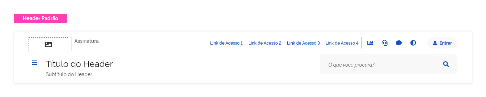

---

## Uso

O _Header_ (Cabeçalho) é utilizado para identificar e concentrar as principais funcionalidades/conteúdos do site ou sistema de acordo com a necessidade, respeitando sempre as regras definidas nesta diretriz, ele é o primeiro item a ser percebido pelo usuário.

---

## Anatomia

O _Header_ (Cabeçalho) é composto por vários componentes (átomos e moléculas) organizados em espaços determinados. É importante notar que **os elementos se repetem nas versões e variações do cabeçalho**, podendo assumir outras formas dependendo do tipo do cabeçalho ou resolução da tela.

A seguir, listamos os grupos de componentes mais frequentemente utilizados:

1. **Logo (Opcional na versão Compacta);**
2. **Assinatura (Opcional);**
3. **Título do Cabeçalho;**
4. **Subtítulo do Cabeçalho (Opcional);**
5. **Ícone Acionar Menu;**
6. **Área para Links (Opcional);**
7. **Área para Funcionalidades (Opcional);**
8. **Botão Acesso GovBr (Opcional);**
9. **Componente Avatar (Opcional);**
10. **Componente Busca (Opcional);**
11. **Lista Dropdown (Componente Lista) (Opcional).**

### Cabeçalho Padrão

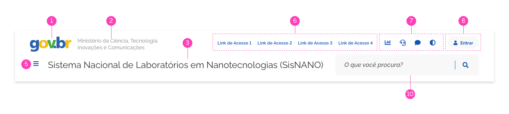

### Cabeçalho Compacto

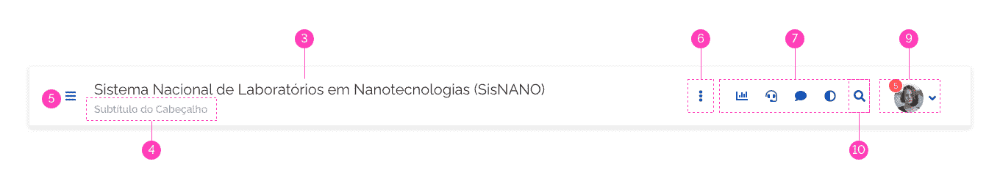

### Cabeçalho Mobile

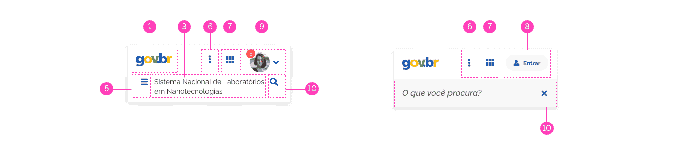

### Lista Dropdown (Componente Lista)

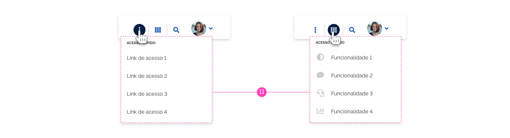

**Atenção:** Nem sempre é necessária a utilização de todos os componentes listados nesse manual porém, em caso de necessidade de inserção de novos componentes no _header_, a equipe de design responsável pelo _Design System_ deverá ser contactada para a realização de um estudo específico para este fim.

---

### Detalhamento dos elementos

O _Header_ (Cabeçalho) é dividido em onze elementos principais. Neste tópico, exploramos cada um desses elementos com mais detalhes:

#### 1. Logo/Marca (Opcional na versão Compacta)

Existem três tamanhos padrão para a logo:

1. **_Large_**: Usado nos _Headers_ tipo Padrão (Grid de 12 e 8 colunas);
   

2. **_Medium_**: Usado apenas na versão mobile (Grid de 4 colunas);
   

3. **_Small_**: Usado nos _Headers_ do tipo Compacto (Grid de 12 e 8 colunas) e Sticky Headers.

**A logo é opcional** na versão do **Cabeçalho tipo Compacto**, como demonstrado nos exemplos abaixo:

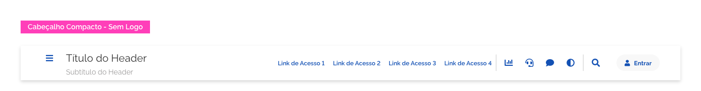

#### 2. Assinatura (Opcional)

A assinatura serve para identificar uma subcategoria ou descrição relacionada à marca. Descreve uma categoria superior ao título do cabeçalho. Fica localizada ao lado da logo/marca.

##### Com Assinatura

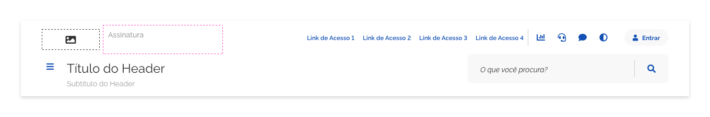

##### Sem Assinatura

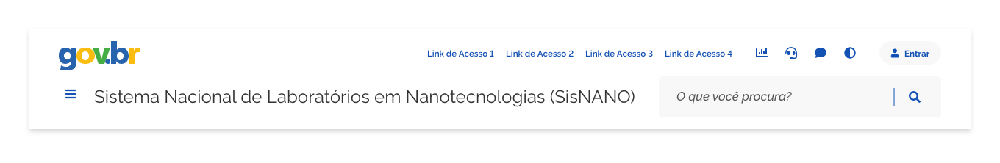

**IMPORTANTE** - É importante notar que a assinatura **permanece obrigatoriamente oculta** em variações **mobile** (Grid de 4 colunas) e **versões do Sticky Header**, como observa-se no exemplo abaixo:

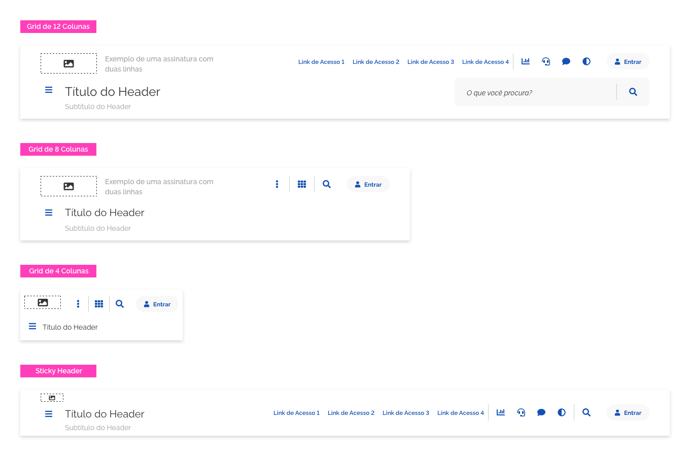

#### 3. Título do Cabeçalho

O _Header_ (Cabeçalho) deve sempre possuir um título que o identifique, ou em casos de páginas internas, que identifique a página atual.

##### Comportamento - Tamanho da Fonte

O tamanho da tipografia no título do _Header_ (Cabeçalho) muda conforme se adequa às diferentes resoluções e Grids. Essas mudanças ocorrem nas mudanças de _Breakpoints_.

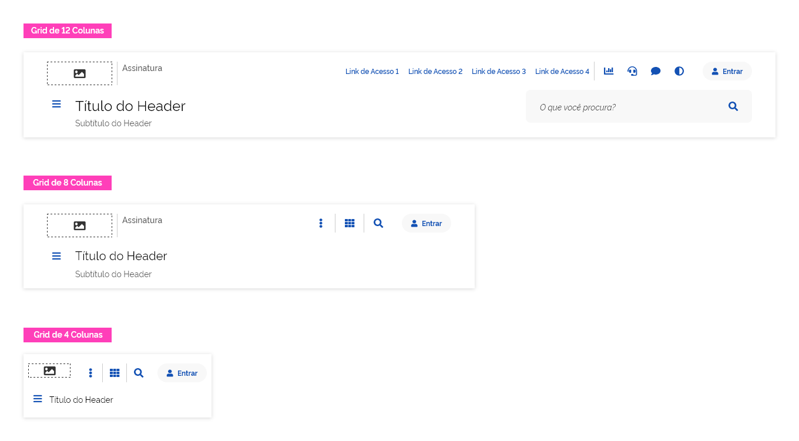

**OBS:** Consulte os tamanhos das fontes tipográficas na seção **_Design Tokens > Tipografia_**.

###### Comportamento - Quantidade de Caracteres

O título do _Header_ (Cabeçalho) poderá variar bastante na quantidade de caracteres. Tendo em vista este aspecto essencial, o _Header_ (Cabeçalho) poderá suportar **no máximo até duas linhas de caracteres**, não podendo ultrapassar este limite. Em casos extremos e raros, quando o título ultrapassar a quantidade de caracteres superior a duas linhas, este deverá ser **truncado e adicionado três pontinhos (...)** ao seu final. Observe os exemplos abaixo:

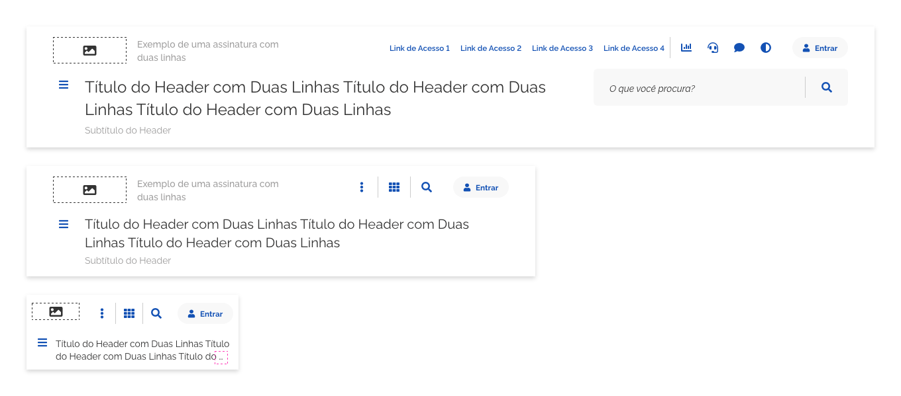

**OBS:** No exemplo acima, na versão para Smartphone, ocorreu o truncamento do título.

É importante salientar que quando o título do _Header_ (Cabeçalho) cresce para duas linhas a altura do cabeçalho acompanha o crescimento na vertical em todas as versões e resoluções do mesmo.

**IMPORTANTE:** Consulte na seção **_Design Tokens > Dimensões_**, as mudanças na altura do _Header_ (Cabeçalho) em decorrência do número de linhas.

O mesmo comportamento ocorre com a **versão Compacta do _Header_ (Cabeçalho)**.

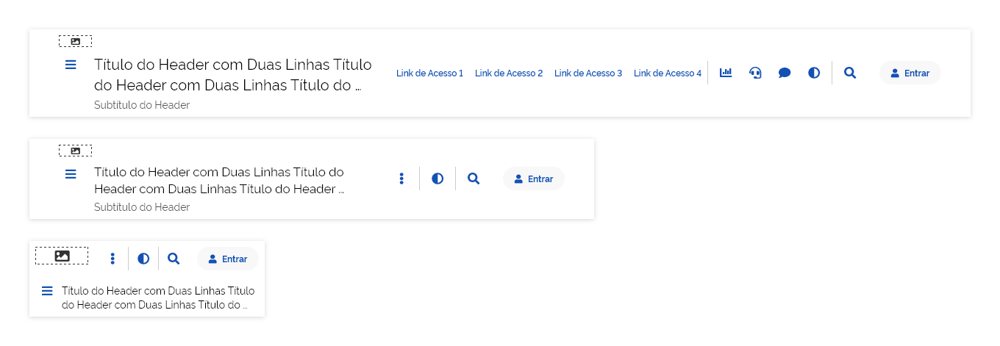

**IMPORTANTE:** Consulte na seção **_Design Tokens > Dimensões_**, as mudanças na altura do _Header_ (Cabeçalho) em decorrência do número de linhas.

O mesmo comportamento ocorre quando o **_Título_** vem acompanhado do **_Subtítulo_**. Veja abaixo:

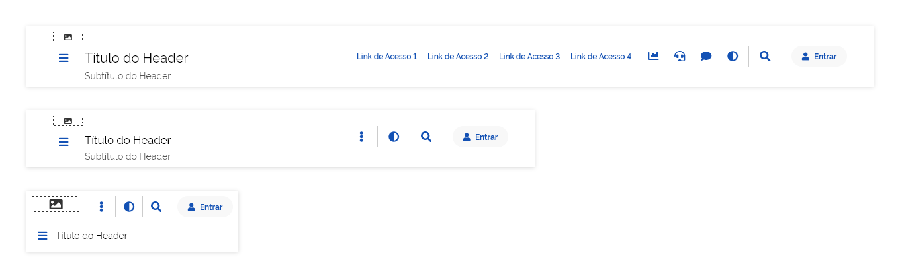

**IMPORTANTE:** Consulte na seção **_Design Tokens > Dimensões_**, as mudanças na altura do _Header_ (Cabeçalho) em decorrência do número de linhas.

#### 4. Subtítulo do Cabeçalho (Opcional)

Serve para reforçar a identificação de uma categoria associada ao título da página, ou descrição do mesmo. Fica localizado logo abaixo do título principal do cabeçalho.

Observe abaixo a utilização do _Subtítulo do Cabeçalho_ nas diferentes resoluções.

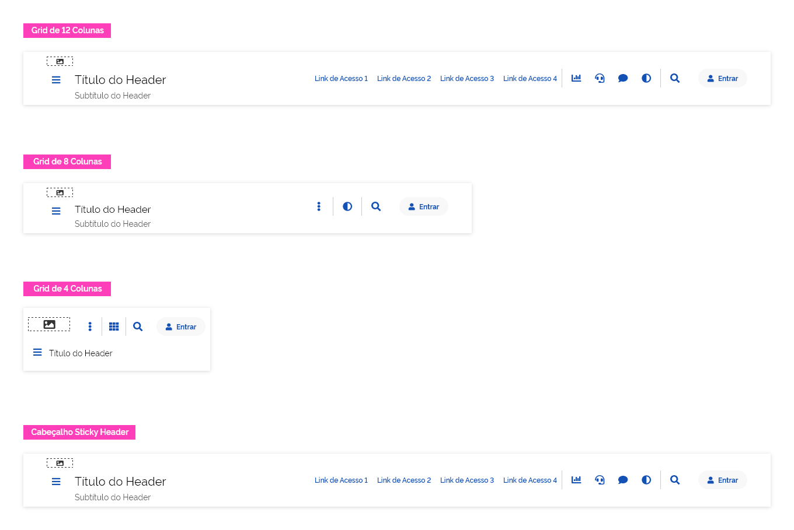

**IMPORTANTE** - É importante notar que o _Subtítulo do Cabeçalho_ **permanece obrigatoriamente oculto** nas **versões mobile** (Grid de 4 Colunas).

#### 5. Ícone Acionar Menu

Este ícone acessa o menu da navegação principal do _site_/sistema, de acordo com a imagem seguinte:

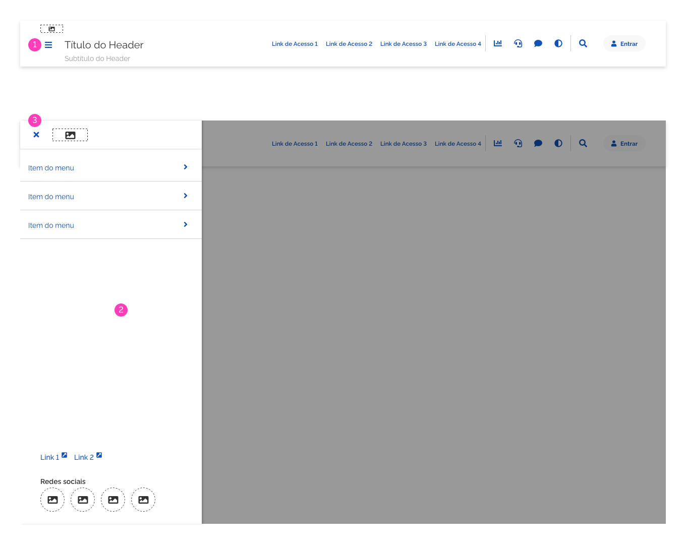

1. Ícone de acesso ao Menu Principal;
2. Menu Principal;
3. Ícone de fechamento do Menu Principal.

**Atenção:** Ao ser aberto, o Menu Principal utilizar o componente _Scrim_ para bloquear a tela e chamar a atenção do usuário somente para os ítens do menu. Por favor consulte as especificações do componente Menu para mais detalhes de sua utilização.

#### 6. Área para Links (Opcional)

Trata-se de links de apoio. Devem ser usados apenas quando fizerem parte do contexto ou tema tratado no Site/Sistema. Neste caso, apontarão para sítios ou sistemas externos.

Quando a quantidade de links não couber no espaço horizontal em decorrência do tamanho do título, número de links, ou resolução da tela, estes devem ser acessados através da **Lista Dropdown**. Veja o exemplo abaixo com suas variações:

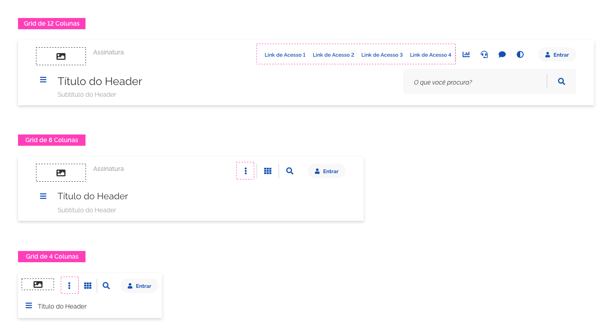

##### Lista Dropdown

O usuário deverá clicar sobre o ícone **ellipsis-v** e uma **Lista Dropdown** aparecerá flutuando sobre o conteúdo. Este elemento corresponde ao **Componente Lista**. Observe o modelo abaixo:

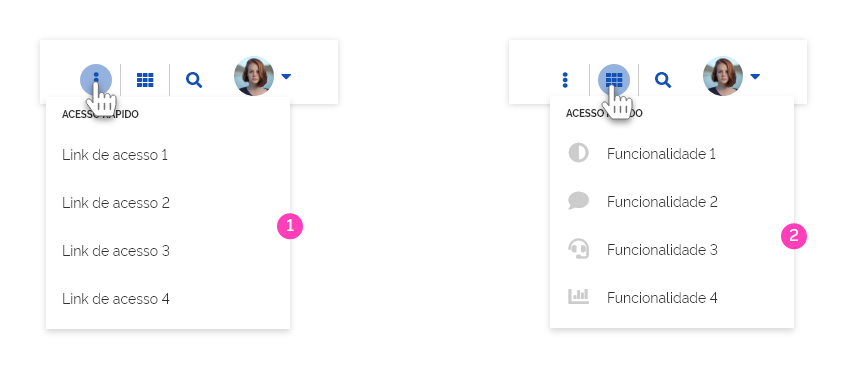

**1 -** Componente Lista Densidade para **Desktop**.
**2 -** Componente Lista Densidade para **Mobile**.

**OBS:** No Componente Lista foi adicionado uma sombra para agregar contraste entre o elemento e a tela ao fundo. Vejas as especificações na seção **Design Tokens**. Para mais detalhes a respeito do Componente Lista consulte a documentação específica deste componente.

#### 7. Área para Funcionalidades (Opcional)

São itens opcionais e devem ser utilizados quando houver necessidades específicas em cada Site/Sistema.

Quando a quantidade de ícones não couber no espaço horizontal em decorrência do tamanho do título, número de funcionalidades, ou resolução da tela, estes devem ser acessados através da **Lista Dropdown**.

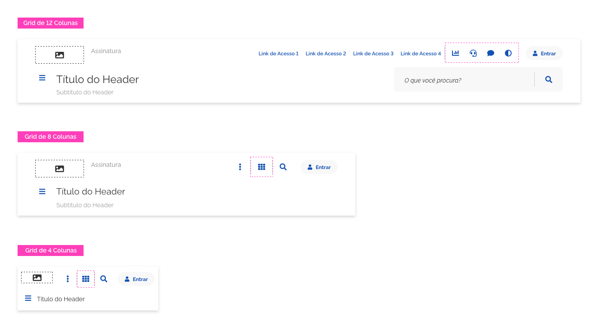

##### Lista Dropdown

O usuário deverá clicar sobre o ícone **th** e uma **Lista Dropdown** aparecerá flutuando sobre o conteúdo. Este elemento corresponde ao **Componente Lista**. Observe o modelo abaixo:

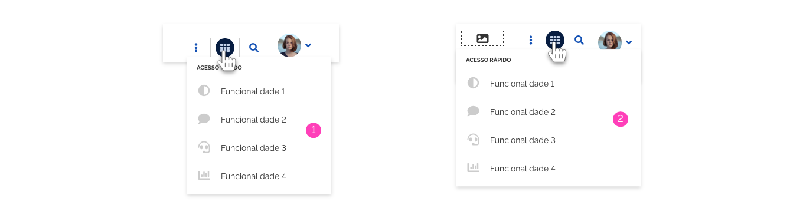

**1 -** Componente Lista Densidade para **Desktop**.
**2 -** Componente Lista Densidade para **Mobile**.

#### 8. Botão Acesso GovBr (Opcional)

O Botão Acesso GovBr fica localizado no canto direito do Cabeçalho e através dele o usuário poderá realizar os passos de autenticação no ambiente GovBr.

Este Botão é apresentado apenas quando o usuário estiver deslogado. Após o login, ele será substituído pelo _Componente Avatar_.

Veja os exemplos abaixo para Desktop e Mobile:

#### 9. Componente Avatar (Opcional)

O Avatar do Usuário consiste em uma imagem (ou ícone, caso o usuário não tenho escolhido uma foto para representá-lo no ambiente virtual) e dá acesso a algumas ferramentas úteis à configuração do usuário e notificações do sistema. **Este elemento só será apresentado quando o usuário estiver logado** no ambiente GovBr. A opção de _Logout_ ou _Sair_ ficará disponível no Menu Dropdown após o clique no _Componente Avatar_.

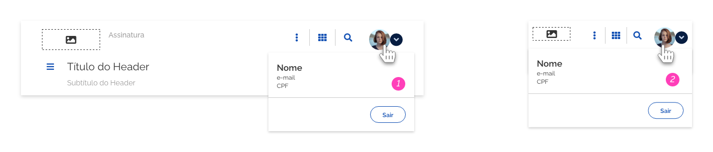

**1 -** Componente Lista Densidade para **Desktop**.
**2 -** Componente Lista Densidade para **Mobile**.

Há disponível um documento com maiores detalhes do componente Avatar. Por favor consulte-o para mais detalhes.

#### 10. Componente Busca (Opcional)

Através do Componente Busca o usuário poderá realizar pesquisa no Site/Sistema por palavra-chave. Este elemento é opcional e deve ser usado de acordo com a necessidade de cada Site/Sistema. Abaixo seguem os exemplos de visualização do Componente Busca no Cabeçalho para Desktop, Tablet e Smartphone.

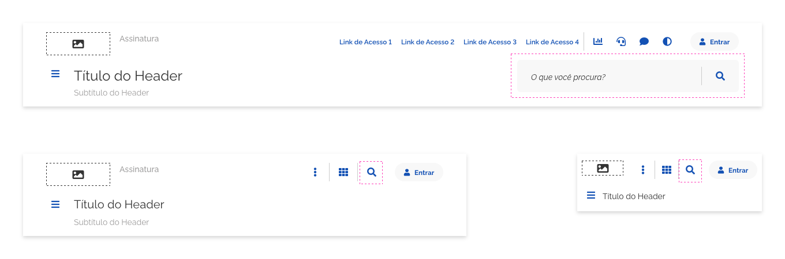

-   Para mais detalhes sobre anatomia deste componente, verifique a documentação específica do mesmo.

-   Para detalhes sobre o comportamento deste componente, verifique a seção Comportamento.

---

## Tipos

Foram previstos para este _Design System_ dois tipos de _Headers_ (Cabeçalhos), um **Padrão** e outro **Compacto**, como detalhado abaixo:

### Cabeçalho Padrão

Este tipo de cabeçalho é utilizado quando for necessário exibir uma quantidade maior de informações e também quando for necessário dar mais ênfase a marca do site/sistema. Geralmente é mais utilizado em sites ou portais de notícias, mas não é uma exclusividade deste tipo.

#### Cabeçalho Compacto

Este tipo Compacto é mais utilizado quando as informações a serem exibidas forem mais sucintas ou seja necessário dar mais espaço visível à área de conteúdo. Muito utilizado em sistemas, porém não obrigatório.

---

## Comportamento

### 1. Responsividade

O componente _Header_ (Cabeçalho) deve se comportar de forma fluida em relação à resolução de tela utilizada. A seguir ilustramos os _Headers_ (Cabeçalhos) para cada _Grid_ disponível.

**a) Cabeçalho Padrão:**

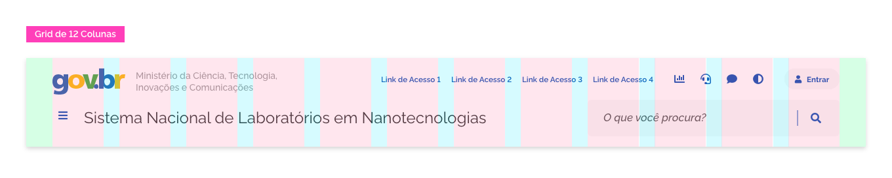

**b) Cabeçalho Compacto:**

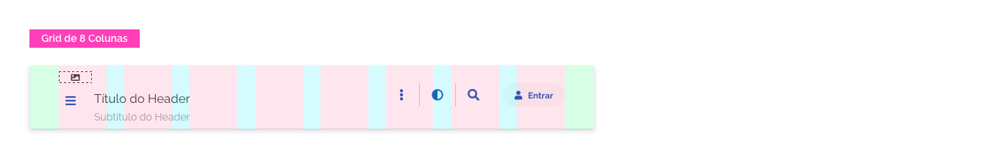

#### 2. Comportamento da Busca

O comportamento da busca varia confome o tipo de _Header_ (Padrão ou Compacto) e a _grid_ utilizada:

a) Em se tratando de _Headers_ (Cabeçalhos) do tipo Padrão, a busca preenche todo o espaço à sua esquerda mas **NÃO** oculta o logo. Ao clicar no botão Fechar, a busca é recolhida.

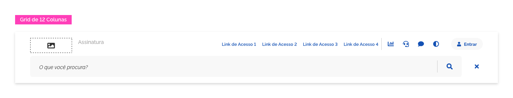

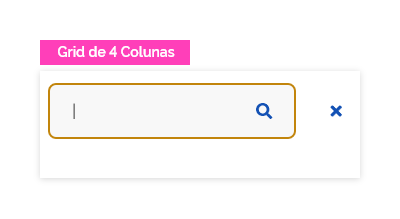

b) Em se tratando de _Headers_ (Cabeçalhos) do tipo Compacto, a busca preenche todo o espaço à sua esquerda e oculta o logo. Ao clicar no botão Fechar, a busca é recolhida.

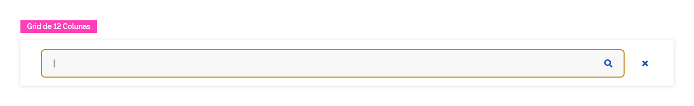

#### 3. Comportamento Logado e Não Logado

Basicamente a diferença estre as duas variações é a substituição do componente **_Botão Acesso GovBr_** pelo componente **_Avatar_** que indica que o usuário está logado.

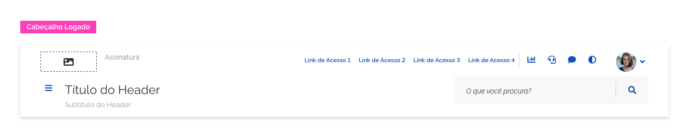

#### 4. Comportamento da Lista Dropdown

A Lista Dropdown aparecerá flutuando sobre o cabeçalho logo abaixo do seu botão de acionamento correspondente. E fechará com um segundo clique no mesmo botão ou clique fora da lista.

##### Lista Dropdown - Desktop e Tablet (Grid de 12 e 8 colunas)

Utilize o Componente Lista com densidade para Desktop.

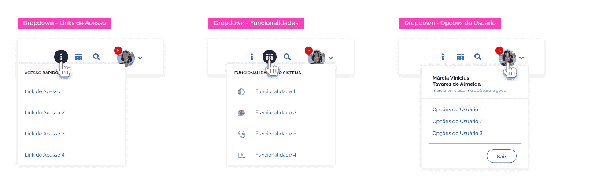

###### Lista Dropdown - Smartphone (Grid de 4 colunas)

Utilize o Componente Lista com densidade para Mobile.

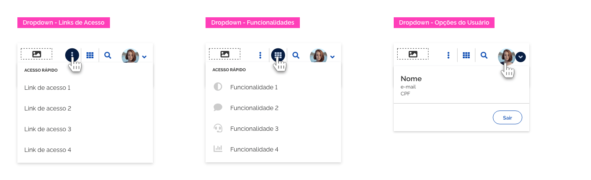

Na versão para Smartphone (Grid de 4 colunas) a Lista Dropdown terá o mesmo comportamento. Desta vez, com o evento _Touch_, a Lista aparecerá com uma formatação apropriada para mobile, como mostra o exemplo acima, ocupando toda largura do dispositivo e flutuando sobre o conteúdo da tela. Para fechá-lo, basta acionar com um _touch_ o mesmo ícone.

#### 5. Comportamento Sticky Header

O comportamento Sticky Header ocorre quando o usuário faz a rolagem da página para cima. Neste momento, o cabeçalho fixa no topo da área visível da página enquanto o conteúdo continua rolando por baixo dele.

Ao rolar a página para baixo, e chegando na posição de topo inicial, o cabeçalho volta a assumir seu estado normal.

Abaixo seguem alguns exemplos do funcionamento do Sticky Header nas versões **Padrão** e **Compacto**:

##### Sticky Header - Cabeçalho Padrão

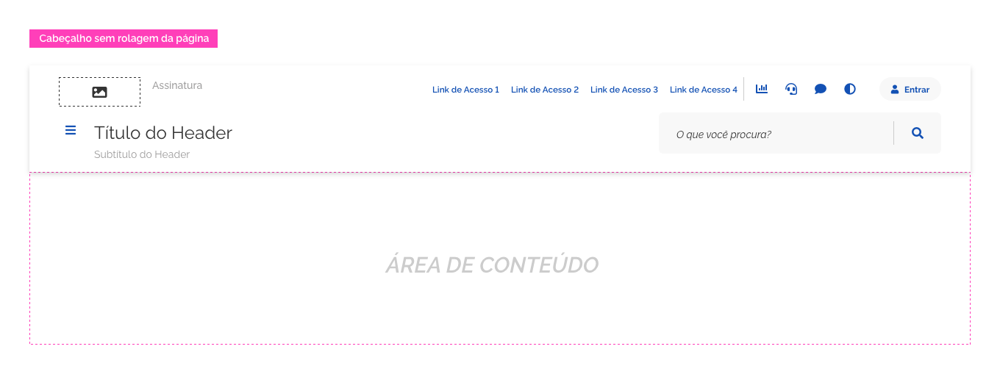

Quando o cabeçalho assume o comportamento Sticky Header, seu formato é **otimizado** e **resumido**, **ocultando a assinatura do cabeçalho**, **reposicionando a _Busca_**, **reduzindo a altura** do mesmo.

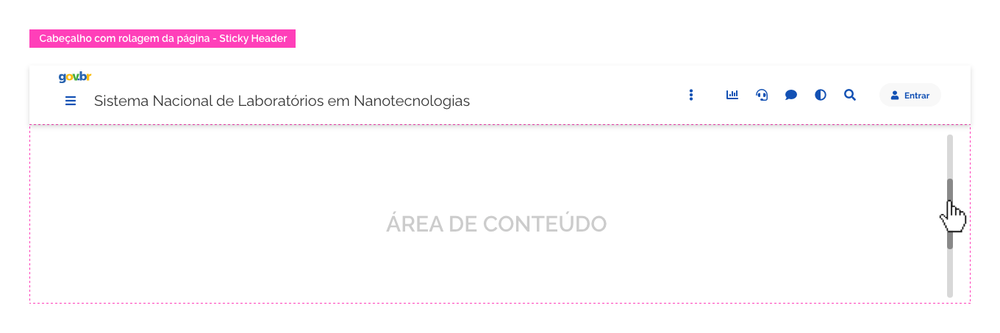

Neste formato, quando a **busca é acionada**, esta assume o formato mostrado abaixo, ocupando toda largura do cabeçalho.

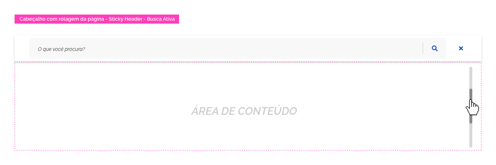

###### Sticky Header - Cabeçalho Compacto

O comportamento do **Sticky Header na versão Compacta do Cabeçalho**, ocorre da mesma forma que na versão Padrão. Com a rolagem da página, o Cabeçalho fixará no topo da tela e o conteúdo passará por baixo dele. Ao rolar a página para o estado inicial, o Cabeçalho assumirá seu estado normal.

**A única diferença** é que na versão Compacta o Cabeçalho **não muda de formato**, tendo em vista que esta versão já é bastante otimizada. Logo, todos os elementos do Cabeçalho na versão Compacta permanecerão do mesmo jeito com o Sticky Header ativo.

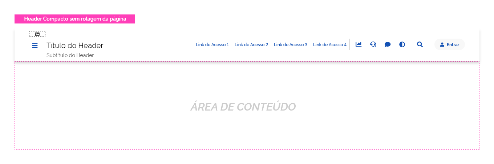

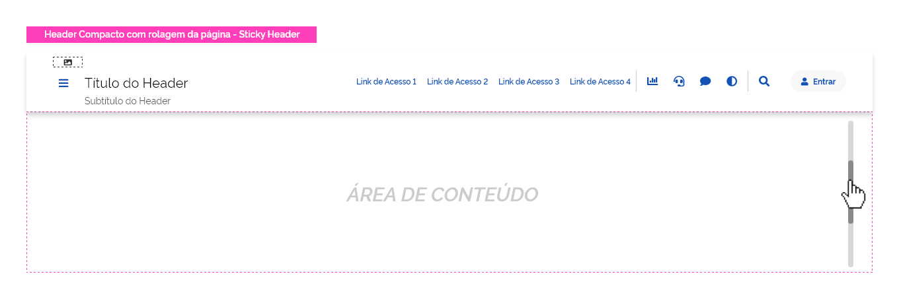

Com a **Busca ativa**, o campo de pesquisa ocupará toda largura do Cabeçalho.

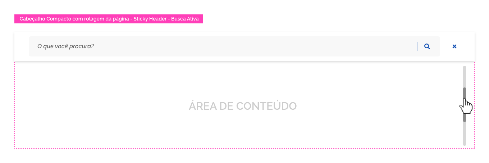

**IMPORTANTE** - Para mais detalhamentos a respeito de **dimensões** e **espaçamentos** do comportamento **_Sticky Header_**, consulte a seção **_Design Tokens_**.

---

## Design Tokens

### Tipografia

| Name                         | Size                        | Weight                  | Text-transform |
| ---------------------------- | --------------------------- | ----------------------- | -------------- |
| Título (12 colunas) Padrão   | `--font-size-scale-up-03`   | `--font-weight-regular` | uppercase      |
| Título (12 colunas) Compacto | `--font-size-scale-up-02`   | `--font-weight-regular` | uppercase      |
| Título (8 colunas) Padrão    | `--font-size-scale-up-02`   | `--font-weight-regular` | uppercase      |
| Título (8 colunas) Compacto  | `--font-size-scale-up-01`   | `--font-weight-regular` | uppercase      |
| Título (4 colunas) Padrão    | `--font-size-scale-up-base` | `--font-weight-regular` | uppercase      |
| Título (4 colunas) Compacto  | `--font-size-scale-up-base` | `--font-weight-regular` | uppercase      |
| Texto (Infos Adicionais)     | `--font-size-scale-down-01` | `--font-weight-regular` | uppercase      |
| _Placeholder_ (Busca)        | `--font-size-scale-up-01`   | `--font-weight-medium`  | lowercase      |
| Assinatura                   | `--font-size-scale-base`    | `--font-weight-medium`  | lowercase      |
| Subtítulo (12 colunas)       | `--font-size-scale-base`    | `--font-weight-medium`  | lowercase      |
| Subtítulo (8 colunas)        | `--font-size-scale-down-01` | `--font-weight-medium`  | lowercase      |

### Iconografia (12 e 8 colunas)

| Name                              | ícone                             | Size               | Class (Font Awesome) |
| --------------------------------- | --------------------------------- | ------------------ | -------------------- |
| Acessar Menu Principal (Compacto) | <i class="fas fa-bars"></i>       | `--icon-size-base` | fa-bars              |
| Acessar Menu Principal (Padrão)   | <i class="fas fa-bars"></i>       | `--icon-size-base` | fa-bars              |
| Ícones Funcionalidades            | <i class="fas fa-th"></i>         | `--icon-size-base` | fa-th                |
| Pesquisar Padrão (12 colunas)     | <i class="fas fas fa-search"></i> | `--icon-size-base` | fa-search            |
| Pesquisar Compacto (12 colunas)   | <i class="fas fas fa-search"></i> | `--icon-size-base` | fa-search            |
| Pesquisar Padrão (8 colunas)      | <i class="fas fas fa-search"></i> | `--icon-size-base` | fa-search            |
| Pesquisar Compacto (8 colunas)    | <i class="fas fas fa-search"></i> | `--icon-size-base` | fa-search            |
| Fechar (Busca)                    | <i class="fas fas fa-times"></i>  | `--icon-size-2x`   | fa-times             |

### Iconografia (4 colunas)

| Name                              | ícone                                 | Size               | Class (Font Awesome) |
| --------------------------------- | ------------------------------------- | ------------------ | -------------------- |
| Acessar Menu Principal (Padrão)   | <i class="fas fa-bars"></i>           | `--icon-size-base` | fa-bars              |
| Acessar Menu Principal (Compacto) | <i class="fas fa-bars"></i>           | `--icon-size-base` | fa-bars              |
| Ícones Funcionalidades            | <i class="fas fa-th"></i>             | `--icon-size-base` | fa-th                |
| Pesquisar                         | <i class="fas fas fa-search"></i>     | `--icon-size-base` | fa-search            |
| Ícone Links                       | <i class="fas fas fa-ellipsis-v"></i> | `--icon-size-base` | fa-ellipsis-v        |
| Fechar (Busca)                    | <i class="fas fas fa-times"></i>      | `--icon-size-base` | fa-times             |

### Cor

| Name                  | Property   | Color Token               | Posição/Blur  | Opacidade |
| --------------------- | ---------- | ------------------------- | ------------- | --------- |
| Título                | text color | `--color-secondary-08`    | -             | -         |
| Subtítulo             | text color | `--color-secondary-05`    | -             | -         |
| Assinatura            | text color | `--color-secondary-05`    | -             | -         |
| Links                 | text color | `--color-primary-default` | -             | -         |
| _Placeholder_ (Busca) | text color | `--color-secondary-07`    | -             | -         |
| Todos os ícones       | icon       | `--color-primary-default` | -             | -         |
| Container (_Header_)  | Background | `--color-secondary-01`    | -             | -         | - |
| Container (Busca)     | Background | `--color-secondary-02`    | -             | -         |
| Container (_Header_)  | Shadow     | `--color-secondary-09`    | `x=0 y=3 b=6` | `16%`     |
| Lista Dropdown        | Shadow     | `--color-secondary-09`    | `x=0 y=0 b=7` | `16%`     |

### Espaçamento (12 colunas)

| Name                                                            | Property      | Value                                                                                 |
| --------------------------------------------------------------- | ------------- | ------------------------------------------------------------------------------------- |
| Logo Cabeçalho Padrão (Large)                                   | margin-top    | `16px`                                                                                |
| Logo Cabeçalho Padrão (Large)                                   | margin-left   | `40px`                                                                                |
| Logo Cabeçalho Compacto (Small)                                 | margin-top    | `8px`                                                                                 |
| Logo Cabeçalho Compacto (Small)                                 | margin-left   | `40px`                                                                                |
| Logo Cabeçalho Padrão - Sticky Header (Small)                   | margin-top    | `8px`                                                                                 |
| Logo Cabeçalho Padrão - Sticky Header (Small)                   | margin-left   | `40px`                                                                                |
| Logo Cabeçalho Compacto - Sticky Header (Small)                 | margin-top    | `8px`                                                                                 |
| Logo Cabeçalho Compacto - Sticky Header (Small)                 | margin-left   | `40px`                                                                                |
| Ícone Acessar Menu Principal (Cabeçalho Padrão)                 | margin-top    | `16px`                                                                                |
| Ícone Acessar Menu Principal (Cabeçalho Padrão)                 | margin-left   | `40px`                                                                                |
| Ícone Acessar Menu Principal (Cabeçalho Compacto)               | margin-top    | `8px`                                                                                 |
| Ícone Acessar Menu Principal (Cabeçalho Compacto)               | margin-left   | `40px`                                                                                |
| Ícone Acessar Menu Principal - Sticky Header (Cabeçalho Padrão) | margin-top    | `8px`                                                                                 |
| Ícone Acessar Menu Principal - Sticky Header (Cabeçalho Padrão) | margin-left   | `40px`                                                                                |
| Avatar (Cabeçalho Padrão)                                       | margin-top    | `8px`                                                                                 |
| Avatar (Cabeçalho Padrão)                                       | margin-right  | `40px`                                                                                |
| Avatar (Cabeçalho Compacto)                                     | margin-top    | `centralizado vertical`                                                               |
| Avatar (Cabeçalho Compacto)                                     | margin-bottom | `centralizado vertical`                                                               |
| Avatar (Cabeçalho Compacto)                                     | margin-right  | `40px`                                                                                |
| Avatar Sticky Header (Cabeçalho Padrão)                         | margin-right  | `40px`                                                                                |
| Avatar Sticky Header (Cabeçalho Padrão)                         | margin-top    | `centralizado vertical no Cabeçalho`                                                  |
| Avatar Sticky Header (Cabeçalho Padrão)                         | margin-bottom | `centralizado vertical no Cabeçalho`                                                  |
| Área Funcionalidades (Cabeçalho Padrão)                         | margin-top    | `16px`                                                                                |
| Área Funcionalidades (Cabeçalho Padrão)                         | margin-left   | `24px`                                                                                |
| Área Funcionalidades (Cabeçalho Padrão)                         | margin-right  | `24px`                                                                                |
| Ícones Funcionalidades (Cabeçalho Padrão)                       | margin-top    | `16px`                                                                                |
| Ícones Funcionalidades (Cabeçalho Padrão)                       | margin-left   | `8px`                                                                                 |
| Ícones Funcionalidades (Cabeçalho Padrão)                       | margin-right  | `8px`                                                                                 |
| Área Funcionalidades (Cabeçalho Compacto)                       | margin-top    | `centralizado vertical`                                                               |
| Área Funcionalidades (Cabeçalho Compacto)                       | margin-bottom | `centralizado vertical`                                                               |
| Área Funcionalidades (Cabeçalho Compacto)                       | margin-left   | `24px`                                                                                |
| Área Funcionalidades (Cabeçalho Compacto)                       | margin-right  | `24px`                                                                                |
| Ícones Funcionalidades (Cabeçalho Compacto)                     | margin-top    | `centralizado vertical`                                                               |
| Ícones Funcionalidades (Cabeçalho Compacto)                     | margin-bottom | `centralizado vertical`                                                               |
| Ícones Funcionalidades (Cabeçalho Compacto)                     | margin-right  | `8px`                                                                                 |
| Ícones Funcionalidades (Cabeçalho Compacto)                     | margin-left   | `8px`                                                                                 |
| Área Funcionalidades Sticky Header (Cabeçalho Compacto)         | margin-top    | `centralizado vertical`                                                               |
| Área Funcionalidades Sticky Header (Cabeçalho Compacto)         | margin-bottom | `centralizado vertical`                                                               |
| Área Funcionalidades Sticky Header (Cabeçalho Compacto)         | margin-left   | `24px`                                                                                |
| Área Funcionalidades Sticky Header (Cabeçalho Compacto)         | margin-right  | `24px`                                                                                |
| Ícones Funcionalidades Sticky Header (Cabeçalho Padrão)         | margin-left   | `8px`                                                                                 |
| Ícones Funcionalidades Sticky Header (Cabeçalho Padrão)         | margin-right  | `8px`                                                                                 |
| Ícones Funcionalidades Sticky Header (Cabeçalho Padrão)         | margin-top    | `centralizado vertical no Cabeçalho`                                                  |
| Ícones Funcionalidades Sticky Header (Cabeçalho Padrão)         | margin-bottom | `centralizado vertical no Cabeçalho`                                                  |
| Área Links (Cabeçalho Padrão)                                   | margin-top    | `centralizado vertical com Funcionalidades`                                           |
| Área Links (Cabeçalho Padrão)                                   | margin-bottom | `centralizado vertical com Funcionalidades`                                           |
| Área Links (Cabeçalho Padrão)                                   | margin-left   | `24px`                                                                                |
| Área Links (Cabeçalho Padrão)                                   | margin-right  | `24px`                                                                                |
| Links (Cabeçalho Padrão)                                        | margin-top    | `centralizado vertical com Funcionalidades`                                           |
| Links (Cabeçalho Padrão)                                        | margin-bottom | `centralizado vertical com Funcionalidades`                                           |
| Links (Cabeçalho Padrão)                                        | margin-left   | `16px`                                                                                |
| Links (Cabeçalho Padrão)                                        | margin-right  | `16px`                                                                                |
| Área Links (Cabeçalho Compacto)                                 | margin-top    | `centralizado vertical com Cabeçalho`                                                 |
| Área Links (Cabeçalho Compacto)                                 | margin-bottom | `centralizado vertical com Cabeçalho`                                                 |
| Área Links (Cabeçalho Compacto)                                 | margin-left   | `24px`                                                                                |
| Área Links (Cabeçalho Compacto)                                 | margin-right  | `24px`                                                                                |
| Links (Cabeçalho Compacto)                                      | margin-top    | `centralizado vertical com Cabeçalho`                                                 |
| Links (Cabeçalho Compacto)                                      | margin-bottom | `centralizado vertical com Cabeçalho`                                                 |
| Links (Cabeçalho Compacto)                                      | margin-left   | `16px`                                                                                |
| Links (Cabeçalho Compacto)                                      | margin-right  | `16px`                                                                                |
| Área Links Sticky Header (Cabeçalho Padrão)                     | margin-top    | `centralizado vertical com Cabeçalho`                                                 |
| Área Links Sticky Header (Cabeçalho Padrão)                     | margin-bottom | `centralizado vertical com Cabeçalho`                                                 |
| Área Links Sticky Header (Cabeçalho Padrão)                     | margin-left   | `24px`                                                                                |
| Área Links Sticky Header (Cabeçalho Padrão)                     | margin-right  | `24px`                                                                                |
| Links Sticky Header (Cabeçalho Padrão)                          | margin-right  | `16px`                                                                                |
| Links Sticky Header (Cabeçalho Padrão)                          | margin-left   | `16px`                                                                                |
| Links Sticky Header (Cabeçalho Padrão)                          | margin-top    | `centralizado vertical no Cabeçalho`                                                  |
| Links Sticky Header (Cabeçalho Padrão)                          | margin-bottom | `centralizado vertical no Cabeçalho`                                                  |
| Botão Acesso Gov (Cabeçalho Padrão)                             | margin-left   | `24px`                                                                                |
| Botão Acesso Gov (Cabeçalho Padrão)                             | margin-right  | `40px`                                                                                |
| Botão Acesso Gov (Cabeçalho Padrão)                             | margin-top    | `16px`                                                                                |
| Botão Acesso Gov (Cabeçalho Compacto)                           | margin-left   | `24px`                                                                                |
| Botão Acesso Gov (Cabeçalho Compacto)                           | margin-right  | `40px`                                                                                |
| Botão Acesso Gov (Cabeçalho Compacto)                           | margin-top    | `centralizado vertical com Cabeçalho`                                                 |
| Botão Acesso Gov (Cabeçalho Compacto)                           | margin-bottom | `centralizado vertical com Cabeçalho`                                                 |
| Busca (Cabeçalho Padrão)                                        | margin-right  | `40px`                                                                                |
| Busca (Cabeçalho Padrão)                                        | margin-top    | `16px`                                                                                |
| Busca (Cabeçalho Compacto)                                      | margin-top    | `centralizado vertical com Cabeçalho`                                                 |
| Busca (Cabeçalho Compacto)                                      | margin-bottom | `centralizado vertical com Cabeçalho`                                                 |
| Busca (Cabeçalho Compacto)                                      | margin-left   | `8px`                                                                                 |
| Busca (Cabeçalho Compacto)                                      | margin-right  | `24px`                                                                                |
| Busca Sticky Header (Cabeçalho Padrão)                          | margin-right  | `24px`                                                                                |
| Busca Sticky Header (Cabeçalho Padrão)                          | margin-left   | `8px`                                                                                 |
| Busca Sticky Header (Cabeçalho Padrão)                          | margin-top    | `centralizado vertical no Cabeçalho`                                                  |
| Busca Sticky Header (Cabeçalho Padrão)                          | margin-bottom | `centralizado vertical no Cabeçalho`                                                  |
| Título (Cabeçalho Padrão)                                       | margin-left   | `16px`                                                                                |
| Título (Cabeçalho Padrão)                                       | margin-bottom | `centralizado vertical com Ícone Menu Principal`                                      |
| Título (Cabeçalho Padrão)                                       | margin-top    | `centralizado vertical com Ícone Menu Principal`                                      |
| Título (Cabeçalho Compacto)                                     | margin-left   | `16px`                                                                                |
| Título (Cabeçalho Compacto)                                     | margin-bottom | `centralizado vertical com Ícone Menu Principal`                                      |
| Título (Cabeçalho Compacto)                                     | margin-top    | `centralizado vertical com Ícone Menu Principal`                                      |
| Subtítulo                                                       | margin-left   | `16px`                                                                                |
| Subtítulo                                                       | margin-top    | `4px para o título e centralizado vertical junto com o Título na altura do cabeçalho` |
| Subtítulo                                                       | margin-bottom | `centralizado vertical junto com o Título na altura do cabeçalho`                     |
| Assinatura                                                      | margin-left   | `16px`                                                                                |
| Assinatura                                                      | margin-top    | `centralizado vertical com a logo`                                                    |
| Assinatura                                                      | margin-bottom | `centralizado vertical com a logo`                                                    |

### Espaçamento (8 colunas)

| Name                                              | Property      | Value                                                                                 |
| ------------------------------------------------- | ------------- | ------------------------------------------------------------------------------------- |
| Logo Cabeçalho Padrão (Large)                     | margin-top    | `16px`                                                                                |
| Logo Cabeçalho Padrão (Large)                     | margin-left   | `40px`                                                                                |
| Logo Cabeçalho Compacto (Small)                   | margin-top    | `8px`                                                                                 |
| Logo Cabeçalho Compacto (Small)                   | margin-left   | `40px`                                                                                |
| Ícone Acessar Menu Principal (Cabeçalho Padrão)   | margin-top    | `24px`                                                                                |
| Ícone Acessar Menu Principal (Cabeçalho Padrão)   | margin-left   | `40px`                                                                                |
| Ícone Acessar Menu Principal (Cabeçalho Compacto) | margin-top    | `8px`                                                                                 |
| Ícone Acessar Menu Principal (Cabeçalho Compacto) | margin-left   | `40px`                                                                                |
| Avatar (Cabeçalho Padrão)                         | margin-top    | `8px`                                                                                 |
| Avatar (Cabeçalho Padrão)                         | margin-right  | `40px`                                                                                |
| Avatar (Cabeçalho Compacto)                       | margin-top    | `centralizado vertical no Cabeçalho`                                                  |
| Avatar (Cabeçalho Compacto)                       | margin-bottom | `centralizado vertical no Cabeçalho`                                                  |
| Avatar (Cabeçalho Compacto)                       | margin-right  | `40px`                                                                                |
| Área Ícones Funcionalidades (Cabeçalho Padrão)    | margin-top    | `16px`                                                                                |
| Área Ícones Funcionalidades (Cabeçalho Padrão)    | margin-left   | `8px`                                                                                 |
| Área Ícones Funcionalidades (Cabeçalho Padrão)    | margin-right  | `24px`                                                                                |
| Ícones Funcionalidades (Cabeçalho Padrão)         | margin-top    | `16px`                                                                                |
| Ícones Funcionalidades (Cabeçalho Padrão)         | margin-left   | `8px`                                                                                 |
| Ícones Funcionalidades (Cabeçalho Padrão)         | margin-right  | `8px`                                                                                 |
| Área Ícones Funcionalidades (Cabeçalho Compacto)  | margin-top    | `centralizado vertical no Cabeçalho`                                                  |
| Área Ícones Funcionalidades (Cabeçalho Compacto)  | margin-bottom | `centralizado vertical no Cabeçalho`                                                  |
| Área Ícones Funcionalidades (Cabeçalho Compacto)  | margin-left   | `8px`                                                                                 |
| Área Ícones Funcionalidades (Cabeçalho Compacto)  | margin-right  | `24px`                                                                                |
| Ícones Funcionalidades (Cabeçalho Compacto)       | margin-top    | `centralizado vertical no Cabeçalho`                                                  |
| Ícones Funcionalidades (Cabeçalho Compacto)       | margin-bottom | `centralizado vertical no Cabeçalho`                                                  |
| Ícones Funcionalidades (Cabeçalho Compacto)       | margin-right  | `8px`                                                                                 |
| Ícones Funcionalidades (Cabeçalho Compacto)       | margin-left   | `8px`                                                                                 |
| Área Links (Cabeçalho Padrão)                     | margin-top    | `centralizado vertical com Funcionalidades`                                           |
| Área Links (Cabeçalho Padrão)                     | margin-bottom | `centralizado vertical com Funcionalidades`                                           |
| Área Links (Cabeçalho Padrão)                     | margin-left   | `8px`                                                                                 |
| Área Links (Cabeçalho Padrão)                     | margin-right  | `8px`                                                                                 |
| Links (Cabeçalho Padrão)                          | margin-top    | `centralizado vertical com Funcionalidades`                                           |
| Links (Cabeçalho Padrão)                          | margin-bottom | `centralizado vertical com Funcionalidades`                                           |
| Links (Cabeçalho Padrão)                          | margin-left   | `8px`                                                                                 |
| Links (Cabeçalho Padrão)                          | margin-right  | `8px`                                                                                 |
| Área Links (Cabeçalho Compacto)                   | margin-top    | `centralizado vertical com Cabeçalho`                                                 |
| Área Links (Cabeçalho Compacto)                   | margin-bottom | `centralizado vertical com Cabeçalho`                                                 |
| Área Links (Cabeçalho Compacto)                   | margin-left   | `8px`                                                                                 |
| Área Links (Cabeçalho Compacto)                   | margin-right  | `8px`                                                                                 |
| Links (Cabeçalho Compacto)                        | margin-top    | `centralizado vertical no Cabeçalho`                                                  |
| Links (Cabeçalho Compacto)                        | margin-bottom | `centralizado vertical no Cabeçalho`                                                  |
| Links (Cabeçalho Compacto)                        | margin-left   | `8px`                                                                                 |
| Links (Cabeçalho Compacto)                        | margin-right  | `8px`                                                                                 |
| Botão Acesso Gov (Cabeçalho Padrão)               | margin-left   | `24px`                                                                                |
| Botão Acesso Gov (Cabeçalho Padrão)               | margin-right  | `40px`                                                                                |
| Botão Acesso Gov (Cabeçalho Padrão)               | margin-top    | `16px`                                                                                |
| Botão Acesso Gov (Cabeçalho Compacto)             | margin-left   | `24px`                                                                                |
| Botão Acesso Gov (Cabeçalho Compacto)             | margin-right  | `40px`                                                                                |
| Botão Acesso Gov (Cabeçalho Compacto)             | margin-top    | `centralizado vertical no Cabeçalho`                                                  |
| Botão Acesso Gov (Cabeçalho Compacto)             | margin-bottom | `centralizado vertical no Cabeçalho`                                                  |
| Busca (Cabeçalho Padrão)                          | margin-right  | `40px`                                                                                |
| Busca (Cabeçalho Padrão)                          | margin-top    | `24px com a logo`                                                                     |
| Busca (Cabeçalho Compacto)                        | margin-top    | `centralizado vertical no Cabeçalho`                                                  |
| Busca (Cabeçalho Compacto)                        | margin-bottom | `centralizado vertical no Cabeçalho`                                                  |
| Busca (Cabeçalho Compacto)                        | margin-left   | `8px`                                                                                 |
| Busca (Cabeçalho Compacto)                        | margin-right  | `24px`                                                                                |
| Título (Cabeçalho Padrão)                         | margin-left   | `16px`                                                                                |
| Título (Cabeçalho Padrão)                         | margin-bottom | `centralizado vertical com Ícone Menu Principal`                                      |
| Título (Cabeçalho Padrão)                         | margin-top    | `centralizado vertical com Ícone Menu Principal`                                      |
| Título (Cabeçalho Compacto)                       | margin-left   | `16px`                                                                                |
| Título (Cabeçalho Compacto)                       | margin-bottom | `centralizado vertical com Ícone Menu Principal`                                      |
| Título (Cabeçalho Compacto)                       | margin-top    | `centralizado vertical com Ícone Menu Principal`                                      |
| Subtítulo                                         | margin-left   | `16px`                                                                                |
| Subtítulo                                         | margin-top    | `4px para o título e centralizado vertical junto com o Título na altura do cabeçalho` |
| Subtítulo                                         | margin-bottom | `centralizado junto com o Título na altura do cabeçalho`                              |
| Assinatura                                        | margin-left   | `16px`                                                                                |
| Assinatura                                        | margin-top    | `centralizado vertical com a logo`                                                    |
| Assinatura                                        | margin-bottom | `centralizado vertical com a logo`                                                    |

### Espaçamento (4 colunas)

| Name                         | Property      | Value                                           |
| ---------------------------- | ------------- | ----------------------------------------------- |
| Logo (Medium)                | margin-top    | `16px`                                          |
| Logo (Medium)                | margin-left   | `16px`                                          |
| Ícone Acessar Menu Principal | margin-top    | `12px com Funcionalidades`                      |
| Ícone Acessar Menu Principal | margin-left   | `16px`                                          |
| Avatar                       | margin-top    | `8px`                                           |
| Avatar                       | margin-right  | `16px`                                          |
| Avatar                       | margin-left   | `16px`                                          |
| Funcionalidades              | margin-top    | `12px`                                          |
| Funcionalidades              | margin-left   | `8px`                                           |
| Funcionalidades              | margin-right  | `16px`                                          |
| Links                        | margin-top    | `12px`                                          |
| Links                        | margin-right  | `8px`                                           |
| Acesso Gov                   | margin-left   | `16px`                                          |
| Acesso Gov                   | margin-right  | `16px`                                          |
| Acesso Gov                   | margin-top    | `12px`                                          |
| Busca                        | margin-top    | `16px`                                          |
| Título                       | margin-left   | `4px`                                           |
| Título                       | margin-bottom | `centralizado vertical no Ícone Acesso ao Menu` |
| Título                       | margin-top    | `centralizado vertical no Ícone Acesso ao Menu` |

### Dimensões (12 colunas)

| Name                                                    | Property | Value   |
| ------------------------------------------------------- | -------- | ------- |
| Container Cabeçalho Padrão (1 linha)                    | height   | `136px` |
| Container Cabeçalho Padrão (2 linhas)                   | height   | `160px` |
| Container Cabeçalho Compacto (1 linha)                  | height   | `80px`  |
| Container Cabeçalho Compacto (2 linhas)                 | height   | `108px` |
| Container Sticky Header - Cabeçalho Padrão (1 linha)    | height   | `80px`  |
| Container Sticky Header - Cabeçalho Padrão (2 linhas)   | height   | `108px` |
| Container Sticky Header - Cabeçalho Compacto (1 linha)  | height   | `80px`  |
| Container Sticky Header - Cabeçalho Compacto (2 linhas) | height   | `108px` |
| Container Cabeçalho com Subtítulo (1 linha)             | height   | `80px`  |
| Container Cabeçalho com Subtítulo (2 linhas)            | height   | `112px` |
| Container Busca                                         | height   | `56px`  |

### Dimensões (8 colunas)

| Name                                                    | Property | Value   |
| ------------------------------------------------------- | -------- | ------- |
| Container Cabeçalho Padrão (1 linha)                    | height   | `136px` |
| Container Cabeçalho Padrão (2 linhas)                   | height   | `152px` |
| Container Cabeçalho Compacto (1 linha)                  | height   | `80px`  |
| Container Cabeçalho Compacto (2 linhas)                 | height   | `104px` |
| Container Sticky Header - Cabeçalho Padrão (1 linha)    | height   | `80px`  |
| Container Sticky Header - Cabeçalho Padrão (2 linhas)   | height   | `104px` |
| Container Sticky Header - Cabeçalho Compacto (1 linha)  | height   | `80px`  |
| Container Sticky Header - Cabeçalho Compacto (2 linhas) | height   | `104px` |
| Container Cabeçalho com Subtítulo (1 linha)             | height   | `80px`  |
| Container Cabeçalho com Subtítulo (2 linhas)            | height   | `92px`  |
| Container Busca                                         | height   | `56px`  |

**Mudanças na altura do Cabeçalho em decorrência do número de linhas no título:**

#### Cabeçalho Padrão

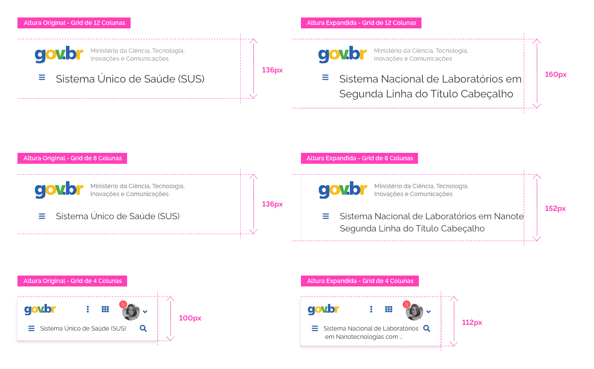

**IMPORTANTE:** Note que o ícone de acionamento do _Menu_ e o _Título do Cabeçalho_ não mudam de posição, apenas o _Título_ cresce para baixo, e o _Container do Cabeçalho_ acompanha o crescimento.

#### Cabeçalho Compacto

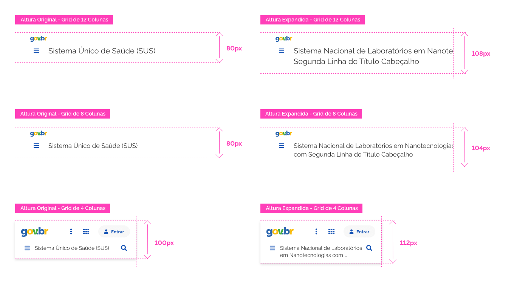

**IMPORTANTE:** Aqui também o ícone de acionamento do _Menu_ e o _Título do Cabeçalho_ não mudam de posição, apenas o _Título_ cresce para baixo, e o _Container do Cabeçalho_ acompanha o crescimento.

#### Cabeçalho com Subtítulo

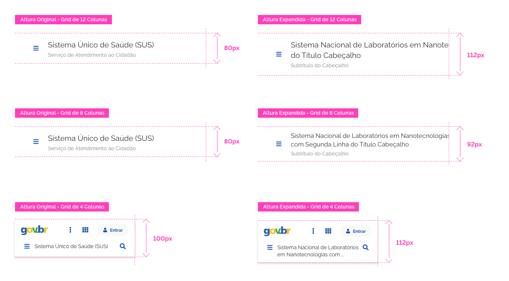

**IMPORTANTE:** Neste caso, o ícone de acionamento do **_Menu_** e o bloco com **_Título_** e **_Subtítulo_** **permanecem centralizados na altura do _Cabeçalho_**. A exceção ocorre na versão Grid de 4 Colunas, quando o comportamento permanece padrão.

### Dimensões (4 colunas)

| Name                                | Property | Value   |
| ----------------------------------- | -------- | ------- |
| Container Cabeçalho (1 linha)       | height   | `100px` |
| Container Cabeçalho (2 linhas)      | height   | `112px` |
| Container Cabeçalho com Busca Ativa | height   | `116px` |
| Container Busca                     | height   | `56px`  |

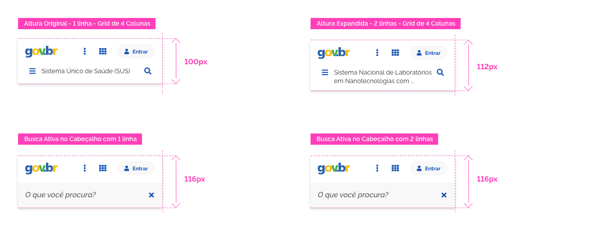
