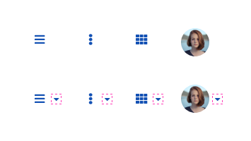

[version]: # (1.1.12)

# *Header* (Cabeçalho)

O componente *Header* é o principal elemento de uma página, onde podem ser agrupados componentes predefinidos que tem como finalidade auxiliar o usuário no acesso ou mesmo execução das funcionalidades principais site/sistema.

Utilize o *Header* quando necessitar identificar o nome do site/sistema, agrupar os elementos de navegação, de funcionalidades e de suporte ao usuário.

*Exemplo de uso do Header*

---

## Anatomia

 1. Logo
 2. Assinatura
 3. Título
 4. Subtítulo
 5. Botão Menu
 6. Área para Links
 7. Área para Funcionalidades
 8. Botão de Autenticar
 9. Avatar do Usuário
10. Busca
11. Lista Dropdown
12. Superfície
13. Separadores

*Anatomia do Header Padrão*

*Anatomia do Header Compacto*

*Anatomia do Header Grid 4 Colunas*

*Anatomia do Dropdown*

---

## Tipos

É possível criar infinidades diferentes de *headers* que atendam diferentes necessidades. Esses "tipos" dependem de como se deseja configurar os elementos que estão previstos neste componente (veja [Detalhe dos Elementos](#detalhe-dos-elementos)).

Recomendamos duas configurações que podem atender a maioria das situações: **Padrão** e **Compacto**.

### Header Padrão

Este tipo de *header* é utilizado quando se pretende exibir uma quantidade maior de informações e também quando for necessário dar mais ênfase a marca do site/sistema. Geralmente é mais utilizado em sites ou portais de notícias, mas não é uma exclusividade deste tipo.

### Header Compacto

O tipo Compacto é mais utilizado quando as informações a serem exibidas forem mais sucintas ou seja necessário dar mais espaço visível à área de conteúdo. Muito utilizado em sistemas, porém não obrigatório.

**Atenção:** por padrão o *header* se encontra na **camada 1** por ser um elemento com relevância e desta forma apresenta sombra suave. Consulte o documento Fundamentos > Elevação para mais detalhes.

---

## Detalhe dos Elementos

### 1. Logo

Existem três tamanhos para a logo. Cada um usado para um nível ênfase determinado:

1. ***Large***: maior ênfase
2. ***Medium***: média ênfase
3. ***Small***: baixa ênfase

**Observação:** Logos (imagens) são limitadas pela a altura. É recomendada que a largura tenha, no máximo, 4x a dimensão da altura (ênfase) escolhida.

***Large***: Usado quando temos espaço disponível e queremos dar maior destaque para marca do sistema/site. Comum no *Header* Padrão (Grid de 12 e 8 colunas);

***Medium***: Usado quando não temos tanto espaço disponível, mas mesmo assim queremos dar destaques para a marca. Comum em versão mobile (Grid de 4 colunas);

***Small***: Usado quando a marca não necessita de tanto destaque em relação a outros elementos, ou temos um espaço muito menor na tela. Comum nos *Headers* do tipo Compacto (Grid de 12 e 8 colunas) e em comportamentos de **Sticky Headers**.

A logo é um elemento **opcional** como demonstrado nos exemplos abaixo:

**Observação:** Recomendamos a utilização do Separador sempre que utilizar algum outro elemento posicionado lado a lado com a Logo, como a Assinatura por exemplo. Isso pode facilitar a leitura e trazer um maior equilíbrio visual dentro do *Header*.

### 2. Assinatura

A assinatura serve para identificar uma subcategoria ou descrição relacionada à marca. Descreve uma categoria superior ao título do cabeçalho. Fica localizada ao lado da logo/marca. É um elemento opcional.

*Header utilizando a assinatura*

*Header sem a assinatura*

**Atenção:** recomendamos que a assinatura **permaneça oculta** em variações **mobile** (Grid de 4 colunas) e no **comportamento do Sticky Header**, como observa-se no exemplo abaixo:

### 3. Título

No *Header* deve sempre existir um título que identifique o site, sistema ou aplicativo. Em alguns dispositivos (como celulares), o título pode identificar a página atual.

Ele é o único elemento obrigatório dentro do *Header*, porém, é possível utilizar um texto ou outro elemento para substituí-lo.

**Observação**: Caso não queira utilizar o Título Textual, utilize o elemento Logo. Podendo ser posicionamento no mesmo local que ficaria o texto.

#### Comportamentos no formato Textual

##### Tamanho da Fonte

O tamanho da tipografia no título do Header muda conforme se adéqua às diferentes resoluções e Grids. Essas mudanças ocorrem nas mudanças de *Breakpoints*.

**OBS:** Consulte os tamanhos das fontes tipográficas na seção ***Design Tokens > Tipografia***.

##### Quantidade de Caracteres

O título do Header poderá variar bastante na quantidade de caracteres. Tendo em vista este aspecto essencial, o Header poderá suportar **no máximo até duas linhas de caracteres**, não podendo ultrapassar este limite. Em casos extremos e raros, quando o título ultrapassar a quantidade de caracteres superior a duas linhas, este deverá ser **truncado e adicionado três pontinhos (...)** ao seu final. Observe os exemplos abaixo:

*No exemplo acima, na versão para celulares, ocorreu o truncamento do título.*

É importante salientar que quando o Título cresce para duas linhas a altura do *header* acompanha o crescimento na vertical.

O mesmo comportamento ocorre com a **versão Compacta do Header**.

O mesmo comportamento ocorre quando o **Título** vem acompanhado do **Subtítulo**. Veja abaixo:

**OBS:** Consulte na seção ***Design Tokens > Dimensões***, as mudanças na altura do Header em decorrência do número de linhas.

### 4. Subtítulo

Serve para reforçar a identificação de uma categoria associada ao título da página, ou descrição do mesmo. Fica localizado logo abaixo do título principal do cabeçalho. É um elemento opcional.

Observe abaixo a utilização do *Subtítulo do Header* em diferentes Grids.

É importante notar que o Subtítulo **permanece obrigatoriamente oculto** nas **versões mobile** (Grid de 4 Colunas).

### 5. Botão Menu

Elemento opcional utilizado para interagir com o componente Menu (para exibir, esconder, retrair ou outro comportamento possível).

*Button usado para acessar o Menu*

### 6. Área para Links

Trata-se de links opcionais de apoio. Devem ser usados apenas quando fizerem parte do contexto ou tema tratado no Site/Sistema. Neste caso, apontarão para sítios ou sistemas externos.

Quando a quantidade de links não couber no espaço horizontal em decorrência do tamanho do título, número de links, ou resolução da tela, estes devem ser acessados através da **Lista Dropdown**. Veja o exemplo abaixo com suas variações:

### 7. Área para Funcionalidades

São itens opcionais e devem ser utilizados quando houver necessidades específicas em cada Site/Sistema.

Quando a quantidade de ícones não couber no espaço horizontal em decorrência do tamanho do título, número de funcionalidades, ou resolução da tela, estes devem ser acessados através da **Lista Dropdown**.

Preferencialmente, utilize o *Button* na versão com densidade alta.

### 8. Botão de Autenticar

O Botão de Autenticar é opcional e fica localizado no canto direito do *Header* e através dele o usuário poderá realizar os passos de autenticação no ambiente GovBr ou no sistema relacionado ([veja Sign-in](/ds/components/signin?tab=designer)).

É apresentado apenas quando o usuário estiver "deslogado". Após o login, ele será substituído pelo Avatar.

Preferencialmente, utilize o *Sign-in* na versão com densidade alta.

### 9. Avatar do Usuário

O Avatar do Usuário é um elemento opcional que consiste em uma imagem (ou ícone, caso o usuário não tenho escolhido uma foto para representá-lo no ambiente virtual) e dá acesso a algumas ferramentas úteis à configuração do usuário e notificações do sistema. **Este elemento só será apresentado quando o usuário estiver autenticado** no ambiente. A opção de *Logout* ou *Sair* ficará disponível no elemento *Dropdown* após o clique/toque no **Componente Avatar**.

*1- Dropdown; 2- Dropdown Mobile.*

Há disponível um documento com maiores detalhes do componente Avatar. Por favor consulte-o para mais detalhes.

### 10. Busca

Através deste *Input* o usuário poderá realizar pesquisa no Site/Sistema por palavra-chave. Este elemento é opcional e deve ser usado de acordo com a necessidade de cada Site/Sistema.

O *Input* foi estilizado para se adaptador as características de um *header*. O detalhe desse novos estilos estão descritos na área de *Especificação*.

Abaixo seguem os exemplos de visualização da Busca no Header para diferentes *breakpoints*.

### 11. Lista *Dropdown*

A lista *dropdown* é utilizada na área para Links e para Funcionalidades.

#### Área para Links

O usuário deverá clicar sobre o ícone `ellipsis-v` e uma **Lista *Dropdown*** aparecerá flutuando sobre o conteúdo. Este elemento corresponde ao **Componente *List***. Observe o modelo abaixo:

*1- Dropdown; 2- Dropdown Mobile.*

#### Área para Funcionalidades

O usuário deverá clicar sobre o ícone `th` e uma **Lista *Dropdown*** aparecerá flutuando sobre o conteúdo. Este elemento corresponde ao **Componente List**. Observe o modelo abaixo:

*1- Dropdown; 2- Dropdown Mobile.*

### 12. Superfície

A superfície foi utilizada para agrupar melhor todos os elementos que compõem o componente *Header*. Ela não possui um altura fixa (somente um espaçamento interno padrão), sendo flexível, se ajustando conforme a distribuição dos elementos internos.

### 13. Separadores

No *Header* utilizamos os separadores para agruparmos a área para Links, área para Funcionalidades e a Ação de busca (quando ele está no formato de botão).

Também são recomendados para serem utilizados em imagens (como a Logo), sempre que existir outro elemento alinhado horizontalmente.

---

## Comportamentos

### 1. Responsividade

O componente *Header* deve se comportar de forma fluida em relação à resolução de tela utilizada. A seguir ilustramos os *Headers* para cada *Grid* disponível.

**Observação:** A superfície do *Header* sempre sangra na Grid (ocupando todo o espaço da margem), independente de qual Grid seja utilizada.

#### Header Padrão

#### Header Compacto

### 2. Densidade

Conforme descrito em [Responsividade](#1-responsividade), o *header* possui um comportamento fluido em relação a grid utilizada, além de utilizar o conceito de sangria na grid. Por tanto, por padrão, o *header* só possui um espaçamento superior e inferior.

Esses espaçamento podem assumir valores pré-definidos para cada tipo de *header* utilizado, podendo ainda sim, ser modificados.

*   **Densidade Alta:** utilizada quando se pretende ocupar menos espaço útil na interface.
*   **Densidade Padrão:** Funciona na maioria dos layouts.
*   **Densidade Baixa:** utilizado quando o *header* precisa se destacar dentro da interface.

### 3. Busca

O comportamento da busca varia conforme o tipo de *Header* e a *grid* utilizada. A seguir algumas sugestões:

#### Grid 12 Colunas na variação Padrão

Em se tratando de Header do tipo Padrão, a busca funciona como um *input* comum.

#### Demais Grids (8 e 4 Colunas) e variações do Header (Padrão e Compacto)

Ao acionar o ícone de "Lupa", o *Header* recebe um contexto de busca, apresentando as seguintes características:

*   Todos os elementos exibidos no Header são ocultados.
*   O *input* preenche todo a largura do Header recebendo o estado *Focus*.
*   Um *Button* circular surge com a ação para "fechar" o *input*.

Quando *Button* fechar é acionado:

*   O *Header* volta para o contexto anterior, voltando todos os elementos que antes eram visíveis.
*   Tanto o *Input* como o *button* desaparecem.

##### Normal

##### Compacto

### 4. Logado e Não Logado

Basicamente a diferença entre as duas variações é a substituição do ***Botão Acesso GovBr*** pelo componente ***Avatar*** que indica que o usuário está logado.

### 5. *Dropdown*

A Lista Dropdown aparecerá flutuando sobre o cabeçalho logo abaixo do seu botão de acionamento correspondente. E fechará com um segundo clique no mesmo botão ou clique fora da lista.

#### *Dropdown* - *Desktop* e *Tablet* (*Grid* de 12 e 8 colunas)

#### *Dropdown* - *Smartphone* (*Grid* de 4 colunas)

Na versão para *Smartphone* (Grid de 4 colunas) a Lista *Dropdown* terá o mesmo comportamento. Desta vez, com o evento *Touch*, a Lista aparecerá com uma formatação apropriada para *mobile*, como mostra o exemplo acima, ocupando toda largura do dispositivo e flutuando sobre o conteúdo da tela. Para fechá-la, basta acionar com um *touch* no mesmo botão.

**Importante!** Nos botões *Acionadores Dropdown*, é opcional a utilização do identificador *Dropdown*. Este posiciona-se à direita do *Acionador* e centralizado verticalmente. Consulte mais detalhes em *Padrões > Dropdown*.

*Exemplos de Botões Acionadores Dropdown - O uso do Identificador é opcional*

### 6. *Sticky Header*

O comportamento *Sticky Header* ocorre quando o usuário faz a rolagem da página para cima. Neste momento, o *header* **fixa no topo** da área visível da página enquanto o conteúdo continua rolando por baixo dele.

Ao rolar a página para baixo, e chegando na posição de topo inicial, o *header* volta a assumir seu comportamento normal.

Quando o *header* possuir o comportamento *sticky* ele deve estar localizado na **camada 3** de elevação e portanto possuir sombras mais pronunciadas que o *header* padrão. Consulte o documento Fundamentos > Elevação para mais detalhes.

**Importante**: neste comportamento é necessário simplificar o conteúdo do *header*, exibindo somente as informações estritamente necessárias.

Abaixo seguem alguns exemplos do funcionamento do *Sticky Header* nas versões **Padrão** e **Compacto**:

#### *Sticky Header* - Padrão

Quando o cabeçalho assume o comportamento *Sticky Header*, seu formato é **otimizado** e **resumido**, **ocultando a assinatura do cabeçalho**, **reposicionando a *Busca***, e consequentemente, reduzindo a altura do mesmo.

Em resumo, ele assume as características de um *header* compacto.

Neste formato, quando a **busca é acionada**, esta assume o formato mostrado abaixo, ocupando toda largura do cabeçalho.

#### Sticky Header - Compacto

**A única diferença** é que na versão Compacta o *Header* **não muda de formato**, tendo em vista que esta versão já é bastante otimizada. Logo, todos os elementos do *Header* na versão Compacta permanecerão do mesmo jeito com o *Sticky Header* ativo.

Com a **Busca ativa**, o campo de pesquisa ocupará toda largura do Cabeçalho.

**Atenção:** sempre que o *header* estiver com o comportamento *sticky* deverá necessariamente utilizar o recurso de sombra, pois o componente passar a pertencer à **camada 3**. Consulte o documento Fundamento > Elevação para entender melhor o conceito de camadas.

---

## Especificação

### Tipografia

| Name                         | Size                        | Weight                    | Outros                      |
| ---------------------------- | --------------------------- | ------------------------- | --------------------------- |
| Título (12 colunas) Padrão   | `--font-size-scale-up-03`   | `--font-weight-regular`   | `text-transform:uppercase;` |
| Título (12 colunas) Compacto | `--font-size-scale-up-02`   | `--font-weight-regular`   | `text-transform:uppercase;` |
| Título (8 colunas) Padrão    | `--font-size-scale-up-02`   | `--font-weight-regular`   | `text-transform:uppercase;` |
| Título (8 colunas) Compacto  | `--font-size-scale-up-01`   | `--font-weight-regular`   | `text-transform:uppercase;` |
| Título (4 colunas) Padrão    | `--font-size-scale-up-base` | `--font-weight-regular`   | `text-transform:uppercase;` |
| Título (4 colunas) Compacto  | `--font-size-scale-up-base` | `--font-weight-regular`   | `text-transform:uppercase;` |
| Texto (Infos Adicionais)     | `--font-size-scale-down-01` | `--font-weight-regular`   | `text-transform:uppercase;` |
| *Placeholder* (Busca)        | `--font-size-scale-up-01`   | `--font-weight-medium`    | `text-transform:lowercase;` |
| Assinatura                   | `--font-size-scale-base`    | `--font-weight-medium`    | `text-transform:lowercase;` |
| Subtítulo (12 colunas)       | `--font-size-scale-base`    | `--font-weight-medium`    | `text-transform:lowercase;` |
| Subtítulo (8 colunas)        | `--font-size-scale-down-01` | `--font-weight-medium`    | `text-transform:lowercase;` |
| Área para Links              | `--font-size-scale-down-01` | `--font-weight-semi-bold` | `text-decoration:none;`     |

### Iconografia (12 e 8 colunas)

| Name                              | ícone                             | Size               | Class (Font Awesome) |
| --------------------------------- | --------------------------------- | ------------------ | -------------------- |
| Acessar Menu Principal (Compacto) | <i class="fas fa-bars"></i>       | `--icon-size-base` | `fa-bars`            |
| Acessar Menu Principal (Padrão)   | <i class="fas fa-bars"></i>       | `--icon-size-base` | `fa-bars`            |
| Ícones Funcionalidades            | <i class="fas fa-th"></i>         | `--icon-size-base` | `fa-th`              |
| Pesquisar Padrão (12 colunas)     | <i class="fas fas fa-search"></i> | `--icon-size-base` | `fa-search`          |
| Pesquisar Compacto (12 colunas)   | <i class="fas fas fa-search"></i> | `--icon-size-base` | `fa-search`          |
| Pesquisar Padrão (8 colunas)      | <i class="fas fas fa-search"></i> | `--icon-size-base` | `fa-search`          |
| Pesquisar Compacto (8 colunas)    | <i class="fas fas fa-search"></i> | `--icon-size-base` | `fa-search`          |
| Fechar (Busca)                    | <i class="fas fas fa-times"></i>  | `--icon-size-2x`   | `fa-times`           |

### Iconografia (4 colunas)

| Name                              | ícone                                 | Size               | Class (Font Awesome) |
| --------------------------------- | ------------------------------------- | ------------------ | -------------------- |
| Acessar Menu Principal (Padrão)   | <i class="fas fa-bars"></i>           | `--icon-size-base` | `fa-bars`            |
| Acessar Menu Principal (Compacto) | <i class="fas fa-bars"></i>           | `--icon-size-base` | `fa-bars`            |
| Ícones Funcionalidades            | <i class="fas fa-th"></i>             | `--icon-size-base` | `fa-th`              |
| Pesquisar                         | <i class="fas fas fa-search"></i>     | `--icon-size-base` | `fa-search`          |
| Ícone Links                       | <i class="fas fas fa-ellipsis-v"></i> | `--icon-size-base` | `fa-ellipsis-v`      |
| Fechar (Busca)                    | <i class="fas fas fa-times"></i>      | `--icon-size-base` | `fa-times`           |

### Cor

| Name                  | Property   | Color Token            |
| --------------------- | ---------- | ---------------------- |
| Título                | text color | `--pure-100`           |
| Subtítulo             | text color | `--gray-70`            |
| Assinatura            | text color | `--gray-70`            |
| Links                 | text color | `--blue-warm-vivid-70` |
| Todos os ícones       | icon       | `--blue-warm-vivid-70` |
| Superfície (*Header*) | Background | `--pure-0`             |
| Busca (Input)         | Background | `--gray-2`             |

### Borda

| Name          | Style  |         Width          | Color |             Side              |
| ------------- | :----: | :--------------------: | :---: | :---------------------------: |
| Busca (Input) | `none` | `--surface-width-none` |   -   | `top`/`right`/`bottom`/`left` |

| Name          |     Border-radius      |
| ------------- | :--------------------: |
| Busca (Input) | `--surface-rounder-md` |

### Dimensão

| Name          | Property | Value  |
| ------------- | -------- | :----: |
| Busca (Input) | width    | `56px` |
| Logo (Large)  | height   | `40px` |
| Logo (Medium) | height   | `24px` |
| Logo (Small)  | height   | `16px` |

### Espaçamento

| Name                          | Property                     | Value                  |
| ----------------------------- | ---------------------------- | ---------------------- |
| Superfície (Densidade Padrão) | padding-top / padding-bottom | `--spacing-scale-2x`   |
| Superfície (Densidade Baixa)  | padding-top / padding-bottom | `--spacing-scale-3x`   |
| Superfície (Densidade Alta)   | padding-top / padding-bottom | `--spacing-scale-base` |

### Espaçamento (Grid 12 colunas)

| Name                                   | Property         | Value                        |
| -------------------------------------- | ---------------- | ---------------------------- |
| Superfície                             | padding-top      | `--spacing-scale-2x`         |
| Superfície                             | padding-bottom   | `--spacing-scale-2x`         |
| Logo                                   | margin-right     | `--spacing-scale-2x`         |
| Logo                                   | margin-bottom    | `--spacing-scale-2x`         |
| Logo (Header Compacto)                 | margin-bottom    | `--spacing-scale-base`       |
| Assinatura                             | margin-right     | `--spacing-scale-2x`         |
| Assinatura                             | margin-bottom    | `--spacing-scale-2x`         |
| Título (Header Compacto)               | margin-right     | `--spacing-scale-base`       |
| Assinatura                             | margin-top       | `--spacing-scale-half`       |
| Assinatura (Header Compacto)           | margin-right     | `--spacing-scale-base`       |
| Botão Menu                             | margin-right     | `--spacing-scale-2x`         |
| Área para Links                        | align-horizontal | `--spacing-horizontal-right` |
| Área para Links (Header Compacto)      | align-vertical   | `--spacing-vertical-center`  |
| Links (Área para Links)                | margin-left      | `--spacing-scale-2x`         |
| Área Funcionalidades                   | align-horizontal | `--spacing-horizontal-right` |
| Área Funcionalidades (Header Compacto) | align-vertical   | `--spacing-vertical-center`  |
| Ícones (Área Funcionalidades)          | margin-left      | `--spacing-scale-base`       |
| Separator                              | margin-left      | `--spacing-scale-base`       |
| Separator                              | margin-right     | `--spacing-scale-base`       |
| Separator (Header Compacto)            | align-vertical   | `--spacing-vertical-center`  |
| Botão Acesso Gov                       | align-horizontal | `--spacing-horizontal-right` |
| Botão Acesso Gov (Header Compacto)     | align-vertical   | `--spacing-vertical-center`  |
| Botão Acesso Gov                       | margin-left      | `--spacing-scale-3x`         |
| Avatar                                 | align-horizontal | `--spacing-horizontal-right` |
| Avatar (Header Compacto)               | align-vertical   | `--spacing-vertical-center`  |
| Avatar                                 | margin-left      | `--spacing-scale-3x`         |
| Ícone Busca (Header Compacto)          | align-vertical   | `--spacing-vertical-center`  |

### Espaçamento (4 colunas)

| Name             | Property       | Value                  |
| ---------------- | -------------- | ---------------------- |
| Container        | padding-top    | `--spacing-scale-base` |
| Container        | padding-bottom | `--spacing-scale-base` |
| Separator        | margin-left    | `--spacing-scale-half` |
| Separator        | margin-right   | `--spacing-scale-half` |
| Avatar           | margin-left    | `--spacing-scale-2x`   |
| Botão Acesso Gov | margin-left    | `--spacing-scale-2x`   |
| Botão Menu       | margin-right   | `--spacing-scale-half` |

### Sombra

|        Name         |        Shadow         |
| :-----------------: | :-------------------: |
|     Superfície      | `--surface-shadow-sm` |
| Superfície (sticky) | `--surface-shadow-xl` |
