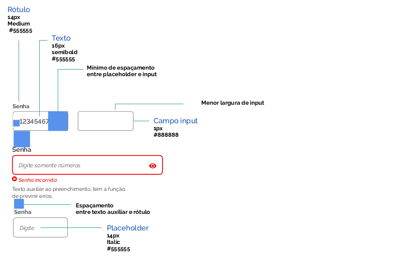
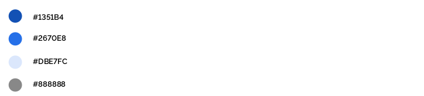

## Orientação de Uso

#### 1 | Rótulos

Devem ser acompanhados de rótulos que descrevam a informação que o usuário deve digitar.

#### 2 | Placeholder

O placeholder tem a função de auxiliar o usuário em como preencher os dados solicitados. Ele desaparece ao se começar a digitar no campo. E retorna no caso de exclusão da informação.

#### 3 | Ícones

Alguns também podem ter um ícone no canto direito. Por exemplo: o input de senha com o ícone de mostrar/ocultar a senha.

#### 4 | Distintas Alturas dos Campos

As alturas dos campos de input devem variar em função de seus usos:

## Rótulo e Informações Adicionais

Sempre que possível o rótulo do campo de texto deve ser o mais sucinto e claro possível.
Entretanto, quando necessário, ele também pode exibir um texto com informações adicionais para auxiliar o preenchimento.

### Inputs com texto auxiliar ao preenchimento

## Mensagens de Feedback Contextual

### Mensagens de Erro

A mensagem de erro (feedback contextual) deve ser o mais sucinta possível, de preferência não ultrapassando uma linha da mesma largura do campo de texto.

### Mensagens de Crítica

A validação dos campos de texto deve exibir a mensagem de suporte abaixo do campo, juntamente com o ícone correspondente.

## Tipos de Inputs

### Inputs - Estado normal / habilitado

### Inputs - Estado ativo

### Inputs com texto auxiliar ao preenchimento

### Validação do Input com texto auxiliar ao preenchimento

### Inputs validação

### Inputs estados aviso caps ligado

### Inputs desabilitados

## Anatomia

### Campos de Texto

São elementos usados pelos usuários para digitar textos. Devem ser acompanhados de rótulos que descrevam a informação que o usuário deve digitar.

## Estados

Os campos de texto podem estar nos estados: habilitado; ativo com foco e desabilitado.

### Estado habilitado

### Estado ativo

### Inputs desabilitados

## Espaçamentos

Segue as métricas definidas para os espaçamentos de todos os elementos utilizados no componente input. Todas as medidas foram definidas com valores múltiplos de 4px e 8px.

## Cores

