[version]: # '14.0.0'

## Orientação de Uso

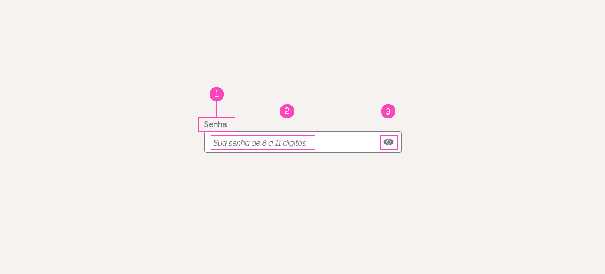

**1 | Rótulos**
Devem ser acompanhados de rótulos que descrevam a informação que o usuário deve digitar.

**2 | Placeholder**
O placeholder tem a função de auxiliar o usuário em como preencher os dados solicitados. Ele desaparece ao se começar a digitar no campo. E retorna no caso de exclusão da informação.

**3 | Ícones**
Alguns também podem ter um ícone no canto direito. Por exemplo: o input de senha com o ícone de mostrar/ocultar a senha.

### Distintas Alturas dos Campos

As alturas dos campos de input devem variar em função de seus usos:

#### Grande

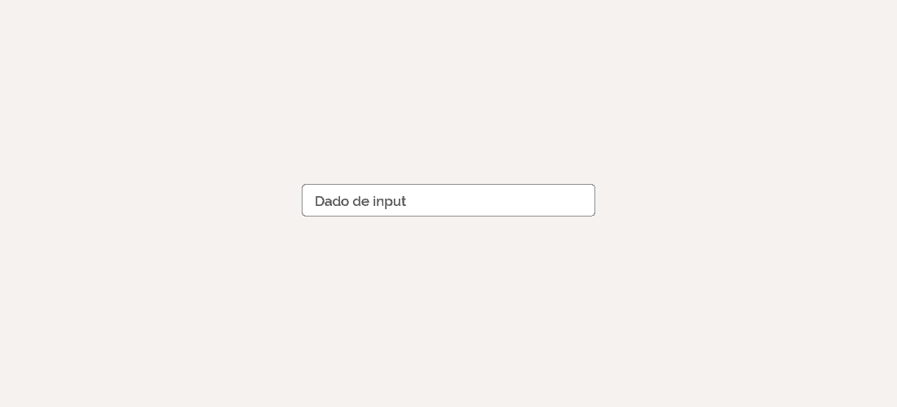

#### Pequeno

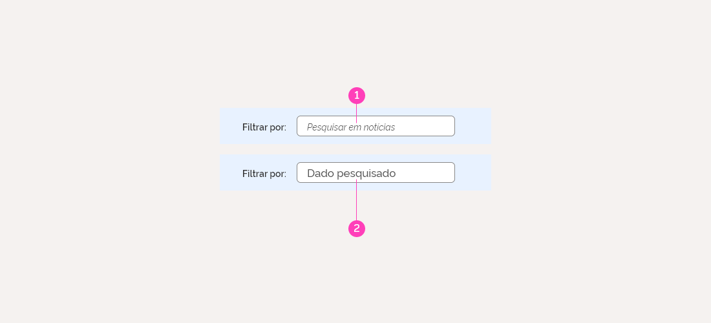

São utilizados em componentes de filtros

**1 | Placeholder**
14px | Italic | #555555

**2 | Texto**
16,8px | Medium | #555555

### Rótulo e Informações Adicionais

Sempre que possível o rótulo do campo de texto deve ser o mais sucinto e claro possível. Entretanto, quando necessário, ele também pode exibir um texto com informações adicionais para auxiliar o preenchimento.

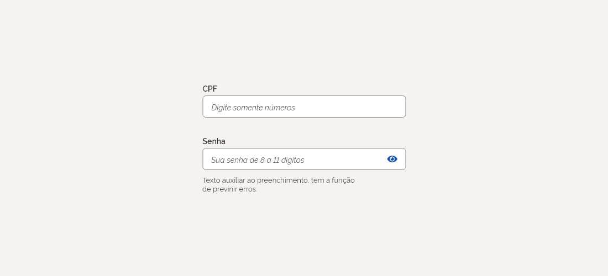

### Mensagens de Feedback Contextual

A mensagem de erro (feedback contextual) deve ser o mais sucinta possível, de preferência não ultrapassando uma linha da mesma largura do campo de texto.

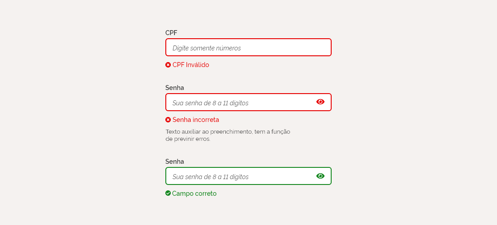

### Mensagens de Crítica

A validação dos campos de texto deve exibir a mensagem de suporte abaixo do campo, juntamente com o ícone correspondente.

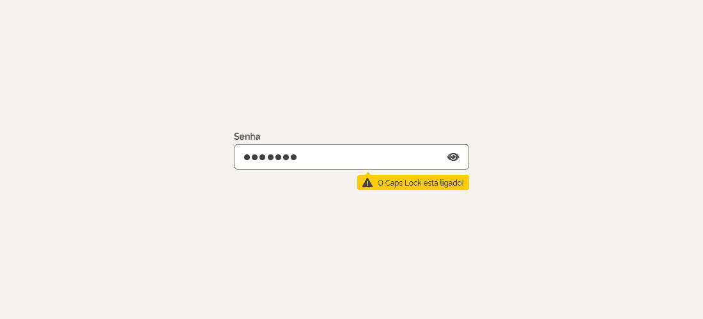

---

## Exemplos de Input

### Estado normal / habilitado

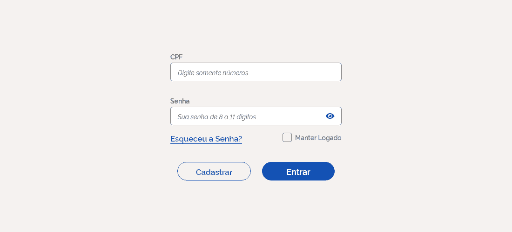

### Estado focado

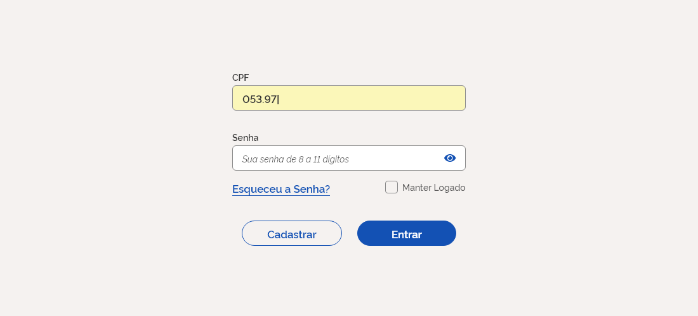

#### Inputs com texto auxiliar e validação

### Input com aviso de Capslock ligado

### Inputs desabilitados

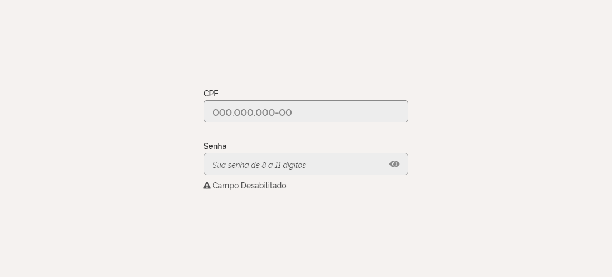

### Inputs Textarea

Este componente representa um campo de entrada de dados com múltiplas linhas. Útil quando você quer permitir ao usuário informar um texto extenso, em formato livre, como um comentário em formulário de dados. Abaixo segue um exemplo do componente:

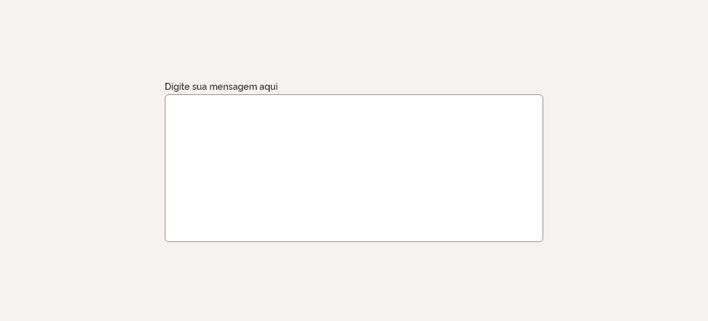

Este elemento possui as mesmas características estéticas com relação a espaçamentos, estados e anatomia dos campos Input Text.

## Anatomia

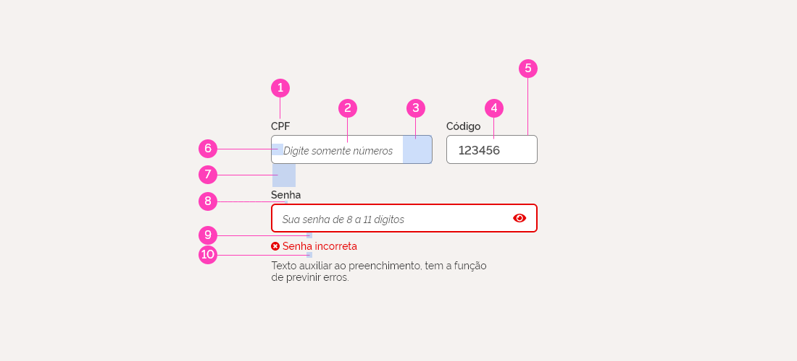

**1 | Rótulo**
14px | Semibold | #555555

**2 | Placeholder**
14px | Italic | #555555

**3 | Espaço mínimo interno entre o Placeholder e o limite do Input**
40px

**4 | Texto do Input**
16,8px | Semibold | #555555

**5 | Borda do campo de texto**
1px solid #888888

**6 | Espaço mínimo interno entre o texto/placeholder e o limite do input**
16px na lateral esquerda

**7 | Espaço mínimo entre o campo de texto e o bloco abaixo**
32px

**8 | Espaço mínimo entre o rótulo e o campo de texto**
4px

**9 | Espaço mínimo entre o campo de texto e a mensagem contextual**
8px

**10 | Espaço mínimo entre a mensagem contextual e o texto de auxílio ao preenchimento**
8px

## Link Adobe XD para Especificações

<https://xd.adobe.com/spec/7927f1ea-e05b-4e8a-5bf2-9c4931aae8d5-0f16/>
