[version]: # (15.2.0)

*Exemplo do componente _input_.*

Utilize o componente _input_ quando:

- houver a necessidade de inserir ou enviar dados de forma textual por meio de um sistema ou aplicação;
- houver a necessidade de realizar uma requisição de busca ou pesquisa por meio de um sistema ou aplicação com o uso de palavra-chave;
- a informação textual requerida for relativamente curta e objetiva.

---

## Anatomia

O _Input_ é constituído por:

1. Rótulo/Label (_opcional_);
2. Campo de Entrada de Texto;
3. Ícone Ilustrativo (_opcional_);
4. Ação interna (_opcional_);
5. Placeholder (_opcional_);
6. Mensagem (_opcional_);
7. Texto Auxiliar (_opcional_).

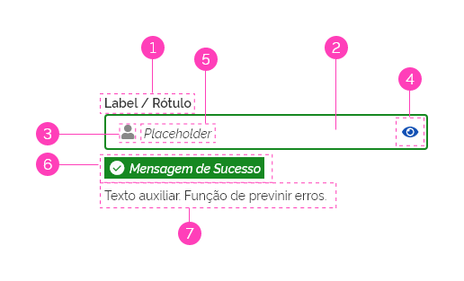
*Anatomia do componente  _input_.*

### Detalhamento dos Itens

Abaixo seguem os detalhamentos dos itens do componente _input_. Para maiores informações consulte também a documentação [Padrão de Formulário](https://www.gov.br/ds/padroes/formulario), onde são abordados mais detalhes com relação ao uso do componente _input_ em páginas de formulários.

#### 1- Rótulo/Label (_opcional_)

Auxilia o usuário, indicando o tipo de informação que deve ser digitado no Campo de Texto. O texto do Rótulo deve ser curto e objetivo possível.

Além disso, o Rótulo também tem a função de indicar ao usuário se o **Campo de Texto é obrigatório ou não**. Veja detalhes sobre a indicação de **Campos Obrigatórios/Opcionais** no documento [Padrão de Formulário](https://www.gov.br/ds/padroes/formulario).

##### Posicionamento do Rótulo

Por padrão o rotulo é posicionado no tipo do campo de texto, mas caso haja necessidade, pode ser utilizado à esquerda-centralizado do campo de texto.

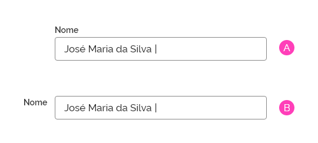
*A - Posicionamento padrão do rótulo. B - Posicionamento alternativo, à esquerda do Campo de Texto.*

**Atenção:** ao optar por um tipo de posicionamento, recomenda-se que todos os campos na página sigam o mesmo posicionamento, seja no topo ou na lateral do campo.

#### 2- Campo de Entrada de Texto

Este é o elemento essencial e obrigatório do componente. Por meio dele o usuário deve inserir a informação que foi requerida pelo sistema.

É recomendado que os campos de texto tenham um tamanho aproximado do texto de entrada esperado, ou seja, recomenda-se prever o tamanho aproximado, pois é extremamente suscetível a erros quando os usuários não conseguem visualizar a entrada completa. Observe o exemplo abaixo:

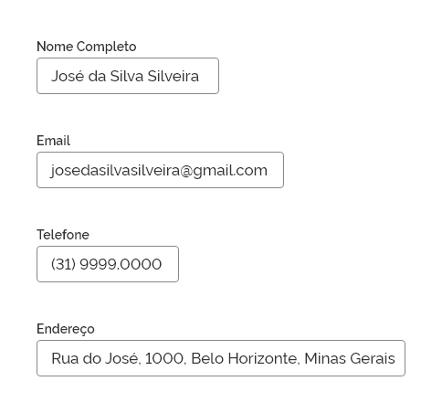
*Tamanho flexível do _input_.*

#### 3- Ícone Ilustrativo (_opcional_)

O componente _input_ também prevê o uso de ícone, de forma opcional, como maneira de reforçar a comunicação semântica a respeito do dado de entrada solicitado. Este ícone é apenas representativo e não possui qualquer tipo de interação. Quando utilizado, deve estar posicionado à esquerda dentro do campo de _input_, antes do _placeholder_ ou do texto digitado pelo usuário. Observe os exemplos abaixo:

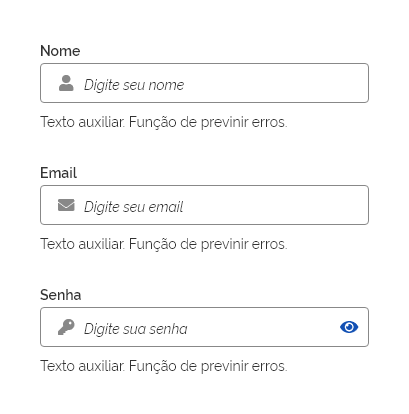
*Utilização de Ícones.*

**OBS:** Consulte as características de cores e espaçamentos em _Especificações_.

#### 4- Ação interna (_opcional_)

Este elemento é opcional e visa auxiliar o usuário sobre ações referentes ao campo de entrada de texto. Por padrão é utilizado um _Button_ de enfase terciária do tipo circular sempre com densidade alta, e o ícone deve representar a ação a ser realizada na interação.

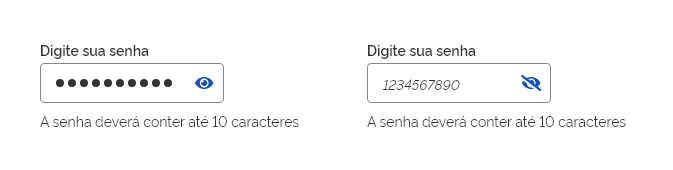
*Exemplo da ação visualizar/ocultar senha no campo de entrada.*

Caso o ícone não seja suficiente para o entendimento da ação, pode-se utilizar o _Button_ tipo Padrão, mas neste caso, recomendamos **somente o uso do elemento textual** (evitando o auxílio de ícones).

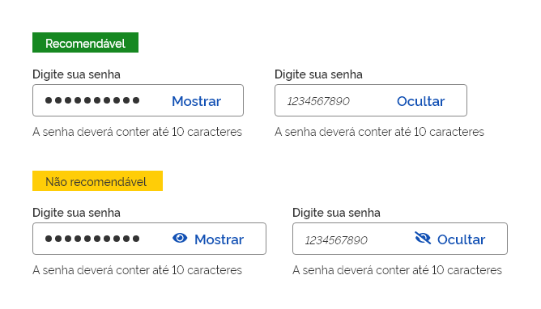
*Caso seja identificado que o usuário não esteja entendendo a ação interna, é possível alterar o tipo do _button_. Esse uso é indicado em casos excepcionais, e deve-se utilizar apenas recursos textuais.*

#### 5- _Placeholder_ (_opcional_)

O _placeholder_ tem a função de auxiliar o usuário a preencher os dados solicitados.

Deve trazer informações mais completas que a contida no Rótulo/Label, e desaparece quando o usuário iniciar o preenchimento do campo. No caso de exclusão da do texto digitado, o _placeholder_ deve reaparecer.

Use o _placeholder_ quando o usuário não estiver familiarizado com a entrada solicitada ou com a formatação em questão (por exemplo, DD-MM-AAAA).

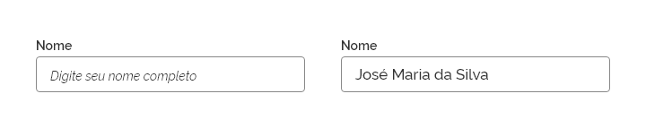
*Exemplo de _placeholder_ para orientação de preenchimento do nome completo.*

#### 6- Mensagem (_opcional_)

O componente _Message_ é opcional e é utilizado quando há uma necessidade de dar uma mensagem de _feedback_ ao usuário. A mensagem pode ter até quatro objetivos diferentes: **Erro**, **Sucesso**, **Alerta** e **Informativo**.

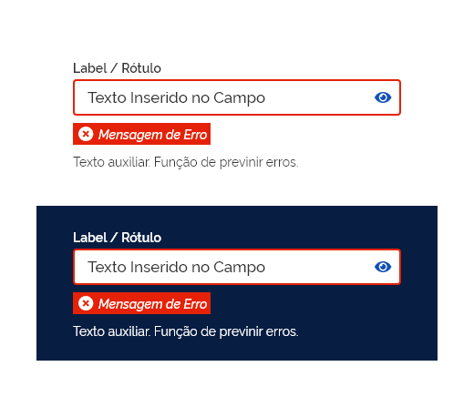
*Uso do componente _message_ de erro.*

#### 7- Texto Auxiliar (_opcional_)

O texto auxiliar tem a função de ajudar o usuário com uma informação mais completa e detalhada para o preenchimento do campo de texto. É necessário quando as informações trazidas no _label_ e no _placeholder_ não foram suficientes. Por exemplo:

*Exemplo de texto auxiliar.*

---

## Tipos

### _Input_ Padrão

Geralmente utilizado em páginas de formulários, campos de autenticação, ou qualquer outra finalidade que permita entrada de dados de forma padrão.

*Exemplo de _input_ padrão.*

### _Input_ Destaque

Esse tipo permite um destaque maior na interface, geralmente ocupando um grande espaço. É utilizado em situações onde há necessidade de chamar atenção do usuário, como campos de busca.

*Exemplo de _input_ destaque.*

---

## Comportamento

### 1- Responsividade

#### _Grid_ de 12 e 8 colunas

Nas _grids_ de 12 e 8 colunas o *input* pode ser organizado conforme a necessidade de diagramação definida no _layout_ do projeto.

É recomendado que os campos de texto tenham tamanhos fixos, e o comportamento adequado ao reduzir a resolução da tela e o espaço horizontal, é posicionar os campos de texto nas linhas abaixo, caso não haja espaço. Desta forma os campos de texto ocuparão mais espaço vertical na tela. Observe o exemplo abaixo:

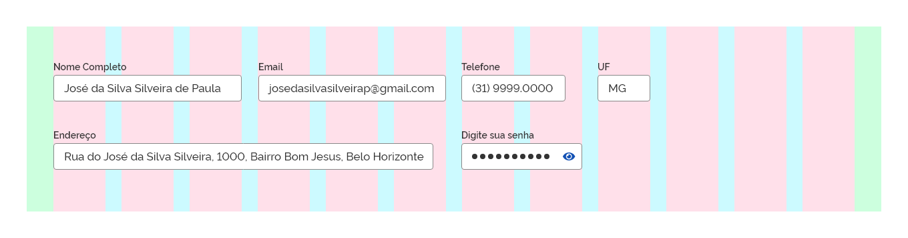
*_Input_ - _grid_ de 12 colunas.*

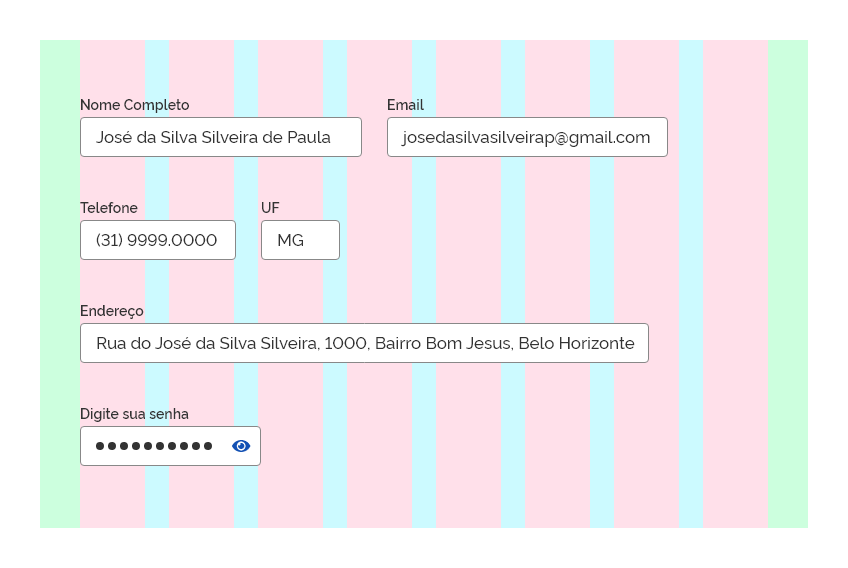
*_Input_ - _grid_ de 8 colunas. Os campos são reorganizados nas linhas abaixo.*

Neste exemplo, os *Campos Telefone*, *UF* e *Senha*, foram posicionados nas linhas abaixo, pois não couberam mais na largura da tela.

#### _Grid_ de 4 colunas

Na _grid_ de 4 colunas, recomenda-se que o _Input_ se estenda por toda largura a da tela, proporcionando mais espaço para o usuário digitar o texto solicitado. Também deverá ser utilizado o _input_ com a densidade baixa, com a finalidade de aumentar a área de _touch_. Consulte Comportamento [Densidade](https://www.gov.br/ds/padroes/densidade) para maiores detalhes.

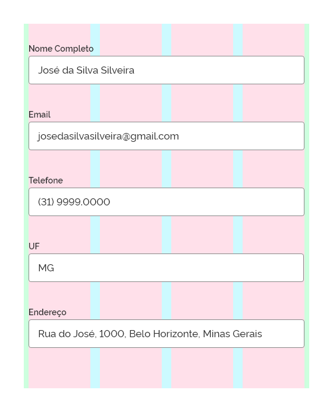
*_Input_ - _grid_ de 4 colunas.*

### 2- Densidade

O _input_ pode ser utilizado com diferentes densidades. A densidade tem relação direta com as dimensões de altura do campo de entrada de texto. Consulte as dimensões utilizadas em _Design_ > _Tokens_.

#### A- Densidade Baixa

É bastante útil quando for necessária uma área de _touch_ mais expressiva ou para conferir maior destaque ao campo de entrada de texto.

#### B- Densidade Média

É a densidade padrão utilizada nos campos de entrada de texto. É utilizada na maioria dos casos, em resoluções para _tablet_ e _desktop_.

#### C- Densidade Alta

É a situação em que a altura do campo é reduzida. É bastante útil quando for necessário utilizar o campo de entrada de texto dentro de outros componentes ou em espaços menores. Por exemplo, dentro de uma tabela, dentro do cabeçalho do sistema, etc.

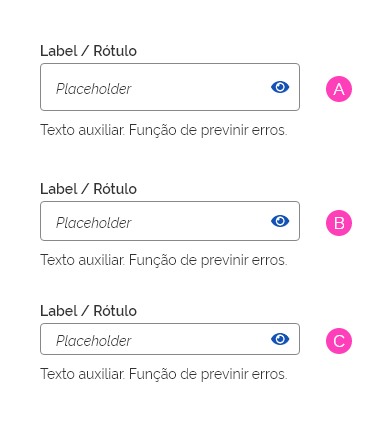
*Densidades do _input_: A- baixa, B- média e C- alta.*

### 3- Estados

O _input_ pode ser apresentado nos seguintes estados:

#### Estado Padrão

É o estado comum no qual o componente _input_ se encontra.

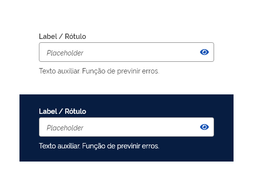
*Exemplo do estado padrão em fundo claro e escuro.*

#### Estado Aviso - Sucesso

Nesse caso, o estado informa ao usuário se uma tarefa foi concluída conforme o esperado.

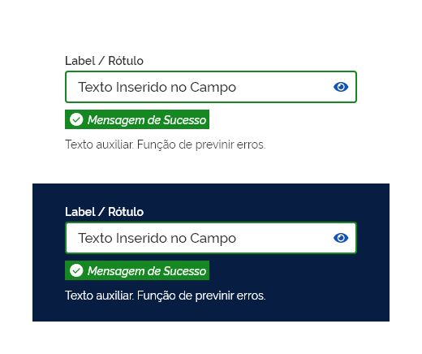
*Estado sucesso em fundo claro e escuro.*

#### Estado Aviso - Erro

Neste caso, é informado se houve um erro ou falha por parte do usuário. Por exemplo, um campo com texto inválido.

*Estado erro em fundo claro e escuro.*

#### Estado Aviso - Informativo

Esse estado ocorre quando há a necessidade de passar informação neutra ao usuário. Nessa situação, pode-se utilizar tanto o texto auxiliar como a mensagem informativa. Porém, se houver a necessidade de mais ênfase ou destaque na informação, deve-se optar pela mensagem informativa. Observe abaixo:

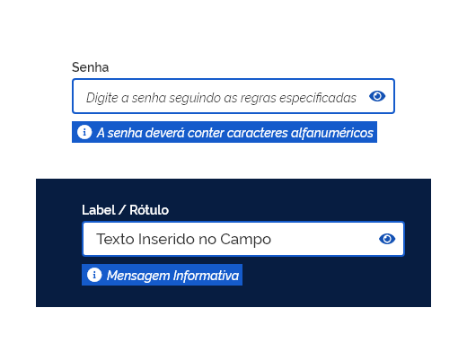
*Estado informativo em fundo claro e escuro.*

*Texto auxiliar ao preenchimento.*

#### Estado Aviso - Alerta

Esse estado ocorre quando há a necessidade de alertar o usuário a respeito de aspectos que envolvam o _input_.

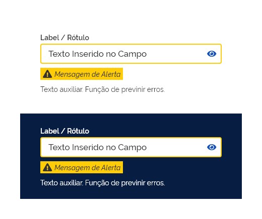
*Estado alerta em fundo claro e escuro.*

#### Estado Desabilitado

Ocorre quando o _input_ está desabilitado temporariamente para o preenchimento. Nesse caso, é apresentado com opacidade reduzida, o cursor do _mouse_ muda de forma e não há ação sobre o campo.

*Estado desabilitado em fundo claro e escuro. Caso tenha necessidade de passar alguma informação sobre o campo para o usuário, utilize a mensagem do tipo alerta.*

#### Estado _Hover_

Este estado ocorre quando o usuário posiciona o _mouse_ sobre o campo de texto. O cursor deve mudar para o formato `Text`.

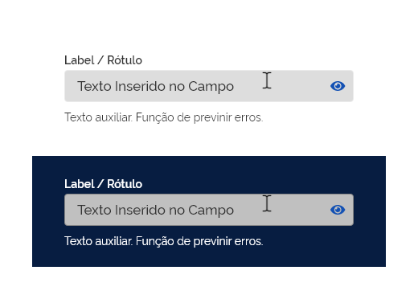
*Estado _hover_ em fundo claro e escuro.*

#### Estado Foco

É o estado no qual o _input_ recebe o foco sobre ele, seja por meio da navegação por teclado ou alguma outra ação que dispare o foco sobre o campo de texto. Nesse estado a borda do campo assume cor e espessura diferenciadas indicando que o campo está "editável".

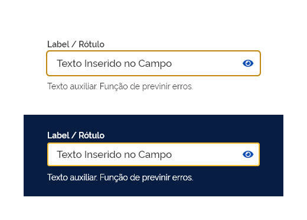
*Estado foco em fundo claro e escuro.*

Umas das interações para receber foco é por meio de clique/toque. Por tanto, o estado "pressionado padrão" não existe neste componente. Além disso, **quando está "focado"**, o estado hover não precisa ser aplicado na superfície do componente, porém, o cursor do mouse ainda deve sofrer as alterações referentes.

Veja abaixo um exemplo de interações no componente:

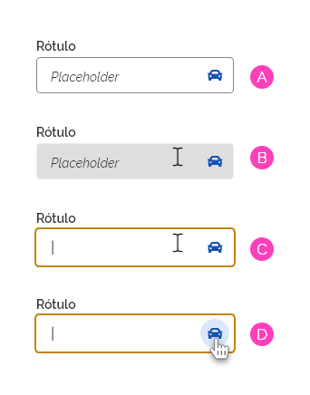
*A- Exibe o estado padrão (sem nenhuma interação). B- O cursor fica sobre o componente, exibindo o estado hover. C- Mostra o componente com estado foco após interação de um clique. Neste momento já é possível a entrada de dados no campo e o fundo do campo input não tem mais a necessidade do estado hover. D- Mesmo com estado foco é possível interagir com outros elementos do componente.*

---

## Recomendações e Boas Práticas

### Uso de Máscaras

Sempre que o dado de entrada requerido possuir um padrão de escrita, recomenda-se utilizar máscaras de formatação para o texto digitado. Geralmente estes tipos de dados, são números, códigos, protocolos ou textos com tamanho padronizado e podem vir acompanhados de caracteres específicos, como pontos, parênteses ou caracteres especiais. Sendo assim, a utilização de máscaras auxilia o usuário na digitação e padronização do texto inserido.

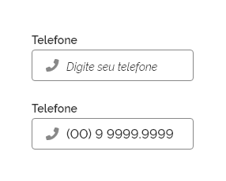
*Exemplo de máscara - número de telefone.*

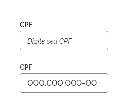
*Exemplo de máscara - CPF.*

- É recomendável que a máscara funcione dinamicamente no momento da digitação e também ao "colar" o texto no campo _input_;
- Evite dividir o _input_ em campos separados sem necessidade, isso aumenta o custo de interação do usuário, além de causar problemas para usuários internacionais, visto que utilizam padrões diferenciados. Por exemplo, o formato do telefone nos EUA é bem diferente do brasileiro: +1 (xxx) xxx-xx-xx.

*Não divida o _input_ em campos separados sem necessidade.*

- A máscara deve oferecer espaçamentos e separadores específicos para cada trecho do número, código ou protocolo digitado. Esta prática oferece ao usuário uma melhor visualização do texto, além de prevenir possíveis erros de digitação.

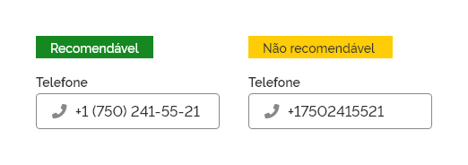
*Ofereça espaçamentos e separadores entre trechos do texto*

Veja mais detalhes sobre máscaras no documento [Padrão de Formulário](https://www.gov.br/ds/padroes/formulario).

### _Autocomplete_

O _autocomplete_ é um recurso bastante útil durante o processo de pesquisa de dados pelo usuário, pois oferece um atalho de sugestões de resultados com base nos caracteres digitados no campo _input_.

Por padrão, as sugestões são carregadas dinamicamente em uma lista _dropdown_ no momento da digitação.

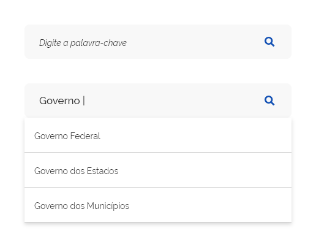
*Exemplo do recurso de _autocomplete_.*

Abaixo pode-se observar algumas boas práticas a esse respeito:

- Recomenda-se que os resultados exibidos dinamicamente no momento da digitação sejam atualizados de forma automática o mais rápido possível ou instantaneamente, de preferência. Quando utilizar o _autocomplete_, deve-se evitar fazer o usuário esperar, mas caso isso ocorra, pode-se utilizar o recurso de _loading_ durante o carregamento dos dados;

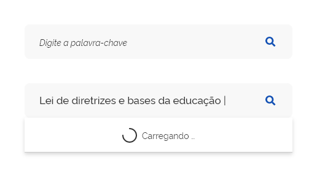
*Deve-se evitar fazer o usuário esperar, porém utilize o recurso de _loading_ caso seja necessário*

- utilize ordem alfabética ao carregar a lista de sugestões;

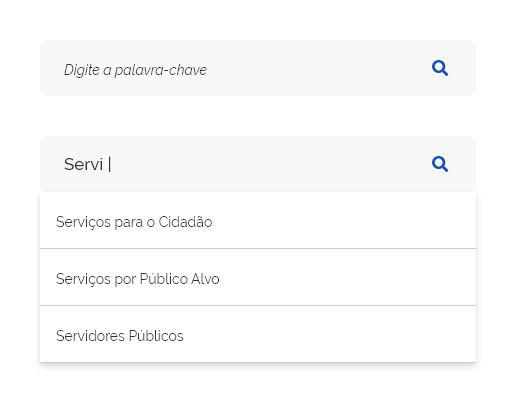
*Utilize ordem alfabética nas sugestões de resultado.*

- quando não houver dados de sugestões referentes ao texto digitado, sinalize ao usuário com _feedback_ no lugar da lista de sugestões;

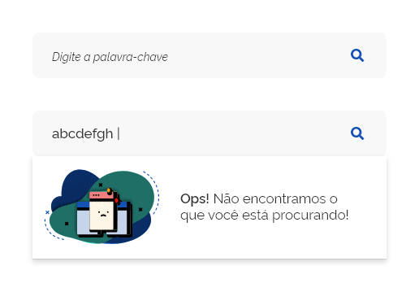
*Exemplo de _autocomplete_ com _feedback_.*

- Sempre que possível, associe assuntos relacionados aos termos digitados no campo de pesquisa, isso trará uma experiência mais rica ao usuário durante o processo de pesquisa. É interessante também associar assuntos relacionados nos casos em que não são encontrados termos de sugestões.

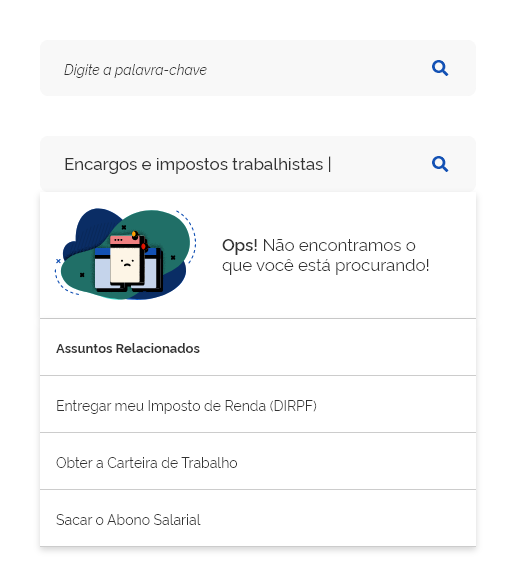
*Exemplo de _autocomplete_ com assuntos relacionados.*

---

## Especificação

### Cores

| Name                            | Property   | Token/Value |
| ------------------------------- | ---------- | ----------- |
| Rótulo/Label                    | color      | `--gray-80` |
| Rótulo/Label fundo escuro       | color      | `--pure-0`  |
| Placeholder                     | color      | `--gray-80` |
| Texto auxiliar                  | color      | `--gray-80` |
| Texto auxiliar fundo escuro     | color      | `--pure-0`  |
| Campo de texto                  | background | `--pure-0`  |
| Campo de texto - Input Destaque | background | `--gray-2`  |
| Borda campo de texto            | background | `--gray-40` |
| Ícone Ilustrativo               | color      | `--gray-40` |

### Tipografia

| Name           |        Token Size        |      Token Weight       | Tabela de Estilo |
| -------------- | :----------------------: | :---------------------: | :--------------: |
| Rótulo/Label   |            -             |            -            |     `Label`      |
| Placeholder    |            -             |            -            |  `Placeholder`   |
| Campo de texto |            -             |            -            |     `Input`      |
| Texto auxiliar | `--font-size-scale-base` | `--font-weight-regular` |        -         |

### Dimensões

| Name                             | Property      |      Token/Value       |
| -------------------------------- | ------------- | :--------------------: |
| Campo de texto - Input Destaque  | height        |  `--spacing-scale-7x`  |
| Campo de texto - Densidade Baixa | height        |  `--spacing-scale-6x`  |
| Campo de texto - Densidade Média | height        |  `--spacing-scale-5x`  |
| Campo de texto - Densidade Alta  | height        |  `--spacing-scale-4x`  |
| Campo de texto                   | border-radius | `--surface-rounder-sm` |
| Campo de texto - Input Destaque  | border-radius | `--surface-rounder-md` |
| Ação interna                     | densidade     |         `alta`         |
| Ação interna - Input Destaque    | densidade     |        `normal`        |

### Espaçamentos

| Name                                       | Property                   |         Token/Value         |
| ------------------------------------------ | -------------------------- | :-------------------------: |
| Rótulo/Label topo                          | margin-bottom              |   `--spacing-scale-half`    |
| Rótulo/Label lateral                       | margin-right               |   `--spacing-scale-baseh`   |
| Placeholder                                | margin-left                |    `--spacing-scale-2x`     |
| Placeholder                                | margin-top/bottom          | `--spacing-vertical-center` |
| Placeholder (ícone)                        | margin-left                |   `--spacing-scale-base`    |
| Texto auxiliar                             | margin-top                 |   `--spacing-scale-base`    |
| Ação interna                               | margin-top/bottom          | `--spacing-vertical-center` |
| Ação interna                               | margin-right               |   `--spacing-scale-half`    |
| Campo de entrada de texto                  | margin-top                 |   `--spacing-scale-half`    |
| Campo de entrada de texto                  | margin-bottom              |   `--spacing-scale-base`    |
| Campo de entrada de texto                  | padding-top/padding-bottom | `--spacing-vertical-center` |
| Campo de entrada de texto                  | padding-left               |    `--spacing-scale-2x`     |
| Campo de entrada de texto                  | padding-right              |   `--spacing-scale-half`    |
| Campo de entrada de texto - Input Destaque | padding-top/padding-bottom | `--spacing-vertical-center` |
| Campo de entrada de texto - Input Destaque | padding-left               |    `--spacing-scale-3x`     |
| Campo de entrada de texto - Input Destaque | padding-right              |    `--spacing-scale-2x`     |
| Ícone ilustrativo                          | margin-left                |    `--spacing-scale-2x`     |
| Ícone ilustrativo                          | margin-right               |   `--spacing-scale-base`    |
