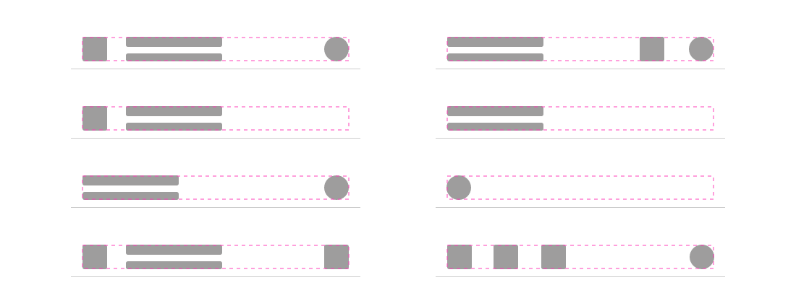
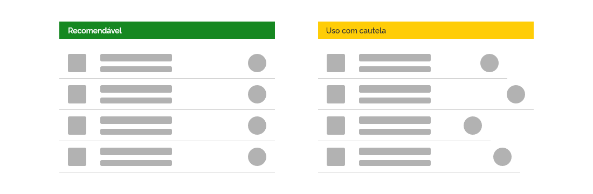
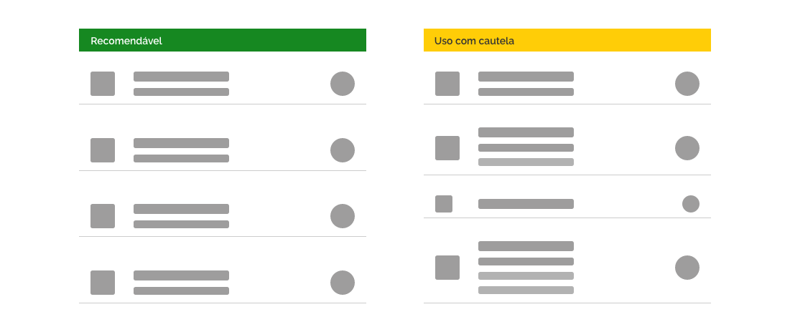
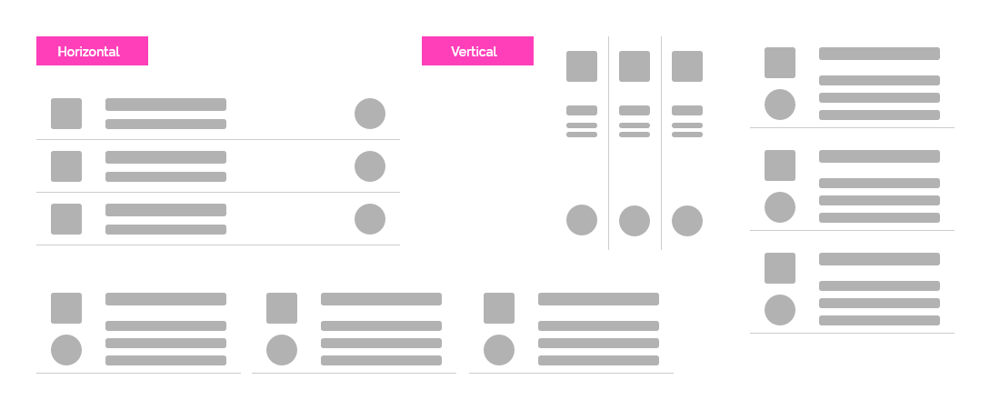
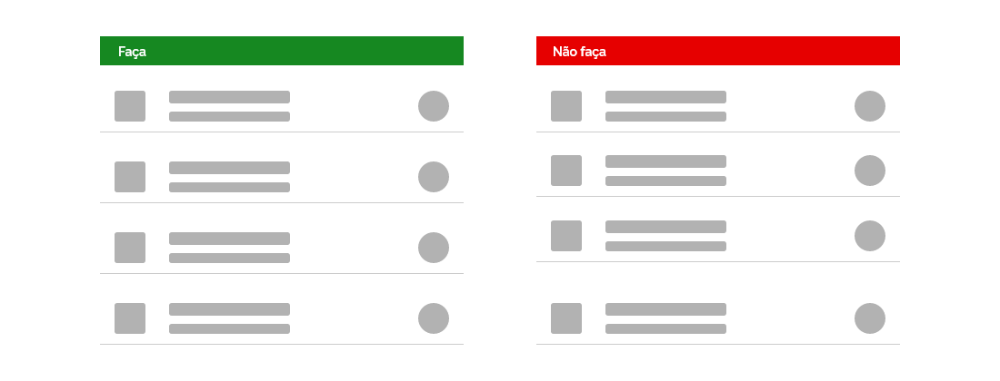
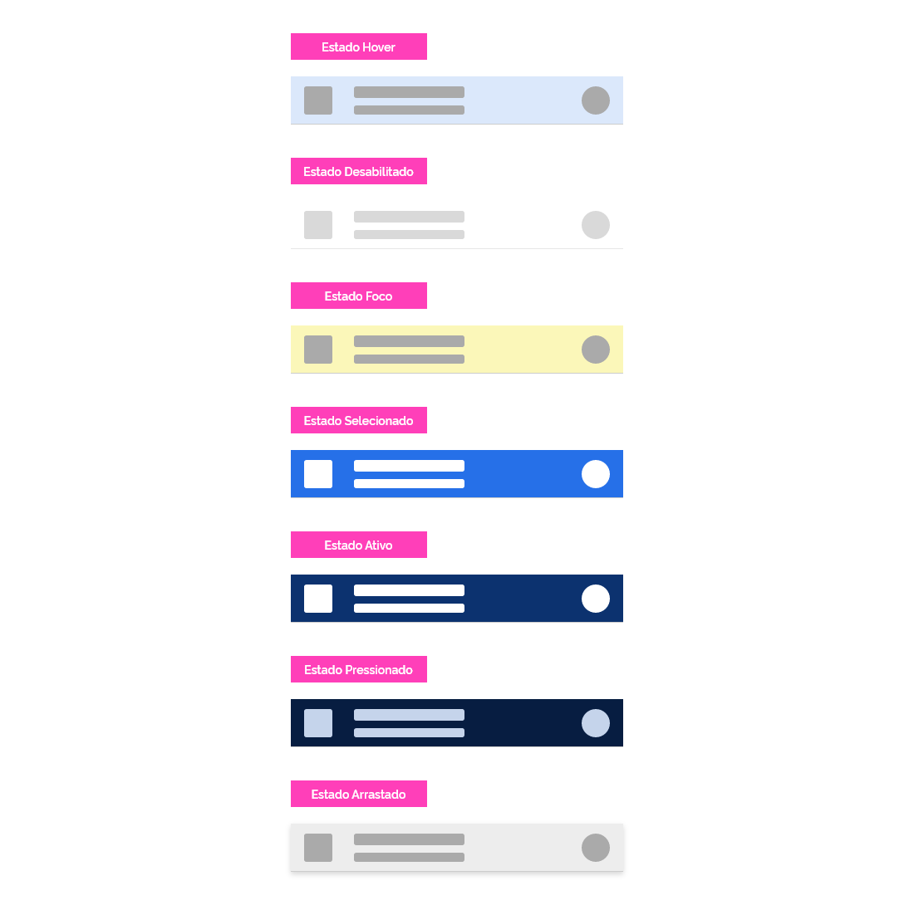

*Exemplo do componente item.*

Os itens são componentes projetados para servirem de apoio a outros componentes como *lists*, menus, etc, servindo de matéria prima para a montagem desses componentes mais complexos. Devem ser utilizados quando se pretende apresentar conteúdos que devem ser visualizados de forma repetida e ordenada, facilitando desta forma a leitura.

*Itens servem como apoio para a criação de outros componentes mais complexos.*

---

## Anatomia

Para construir um item é necessário uma superfície, uma área com no mínimo um conteúdo contido e opcionalmente um separador na extremidade inferior da superfície.

| ID  | Nome             |                         Referência                          | Uso         |
| --- | ---------------- | :---------------------------------------------------------: | ----------- |
| 1   | Superfície       | [Fundamento Superfície](/ds/fundamentos-visuais/superficie) | Obrigatório |
| 2   | Área de conteúdo |                             ---                             | Obrigatório |
| 3   | Divider          |  [Componente Divider](/ds/components/divider?tab=designer)  | Opcional    |

*Anatomia do componente item.*

---

### Detalhamento dos Itens

#### 1. Superfície (Obrigatório)

A superfície de um item é a área onde são colocados os componentes. A diagramação dos componentes dentro dessa área é livre porém deve-se levar em conta as características de cada componente.

1. Superfície;

2. Área de conteúdo: qualquer componente é aceitável, exceto botões primários e componentes relacionados à navegação, como: carrossel, *pagination*, *tab*, menu, etc.

*Exemplo da estrutura de um item.*

A seguir, alguns exemplos de possíveis combinações de componentes dentro da área de conteúdo:

*Exemplos de formatação da área de conteúdo de um item.*

---

## Regras para criação de itens

Como já dito anteriormente, itens são componentes básicos para a utilização em outros componentes mais complexos. Um item isolado não faz muito sentido, mas quando é utilizado em conjunto repetido com outros itens pode ser muito útil e flexível.
A seguir, apresentamos algumas características do componente item.

### 1. Largura

Os itens são flexíveis e por isso não possuem dimensões fixas. No entanto, é recomendável que todos os itens de um mesmo agrupamento devam possuir a mesma largura.

*Exemplo de larguras de itens.*

As alturas dos itens podem ser variáveis entre si, porém, isso acarreta uma perda da leitura "escaneada". Portanto, use este recurso com cautela.

*Exemplo de uso de itens com alturas variáveis.*

**Atenção:** as larguras mínima e máxima dos itens são flexíveis de acordo com o conteúdo e a largura da tela.

### 2. Alinhamento e Espaçamento

Os itens podem ser alinhados tanto horizontalmente quanto verticalmente e podem apresentar diferentes espaçamentos externos de acordo com a escala de espaçamentos de *layout* prevista no documento de Fundamentos.

*Alguns exemplos de possíveis alinhamentos e espaçamentos de itens.*

**Atenção:** evite o uso de itens agrupados com espaçamentos variados dentro do mesmo agrupamento.

*Exemplos de espaçamentos que devem ser evitados no componente item.*

### 3. Margens Internas

Os componentes dentro dos itens devem respeitar as margens internas (*padding*) entre cada um dos lados da superfície, conforme definido no documento de Fundamentos. Somente elementos de mídias (como fotos e ilustrações) podem quando necessário "sangrar".

**Atenção:** para saber mais sobre "sangria" consulte o documento Fundamentos/Espaçamento.

---

## Comportamentos

Itens possuem diversos comportamentos próprios. A seguir, listamos os mais usuais:

### 1. *Hover*

Um item pode ser interativo. Neste caso, toda a superfície do item é interativa e assume o estado *hover*.

*Estado Hover*

### 2. Elemento Interativo

Um item pode pode conter elementos interativos. Neste caso, apenas estes elementos possuem ação e estado *hover*.

*Estado Interativo*

### 3. Seleção

Um item pode ser selecionável. Quando o usuário clicar em um item selecionável ele assume o estado selecionado.

*Estado Selecionado*

### 4. Expansão

Um item pode ser expansível. Quando o usuário clicar no botão de expansão outros elementos serão apresentados. A qualquer momento o usuário poderá fechar a expansão.

*Expandido*

### 5. Rotulagem

Um item pode ser rotulado com cores. Quando o usuário clicar no botão de rotulagem as opções de cores serão apresentadas ao usuário.

*Expandido*

**Atenção:** todos os comportamentos apresentados acima são opcionais e podem ser utilizados de forma conjunta, de acordo com a regra de negócio.

### 6. Estados Aplicados ao Item

Os itens podem apresentar todos os estados listados abaixo. Para maiores detalhes consultar o documento de Fundamentos.

*Estados Aplicados*

---

## Especificações

### Cor

| Name       | Property | Color Token |
| ---------- | -------- | ----------- |
| Superfície | color    | `--pure-0`  |
