[version]: # (3.0.5)

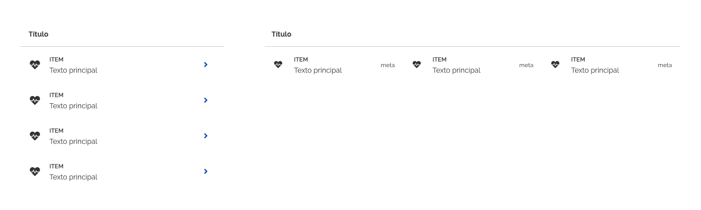
*Exemplo dos componentes _list_ vertical e _list_ horizontal.*

---

## Anatomia

1. _Header_ (_opcional_);
2. Item;
3. Rótulo (_opcional_);
4. _Divider_ (_opcional_);
5. Superfície.

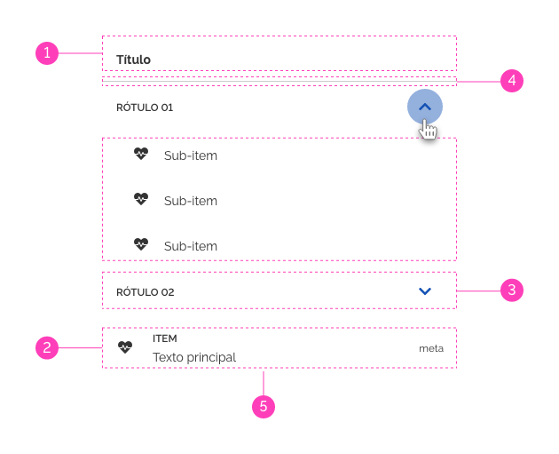
*Anatomia do componente _list_.*

---

## Detalhamento dos Itens

### 1. _Header_

_Lists_ podem opcionalmente possuir títulos. O _header_ possui uma área textual para o título da _list_ e outra para conter ações relacionadas a _list_ (uso de botões por exemplo).
Apesar de possuir uma altura padrão, seu contêiner pode sofrer alteração na altura quando botões são adicionados.

1. _Header_ com altura padrão;
2. _Header_ com altura alterada pela inserção de botões.

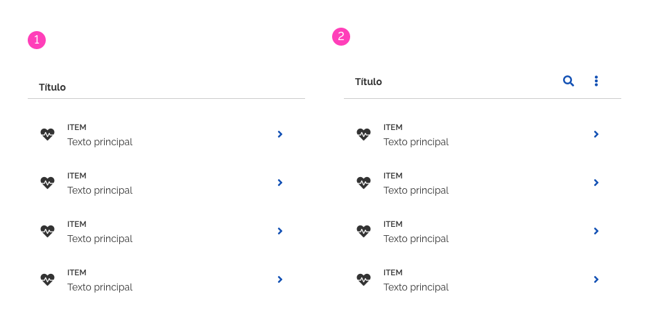
*Áreas de títulos da _list_.*

### 2. Item

Um item corresponde à unidade de uma _list_ que, ao ser repetido, forma uma lista. Consulte o documento do componente item para mais detalhes.

De uma forma geral, um item pode ser criado contendo uma infinidade de componentes mas, como boas práticas, é recomendável mantê-lo o mais organizado e enxuto possível e dividí-lo em áreas lógicas.
São sugeridas três áreas distintas:

1. **Suporte Visual** (_opcional_): exibe os recursos visuais (geralmente ícones, avatares e mídias);
2. **Área Principal**: exibe o conteúdo principal (geralmente textual);
3. **Suporte Complementar** (_opcional_): exibe os metadados, elementos interativos (geralmente botões e _links_) e informações que complementam o conteúdo principal.

Pode-se utilizar as três áreas sugeridas em conjunto ou isoladamente. É permitida ainda a criação de novas áreas ou utilizar qualquer uma delas isoladamente. No entanto, esteja atento em manter a formatação e consistência dentro de uma mesma _list_.

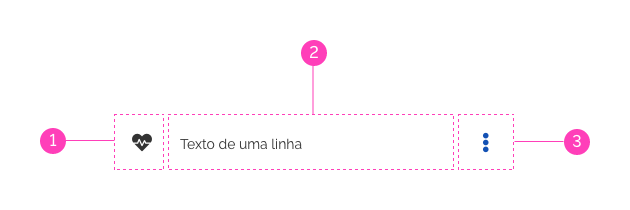
*Áreas recomendadas para os itens de uma _list_.*

Os itens podem possuir alturas fixas ou flexíveis determinadas pela quantidade de linhas de conteúdo. No entanto, apesar dessa variação, **recomendamos que todos os itens de uma _list_ deva possuir a mesma altura**, independentemente do comportamento aplicado.

Na ilustração seguinte podemos observar diferentes alturas dos itens de acordo com a quantidade de linhas do conteúdo:

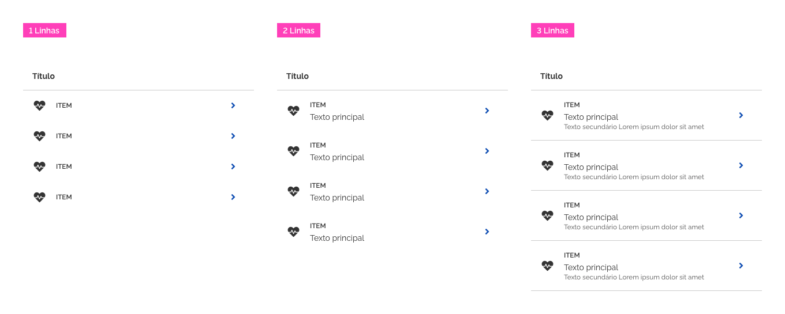
*Exemplos de variação das alturas dos itens de uma _list_.*

**Atenção:** os itens de uma _list_ podem apresentar a quantidade de conteúdo que for necessária e consequentemente a altura deve variar de acordo com o conteúdo. Tenha cuidado ao utilizar alturas flexíveis de itens em uma mesma _list_.

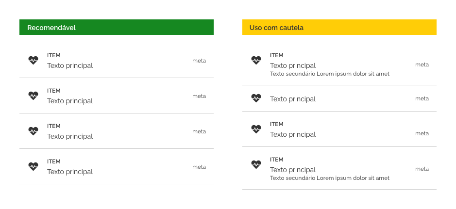
*Use diferentes alturas de itens de uma _list_ com cautela.*

#### Área Principal

A área principal suporta o conteúdo principal da _list_ que geralmente é representado por textos. Podemos organizar o texto pensando na hierarquia da informação e para isso é recomendado utilizar as sugestões abaixo:

1. **Subtítulo**: texto opcional que possui a maior ênfase entre os textos. Deve ser usado somente quando há necessidade de ter um conteúdo com ênfase maior que o texto principal. É sugerido o uso de letras maiúsculas;
2. **Texto Principal**: texto obrigatório, onde o conteúdo principal da _list_ será exibido;
3. **Texto Secundário**: texto opcional que possui a menor ênfase entre os textos.

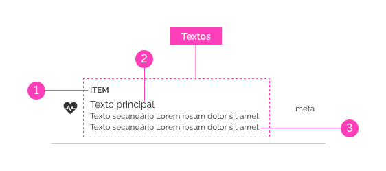
*Use hierarquia da informação para organizar melhor os textos dentro de uma _list_.*

**Atenção:** é permitida a criação de _layouts_ de texto mais específico para determinado produto, porém esteja sempre atento às boas práticas descritas neste documento.

#### Recurso Visual ou Complementar

Recursos visuais ou complementar são representados por ícones, imagens, avatares, botões e elementos interativos em geral. São exibidos nas áreas de suporte (visual/complementar) do item.

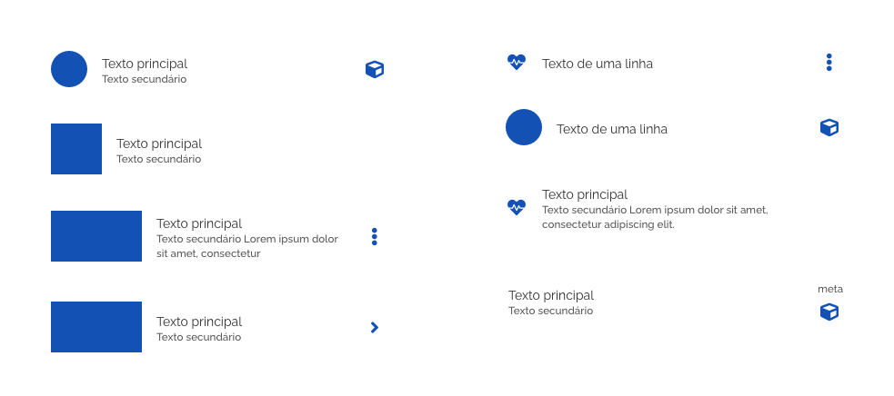
*Exemplos de possibilidades de uso dos recursos visuais/interativos em uma _list_ representados em azul.*

**Atenção:** mantenha a consistência de uma lista em relação ao posicionamento e tipos de recursos visuais/interativos utilizados.

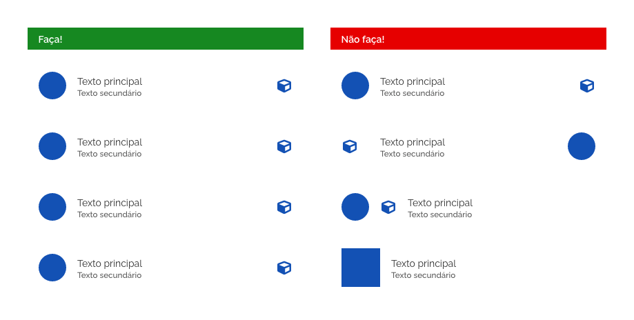
*Exemplos de possibilidades de uso dos recursos visuais/interativos em uma _list_ representados em azul.*

##### Recursos Visuais

Os recursos visuais são definidos por quaisquer elementos que dão apoio visual ao conteúdo. Podem ser ícones, avatares e mídias em geral.

Quando existirem, devem estar localizados na área de **suporte visual**.

*Exemplos de recursos visuais localizados na área de suporte.*

##### Recursos Complementares

Recursos complementares são quaisquer componentes interativos, metadados ou informações adicionais que podem ser utilizados em conjunto com _lists_. Quando aparecerem, devem estar localizados na área de **suporte complementar** do item.

Reflita sempre se o uso de determinado recurso complementar é necessário e faz sentido dentro de uma _list_.

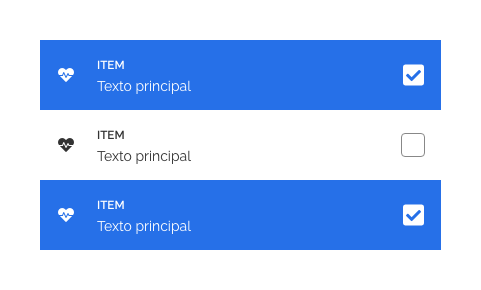
*Exemplo de uso do componente _check box_ dentro do componente _list_.*

##### Metadados

Metadados são informações complementares ao conteúdo principal e têm como objetivo informar-nos sobre eles para tornar mais fácil a sua organização e compreensão.

Quando existir, é recomendado que fique localizado na área de **suporte complementar** do item e alinhado verticalmente ao centro. Pode eventualmente vir acompanhado de um ícone ou botão.

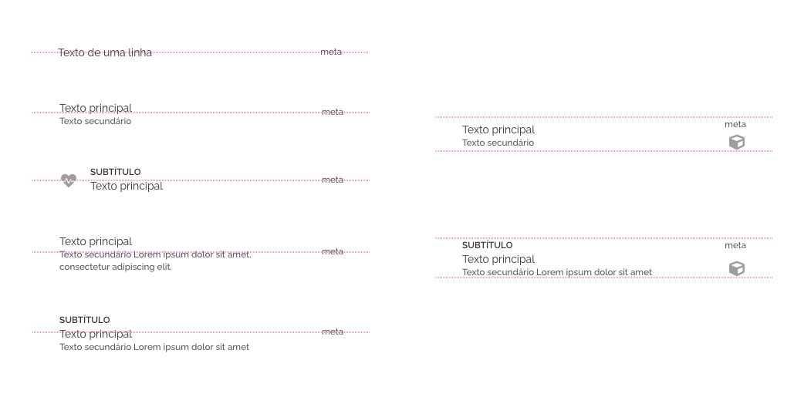
*Exemplos de possibilidades de diagramação do metadados em diferentes itens de _list_.*

### 3. Rótulo

É um item com uma formatação específica com a finalidade de nomear os grupos das _lists_.
Veja o comportamento **Agrupamento** para maiores detalhes.

### 4. _Dividers_ e Espaçamento

_Dividers_ são recursos opcionais que auxiliam visualmente a percepção do final do item de uma _list_ favorecendo a distinção dos seus itens. Quando presentes, devem, estar localizados sempre abaixo da borda inferior de cada item, quando se tratar de uma _list_ vertical ou após a borda direita, no caso de _lists_ horizontais. _Dividers_ podem ser utilizados também como agrupadores.

_Lists_ podem ser criadas com diferentes espaçamentos entre seus itens e esta decisão deve ser direcionada pelo _layout_ e tomada com equilíbrio e bom senso.

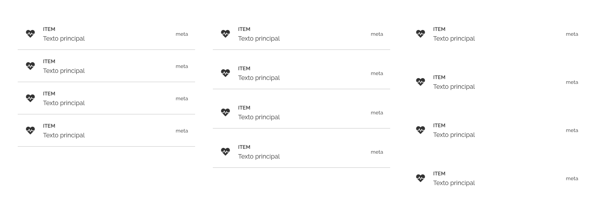
*Exemplos de diferentes possibilidades de espaçamentos nas _lists_.*

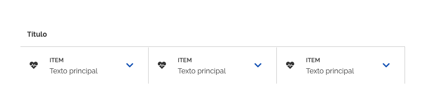
*Exemplo de _list_ horizontal com _dividers_ verticais.*

**Atenção 1:** os espaçamentos devem seguir as orientações especificadas no documento de Fundamentos/Espaçamentos.

#### Boas práticas no uso do _dividers_

- Não é permitido variar o espaçamento dos itens dentro de uma mesma _list_.

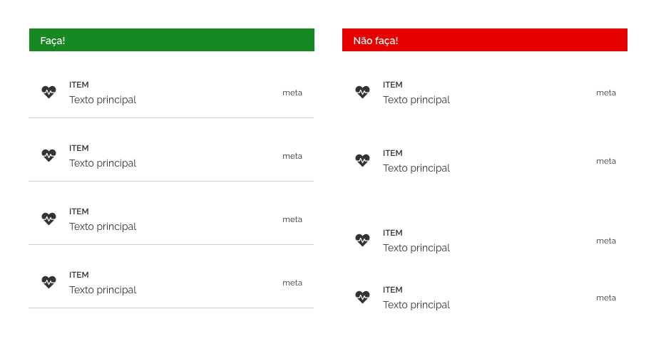
*Exemplo do correto uso de espaçamentos nas _lists_.*

- A leitura de uma _list_ com grande quantidade de conteúdo pode ficar confusa. _Dividers_ podem auxiliar a separação dos itens e tornar a _list_ mais estruturada. Tenha sempre bom senso no uso dos _dividers_.

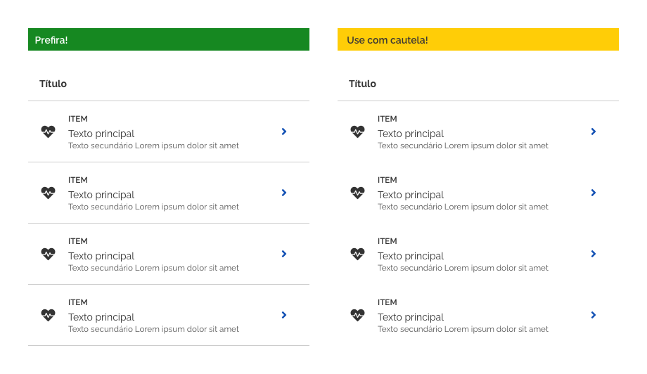
*Use _dividers_ em _lists_ com moderação e bom senso.*

---

## Tipos

**1- Vertical**

São as mais utilizadas quando o objetivo for listar itens de forma ordenada. Os itens podem estar dispostos em ordem alfabética, conceitual, cronológica ou por qualquer outro critério lógico.

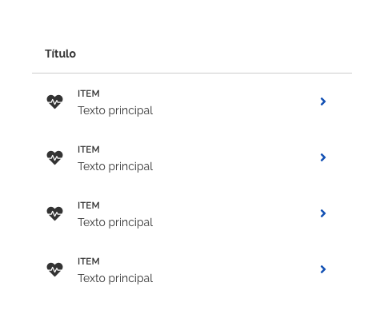
*Exemplo de _list_ vertical.*

**2- Horizontal**

_Lists_ horizontais são menos comuns que as verticais. Podem ser utilizadas quando se quer aproveitar o espaço horizontal da tela. Tem função semelhante às abas e menus horizontais.

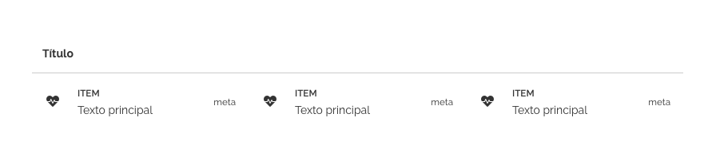
*Exemplo de _list_ horizontal.*

---

## Comportamentos

### Densidades e Alturas

A densidade de uma _list_ é definida de acordo com o _padding-top-bottom_ (espaçamento interno) de seu conteúdo e desta forma determina-se a altura dos itens da _list_. O texto principal é o elemento base para definir o _padding_.

Os itens de uma _list_ podem ter densidades **alta**, **média** ou **baixa**.

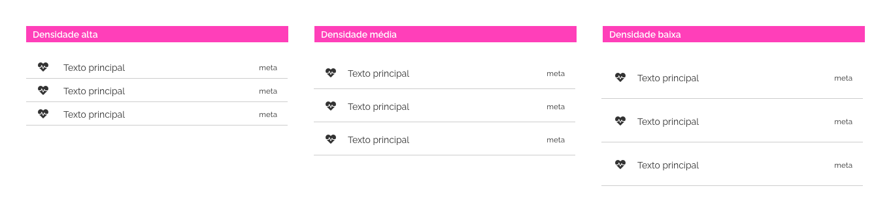
*Densidades fixas possíveis para _lists_: alta, média e baixa.*

Já as alturas dos itens podem ser **fixas** ou **flexíveis**. Na altura fixa a altura é determinada por um valor fixo em pixels. Quando utilizar altura flexível a quantidade de conteúdo irá determinar a altura do item.

**Atenção:** para resoluções abaixo de 4 colunas evite a utilização de densidade alta.

### Agrupamento

Algumas _lists_ podem conter muitos itens. Um recurso para torná-las mais organizadas é agrupar os itens por afinidades. Os agrupamentos podem ser feitos de três maneiras:

**1. Com rótulos:**
Sub-itens são agrupados por agrupadores que funcionam como títulos de um grupo.

**2. Com separadores:**
Sub-itens são agrupados por afinidades e cada grupo é destacado por _dividers_.

**3. Com expansão:**
Sub-itens são agrupados e ocultados pelo recurso de expansão. Podem ser acessados por meio do clique no item desejado. Esse comportamento será explicado com mais detalhes neste documento.

*Possibilidades de agrupamento dos itens da _list_.*

**Atenção:** os exemplos acima podem ser combinados entre si para dar mais ênfase aos agrupamentos.

Os rótulos nada mais são que itens utilizados como títulos de agrupamentos. Por isso devem utilizar a mesma regra de densidade explicada acima.

Referimo-nos a sub-itens quando temos itens agrupados de alguma maneira. Podemos afirmar que sub-itens são itens agrupados, conforme é visualizado na imagem anterior. Evite criar _lists_ com mais de um sub-nível.

### Responsividade

Quando uma tela é redimensionada, a largura da área principal de um item sofre alteração de acordo com a nova resolução adotada pelo dispositivo, enquanto as demais áreas (suporte visual e suporte interativo) continuam fixas.

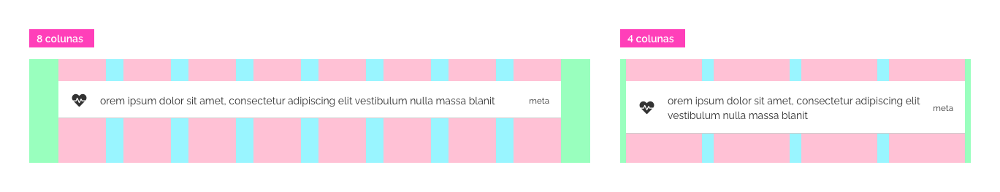
*Comportamento de um item de _list_ conforme a resolução é alterada.*

### Expansão

Os itens podem exibir ou esconder conteúdos de diversos tipos, empurrando ou puxando verticalmente os demais conteúdos da _list_. Esta é uma boa maneira de organizar hierarquicamente conteúdos, deixando oculto o que é menos importante.

1. Rótulo expandido;
2. Itens de sub-nível;
3. Botão de acionamento do recurso de expansão.

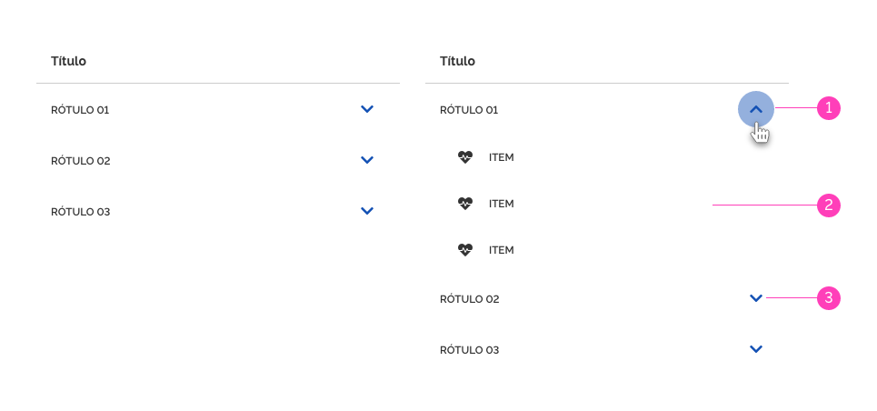
*Podemos encontrar o recurso de expansão em itens e rótulos, como mostra a imagem acima.*

Em _list_ horizontais o comportamento de expansão funciona da mesma forma. O exemplo a seguir ilustra esse caso:

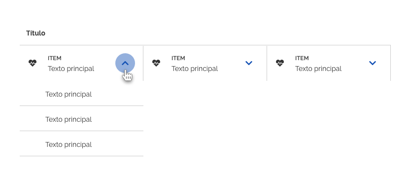
*Exemplo de expansão em uma _list_ horizontal.*

**Atenção:** Quando necessário, utilize _dividers_ ou elementos visuais (como sombra) para destacar os rótulos ou itens expansíveis. A superfície do conteúdo expandido pode opcionalmente assumir uma cor distinta para diferenciar da _list_ principal, mas tenha atenção de não utilizar uma cor já definida para os estados, pois isso pode gerar confusão semântica. Respeite a usabilidade garantindo a taxa mínima de contraste entre a cor do texto e a cor do fundo.

### Ordenação

_Lists_ podem oferecer recursos de reordenação pelo usuário, ou até deslocamentos de itens de _lists_ diferentes. Quando este recurso estiver ativado deve-se utilizar as definições do estado arrastado (ver documento de Fundamentos/Estados).

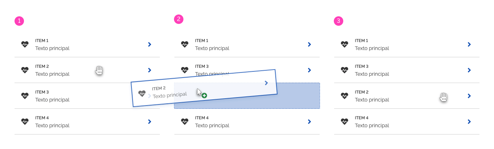
*Exemplo de reordenação de itens dentro de uma mesma _list_.*

Itens também podem ser deslocados entre diferentes _lists_. A sequência de imagens abaixo ilustra os passos desse comportamento:

1. Item escolhido para ser removido da _list_;
2. _List_ que receberá um novo item deslocado da primeira lista;
3. A primeira _list_ tem um item removido;
4. Item sendo arrastado;
5. Primeira _list_ sem seu item de origem;
6. Segunda _list_ com um item inserido.

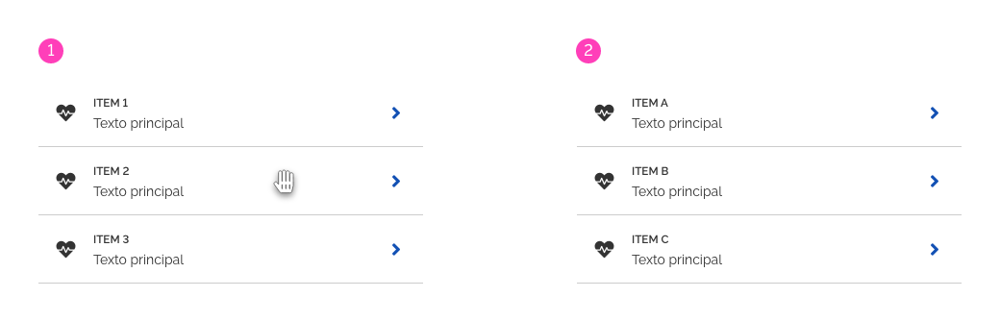
*Exemplo de troca de item entre _lists_.*

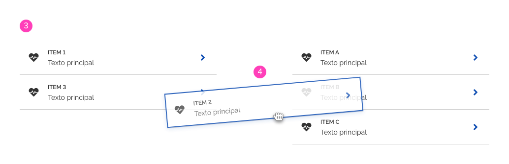
*Exemplo de troca de item entre listas.*

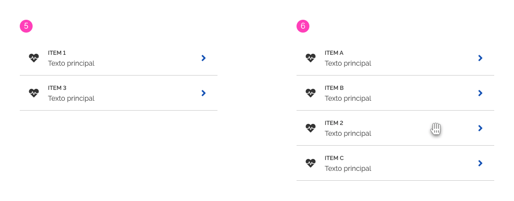
*Exemplo de troca de item entre _lists_.*

---

## Especificação

### Espaçamento

#### Alinhamento

|Name|Spacing Token|
|--|:--:|
|Textos|`--spacing-vertical-center`|
|Textos|`--spacing-horizontal-left`|

#### Spacing

|Name|Token|
|--|:--:|
|Item - densidade alta|`--spacing-scale-base`|
|Item - densidade média|`--spacing-scale-2x`|
|Item - densidade baixa|`--spacing-scale-3x`|

### Cor

|Name|Property|Color Token|
|--|--|:--:|
|Superfície|background|`--pure-0`|
|Textos|text|`--pure-100`|
|Texto secundário|text|`--gray-70`|
|Rótulo|text|`--pure-100`|

### Tipografia

|Name|Property|Token/Value|
|--|--|:--:|
|Título|size|`--font-size-scale-base`|
|Item|size|`--font-size-scale-down-01`|
|Texto principal|size|`--font-size-scale-base`|
|Texto secundário|size|`--font-size-scale-down-01`|
|Rótulo|size|`--font-size-scale-down-01`|
|Título|font-weight|`--font-weight-bold`|
|Item|font-weight|`--font-weight-semi-bold`|
|Texto principal|font-weight|`--font-weight-regular`|
|Texto secundário|font-weight|`--font-weight-regular`|
|Rótulo|font-weight|`--font-weight-semi-bold`|

### Iconografia

|Name|Estado|Ícone|Size|Class (Font Awesome)|
|--|--|--|--|--|
|Ícone Expandir|--|<i class="fas fa-chevron-down"></i>|`--icon-size-base`|`.fa-chevron-down`|
|Ícone Retrair|--|<i class="fas fa-chevron-up"></i>|`--icon-size-base`|`.fa-chevron-up`|
