[version]: # '2.0.0'

---

## Uso

Utilize listas para classificar de maneira lógica um conteúdo, seja de forma alfabética, numérica, cronológica ou por uma outra preferência do usuário.

### Tom de voz

As listas devem ser apresentadas de forma consistente dentro de uma interface. Utilize os elementos contidos na lista (texto, ícones e ações) de maneira a identificar o conteúdo e que seja claro para o usuário sua interação.

---

## Tipos

Existem 2 Tipos de Lista: **Simples** e **Complexa**.

### Lista Simples

A lista simples é a lista padrão da marcação HTML para qualquer navegador web. Elas são úteis pela facilidade em criar um documento bem estruturado, e pelo fato de ser conhecida, pode possuir maior acessibilidade e melhor facilidade de manutenção.

Existem três tipos de lista em HTML:

-   **Não ordenada**: utilizado para agrupar um conjunto de itens relacionados sem nenhuma ordem particular.
-   **Ordenada**: usada para agrupar um conjunto de itens relacionados a uma ordem específica.
-   **Definições**: usada para exibir termos e explicações dos termos.

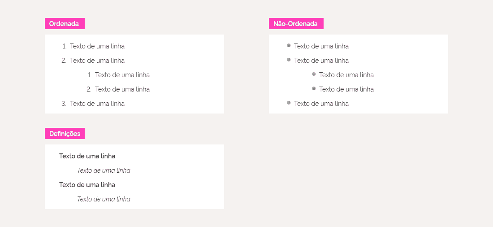

### Lista Complexa

A lista Complexa permite o uso consistente de elementos gráficos, textuais e interações dentro de um contexto de uma lista.

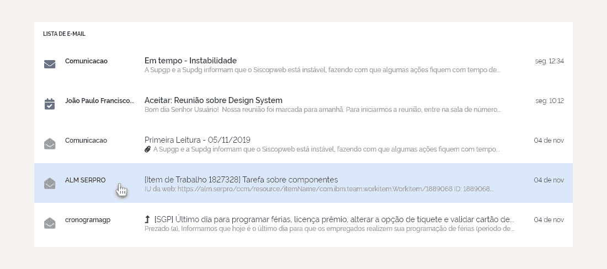

---

## Anatomia de uma Lista Complexa

1. **Título** (_opcional_)
2. **Item**
3. **Recurso Visual** (_opcional_)
4. **Subtítulo** (_opcional_)
5. **Texto Principal**
6. **Texto Secundário** (_opcional_)
7. **Metadados** (_opcional_)
8. **Controles** (_opcional_)
9. **Separador** (_opcional_)

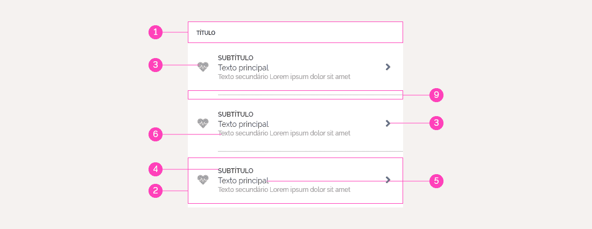

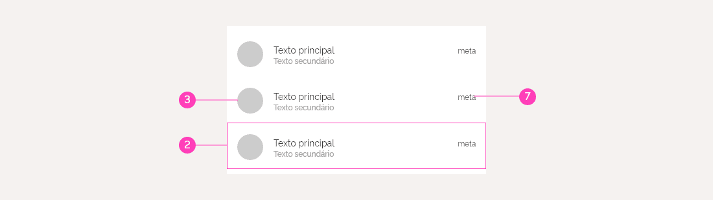

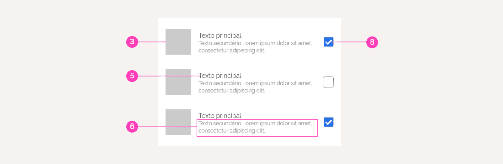

---

### Título

#### Comportamento

Apesar de possuir uma altura padrão, seu contêiner pode pode sofrer alteração quando botões de ação são adicionados.

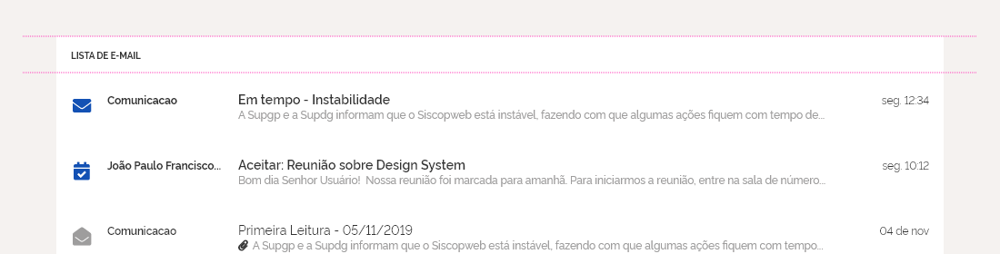
_Contêiner do título com altura padrão._

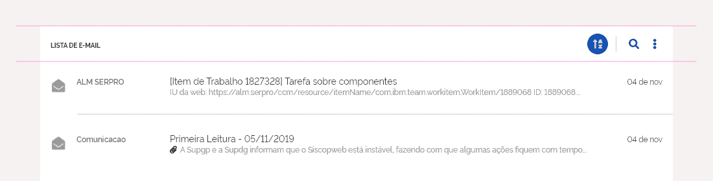
_Contêiner do título com altura maior para conter os botões de ação._

---

### Item

Nos Itens estão localizados os conteúdos principais de uma lista.

Eles podem ser divididos em 3 áreas:

1. **Suporte Visual** (_opcional_): exibe os recursos visuais e os controles
2. **Principal**: exibe os Textos da lista (subtítulo, principal e secundário).
3. **Suporte** (_opcional_): exibe os recursos visuais, os controles e os metadados.

Os itens podem possuir alturas variadas determinadas pela quantidade de linhas de conteúdo exibidos. Mas apesar dessa variação, **todos os itens de uma lista deve possuir as mesmas dimensões**, indepedente do comportamento aplicado. Devido a essa característica, podemos dividir os itens em 3 tipos, e isso se reflete para o tipo de Lista Complexa que será exibido na interface:
**1 linha**: uma lista com itens de uma única linha com ícones e texto;
**2 linhas**: uma lista com itens de 2 linhas de texto;
**3 linhas**: uma lista com ítens de 3 linhas de texto;

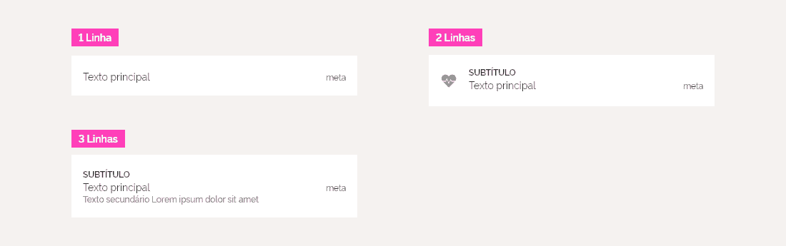

Apartir dos itens com 2 linhas, podem ser utilizados 2 tipos de conteúdo na área de suporte, desde que seja um metadado e um recurso visual. Controles devem aparecer sozinhos.

---

### Textos (Subtítulo, Principal e Secundário)

Existem 3 tipos de texto dentro de uma Lista Complexa, com suas funcionalidades baseada na ênfase dentro da lista:

-   **Subtítulo**: texto opcional que possui a maior enfase entre os textos. Deve ser usado somente quando há necessidade de ter um conteúdo com enfase maior que o texto principal.
-   **Principal**: texto obrigatório, onde o conteúdo principal da lista será exibido.
-   **Secundário**: texto opcional que possui a menor enfase entre os textos. Podem ser utilizados em até 2 linhas.

---

### Metadados

Metadados são dados sobre dados e descrevem do que se trata aquele dado e facilitam o entendimento e a utilidade das suas informações.

Ele fica localizado somente na área do Suporte, alinhado com a linha base do texto Principal. A única exceção para este alinhamento acontece quando a área de suporte possui um metadado em conjunto com um ícone.

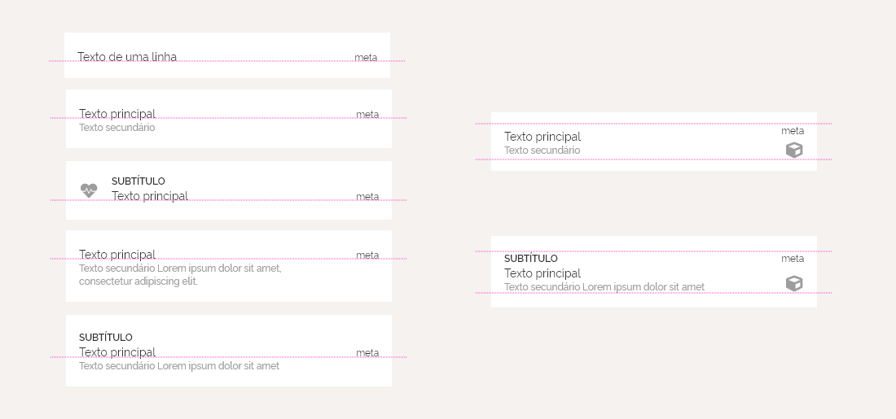

---

### Recurso Visual

Recursos visuais são representados por ícones, imagens e avatares. Eles podem ser exibidos na área de suporte visual como e de suporte dependendo do recurso visual.

Dependendo da densidade e da largura da lista, o uso dos recursos visuais devem ser revistos, principalmente para questões de responsividade.

**Ícones**: são as formas mais comum de recurso visual. Podem aparecer no suporte visual e de suporte. Porém, quando interativos são exibidos na área de suporte. Eles podem aparecer em conjunto com metadado na área de suporte.
**Imagens**: só podem ser exibidos da área de suporte visual e somente nos itens com 2 ou 3 linhas. Existem somente 2 tamanhos de imagens.
**Avatares**: só podem ser exibidos na área de suporte visual. Sua forma redonda viabiliza sua aplicação, podendo ser exibida em qualquer tipo de item de lista.

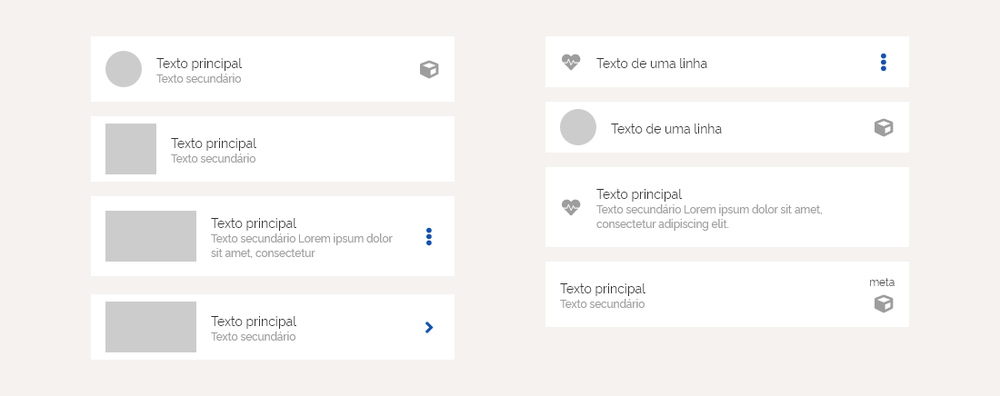

---

### Controles

Controles são os componentes de [controle de seleção](#) que podem ser utilizados na área de Suporte e em alguns raros caros, no suporte visual.

Os controles não podem ser utilizados em conjunto com qualquer outro recurso visual ou metadado em uma mesma área.

_**Cuidado**: selecionar um controle de seleção não significa que o item da lista foi selecionado, e sim uma opção. Por tanto, o estado selecionado não precisa ser aplicado no item da lista._

---

### Separadores e Espaçamento

Separadores podem ser utilizados dentro de uma lista para separar Itens que possam ser agrupados ou para dividir itens com muito conteúdo (geralmente encontrados em itens com 3 linhas ou lista com alta densidade).

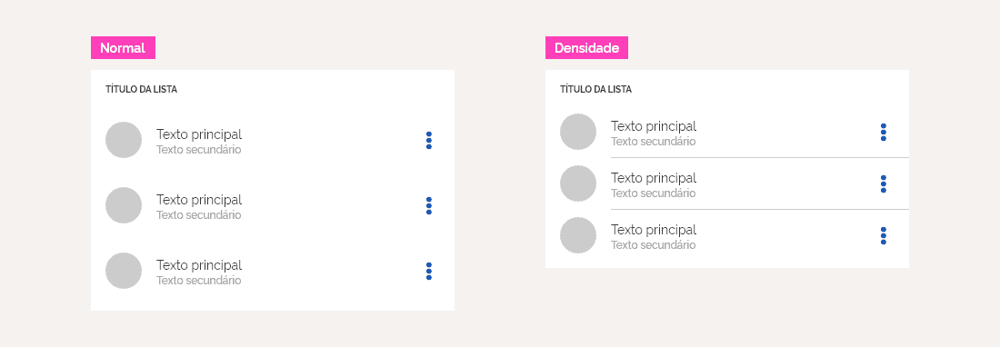

Utilize espaçamento em conjunto com os separadores para melhorar nos casos que o separador não é suficiente para seprar os itens.

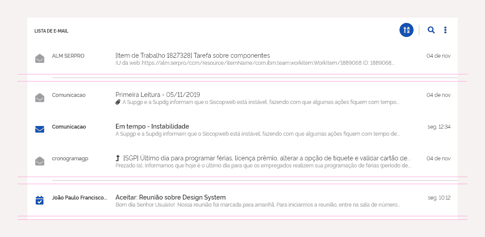

Sempre no início (topo) de uma Lista e no final, deve existir um espaçamento. Caso a lista tenha um título, o coloque espaçamento somente no parte inferior.

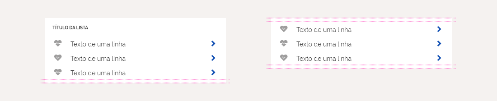

---

### Comportamento da Lista Complexa

#### Densidade

As configuração de densidade de uma Lista, pode ser alterada manipulando a altura dos seus itens afim de ser possível visualizar maior quantidade de conteúdo em uma mesma resolução. Neste caso, a altura dos itens será alterada dependendo do dispositivo utilizado e da quantidade de linha de textos da área Principal de um Item.

A altura mínima deve ser respeitada para cada caso. Veja [especificações](#) para maiores detalhes.

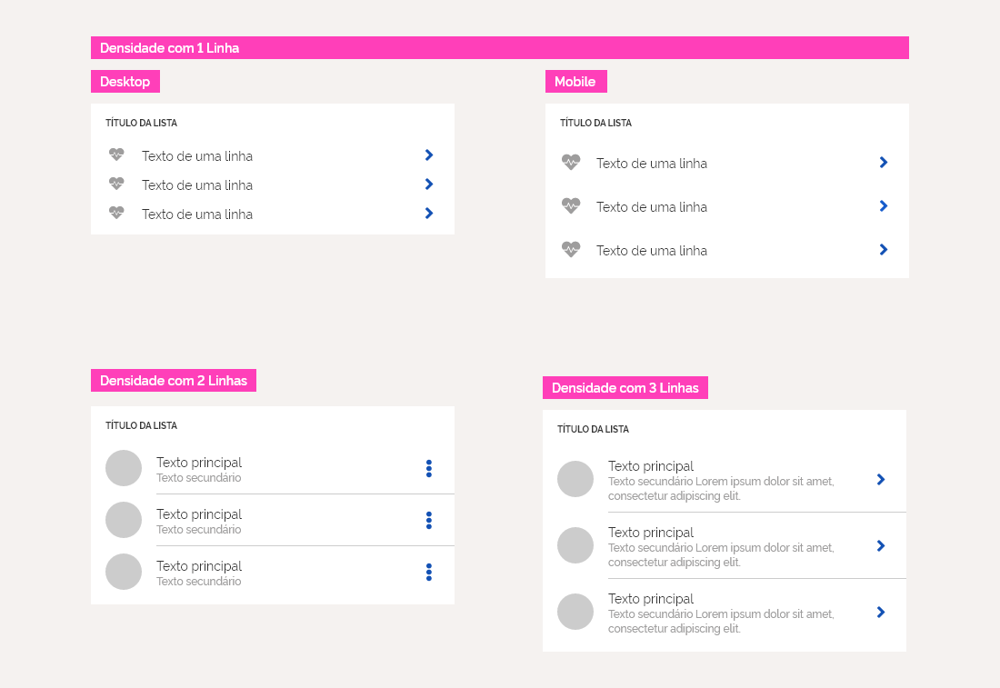
_Densidade mínima para 1 linha de texto é a única que possui distinção baseada no dispositivo utilizado_

#### Responsividade

Quando uma tela é redimensionada, a largura da a área Principal de um Item sofre alteração de acordo com a nova resolução adotada pelo dispositivo, enquanto as demais áreas (suporte visual e suporte) continuam fixas.

#### Estados

Os Itens da lista e os recursos visuais (geralmente os ícones) de um Item, são os elementos que podem possuir estados dentro de uma lista.

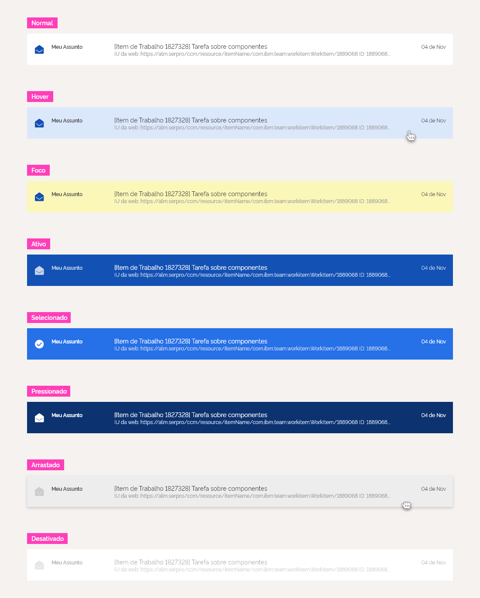

O estado interativo de um item, pode ser representado por uso de íconografia, geralmente na área de suporte.

#### Expandir

Os itens podem exibir ou esconder outros itens da lista, empurrando ou puxando verticalmente os demais conteúdos da lista.

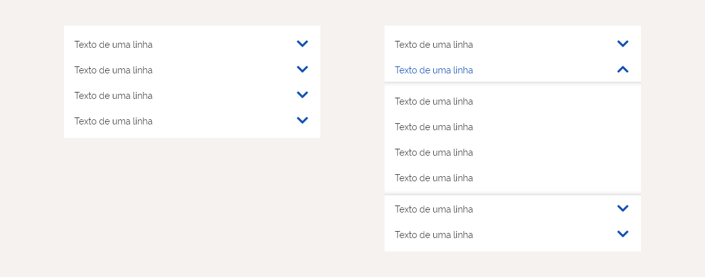

Utilize separadores ou elementos visuais (como uma sombra) para destacar estes novos itens.

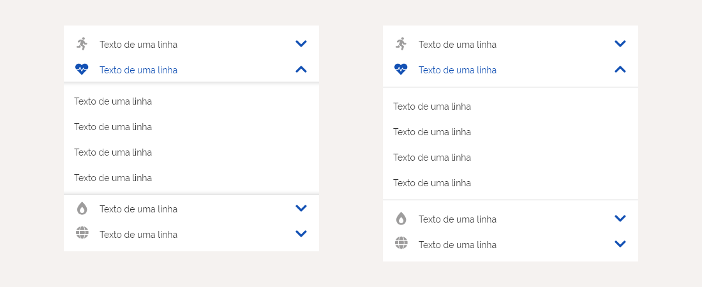

---

## Especificação

## Lista com item de 1 Linha

<a href="https://xd.adobe.com/view/c94553ea-d55e-448f-694f-d5d75bb3b577-bf74/" title="Spec">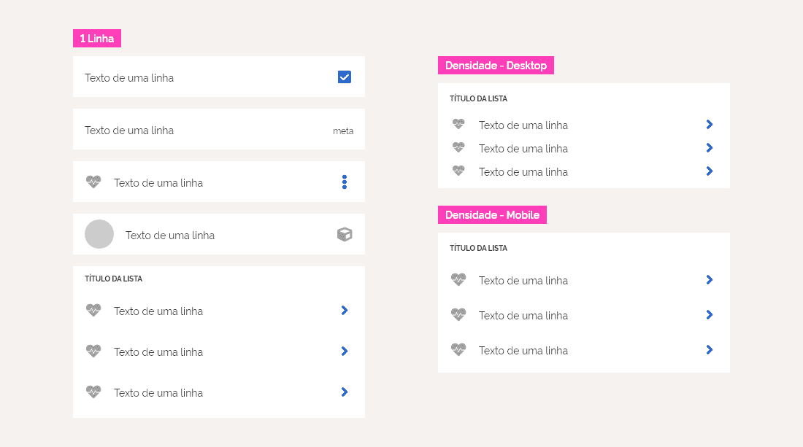</a>

## Lista com item de 2 Linhas

<a href="https://xd.adobe.com/view/c94553ea-d55e-448f-694f-d5d75bb3b577-bf74/screen/8ac84e87-9b9d-43ec-9bc3-2911edea9f99/Listas-2-Linhas" title="Spec">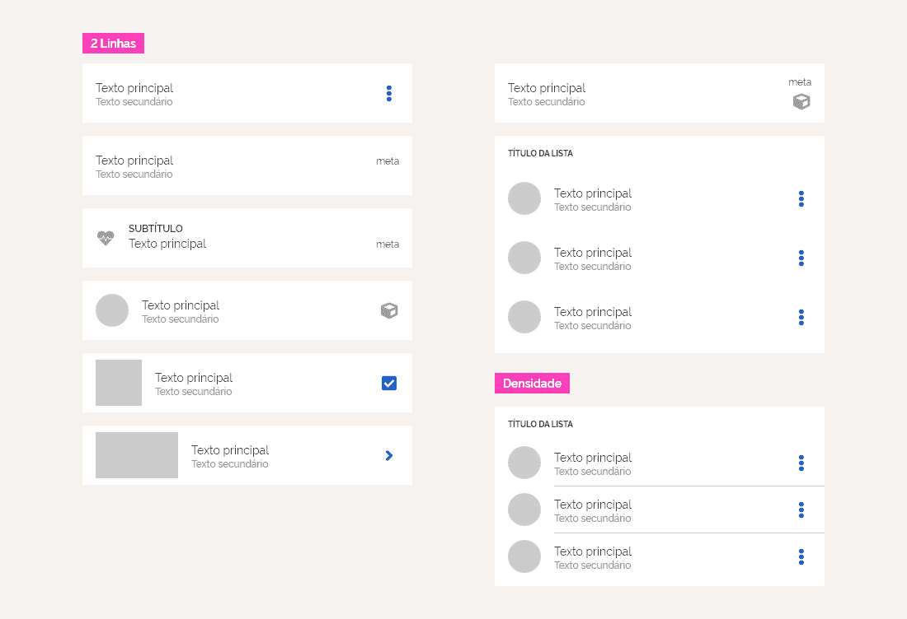</a>

## Lista com item de 3 Linhas

<a href="https://xd.adobe.com/view/c94553ea-d55e-448f-694f-d5d75bb3b577-bf74/screen/b0d1a894-5868-4db6-812e-c2c3b749c02f/Listas-3-Linhas" title="Spec">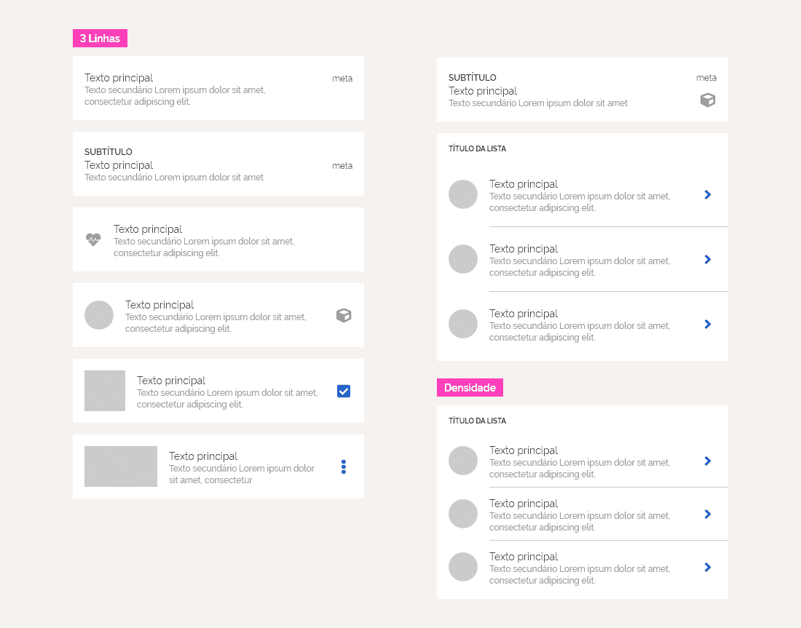</a>

## Estados dos itens

## Comportamento Expandir

