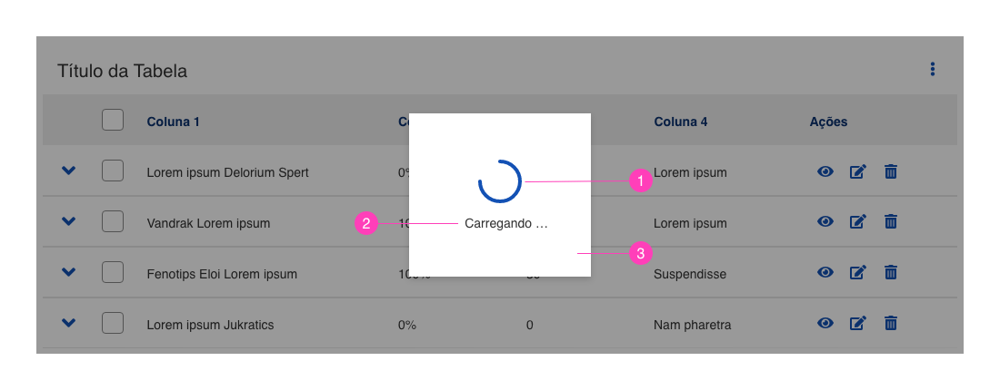
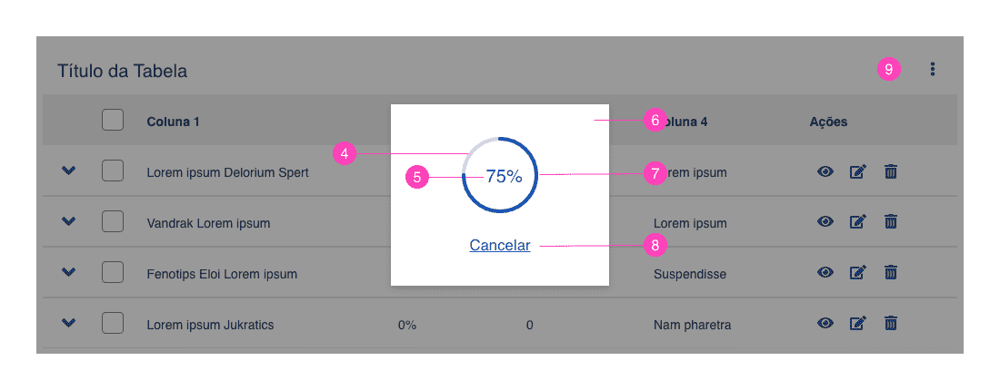
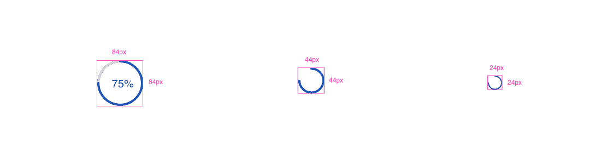
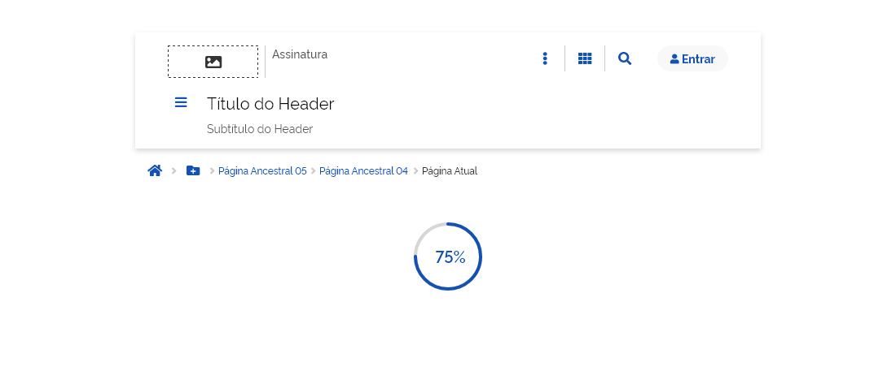
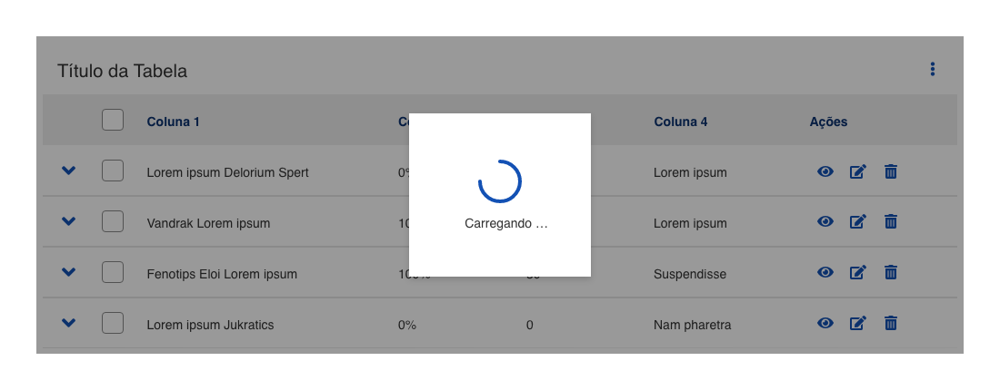

*Exemplo de Loading*

Utilizado com o objetivo de proporcionar *feedback* ao usuário durante algum processamento do sistema. Como, por exemplo, envio de formulários, *upload* de arquivos, carregamento de dados entre outras requisições síncronas e assíncronas ao servidor.

---

## Anatomia

O *loading* é constituído por:

| ID  | Nome                         |                         Referência                          | Uso         |
| --- | ---------------------------- | :---------------------------------------------------------: | ----------- |
| 1   | Círculo dinâmico contínuo    |                             ---                             | Obrigatório |
| 2   | Rótulo                       | [Fundamento Tipografia](/ds/fundamentos-visuais/tipografia) | Opcional    |
| 3   | Superfície 1                 | [Fundamento Superfície](/ds/fundamentos-visuais/superficie) | Opcional    |
| 4   | Círculo Base                 |                             ---                             | Obrigatório |
| 5   | Rótulo Percentual            | [Fundamento Tipografia](/ds/fundamentos-visuais/tipografia) | Obrigatório |
| 6   | Superfície 2                 | [Fundamento Superfície](/ds/fundamentos-visuais/superficie) | Opcional    |
| 7   | Círculo dinâmico progressivo |                             ---                             | Obrigatório |
| 8   | Botão Cancelar               |   [Componente Button](/ds/components/button?tab=designer)   | Opcional    |
| 9   | Superfície *scrim*           | [Fundamento Superfície](/ds/fundamentos-visuais/superficie) | Opcional    |

*Exemplo de loading indeterminado*

*Exemplo de loading determinado*

---

## Detalhamento dos Itens

### 1. Círculo Dinâmico Contínuo (Obrigatório)

Elemento visual em movimento contínuo, responsável por representar o processamento do sistema. Este é o elemento principal do *Loading* Indeterminado.

### 2. Rótulo (Opcional)

Serve para reforçar a mensagem ao usuário de que há um processamento sendo realizado pelo sistema. Seu uso é opcional, porém é recomendado utilizá-lo em situações em que a probabilidade de demora do processamento do sistema seja maior. Elemento visual usado no *Loading* Indeterminado.

### 3. Superfície 200 x 180px (Opcional)

Elemento visual utilizado com o *Loading* Indeterminado. Só deverá ser utilizado quando houver o bloqueio da tela ou parte desta. Servirá para dar contraste e legibilidade entre o componente *Loading* e o *scrim*.

**Obrigatoriedade e Restrições:**
Seu uso será obrigatório quando houver o bloqueio da tela, ou parte desta, pelo elemento *scrim*. Em qualquer outra situação este elemento não deverá ser utilizado.

### 4. Círculo Base (Obrigatório)

Elemento visual que servirá de guia base para o Círculo Dinâmico Progressivo. Ele representa visualmente o percentual não carregado na progressão de 0 a 100%. Este elemento só será utilizado no *Loading* Determinado.

### 5. Rótulo Percentual (Obrigatório)

Informação textual dinâmica que é atualizada de 0% a 100% durante o processamento. Este elemento só será utilizado no *Loading* Determinado.

### 6. Superfície 240 x 200px (Opcional)

Elemento visual utilizado juntamente com o *Loading* Determinado. Só deverá ser utilizado quando houver o bloqueio da tela ou parte desta. Servirá para dar contraste e legibilidade entre o componente *Loading* e o *scrim*.

**Obrigatoriedade e Restrições:**
Seu uso será obrigatório quando houver o bloqueio da tela, ou parte desta, pelo elemento Scrim. Em qualquer outra situação este elemento não deverá ser utilizado.

### 7. Círculo Dinâmico Progressivo (Obrigatório)

Elemento visual que representa dinamicamente a progressão percentual de 0% a 100%. Este elemento só será utilizado no *Loading* Determinado.

### 8. Botão Cancelar (Opcional)

Elemento que compreende o Componente Botão do tipo terciário. Seu uso é opcional. Só poderá ser utilizado quando o sistema tiver a possibilidade de cancelar uma operação já em curso. Este elemento só será utilizado juntamente com o *Loading* Determinado.

### 9. Componente Scrim (Opcional)

Este elemento compreende o Componente *scrim* do tipo foco, ou seja, com **40% de opacidade**. É utilizado para bloquear a tela durante o processamento do sistema.

**Obrigatoriedade e Restrições:**
Seu uso será obrigatório quando for necessário o bloqueio da tela, ou parte desta, pelo sistema. Em qualquer outra situação este elemento não deverá ser utilizado.

---

## Tipos

### 1. *Loading* Determinado (Tamanho Único)

Exibe quanto tempo uma operação vai demorar. Exibe uma progressão **percentual de 0 a 100**. Pode ser utilizado com ou sem o Botão Cancelar. Possui apenas um tamanho.

*Exemplo de loading determinado*

### 2. *Loading* Indeterminado (Tamanho Padrão)

Demonstra um tempo de espera não especificado. Exibe uma forma circular em  movimento contínuo enquanto o processamento dos dados estiver ocorrendo. Pode ser usado com ou sem o rótulo.

*Exemplo de loading indeterminado*

### 3. *Loading* Indeterminado (Tamanho Pequeno)

Possui a mesma finalidade e funcionamento do *Loading* Indeterminado Tamanho Padrão, porém seu uso é mais restrito, apenas dentro de outros componentes, onde o espaço é menor ou em situações em que se quer dar pouco destaque ao processamento. Também pode ser utilizado com ou sem o rótulo.

*Exemplo de loading indeterminado pequeno*

---

## Comportamentos

### 1. Exibição

Dependendo do contexto o componente *loading* poderá ser exibido de formas diferentes, com tamanhos diferenciados:

-   *Loading* Determinado (Tamanho Único): 84x84px

-   *Loading* Indeterminado (Tamanho Padrão): 44x44px

-   *Loading* Indeterminado (Tamanho Pequeno): 24x24px

*Exemplos de possíveis tamanhos para o componente loading*

#### Dentro ou associado a um componente

Neste caso, utiliza-se o *Loading* Indeterminado Tamanho Pequeno (24x24px), geralmente para dar resposta de espera à uma requisição assíncrona, onde o usuário poderá continuar a interagir com outros elementos da página. Por exemplo, pode-se usar o *loading* dentro de um *button*, *table*, *list* etc., como demonstrado na figura abaixo.

*Exemplo de loading dentro de uma componente*

#### No corpo da página

Neste caso, pode-se utilizar o *Loading* Determinado ou Indeterminado em seus tamanhos padrões (44x44px, 84x84px), de acordo com o contexto e a necessidade. Pode ser usado em auxílio a um componente de *upload* ou para demonstrar o carregamento de um bloco ou área da página, como observado no exemplo abaixo.

*Exemplo de loading no corpo da página*

#### Bloqueando a tela ou parte dela

Aqui, também, deve-se utilizar o *Loading* Indeterminado ou Determinado em seus formatos padrões, (44x44px e 84x84px respectivamente). Nesta situação, o usuário é impedido de continuar interagindo com o conteúdo da página ou parte dela durante o processamento da informação. O *loading* é exibido com um *scrim* e uma superfície ao fundo.

*Exemplo de loading indeterminado com o uso do scrim*

*Exemplo de loading determinado com o uso do scrim*

### 2. Movimento

No *Loading Indeterminado*, o elemento apresenta um movimento circular e contínuo no sentido horário como demonstrado na figura abaixo.

No ***Loading* Determinado**, o elemento apresenta um movimento circular crescente no sentido horário, começando ao topo do círculo e terminando quando completar uma volta inteira. Durante o movimento, o rótulo ao centro do círculo é atualizado dinamicamente com a progressão percentual.

---

## Especificações

### Cores

| Name                         | Property         | Color Token            | Opacity |
| ---------------------------- | ---------------- | ---------------------- | :-----: |
| Círculo dinâmico contínuo    | background color | `--blue-warm-vivid-70` |    -    |
| Círculo base                 | background color | `--gray-20`            |    -    |
| Círculo dinâmico progressivo | background color | `--blue-warm-vivid-70` |    -    |
| Rótulo Percentual            | color            | `--blue-warm-vivid-70` |    -    |
| Rótulo                       | color            | `--gray-80`            |    -    |
| Botão                        | color            | `--blue-warm-vivid-70` |    -    |
| Superfície                   | background color | `--pure-0`             |    -    |

### Tipografia

| Name              | Size                      | Weight                    |
| ----------------- | ------------------------- | ------------------------- |
| Rótulo Percentual | `--font-size-scale-up-02` | `--font-weight-semi-bold` |
| Rótulo            | `--font-size-scale-base`  | `--font-weight-medium`    |
| Botão             | `--font-size-scale-up-01` | `--font-weight-medium`    |

### Dimensões

| Name                               |  Width  | Height  |
| ---------------------------------- | :-----: | :-----: |
| Loading Determinado                | `84px`  | `84px`  |
| Loading Indeterminado Padrão       | `44px`  | `44px`  |
| Loading Indeterminado Pequeno      | `24px`  | `24px`  |
| Superfície - Loading Indeterminado | `200px` | `180px` |
| Superfície - Loading Determinado   | `240px` | `200px` |

### Espaçamentos

| Name                                       | margin-bottom | margin-top | margin-left | margin-right | padding-bottom | padding-top | padding-left | padding-right |
| ------------------------------------------ | :-----------: | :--------: | :---------: | :----------: | :------------: | :---------: | :----------: | :-----------: |
| Loading Indeterminado Pequeno              |    `16px`     |   `16px`   |   `16px`    |    `16px`    |       -        |      -      |      -       |       -       |
| Loading Indeterminado Padrão               |    `16px`     |   `16px`   |   `16px`    |    `16px`    |       -        |      -      |      -       |       -       |
| Loading Determinado                        |    `28px`     |   `28px`   |   `28px`    |    `28px`    |       -        |      -      |      -       |       -       |
| Loading Indeterminado Padrão na Superfície |    `auto`     |   `auto`   |   `auto`    |    `auto`    |       -        |      -      |      -       |       -       |
| Loading Determinado na Superfície          |    `auto`     |   `auto`   |   `auto`    |    `auto`    |       -        |      -      |      -       |       -       |
| Rótulo                                     |    `auto`     |   `16px`   |   `auto`    |    `auto`    |       -        |      -      |      -       |       -       |
| Botão                                      |    `auto`     |   `28px`   |   `auto`    |    `auto`    |       -        |      -      |      -       |       -       |
| Superfície - Loading Indeterminado         |    `auto`     |   `auto`   |   `auto`    |    `auto`    |     `auto`     |   `auto`    |    `auto`    |    `auto`     |
| Superfície - Loading Determinado           |    `auto`     |   `auto`   |   `auto`    |    `auto`    |     `auto`     |   `auto`    |    `auto`    |    `auto`     |

**OBS:** Os conteúdos das superfícies são obrigatoriamente **centralizados** na **altura** e na **largura**.

### Sombra

|    Name    | Shadow Token  |
| :--------: | :-----------: |
| Superfície | `--shadow-xl` |
