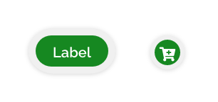
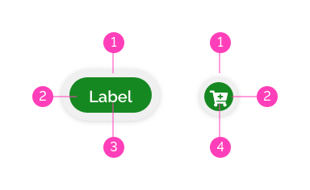
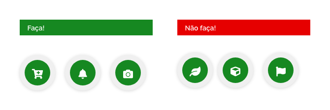
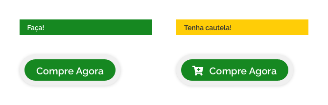
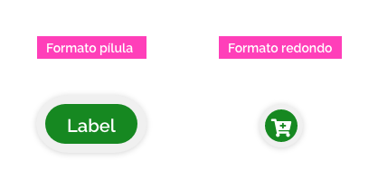
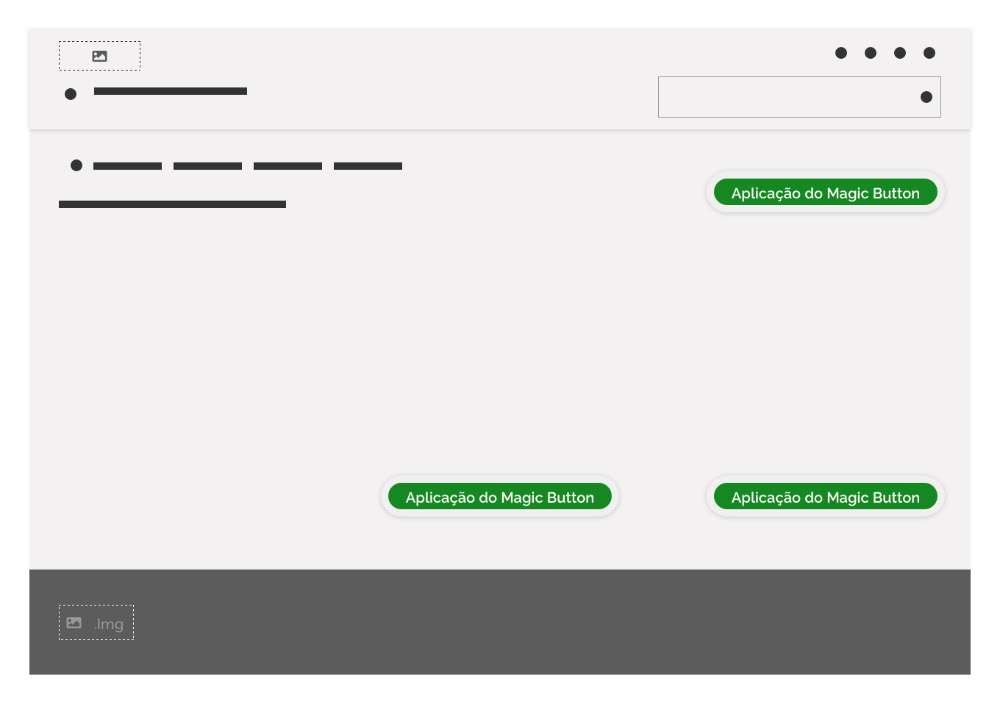
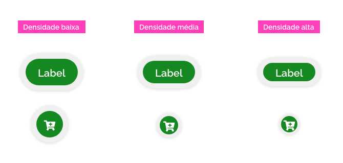
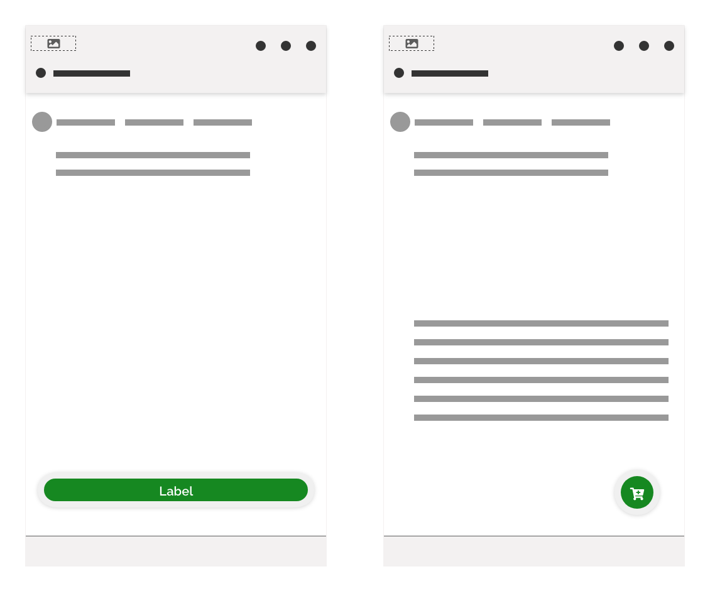
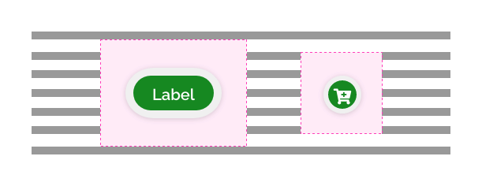

[version]: # (1.0.4)

*Exemplos do componente magic button.*

Use o *magic button* para iniciar/encerrar fluxos relevantes ou induzir usuários a realizar ações que geram algum tipo de conversão.

---

## Anatomia

| ID  | Nome                |                                   Referência                                    | Uso         |
| --- | ------------------- | :-----------------------------------------------------------------------------: | ----------- |
| 1   | Superfície de apoio |  [Fundamento Superfície](https://www.gov.br/ds/fundamentos-visuais/superficie)  | Obrigatório |
| 2   | Superfície          |  [Fundamento Superfície](https://www.gov.br/ds/fundamentos-visuais/superficie)  | Obrigatório |
| 3   | *Label*             |  [Fundamento Tipografia](https://www.gov.br/ds/fundamentos-visuais/tipografia)  | Obrigatório |
| 4   | Ícone               | [Fundamento Iconografia](https://www.gov.br/ds/fundamentos-visuais/iconografia) | Obrigatório |

*Anatomia do componente magic button.*

---

### Detalhamento dos Itens

#### 1. Superfície de Apoio (Obrigatório)

O *magic button* possui uma superfície de apoio. Esta superfície pode ser entendida como uma moldura, o que confere algumas vantagens ao *magic button*:

-   Possui maior robustez que um botão primário.

-   Garante contraste e destaque visual em qualquer cor de *background*.

-   Possui sombra para indicar que o componente se encontra elevado em relação ao fundo proporcionando mais destaque.

-   A superfície de apoio funciona como área de proteção quando o *magic button* tiver o comportamento flutuante.

#### 2. Superfície (Obrigatório)

Trata-se da superfície interna do componente e funciona da mesma maneira que a do *button*.

-   É apenas permitida superfície no formato redondo ou pílula.

-   A única cor possível para a superfície é a indicada pela paleta *highlight*.

#### 3. *Label* (Obrigatório)

O *label* do *magic button* é um pouco mais avantajado que o do *button*, o que lhe ajuda a conferir um peso visual maior.

Utilize estratégicas de "*call-to-action*" para elaborar o texto do *label*. Informe aos usuários qual ação eles realizarão se clicarem no botão. O texto é geralmente *curto*, mas *consistente* de modo que pode rapidamente chamar a atenção dos usuários induzindo à ação.

#### 4. Ícone (Obrigatório)

Tenha cautela ao escolher o ícone que utilizará no *magic button* redondo. Dê preferência a ícones já popularmente consagrados e reconhecido pelas pessoas em geral.

*Exemplos de boas e más escolhas de ícones.*

**Atenção:** não está proibido o uso de ícone no *magic button* pílula, no entanto é recomendado o uso apenas de texto curto e direto e que cause grande impacto. Tenha em mente que a mensagem de um *magic button* deve ser tão clara e direta que não haja a necessidade de ícone para reforçar a mensagem.

*Exemplos de uso de ícone no magic button.*

---

## Tipos

Estão previstos dois tipos de *magic buttons*:

1 - Formato pílula;
2 - Formato redondo.

*Exemplos de uso de ícone no magic button.*

---

## Comportamentos

### 1. *Magic Button* x *Button*

*Magic button* pode ser frequentemente confundido com *buttons* (*primary* e *secondary*) e isso dependerá da sua função em um determinado contexto. Tenha em mente que o contexto é fundamental para a correta escolha do botão. Para facilitar o entendimento apresentamos algumas situações de uso visando auxiliar na decisão de qual componente será mais eficiente em cada caso.

#### Use *Magic Button*

-   Para atrair a atenção do usuário para uma ação de conversão ou geração de *leads* (em relação ao serviço como todo).

-   Para iniciar e encerrar fluxos relevantes.

-   Como botão flutuante de uma ação que deva ser visível independentemente da rolagem de tela.

-   Como botão que pela relevância da sua ação precise se destacar dos *buttons*.

#### Use *button*

-   Como botão que executa uma ação primária em uma tela dando continuidade à navegação.

-   Como botão que executa uma ação secundária (normalmente, em relação a uma ação primária).

-   Como um botão pertencente a um componente.

-   Como botões que dão continuidade a um fluxo com início e fim determinados por *magic buttons*.

-   Para submeter ao servidor informações ordinárias.

-   para ações corriqueiras de um serviço.

-   para associar páginas ou serviços internos e/ou externos.

**Atenção:** tenha em mente que **o button pode substituir o magic button** em todos os contextos porém, o contrário não é permitido.

### 2. Quantidade

*Magic buttons* são botões exclusivos e por isso não é recomendável a existência de mais de um *magic button* em uma tela ou fluxo.

**Atenção:** o mais indicado é que haja apenas um único *magic button* em todo o *site*/aplicativo. Desta forma, fica garantida a exclusividade do componente.

### 3. Posicionamento

Geralmente o *magic button* está localizado nas áreas nobres da tela (no topo à direita, em baixo à direita ou embaixo no centro) ou ainda flutuando sobre o conteúdo. No entanto, não se trata de uma regra. O designer deve analisar com bom senso a melhor localização para o *magic button* ter destaque e não ser confundido com outros componentes.

*Exemplos mais comuns de posicionamento na tela do magic button.*

### 4. Densidade

O componente *magic button* possui as seguintes densidades:

*Exemplos de densidades do componente magic button.*

### 5. Estados

Os estados possíveis para o *magic button* são: *hover*, *pressionado* e *foco*.

*Exemplos de estados do componente magic button.*

**Atenção:** jamais utilize o *magic button* com estado desabilitado. Se for necessário utilizar um botão que possa se tornar desabilitado então este deve ser um botão primário ou secundário.

### 6. Responsividade

Em larguras de quatro colunas, utilize o *magic button* no formato pílula ocupando toda a largura disponível da tela.

O formato redondo flutuante funciona muito bem em aplicativos móveis, devida à escassez de espaço na tela.

*Exemplos de uso do componente magic button em responsividade de quatro colunas.*

---

## Melhores Práticas

-   Tenha em mente que apesar de ser um botão, o *magic button* tem características especiais e exclusivas no *layout*.

-   Por ter forte apelo visual o *magic button* se presta perfeitamente à função de *call-to-action* em um serviço.

-   Use textos curtos porém impactantes nos *labels* dos *magic buttons*.

-   O DS não proíbe o uso de *tooltips* em *magics buttons*, no entanto tenha em mente que o *label* ou o ícone do *magic button* deve ser tão claro e objetivo que não seja necessário o recurso de *tooltips* para que o usuário possa compreender a ação proposta pelo *magic button*.

-   Para conferir maior destaque ao *magic button* crie uma área de respiro para evitar a competição da atenção do usuário com outros componentes, principalmente *buttons*.

*Área de respiro para ambos os tipos de magic button.*

---

## Especificações

### Alinhamento

| Name                |        Spacing Token        |
| ------------------- | :-------------------------: |
| Superfície de apoio | `--spacing-vertical-center` |
| Label               | `--spacing-vertical-center` |
| Icon                | `--spacing-vertical-center` |

### Espaçamento

| Name               | Property                   |       Token/Value       |
| ------------------ | -------------------------- | :---------------------: |
| Label              | marging-right/marging-left |  `--spacing-scale-3x`   |
| Icon (dens. alta)  | marging-left/marging-right | `--spacing-scale-base`  |
| Icon (dens. media) | marging-left/marging-right | `--spacing-scale-baseh` |
| Icon (dens. baixa) | marging-left/marging-right |  `--spacing-scale-2x`   |

### Tipografia

| Name  | Property    |        Token/Value        |
| ----- | ----------- | :-----------------------: |
| Label | family      |   `–-font-family-base`    |
| Label | font-weight | `--font-weight-semi-bold` |
| Label | size        | `--font-size-scale-up-02` |

### Iconografia

| Name  | Property |   Token/Value    |
| ----- | -------- | :--------------: |
| Ícone | size     | `--icon-size-lg` |

### Cores

| Name                | Property   |          Token          |
| ------------------- | ---------- | :---------------------: |
| Label               | color      |       `--pure-0`        |
| Superfície          | background | `--green-cool-vivid-50` |
| Superfície de Apoio | background |       `--gray-5`        |

### Arredondamento [Formato pílula]

| Name                              | Property              | Value  |
| --------------------------------- | --------------------- | :----: |
| Superfície (dens. alta)           | top-left-bottom-right | `18px` |
| Superfície (dens. media)          | top-left-bottom-right | `22px` |
| Superfície (dens. baixa)          | top-left-bottom-right | `26px` |
| Superfície de apoio (dens. alta)  | top-left-bottom-right | `28px` |
| Superfície de apoio (dens. media) | top-left-bottom-right | `32px` |
| Superfície de apoio (dens. baixa) | top-left-bottom-right | `36px` |

### Arredondamento [Formato redondo]

| Name                              | Property              | Value  |
| --------------------------------- | --------------------- | :----: |
| Superfície (dens. alta)           | top-left-bottom-right | `18px` |
| Superfície (dens. media)          | top-left-bottom-right | `22px` |
| Superfície (dens. baixa)          | top-left-bottom-right | `28px` |
| Superfície de apoio (dens. alta)  | top-left-bottom-right | `28px` |
| Superfície de apoio (dens. media) | top-left-bottom-right | `32px` |
| Superfície de apoio (dens. baixa) | top-left-bottom-right | `36px` |

### Densidade [Superfície]

| Name        | Property |      Token/Value      |
| ----------- | -------- | :-------------------: |
| Dens. alta  | height   | `--spacing-scale-4xh` |
| Dens. media | height   | `--spacing-scale-5xh` |
| Dens. baixa | height   | `--spacing-scale-6xh` |

### Densidade [Superfície de apoio]

| Name        | Property |     Token/Value      |
| ----------- | -------- | :------------------: |
| Dens. alta  | height   | `--spacing-scale-7x` |
| Dens. media | height   | `--spacing-scale-8x` |
| Dens. baixa | height   | `--spacing-scale-9x` |

### Sombra

|        Name         | Token Shadow  |
| :-----------------: | :-----------: |
| Superfície de apoio | `--shadow-sm` |
