[version]: # (1.3.0)

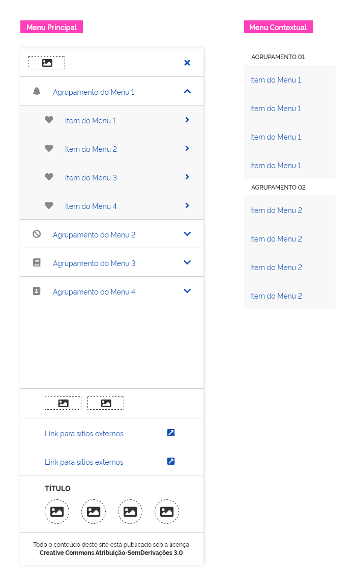
*Exemplo de menu de navegação principal e menu de navegação contextual.*

O menu de navegação deve ser utilizado com o objetivo de oferecer acesso a todas as áreas ou páginas do *site*/sistema. Esse acesso é feito por meio de *links* categorizados em seções e subseções definidos pela arquitetura da informação.

---

## Tom e voz

Seguindo as boas práticas de design e usabilidade, o tom e voz utilizado no menu devem ser sucintos e objetivos. Por conta do espaço limitado, deve-se evitar o uso de textos longos e quebra do texto em duas ou mais linhas. Aqui deve-se usar o bom senso, a substituição de palavras longas por sinônimos menores, com o objetivo de atender à comunicação clara ao usuário e, ao mesmo tempo, garantir a boa estética.

---

## Anatomia

O menu é constituído por:

| ID  | Nome                         |                              Referência                               | Uso         |
| --- | ---------------------------- | :-------------------------------------------------------------------: | ----------- |
| 1   | Ícone de acionamento         |    [Button](https://www.gov.br/ds/components/button?tab=designer)     | Opcional    |
| 2   | Superfície *scrim*           |                                  ---                                  | Condicional |
| 3   | Cabeçalho do menu            |    [Header](https://www.gov.br/ds/components/header?tab=designer)     | Opcional    |
| 4   | Botão Fechar                 |    [Button](https://www.gov.br/ds/components/button?tab=designer)     | Opcional    |
| 5   | Item de 1º nível             |      [Item](https://www.gov.br/ds/components/item?tab=designer)       | Opcional    |
| 6   | Item de 2º nível             |      [Item](https://www.gov.br/ds/components/item?tab=designer)       | Condicional |
| 7   | Ícone Expandir/Retrair       |    [Button](https://www.gov.br/ds/components/button?tab=designer)     | Condicional |
| 8   | Ícone representativo do item | [Iconografia](https://www.gov.br/ds/fundamentos-visuais/iconografia)  | Opcional    |
| 9   | Ícone Acessar Subitens       |    [Button](https://www.gov.br/ds/components/button?tab=designer)     | Condicional |
| 10  | Componente *divider*         | [Divider](https://www.gov.br/ds/components/divider?tab=desenvolvedor) | Condicional |
| 11  | Painel do menu               |                                  ---                                  | Obrigatório |
| 12  | Rodapé do menu               |    [Footer](https://www.gov.br/ds/components/footer?tab=designer)     | Opcional    |

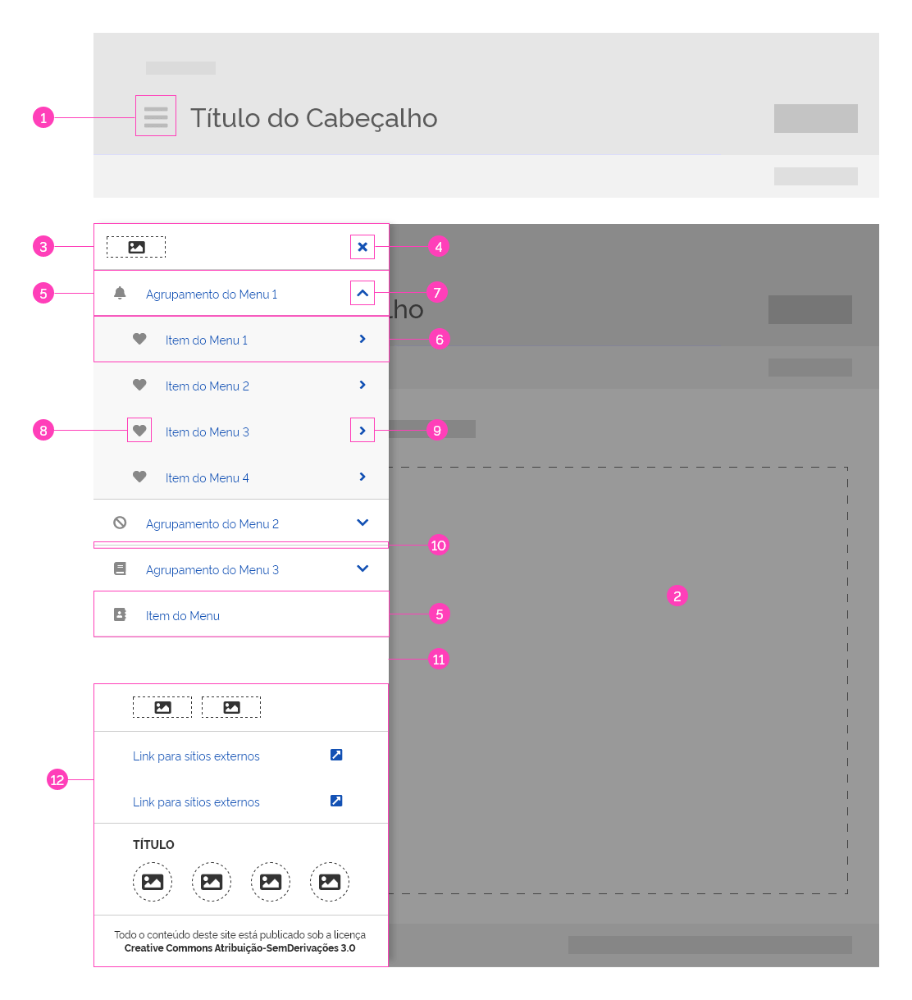
*Anatomia do menu.*

---

## Detalhamento dos Itens

### 1. Ícone de acionamento (Opcional)

A partir deste ícone/botão o usuário pode acionar o menu e ter acesso aos *links* para navegação.

### 2. Superfície *scrim* (Condicional)

Este elemento serve para adicionar contraste entre o componente menu e o conteúdo da tela ao fundo, direcionando a atenção do usuário ao conteúdo do menu. Neste contexto, será utilizado a superfície *scrim*.

Este elemento é condicional porque só será apresentado com o primeiro tipo de abertura do menu principal, quando este se apresenta sobre a tela cobrindo o conteúdo.

Veja mais informações sobre modos de abertura do menu em: Comportamentos > Acionamento/Fechamento.

**Atenção:** nesse caso, o menu passará a ocupar a *camada 3* na hierarquia de elevação e apresentará a sombra correspondente a essa camada.

Veja mais detalhes no documento [Fundamentos Elevação](https://www.gov.br/ds/fundamentos-visuais/elevacao).

### 3. Cabeçalho do menu (Opcional)

Identifica o *site* ou sistema. Seu uso é opcional e pode ser utilizado com o logo, o título ou algum elemento que identifique o *site* ou o menu.  

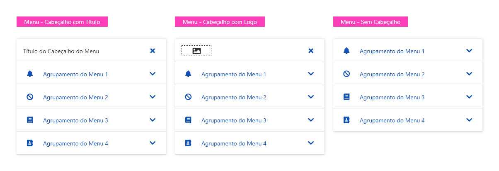
*Possibilidades de aplicação do cabeçalho do menu.*

### 4. Botão Fechar (Opcional)

Este elemento está localizado no cabeçalho do menu e seu uso é opcional, visto que é possível optar pelo fechamento com um clique em qualquer área da tela fora do menu.
É recomendado, porém, oferecer as duas opções de fechamento do menu concomitantemente: botão Fechar e clique fora do menu.

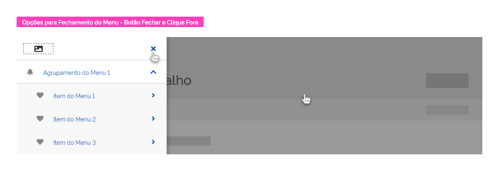
*Possibilidades de fechamento do menu.*

**Atenção:** em alguns casos, o menu pode ser fixo na tela e não oferecer a possibilidade de fechamento e abertura.

### 5. Itens de 1º nível (Opcional)

São formados pelo componente item e utilizados essencialmente para  possibilitar a navegação pelo menu. Os itens de primeiro nível podem funcionar como itens agrupadores ou como itens de navegação. Quando utilizado como agrupador, use o ícone Expandir/Retrair à direita para reforçar a existência de subitens. Garanta que a área de interação seja em toda a área do item.

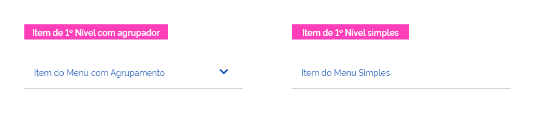
*Itens do menu com agrupamento e simples.*

### 6. Item de 2º nível (Condicional)

Este elemento é condicionado à  necessidade de uso de subitens.

São também formados pelo componente item e possuem algumas distinções em relação aos itens de 1º nível a fim de garantir contraste visual entre os dois níveis de itens do menu:

-   São utilizados com uma indentação maior;
-   Apresentam cor de fundo diferenciada;
-   Não deve utilizar o componente *divider* para separá-los.

Quando um item de 2º nível apresentar subitens, um ícone de seta deve ser utilizado à direta e nestes casos levam o usuário para um painel com os itens filhos.

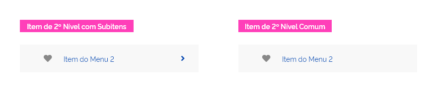
*Item do menu de 2º nível.*

### 7. Ícone Expandir/Retrair (Condicional)

Utilize os ícones Expandir/Retrair para acionar o comportamento *collapse* para acionamento dos subníveis.

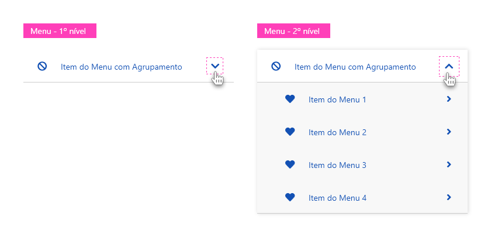
*Uso do ícone Expandir/Retrair.*

### 8. Ícones representativos (Opcional)

Ícones representativos do item é um elemento opcional e pode ser usado para dar ênfase visual aos *links* de navegação, reforçando a semântica do texto.

Preze pelas boas práticas de utilização:

-   Utilize a família de ícones adotada no Design System (*Font Awesome*);

-   Padronize a utilização de ícones.
Por exemplo: utilize em todos os itens do mesmo bloco ou em todos os itens do menu.

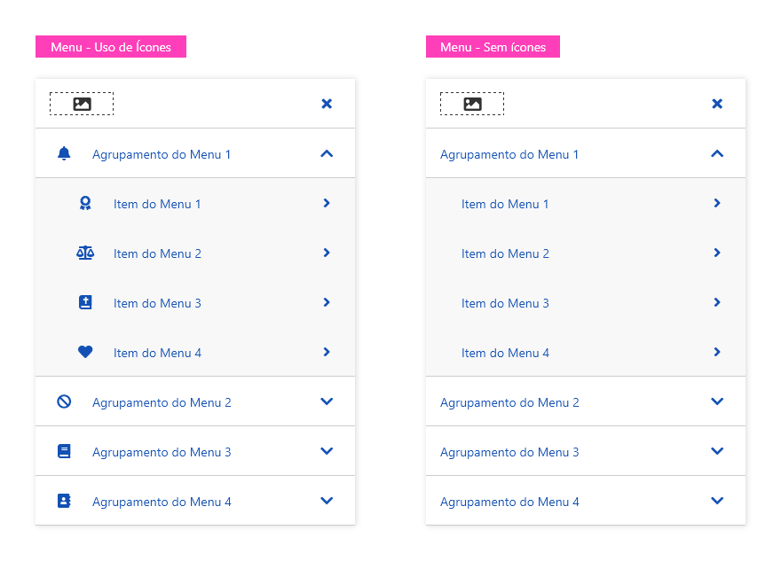
*Padronize o uso dos ícones no menu.*

### 9. Ícone Acessar Subitens (Condicional)

Este elemento é condicionado à existência de subitens no 2º nível do menu.
Os itens filhos devem ser apresentados em um painel separado.

Veja mais detalhes em Comportamento > 2º nível.

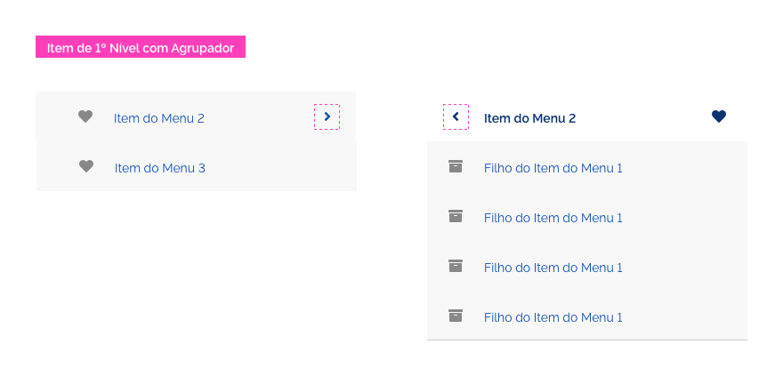
*Subníveis do 2º nível do menu.*

### 10. Componente *divider* (Condicional)

O componente *divider* deve ser utilizado apenas no 1º nível do menu. Os itens de 2º nível não utilizam *dividers*.

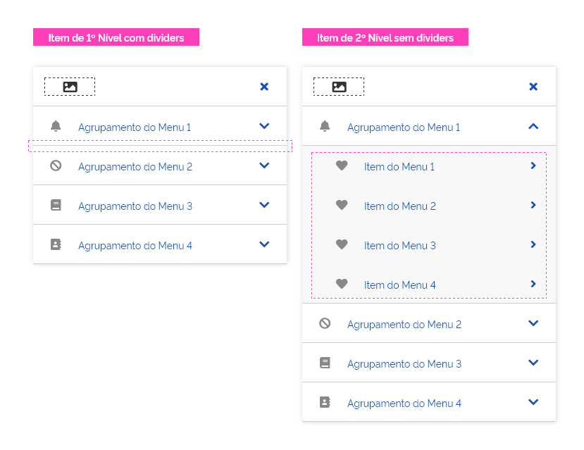
*Uso do componente divider.*

### 11. Painel do menu (Obrigatório)

O painel é utilizado como superfície de suporte para os itens do menu. Quando acionado, abrirá flutuando e deslizando lateralmente da esquerda para direita. Opcionalmente, pode ocorrer com a utilização do elemento *scrim* ocupando toda a área da tela.

O painel pode conter também outros elementos auxiliares.

### 12. Rodapé do menu (Opcional)

Está posicionado na parte inferior do painel do menu e contém algumas áreas de apoio, como *links* para acesso a *sites* externos, mídias sociais, informações adicionais, etc.

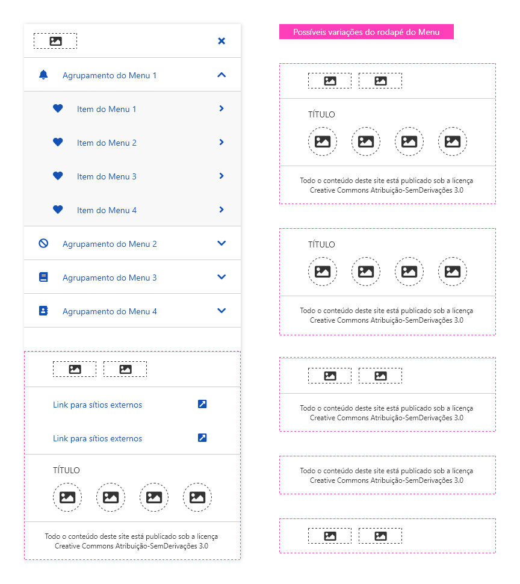
*Possíveis usos do rodapé do menu.*

**Atenção:** o rodapé deve ser utilizado conforme a necessidade e é flexível para conter qualquer tipo de informações adicionais.

---

## Tipos

### 1. Menu Principal

Por meio do menu principal o usuário tem acesso a todos os *links* para as páginas do *site*/sistema.

O menu principal deve ser fácil de ser acessado de qualquer página do *site*/sistema.

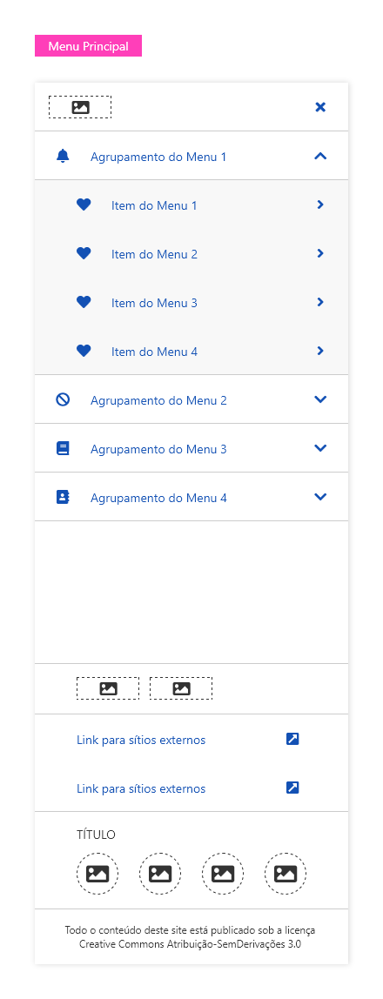
*Exemplo de menu principal.*

### 2. Menu Contextual

O menu contextual ou secundário, é utilizado de forma auxiliar ao principal. Geralmente é aplicado para navegações de páginas internas ou itens relacionados (âncoras). É menos relevante e por isso costuma ser uma versão simplificada do menu principal.

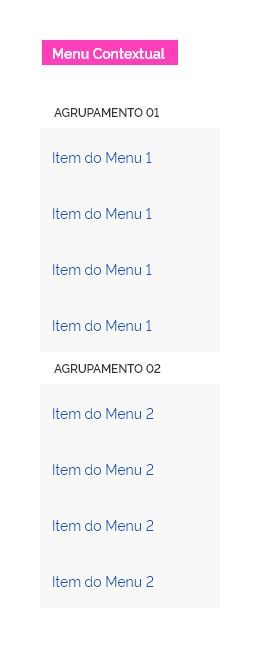
*Exemplo de menu contextual.*

O menu contextual se encontra na *camada zero* de elevação e portanto não apresenta sombra.

**Atenção:** Por ser uma versão "enxuta" do menu principal, evite subníveis e excesso de elementos. Menus contextuais devem ser simples e diretos portanto, quanto menos elementos, melhor performance apresentará.

Tenha em mente que ambos os menus (principal e contextual) funcionam de modo independente. Evite, portanto, dispor *links* comuns nos dois menus. Deixe bem claro para o usuário o nível de navegação que cada menu oferece.

---

## Comportamentos

### 1. Localização

O menu principal pode se comportar de duas maneiras distintas na tela:

-   Flutuando;
-   Fixo.

#### Flutuando

O menu é aberto por meio de um elemento acionador localizado no cabeçalho do *site*/sistema e aparece flutuando sobre o conteúdo da tela. Este comportamento do menu principal deve estar associado ao elemento *scrim*, que "bloqueia" o acesso ao conteúdo da tela enquanto o menu estiver aberto.

Neste caso, o menu deverá se encontrar na *camada 3* na hierarquia de elevação e apresenta a sombra correspondente a essa camada.

Veja mais detalhes no documento [Fundamentos Elevação](https://www.gov.br/ds/fundamentos-visuais/elevacao).

Para fechar o menu, basta clicar novamente no mesmo elemento acionador, no ícone fechar no cabeçalho do menu ou em qualquer área da tela fora do menu.

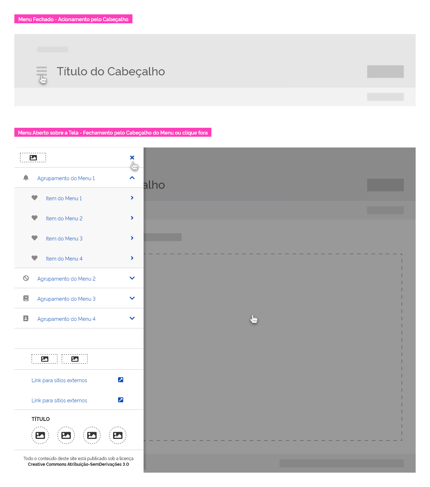
*Comportamento do menu principal flutuando.*

#### Fixo

O menu principal é acionado por meio de um elemento acionador localizado no cabeçalho e é aberto na lateral da página sem sobrepor o conteúdo. O conteúdo da página é então deslocado para direita

Neste caso, não há sobreposição de camadas porém, pelo fato de ser considerado um elemento relevante deve ser apresentado na *camada 1* de elevação e por isso apresenta sombra suave.

Veja mais detalhes no documento [Fundamentos Elevação](https://www.gov.br/ds/fundamentos-visuais/elevacao).

Para fechar o menu, basta clicar no no elemento acionador, que deve ter o ícone alterado para "fechar".

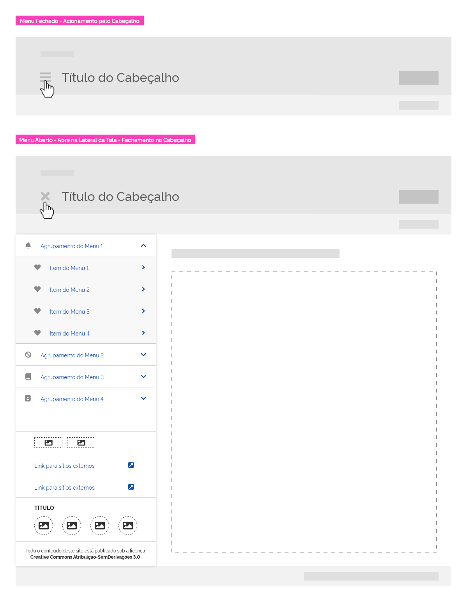
*Comportamento do menu principal fixo.*

#### Menu contextual

O menu contextual, quando houver, pode ser fixo ou *sticky* e e geralmente fica posicionado no extremo direito da tela para não competir com o menu principal. Geralmente não há a possibilidade do usuário abri-lo ou fechá-lo.

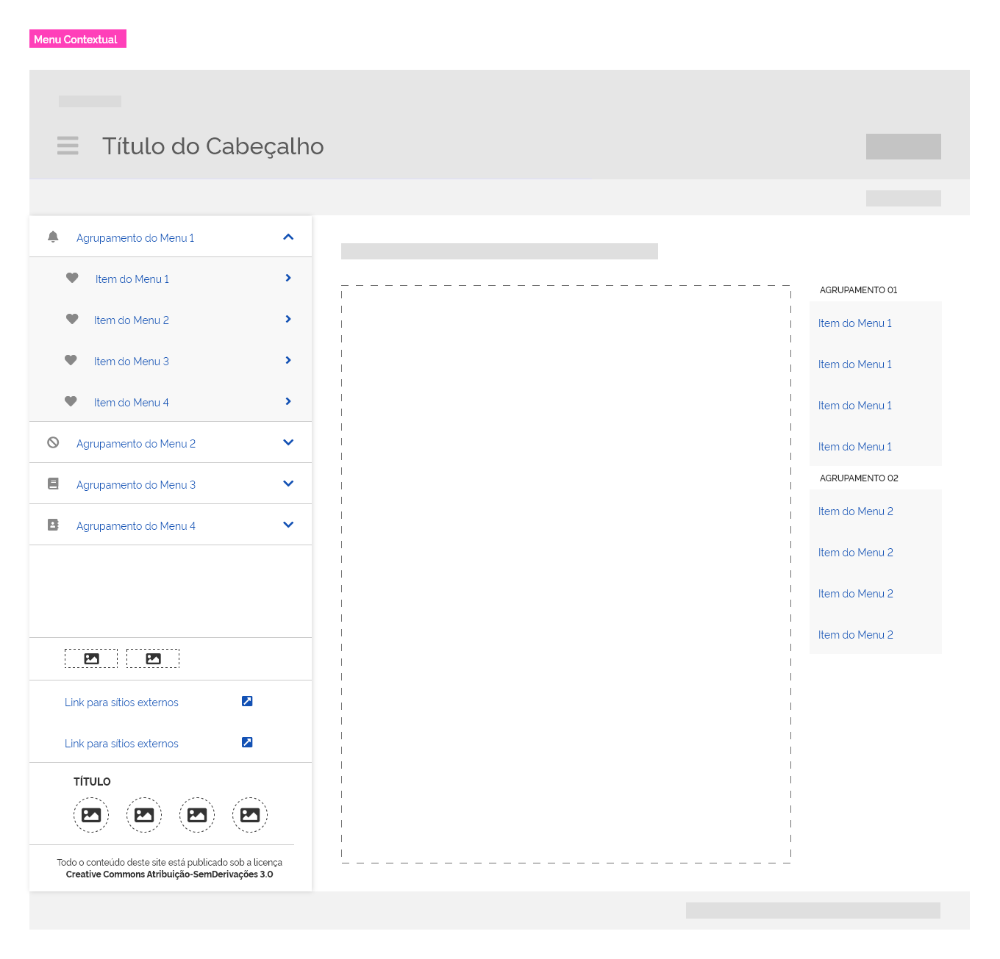
*Comportamento do menu contextual.*

### 2. Rolagem

Menus podem apresentar muitos itens, ultrapassando a altura da tela do dispositivo (*desktop*, *tablet* ou *smartphone*).

De acordo com [padrão da diretriz Template Base](https://www.gov.br/ds/templates/base?tab=designer), a Área de navegação pode existir um barra de rolagem interna para acessar o conteúdo.

Porém nos *smartphones*, como a altura do dispositivo geralmente são bem menor, a rolagem deve ocorrer de forma natural, rolando todo conteúdo do menu para cima ou para baixo utilizando a própria rolagem do navegador. Em outras palavras, evite o uso de rolagem interna na grid de 4 colunas!

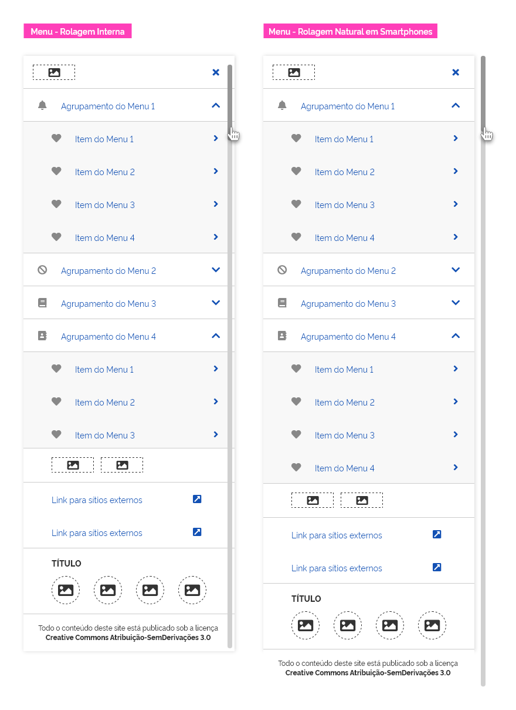
*Comportamento de rolagem do menu.*

### 3. Agrupamento de itens

Agrupamentos de itens podem ser utilizados tanto no menu principal quanto no menu contextual.

Há três formas de agrupar:

-   Agrupamento por expansão;
-   Agrupamento por rótulos;
-   Agrupamento por *dividers*.

#### Agrupamento por expansão

O usuário pode expandir ou retrair os blocos de agrupamento para acessar os subitens que estão ocultos.

#### Agrupamento por rótulos

Os blocos de agrupamento são classificados por rótulos e não há a ação de expansão/retração dos subitens.

#### Agrupamento por *dividers*

Os itens do menu são separados pelos componentes *dividers*.

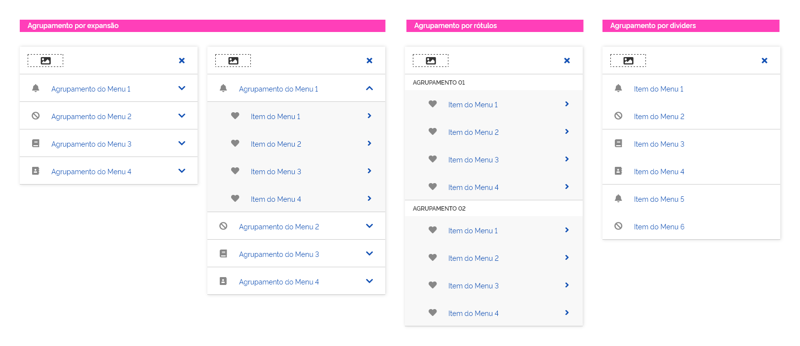
*Possibilidades de agrupamento dos itens do menu.*

**Atenção:** evite utilizar agrupamentos no meu contextual. Caso seja realmente necessário, prefira os agrupamentos por rótulos ou por *dividers*.

### 4. Navegação em subníveis

Realce a existência de subníveis ocultos utilizando ícones de seta.

Clicando nos itens agrupadores, o menu desliza para baixo e apresenta os subitens de 1º nível. O mesmo ocorre do 1º para o 2º nível. Para retornar os níveis basta realizar o processo inverso.

*Exemplo de navegação entre 1º e o 2º nível.*

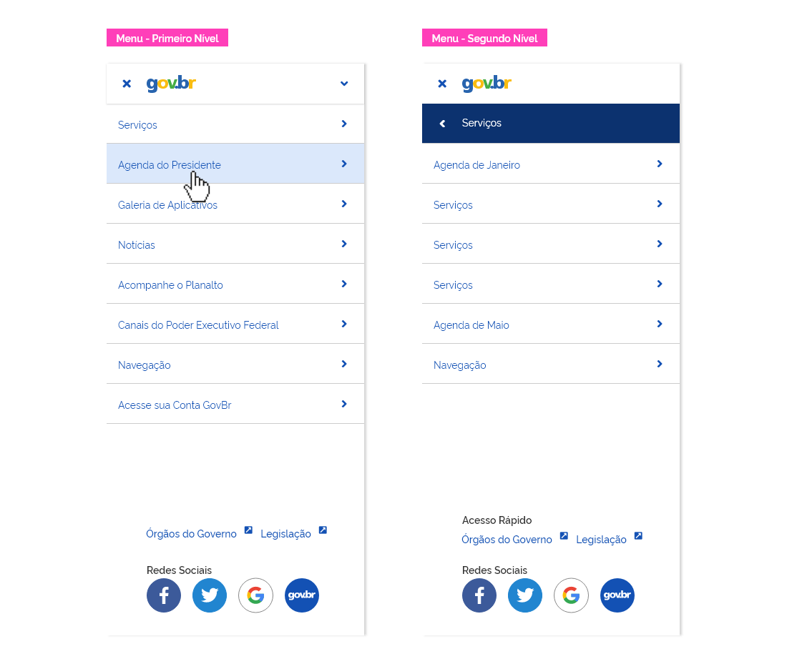
*Exemplo de navegação entre 2º para o 3º nível.*

Pode haver subníveis dentro de subníveis e o comportamento de navegação é sempre o mesmo. Desta forma, o usuário tem sempre a sua frente a opção escolhida e a possibilidade de retornar ao nível anterior.

**Atenção:** se o menu for fechado e aberto em seguida, apresente o 1º nível de itens.

### 5. Responsividade

Tendo em vista a variedade de resoluções e dispositivos existentes, não é possível determinar uma largura fixa para o componente menu. Sendo assim, a largura deve ser ajustada à *grid* para cada *layout*, respeitando os diversos tamanhos de dispositivos.

#### *Grid* de 12 colunas

Em *grids* de 12 colunas o menu principal e o menu contextual podem ocorrer conjuntamente sem problemas.

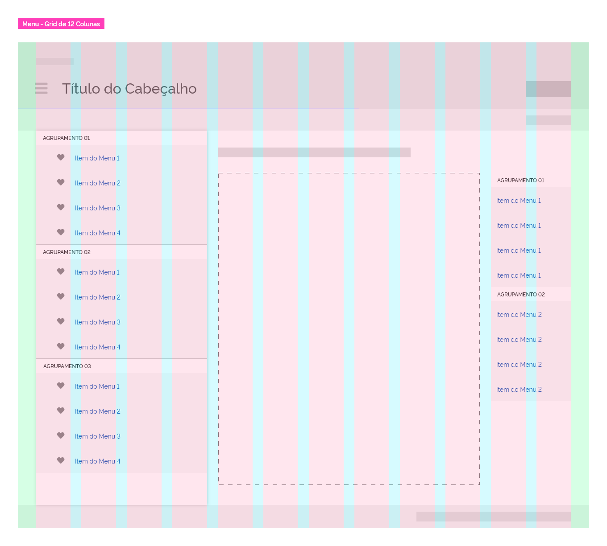
*Exemplo de grid de 12 colunas.*

#### *Grid* de 8 colunas

Em *grids* de 8 colunas o menu contextual deve mudar de comportamento e ocupar uma barra inferior *dropdown*. Maiores detalhes são expostos na explicação da *grid* de 4 colunas.

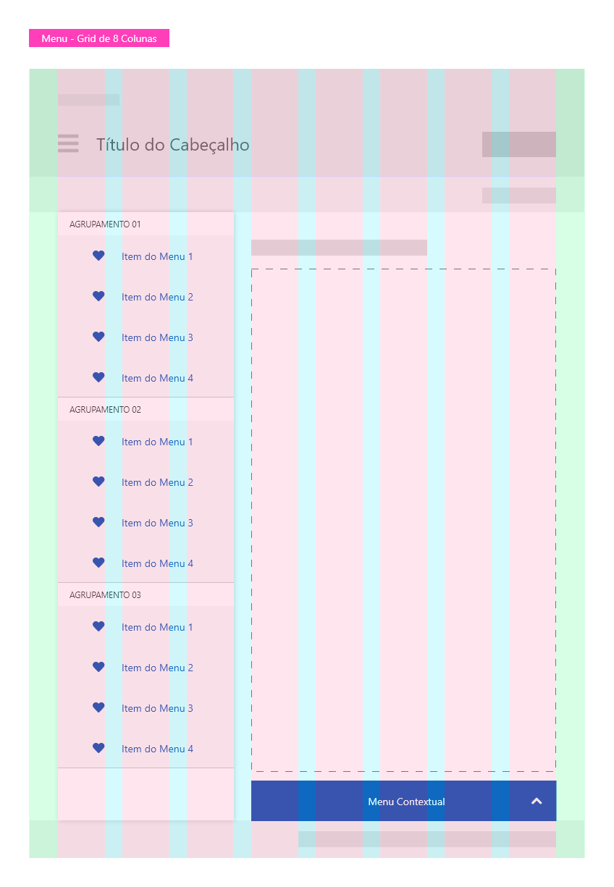
*Exemplo de grid de 8 colunas.*

#### *Grid* de 4 colunas

#### Menu principal

Em dispositivos smartphones o menu principal assumirá a largura completa da tela ocupando todas as colunas da *grid*.

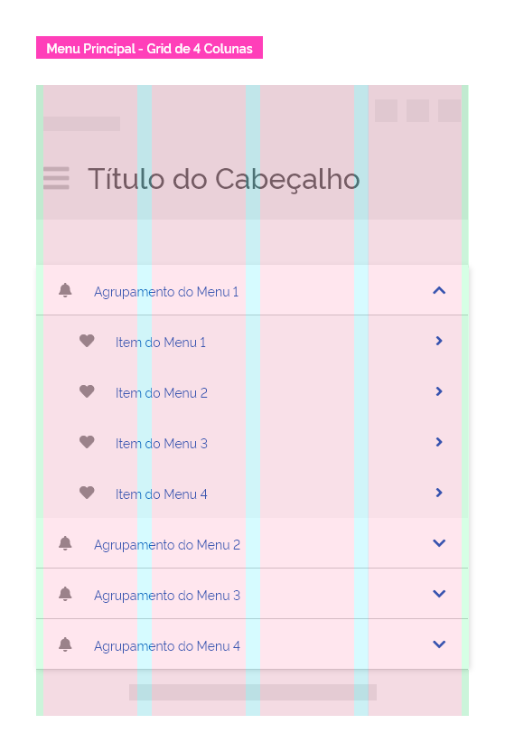
*Exemplo de grid de 4 colunas para o menu principal.*

**Atenção:** no menu principal flutuante, por se tratar de um elemento dropdown, não há necessidade de adequação à grid, pois são elementos flutuantes e não recebem influência da mesma. Porém, é importante definir um percentual da dimensão deste conteúdo. Recomenda-se que a largura do menu ocupe de 25% a 35% da área visível da tela, enquanto que em grids de 4 colunas a ocupação deve ser de 100% da área visível.

#### Menu grid 4 colunas contextual

Na *grid* de 4 colunas há uma adaptação substancial no menu contextual que é apresentado como uma barra na base da área visível da tela. Ao ser acionado, o menu contextual expande de baixo para cima e ocupa parte da tela que é preenchida pelo componente *scrim*, reforçando a ênfase no menu.

**Atenção:** ao rolar a tela, a barra do menu contextual permanece fixa na base da área visível da tela.

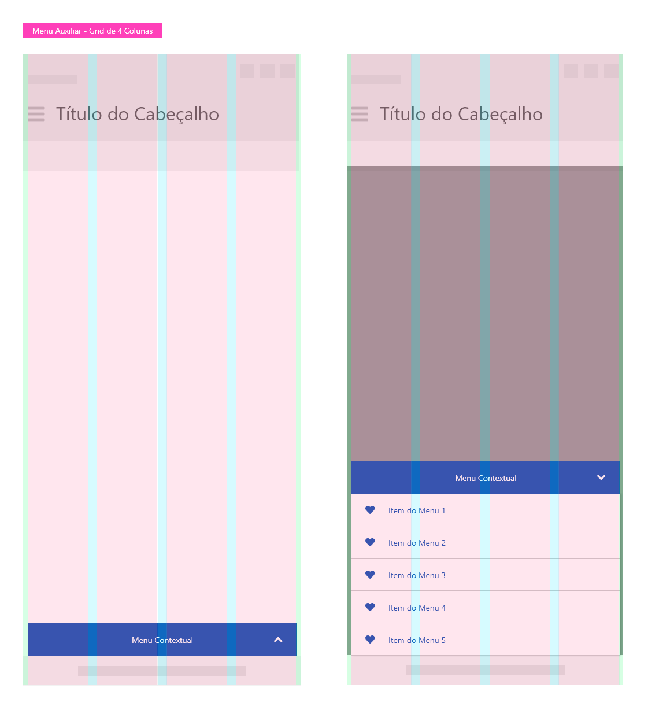
*Exemplo de grid de 4 colunas para o menu contextual.*

### 6. Estados

#### Estado interativo

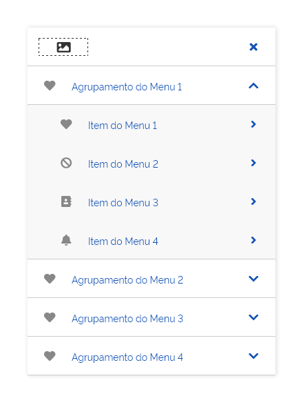
*Exemplo de estado interativo do menu.*

#### Estado *hover*

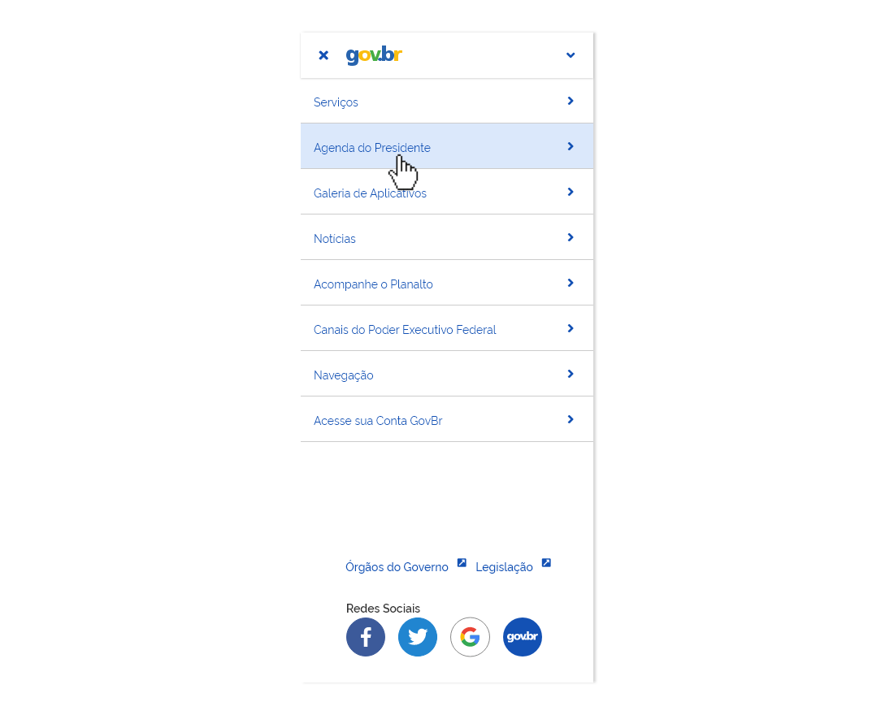
*Exemplo de estado hover do menu.*

#### Estado foco

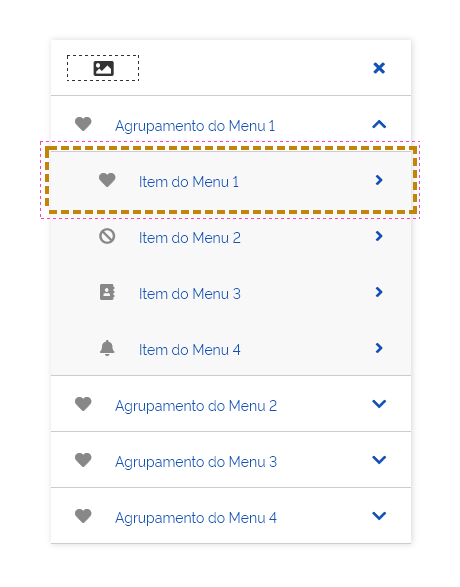
*Exemplo de estado foco do menu.*

#### Estado desabilitado

*Exemplo de estado desabilitado do menu.*

#### Estado ativo

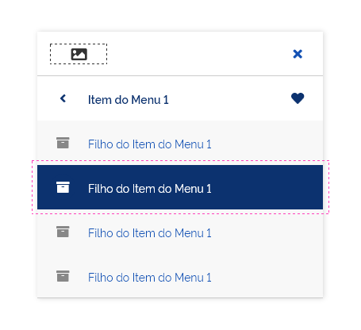
*Exemplo de estado ativo do menu.*

Para mais detalhes a respeito das regras de funcionamento dos estados, consulte [Fundamentos Visuais > Estados.](https://www.gov.br/ds/fundamentos-visuais/estados)

### 7. Densidade

O menu pode ser implementado em três densidades, que se referem ao nível de espaçamento interno nos itens:

-   **Densidade alta:** os itens têm o espaçamento interno mais condensado. Este tipo de densidade é útil quando há a necessidade de otimizar o espaço vertical.

-   **Densidade média:** é a densidade padrão dos itens do menu. Neste modo há maior equilíbrio entre economia de espaço e separação de elementos.

-   **Densidade baixa:** oferece maior espaçamento interno possível. É recomendado o uso em dispositivos móveis, pois é necessário um espaço maior nos elementos para a interação com os dedos (*touch*).

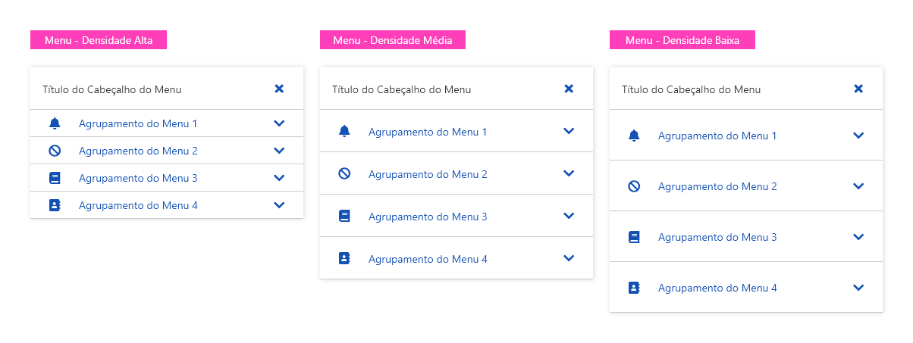
*Tipos de densidade para o menu principal e para o menu contextual.*

---

## Melhores Práticas

-   Não use menus ou ícones de menu minúsculos em telas com resolução grande. Os menus não devem ser ocultados quando houver muito espaço para exibi-los.

-   Os usuários esperam encontrar elementos da interface onde já os viram antes em outros *sites* ou aplicativos (por exemplo, barra esquerda, parte superior da tela). Faça com que essas expectativas trabalhem a seu favor, posicionando seus menus onde as pessoas esperam encontrá-los.

-   Faça os *links* do menu parecerem interativos. Os usuários podem nem perceber que é um menu se as opções não parecerem clicáveis ​​(ou tocáveis).

-   Teste sempre seu menu com o usuário final e valide se a arquitetura de informação utilizada faz sentido.

-   Use o estado ativo para indicar aos usuários "onde" a tela atualmente visível está localizada nas opções do menu. “Onde estou?” é uma das perguntas fundamentais que os usuários precisam responder para navegar com sucesso. Os usuários contam com dicas visuais de menus (e outros elementos de navegação, como *breadcrumbs*) para responder a essa pergunta crítica. Deixar de indicar a localização atual é provavelmente o erro mais comum que vemos nos menus de sites. Ironicamente, esses menus têm a maior necessidade de orientar os usuários, já que os visitantes muitas vezes não entram pela página inicial.

-   Use rótulos de *link* compreensíveis. Descubra o que os usuários estão procurando e use rótulos de agrupamentos familiares e relevantes. Use uma terminologia que descreva claramente o conteúdo e os recursos.

-   Se as pessoas desejam frequentemente comparar produtos relacionados ou concluir várias tarefas em uma única seção, torne essas páginas próximas visíveis com um menu de navegação contextual, em vez de forçá-las a "pular" para cima e para baixo na hierarquia do menu principal.

-   Dê a opção para o usuário decidir deixar o menu fixo na tela (principalmente em *sites* com conteúdo muito extenso) ou retraí-lo (para um melhor aproveitamento da leitura do conteúdo).

-   Considere utilizar o recurso de busca juntamente com o menu. Ofereça outras maneiras de o usuário buscar o conteúdo desejado.

-   Por regra geral o menu contextual funciona independentemente do menu principal e geralmente é utilizado na navegação interna de telas com grande quantidade de conteúdo. Desta forma, evite o uso de itens que apontam para outras telas ou para informações externas ao *site*. Reserve essa função ao o menu principal.
O menu contextual pode estar localizado em qualquer área da página, mas lembre-se de garantir a consistência do *layout*. Geralmente é aplicado na lateral direita da tela de modo fixo ou flutuante.

*Exemplo de localização do menu contextual.*

---

## Especificações

### Cores

#### Painel

| Name             | Property   | Color Token |
| ---------------- | ---------- | ----------- |
| Painel flutuante | background | `--pure-0`  |
| Painel fixo      | background | `--pure-0`  |

#### Cabeçalho do menu

| Name                    | Property   | Color Token            |
| ----------------------- | ---------- | ---------------------- |
| Background do cabeçalho | background | `--pure-0`             |
| Cor do título           | color      | `--gray-80`            |
| Cor do ícone Fechar     | color      | `--blue-warm-vivid-70` |

#### Item 1º nível

| Name                 | Property   | Color Token            |
| -------------------- | ---------- | ---------------------- |
| Background do item   | background | `--pure-0`             |
| Cor do texto         | color      | `--blue-warm-vivid-70` |
| Ícone representativo | color      | `--gray-40`            |
| Ícone ação           | color      | `--blue-warm-vivid-70` |

#### Item 2º nível

| Name                           | Property   | Color Token            |
| ------------------------------ | ---------- | ---------------------- |
| Background do item             | background | `--gray-2`             |
| Background do item em destaque | background | `--gray-2`             |
| Cor do Texto                   | color      | `--blue-warm-vivid-70` |
| Cor do Texto em destaque       | color      | `--blue-warm-vivid-80` |
| Ícone representativo           | color      | `--gray-40`            |
| Ícone ação                     | color      | `--blue-warm-vivid-70` |

#### Rodapé do menu

| Name                 | Property         | Color Token            |
| -------------------- | ---------------- | ---------------------- |
| Background do rodapé | background color | `--pure-0`             |
| Cor do título        | color            | `--gray-80`            |
| Cor do texto         | color            | `--gray-80`            |
| Cor do ícone link    | color            | `--blue-warm-vivid-70` |

### Iconografia

#### Cabeçalho menu

| Name           | ícone                               | Size               | Class (Font Awesome) |
| -------------- | ----------------------------------- | ------------------ | -------------------- |
| Ícone Expandir | <i class="fas fa-chevron-down"></i> | `--icon-size-base` | `fa-chevron-down`    |
| Ícone Retrair  | <i class="fas fa-chevron-up"></i>   | `--icon-size-base` | `fa-chevron-up`      |
| Ícone Fechar   | <i class="fas fa-times"></i>        | `--icon-size-base` | `fa-times`           |

#### Item do menu (1º e 2º níveis)

| Name              | ícone                               | Size               | Class (Font Awesome) |
| ----------------- | ----------------------------------- | ------------------ | -------------------- |
| Ícone Expandir    | <i class="fas fa-chevron-down"></i> | `--icon-size-base` | `fa-chevron-down`    |
| Ícone Retrair     | <i class="fas fa-chevron-up"></i>   | `--icon-size-base` | `fa-chevron-up`      |
| Acionar subnível  | <i class="fas fa-angle-right"></i>  | `--icon-size-base` | `fa-angle-right`     |
| Retornar subnível | <i class="fas fa-angle-left"></i>   | `--icon-size-base` | `fa-angle-left`      |

#### Rodapé menu

| Name               | ícone                                           | Size             | Class (Font Awesome)          |
| ------------------ | ----------------------------------------------- | ---------------- | ----------------------------- |
| Ícone link externo | <i class="fas fa-external-link-square-alt"></i> | `--icon-size-sm` | `fa-external-link-square-alt` |

### Tipografia

#### Cabeçalho  menu

| Name               | Size                     | Weight                  |
| ------------------ | ------------------------ | ----------------------- |
| Texto do cabeçalho | `--font-size-scale-base` | `--font-weight-regular` |

#### Item do menu

| Name                      | Size                     | Weight                    |
| ------------------------- | ------------------------ | ------------------------- |
| Texto do item             | `--font-size-scale-base` | `--font-weight-regular`   |
| Texto do item em destaque | `--font-size-scale-base` | `--font-weight-semi-bold` |

#### Rodapé  menu

| Name             | Size                     | Weight                    |
| ---------------- | ------------------------ | ------------------------- |
| Título do rodapé | `--font-size-scale-base` | `--font-weight-semi-bold` |
| Texto do rodapé  | `--font-size-scale-base` | `--font-weight-medium`    |

### Dimensões

| Name              | Property |   Value    |
| ----------------- | -------- | :--------: |
| Cabeçalho do menu | Height   |   `56px`   |
| Cabeçalho do menu | Width    | `variável` |
| Item do menu      | Height   |   `56px`   |
| Item do menu      | Width    | `variável` |
| Rodapé do menu    | Height   | `variável` |
| Rodapé do menu    | Width    | `variável` |

### Espaçamentos

#### Menu tamanho padrão

| Name              | Property       |         Value         |
| ----------------- | -------------- | :-------------------: |
| Cabeçalho do menu | padding-left   | `--spacing-scale-2x`  |
| Cabeçalho do menu | padding-right  | `--spacing-scale-2x`  |
| item do menu      | padding-left   | `--spacing-scale-2x`  |
| item do menu      | padding-right  | `--spacing-scale-2x`  |
| Rodapé            | padding-left   | `--spacing-scale-7x`  |
| Rodapé            | padding-right  | `--spacing-scale-2x`  |
| Rodapé            | padding-top    | `--spacing-scale-3xh` |
| Rodapé            | padding-bottom | `--spacing-scale-4x`  |

#### Menu largura mínima (320px)

| Name              | Property       |         Value          |
| ----------------- | -------------- | :--------------------: |
| Cabeçalho do menu | padding-left   | `--spacing-scale-base` |
| Cabeçalho do menu | padding-right  |  `--spacing-scale-2x`  |
| item do menu      | padding-left   |  `--spacing-scale-5x`  |
| item do menu      | padding-right  |  `--spacing-scale-2x`  |
| Rodapé            | padding-left   |  `--spacing-scale-5x`  |
| Rodapé            | padding-right  |  `--spacing-scale-2x`  |
| Rodapé            | padding-top    | `--spacing-scale-3xh`  |
| Rodapé            | padding-bottom |  `--spacing-scale-4x`  |

### Sombra

|            Name             |           Shadow            |
| :-------------------------: | :-------------------------: |
|   Superfície (menu fixo)    | `--surface-shadow-sm-right` |
| Superfície (menu flutuando) | `--surface-shadow-lg-right` |
