[Version]: # (11.2.0)

*Exemplo de Message*

Utilize o _Message_ quando houver a necessidade de transmitir qualquer informação ao usuário em decorrência de interações com o sistema, ou em decorrência de eventos previamente programados pelo sistema;

---

## Anatomia

O _Message_ é composto pelos seguintes elementos:

1 - Superfície do Message (Obrigatório)
2 - Ícones (Opcional)
3 - Título do Message (Opcional)
4 - Mensagem (Obrigatório)
5 - Botão Fechar (Opcional)

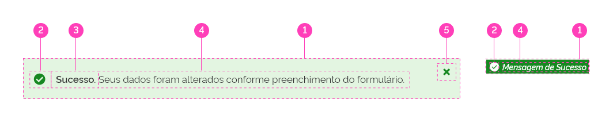
*Anatomia do Message*

### Detalhamento dos itens

#### 1 - Superfície do _Message_ (Obrigatório)

A Superfície do _Message_ é o elemento do _Componente Message_ que agrupará todos os outros elementos que o compõe e que estão previamente listadas na anatomia. A Superfície do _Message_ tem a função de definir semânticamente o tipo de mensagem está sendo transmitida, além de destacar a mensagem sobre todos os outros elementos da _interface_.

Logo, a Superfície do _Message_ pode ser apresentada em diferentes cores, com funções semânticas. Veja mais detalhes em _Comportamento > Estados_.

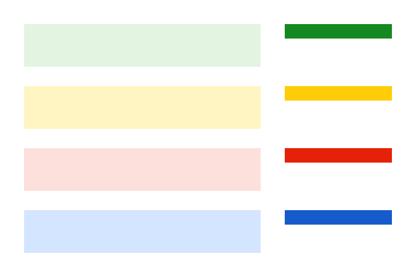
*Superfície do _Message_*

**Atenção:** a Superfície do _Message_ pode variar de tamanho em decorrência do Tipo do _Message_, conteúdo interno, ou tamanho da tela. Consulte detalhes na seção _Comportamentos_.

#### 2 - Ícones (Opcional)

O _Ícone_ é um elemento opcional do _Componente Message_ e tem a função de reforçar o _Estado Semântico_ da mensagem. É recomendável utilizar estas categorias de _Ícones_, correspondente a cada _Estado_ _Semântico_ da mensagem e correspondente a ação desejada. Observe abaixo:

A - Sucesso - (_Check-Circle_)
B - Alerta - (_Exclamation-Triangle_)
C - Erro - (_Times-Circle_)
D - Informação - (_Info-Circle_)
E - Ação Fechar - (_Times_)

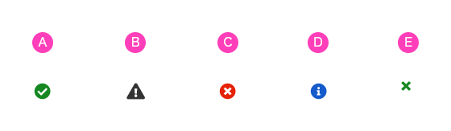
*Exemplo de Ícones*

Consulte maiores detalhes e referências na seção _Design Tokens_.

##### Posição dos Ícones

Os ícones de função semântica devem ser posicionados à esquerda na Superfície do _Message_, enquanto o _Botão Fechar_, deve ser posicionado no topo e à direita.

A - Ícones de função semântica
B - Ícone de ação _Fechar_

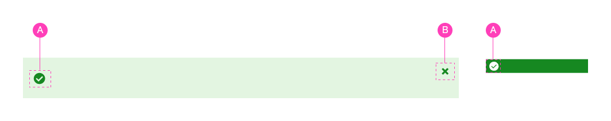
*Posição dos Ícones*

#### 3 - Título do Message (Opcional)

O Título do _Message_ é um elemento opcional e serve para dar destaque à mensagem textual. É utilizado logo no início do texto ou acima dele. Geralmente se utiliza uma palavra ou pequena frase de efeito, resumindo a ideia da descrição textual.

O Título do _Message_ pode ser posicionado:

A - No início, na mesma linha da mensagem;

B - No início, acima da mensagem.

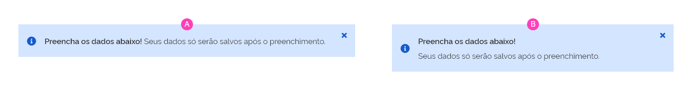
*Título do Message*

##### Tom e Voz

É recomendável utilizar uma palavra ou pequena frase que sintetize toda ideia descrita na mensagem.

#### 4 - Mensagem (Obrigatório)

A mensagem é o elemento essencial e obrigatório do _Componente Message_. Através dela é transmitida ao usuário a informação de _feedback_ do sistema.

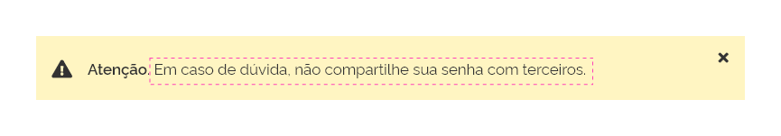
*Mensagem*

##### Tom e Voz

Deve-se optar por um texto curto, claro e objetivo, compreendendo toda informação necessária ao usuário.

#### 5 - Botão Fechar (Opcional)

Este elemento é o _Componente Botão - Ênfase Terciária de Alta Densidade_. É um elemento opcional e tem a função de ocultar o Componente _Message_ da tela. É um recurso útil por oferecer ao usuário a opção de liberar mais espaço em tela após ler a mensagem.

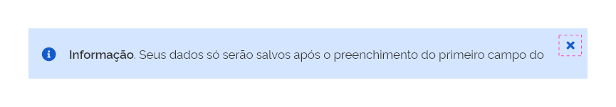
*Botão Fechar*

No tipo _Mensagem Contextual_, não existe a opção de utilização do _Botão Fechar_. Utilize o _Botão Fechar_ apenas no Tipo de _Message_ Padrão.

**Atenção!** Geralmente, quando a mensagem possui um conteúdo muito importante, não é recomendável utilizar o _Botão Fechar_, garantindo que o conteúdo esteja sempre visível ao usuário, porém, não é uma ação obrigatória.

---

## Tipos

### 1 - Mensagem Tipo Padrão

A Mensagem Tipo Padrão é utilizada quando há a necessidade de oferecer ao usuário um _feedback_ de contexto global, ou seja, que tenha relação com um processo ou interação referente à tela ou seção em que o usuário está interagindo.

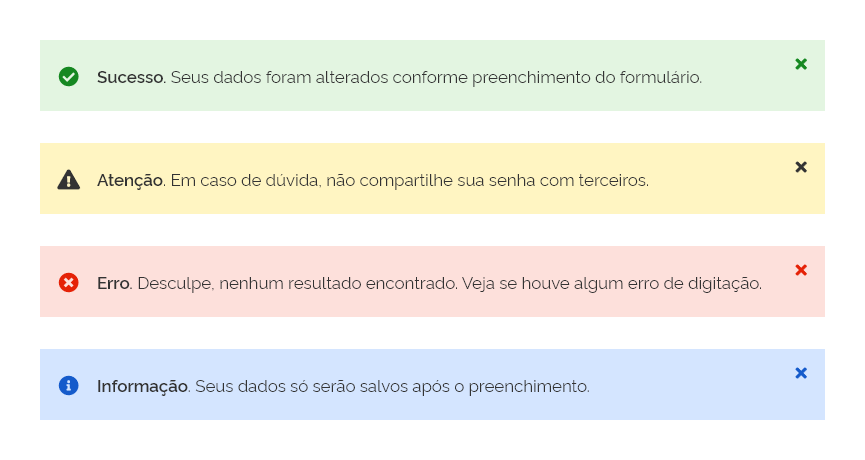
*Mensagem Tipo Padrão*

### 2 - Mensagem Tipo Contextual

A _Mensagem Tipo Contextual_ é utilizada quando o _feedback_ está relacionado a algum elemento ou componente dentro de uma tela ou seção. Refere-se diretamente à ação do usuário sobre algum _Componente_.

*Mensagem Tipo Contextual*

Por exemplo, a mensagem de validação de campo de texto é uma _Mensagem Contextual_.

*Exemplo de Mensagem Contextual*

---

## Comportamento

### 1 - Responsividade

A Superfície do _Message_ se estenderá até o limite à direita da tela, oferecendo espaço ao texto da mensagem. Quando o espaço da tela for menor que a largura do texto da mensagem, a Superfície do Message_ também se estenderá até o limite, porém sua altura também será  aumentada, acompanhando a quebra de linha do texto da mensagem. Observe abaixo.

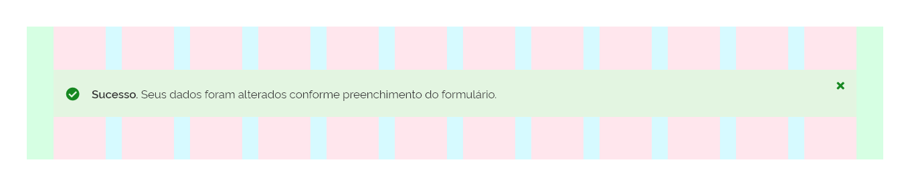
*Grid de 12 Colunas*

*Grid de 8 Colunas*

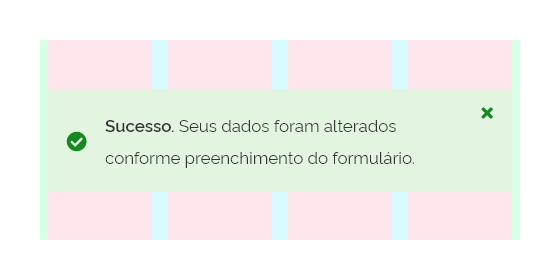
*Grid de 4 Colunas*

**Atenção**! É importante notar que a posição do _Botão Fechar_ permanece a mesma, enquanto o _Ícone_ de função semântica será posicionado centralizado na vertical, enquanto a _Superfície do Message_ aumentar sua altura. Consulte mais detalhes em _Comportamento > Quebra de Linha_.

### 2 - Superfície do _Message_ x Quebra de Linha

Quando o tamanho da mensagem de texto for maior que a largura da tela, o comportamento padrão é que ocorra quebra de linha na mensagem, aumentando a altura da _Superfície do Message_.

A - A mensagem é menor que a largura da tela: a _Superfície do Message_ mantém sua altura padrão e sua largura se estende até o final da tela;

B - A mensagem é maior que a largura da tela: a _Superfície do Message_ mantém sua largura até o limite da tela enquanto que sua altura acompanha o texto.

B e C - O _Botão Fechar_ permanece na mesma posição, enquanto o _Ícone_ de função semântica se mantém centralizado na vertical da _Superfície do Message_.

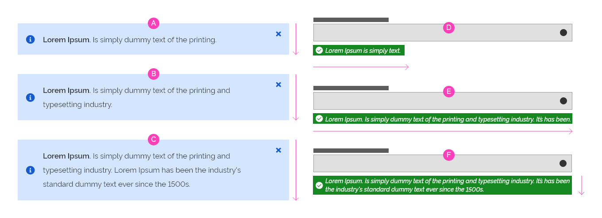
*Exemplo da superfície do _message_ se adaptando ao conteúdo.*

Na _Mensagem Contextual_ a Superfície do _Message_ acompanha sempre o conteúdo interno em sua largura e altura, porém a _Superfície do Message_ tem seu limite relacionado à largura do _Componente_ ao qual se refere. Observe a imagem acima.

D - A _Superfície do Message_ tem sua largura relacionada ao tamanho do texto;

E - A Superfície do _Message_ acompanha o tamanho do texto até o limite de largura do _Componente_ ao qual está relacionado.

F - Quando o tamanho do texto da mensagem for maior que a largura do _Componente_ relacionado, ocorre a quebra de linha e a altura da Superfície do _Message_ acompanha a altura do texto.

### 3 - Posicionamento

Existem 2 formas de posicionamento para as **mensagens do tipo padrão**. Deverão ser apresentados de acordo com a necessidade de uso. São elas: **Mensagem para uso global** e **Mensagem para uso direcionado**.

#### Mensagem para uso global

A informação deste tipo de notificação, deve, de forma geral, ser uma resposta à funcionalidade de toda a página ou sistema e deverá ser apresentado entre o cabeçalho e o componente _breadcrumb_, se estendendo até o limite da sua largura. Neste tipo de posicionamento, a superfície do _Message_ deverá se estender, sangrando a área da _Grid_, enquanto seu conteúdo interno deverá respeitar as margens da área útil. Como exemplificado abaixo:

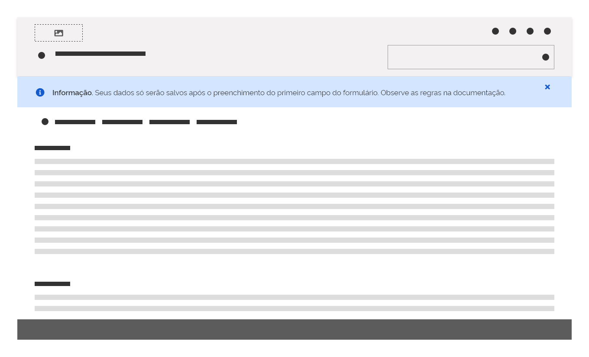
*Exemplo de posicionamento da notificação para uso global*

#### Mensagem para uso direcionado

A notificação para uso direcionado deve ser uma resposta do sistema relacionado-o a uma funcionalidade específica ou local, que não impacte em todo conteúdo da página. Sempre que possível, recomenda-se posicionar a mensagem próximo ao elemento ao qual a mensagem se refere.

No exemplo abaixo, a informação de sucesso está diretamente relacionada a uma ação realizada em um dos ítens do componente _tab_.

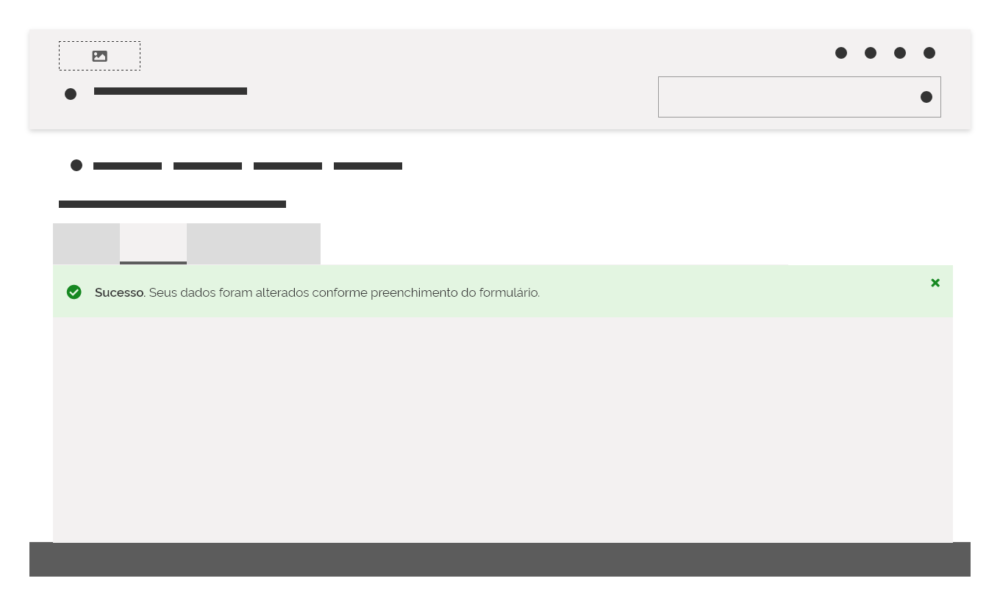
*Exemplo de posicionamento da notificação para uso direcionado*

### 4 - Estados

O _Message_ pode ser apresentado nos seguintes estados:

#### Estado Informativo

É o estado padrão de utilização do _Message_. Deve ser usado quando o objetivo da mensagem for uma informação neutra.

*Estado Informativo*

#### Estado Sucesso

Deve ser usado quando o objetivo da mensagem for transmitir uma ideia de finalização de tarefa/passo ou conclusão bem sucedida.

*Estado Sucesso*

#### Estado Alerta

Deve ser usado quando o objetivo da mensagem for transmitir uma ideia de advertência ao usuário. Geralmente, uma mensagem que alerte o usuário a evitar erros.

*Estado Alerta*

#### Estado Erro

Deve ser usado quando o objetivo da mensagem for transmitir um alerta de erro por parte do sistema ou por parte do usuário.

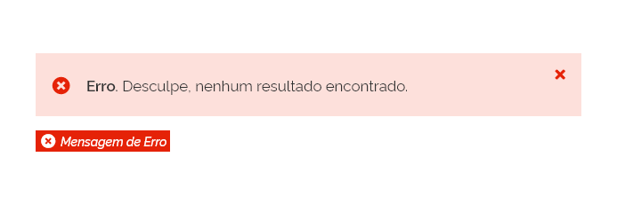
*Estado Erro*

---

## Recomendações e Boas práticas

- É importante evitar textos de mensagens muito longos, que proporcionem muitas quebras de linha. O ideal é que quando ocorra a quebra de linha seja numa situação excepcional ou eventual como os casos de responsividade.

- Deve-se evitar situações iguais à representada na imagem do exemplo 'F'. Onde a _Mensagem Contextual_ cresce com mais de uma linha.

 
*Quebra de Linha*

- Deve-se evitar o uso de múltiplas _Mensagens do Tipo Padrão_. Quando for necessário dar ênfase a vários elementos em tela, utilize a _Mensagem do Tipo Contextual_. Observe abaixo:

 
*À direita exemplo do uso recomendável com as mensagens contextuais e à esquerda o exemplo do uso não recomendável com múltiplas mensagens*

- Quando houver a necessidade de apresentar informações adicionais relacionadas a mensagem de erro do sistema, a descrição principal deverá ser apresentada por um estilo tipográfico (padrão) enquanto as informações complementares deverão ser apresentados em uma formatação diferente.

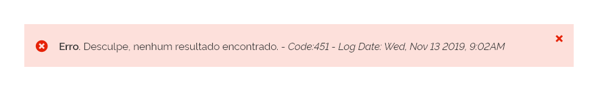
*Na mensagem acima, foi utilizado o texto regular para o detalhamento do erro, e as informações complementares (como código e data) em itálico.*

---

## Especificação

### Cores

#### Estado Informativo

| Name | Property | Color Token |
|--|--|--|
| Superfície do Message | background |`--blue-warm-vivid-10`|
| Superfície do Message Tipo Context | background |`--blue-warm-vivid-60`|
| Ícone | color |`--blue-warm-vivid-60`|
| Título do Message | color |`--gray-80`|
| Mensagem Tipo Context | color |`--pure-0`|
| Botão Fechar | color |`--blue-warm-vivid-60`|

#### Estado Sucesso

| Name | Property | Color Token |
|--|--|:--:|
| Superfície do Message | background |`--green-cool-vivid-5`|
| Superfície do Message Tipo Context | background |`--green-cool-vivid-50`|
| Ícone | color |`--green-cool-vivid-50`|
| Título do Message | color |`--gray-80`|
| Mensagem Tipo Context | color |`--pure-0`|
| Mensagem | color |`--gray-80`|
| Botão Fechar | color |`--green-cool-vivid-50`|

#### Estado Alerta

| Name | Property | Color Token |
|--|--|:--:|
| Superfície do Message | background |`--yellow-vivid-5`|
| Superfície do Message Tipo Context | background |`--yellow-vivid-20`|
| Título do Message | color |`--gray-80`|
| Mensagem | color |`--gray-80`|
| Mensagem Tipo Context | color |`--gray-80`|
| Botão Fechar | color |`--gray-80`|

#### Estado Erro

| Name | Property | Color Token |
|--|--|:--:|
| Superfície do Message | background |`--red-vivid-10`|
| Superfície do Message Tipo Context | background |`--red-vivid-50`|
| Ícone | color |`--red-vivid-50`|
| Título do Message | color |`--gray-80`|
| Mensagem | color |`--gray-80`|
| Mensagem Tipo Context | color |`--pure-0`|
| Botão Fechar | color |`--red-vivid-50`|

### Tipografia

|Name|Size|Weight|
|--|--|--|
| Título do Message |`--font-size-scale-up-01`|`--font-weight-semi-bold`|
| Mensagem |`--font-size-scale-up-01`|`--font-weight-regular`|
| Mensagem Tipo Context |`--font-size-scale-base`|`--font-weight-medium`|

### Iconografia

|Name|Ícone|Token Size|Class (Font Awesome)|
|--|--|--|--|
|Ícone Botão Fechar|<i class="times"></i>|`--icon-size-base`|`times`|
|Ícone Informativo - Tipo Padrão |<i class="info-circle"></i>|`--icon-size-lg`|`info-circle`|
|Ícone Informativo - Tipo Context |<i class="info-circle"></i>|`--icon-size-base`|`info-circle`|
|Ícone Sucesso - Tipo Padrão |<i class="check-circle"></i>|`--icon-size-lg`|`check-circle`|
|Ícone Sucesso - Tipo Context |<i class="check-circle"></i>|`--icon-size-base`|`check-circle`|
|Ícone Alerta - Tipo Padrão |<i class="exclamation-triangle"></i>|`--icon-size-lg`|`exclamation-triangle`|
|Ícone Alerta - Tipo Context |<i class="exclamation-triangle"></i>|`--icon-size-base`|`exclamation-triangle`|
|Ícone Erro - Tipo Padrão |<i class="times-circle"></i>|`--icon-size-lg`|`times-circle`|
|Ícone Erro - Tipo Context |<i class="times-circle"></i>|`--icon-size-base`|`times-circle`|

### Dimensões

|Name|Property|Value|
|--|--|:--:|
| Superfície do Message Tipo Padrão | Width | `variável` |
| Superfície do Message Tipo Padrão | Height | `variável` |
| Superfície do Message Tipo Context | Width| `variável` |
| Superfície do Message Tipo Context | Height| `variável` |

### Espaçamentos

|Name|Property|Value|
|--|--|:--:|
| Superfície do Message Tipo Padrão | padding-top | `--spacing-scale-3x` |
| Superfície do Message Tipo Padrão | padding-bottom | `--spacing-scale-3x` |
| Superfície do Message Tipo Padrão | padding-left | `--spacing-scale-2x` |
| Superfície do Message Tipo Padrão | padding-right | `--spacing-scale-base` |
| Botão Fechar | margin-top | `--spacing-scale-base` |
| Botão Fechar | margin-right | `--spacing-scale-base` |
| Ícone Tipo Padrão | margin-left | `--spacing-scale-2x` |
| Ícone Tipo Padrão | margin-right | `--spacing-scale-2x` |
| Ícone Tipo Padrão | margin-top | `--spacing-vertical-center` |
| Ícone Tipo Padrão | margin-bottom | `--spacing-vertical-center` |
| Ícone Tipo Context | margin-top | `--spacing-vertical-center` |
| Ícone Tipo Context | margin-bottom | `--spacing-vertical-center` |
| Ícone Tipo Context | margin-left | `--spacing-scale-half` |
| Ícone Tipo Context | margin-right | `--spacing-scale-half` |
| Título e Message Tipo Padrão | margin-top | `--spacing-scale-3x` |
| Título e Message Tipo Padrão | margin-bottom | `--spacing-scale-3x` |
| Título e Message Tipo Padrão | margin-left | `--spacing-scale-2x` |
| Título e Message Tipo Padrão | margin-right | `--spacing-scale-2x` |
| Message Tipo Context | margin-top | `--spacing-scale-half` |
| Message Tipo Context | margin-bottom | `--spacing-scale-half` |
| Message Tipo Context | margin-left | `--spacing-scale-half` |
| Message Tipo Context | margin-right | `--spacing-scale-half` |
