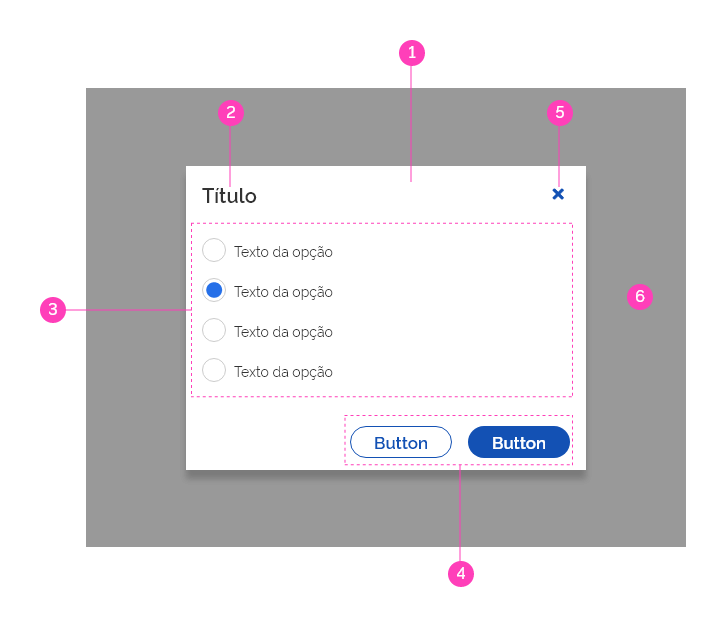
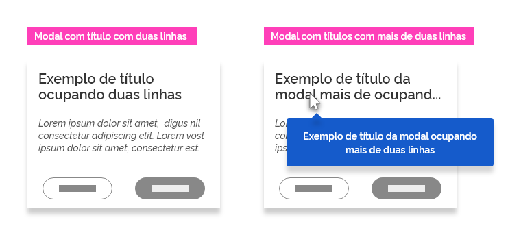
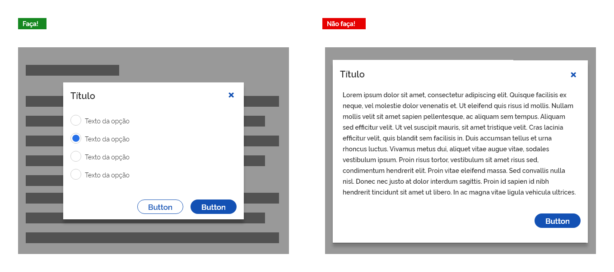
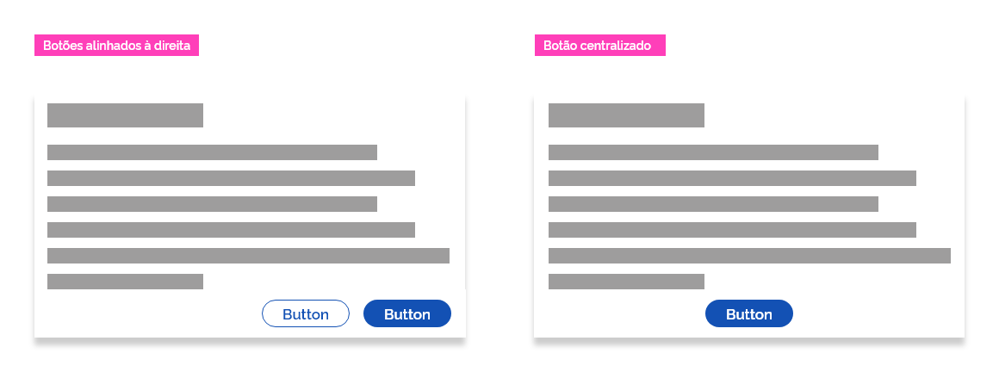
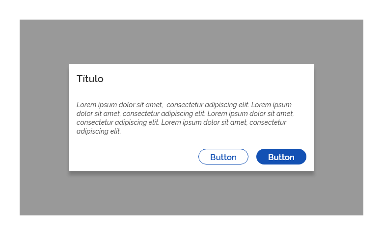
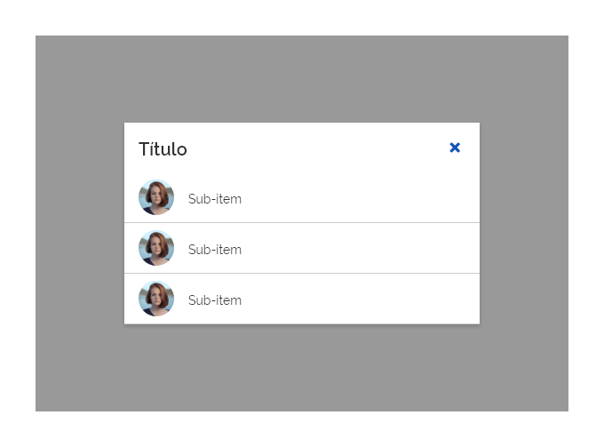
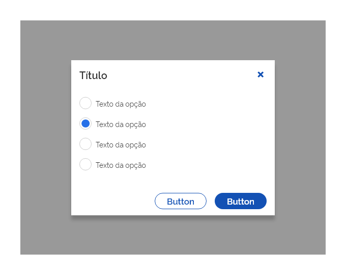
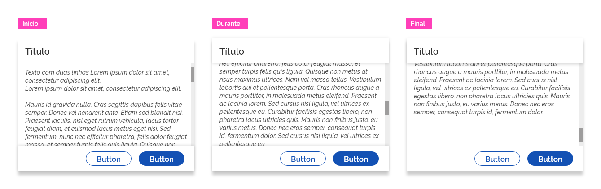
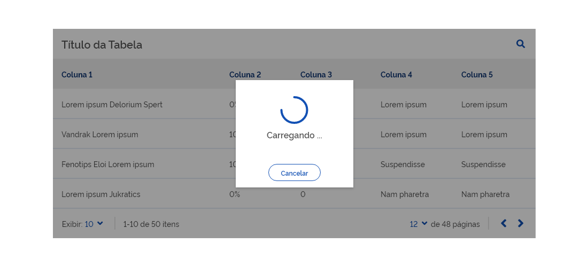

*Exemplo do componente modal*

Use modais quando houver necessidade de obter a atenção imediata do usuário para uma interrupção no fluxo de navegação de forma proposital.

Por exemplo:

*   Para informar sobre erros que impedem o fluxo normal de uma interface;

*   Para informações críticas que requerem uma escolha, decisão ou reconhecimento específico do usuário;

*   Para fornecer entrada de dados sem a perda contextual de uma tela.

---

## Tom e voz

Modais devem manter uma comunicação direta nas informações e dedicadas à conclusão de uma determinada tarefa. Devem aparecer em resposta a uma tarefa ou ação do usuário, com informações relevantes e contextuais.

---

## Anatomia

| ID  | Nome                     |                         Referência                          | Uso         |
| --- | ------------------------ | :---------------------------------------------------------: | ----------- |
| 1   | Superfície               | [Fundamento Superfície](/ds/fundamentos-visuais/superficie) | Obrigatório |
| 2   | Título                   | [Fundamento Tipografia](/ds/fundamentos-visuais/tipografia) | Opcional    |
| 3   | Conteúdo                 |                             ---                             | Obrigatório |
| 4   | Botões                   |   [Componente Button](/ds/components/button?tab=designer)   | Obrigatório |
| 5   | Botão terciário cancelar |   [Componente Button](/ds/components/button?tab=designer)   | Opcional    |
| 6   | Superfície *overlay*     | [Fundamento Superfície](/ds/fundamentos-visuais/superficie) | Opcional    |

*Elementos que compõem uma modal*

---

## Detalhamento dos Itens

### 1. Superfície (Obrigatório)

A superfície funciona como *background* para a modal onde deve ser observado o contraste entre o fundo e o conteúdo, pois a modal, mais que qualquer outro elemento, deve se destacar aos olhos do usuário. É recomendável utilização na cor branca.

### 2. Título (Opcional)

Precisa ser uma declaração ou pergunta específica, breve e clara.
Deve-se evitar termos que expressem ambiguidade ou seja alarmante ao usuário, como: "*Desculpe pela interrupção*", "*Aviso!*", "*Você tem certeza?*".

Se necessário, os títulos podem ocupar duas linhas. Acima de duas linhas, o texto deve ser contraído no espaço disponível e terminar com reticências (...). Ao passar o *mouse* sobre o texto contraído, o componente *tooltip*  revelará o texto completo.

*Use tooltip para mostrar títulos que ocupem uma área maior que duas linhas*

### 3. Conteúdo (Obrigatório)

A modal é flexível para se adaptar ao tamanho do conteúdo apresentado.

Lembre-se que uma modal deve ser concisa e direta. Seja o mais objetivo possível em relação ao conteúdo apresentado.

Evite, sempre que possível, que a modal ocupe quase todo o tamanho da tela. Em  casos de conteúdos mais extensos opte pela barra de rolagem vertical. Essa recomendação não é possível para resoluções de telas menores.

*Planeje uma "área de respiro" razoável entre o tamanho da modal e o tamanho da tela. É importante que o usuário perceba que a modal está sobreposta à tela anterior*

### 4. Botões (Obrigatório)

Representam as três ações relativas à modal que o usuário poderá interagir. A ação determinará o tipo de botão utilizado:

**Conhecimento:** Quando a ciência do usuário é necessária para prosseguir, isto é, uma única ação é apresentada.
Uso do botão primário.

**Confirmação:** Quando confirma uma ação proposta. Essas ações podem envolver a opção de não concordância como "Excluir" ou "Cancelar".
Uso do botão primário.

**Negação:** Descartam uma ação proposta pelo ação de confirmação e retornam para o usuário a tela ou etapa de origem.
Uso do botão secundário.

Os botões devem ser alinhados por padrão à direita, porém, opcionalmente, poderá estar centralizado no caso de ser a única ação proposta.

*Exemplos de posicionamento dos botões em uma modal*

#### Quantidade de botões

É recomendado que em uma modal contenha no máximo dois botões:

Se *uma* única ação for fornecida, ela deverá ser um botão de *conhecimento* *ou* de *negação*.

Se *duas* ações são fornecidas, uma deve ser de *confirmação* *e* a outra de *negação*.

Se a ação de *confirmação* for fornecida, *deverá* existir a ação de *negação*.

**Atenção:** não é recomendável fornecer um terceiro botão como "*Saiba mais*", pois ele afasta o usuário do foco principal, deixando a tarefa proposta pela modal inacabada.
Ao invés disso, um conteúdo expansível pode exibir as informações necessárias. Caso sejam necessárias informações mais extensas forneça-as antes da entrada da modal.

### 5. Botão Cancelar (Opcional)

O botão terciário Cancelar é opcional. Se precisar utilizá-lo, deve estar posicionado obrigatoriamente no canto superior direito da janela da modal. Este botão cumpre exatamente a mesma função de um botão secundário Cancelar ou Fechar.

**Atenção:** uma terceira possibilidade para fechamento da janela modal pode ser clicando em qualquer área da tela fora da janela da modal.

### 6. Superfície *overlay* (Opcional)

Geralmente uma modal deve vir acompanhada de uma superfície *overlay*. Isso é necessário pois o *overlay* funciona como um bloqueio do fluxo e passa o foco para a ação proposta pela modal. Desta forma, só é possível retornar para o fluxo principal cumprindo as opções propostas pela modal. Porém, há casos em que a modal pode ser utilizada sem o recurso do *overlay*.

Veja o documento de superfície para mais informações a respeito do *overlay*.

---

## Tipos

Há três Tipos de modais:

*   Modal de Alerta;

*   Modal de Opção;

*   Modal de Entrada.

A escolha vai depender da tarefa que o usuário deve realizar.

### 1. Modal de Alerta

Interrompe o usuário com informações, detalhes ou ações urgentes.

*Exemplos de modal de alerta*

Não se deve utilizar rótulos de ação que não indiquem claramente a ação realizada. Por exemplo: "Cancelar" e "Excluir" indicam melhor a ação do que "Não" e "Sim".
Na modal do tipo alerta o título é opcional.

Maneiras de fechar (cancelar): **Clicando em um dos botões propostos**.

### 2. Modal de Opção

Oferece opções de escolha para o usuário, podendo ser apresentado por uma lista ou por algum componente de seleção (dependendo da finalidade da tarefa).
O uso do Título é altamente recomendável.

#### 2.1. Por Lista

Exibem uma lista de itens que entram em vigor imediatamente quando selecionados.

*Exemplos de modal de opção por lista*

Pela característica da modal, esta opção deve ser utilizada com moderação. É preferível o uso de *dropdown* como uma opção menos disruptiva.
Este tipo de modal não possui botões.

Maneiras de fechar (cancelar):

*   Clicando no botão terciário no topo (à direita) da janela da modal;

*   Clicando em qualquer área da tela fora da janela da modal;

*   Automaticamente após o usuário concluir a tarefa.

#### 2.2. Por Seleção

Exige que o usuário confirme uma das opções apresentadas antes que seja submetida, permitindo a possibilidade de alterar a escolha. Uma vez confirmada, a ação será executada.

*Exemplos de modal de opção por seleção*

As ações de confirmação e negação são obrigatórias.

Maneiras de fechar a modal (cancelar):

*   Clicando no botão secundário;

*   Clicando no botão terciário no topo (à direita) da janela da modal;

*   Clicando em qualquer área da tela fora da janela da modal.

### 3. Modal de Entrada

Contém ações que requerem uma série de tarefas para serem concluídas tais como campos de entrada, de escolha e outros componentes relacionados ao formulário.

*Exemplos de modal de entrada*

Maneiras de fechar (cancelar):

*   Clicando no botão secundário;

*   Clicando no botão terciário no topo (à direita) da janela da modal;

*   Clicando em qualquer área da tela fora da janela da modal.

**Atenção:** Uma boa recomendação é que a ação para confirmação deva estar desativada até que todos os campos obrigatórios estejam preenchidos.

---

## Comportamentos

### 1. Interrupção

As modais utilizam superfície (*overlay*) criando uma área bloqueada e não interativa exigindo que os usuários interrompam sua tarefa atual.
Utilize a modal com moderação, pois nem todas as opções ou cenários justificam essa interrupção.

### 2. Posição

A modal deve manter o foco total do usuário até que uma ação seja tomada. Não deve ser ocultada por outros elementos. Alguns componentes de importância maior como um *tooltip* ou o *datetimepicker* podem ocultar uma parte do modal temporariamente.

Deve ser centralizado na tela do dispositivo ou pode ser exibido próximo ao elemento que "solicitou/disparou" a modal.

### 3. *Scrollbar* (Barra de rolagem)

Evite o máximo possível *scrollbar* (barra de rolagem) na modal. Quando necessário, o título deve ficar fixo no topo e os botões na parte inferior. Isso garante que o conteúdo permaneça sempre visível com o título e os botões durante a rolagem.

É recomendável a utilização do efeito de sombra na divisão entre o título e os botões sempre que existir conteúdo oculto.

*Os três momentos no processo de rolagem do conteúdo em uma modal*

Botões de Conhecimento e/ou de Confirmação podem estar desativados até que o usuário consiga rolar até o final da rolagem.

**Atenção:** Jamais utilize rolagem horizontal em modais.

### 4. Temporizador

Comportamento que pode ser aplicado em uma modal, geralmente no tipo alerta, fazendo com que o fechamento seja feito de forma automatizada (após alguns segundos), sem a necessidade de interação do usuário.

Esse tipo de modal só pode ser utilizado em situações onde o conteúdo perde sentido após um determinado período, tal como o componente *loading*.

O usuário deve ser capaz de cancelar modal a qualquer momento, por isso o botão de ação de negação é obrigatório.

*Exemplo de uso da modal com fechamento automático*

**Atenção:** utilize este comportamento somente nos casos estritamente necessários.

---

## Melhores Práticas

*   Use uma modal quando precisar alterar o fluxo de conteúdo ou interação e ainda manter o contexto da página ou tarefa existente.

*   Modais podem ser bastante intrusivas, então devem ser usadas com moderação. Para evitar a “cegueira do banner” e que as pessoas a dispensem imediatamente sem lê-las, mostre apenas nas interações do usuário, como um botão clicado, e não em eventos conduzidos pelo sistema, como imediatamente no carregamento da página.

*   Todas as modais usam um único botão de ação principal. Se uma segunda ação for necessária, use um botão de ação secundária.

*   Use uma linguagem precisa e combine o título e o texto do botão principal. Por exemplo, o título é “Excluir foto” e o botão principal é “Excluir”. Evite perguntas como “Tem certeza?”.

*   Nunca empilhe várias modais juntas na tela ao mesmo tempo.

*   Modais devem ser usadas ​​para diálogos curtos e diretos com o usuário. Se uma modal exigir que o usuário faça pesquisas complexas ou consulte fontes adicionais de informações (potencialmente bloqueadas pela modal), então não é o componente correto para essa interação. Considere usar um *popover* ou *tooltip* para esta finalidade.

---

## Especificações

### Alinhamento

| Name                     | Property |   Spacing Vertical Token    |
| ------------------------ | :------: | :-------------------------: |
| Button                   |  center  | `--spacing-vertical-center` |
| Título                   |  center  | `--spacing-vertical-center` |
| Botão Terciário Cancelar |  center  | `--spacing-vertical-center` |

| Name                     | Property |   Spacing Horizontal Token    |
| ------------------------ | :------: | :---------------------------: |
| Button                   |  center  | `--spacing-horizontal-center` |
| Título                   |  center  | `--spacing-horizontal-center` |
| Botão Terciário Cancelar |  center  | `--spacing-horizontal-center` |

### Escala

| Name                     | Type    |          Top           |         Right          |         Bottom         |         Left         |
| ------------------------ | ------- | :--------------------: | :--------------------: | :--------------------: | :------------------: |
| Button                   | Externo | `--spacing-scale-base` |  `--spacing-scale-2x`  | `--spacing-scale-base` |         `-`          |
| Título                   | Externo | `--spacing-scale-base` |          `-`           | `--spacing-scale-base` | `--spacing-scale-2x` |
| Botão Terciário Cancelar | Externo | `--spacing-scale-base` | `--spacing-scale-base` | `--spacing-scale-base` |         `-`          |

### Cor

| Name  | Property   | Color Token |
| ----- | ---------- | :---------: |
| Modal | background | `--pure-0`  |

### Sombra

|    Name    | Token Shadow  |
| :--------: | :-----------: |
| Superfície | `--shadow-xl` |
