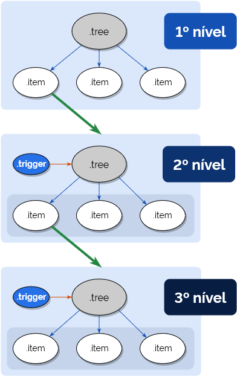

# Navegação

Navegação para sites e sistemas.

## Dependências

-   navigation.js

## Código básico

```html
<nav class="br-navigation">
  <header class="header">...</header>
  <div class="navigation">...</div>
  <footer class="footer">...</footer>
</header>
```

## Detalhamento

Este componente é formado pelos seguintes elementos:

-   `br-navigation`: container do componente
-   `header`: agrupa os sub-elementos do cabeçalho da navegação
-   `navigation`: agrupa as árvores de navegação
-   `footer`: agrupa os sub-elementos do rodapé da navegação

### `br-navigation`

O comportamento padrão do componente é **desativado**. Para ficar visível em tela deve-se incluir `.is-active` ao componente.

Exemplo de uso:

```html
<nav class="br-navigation is-active">
    ...
</nav>
```

#### Uso em sites

Para usar o componente em sites adicione `.is-site` ao container.

Exemplo de uso:

```html
<nav class="br-navigation is-site is-active">
    ...
</nav>
```

#### Uso em sistemas

Para usar o componente nos sistemas adicione `.is-system` ao container.

Exemplo de uso:

```html
<nav class="br-navigation is-system is-active">
    ...
</nav>
```

### `header`

Dentro deste agrupador estão as informações do cabeçalho da navegação. Estas informações ficam **visíveis somente** quando o usuário estiver acessando via **dispositivo móvel** (smartphone ou tablet).

#### Uso em sites

Em site adicione a **área de logo** e a **opção de voltar a navegação**.

-   **área de logo**: São as mesmas informações do cabeçalho do site.
-   **opção de voltar a navegação**: O texto deste elemento é dinâmico. Muda de acordo com a navegação do usuário.

Exemplo de uso:

```html
<nav class="br-navigation is-site is-active">
    <header class="header">
        <div class="container">
            <!-- Logo -->
            <div class="logo is-active">
                <span class="name">Secretaria xpto</span>
                <span class="description">Ministério da xpto</span>
            </div>
            <!-- Voltar navegação -->
            <button type="button" class="go-back">
                <span class="arrow"><i class="fas fa-chevron-left"></i></span>
                <span class="node">texto dinâmico</span>
            </button>
        </div>
    </header>
    ...
</nav>
```

#### Uso em sistemas

Em sistemas adicione a **barra de configurações do usuário** e a **opção de voltar a navegação**.

-   **barra de configurações do usuário**: São as mesmas informações da barra de usuário autenticado.
-   **opção de voltar a navegação**: O texto deste elemento é dinâmico. Muda de acordo com a navegação do usuário.

> **Atenção**! No contexto do cabeçalho da navegação, insira apenas os `.triggers` dos menus de usuário. Os menus deverão ser incluídos na área dedicada à navegação.

Exemplo de uso:

```html
<nav class="br-navigation is-site is-active">
    <header class="header">
        <div class="container">
            <!-- Configurações do usuário -->
            <div class="user-bar">
                <!-- Configurações do usuário -->
                <div class="configs menu is-active">
                    <button class="trigger" type="button">
                        <!-- Avatar do usuário -->
                        <span class="avatar">
                            
                            <!-- <i class="fas fa-user-circle"></i> -->
                        </span>
                        <!-- Notificações -->
                        <span class="badge">5</span>
                        <!-- Seta para abrir menu -->
                        <span class="arrow">
                            <i class="fas fa-chevron-down"></i>
                        </span>
                    </button>
                </div>
                <!-- Altocontraste -->
                <button type="button" class="contrast" accesskey="6">
                    <i class="fas fa-adjust fa-lg"></i>
                </button>
                <!-- Sistemas favoritos do usuário -->
                <div class="bookmarks menu">
                    <button class="trigger" type="button">
                        <i class="fas fa-th-large"></i>
                    </button>
                </div>
            </div>
            <!-- Voltar navegação -->
            <button type="button" class="go-back">
                <span class="arrow"><i class="fas fa-chevron-left"></i></span>
                <span class="node">texto dinâmico</span>
            </button>
        </div>
    </header>
    ...
</nav>
```

### `navigation`

Dentro deste agrupador estão as àrvores de navegação.

Cada árvore de navegação deverá obdecer a seguinte estrutura:



#### Uso em sites

Em sites a árvore de navegação costuma ser o menu principal.

Exemplo de uso para menu com 3 níveis:

```html
<nav class="br-navigation is-site is-active">
    ...
    <div class="navigation">
        <div class="container">
            <!-- Navegação principal -->
            <ul class="tree is-active">
                <li class="item has-children is-active">
                    <button class="trigger" type="button">
                        <span class="name">Item de nível 1</span>
                        <span class="arrow"
                            ><i class="fas fa-chevron-right"></i
                        ></span>
                    </button>
                    <!-- nível 2 -->
                    <ul class="tree">
                        <li class="item"><a href="">Item de nível 2</a></li>
                        <li class="item has-children">
                            <button class="trigger" type="button">
                                <span class="name">Item de nível 2</span>
                                <span class="arrow"
                                    ><i class="fas fa-chevron-right"></i
                                ></span>
                            </button>
                            <!-- nível 3 -->
                            <ul class="tree">
                                <li class="item">
                                    <a href="">Item de nível 3</a>
                                </li>
                                <li class="item">
                                    <a href="">Item de nível 3</a>
                                </li>
                            </ul>
                        </li>
                    </ul>
                </li>
                <li class="item is-active"><a href="">Item de nível 1</a></li>
            </ul>
        </div>
    </div>
    ...
</nav>
```

Exemplo de uso com 2 árvores de navegação:

```html
<nav class="br-navigation is-site is-active">
    ...
    <div class="navigation">
        <div class="container">
            <!-- Navegação principal -->
            <ul class="tree is-active">
                <li class="item has-children is-active">
                    <button class="trigger" type="button">...</button>
                    <!-- nível 2 -->
                    <ul class="tree">
                        ...
                    </ul>
                </li>
            </ul>
            <!-- Navegação gov.br -->
            <ul class="tree is-active">
                <li class="item has-children is-active">
                    <button class="trigger govbr" type="button">...</button>
                    <!-- nível 2 -->
                    <ul class="tree">
                        ...
                    </ul>
                </li>
            </ul>
        </div>
    </div>
    ...
</nav>
```

#### Uso em sistemas

Em sistemas, além da árvore de navegação principal, são incluídos também os menus da **barra de configurações do usuário**.

Exemplo de uso:

```html
<nav class="br-navigation is-system is-active">
    ...
    <div class="navigation">
        <div class="container">
            <!-- Informações do usuário -->
            <ul class="tree">
                <li class="item title is-active">
                    <strong>Márcia Vinícius Tavares de Almeida</strong>
                    <span>marcia-vinicius.almeida@serpro.gov.br</span>
                </li>
                <li class="item label is-active">
                    <span class="icon"><i class="fas fa-cog"></i></span>
                    <span class="name">Configuração/Perfil</span>
                </li>
                <li class="item is-active"><a href="">Configuração 01</a></li>
                <li class="item is-active"><a href="">Configuração 02</a></li>
                <li class="item is-active"><a href="">Configuração 03</a></li>
            </ul>
            <!-- Favoritos -->
            <ul class="tree">
                <li class="item label is-active">
                    <span class="icon"><i class="fas fa-th-large"></i></span>
                    <span class="name">Sistemas</span>
                </li>
                <li class="item is-active"><a href="">Sistema 01</a></li>
                <li class="item is-active"><a href="">Sistema 02</a></li>
                <li class="item is-active"><a href="">Sistema 03</a></li>
            </ul>
            <!-- Navegação -->
            <ul class="tree is-active">
                <li class="item has-children is-active">
                    <button class="trigger label" type="button">
                        <span class="name">Item de nível 1</span>
                        <span class="arrow"
                            ><i class="fas fa-chevron-right"></i
                        ></span>
                    </button>
                    <ul class="tree is-active">
                        <li class="item is-active">
                            <a href="">Item de nível 2</a>
                        </li>
                        <li class="item is-active">
                            <a href="">Item de nível 2</a>
                        </li>
                        <li class="item has-children is-active">
                            <button class="trigger" type="button">
                                <span class="name">Item de nível 2</span>
                                <span class="arrow"
                                    ><i class="fas fa-chevron-right"></i
                                ></span>
                            </button>
                            <ul class="tree">
                                <li class="item">
                                    <a href="">Item de nível 3</a>
                                </li>
                                <li class="item">
                                    <a href="">Item de nível 3</a>
                                </li>
                                <li class="item">
                                    <a href="">Item de nível 3</a>
                                </li>
                            </ul>
                        </li>
                    </ul>
                </li>
                <li class="item has-children is-active">
                    <button class="trigger label" type="button">
                        <span class="name">Item de nível 1</span>
                        <span class="arrow"
                            ><i class="fas fa-chevron-right"></i
                        ></span>
                    </button>
                    <ul class="tree is-active">
                        <li class="item is-active">
                            <a href="">Item de nível 2</a>
                        </li>
                        <li class="item is-active">
                            <a href="">Item de nível 2</a>
                        </li>
                        <li class="item is-active">
                            <a href="">Item de nível 2</a>
                        </li>
                    </ul>
                </li>
            </ul>
        </div>
    </div>
    ...
</nav>
```

### `footer`

Dentro deste agrupador estão os elementos auxiliares na navegação. Dependendo do dispositivo ou resolução do usuário alguns elementos ficam ocultos.

#### Uso em sites

Estão disponíveis os seguintes elementos:

-   **escolha de idioma**
-   **altocontraste**
-   **links úteis**
-   **redes sociais**

**links úteis** e **redes sociais** estarão sempre visíveis.

Exemplo de uso:

```html
<nav class="br-navigation is-site is-active">
    ...
    <footer class="footer">
        <div class="container">
            <div class="row align-items-center no-gutters mx-0">
                <div class="col-auto mr-3">
                    <!-- Idioma -->
                    <div class="language menu">
                        <button class="trigger" type="button">
                            <span class="name">Português</span>
                            <span class="arrow"
                                ><i class="fas fa-chevron-down"></i
                            ></span>
                        </button>
                        <div class="items">
                            <div class="title">Idioma/Language</div>
                            <button class="item" type="button">
                                <span class="name">Português</span>
                            </button>
                            <button class="item" type="button">
                                <span class="name">English</span>
                            </button>
                            <button class="item" type="button">
                                <span class="name">Español</span>
                            </button>
                        </div>
                    </div>
                </div>
                <div class="col-auto">
                    <!-- Altocontraste -->
                    <button type="button" class="contrast" accesskey="6">
                        <i class="fas fa-adjust fa-lg"></i>
                    </button>
                </div>
            </div>
            <div class="row justify-content-between">
                <div class="col-md">
                    <!-- Links úteis -->
                    <div class="links">
                        <span>Links úteis</span>
                        <a href=""
                            >Acesso à Informação
                            <i class="fas fa-external-link-alt"></i
                        ></a>
                        <a href=""
                            >Participe <i class="fas fa-external-link-alt"></i
                        ></a>
                        <a href=""
                            >Órgãos do Governo
                            <i class="fas fa-external-link-alt"></i
                        ></a>
                        <a href=""
                            >Acessibilidade
                            <i class="fas fa-external-link-alt"></i
                        ></a>
                    </div>
                </div>
                <div class="col-md-auto">
                    <!-- Redes sociais -->
                    <div class="social-network">
                        <span>Redes sociais</span>
                        <a href="https://www.twitter.com/twitter.com/govbr">
                            <i class="fab fa-twitter fa-lg"></i>
                            <span class="sr-only">Twitter</span>
                        </a>
                        <a href="https://www.youtube.com/youtube.com/govbr">
                            <i class="fab fa-youtube fa-lg"></i>
                            <span class="sr-only">YouTube</span>
                        </a>
                        <a href="https://www.facebook.com/facebook.com/govbr">
                            <i class="fab fa-facebook-f fa-lg"></i>
                            <span class="sr-only">Facebook</span>
                        </a>
                        <a href="https://www.flickr.com/flickr/govbr">
                            <i class="fab fa-flickr fa-lg"></i>
                            <span class="sr-only">Flickr</span>
                        </a>
                    </div>
                </div>
            </div>
        </div>
    </footer>
</nav>
```

#### Uso em sistemas

Estão disponíveis os seguintes elementos:

-   **timeout**
-   **logout**

> Os 2 elementos ficam visíveis somente em dispositivos móveis (smartphone e tablet).

Exemplo de uso:

```html
<nav class="br-navigation is-site is-active">
    ...
    <footer class="footer">
        <div class="container">
            <div class="row justify-content-between">
                <div class="col-auto">
                    <!-- Timeout -->
                    <div class="timeout">
                        <i class="fas fa-clock"></i>
                        <span class="session">Sessão:</span>
                        <span class="timer">00 min. e 00 seg</span>
                    </div>
                </div>
                <div class="col-auto">
                    <!-- Logout -->
                    <button class="logout" type="button">Sair</button>
                </div>
            </div>
        </div>
    </footer>
</nav>
```

## Estados

Alguns elementos do Cabeçalho assumem estados diferentes de acordo com a interação do usuário.

-   **opção de voltar a navegação**: só é mostrado em dispositivos móveis
-   **ávores de navegação**: em dispositivos móveis serão visíveis somente quando tiver `.is-active` aplicado

## Regras especiais

**Smartphones**

A navegação é mostrada de forma completa, respeitando as regras de visibilidade de cada elemento.

**Tablets**

Na versão de site o `.logo` não será mostrado, pois já fica visível dentro do componente Header.

**Desktop**

Na versão de site o `.header` não é mostrado. `.footer` apresenta os elementos **links úteis** e **redes sociais**.

Na versão de sistema apenas o `.navigation` fica visível.
