[version]: # '1.0.0'
[artefato fonte de design]: # 'notification_1.0.0.xd'

---

## Uso

As notificações são acessadas através do botão do avatar do usuário. Esta área destinam-se a agrupar e informar os usuários sobre eventos e informações relevantes no seu sistema, site ou em aplicativo mobile.

### Tom de voz

As notificações devem ser organizadas e apresentadas de forma clara e consistente dentro de uma interface. O agrupamento deve ser classificada de forma cronológica para que o usuário tenha uma melhor organização temporal do conteúdo, além disso, deve ter também um título e um pequeno resumo da mensagem de maneira a facilitar sua identificação.

---

## Tipos

As notificações são organizados em um container que poderá se adaptar de forma responsiva de duas maneiras diferentes em um container menor e maior.

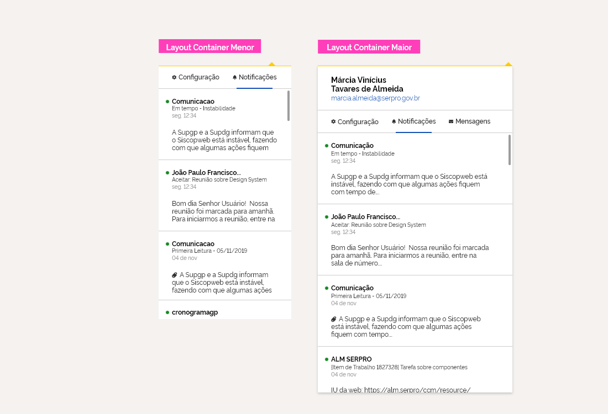

### Container menor

O **container menor** é destinado ao layout mobile. Esta opção não apresenta a área com os dados do usuário e reorganiza o conteúdo de forma a manter os espaçamentos e pesos tipográficos adaptando-os para a menor largura de tela mobile. Optou-se então por 240px de largura.

### Container maior

O **container maior** é projetado para atender as demais resoluções sem variação ou redimensionamento do layout, mantendo as dimensões 352px de largura por 392px de altura.

---

# Anatomia

#### Anatomia da notificação

O componente notificação é subdividido com as seguintes áreas:

-   Dados do Usuário
-   Navegação Contextual
-   Área de conteúdo

Todas essas áreas são delimitadas por separadores.

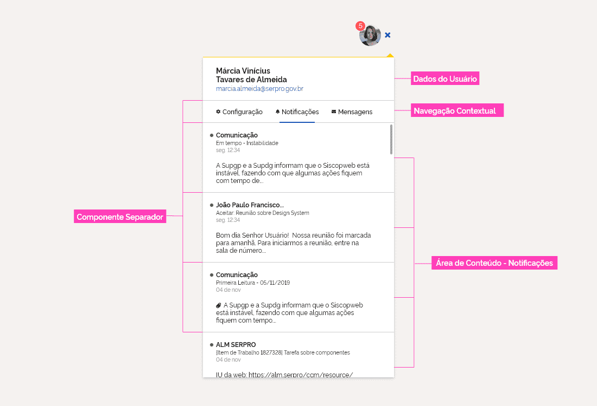

### Dados do Usuário

Esta área é formada, basicamente, do nome do usuário e do seu contato profissional (email do usuário). Essas informações são necessárias, pois as mesmas não aparecem no cabeçalho junto ao avatar no cabeçalho.

De acordo com a necessidade do portal ou sistema implementado, outras informações também podem ser acrescentadas. Essas devem respeitar uma hierarquia informacional, tipografica e de margens já proposta na definição do layout.

### Navegação Contextual

Foram desenvolvidas duas opções de menu por abas, que se diferem basicamente por questões estéticas. Desta forma, cada projeto, deve escolher o menu a ser utilizado de acordo com a necessidade de cada projeto. **Obs.:** Não existe obrigatoriedade de uso entre uma ou outra opção.

A navegação é realizado pelo click ou toque nas abas (mobile). Caso haja mais funcionalidades a serem apresentadas, além da notificação, a navegação contextual por abas deve oferecer o recurso de rolagem por _swipe_ horizontal. Esta navegação muito popular na indústria de mobile, é perfeito para os menus em abas com muitas seções e pouca área de exibição, pois permite a navegação entre as opções do menu, ocultando-os ou exibindo-os de acordo com a necessidade de uso.

#### Menu Abas Mini - opção 1

É formado basicamente de um menu swipe, onde o ícone e sua descrição estão dispostos horizontalmente.

#### Menu Abas Mini - opção 2

Da mesma forma que a opção anterior, a opção 2 também possui navegação swipe, no entanto, sua disposição visual é reorganizada na vertical.

Na área superior é apresentado os ícones de cada serviço, em destaque, referenciando-os. O título do serviço selecionado somente deverá aprecer na área abaixo.

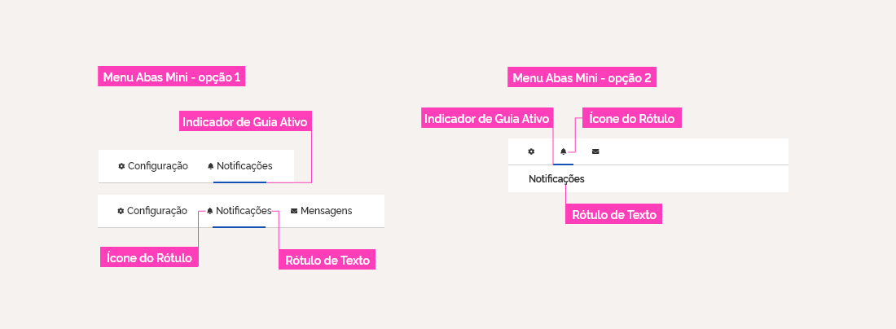

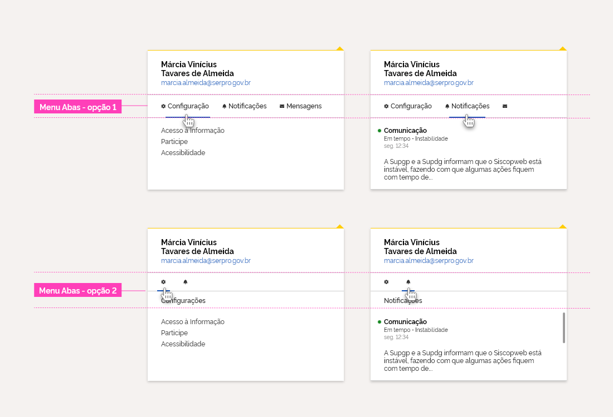

As duas opções também se aplicam para a versão mobile.

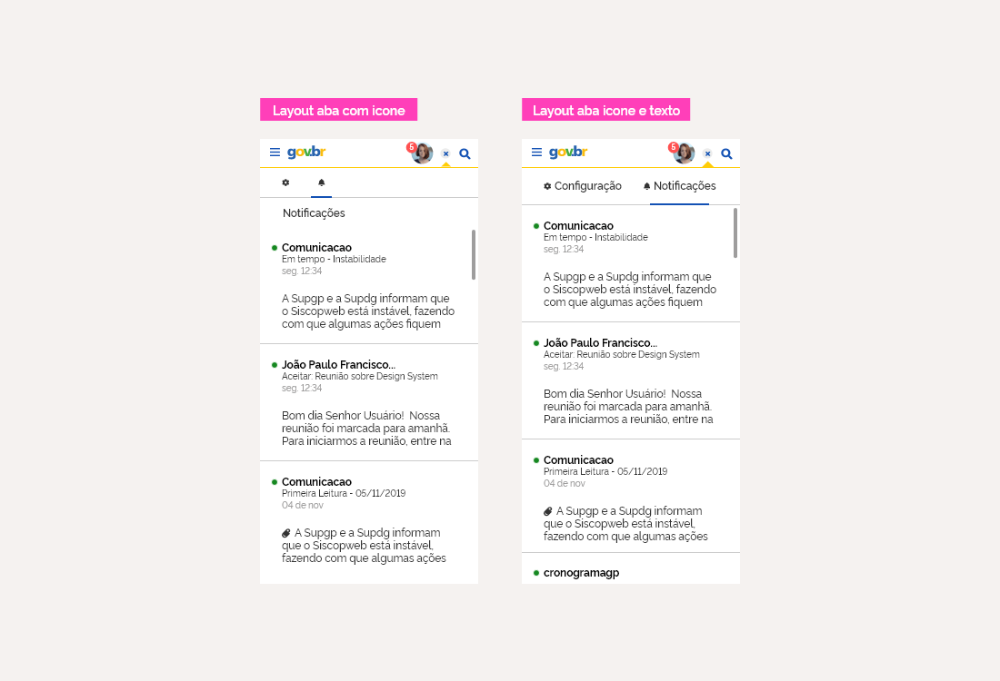

_Menus em disposições diferentes._

#### Menu TV, Web e Sistemas - 3 abas ou mais

Segue os mesmos padrões apresentados anteriormente, diferenciando somente na largura de largura.

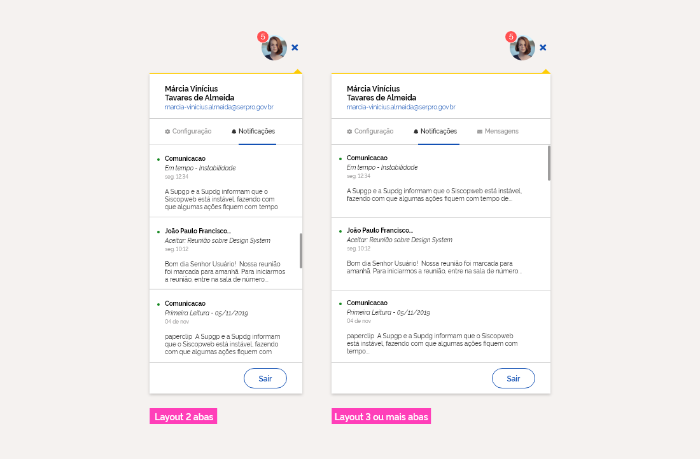

_Layoutes com variação de largura._

### Área de Conteúdo

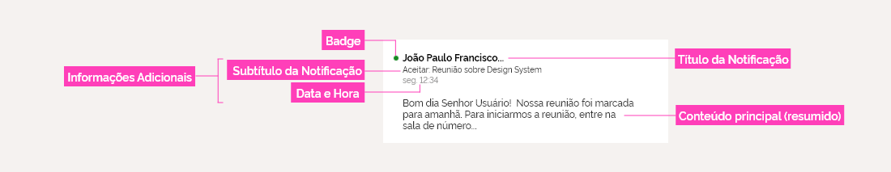

A área de conteúdo é composta por:

#### Badge:

É utilizado como um recurso visual que ajuda o usuário a identificar quais notificações já foram lidas e quais ainda estão pendentes.

Para as notificações, o componente badge apresenta uma variação na sua posição se comparado ao que foi definido na sua documentação. Para esse caso específico, o badge apresenta-se localizado ao lado do "título da Notificação", atendendo a uma necessidade estétita proposta para a área de conteúdo da notificação.

#### Título da Notificação:

Principal identificação para a chamada da notícia.

#### Informações Adicionais

As informações adicionais são formados pelo **Subtítulo da Notificação** e pela **Data e Hora**. Esse bloco de informação, possue uma dimensão menor para se distinguir da relevancia do conteúdo principal, além de auxiliar o usuário a se localizar as informações da notificação cronologicamente.

#### Conteúdo da Notificação:

E o elemento mais importante de uma notificação. Deve ser apresentada, no mínimo, em 3 linhas.

---

## Comportamento da Notificação

#### Densidade

As configuração de densidade de uma lista de notificações segue o padrão de uma "time line infinita", onde as notificações mais recentes sâo empilhadas sobre as mais antigas ordenando-os cronologicamente.

A altura mínima de 592 px do componente, com excessão da versão mobile, deve se manter inalterada. Para visualizar as notificações mais antigas, deve-se utilizar a barra de rolagem.

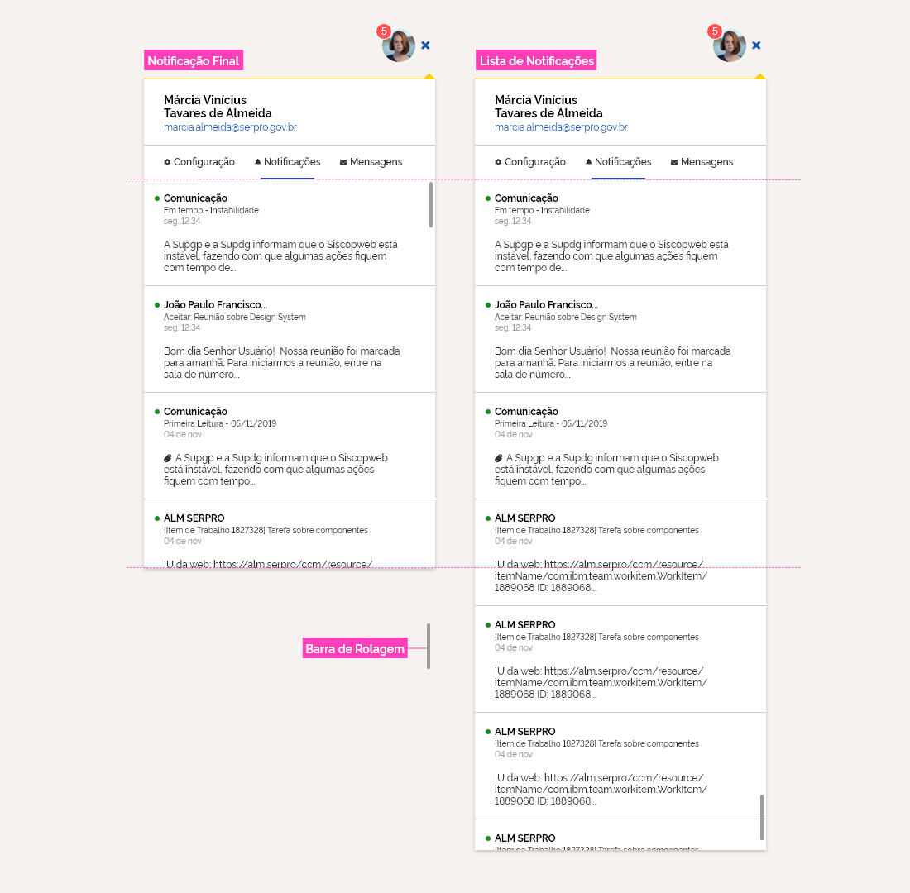

#### Estados

Os Itens da notificação segue os padrões de estado previamente definidos. Ver em: http://dsgov.estaleiro.serpro.gov.br/ds/fundamentosvisuais/estados

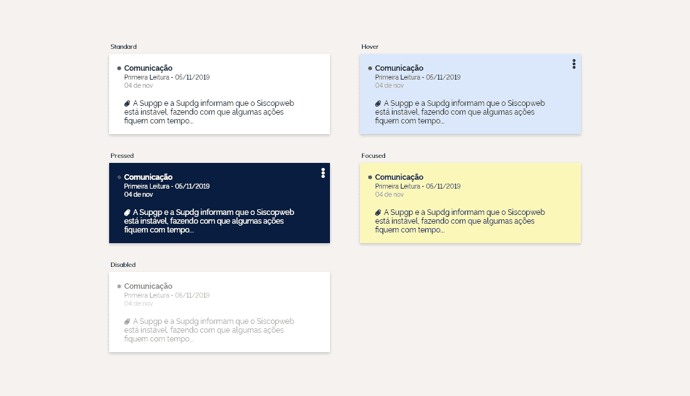
_Estados da notificação._

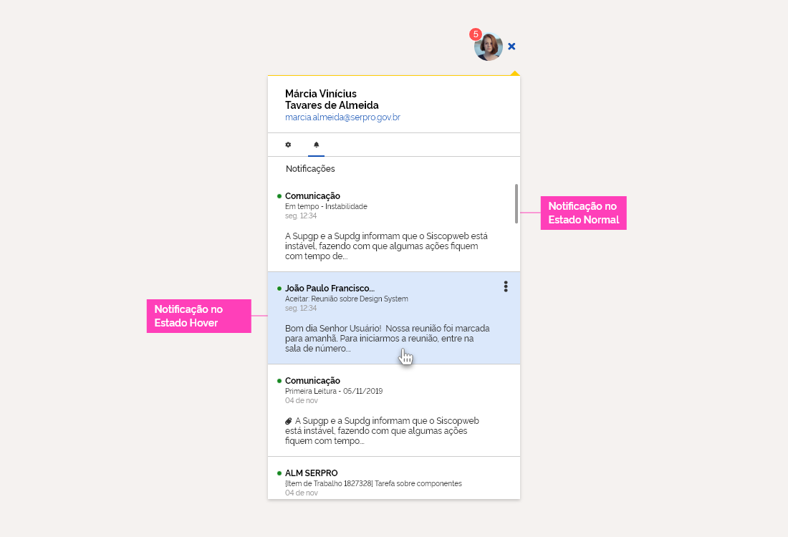
_Estado Padrão (Normal) e Estado Selecionado (Hover)._

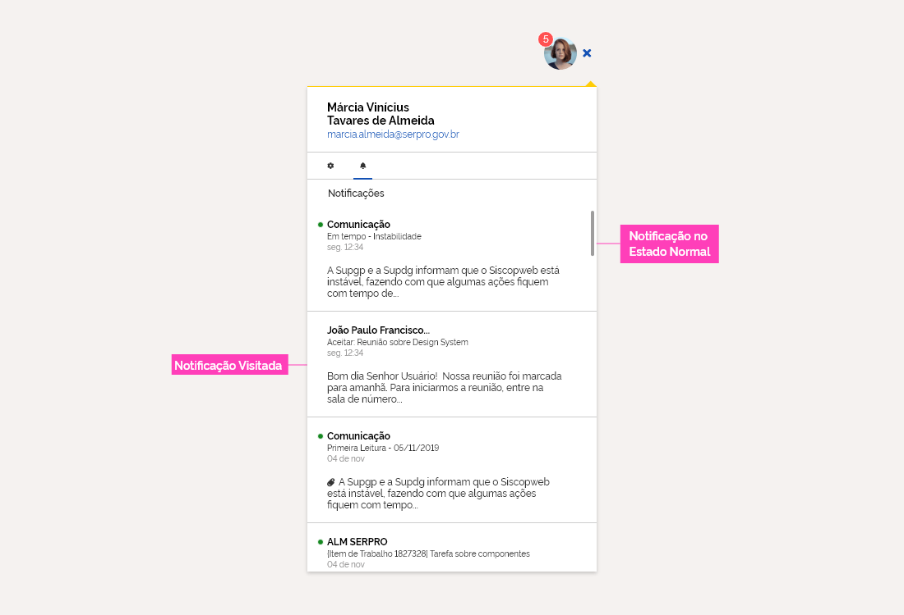
_Estado Padrão (Normal) e Estado Desabilitado (Disabled)._

#### Passos para Interação de uma Notificação

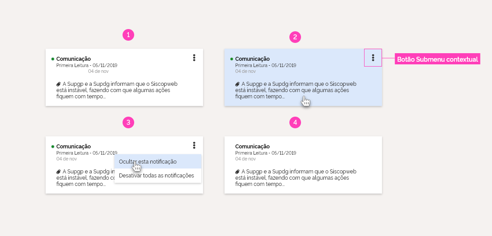

A interação básica de uma notificação definida pode ser apresentada e exemplicada nesses 4 passos:

1. **Notificação Padrão**: É apresentado quando a notificação ainda não tiver sido acessada pelo usuário. Caso seja clicado, o usuário será levado para a página que descreve a notificação em sua totalidade.
2. **Notificação em Hover** (_opcional_): Quando a notificações estiver no estado hover, se necessário, poderá ser apresentado um submenu contextal com funcionalidades adicionais que o usuário poderá acessar. Essa funcionalidade é opicional e só deverá ser implementada para atender às necessidades de cada projeto.
3. **Notificação com Submenu Contextual** (_opcional_): exibe funcionalidades adicionais que só poderão ser acessadas através deste submenu.
4. **Notificação sem Bullet**: Após a notificação ter sido acessada, seu estado mudará para desabilitada e o recurso visual de bullet será retirado.

---

### Design Tokens

#### Cores

###### Dados do Usuário

| Name                       | Property         | Color Token               |
| -------------------------- | ---------------- | ------------------------- |
| Background do Header       | background color | `--color-secondary-01`    |
| Linha (Recurso Visual)     | color            | `--color-alarm-warning`   |
| Triângulo (Recurso Visual) | color            | `--color-alarm-warning`   |
| Nome do Usuário            | color            | `--color-secondary-09`    |
| Email do Usuário           | color            | `--color-primary-default` |

###### Navegação Contextual - Menu Abas Mini

| Name                    | Property         | Color Token               |
| ----------------------- | ---------------- | ------------------------- |
| Background do Menu      | background color | `--color-secondary-01`    |
| Ícone do Rótulo         | color            | `--color-secondary-08`    |
| Rótulo do Texto         | color            | `--color-secondary-08`    |
| Indicador de Guia Ativo | color            | `--color-primary-default` |

###### Área de Conteúdo

| Name                     | Property         | Color Token             |
| ------------------------ | ---------------- | ----------------------- |
| Background do Footer     | background color | `--color-secondary-01`  |
| Badge                    | color            | `--color-alarm-success` |
| Título da Notificação    | color            | `--color-secondary-09`  |
| SubTítulo da Notificação | color            | `--color-secondary-08`  |
| Data e Hora              | color            | `--color-secondary-05`  |
| Conteúdo Principal       | color            | `--color-secondary-08`  |

---

#### Iconografia

###### Menu - Navegação Contextual

| Name            | ícone                       | Size             | Class (Font Awesome) |
| --------------- | --------------------------- | ---------------- | -------------------- |
| Ícone do Rótulo | <i class="fas fa-bell"></i> | `--icon-size-xs` | `fa-bell`            |

---

#### Tipografia

###### Header - Dados do Usuário

| Name             | Size                        | Weight                  |
| ---------------- | --------------------------- | ----------------------- |
| Nome do Usuário  | `--font-size-scale-base`    | `--font-weight-bold`    |
| Email do Usuário | `--font-size-scale-down-01` | `--font-weight-regular` |

###### Navegação Contextual

| Name            | Size                        | Weight                    |
| --------------- | --------------------------- | ------------------------- |
| Rótulo de Texto | `--font-size-scale-down-01` | `--font-weight-semi-bold` |

###### Notificação

| Name                     | Size                        | Weight                 |
| ------------------------ | --------------------------- | ---------------------- |
| Título da Notificação    | `--font-size-scale-down-01` | `--font-weight-bold`   |
| SubTítulo da Notificação | `--font-size-scale-down-02` | `--font-weight-medium` |
| Data e Hora              | `--font-size-scale-down-02` | `--font-weight-medium` |
| Conteúdo Principal       | `--font-size-scale-down-01` | `--font-weight-medium` |

---

#### Estados

###### Notificação

| Name        | Estado       | Property         | Status Token                    | Opacity |
| ----------- | ------------ | ---------------- | ------------------------------- | :-----: |
| Background  | Hover        | background color | `--status-hover-background`     |    -    |
| Background  | Ativo        | background color | `--status-activated-background` |    -    |
| Background  | Desabilitado | background color | `--status-disabled-background`  |   45%   |
| Background  | Foco         | background color | `--status-focused-overlay`      |    -    |
| -           | -            | -                | -                               |    -    |
| Texto/Ícone | Desabilitado | color            | `--status-disabled-text`        |   45%   |

---

#### Dimensão

###### Container Menor

| Name                     | Property                    |
| ------------------------ | --------------------------- |
|                          | **width** ------ **height** |  | -- |
| Menu Abas Mini - opção 1 | `240px` ------- `40px`      |
| Menu Abas Mini - opção 2 | `240px` ------- `65px`      |
| Notificação              | `240px` ------- `128px`     |

###### Container Maior

| Name                     | Property                    |
| ------------------------ | --------------------------- |
|                          | **width** ------ **height** |  | -- |
| Dados do Usuário         | `352px` ------- `80px`      |
| Menu Abas Mini - opção 1 | `352px` ------- `40px`      |
| Menu Abas Mini - opção 2 | `352px` ------- `65px`      |
| Notificação              | `352px` ------- `128px`     |

---

#### Espaçamentos

###### Container Menor

| Name                     | Padding - Property                                                |
| ------------------------ | ----------------------------------------------------------------- |
|                          | **left** ---------- **right** -------- **top** ------- **bottom** |
| Dados do Usuário         | `24px` ------- `24x` ------- `14px` ------- `14px`                |
| Menu Abas Mini - opção 1 | `24px` ------- `24px` ------- `12px` ------- `12px`               |
| Menu Abas Mini - opção 2 | `24px` ------- `24px` ------- `12px` ------- `8px`                |
| Notificação              | `24px` ------- `24px` ------- `14px` ------- `14px`               |
