[version]: # (1.1.4)

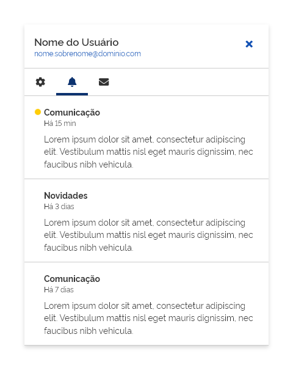
*Exemplo componente notification*

Utilize *notification* para agrupar e informar o usuário sobre eventos e informações relevantes no seu sistema, site ou em aplicativos mobile.

---

## Tom e voz

*Notification* devem ser organizado e apresentado de forma clara e consistente dentro de uma *interface*. O agrupamento deve ser classificado de forma cronológica para que o usuário tenha uma melhor organização temporal do conteúdo de maneira a facilitar sua identificação.

---

## Anatomia

 O componente *notification* é composto pelos seguintes elementos:

 | ID  | Nome               |                                  Referência                                   | Uso         |
 | --- | ------------------ | :---------------------------------------------------------------------------: | ----------- |
 | 1   | Área do Usuário    |                                      ---                                      | Opcional    |
 | 2   | Botão Fechar       |   [Componente Button](https://www.gov.br/ds/components/button?tab=designer)   | Opcional    |
 | 3   | Componente *Tab*   |      [Componente Tab](https://www.gov.br/ds/components/tab?tab=designer)      | Opcional    |
 | 4   | Componente Item    |     [Componente Item](https://www.gov.br/ds/components/item?tab=designer)     | Obrigatório |
 | 5   | Componente Divider |  [Componente Divider](https://www.gov.br/ds/components/divider?tab=designer)  | Obrigatório |
 | 6   | Superfície         | [Fundamento Superfície](https://www.gov.br/ds/fundamentos-visuais/superficie) | Obrigatório |

 
 *Detalhes dos principais elementos que formam o notification*

---

## Detalhamento dos Itens

### 1. Área do Usuário (Opcional)

Esta área é formada por informações pessoais, tais como do nome e o e-mail do usuário. A apresentação dessas informações são importantes principalmente quando forem acessadas por meio do componente avatar.

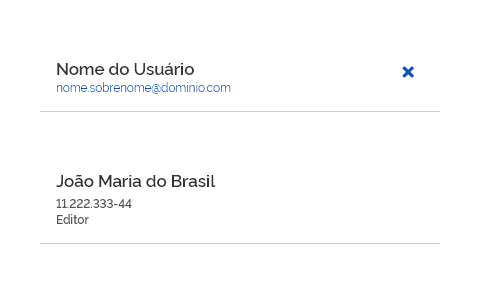
*Área destinada aos dados do usuário*

De acordo com a necessidade do portal ou sistema implementado, outras informações também podem ser acrescentadas. Essas devem respeitar uma hierarquia informacional, tipográfica e de margens já proposta na definição do *layout*.

É na área do usuário que deve se encontrar o Botão Fechar.

### 2. Botão Fechar (Opcional)

É o componente *Button* utilizado na densidade alta. Com exceção da *grid* de 4 colunas, seu uso é opcional. Veja Responsividade mais adiante.

A função do componente *button* é fechar/esconder o *notification* após ser acionado.

*Uso do button fechar*

*Observação*: o *notification* também pode ser fechado/escondido ao clicar fora da superfície do componente ou acionando novamente o mesmo elemento que o solicitou.

### 3. Componente *Tab* (Opcional)

É o componente usado para navegação dentro do *notification*.

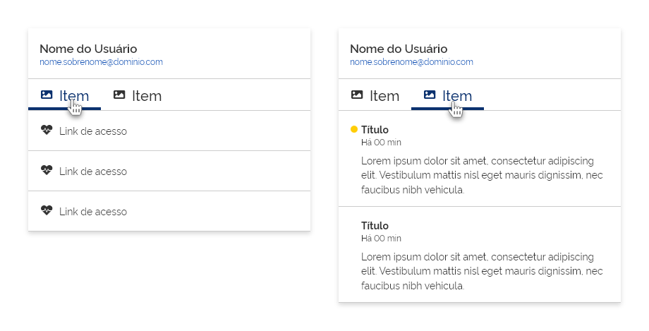
*Exemplo da navegação por meio do componente tabs*

O *item* da *tab* pode ser utilizado em qualquer formatação possível, porém, sempre deverá ser utilizado o comportamento de densidade alta.

*Item formado por ícone e label no padrão horizontal*

*Item formado por ícone e label no padrão vertical*

*Item formado apenas por label sem uso de ícone*

*Item formado apenas por ícones sem uso de label*

Para mais informações veja o Componente *Tab*.

### 4. Componente *Item* do *notification* (Obrigatório)

O componente *Item* é a base onde será criada a formatação do conteúdo relacionada às notificações. Possui todas as características e comportamentos desse componente.
As informações apresentadas podem variar de acordo com a necessidade de cada projeto. Para exemplificar, apresentamos uma diagramação onde o componente *item* apresenta as seguintes informações:

-   **Componente Tag de Status**: Pode-se utilizar o componente *tag* para marcar visualmente qual *item* da notificação é novo ou que ainda não foi lido.
-   **Título da Notificação**: Principal identificação para a chamada do *item* do *notification*.
-   **Informação Cronológica**: Serve para localizar as informações da notificação cronologicamente.
-   **Conteúdo**: Esse bloco serve para informar o conteúdo total ou parcial de uma determinada informação.

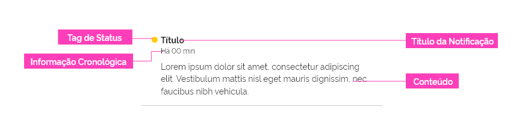
*Um exemplo de como construir o Item do notification*

Para mais informações veja o Componente Item.

### 5. Componente *Divider* (Obrigatório)

Componente *Divider* é utilizado para organizar e destacar visualmente todos os elementos listados anteriormente.

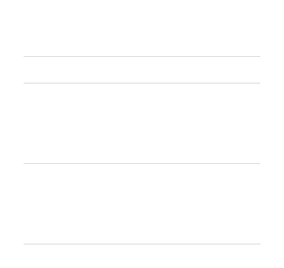
*Notification com somente os dividers visíveis*

Para mais informações veja o Componente *Divider*.

### 6. Superfície (Obrigatório)

A superfície do *notification* é um elemento *Dropdown* (Elemento Flutuante) onde estará agrupado todos os itens listados na anatomia.
Por ser um elemento *Dropdown*, é importante adicionar uma sombra para representar visualmente a diferença de camada entre o componente *notification* e o restante do conteúdo. Esta sombra, por sua vez, utiliza o padrão de *Elevação* na Camada 2.

*Superfície do notification*

Consulte detalhes em *Fundamentos > Elevação*.

---

## Comportamentos

### 1. Acionamento do *Notification*

Tendo em vista que o *Notification* é um elemento *Dropdown* (Elemento Flutuante), este deverá ser exibido em tela através da interação do usuário com um acionador. Este acionador poderá ser qualquer elemento interativo que indique ao usuário a existência de notificação.

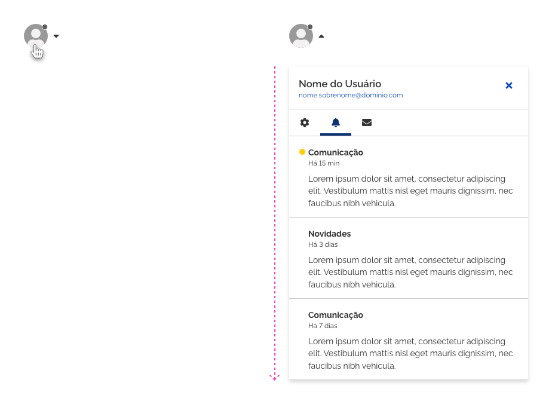
*Exemplo de Acionador do Notification - Avatar com Badge indicando a existência de notificação*

Consulte mais detalhes em [Padrões Dropdown](https://www.gov.br/ds/padroes/dropdown).

### 2. Responsividade

O *notification* é constituído por elementos e *containers* que podem se adaptar a diferentes dimensões e larguras.

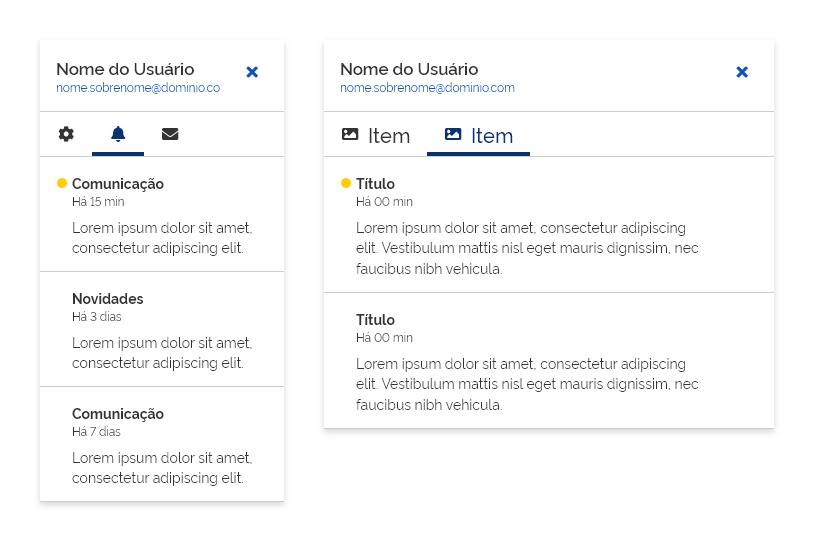
*Exemplo de diferentes dimensões*

Por ser um elemento flutuante, não sofre alteração na mudança de resoluções, porém, existem boas práticas e ele pode sofrer mudanças nos *breakpoints*.

Seguem as recomendações de uso para cada categoria de *Grid*.

#### *Grid* de 12 e 8 Colunas

É importante que o *notification* ocupe, no máximo, a largura de 50% da área disponível para conteúdo, enquanto a altura nunca deverá ultrapassar a área visível disponível.

*Importante*: Utilize o comportamento *Rolagem Interna* (veja adiante) para contornar conteúdos extensos de forma vertical.

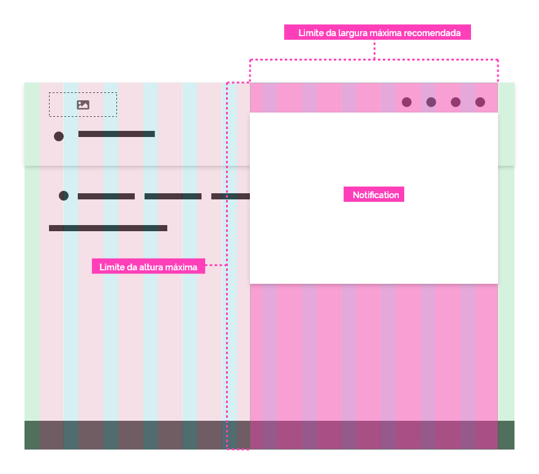
*Exemplo de Limites recomendados no notification*

#### Grid de 4 Colunas

O componente ocupará toda disponível da tela. A altura terá o tamanho total do conteúdo disponível no *notification*.

*Comportamento do notification em Grid para 4 colunas*

Como o *notification* ficará sobre todo o conteúdo, é importante utilizar o *Botão fechar* para permitir que o conteúdo seja fechado/escondido.

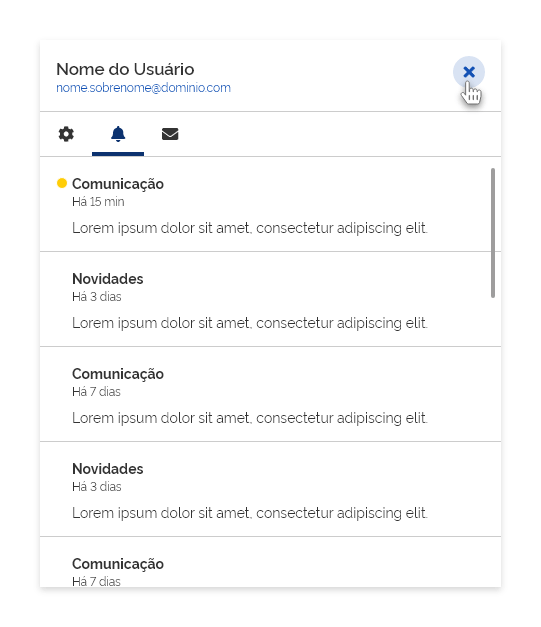
*Superfície do notification*

**Importante**: Evite o uso do comportamento *Rolagem Interna* nas *grids* de 4 colunas! Utilize apenas a barra de rolagem nativa do dispositivo.

### 3. Rolagem Interna

A estrutura e a organização dos Itens do *notification* seguem o padrão de uma "*timeline* infinita", onde as notificações mais recentes são empilhadas sobre as mais antigas ordenando-os cronologicamente.

A altura máxima do componente deve-se manter inalterada. Para visualizar as notificações mais antigas, deve-se utilizar uma barra de rolagem interna.

*Importante*:A rolagem deve afetar somente os itens do notification, mantendo estáticos a área do usuário e o componente tab.

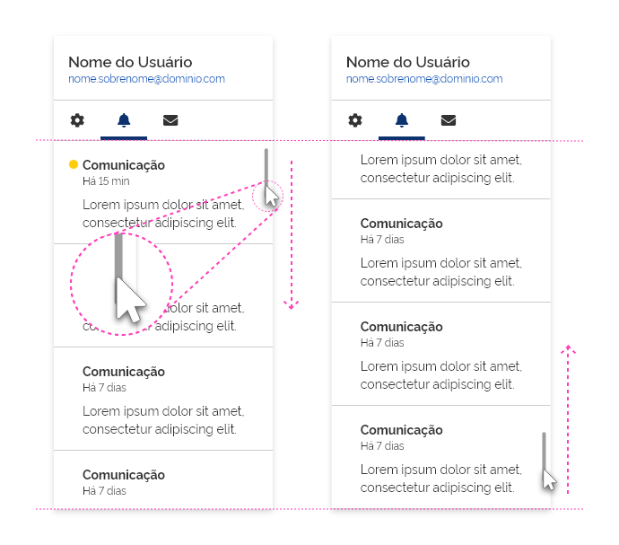
*Na rolagem interna, somente os itens são controlados*

### 4. Estados

Os estados dos itens do *notification* seguem as mesmas regras para o componente *Item*.

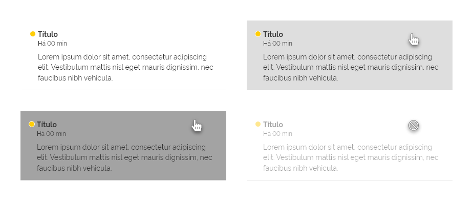
*Exemplo de alguns estados nos itens. Veja a diretriz do componente item para maiores detalhes*

---

## Especificações

### Cores

| Name       | Property   | Color Token |
| ---------- | ---------- | ----------- |
| Superfície | background | `--pure-0`  |

### Espaçamentos

| Name                   | Property               | Token/Value          |
| ---------------------- | ---------------------- | -------------------- |
| Área do Usuário        | espaçamento interno    | `--spacing-scale-2x` |
| Item do *notification* | espaçamento interno    | `--spacing-scale-2x` |
| Botão Fechar           | alinhamento vertical   | `top`                |
| Botão Fechar           | alinhamento horizontal | `right`              |

### Superfície

| Name       | Property | Token/Value           |
| ---------- | -------- | --------------------- |
| Superfície | shadow   | `--surface-shadow-md` |
