[version]: # (10.0.5)

*Exemplo de Pagination*

Utilize o *Pagination* quando:

-   O volume de dados carregados na tela for bastante extenso e houver a necessidade de organizá-lo em partes menores, ou seja, *Páginas Sequenciais*;

-   Melhorar a usabilidade e organização de conteúdos em listas.

---

## Anatomia

O *Pagination* contém os componentes: *Botão Circular*, *Lista* e *Separadores*, além de outros elementos específicos, e é organizado nos seguintes módulos:

| ID  | Nome                       |                             Referência                             | Uso         |
| --- | -------------------------- | :----------------------------------------------------------------: | ----------- |
| 1   | Setas de Navegação         |   [Button](https://www.gov.br/ds/components/button?tab=designer)   | Obrigatório |
| 2   | Identificadores de Páginas |   [Button](https://www.gov.br/ds/components/button?tab=designer)   | Obrigatório |
| 3   | Botão Reticências          |   [Button](https://www.gov.br/ds/components/button?tab=designer)   | Opcional    |
| 4   | Módulo de Exibição         |   [Select](https://www.gov.br/ds/components/select?tab=designer)   | Opcional    |
| 5   | Módulo de Informação       | [Tipografia](https://www.gov.br/ds/fundamentos-visuais/tipografia) | Opcional    |
| 6   | Módulo de Atalho           |   [Select](https://www.gov.br/ds/components/select?tab=designer)   | Opcional    |

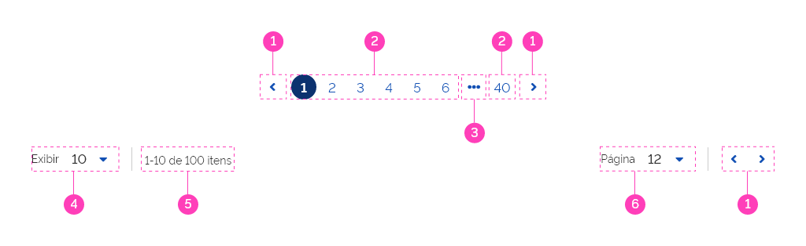
*Anatomia do Pagination*

---

### Detalhamento dos Itens

#### 1. Setas de Navegação (Obrigatório)

Constituem um *Botão* para esquerda e outro para direita. A cada clique, o usuário poderá navegar página por página de forma crescente ou decrescente (direita / esquerda).

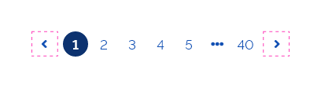
*Setas de Navegação*

#### 2. Identificadores de Páginas (Obrigatório)

Os *Identificadores de Páginas* também são interativos. O usuário poderá clicar diretamente na página para qual deseja acessar. Neste elemento só será permitido caracteres numéricos.

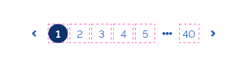
*Identificadores de Páginas*

#### 3. Botão Reticências (Opcional)

O *Botão de Reticências* indica que há mais páginas entre o número inicial e final. O objetivo deste elemento é tornar o *Pagination* mais compacto e resumido. Para acessar todas as páginas ocultas basta clicar no botão e acessá-las através de uma lista por *dropdown*.

Se a Lista for bastante extensa, deve-se utilizar Barra de Rolagem que por padrão deverá ser acionada quando existir uma lista acima de 4 itens a serem apresentados. No entanto, esse valor poderá ser personalizado de acordo com as necessidades visuais e técnicas do projeto. Observe o exemplo abaixo:

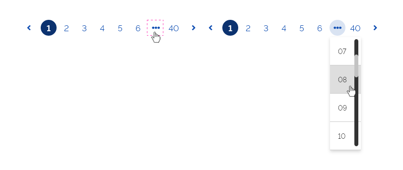
*Botão de Reticências*

#### 4. Módulo de Exibição (Opcional)

Este é um módulo opcional. O *Componente Pagination* poderá ser configurado para exibi-lo ou não. Sua utilidade é oferecer ao usuário a possibilidade de configurar quantos itens deverão aparecer na listagem do *Pagination*.

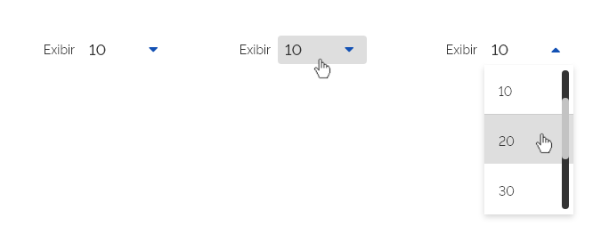
*Módulo de Exibição*

#### 5. Módulo de Informação (Opcional)

Este módulo é opcional e sua função é mostrar ao usuário o intervalo de páginas que está sendo exibido no momento e o total de páginas que existem no *Pagination*.

*Módulo de Informação*

#### 6. Módulo de Atalho (Opcional)

Este módulo também é opcional e sua função é oferecer ao usuário um atalho para acessar qualquer página. É exibido o número da página ativa e se o usuário clicar nele abrirá uma lista do componente *select* com todas as páginas restantes. Se a lista trouxer muitas páginas, deve-se utilizar a *Barra de Rolagem*. É bastante útil e evita obrigar o usuário navegar página por página até encontrar a desejada.

Por padrão, a barra de rolagem deverá ser acionada quando existir uma lista acima de 4 itens a serem apresentados. No entanto, esse valor poderá ser personalizado de acordo com as necessidades visuais e técnicas do projeto.

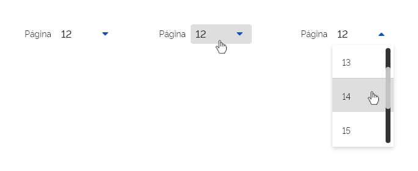
*Módulo de Atalho*

---

## Tipos

### 1. Tipo Padrão

É a paginação padrão, aparece sempre no final do conteúdo da tela. As páginas são acessadas rapidamente e são facilmente reconhecíveis aos usuários, a sequência dos *Identificadores de Páginas* ficam sempre visíveis na tela.

*Paginação Tipo Padrão*

### 2. Tipo Contextual

É utilizada integrada a outros componentes, como por exemplo *Cards* ou *Tabelas* e visa controlar a sequência de paginação dos *Componentes* aos quais se relacionam. Neste tipo, o *Pagination* apresenta apenas as *Setas de Navegação*, além de poder utilizar também o *Módulo de Exibição*, *Módulo de Informação* e o *Módulo de Atalho*.

Neste tipo, apenas as *Setas de Navegação* são obrigatórias, os demais elementos são opcionais e poderão ser usados conforme a necessidade.

*Paginação Tipo Contextual*

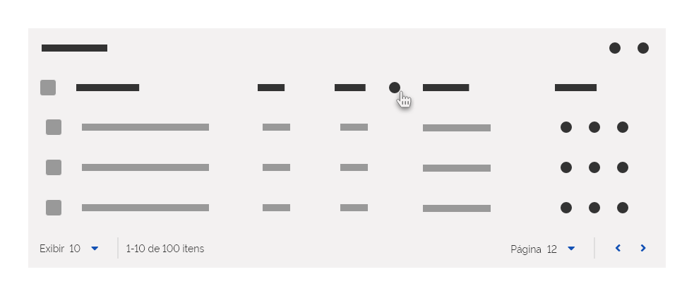
*Exemplo de Paginação Tipo Contextual em Tabela*

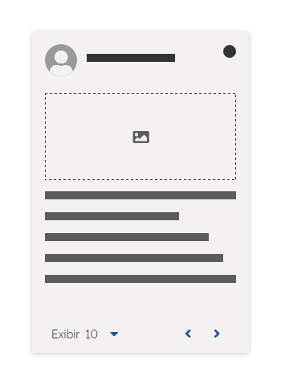
*Exemplo de Paginação Tipo Contextual em Cards*

---

## Comportamentos

### 1. Responsividade

A *Paginação Padrão* permanecerá centralizada nas *Grids* de 12, 8 e 4 *Colunas*. Na *Grid* de 4 colunas recomenda-se utilizar a *Paginação* com *Densidade Baixa* com a finalidade de proporcionar maior área de *Touch*.

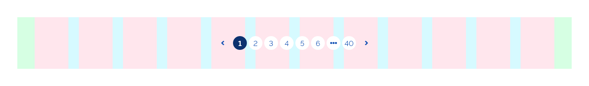
*Pagination Padrão - Grid de 12 colunas*

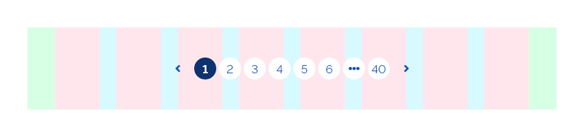
*Pagination Padrão - Grid de 8 colunas*

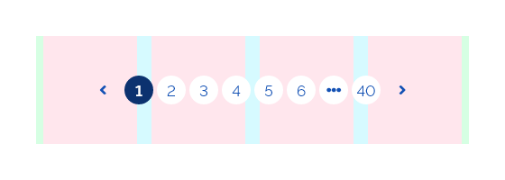
*Pagination Padrão - Grid de 4 colunas*

#### Responsividade dos Identificadores de Páginas

Em decorrência da redução da tela, caso não seja possível exibir todos os *Identificadores de Páginas*, o *Componente Pagination* deverá ocultar quantos *Identificadores* forem necessários utilizando o *Botão Reticências*. Observe o exemplo abaixo:

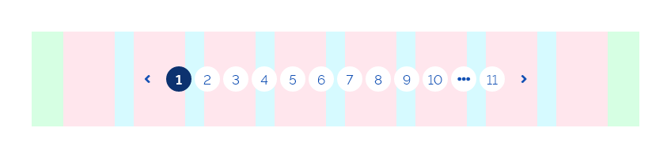
*Responsividade dos Identificadores de Páginas - Grid de 8 colunas*

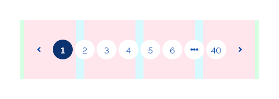
*Responsividade dos Identificadores de Páginas - Grid de 4 colunas*

A *Paginação Contextual* poderá ser ajustada às colunas da *Grid* e seu tamanho e disposição poderão variar conforme a necessidade.

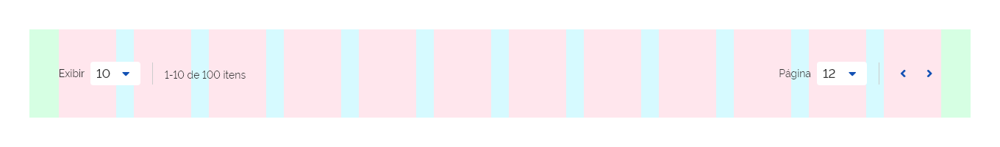
*Pagination Contextual - Grid de 12 colunas*

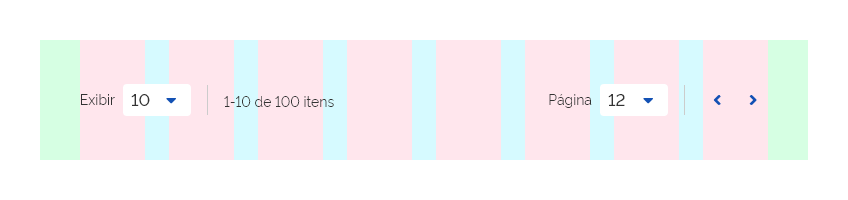
*Pagination Contextual - Grid de 8 colunas*

Na *Grid de 4 Colunas*, caso seja necessário, pode-se ocultar alguns módulos menos relevantes de forma a obter mais espaço.

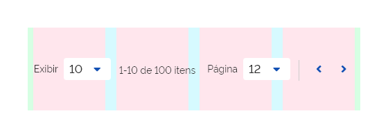
*Pagination Contextual - Grid de 4 colunas*

### 2. Posição e Alinhamento

#### *Pagination* Tipo Padrão

O *Pagination Tipo Padrão* posiciona-se sempre centralizado à tela.

*Posição e Alinhamento - Tipo Padrão*

#### *Pagination* Tipo Contextual

O *Pagination Tipo Contextual* possui posição e alinhamento configuráveis para seus módulos. O *Componente* permitirá que cada módulo possa ser alinhado à esquerda ou à direita. Isto proporcionará bastante flexibilidade e tornará o Componente flexível às necessidades de diferentes projetos de layout. Abaixo seguem algumas sugestões de posicionamento:

*Posição e Alinhamento Tipo Contextual - Sugestão*

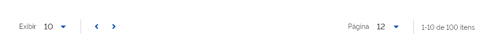
*Posição e Alinhamento Tipo Contextual - Sugestão*

*Posição e Alinhamento Tipo Contextual - Sugestão*

### 3. Visualização dos Módulos

O *Componente Pagination* do *Tipo Contextual* também permite a configuração da visualização de cada módulo, independentemente. Cada módulo poderá ser usado ou não, conforme a necessidade.

Neste exemplo estão sendo utilizados apenas o *Módulo de Exibição* e as *Setas de Navegação*.

*Módulo de Exibição e Setas de Navegação*

Já neste exemplo são utilizadas as *Setas de Navegação* e o *Módulo de Informação*.

*Módulo de Informação e Setas de Navegação*

Aqui são utilizados todos os módulos.

*Todos os Módulos*

**Importante:** Nas visualizações dos módulos, sempre nos lugares que permitem escolhas com opções, deve-se utilizar o componente *select* personalizado, onde o seu *input* (Campo de Entrada de Texto) estará em densidade alta, sem contorno e pré definido e não terá uma de largura mínima pré-definida. A largura deverá se adaptar de acordo com os elementos que o compõe. O rótulo ou *label* que do componente *select* deverá ser apresentado ao lado do *input*, em outro estilo tipográfico (–font-size-scale-base)

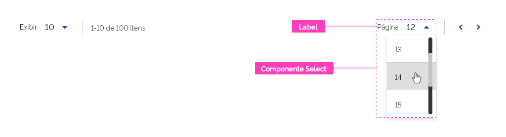
*Escolha nos módulos de opções através do Componente select*

### 4. Número de Páginas Customizável

O número de *Identificadores de Páginas* utilizados no *Componente Pagination* é customizável. Esta customização permite adequar melhor o *Componente Pagination* em diversos espaços e resoluções diferenciadas. Veja os exemplos abaixo:

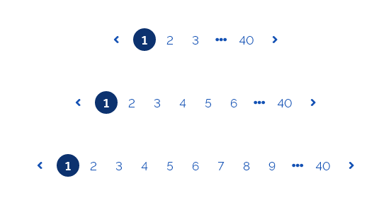
*Número de Páginas Customizável*

**Atenção:** Quando houver a necessidade de utilizar o botão de reticências em um Componente *Pagination*, para um tamanho mínimo recomenda-se limitar os Identificadores de Páginas a quatro no total.

### 5. Uso do Botão Reticências

O *Botão Reticências* poderá ser utilizado:

-   No Início - logo após a primeira página;

-   No Final - imediatamente antes da última página;

-   Em ambas situações.

#### Botão Reticências no Início

Este aparecerá no início quando a configuração do número de páginas a serem exibidas for menor que o total de páginas e o *Página Ativa* estiver no intervalo de páginas próximo ao final.

*Botão Reticências no Início*

#### Botão Reticências no Final

Este aparecerá no final quando a configuração do número de páginas a serem exibidas for menor que o total de páginas e a *Página Ativa* estiver no intervalo de páginas próximo ao início.

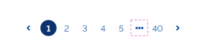
*Botão Reticências no Final*

#### Botão Reticências no Início e no Final

Este aparecerá no início e no final quando a configuração do número de páginas a serem exibidas for menor que o total de páginas e o *Página Ativa* estiver num intervalo de páginas intermediário.

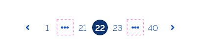
*Botão Reticências no Início e no Final*

Para acessar as páginas ocultas basta clicar no botão e acessá-las através de uma lista por *dropdown*.

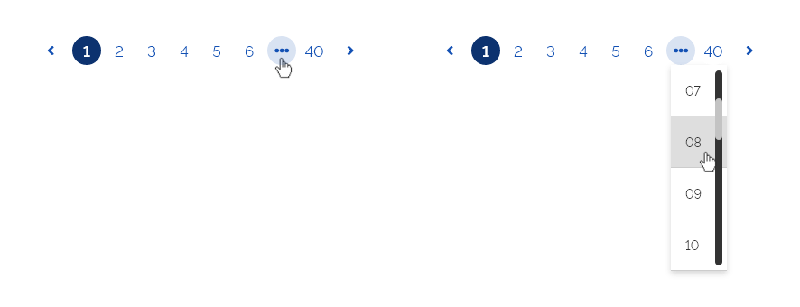
*Botão de Reticências*

#### Navegando por Páginas Subsequentes

Ao selecionar uma página subsequente à página ativa, o *Componente Pagination* mantém sua configuração original, alterando apenas o número da página ativa. Veja a seguir:

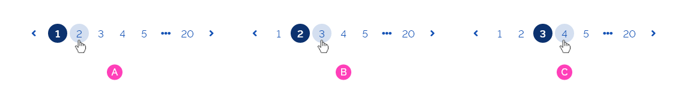
*Navegando no Pagination - Páginas Subsequentes*

A - A página ativa é a primeira e o usuário seleciona a segunda página;

B - O *Pagination* mantém a configuração original e altera a página selecionada para o *Estado Ativo*;

C - O mesmo ocorre sempre que o usuário selecionar uma página subsequente à página ativa.

#### Navegando através do Botão Reticências

Ao selecionar uma página através do *Botão Reticências*, o *Componente Pagination* trará nova configuração dos *Identificadores de Páginas* contendo o *Identificador da Página Ativo* centralizado ao *Componente*. Observe abaixo:

*Navegando no Pagination - Botão Reticências*

A - A página ativa é a primeira;

B - O usuário seleciona outra página através do *Botão Reticências*;

C - O *Pagination* é reconfigurado exibindo a página ativa selecionada centralizada ao *Componente*.

### 6. Número de caracteres

Quando o número de caracteres no *Identificador da Página* for igual ou superior a 3, este deverá assumir o formato de pílula e crescerá na horizontal, caso a quantidade de caracteres aumente.

*Número de caracteres*

### 7. Densidade

#### Densidade Baixa

Utilize *Densidade Baixa* quando o projeto de layout permitir mais espaço ou quando quando houver necessidade de dar mais destaque ao *Componente Pagination*, ou ainda quando houver necessidade de utilizar o *Pagination* em resolução de 4 colunas, onde é necessário mais área para interação através do *Touch*.

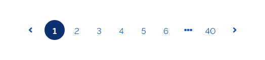
*Tipo Padrão Densidade Baixa*

*Tipo Contextual Densidade Baixa*

#### Densidade Média

É a forma comum do *Componente Pagination*. Oferece um espaçamento interno adequado e equilibrado para vários tipos de projetos. Importante se atentar ao fato que a densidade média é a densidade para uso padrão.

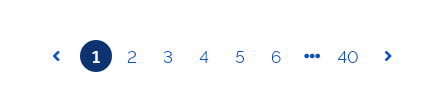
*Tipo Padrão Densidade Média*

*Tipo Contextual Densidade Média*

#### Densidade Alta

Utilize *Densidade Alta* quando for necessário usar o *Componente Pagination* em espaços mais restritos, ou dentro de outros elementos.

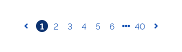
*Tipo Padrão Densidade Alta*

*Tipo Contextual Densidade Alta*

### 8. Estados

O *Componente Pagination* pode ser apresentado nos seguintes estados:

#### Estado Interativo

É o estado comum no qual o *Componente Pagination* se apresenta.

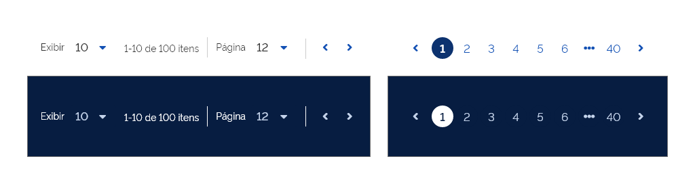
*Estado Interativo*

#### Estado Hover

Este estado ocorre quando o usuário passa o *Mouse* sobre os elementos interativos, como por exemplo, as *Setas Laterais* e os *Botões*.

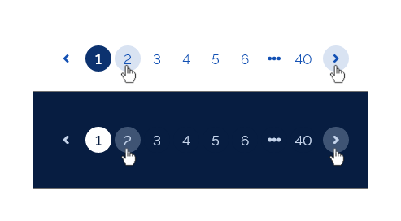
*Estado Hover*

#### Estado Ativo

O *Estado Ativo* informa ao usuário que um elemento foi acionado e encontra-se em estado ativo ou em evidência.

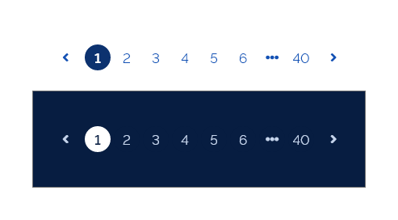
*Estado Ativo*

#### Estado Pressionado

O *Estado Pressionado* ocorre quando o usuário clica sobre o elemento interativo.

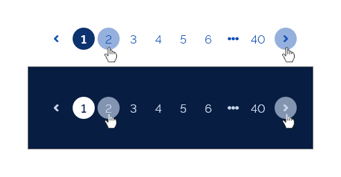
*Estado Pressionado*

---

## Melhores Práticas

### Paginação Vertical com Botão

Quando houver a necessidade de uma navegação vertical e contínua, recomenda-se utilizar o *Componente Botão* ao final da tela. Neste caso, a paginação ocorre como um comportamento, mas o *Componente* utilizado é o *Botão Ênfase Secundária*.

O usuário clica no *Botão* e enquanto os dados são carregados, o *Componente Loading* substitui a lista. Após o carregamento dos dados, a lista é atualizada. Observe abaixo:

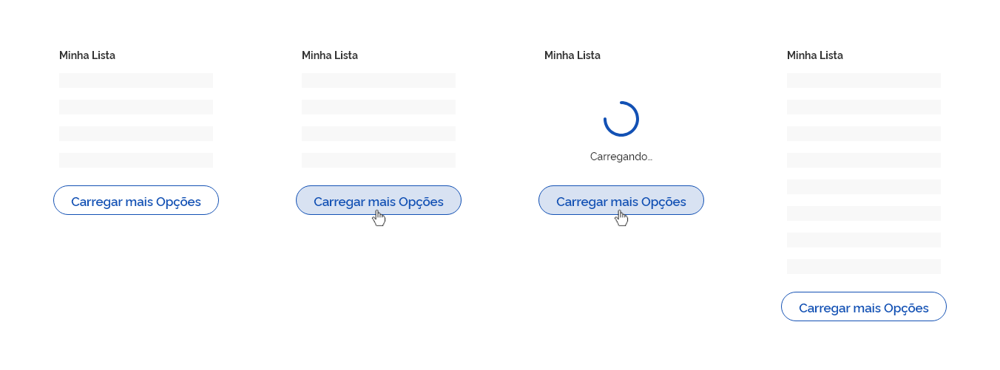
*Paginação Vertical com Botão*

#### Paginação Vertical com Rolagem Automática

Há também outra forma de *Paginação Vertical* sem utilização de *Botão*. É a *Paginação com Rolagem Automática*. Nesta situação, o usuário apenas rola a tela para baixo, e quando o conteúdo chega ao fim, mais dados são carregados na tela automaticamente. Observe abaixo:

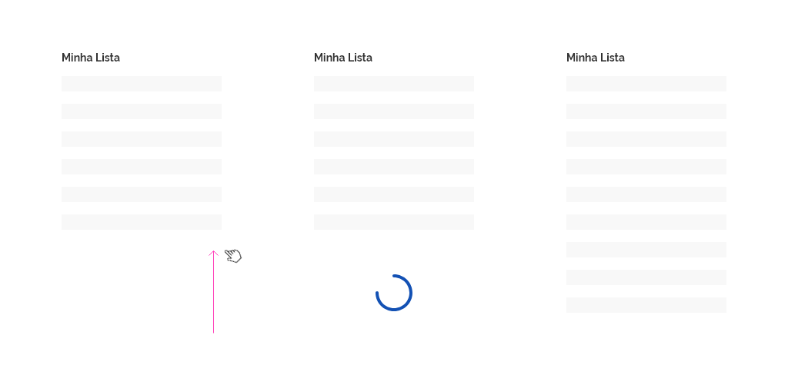
*Paginação Vertical com Rolagem Automática*

---

## Especificações

### Cores

#### Estado - Interativo

| Name                                    | Property   | Color Token            |
| --------------------------------------- | ---------- | ---------------------- |
| Setas de Navegação                      | color      | `--blue-warm-vivid-70` |
| Setas de Navegação Fundo Escuro         | color      | `--blue-warm-20`       |
| Identificadores de Páginas              | color      | `--blue-warm-vivid-70` |
| Identificadores de Páginas              | background | `--pure-0`             |
| Identificadores de Páginas Fundo Escuro | color      | `--pure-0`             |
| Identificadores de Páginas Fundo Escuro | background | `--blue-warm-vivid-90` |
| Texto Módulos                           | color      | `--color-secondary-08` |
| Texto Módulos Fundo Escuro              | color      | `--pure-0`             |
| Texto Interativo Módulos                | color      | `--blue-warm-vivid-70` |
| Texto Interativo Módulos Fundo Escuro   | color      | `--blue-warm-20`       |
| Botões Módulos                          | color      | `--blue-warm-vivid-70` |
| Botões Módulos Fundo Escuro             | color      | `--blue-warm-20`       |

#### Estado - Hover

| Name                                    | Property   | Color Token            |        Opacity         |
| --------------------------------------- | ---------- | ---------------------- | :--------------------: |
| Setas de Navegação                      | color      | `--blue-warm-vivid-70` |           -            |
| Setas de Navegação                      | background | `--blue-warm-vivid-70` | `--surface-opacity-xs` |
| Setas de Navegação Fundo Escuro         | background | `--blue-warm-vivid-70` | `--surface-opacity-sm` |
| Setas de Navegação Fundo Escuro         | color      | `--blue-warm-20`       |           -            |
| Texto Módulos Fundo Escuro              | color      | `--pure-0`             |           -            |
| Texto Interativo Módulos Fundo Escuro   | color      | `--blue-warm-20`       |           -            |
| Identificadores de Páginas              | color      | `--blue-warm-vivid-70` |           -            |
| Identificadores de Páginas              | background | `--blue-warm-vivid-70` | `--surface-opacity-xs` | - |
| Identificadores de Páginas Fundo Escuro | background | `--blue-warm-vivid-70` | `--surface-opacity-sm` |
| Botões Módulos                          | color      | `--blue-warm-vivid-70` |           -            |
| Botões Módulos                          | background | `--blue-warm-vivid-70` | `--surface-opacity-xs` |
| Botões Módulos Fundo Escuro             | color      | `--blue-warm-20`       |           -            |
| Botões Módulos Fundo Escuro             | background | `--blue-warm-vivid-70` | `--surface-opacity-sm` |

#### Estado - Pressionado

| Name                                    | Property   | Color Token            |        Opacity         |
| --------------------------------------- | ---------- | ---------------------- | :--------------------: |
| Setas de Navegação                      | color      | `--blue-warm-vivid-70` |           -            |
| Setas de Navegação Fundo Escuro         | color      | `--blue-warm-20`       |           -            |
| Setas de Navegação                      | background | `--blue-warm-vivid-70` | `--surface-opacity-md` |
| Setas de Navegação Fundo Escuro         | background | `--blue-warm-20`       | `--surface-opacity-lg` |
| Identificadores de Páginas              | color      | `--blue-warm-vivid-70` |           -            |
| Identificadores de Páginas Fundo Escuro | color      | `--pure-0`             |           -            |
| Identificadores de Páginas              | background | `--blue-warm-vivid-70` | `--surface-opacity-md` |
| Identificadores de Páginas Fundo Escuro | background | `--pure-0`             | `--surface-opacity-lg` |
| Botões Módulos                          | color      | `--blue-warm-vivid-70` |           -            |
| Botões Módulos Fundo Escuro             | color      | `--blue-warm-20`       |           -            |
| Botões Módulos                          | background | `--blue-warm-vivid-70` | `--surface-opacity-md` |
| Botões Módulos Fundo Escuro             | background | `--blue-warm-20`       | `--surface-opacity-lg` |

#### Estado - Ativo

| Name                                    | Property   | Color Token            | Opacity |
| --------------------------------------- | ---------- | ---------------------- | :-----: |
| Setas de Navegação Fundo Escuro         | color      | `--blue-warm-20`       |    -    |
| Texto Módulos Fundo Escuro              | color      | `--pure-0`             |    -    |
| Texto Interativo Módulos Fundo Escuro   | color      | `--blue-warm-20`       |    -    |
| Identificadores de Páginas              | color      | `--pure-0`             |    -    |
| Identificadores de Páginas              | background | `--blue-warm-vivid-90` |    -    |
| Identificadores de Páginas Fundo Escuro | color      | `--blue-warm-vivid-90` |    -    |
| Identificadores de Páginas Fundo Escuro | background | `--pure-0`             |    -    |
| Botões Módulos                          | color      | `--pure-0`             |    -    |
| Botões Módulos                          | background | `--blue-warm-vivid-90` |    -    |
| Botões Módulos Fundo Escuro             | color      | `--blue-warm-vivid-90` |    -    |
| Botões Módulos Fundo Escuro             | background | `--pure-0`             |    -    |

### Tipografia

| Name                                         | Size                      | Weight                    |
| -------------------------------------------- | ------------------------- | ------------------------- |
| Texto Módulos                                | `--font-size-scale-base`  | `--font-weight-regular`   |
| Texto Botões Páginas                         | `--font-size-scale-up-01` | `--font-weight-regular`   |
| Identificador de página                      | `--font-size-scale-up-01` | `--font-weight-regular`   |
| Identificador de página (página selecionada) | `--font-size-scale-up-01` | `--font-weight-semi-bold` |

### Iconografia

| Name                        | Ícone                       | Token Size          | Class (Font Awesome) |
| --------------------------- | --------------------------- | ------------------- | -------------------- |
| Seta Lateral Esquerda       | <i class="angle-left"></i>  | `--icone-size-base` | angle-left           |
| Seta Lateral Direita        | <i class="angle-right"></i> | `--icone-size-base` | angle-right          |
| Seta Seleção de Lista       | <i class="angle-down"></i>  | `--icone-size-base` | angle-down           |
| Seta Seleção de Lista Ativa | <i class="angle-up"></i>    | `--icone-size-base` | angle-up             |

### Dimensões

| Name                                         | Property | Value  |
| -------------------------------------------- | -------- | :----: |
| Setas de Navegação - Densidade Média         | Width    | `32px` |
| Setas de Navegação - Densidade Média         | Height   | `32px` |
| Identificadores de Páginas - Densidade Média | Width    | `32px` |
| Identificadores de Páginas - Densidade Média | Height   | `32px` |
| Botões Seleção de Lista - Densidade Média    | Width    | `32px` |
| Botões Seleção de Lista - Densidade Média    | Height   | `32px` |
| Setas de Navegação - Densidade Baixa         | Width    | `40px` |
| Setas de Navegação - Densidade Baixa         | Height   | `40px` |
| Identificadores de Páginas - Densidade Baixa | Width    | `40px` |
| Identificadores de Páginas - Densidade Baixa | Height   | `40px` |
| Botões Seleção de Lista - Densidade Baixa    | Width    | `40px` |
| Botões Seleção de Lista - Densidade Baixa    | Height   | `40px` |
| Setas de Navegação - Densidade Alta          | Width    | `24px` |
| Setas de Navegação - Densidade Alta          | Height   | `24px` |
| Identificadores de Páginas - Densidade Alta  | Width    | `24px` |
| Identificadores de Páginas - Densidade Alta  | Height   | `24px` |
| Botões Seleção de Lista - Densidade Alta     | Width    | `24px` |
| Botões Seleção de Lista - Densidade Alta     | Height   | `24px` |

### Espaçamentos

| Name                       | Property     |         Value          |
| -------------------------- | ------------ | :--------------------: |
| Setas de Navegação         | margin-right | `--spacing-scale-base` |
| Setas de Navegação         | margin-left  | `--spacing-scale-base` |
| Identificadores de Páginas | margin-left  | `--spacing-scale-half` |
| Identificadores de Páginas | margin-right | `--spacing-scale-half` |
| Módulo de Exibição         | margin-left  |  `--spacing-scale-2x`  |
| Módulo de Exibição         | margin-right |  `--spacing-scale-2x`  |
| Módulo de Informação       | margin-left  |  `--spacing-scale-2x`  |
| Módulo de Informação       | margin-right |  `--spacing-scale-2x`  |
| Módulo de Atalho           | margin-left  |  `--spacing-scale-2x`  |
| Módulo de Atalho           | margin-right |  `--spacing-scale-2x`  |
