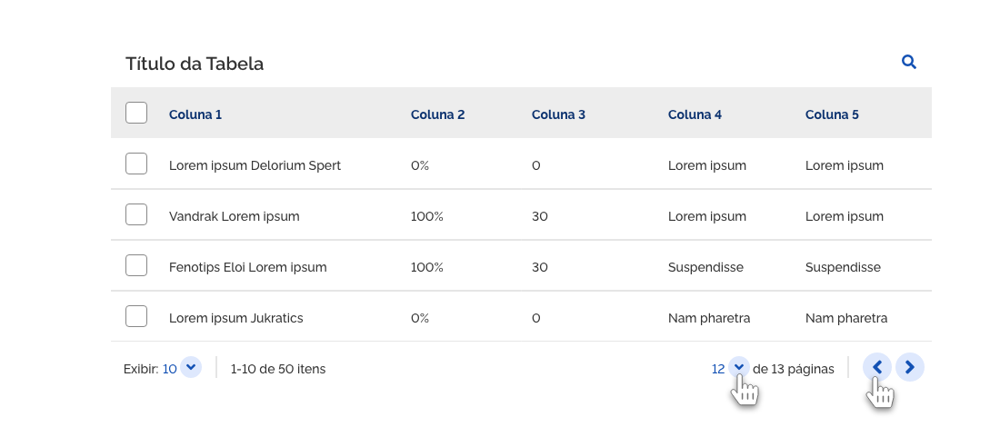
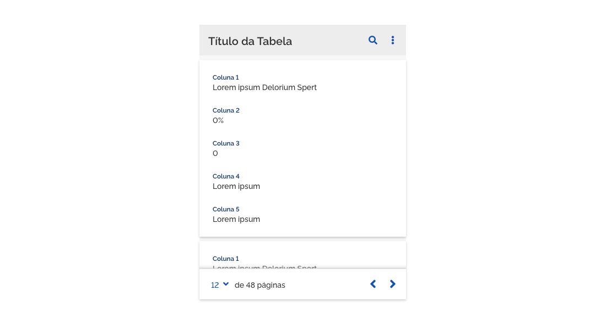
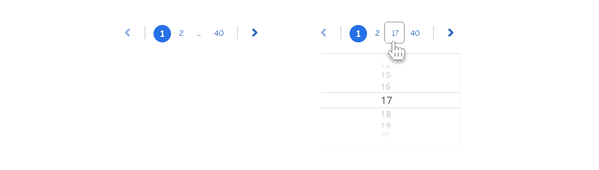
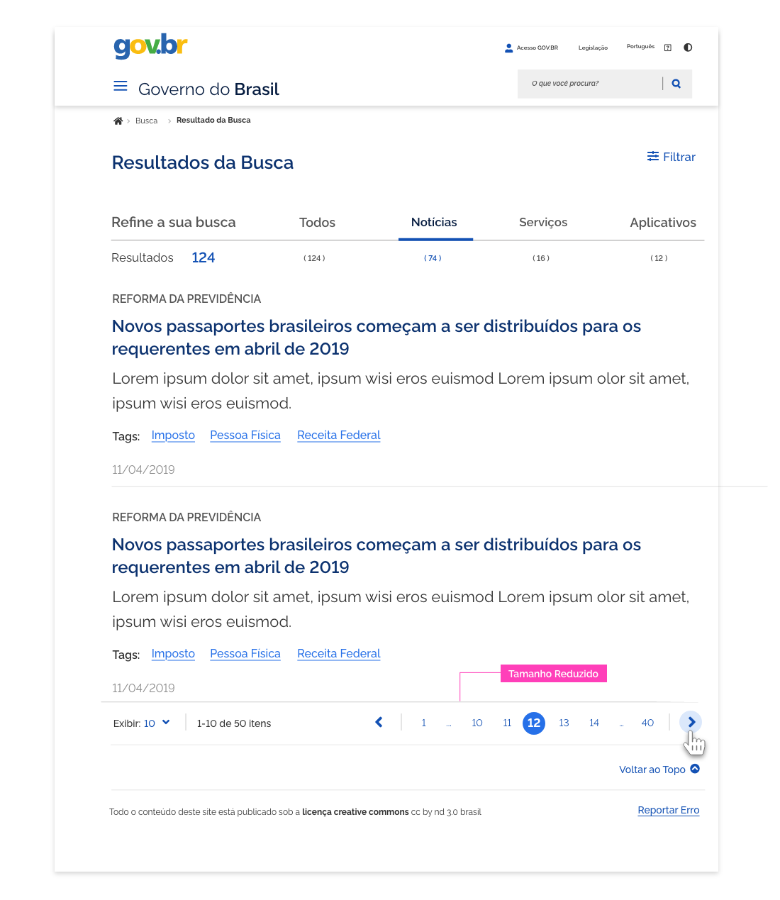
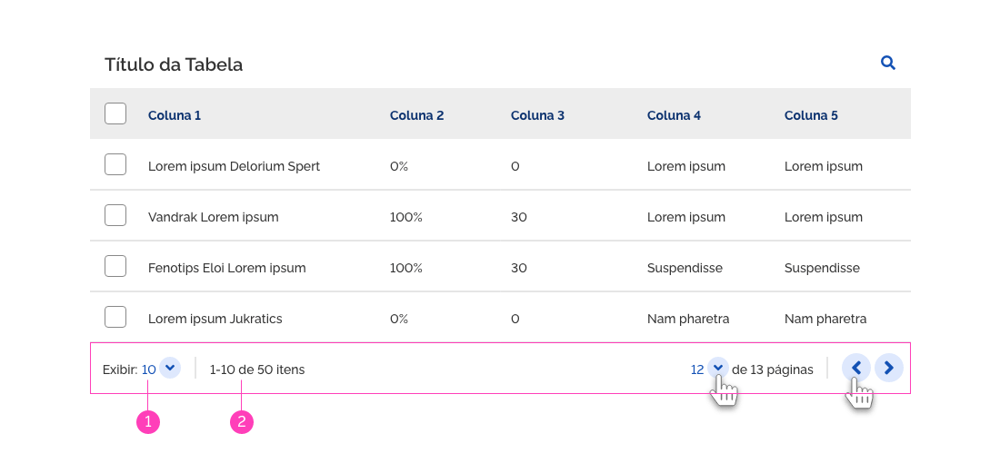
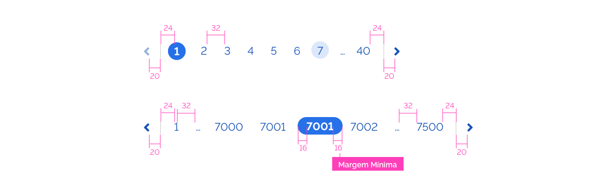
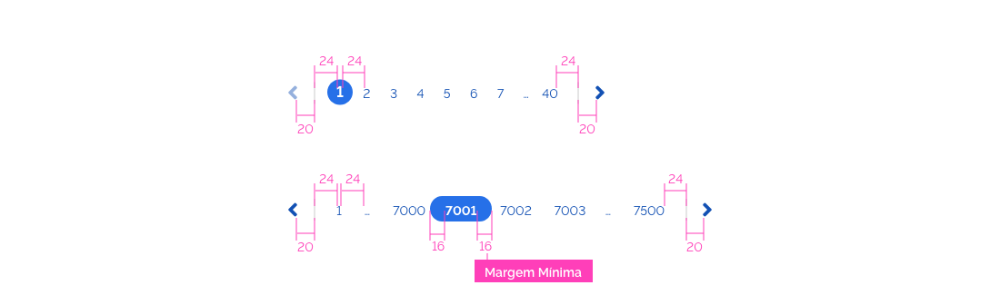

---

### Anatomia

#### Estrutura

**1 - Setas**

**2 - Separador**

**3 - Caracteres Numericos**

---

## Tipos

Existem, por padrão, 02 tipos de paginação

#### Paginação para Telas de Portal e Sistemas

É a paginação padrão do Design System, aparece sempre no final do conteúdo da tela. As páginas são acessados rapidamente e são facilmemte reconhecíveis aos usuários, já que uma sequencia de pelo menos 08 números ficam sempre visíveis na tela.

#### Paginação da Tabela

Para tabela foi aplicada uma paginação mais resumida, para deixar o layout mais integrado com a tabela.

## Estrutura

A estrutura da paginação é formada pela sequência de 09 elementos dentre números e reticências e os ícones de seta indicativos das ações de avançar e retroceder. A navegação entre as páginas pode ser feita através de 3 formas: diretamente no clique em cima do número correspondente a página. Avançando ou retrocedendo através das setas para página posterior e anterior respectivamente. E também através do clique em cima da reticências (…) que abrirá um campo autocomplete para o usuário digitar a página específica que deseja acessar.

1 | Usuário encontra-se na página 01

2 | Usuário encontra-se na página 12 e põe o mouse sobre a página 10

3 | Usuário encontra-se na página 12

4 | Usuário encontra-se na página 12 e põe o mouse sobre uma das setas

5 | Usuário põe o mouse sobre reticências

6 | Usuário clica sobre as reticências

7 | Usuário seleciona uma página com mais de 02 caracteres

---

Estados

1 | Interativo
O estado que comunica ao usuário que os números são interativos/clicáveis.

2 | Selecionado
Acontece quando se clica em algum número da paginação.
Indica em que página o usuário se encontra.

3 | Hover
O estado que comunica quando um usuário coloca o cursor sobre um número da paginação.

---

## Orientação de Uso

A primeira e a última página devem permanecer sempre fixas e visíveis na paginação, sendo assim o usuário pode a qualquer momento acessar essas páginas. Porém se o usuário clicar da página 08 em diante, os números de 02 a 07 irão rolar para esquerda, passando a aparecer na tela da página 08, 09, 10, 11, 12…

Ao clicar sobre páginas com mais de 02 caracteres o elemento circular que sinaliza a página que o usuário se encontra se transforma em uma forma mais alongada semelhante a uma pílula.

### Portal - Paginação com Tipografia Maior

O uso da tipografia em maior proporção só é sugerida para portal, devido a proporção dos itens de resultado das telas.

Nesse caso, como a quantidade de caracteres e a fonte são maiores indica-se deixar apenas 04 páginas entre as reticências.

### **Sistema - Paginação Padrão**

Com exceção do uso no portal, a tipografia na paginação deve ser 14pt, ficando mais proporcional aos elementos do sistema.

Quando a primeiro ou a última página estiver selecionada
a seta que a acompanha deve aparecer desabilitada, informando
ao usuário que não há mais itens a serem clicados.

Quando a primeiro ou a última página estiver selecionada
a seta que a acompanha deve aparecer desabilitada, informando
ao usuário que não há mais itens a serem clicados.

### **Sistema - Paginação Resumida**

Em situações de menor espaçamento ou de responsividade de tela, utilizar este formato.

### Mobile - Paginação Resumida

A navegação pode ser por escolha de uma página específica, uma a uma, ou diretamente a inicial ou final.

Nesse caso, o picker nativo do celular abrirá para que o ususário faça a escolha da página que deseja acessar.

### Mobile - Carregar mais opções

Carregamento por demanda do usuário: o uso do botão "Carregar mais resultados" é interessante pra quando o usuário não quer gastar os dados do celular. Nesse caso, as demais opções de itens exibidos na tela só aparecem após o clique no botão carregar. Esta opção é interessante quando o usuário não quer gastar os dados do cel carregando mais resultados automaticamente.

---

#### Alinhamento

A paginação deve vir alinhada à direita com o conteúdo da tela. E do Lado esquerdo deve aparecer a quantidade de itens por página.

Na paginação de tabela aparecerá do lado esquerdo um contador com a qualidade de itens exibidos e a opção de selecionar quantos serão exibidos na tela. Já a paginação em si, deverá aparecer alinhada à direita com o conteúdo.

#### Espaçamentos

Segue as métricas definidas para os espaçamentos de todos os elementos utilizados na paginação.. Todas as medidas foram definidas com valores múltiplos de 4px e 8px.

##### 1 | Paginação Portal

##### 2| Paginação Sistema

