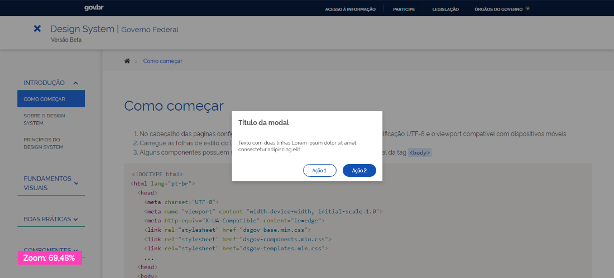

## Uso

Scrims ajudam a redirecionar a atenção do usuário para outras partes ou elementos da tela, retirando possibilidade de foco, ou inibindo a interação com a superfície que recebe o scrim.

Multiplas áreas ou qualquer elemento (parcialmente ou não) pode receber scrim. Podem existir vários scrims ativos na mesma tela, de diferentes tipos.

Usado fundamentalmente para manipular:

-   **Foco:** quando existe mudança de foco entre um elemento e outro;
-   **Legibilidade:** quando um texto precisa ser aplicado sobre um superfície e o contraste fundo/texto não é suficiente para gerar contraste acessível;
-   **Inibição:** simular elementos para o estado de desativado;

## Anatomia

Um Scrim é uma sobreposição, ou seja, uma forma semi-transparente sobre uma área.

Pode ser aplicado sobre um elemento inteiro, de forma pacial ou sobre toda a tela visível de um dispositivo.

Em alguns casos, pode ser necessário o **scrim vazado**, cuja característica é possuir uma área de fresta.

A cor e o valor da opacidade variam de acordo com o tipo de scrim utilizado.

## Tipo

Existem 3 tipos de scrim: **Foco**, **Legibilidade** e **Inibição**.
A escolha deve ser feita baseada na necessidade de uso.

### Foco

Usado para alterar o foco hierárquico de um elemento sobre outro ou sobre vários elementos ao mesmo tempo, onde um determinado conteúdo precisa de uma grande relevância sobre os demais.

Usado principalmente quando um novo elemento surge na tela, e necessita de uma atenção especial do usuário. Os elementos ou regiões que não requerem atenção do usuário ficam escuros, quanto o elemento em questão ganha atenção total.

O **scrim vazado** pode ser utilizado para essa função, onde o elemento de atenção deve ser concentrado na área de fresta do scrim.

O scrim recebe as seguintes especificações:

-   **Cor:** #000000
-   **Opacidade:** 40%

### Legibilidade

Usados como overlay para melhorar constraste do texto sobre qualquer superfície, seja ela imagem ou não.
Pode ser usado parcial ou totalmente sobre somente um elemento/componente.

O scrim recebe as seguintes especificações:

-   **Cor:** #000000
-   **Opacidade:** 64%

### Inibição

Por possuir um comportamento que impede a interação de elemento soprepostos, o scrim pode ser usado para simular o estado desativado de elementos dentro de uma área.

A principal característica neste modo, é que o elemento que recebe o scrim ficará visualmente desativado, simulando transparência em relação ao fundo.

> Utilize o scrim de inibição sobre opções que ainda não podem ser obtidas pelo o usuário.

Use com cautela esse tipo de scrim, pois os elementos sob ela não estão realmente em estado desativado. Use em situações onde uma grande área deve ser temporariamente desativada e prefira configurar o elemento para o estado desativado, ao invés deste recurso.

> **Cuidado**: não crie obstáculos para o usuário realizar uma busca ou utilizar a área de acessibilidade. Deve existir uma boa justificativa para impedir acesso a essas áreas de suporte.

O scrim recebe as seguintes especificações:

-   **Cor:** cor de fundo predominante do elemento que recebe o scrim
-   **Opacidade:** 64%
